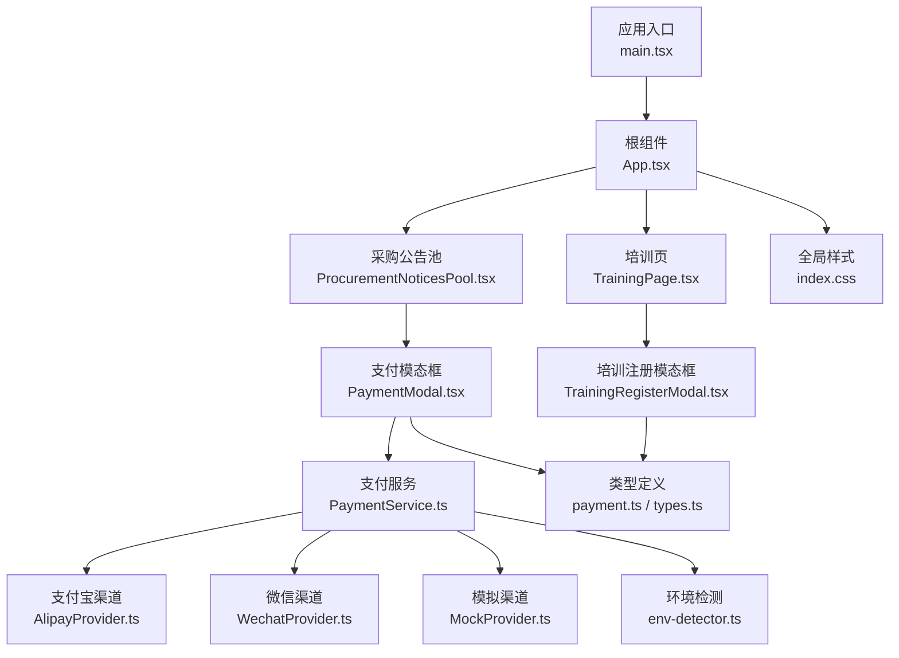
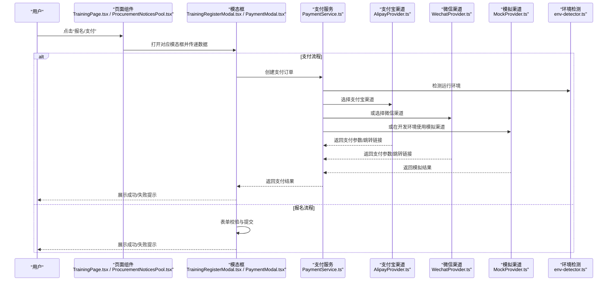
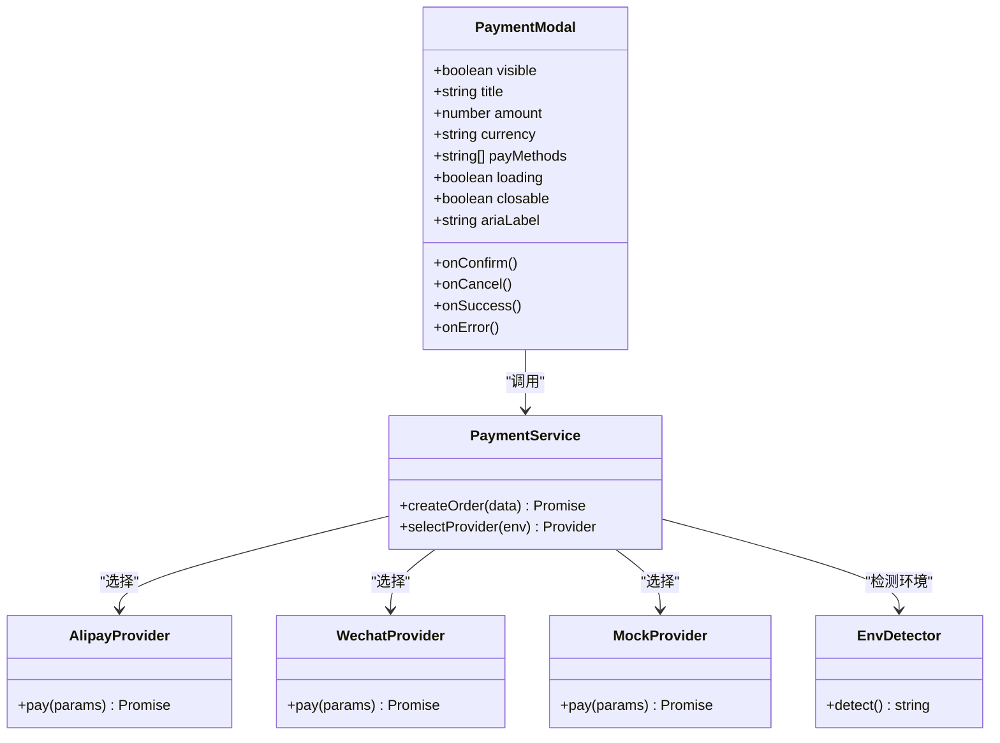
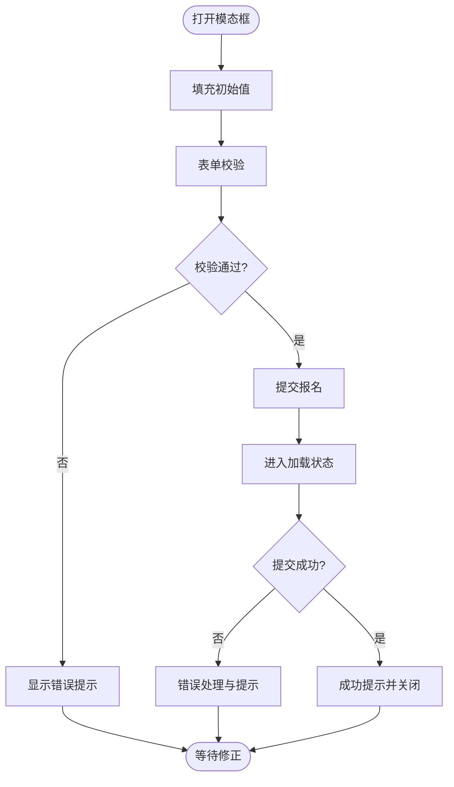
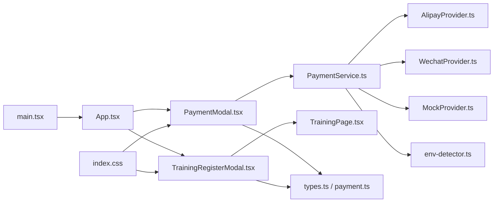

# UI组件库

<cite>
**本文引用的文件**   
- [PaymentModal.tsx](file://src/PaymentModal.tsx)
- [TrainingRegisterModal.tsx](file://src/TrainingRegisterModal.tsx)
- [PaymentService.ts](file://src/payment/PaymentService.ts)
- [AlipayProvider.ts](file://src/payment/AlipayProvider.ts)
- [WechatProvider.ts](file://src/payment/WechatProvider.ts)
- [MockProvider.ts](file://src/payment/MockProvider.ts)
- [env-detector.ts](file://src/payment/env-detector.ts)
- [types.ts](file://src/payment/types.ts)
- [payment.ts](file://src/types/payment.ts)
- [index.css](file://src/index.css)
- [App.tsx](file://src/App.tsx)
- [main.tsx](file://src/main.tsx)
- [TrainingPage.tsx](file://src/TrainingPage.tsx)
- [ProcurementNoticesPool.tsx](file://src/ProcurementNoticesPool.tsx)
- [package.json](file://package.json)
- [vite.config.ts](file://vite.config.ts)
</cite>

## 目录
1. [简介](#简介)
2. [项目结构](#项目结构)
3. [核心组件](#核心组件)
4. [架构总览](#架构总览)
5. [详细组件分析](#详细组件分析)
6. [依赖分析](#依赖分析)
7. [性能考虑](#性能考虑)
8. [故障排查指南](#故障排查指南)
9. [结论](#结论)
10. [附录](#附录)

## 简介
本文件为 Supply OS 的 UI 组件库使用文档，聚焦于支付模态框与培训注册模态框两大核心组件。内容涵盖功能特性、属性配置、交互行为、响应式适配、样式定制、主题支持、可访问性、组合复用策略、集成方式、性能优化建议、浏览器兼容性以及测试与调试最佳实践。读者无需深入源码即可快速上手并高质量集成。

## 项目结构
UI 组件位于 src 目录下，关键文件包括：
- 支付模态框：src/PaymentModal.tsx
- 培训注册模态框：src/TrainingRegisterModal.tsx
- 支付服务与渠道：src/payment/*
- 全局样式：src/index.css
- 应用入口与页面：src/App.tsx, src/main.tsx, src/TrainingPage.tsx, src/ProcurementNoticesPool.tsx

图表来源
- [main.tsx](file://src/main.tsx)
- [App.tsx](file://src/App.tsx)
- [TrainingPage.tsx](file://src/TrainingPage.tsx)
- [ProcurementNoticesPool.tsx](file://src/ProcurementNoticesPool.tsx)
- [PaymentModal.tsx](file://src/PaymentModal.tsx)
- [TrainingRegisterModal.tsx](file://src/TrainingRegisterModal.tsx)
- [PaymentService.ts](file://src/payment/PaymentService.ts)
- [AlipayProvider.ts](file://src/payment/AlipayProvider.ts)
- [WechatProvider.ts](file://src/payment/WechatProvider.ts)
- [MockProvider.ts](file://src/payment/MockProvider.ts)
- [env-detector.ts](file://src/payment/env-detector.ts)
- [payment.ts](file://src/types/payment.ts)
- [types.ts](file://src/payment/types.ts)
- [index.css](file://src/index.css)

章节来源
- [main.tsx](file://src/main.tsx)
- [App.tsx](file://src/App.tsx)
- [TrainingPage.tsx](file://src/TrainingPage.tsx)
- [ProcurementNoticesPool.tsx](file://src/ProcurementNoticesPool.tsx)
- [PaymentModal.tsx](file://src/PaymentModal.tsx)
- [TrainingRegisterModal.tsx](file://src/TrainingRegisterModal.tsx)
- [PaymentService.ts](file://src/payment/PaymentService.ts)
- [AlipayProvider.ts](file://src/payment/AlipayProvider.ts)
- [WechatProvider.ts](file://src/payment/WechatProvider.ts)
- [MockProvider.ts](file://src/payment/MockProvider.ts)
- [env-detector.ts](file://src/payment/env-detector.ts)
- [payment.ts](file://src/types/payment.ts)
- [types.ts](file://src/payment/types.ts)
- [index.css](file://src/index.css)

## 核心组件
本节概述两个核心模态组件的职责与能力边界，便于快速定位与选型。

- 支付模态框（PaymentModal）
  - 职责：承载支付方式选择、订单信息展示、支付发起与结果反馈；与支付服务对接完成下单与回调处理。
  - 关键能力：多渠道支付（支付宝、微信、模拟）、错误提示、加载状态、关闭与确认流程、基础可访问性控制。
  - 典型使用：在采购公告或商品结算流程中触发，传入订单金额、标题、支付方式等数据。

- 培训注册模态框（TrainingRegisterModal）
  - 职责：收集用户报名信息、校验表单、提交注册请求、反馈成功/失败状态。
  - 关键能力：字段校验、必填项提示、提交防抖、成功/失败弹窗、关闭与重置。
  - 典型使用：在培训详情页点击“立即报名”时打开，绑定到培训课程信息与用户上下文。

章节来源
- [PaymentModal.tsx](file://src/PaymentModal.tsx)
- [TrainingRegisterModal.tsx](file://src/TrainingRegisterModal.tsx)

## 架构总览
下图展示了从页面到模态框再到支付服务的调用链路与数据流向。

图表来源
- [TrainingPage.tsx](file://src/TrainingPage.tsx)
- [ProcurementNoticesPool.tsx](file://src/ProcurementNoticesPool.tsx)
- [TrainingRegisterModal.tsx](file://src/TrainingRegisterModal.tsx)
- [PaymentModal.tsx](file://src/PaymentModal.tsx)
- [PaymentService.ts](file://src/payment/PaymentService.ts)
- [AlipayProvider.ts](file://src/payment/AlipayProvider.ts)
- [WechatProvider.ts](file://src/payment/WechatProvider.ts)
- [MockProvider.ts](file://src/payment/MockProvider.ts)
- [env-detector.ts](file://src/payment/env-detector.ts)

## 详细组件分析

### 支付模态框（PaymentModal）
- 功能特性
  - 支付方式选择：支持支付宝、微信、模拟渠道。
  - 订单信息展示：标题、金额、备注等。
  - 支付发起：通过支付服务统一封装，自动选择渠道。
  - 结果反馈：成功、失败、网络异常等状态提示。
  - 可访问性：焦点管理、键盘操作、ARIA 标签。
- 属性配置（示例说明）
  - visible: 是否显示模态框
  - title: 模态框标题
  - amount: 支付金额
  - currency: 币种
  - payMethods: 可选支付方式集合
  - onConfirm: 确认支付回调
  - onCancel: 取消回调
  - onSuccess: 支付成功回调
  - onError: 支付失败回调
  - loading: 加载状态
  - closable: 是否允许外部关闭
  - ariaLabel: 无障碍描述
- 交互行为
  - 打开：渲染订单摘要与支付方式列表。
  - 选择渠道：高亮选中项，禁用未启用渠道。
  - 确认支付：进入 loading，调用支付服务，根据结果更新状态。
  - 关闭：二次确认（可选），清理临时状态。
- 视觉设计规范
  - 布局：顶部标题区、中部订单信息区、底部操作区。
  - 色彩：主色用于按钮与选中态，辅助色用于次级信息，错误色用于失败提示。
  - 间距：遵循 4px 网格系统，行高与字号层级清晰。
  - 图标：渠道 Logo 尺寸一致，保持对齐。
- 响应式适配
  - 移动端：单列布局，按钮全宽，触控区域不小于 44px。
  - 桌面端：双列或三列支付方式排列，居中最大宽度限制。
- 样式定制与主题
  - 提供 CSS 变量覆盖主色、圆角、阴影、字体族等。
  - 支持暗色模式切换，通过类名或媒体查询驱动。
- 可访问性
  - 模态框具备 role="dialog"、aria-modal、aria-labelledby。
  - 首次打开聚焦到标题或第一个交互元素，Esc 关闭。
  - 错误消息使用 aria-live 播报。
- 组合与复用
  - 作为通用支付容器，可与业务订单组件组合。
  - 通过 props 注入不同订单数据与回调，实现跨页面复用。
- 集成要点
  - 在页面中引入并受控渲染，维护 visible 与回调状态。
  - 将支付结果回写至父组件状态，驱动后续流程。
- 代码片段路径
  - [PaymentModal.tsx](file://src/PaymentModal.tsx)
  - [PaymentService.ts](file://src/payment/PaymentService.ts)
  - [AlipayProvider.ts](file://src/payment/AlipayProvider.ts)
  - [WechatProvider.ts](file://src/payment/WechatProvider.ts)
  - [MockProvider.ts](file://src/payment/MockProvider.ts)
  - [env-detector.ts](file://src/payment/env-detector.ts)
  - [payment.ts](file://src/types/payment.ts)
  - [types.ts](file://src/payment/types.ts)

图表来源
- [PaymentModal.tsx](file://src/PaymentModal.tsx)
- [PaymentService.ts](file://src/payment/PaymentService.ts)
- [AlipayProvider.ts](file://src/payment/AlipayProvider.ts)
- [WechatProvider.ts](file://src/payment/WechatProvider.ts)
- [MockProvider.ts](file://src/payment/MockProvider.ts)
- [env-detector.ts](file://src/payment/env-detector.ts)

章节来源
- [PaymentModal.tsx](file://src/PaymentModal.tsx)
- [PaymentService.ts](file://src/payment/PaymentService.ts)
- [AlipayProvider.ts](file://src/payment/AlipayProvider.ts)
- [WechatProvider.ts](file://src/payment/WechatProvider.ts)
- [MockProvider.ts](file://src/payment/MockProvider.ts)
- [env-detector.ts](file://src/payment/env-detector.ts)
- [payment.ts](file://src/types/payment.ts)
- [types.ts](file://src/payment/types.ts)

### 培训注册模态框（TrainingRegisterModal）
- 功能特性
  - 表单字段：姓名、邮箱、手机号、单位、备注等。
  - 表单校验：必填、格式、长度限制，实时错误提示。
  - 提交处理：防抖提交、loading 状态、成功/失败反馈。
  - 关闭与重置：取消后清空表单，避免残留数据。
- 属性配置（示例说明）
  - visible: 是否显示模态框
  - trainingId: 课程标识
  - initialValues: 初始值
  - onSubmit: 提交回调
  - onCancel: 取消回调
  - onSuccess: 成功回调
  - onError: 失败回调
  - loading: 加载状态
  - rules: 自定义校验规则
  - ariaLabel: 无障碍描述
- 交互行为
  - 打开：填充默认值，聚焦首个输入框。
  - 编辑：输入时即时校验，错误提示就近显示。
  - 提交：校验通过后进入 loading，成功后关闭并提示。
  - 关闭：二次确认（可选），重置表单。
- 视觉设计规范
  - 表单栅格：移动端单列，桌面端两列布局。
  - 控件高度：标准 40px，错误态边框与提示文字颜色区分。
  - 文案层级：标题大号加粗，说明文字小号灰色。
- 响应式适配
  - 小屏设备：增大触控区域，减少横向滚动。
  - 大屏设备：合理分配列宽，提升可读性。
- 样式定制与主题
  - 通过 CSS 变量覆盖输入框边框、焦点色、错误色。
  - 支持暗色模式下的对比度调整。
- 可访问性
  - 每个输入框关联 label，错误信息使用 aria-describedby。
  - 键盘导航顺序符合阅读顺序，Tab 键可遍历所有控件。
- 组合与复用
  - 作为通用报名容器，可嵌入不同课程页面。
  - 通过 rules 与 initialValues 实现灵活配置。
- 集成要点
  - 在页面中维护 visible 与表单状态，监听提交结果。
  - 结合路由或通知中心进行后续跳转与提醒。
- 代码片段路径
  - [TrainingRegisterModal.tsx](file://src/TrainingRegisterModal.tsx)
  - [TrainingPage.tsx](file://src/TrainingPage.tsx)

图表来源
- [TrainingRegisterModal.tsx](file://src/TrainingRegisterModal.tsx)
- [TrainingPage.tsx](file://src/TrainingPage.tsx)

章节来源
- [TrainingRegisterModal.tsx](file://src/TrainingRegisterModal.tsx)
- [TrainingPage.tsx](file://src/TrainingPage.tsx)

## 依赖分析
- 组件内聚与耦合
  - 支付模态框与支付服务低耦合，通过接口抽象切换渠道。
  - 培训注册模态框仅依赖本地校验与回调，无外部强依赖。
- 直接依赖
  - PaymentModal 依赖 PaymentService 与渠道提供者。
  - TrainingRegisterModal 依赖表单校验逻辑与业务回调。
- 间接依赖
  - 环境检测影响渠道选择与行为差异。
  - 全局样式影响整体视觉一致性。
- 外部依赖
  - 构建工具与运行时由 package.json 与 vite.config.ts 管理。

图表来源
- [PaymentModal.tsx](file://src/PaymentModal.tsx)
- [TrainingRegisterModal.tsx](file://src/TrainingRegisterModal.tsx)
- [PaymentService.ts](file://src/payment/PaymentService.ts)
- [AlipayProvider.ts](file://src/payment/AlipayProvider.ts)
- [WechatProvider.ts](file://src/payment/WechatProvider.ts)
- [MockProvider.ts](file://src/payment/MockProvider.ts)
- [env-detector.ts](file://src/payment/env-detector.ts)
- [payment.ts](file://src/types/payment.ts)
- [types.ts](file://src/payment/types.ts)
- [App.tsx](file://src/App.tsx)
- [main.tsx](file://src/main.tsx)
- [index.css](file://src/index.css)

章节来源
- [PaymentModal.tsx](file://src/PaymentModal.tsx)
- [TrainingRegisterModal.tsx](file://src/TrainingRegisterModal.tsx)
- [PaymentService.ts](file://src/payment/PaymentService.ts)
- [AlipayProvider.ts](file://src/payment/AlipayProvider.ts)
- [WechatProvider.ts](file://src/payment/WechatProvider.ts)
- [MockProvider.ts](file://src/payment/MockProvider.ts)
- [env-detector.ts](file://src/payment/env-detector.ts)
- [payment.ts](file://src/types/payment.ts)
- [types.ts](file://src/payment/types.ts)
- [App.tsx](file://src/App.tsx)
- [main.tsx](file://src/main.tsx)
- [index.css](file://src/index.css)

## 性能考虑
- 懒加载与按需引入
  - 对大型渠道 SDK 采用动态 import，仅在需要时加载。
- 状态最小化
  - 模态框内部状态尽量局部化，避免不必要的重渲染。
- 事件节流与防抖
  - 输入与提交场景使用防抖，降低高频事件开销。
- 图片与资源优化
  - 渠道 Logo 使用 SVG 或压缩 PNG，按需加载。
- 样式隔离
  - 使用 CSS 变量与模块化样式，减少全局污染与冲突。
- 构建优化
  - 利用 Vite 的代码分割与缓存策略，缩短首屏时间。

[本节为通用指导，不直接分析具体文件]

## 故障排查指南
- 常见问题
  - 支付渠道不可用：检查环境检测与环境变量，确认渠道配置。
  - 表单校验不生效：核对 rules 配置与字段绑定。
  - 模态框无法关闭：检查可见性状态与 onClose 回调是否正确设置。
  - 样式错乱：确认 index.css 是否被正确引入，是否存在覆盖冲突。
- 调试技巧
  - 在支付服务层打印关键参数与返回值，定位渠道问题。
  - 使用浏览器开发者工具的 Network 面板查看请求与响应。
  - 在表单提交前输出校验结果，快速定位错误字段。
- 日志与埋点
  - 记录用户操作路径与错误堆栈，便于复现与分析。
- 可访问性自检
  - 使用屏幕阅读器验证朗读顺序与错误播报。
  - 键盘导航测试确保 Tab/Shift+Tab/Esc 行为符合预期。

章节来源
- [PaymentService.ts](file://src/payment/PaymentService.ts)
- [env-detector.ts](file://src/payment/env-detector.ts)
- [index.css](file://src/index.css)

## 结论
支付模态框与培训注册模态框以清晰的职责边界与良好的扩展性支撑了核心业务流程。通过统一的支付服务抽象与灵活的表单配置，组件具备良好的复用性与可维护性。遵循本文档的视觉规范、可访问性要求与性能建议，可在多端环境中获得一致的体验。

[本节为总结性内容，不直接分析具体文件]

## 附录
- 集成步骤
  - 在页面中引入对应模态框组件，维护 visible 与回调状态。
  - 为支付模态框配置订单数据与支付方式，为报名模态框配置表单规则与初始值。
  - 将成功/失败回调与业务逻辑衔接，完成后续跳转或提示。
- 主题与样式定制
  - 通过 CSS 变量覆盖主色、圆角、阴影、字体族等。
  - 在根节点添加暗色类名以切换主题。
- 浏览器兼容性
  - 现代浏览器（Chrome、Edge、Firefox、Safari）均支持所需 API。
  - 如需兼容旧版浏览器，请引入相应 polyfill 并在构建配置中开启目标版本。
- 测试与调试
  - 单元测试：对支付服务与渠道提供者编写用例，覆盖成功/失败分支。
  - 集成测试：模拟用户操作，验证模态框交互与状态流转。
  - 端到端测试：使用自动化脚本模拟完整流程，确保回归稳定。

章节来源
- [PaymentModal.tsx](file://src/PaymentModal.tsx)
- [TrainingRegisterModal.tsx](file://src/TrainingRegisterModal.tsx)
- [PaymentService.ts](file://src/payment/PaymentService.ts)
- [AlipayProvider.ts](file://src/payment/AlipayProvider.ts)
- [WechatProvider.ts](file://src/payment/WechatProvider.ts)
- [MockProvider.ts](file://src/payment/MockProvider.ts)
- [env-detector.ts](file://src/payment/env-detector.ts)
- [index.css](file://src/index.css)
- [package.json](file://package.json)
- [vite.config.ts](file://vite.config.ts)