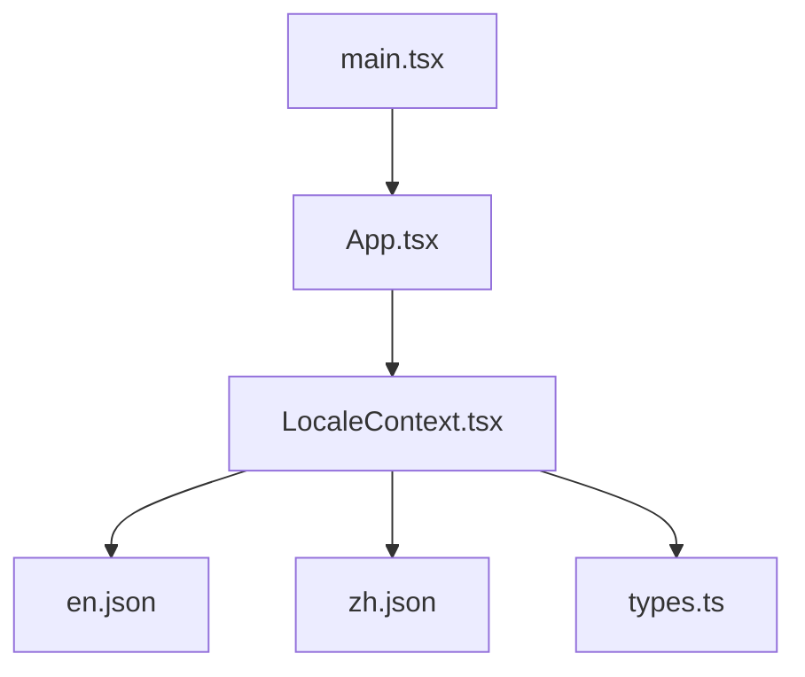
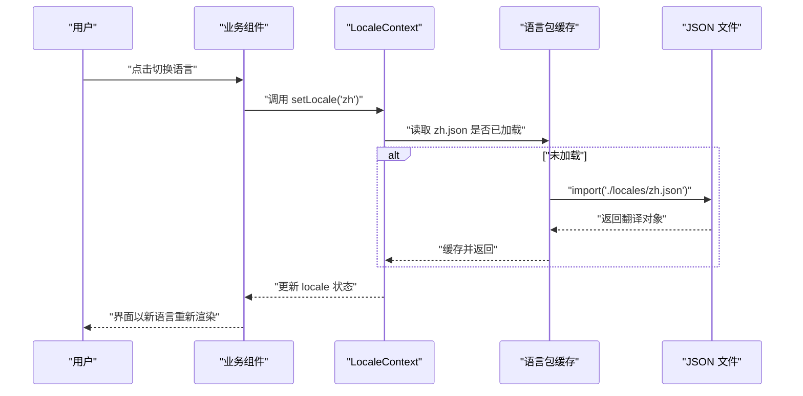
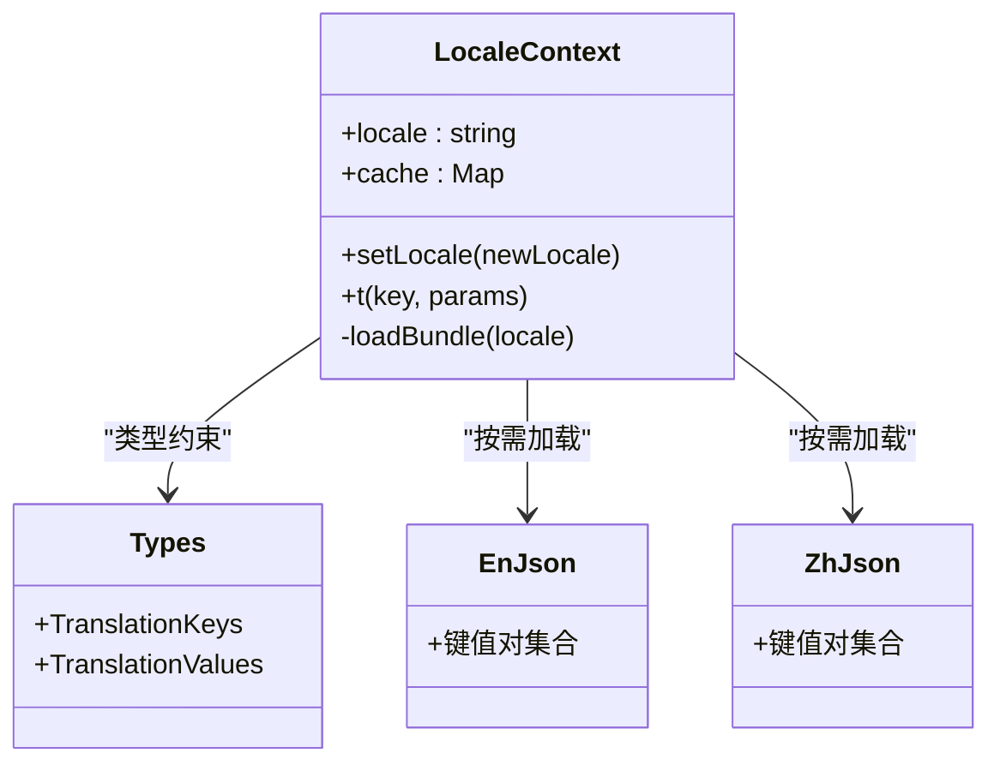
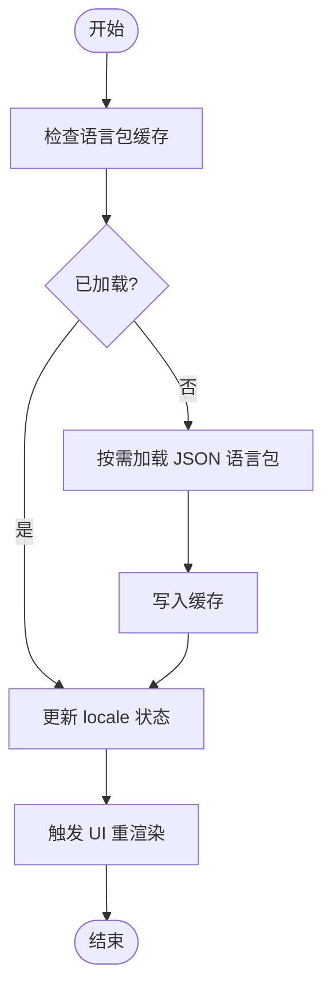
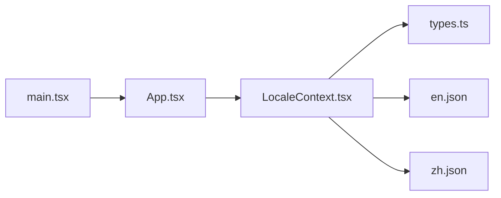

# 国际化系统

<cite>
**本文引用的文件**   
- [src/locales/LocaleContext.tsx](file://src/locales/LocaleContext.tsx)
- [src/locales/en.json](file://src/locales/en.json)
- [src/locales/zh.json](file://src/locales/zh.json)
- [src/locales/types.ts](file://src/locales/types.ts)
- [src/App.tsx](file://src/App.tsx)
- [src/main.tsx](file://src/main.tsx)
</cite>

## 目录
1. [简介](#简介)
2. [项目结构](#项目结构)
3. [核心组件](#核心组件)
4. [架构总览](#架构总览)
5. [详细组件分析](#详细组件分析)
6. [依赖关系分析](#依赖关系分析)
7. [性能考虑](#性能考虑)
8. [故障排查指南](#故障排查指南)
9. [结论](#结论)
10. [附录](#附录)

## 简介
本技术文档面向 Supply OS 的国际化（i18n）子系统，聚焦多语言支持的整体架构与实现细节。文档重点包括：
- LocaleContext 的设计与工作原理
- 语言包组织结构、翻译文件格式规范
- 动态语言切换机制
- 新增语言的完整流程与最佳实践
- 国际化组件使用方式、格式化规则与复数处理建议
- 翻译键管理策略与版本控制方案
- 集成示例与性能优化建议
- 常见问题与解决方案

## 项目结构
国际化相关代码集中在 src/locales 目录下，包含上下文提供者、类型定义与语言包资源；应用入口与根组件负责初始化与注入上下文。

图表来源
- [src/main.tsx:1-200](file://src/main.tsx#L1-L200)
- [src/App.tsx:1-200](file://src/App.tsx#L1-L200)
- [src/locales/LocaleContext.tsx:1-200](file://src/locales/LocaleContext.tsx#L1-L200)
- [src/locales/en.json:1-200](file://src/locales/en.json#L1-L200)
- [src/locales/zh.json:1-200](file://src/locales/zh.json#L1-L200)
- [src/locales/types.ts:1-200](file://src/locales/types.ts#L1-L200)

章节来源
- [src/main.tsx:1-200](file://src/main.tsx#L1-L200)
- [src/App.tsx:1-200](file://src/App.tsx#L1-L200)
- [src/locales/LocaleContext.tsx:1-200](file://src/locales/LocaleContext.tsx#L1-L200)
- [src/locales/en.json:1-200](file://src/locales/en.json#L1-L200)
- [src/locales/zh.json:1-200](file://src/locales/zh.json#L1-L200)
- [src/locales/types.ts:1-200](file://src/locales/types.ts#L1-L200)

## 核心组件
- LocaleContext：提供当前语言、切换语言的能力，并维护已加载的语言包缓存。
- 语言包（en.json、zh.json）：以 JSON 形式组织翻译键值对，按模块或页面维度分层。
- types.ts：为翻译键与值提供 TypeScript 类型约束，确保编译期安全。

章节来源
- [src/locales/LocaleContext.tsx:1-200](file://src/locales/LocaleContext.tsx#L1-L200)
- [src/locales/en.json:1-200](file://src/locales/en.json#L1-L200)
- [src/locales/zh.json:1-200](file://src/locales/zh.json#L1-L200)
- [src/locales/types.ts:1-200](file://src/locales/types.ts#L1-L200)

## 架构总览
整体采用 React Context + 静态 JSON 语言包的轻量方案。应用启动时由根组件注入 LocaleContext，子组件通过 Hook 获取 t 函数进行文本渲染；切换语言时更新状态并触发重渲染。

图表来源
- [src/locales/LocaleContext.tsx:1-200](file://src/locales/LocaleContext.tsx#L1-L200)
- [src/locales/en.json:1-200](file://src/locales/en.json#L1-L200)
- [src/locales/zh.json:1-200](file://src/locales/zh.json#L1-L200)

## 详细组件分析

### LocaleContext 设计与实现
- 职责
  - 维护当前 locale 与已加载语言包缓存
  - 提供 setLocale 方法用于动态切换
  - 暴露 t(key, params?) 函数用于获取翻译文本
- 关键流程
  - 首次访问某语言时按需加载对应 JSON
  - 将结果写入内存缓存，避免重复请求
  - 切换语言后触发 React 状态更新，驱动 UI 刷新
- 错误处理
  - 缺失键时回退到默认语言或键名本身
  - 网络或导入失败时给出降级提示
- 扩展点
  - 可接入后端配置中心或 CDN 分发语言包
  - 可扩展参数插值、复数、日期/数字格式化等能力

图表来源
- [src/locales/LocaleContext.tsx:1-200](file://src/locales/LocaleContext.tsx#L1-L200)
- [src/locales/types.ts:1-200](file://src/locales/types.ts#L1-L200)
- [src/locales/en.json:1-200](file://src/locales/en.json#L1-L200)
- [src/locales/zh.json:1-200](file://src/locales/zh.json#L1-L200)

章节来源
- [src/locales/LocaleContext.tsx:1-200](file://src/locales/LocaleContext.tsx#L1-L200)
- [src/locales/types.ts:1-200](file://src/locales/types.ts#L1-L200)

### 语言包结构与格式规范
- 组织方式
  - 每个语言一个 JSON 文件，文件名即 locale 标识（如 en.json、zh.json）
  - 推荐按模块/页面划分命名空间，例如 navigation、pages.home、pages.settings
- 键命名约定
  - 使用小写英文与下划线分隔，层级用点号连接
  - 保持语义化与一致性，避免缩写歧义
- 值格式
  - 字符串为主，支持占位符（如 {name}），在 t 函数中传入 params 完成插值
  - 复杂文案建议使用数组或嵌套对象便于维护
- 示例路径参考
  - [src/locales/en.json](file://src/locales/en.json)
  - [src/locales/zh.json](file://src/locales/zh.json)

章节来源
- [src/locales/en.json:1-200](file://src/locales/en.json#L1-L200)
- [src/locales/zh.json:1-200](file://src/locales/zh.json#L1-L200)

### 动态语言切换机制
- 触发入口
  - 业务组件通过 Hook 获取 setLocale 并在交互事件中调用
- 执行步骤
  - 校验目标语言是否在可用列表内
  - 若语言包未加载则按需 import 并缓存
  - 更新 context 中的 locale 状态，触发全局重渲染
- 回退策略
  - 当目标语言缺少某个键时，优先回退到默认语言的同键值
  - 仍缺失则返回键名本身，便于定位遗漏

图表来源
- [src/locales/LocaleContext.tsx:1-200](file://src/locales/LocaleContext.tsx#L1-L200)

章节来源
- [src/locales/LocaleContext.tsx:1-200](file://src/locales/LocaleContext.tsx#L1-L200)

### 添加新语言的完整流程与最佳实践
- 步骤
  1. 新增语言包文件（如 ja.json），参照现有语言包结构
  2. 在类型定义中补充新的键类型映射（types.ts）
  3. 在 LocaleContext 中注册新语言（可用语言列表、默认回退逻辑）
  4. 在应用入口或设置页增加语言选择项
  5. 运行构建与测试，验证所有页面文案覆盖
- 最佳实践
  - 先补齐默认语言（如 en）的键，再同步翻译其他语言
  - 使用 lint 或类型检查防止键缺失
  - 对长文案拆分为小块，提升复用与维护性
  - 对敏感或易变文案增加注释说明上下文

章节来源
- [src/locales/types.ts:1-200](file://src/locales/types.ts#L1-L200)
- [src/locales/LocaleContext.tsx:1-200](file://src/locales/LocaleContext.tsx#L1-L200)

### 国际化组件使用、格式化与复数处理
- 使用方式
  - 在任意组件中通过 Hook 获取 t 函数，使用 t("key", params) 渲染文本
  - 对于需要带参数的文案，传入 params 对象完成插值
- 格式化建议
  - 日期/时间：根据 locale 选择本地化库（如 dayjs/locale）进行格式化
  - 数字/货币：使用 Intl.NumberFormat 或本地化库统一处理
- 复数处理
  - 建议在 JSON 中以 key 区分单复数（如 item_count_one、item_count_other）
  - 或在 t 函数中封装复数分支逻辑，依据数量选择对应 key

章节来源
- [src/locales/LocaleContext.tsx:1-200](file://src/locales/LocaleContext.tsx#L1-L200)
- [src/locales/en.json:1-200](file://src/locales/en.json#L1-L200)
- [src/locales/zh.json:1-200](file://src/locales/zh.json#L1-L200)

### 翻译键管理与版本控制
- 键管理策略
  - 集中式命名空间，避免跨模块冲突
  - 建立“键清单”与“缺失键报告”，纳入 CI 流程
- 版本控制
  - 每次发布前对齐各语言包键集，保证无缺失
  - 变更日志记录新增/废弃的键，便于下游同步
- 工具链建议
  - 使用脚本导出/合并键集，生成类型定义
  - 引入 i18n lint 插件，阻止提交含缺失键的代码

章节来源
- [src/locales/types.ts:1-200](file://src/locales/types.ts#L1-L200)
- [src/locales/LocaleContext.tsx:1-200](file://src/locales/LocaleContext.tsx#L1-L200)

### 集成指南与示例路径
- 在根组件中包裹 LocaleContext 提供者
- 在业务组件中使用 Hook 获取 t 与 setLocale
- 示例路径参考
  - [src/App.tsx](file://src/App.tsx)
  - [src/main.tsx](file://src/main.tsx)

章节来源
- [src/App.tsx:1-200](file://src/App.tsx#L1-L200)
- [src/main.tsx:1-200](file://src/main.tsx#L1-L200)

## 依赖关系分析
- 内部依赖
  - App.tsx 依赖 main.tsx 提供的运行时环境
  - LocaleContext 依赖 types.ts 的类型定义与 en.json/zh.json 的资源
- 外部依赖
  - 可选：日期/数字本地化库（如 dayjs、Intl API）
  - 可选：i18n 工具库（如 react-i18next）用于更复杂的场景

图表来源
- [src/main.tsx:1-200](file://src/main.tsx#L1-L200)
- [src/App.tsx:1-200](file://src/App.tsx#L1-L200)
- [src/locales/LocaleContext.tsx:1-200](file://src/locales/LocaleContext.tsx#L1-L200)
- [src/locales/types.ts:1-200](file://src/locales/types.ts#L1-L200)
- [src/locales/en.json:1-200](file://src/locales/en.json#L1-L200)
- [src/locales/zh.json:1-200](file://src/locales/zh.json#L1-L200)

章节来源
- [src/main.tsx:1-200](file://src/main.tsx#L1-L200)
- [src/App.tsx:1-200](file://src/App.tsx#L1-L200)
- [src/locales/LocaleContext.tsx:1-200](file://src/locales/LocaleContext.tsx#L1-L200)
- [src/locales/types.ts:1-200](file://src/locales/types.ts#L1-L200)
- [src/locales/en.json:1-200](file://src/locales/en.json#L1-L200)
- [src/locales/zh.json:1-200](file://src/locales/zh.json#L1-L200)

## 性能考虑
- 按需加载
  - 仅在首次访问某语言时加载对应 JSON，减少首屏体积
- 缓存策略
  - 内存级缓存已加载语言包，避免重复请求
- 渲染优化
  - 仅受 locale 影响的最小范围组件订阅上下文，避免整树重渲染
- 资源优化
  - 压缩 JSON 资源，启用浏览器缓存
  - 对大型语言包考虑分片加载或懒加载

[本节为通用指导，不直接分析具体文件]

## 故障排查指南
- 现象：切换语言后部分文案未更新
  - 排查：确认组件是否正确从上下文获取 t/setLocale，是否存在闭包捕获旧值
- 现象：出现缺失键警告或显示键名
  - 排查：检查语言包是否包含该键，或回退逻辑是否生效
- 现象：切换语言卡顿
  - 排查：是否重复加载语言包，是否对大对象频繁创建引用
- 现象：构建时报类型错误
  - 排查：types.ts 是否与语言包键集保持一致，必要时运行类型生成脚本

章节来源
- [src/locales/LocaleContext.tsx:1-200](file://src/locales/LocaleContext.tsx#L1-L200)
- [src/locales/types.ts:1-200](file://src/locales/types.ts#L1-L200)

## 结论
本国际化方案以 React Context 为核心，结合静态 JSON 语言包与按需加载，实现了简洁、可扩展的多语言支持。通过严格的键类型约束与回退策略，保障了开发体验与运行稳定性。后续可在格式化、复数、服务端下发语言包等方面持续演进，以满足更大规模的业务需求。

[本节为总结性内容，不直接分析具体文件]

## 附录
- 快速上手
  - 在组件中使用 Hook 获取 t 与 setLocale
  - 在 JSON 中按模块组织键，保持命名一致
- 参考路径
  - [src/locales/LocaleContext.tsx](file://src/locales/LocaleContext.tsx)
  - [src/locales/types.ts](file://src/locales/types.ts)
  - [src/locales/en.json](file://src/locales/en.json)
  - [src/locales/zh.json](file://src/locales/zh.json)
  - [src/App.tsx](file://src/App.tsx)
  - [src/main.tsx](file://src/main.tsx)