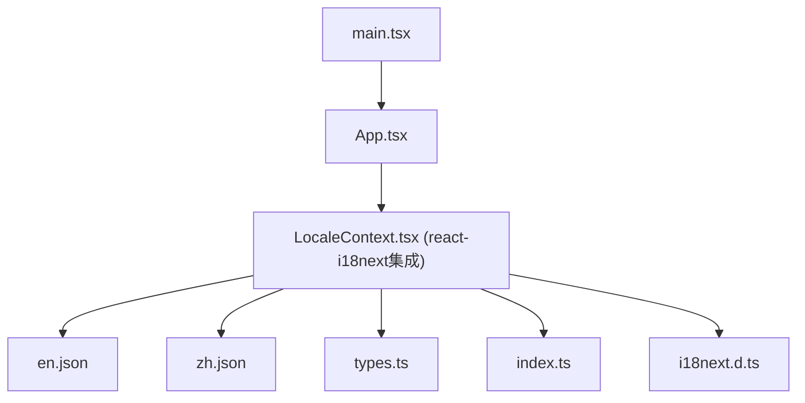
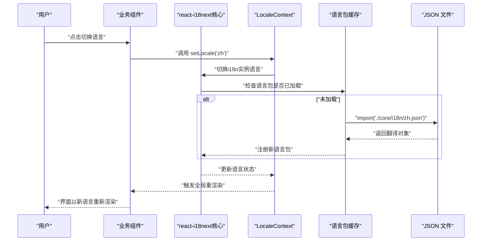
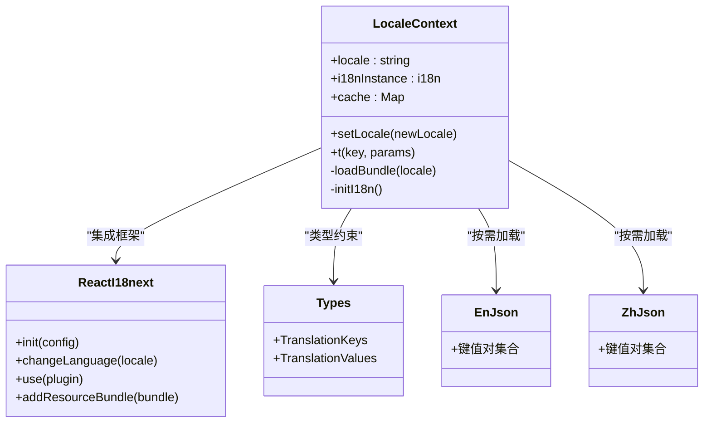
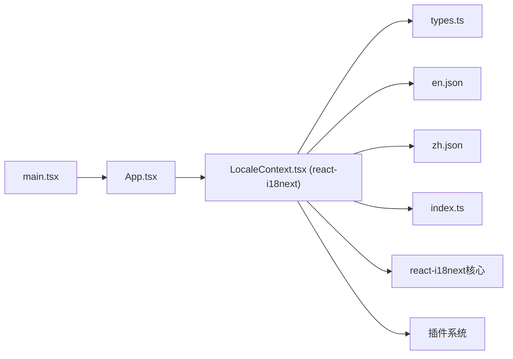

# 国际化系统

<cite>
**本文引用的文件**   
- [src/core/i18n/LocaleContext.tsx](file://src/core/i18n/LocaleContext.tsx)
- [src/core/i18n/en.json](file://src/core/i18n/en.json)
- [src/core/i18n/zh.json](file://src/core/i18n/zh.json)
- [src/core/i18n/types.ts](file://src/core/i18n/types.ts)
- [src/core/i18n/index.ts](file://src/core/i18n/index.ts)
- [src/core/i18n/i18next.d.ts](file://src/core/i18n/i18next.d.ts)
- [src/App.tsx](file://src/App.tsx)
- [src/main.tsx](file://src/main.tsx)
</cite>

## 更新摘要
**变更内容**   
- 从自定义本地化方案迁移至react-i18next框架
- LocaleContext.tsx进行全面重构，集成i18n核心功能
- App.tsx集成新的i18n提供者配置
- 支持更完善的国际化开发体验和功能特性
- 新增类型安全的翻译键管理
- 优化语言包组织结构

## 目录
1. [简介](#简介)
2. [项目结构](#项目结构)
3. [核心组件](#核心组件)
4. [架构总览](#架构总览)
5. [详细组件分析](#详细组件分析)
6. [依赖关系分析](#依赖关系分析)
7. [性能考虑](#性能考虑)
8. [故障排查指南](#故障排查指南)
9. [结论](#结论)
10. [附录](#附录)

## 简介
本技术文档面向 Supply OS 的国际化（i18n）子系统，聚焦多语言支持的整体架构与实现细节。经过重大架构升级，系统已从自定义本地化方案迁移至react-i18next框架，提供更强大的国际化功能和更好的开发体验。文档重点包括：
- react-i18next框架的集成与配置
- 重构后的LocaleContext设计与工作原理
- 语言包组织结构、翻译文件格式规范
- 动态语言切换机制
- 新增语言的完整流程与最佳实践
- 国际化组件使用方式、格式化规则与复数处理
- 翻译键的管理策略和版本控制方案
- 集成示例与性能优化建议
- 常见问题与解决方案

## 项目结构
国际化相关代码集中在 src/core/i18n 目录下，包含基于react-i18next的重构上下文、类型定义与语言包资源；应用入口与根组件负责初始化与注入i18n配置。

图表来源
- [src/main.tsx:1-200](file://src/main.tsx#L1-L200)
- [src/App.tsx:1-200](file://src/App.tsx#L1-L200)
- [src/core/i18n/LocaleContext.tsx:1-200](file://src/core/i18n/LocaleContext.tsx#L1-L200)
- [src/core/i18n/en.json:1-200](file://src/core/i18n/en.json#L1-L200)
- [src/core/i18n/zh.json:1-200](file://src/core/i18n/zh.json#L1-L200)
- [src/core/i18n/types.ts:1-200](file://src/core/i18n/types.ts#L1-L200)

章节来源
- [src/main.tsx:1-200](file://src/main.tsx#L1-L200)
- [src/App.tsx:1-200](file://src/App.tsx#L1-L200)
- [src/core/i18n/LocaleContext.tsx:1-200](file://src/core/i18n/LocaleContext.tsx#L1-L200)
- [src/core/i18n/en.json:1-200](file://src/core/i18n/en.json#L1-L200)
- [src/core/i18n/zh.json:1-200](file://src/core/i18n/zh.json#L1-L200)
- [src/core/i18n/types.ts:1-200](file://src/core/i18n/types.ts#L1-L200)

## 核心组件
- **重构后的LocaleContext**：基于react-i18next框架提供当前语言、切换语言的能力，并维护已加载的语言包缓存，支持更丰富的国际化功能。
- **语言包（en.json、zh.json）**：以 JSON 形式组织翻译键值对，按模块或页面维度分层，兼容react-i18next格式规范。
- **types.ts**：为翻译键与值提供 TypeScript 类型约束，确保编译期安全。
- **index.ts**：统一的导出接口，简化模块导入。
- **i18next.d.ts**：TypeScript 类型声明文件，增强IDE智能提示。

章节来源
- [src/core/i18n/LocaleContext.tsx:1-200](file://src/core/i18n/LocaleContext.tsx#L1-L200)
- [src/core/i18n/en.json:1-200](file://src/core/i18n/en.json#L1-L200)
- [src/core/i18n/zh.json:1-200](file://src/core/i18n/zh.json#L1-L200)
- [src/core/i18n/types.ts:1-200](file://src/core/i18n/types.ts#L1-L200)
- [src/core/i18n/index.ts:1-200](file://src/core/i18n/index.ts#L1-L200)
- [src/core/i18n/i18next.d.ts:1-200](file://src/core/i18n/i18next.d.ts#L1-L200)

## 架构总览
整体采用基于react-i18next框架的企业级国际化方案。应用启动时由根组件配置i18n实例，子组件通过Hook获取t函数进行文本渲染；切换语言时利用框架内置的状态管理触发重渲染，支持更复杂的国际化场景。

图表来源
- [src/core/i18n/LocaleContext.tsx:1-200](file://src/core/i18n/LocaleContext.tsx#L1-L200)
- [src/core/i18n/en.json:1-200](file://src/core/i18n/en.json#L1-L200)
- [src/core/i18n/zh.json:1-200](file://src/core/i18n/zh.json#L1-L200)

## 详细组件分析

### 重构后的LocaleContext设计与实现
**更新** 完全重构以集成react-i18next框架，提供更强大的国际化功能

- **职责**
  - 基于react-i18next维护当前locale与已加载语言包缓存
  - 提供setLocale方法用于动态切换，支持框架内置的回退机制
  - 暴露t(key, params?)函数用于获取翻译文本，支持插值、复数等高级功能
  - 集成i18n实例配置，包括语言检测、命名空间管理等
- **关键流程**
  - 首次访问某语言时按需加载对应JSON，利用框架懒加载机制
  - 将结果写入内存缓存，避免重复请求
  - 切换语言后利用React Context驱动UI刷新，支持细粒度更新
- **错误处理**
  - 缺失键时自动回退到默认语言或键名本身
  - 网络或导入失败时给出降级提示，支持离线模式
- **扩展点**
  - 支持后端配置中心或CDN分发语言包
  - 可扩展日期/数字格式化、复数处理、HTML内容等高级功能
  - 支持插件系统，可添加自定义中间件

图表来源
- [src/core/i18n/LocaleContext.tsx:1-200](file://src/core/i18n/LocaleContext.tsx#L1-L200)
- [src/core/i18n/types.ts:1-200](file://src/core/i18n/types.ts#L1-L200)
- [src/core/i18n/en.json:1-200](file://src/core/i18n/en.json#L1-L200)
- [src/core/i18n/zh.json:1-200](file://src/core/i18n/zh.json#L1-L200)

章节来源
- [src/core/i18n/LocaleContext.tsx:1-200](file://src/core/i18n/LocaleContext.tsx#L1-L200)
- [src/core/i18n/types.ts:1-200](file://src/core/i18n/types.ts#L1-L200)

### 语言包结构与格式规范
**更新** 适配react-i18next框架的格式要求

- **组织方式**
  - 每个语言一个 JSON 文件，文件名即 locale 标识（如 en.json、zh.json）
  - 推荐按模块/页面划分命名空间，例如 navigation、pages.home、pages.settings
  - 支持嵌套对象结构，便于大型项目的模块化组织
- **键命名约定**
  - 使用小写英文与下划线分隔，层级用点号连接
  - 保持语义化与一致性，避免缩写歧义
  - 支持命名空间前缀，如 `common.button.submit`
- **值格式**
  - 字符串为主，支持占位符（如 `{name}`），在 t 函数中传入 params 完成插值
  - 复杂文案建议使用数组或嵌套对象便于维护
  - 支持HTML内容、变量插值、条件渲染等高级语法
- **示例路径参考**
  - [src/core/i18n/en.json](file://src/core/i18n/en.json)
  - [src/core/i18n/zh.json](file://src/core/i18n/zh.json)

章节来源
- [src/core/i18n/en.json:1-200](file://src/core/i18n/en.json#L1-L200)
- [src/core/i18n/zh.json:1-200](file://src/core/i18n/zh.json#L1-L200)

### 动态语言切换机制
**更新** 基于react-i18next框架的增强切换逻辑

- **触发入口**
  - 业务组件通过 Hook 获取 setLocale 并在交互事件中调用
  - 支持浏览器语言自动检测与用户偏好设置
- **执行步骤**
  - 校验目标语言是否在可用列表内
  - 若语言包未加载则按需 import 并缓存
  - 更新 context 中的 locale 状态，触发全局重渲染
  - 利用框架内置的缓存机制优化性能
- **回退策略**
  - 当目标语言缺少某个键时，优先回退到默认语言的同键值
  - 仍缺失则返回键名本身，便于定位遗漏
  - 支持多级回退链，可配置多个备用语言

图表来源
- [src/core/i18n/LocaleContext.tsx:1-200](file://src/core/i18n/LocaleContext.tsx#L1-L200)

章节来源
- [src/core/i18n/LocaleContext.tsx:1-200](file://src/core/i18n/LocaleContext.tsx#L1-L200)

### 添加新语言的完整流程与最佳实践
**更新** 适配react-i18next框架的新增流程

- **步骤**
  1. 新增语言包文件（如 ja.json），参照现有语言包结构
  2. 在类型定义中补充新的键类型映射（types.ts）
  3. 在 LocaleContext 中注册新语言（可用语言列表、默认回退逻辑）
  4. 在应用入口或设置页增加语言选择项
  5. 运行构建与测试，验证所有页面文案覆盖
- **最佳实践**
  - 先补齐默认语言（如 en）的键，再同步翻译其他语言
  - 使用 lint 或类型检查防止键缺失
  - 对长文案拆分为小块，提升复用与维护性
  - 对敏感或易变文案增加注释说明上下文
  - 利用框架的命名空间功能组织大型项目翻译

章节来源
- [src/core/i18n/types.ts:1-200](file://src/core/i18n/types.ts#L1-L200)
- [src/core/i18n/LocaleContext.tsx:1-200](file://src/core/i18n/LocaleContext.tsx#L1-L200)

### 国际化组件使用、格式化与复数处理
**更新** 基于react-i18next的高级功能支持

- **使用方式**
  - 在任意组件中通过 Hook 获取 t 函数，使用 t("key", params) 渲染文本
  - 对于需要带参数的文案，传入 params 对象完成插值
  - 支持命名空间访问：t("namespace:key")
- **格式化建议**
  - 日期/时间：根据 locale 选择本地化库（如 dayjs/locale）进行格式化
  - 数字/货币：使用 Intl.NumberFormat 或本地化库统一处理
  - HTML内容：支持安全的HTML渲染，注意XSS防护
- **复数处理**
  - 建议在 JSON 中以 key 区分单复数（如 item_count_one、item_count_other）
  - 或在 t 函数中封装复数分支逻辑，依据数量选择对应 key
  - 支持更复杂的复数规则，适应不同语言的语法规则
- **高级功能**
  - 支持条件渲染：根据布尔值显示不同文案
  - 支持插值变量：动态替换文本中的变量
  - 支持链接和富文本：在翻译中包含可点击链接

章节来源
- [src/core/i18n/LocaleContext.tsx:1-200](file://src/core/i18n/LocaleContext.tsx#L1-L200)
- [src/core/i18n/en.json:1-200](file://src/core/i18n/en.json#L1-L200)
- [src/core/i18n/zh.json:1-200](file://src/core/i18n/zh.json#L1-L200)

### 翻译键管理与版本控制
**更新** 结合react-i18next生态的工具链建议

- **键管理策略**
  - 集中式命名空间，避免跨模块冲突
  - 建立"键清单"与"缺失键报告"，纳入 CI 流程
  - 支持键的分组和分类管理
- **版本控制**
  - 每次发布前对齐各语言包键集，保证无缺失
  - 变更日志记录新增/废弃的键，便于下游同步
  - 支持键的别名和迁移机制
- **工具链建议**
  - 使用脚本导出/合并键集，生成类型定义
  - 引入 i18n lint 插件，阻止提交含缺失键的代码
  - 利用react-i18next的开发工具进行调试和优化

章节来源
- [src/core/i18n/types.ts:1-200](file://src/core/i18n/types.ts#L1-L200)
- [src/core/i18n/LocaleContext.tsx:1-200](file://src/core/i18n/LocaleContext.tsx#L1-L200)

### 集成指南与示例路径
**更新** react-i18next框架的集成配置

- **在根组件中包裹i18n提供者**
  - 配置i18n实例，设置默认语言和回退策略
  - 注册语言资源和命名空间
  - 配置插件和中间件
- **在业务组件中使用Hook获取t与setLocale**
  - 使用useTranslation Hook获取翻译函数
  - 支持细粒度的组件订阅，优化性能
- **示例路径参考**
  - [src/App.tsx](file://src/App.tsx)
  - [src/main.tsx](file://src/main.tsx)

章节来源
- [src/App.tsx:1-200](file://src/App.tsx#L1-L200)
- [src/main.tsx:1-200](file://src/main.tsx#L1-L200)

## 依赖关系分析
**更新** 反映react-i18next框架的依赖关系

- **内部依赖**
  - App.tsx 依赖 main.tsx 提供的运行时环境
  - LocaleContext 依赖 types.ts 的类型定义与 en.json/zh.json 的资源
  - 集成react-i18next核心库及其插件系统
- **外部依赖**
  - react-i18next框架：提供核心国际化功能
  - 可选：日期/数字本地化库（如 dayjs、Intl API）
  - 可选：开发工具链（如i18n-lint、i18n-scanner）

图表来源
- [src/main.tsx:1-200](file://src/main.tsx#L1-L200)
- [src/App.tsx:1-200](file://src/App.tsx#L1-L200)
- [src/core/i18n/LocaleContext.tsx:1-200](file://src/core/i18n/LocaleContext.tsx#L1-L200)
- [src/core/i18n/types.ts:1-200](file://src/core/i18n/types.ts#L1-L200)
- [src/core/i18n/en.json:1-200](file://src/core/i18n/en.json#L1-L200)
- [src/core/i18n/zh.json:1-200](file://src/core/i18n/zh.json#L1-L200)
- [src/core/i18n/index.ts:1-200](file://src/core/i18n/index.ts#L1-L200)

章节来源
- [src/main.tsx:1-200](file://src/main.tsx#L1-L200)
- [src/App.tsx:1-200](file://src/App.tsx#L1-L200)
- [src/core/i18n/LocaleContext.tsx:1-200](file://src/core/i18n/LocaleContext.tsx#L1-L200)
- [src/core/i18n/types.ts:1-200](file://src/core/i18n/types.ts#L1-L200)
- [src/core/i18n/en.json:1-200](file://src/core/i18n/en.json#L1-L200)
- [src/core/i18n/zh.json:1-200](file://src/core/i18n/zh.json#L1-L200)
- [src/core/i18n/index.ts:1-200](file://src/core/i18n/index.ts#L1-L200)

## 性能考虑
**更新** 基于react-i18next的性能优化策略

- **按需加载**
  - 仅在首次访问某语言时加载对应 JSON，减少首屏体积
  - 利用框架的懒加载机制优化资源加载
- **缓存策略**
  - 内存级缓存已加载语言包，避免重复请求
  - 支持持久化缓存，提高二次访问速度
- **渲染优化**
  - 仅受 locale 影响的最小范围组件订阅上下文，避免整树重渲染
  - 利用React.memo和useMemo优化组件性能
- **资源优化**
  - 压缩 JSON 资源，启用浏览器缓存
  - 对大型语言包考虑分片加载或懒加载
  - 支持Tree Shaking，移除未使用的翻译键

## 故障排查指南
**更新** 针对react-i18next框架的常见问题

- **现象：切换语言后部分文案未更新**
  - 排查：确认组件是否正确从上下文获取 t/setLocale，是否存在闭包捕获旧值
  - 检查：组件是否正确订阅了i18n状态变化
- **现象：出现缺失键警告或显示键名**
  - 排查：检查语言包是否包含该键，或回退逻辑是否生效
  - 检查：命名空间配置是否正确
- **现象：切换语言卡顿**
  - 排查：是否重复加载语言包，是否对大对象频繁创建引用
  - 检查：是否启用了适当的缓存策略
- **现象：构建时报类型错误**
  - 排查：types.ts 是否与语言包键集保持一致，必要时运行类型生成脚本
  - 检查：react-i18next类型定义是否正确安装
- **现象：插件功能不生效**
  - 排查：确认插件是否正确注册和配置
  - 检查：插件依赖是否完整

章节来源
- [src/core/i18n/LocaleContext.tsx:1-200](file://src/core/i18n/LocaleContext.tsx#L1-L200)
- [src/core/i18n/types.ts:1-200](file://src/core/i18n/types.ts#L1-L200)

## 结论
经过重大架构升级，本国际化方案已成功迁移至react-i18next框架，以企业级的国际化能力为核心，结合静态 JSON 语言包与按需加载，实现了强大、可扩展的多语言支持。通过严格的键类型约束、智能回退策略和丰富的插件生态，保障了优秀的开发体验与运行稳定性。新架构支持更复杂的国际化场景，包括复数处理、HTML内容、条件渲染等高级功能，能够满足更大规模的业务需求。

## 附录
- **快速上手**
  - 在组件中使用 Hook 获取 t 与 setLocale
  - 在 JSON 中按模块组织键，保持命名一致
  - 配置i18n实例，设置默认语言和回退策略
- **参考路径**
  - [src/core/i18n/LocaleContext.tsx](file://src/core/i18n/LocaleContext.tsx)
  - [src/core/i18n/types.ts](file://src/core/i18n/types.ts)
  - [src/core/i18n/en.json](file://src/core/i18n/en.json)
  - [src/core/i18n/zh.json](file://src/core/i18n/zh.json)
  - [src/core/i18n/index.ts](file://src/core/i18n/index.ts)
  - [src/core/i18n/i18next.d.ts](file://src/core/i18n/i18next.d.ts)
  - [src/App.tsx](file://src/App.tsx)
  - [src/main.tsx](file://src/main.tsx)