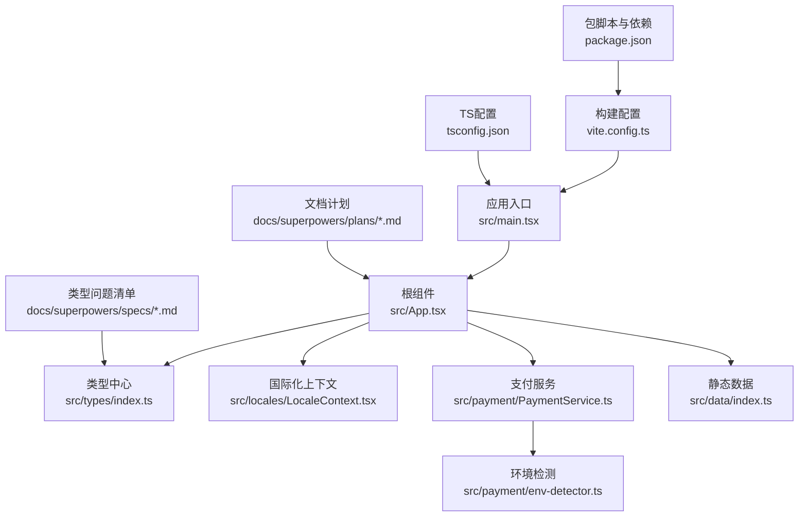
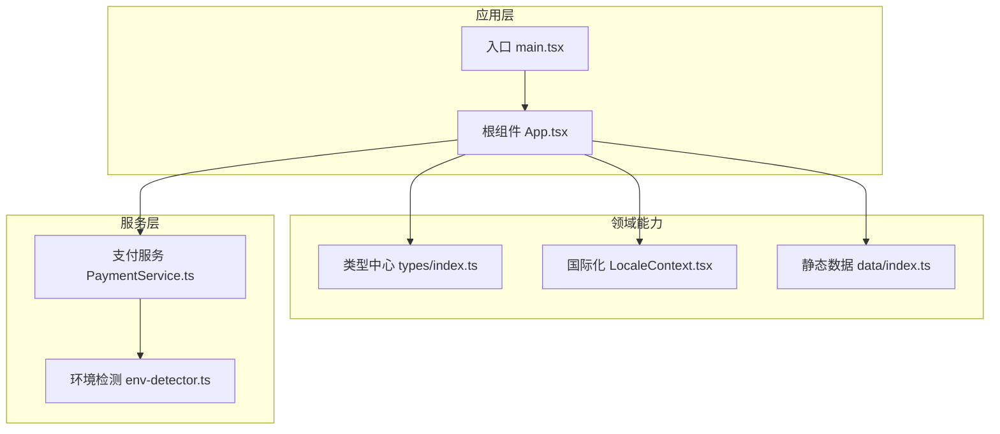
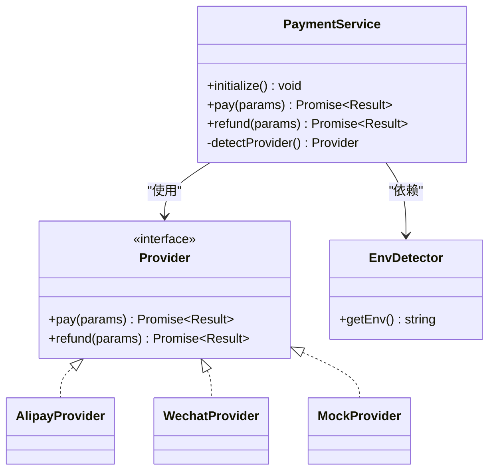
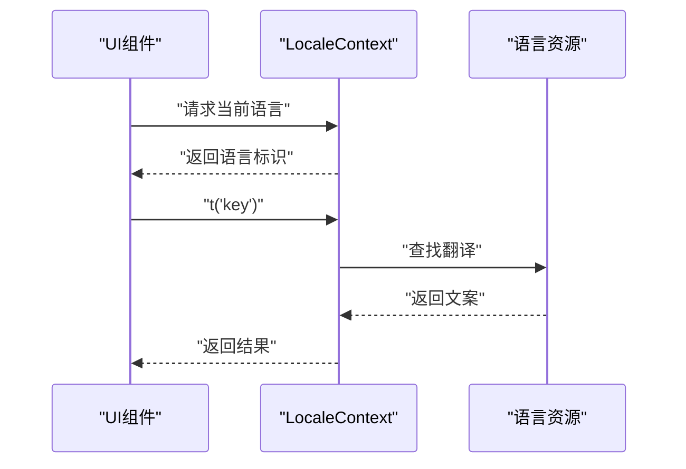
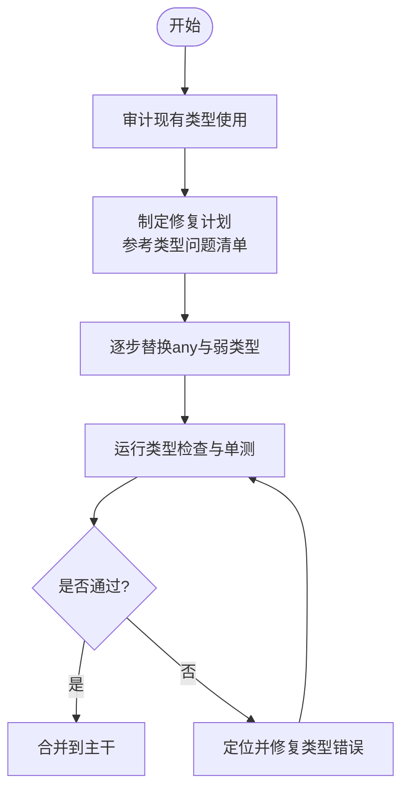
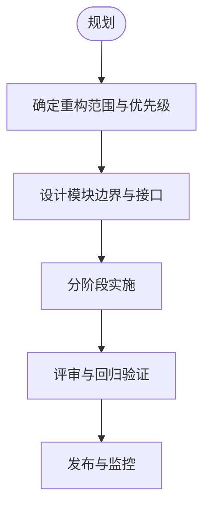
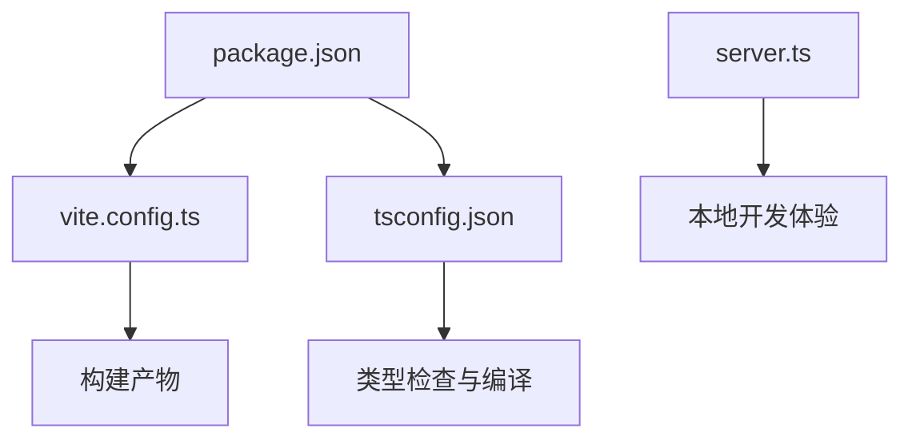

# 开发指南

<cite>
**本文引用的文件**   
- [README.md](file://README.md)
- [package.json](file://package.json)
- [tsconfig.json](file://tsconfig.json)
- [vite.config.ts](file://vite.config.ts)
- [server.ts](file://server.ts)
- [src/main.tsx](file://src/main.tsx)
- [src/App.tsx](file://src/App.tsx)
- [src/types/index.ts](file://src/types/index.ts)
- [src/locales/LocaleContext.tsx](file://src/locales/LocaleContext.tsx)
- [src/payment/PaymentService.ts](file://src/payment/PaymentService.ts)
- [src/payment/env-detector.ts](file://src/payment/env-detector.ts)
- [src/data/index.ts](file://src/data/index.ts)
- [docs/superpowers/plans/2026-07-21-frontend-modular-refactor-plan.md](file://docs/superpowers/plans/2026-07-21-frontend-modular-refactor-plan.md)
- [docs/superpowers/specs/2026-07-21-phase1-types-issues.md](file://docs/superpowers/specs/2026-07-21-phase1-types-issues.md)
</cite>

## 目录
1. [简介](#简介)
2. [项目结构](#项目结构)
3. [核心组件](#核心组件)
4. [架构总览](#架构总览)
5. [详细组件分析](#详细组件分析)
6. [依赖分析](#依赖分析)
7. [性能考虑](#性能考虑)
8. [故障排查指南](#故障排查指南)
9. [结论](#结论)
10. [附录](#附录)

## 简介
本指南面向Supply OS前端与全栈协作开发者，目标是建立统一的代码规范、命名约定与最佳实践，明确模块化重构计划与类型问题修复的实施路径，定义Git工作流、分支策略与代码审查标准，并提供单元测试、集成测试与性能测试方法。同时涵盖调试技巧、日志记录与错误追踪机制，以及新功能开发的完整流程与模板代码位置指引。

## 项目结构
仓库采用以功能域为维度的组织方式：
- src/types：领域类型集中管理，便于跨模块复用与一致性校验
- src/locales：国际化上下文与资源文件
- src/payment：支付能力抽象与多提供者实现
- src/data：静态数据与示例数据
- public/downloads/training：培训资料下载资源
- docs/superplans/specs：重构计划与阶段任务说明
- server.ts：本地开发服务入口（如需要）
- vite.config.ts：构建与开发服务器配置
- tsconfig.json：TypeScript编译选项
- package.json：脚本、依赖与元信息

图表来源
- [src/main.tsx:1-50](file://src/main.tsx#L1-L50)
- [src/App.tsx:1-80](file://src/App.tsx#L1-L80)
- [src/types/index.ts:1-120](file://src/types/index.ts#L1-L120)
- [src/locales/LocaleContext.tsx:1-120](file://src/locales/LocaleContext.tsx#L1-L120)
- [src/payment/PaymentService.ts:1-120](file://src/payment/PaymentService.ts#L1-L120)
- [src/payment/env-detector.ts:1-80](file://src/payment/env-detector.ts#L1-L80)
- [src/data/index.ts:1-60](file://src/data/index.ts#L1-L60)
- [vite.config.ts:1-120](file://vite.config.ts#L1-L120)
- [tsconfig.json:1-80](file://tsconfig.json#L1-L80)
- [package.json:1-120](file://package.json#L1-L120)
- [docs/superpowers/plans/2026-07-21-frontend-modular-refactor-plan.md:1-200](file://docs/superpowers/plans/2026-07-21-frontend-modular-refactor-plan.md#L1-L200)
- [docs/superpowers/specs/2026-07-21-phase1-types-issues.md:1-200](file://docs/superpowers/specs/2026-07-21-phase1-types-issues.md#L1-L200)

章节来源
- [README.md:1-120](file://README.md#L1-L120)
- [package.json:1-120](file://package.json#L1-L120)
- [tsconfig.json:1-80](file://tsconfig.json#L1-L80)
- [vite.config.ts:1-120](file://vite.config.ts#L1-L120)
- [server.ts:1-120](file://server.ts#L1-L120)
- [src/main.tsx:1-50](file://src/main.tsx#L1-L50)
- [src/App.tsx:1-80](file://src/App.tsx#L1-L80)
- [src/types/index.ts:1-120](file://src/types/index.ts#L1-L120)
- [src/locales/LocaleContext.tsx:1-120](file://src/locales/LocaleContext.tsx#L1-L120)
- [src/payment/PaymentService.ts:1-120](file://src/payment/PaymentService.ts#L1-L120)
- [src/payment/env-detector.ts:1-80](file://src/payment/env-detector.ts#L1-L80)
- [src/data/index.ts:1-60](file://src/data/index.ts#L1-L60)
- [docs/superpowers/plans/2026-07-21-frontend-modular-refactor-plan.md:1-200](file://docs/superpowers/plans/2026-07-21-frontend-modular-refactor-plan.md#L1-L200)
- [docs/superpowers/specs/2026-07-21-phase1-types-issues.md:1-200](file://docs/superpowers/specs/2026-07-21-phase1-types-issues.md#L1-L200)

## 核心组件
- 应用入口与根组件
  - 入口负责初始化渲染与全局上下文挂载；根组件编排页面路由、状态与子模块装配。
  - 建议将业务无关的初始化逻辑下沉至独立模块，保持App职责单一。
- 类型中心
  - 统一导出领域模型、接口契约与枚举，避免重复定义与不一致。
  - 所有新增类型应在此处注册并附带注释说明用途与约束。
- 国际化上下文
  - 提供语言切换与消息解析能力，组件通过上下文消费文案。
  - 新增文案需同步更新对应语言文件，确保键名一致。
- 支付服务
  - 抽象支付接口，按环境或配置选择具体提供者，屏蔽差异。
  - 新增支付方式时，遵循适配器模式扩展，不修改既有调用方。
- 静态数据
  - 用于演示与占位，生产环境应从后端或配置中心获取。
  - 数据变更需保留版本标记与迁移说明。

章节来源
- [src/main.tsx:1-50](file://src/main.tsx#L1-L50)
- [src/App.tsx:1-80](file://src/App.tsx#L1-L80)
- [src/types/index.ts:1-120](file://src/types/index.ts#L1-L120)
- [src/locales/LocaleContext.tsx:1-120](file://src/locales/LocaleContext.tsx#L1-L120)
- [src/payment/PaymentService.ts:1-120](file://src/payment/PaymentService.ts#L1-L120)
- [src/data/index.ts:1-60](file://src/data/index.ts#L1-L60)

## 架构总览
系统采用“薄入口 + 强类型 + 可插拔服务”的前端架构：
- 入口层：main.tsx负责启动与全局注入
- 应用层：App.tsx编排视图与上下文
- 领域层：types、data、locales等提供基础能力
- 服务层：payment等按能力拆分，支持环境适配与扩展

图表来源
- [src/main.tsx:1-50](file://src/main.tsx#L1-L50)
- [src/App.tsx:1-80](file://src/App.tsx#L1-L80)
- [src/types/index.ts:1-120](file://src/types/index.ts#L1-L120)
- [src/locales/LocaleContext.tsx:1-120](file://src/locales/LocaleContext.tsx#L1-L120)
- [src/data/index.ts:1-60](file://src/data/index.ts#L1-L60)
- [src/payment/PaymentService.ts:1-120](file://src/payment/PaymentService.ts#L1-L120)
- [src/payment/env-detector.ts:1-80](file://src/payment/env-detector.ts#L1-L80)

## 详细组件分析

### 支付服务与提供者
支付服务对外暴露统一接口，内部根据环境或配置选择具体提供者，实现解耦与可扩展性。

图表来源
- [src/payment/PaymentService.ts:1-120](file://src/payment/PaymentService.ts#L1-L120)
- [src/payment/env-detector.ts:1-80](file://src/payment/env-detector.ts#L1-L80)

章节来源
- [src/payment/PaymentService.ts:1-120](file://src/payment/PaymentService.ts#L1-L120)
- [src/payment/env-detector.ts:1-80](file://src/payment/env-detector.ts#L1-L80)

### 国际化上下文
国际化上下文提供语言切换与消息解析，组件通过上下文消费文案，保证多语言一致性。

图表来源
- [src/locales/LocaleContext.tsx:1-120](file://src/locales/LocaleContext.tsx#L1-L120)

章节来源
- [src/locales/LocaleContext.tsx:1-120](file://src/locales/LocaleContext.tsx#L1-L120)

### 类型系统与类型问题修复
类型中心统一管理领域模型与接口契约，配合阶段性的类型问题修复清单，逐步消除any与不一致类型。

图表来源
- [src/types/index.ts:1-120](file://src/types/index.ts#L1-L120)
- [docs/superpowers/specs/2026-07-21-phase1-types-issues.md:1-200](file://docs/superpowers/specs/2026-07-21-phase1-types-issues.md#L1-L200)

章节来源
- [src/types/index.ts:1-120](file://src/types/index.ts#L1-L120)
- [docs/superpowers/specs/2026-07-21-phase1-types-issues.md:1-200](file://docs/superpowers/specs/2026-07-21-phase1-types-issues.md#L1-L200)

### 模块化重构计划
前端模块化重构计划明确了分层目标、边界划分与演进步骤，确保在最小风险下完成重构。

图表来源
- [docs/superpowers/plans/2026-07-21-frontend-modular-refactor-plan.md:1-200](file://docs/superpowers/plans/2026-07-21-frontend-modular-refactor-plan.md#L1-L200)

章节来源
- [docs/superpowers/plans/2026-07-21-frontend-modular-refactor-plan.md:1-200](file://docs/superpowers/plans/2026-07-21-frontend-modular-refactor-plan.md#L1-L200)

## 依赖分析
- 构建与脚本
  - package.json定义脚本命令与依赖版本，作为CI与本地开发的一致性保障。
  - vite.config.ts控制开发服务器、代理与构建产物。
- TypeScript配置
  - tsconfig.json统一编译选项，包括严格模式、路径映射与输出目录。
- 服务端入口
  - server.ts提供本地服务或中间层能力，便于联调与Mock。

图表来源
- [package.json:1-120](file://package.json#L1-L120)
- [vite.config.ts:1-120](file://vite.config.ts#L1-L120)
- [tsconfig.json:1-80](file://tsconfig.json#L1-L80)
- [server.ts:1-120](file://server.ts#L1-L120)

章节来源
- [package.json:1-120](file://package.json#L1-L120)
- [vite.config.ts:1-120](file://vite.config.ts#L1-L120)
- [tsconfig.json:1-80](file://tsconfig.json#L1-L80)
- [server.ts:1-120](file://server.ts#L1-L120)

## 性能考虑
- 构建优化
  - 启用按需加载与分包策略，减少首屏体积。
  - 静态资源压缩与缓存策略，提升CDN命中率。
- 运行时优化
  - 避免不必要的重渲染，合理使用React.memo与useMemo/useCallback。
  - 大列表虚拟化与懒加载，降低内存占用。
- 网络优化
  - 接口聚合与缓存，减少请求次数。
  - 失败重试与超时控制，提高稳定性。
- 监控与度量
  - 关键指标埋点（FCP、LCP、TBT），结合错误上报进行持续改进。

[本节为通用指导，无需特定文件引用]

## 故障排查指南
- 常见问题定位
  - 类型错误：优先查看类型中心与报错堆栈，必要时临时放宽严格度并记录技术债。
  - 国际化缺失：确认键名一致性与资源文件完整性。
  - 支付异常：检查环境检测与提供者选择逻辑，核对签名与回调参数。
- 日志与错误追踪
  - 统一日志格式与级别，区分调试、信息与错误。
  - 关键路径增加结构化日志，便于检索与关联。
  - 接入错误上报平台，收集用户侧异常与上下文。
- 调试技巧
  - 使用浏览器开发者工具断点与网络面板。
  - 利用Vite热重载快速验证改动。
  - 对复杂流程编写最小复现用例，隔离问题范围。

章节来源
- [src/locales/LocaleContext.tsx:1-120](file://src/locales/LocaleContext.tsx#L1-L120)
- [src/payment/PaymentService.ts:1-120](file://src/payment/PaymentService.ts#L1-L120)
- [src/payment/env-detector.ts:1-80](file://src/payment/env-detector.ts#L1-L80)

## 结论
本指南从架构、组件、依赖、性能与排障等维度提供了系统化开发规范与实践建议。通过强化类型体系、推进模块化重构与完善测试与监控，可显著提升代码质量与交付效率。建议在迭代中持续回顾与优化，形成团队共识与工程文化。

[本节为总结性内容，无需特定文件引用]

## 附录

### 代码规范与命名约定
- 文件与目录
  - 小写短横线分隔目录名，组件文件使用帕斯卡命名。
  - 类型文件集中在src/types并按领域拆分。
- 变量与函数
  - 常量大写蛇形，变量与函数驼峰，布尔值以is/has/can前缀。
- 组件
  - 组件名帕斯卡，props使用接口定义，默认值通过解构赋值。
- 类型
  - 禁止any，使用联合类型与泛型表达约束，必要时引入unknown并收窄。
- 国际化
  - 文案键名采用层级命名，避免硬编码字符串。
- 错误处理
  - 统一错误码与消息结构，上层捕获并展示友好提示。

[本节为通用规范，无需特定文件引用]

### Git工作流程与分支策略
- 分支模型
  - main：稳定分支，仅接受经过评审的合并。
  - develop：集成分支，日常开发合并目标。
  - feature/*：功能分支，完成后发起PR。
  - fix/*：缺陷修复分支。
  - hotfix/*：紧急修复分支，直接合并至main并回推到develop。
- 提交规范
  - 使用语义化提交信息，包含类型、范围与描述。
  - 每次提交聚焦单一变更，便于回溯与审阅。
- 代码审查
  - 至少一名Reviewer批准后方可合并。
  - 关注可读性、可维护性与潜在风险。
  - 要求覆盖相关单测与必要的手动验证。

[本节为通用流程，无需特定文件引用]

### 单元测试编写指南
- 框架与工具
  - 使用主流测试框架与断言库，结合Vitest或Jest生态。
- 测试范围
  - 纯函数与工具方法必须覆盖；组件测试聚焦交互与渲染快照。
  - 异步逻辑使用模拟与等待策略。
- 最佳实践
  - 每个测试一个断言原则，命名清晰表达意图。
  - 使用工厂与夹具生成测试数据，避免耦合。
  - 对外部依赖进行Mock，确保测试稳定性。

[本节为通用指南，无需特定文件引用]

### 集成测试策略
- 端到端场景
  - 覆盖关键业务流程，如登录、下单、支付回调。
- 环境与数据
  - 使用独立的测试数据库与Mock服务，避免污染生产数据。
- 自动化
  - 在CI流水线执行集成测试，失败阻断合并。

[本节为通用策略，无需特定文件引用]

### 性能测试方法
- 基准测试
  - 对热点算法与数据处理进行基准对比，评估优化效果。
- 负载测试
  - 模拟并发访问，观察响应时间与资源消耗。
- 监控指标
  - 采集关键性能指标，建立基线与告警阈值。

[本节为通用方法，无需特定文件引用]

### 调试技巧、日志与错误追踪
- 调试
  - 使用条件断点与表达式求值，缩小问题范围。
  - 对复杂状态变化添加时间旅行式日志。
- 日志
  - 分级记录，敏感信息脱敏，统一输出格式。
- 错误追踪
  - 上报错误堆栈与上下文，关联用户会话与操作路径。

[本节为通用方法，无需特定文件引用]

### 新功能开发流程与模板
- 流程
  - 需求澄清 → 技术方案 → 分支创建 → 开发与自测 → PR评审 → 合并与发布。
- 模板位置
  - 组件模板：在src/components下新建目录与文件，遵循命名约定。
  - 类型模板：在src/types下新增类型文件并导出。
  - 服务模板：在src/services下新增服务模块，提供统一接口。
  - 国际化模板：在locales资源文件中新增键值对。
- 验收
  - 单测覆盖率达标，集成测试通过，性能指标无退化。

[本节为通用流程，无需特定文件引用]

### 代码质量检查工具配置与使用
- 工具链
  - ESLint：规则集与插件配置，统一风格与潜在错误检查。
  - Prettier：格式化规则，与编辑器集成自动格式化。
  - TypeScript：严格模式开启，路径映射与类型守卫。
- 集成
  - 编辑器保存时自动格式化与检查。
  - 提交钩子拦截不规范提交。
  - CI流水线执行lint与类型检查。
- 自定义规则
  - 针对业务特性补充规则，避免误报与漏报。

[本节为通用配置，无需特定文件引用]