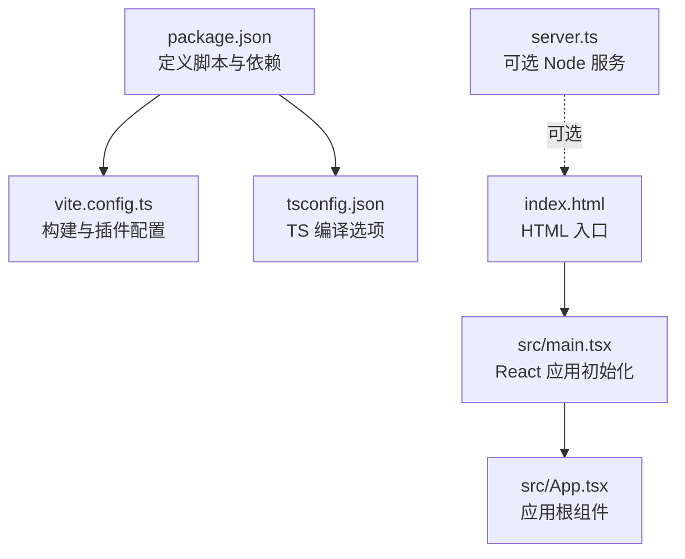
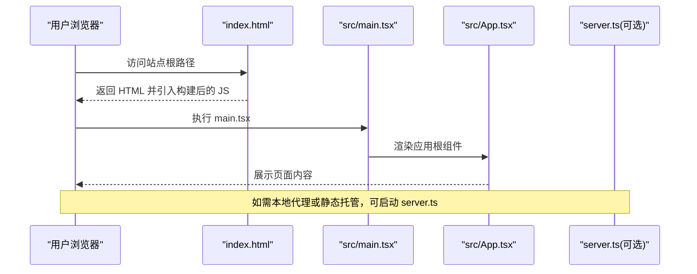
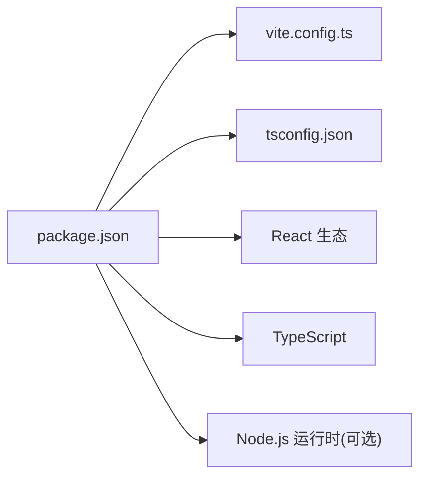

# 快速开始

<cite>
**本文引用的文件**   
- [package.json](file://package.json)
- [vite.config.ts](file://vite.config.ts)
- [tsconfig.json](file://tsconfig.json)
- [index.html](file://index.html)
- [server.ts](file://server.ts)
- [src/main.tsx](file://src/main.tsx)
- [src/App.tsx](file://src/App.tsx)
- [README.md](file://README.md)
</cite>

## 目录
1. [简介](#简介)
2. [项目结构](#项目结构)
3. [核心组件](#核心组件)
4. [架构总览](#架构总览)
5. [详细组件分析](#详细组件分析)
6. [依赖分析](#依赖分析)
7. [性能考虑](#性能考虑)
8. [故障排除指南](#故障排除指南)
9. [结论](#结论)
10. [附录](#附录)

## 简介
本指南面向首次接触 Supply OS 的开发者与使用者，目标是在 30 分钟内完成环境准备、克隆仓库、安装依赖、启动开发服务器、构建产物以及部署到生产环境。文档同时提供常见问题排查方法与第一个功能的实现演示，帮助你快速理解基本工作流程。

## 项目结构
Supply OS 是一个基于 Vite + React + TypeScript 的前端工程，包含一个可选的轻量 Node.js 服务用于本地代理或静态资源托管。关键目录与文件说明：
- src：前端源码（入口、应用根组件、页面与功能模块）
- public：静态资源
- scripts：脚本工具（如有）
- server.ts：可选的 Node.js 服务（用于本地开发/预览）
- vite.config.ts：Vite 构建配置
- tsconfig.json：TypeScript 编译配置
- index.html：应用入口 HTML
- package.json：项目元数据与脚本命令

图表来源
- [package.json](file://package.json)
- [vite.config.ts](file://vite.config.ts)
- [tsconfig.json](file://tsconfig.json)
- [index.html](file://index.html)
- [src/main.tsx](file://src/main.tsx)
- [src/App.tsx](file://src/App.tsx)
- [server.ts](file://server.ts)

章节来源
- [package.json](file://package.json)
- [vite.config.ts](file://vite.config.ts)
- [tsconfig.json](file://tsconfig.json)
- [index.html](file://index.html)
- [server.ts](file://server.ts)
- [src/main.tsx](file://src/main.tsx)
- [src/App.tsx](file://src/App.tsx)

## 核心组件
- 应用入口与挂载
  - 通过 index.html 加载构建产物，main.tsx 负责创建 React 根节点并渲染 App 组件。
- 应用根组件
  - App.tsx 作为应用根组件，组织路由、布局与全局状态等。
- 构建与开发体验
  - vite.config.ts 控制开发服务器、热更新、路径别名、插件与优化策略。
  - tsconfig.json 管理 TypeScript 编译目标、模块解析与类型检查。
- 可选服务端
  - server.ts 提供轻量 Node.js 服务，可用于本地代理、静态托管或简单 API 转发。

章节来源
- [index.html](file://index.html)
- [src/main.tsx](file://src/main.tsx)
- [src/App.tsx](file://src/App.tsx)
- [vite.config.ts](file://vite.config.ts)
- [tsconfig.json](file://tsconfig.json)
- [server.ts](file://server.ts)

## 架构总览
下图展示了从浏览器到应用的请求流程，以及可选 Node 服务的参与方式。

图表来源
- [index.html](file://index.html)
- [src/main.tsx](file://src/main.tsx)
- [src/App.tsx](file://src/App.tsx)
- [server.ts](file://server.ts)

## 详细组件分析

### 环境与依赖准备
- Node.js 版本要求
  - 请查看 package.json 中的 engines 字段以确认所需 Node.js 版本范围。
- 包管理器
  - 推荐使用 npm 或 yarn。若使用 yarn，请先安装 yarn。
- 安装依赖
  - 在项目根目录执行安装命令，等待依赖下载完成。

章节来源
- [package.json](file://package.json)

### 克隆与初始化
- 克隆仓库
  - 将仓库克隆至本地并进入项目目录。
- 安装依赖
  - 使用包管理器安装依赖。
- 验证安装
  - 运行开发服务器，确保无报错且页面正常显示。

章节来源
- [package.json](file://package.json)

### 开发环境启动与配置
- 启动开发服务器
  - 执行开发脚本命令，默认监听本地端口并提供热重载。
- 常用开发参数
  - 可通过环境变量或命令行参数调整端口、代理、调试模式等（具体见 vite.config.ts 与 package.json）。
- 本地服务（可选）
  - 如需本地代理或静态托管，可启动 server.ts 提供的服务。

章节来源
- [package.json](file://package.json)
- [vite.config.ts](file://vite.config.ts)
- [server.ts](file://server.ts)

### 构建流程
- 构建生产产物
  - 执行构建脚本生成优化后的静态资源。
- 产物位置
  - 构建产物通常输出到 dist 目录（由 Vite 默认行为决定）。
- 预览构建结果
  - 可使用内置预览命令或直接通过静态服务器打开 dist 目录。

章节来源
- [package.json](file://package.json)
- [vite.config.ts](file://vite.config.ts)

### 生产环境部署
- 静态站点托管
  - 将 dist 目录部署到任意静态站点托管平台（如 Nginx、Apache、CDN 或云厂商对象存储）。
- Node 服务部署（可选）
  - 若使用 server.ts 提供服务，需安装运行时依赖并启动服务进程。
- 环境变量与域名
  - 根据实际部署环境配置域名、HTTPS、缓存策略与跨域规则。

章节来源
- [package.json](file://package.json)
- [server.ts](file://server.ts)

### 第一个功能实现演示
以下示例演示如何添加一个简单的“关于”页面，帮助新手快速上手：
- 在 src 下新增页面文件（例如 AboutPage.tsx），并在其中编写页面逻辑。
- 在 App.tsx 中注册该页面的路由或将其纳入现有布局。
- 保存后，开发服务器会自动热重载，浏览器中即可看到新页面。
- 构建后，该页面会随其他资源一起打包发布。

章节来源
- [src/App.tsx](file://src/App.tsx)
- [vite.config.ts](file://vite.config.ts)

## 依赖分析
Supply OS 的核心依赖包括：
- 构建与开发工具链：Vite、TypeScript、React 生态
- 可选服务：Node.js 运行时（用于 server.ts）
- 包管理与锁定：npm/yarn 与 lock 文件

图表来源
- [package.json](file://package.json)
- [vite.config.ts](file://vite.config.ts)
- [tsconfig.json](file://tsconfig.json)

章节来源
- [package.json](file://package.json)
- [vite.config.ts](file://vite.config.ts)
- [tsconfig.json](file://tsconfig.json)

## 性能考虑
- 开启按需加载与代码分割：利用 Vite 的默认能力，合理拆分路由与大型模块。
- 静态资源优化：启用压缩、缓存与 CDN 加速。
- 构建产物体积：定期分析 bundle 大小，移除未使用的依赖。
- 开发体验：合理使用热重载与增量构建，减少冷启动时间。

[本节为通用建议，不直接分析具体文件]

## 故障排除指南
- 端口占用
  - 现象：开发服务器无法启动或报端口被占用。
  - 处理：更换端口或关闭占用进程；参考 vite.config.ts 与 package.json 的配置。
- 依赖安装失败
  - 现象：网络错误或权限问题导致安装中断。
  - 处理：切换镜像源、清理缓存后重试；检查 Node.js 版本是否符合要求。
- 构建失败
  - 现象：TypeScript 类型错误或模块解析失败。
  - 处理：根据错误提示修复类型或路径；检查 tsconfig.json 与导入路径。
- 本地服务异常
  - 现象：server.ts 启动失败或请求代理无效。
  - 处理：检查端口、环境变量与代理规则；确认依赖已安装。

章节来源
- [package.json](file://package.json)
- [vite.config.ts](file://vite.config.ts)
- [tsconfig.json](file://tsconfig.json)
- [server.ts](file://server.ts)

## 结论
通过本指南，你已完成环境准备、依赖安装、开发启动、构建与部署的基本流程，并了解了第一个功能的实现方式。建议在后续迭代中结合项目的国际化、支付与服务端集成等模块逐步扩展功能。

[本节为总结性内容，不直接分析具体文件]

## 附录
- 官方文档与说明
  - 项目 README 提供了更多背景信息与使用说明，建议阅读以获取最新指引。

章节来源
- [README.md](file://README.md)