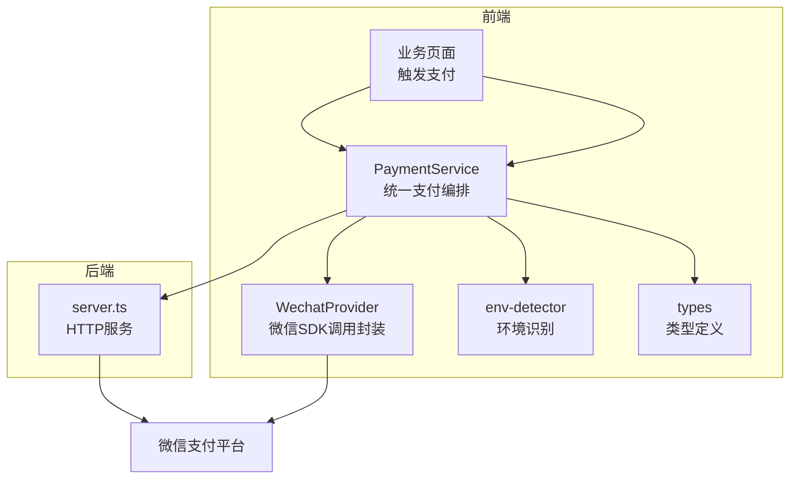
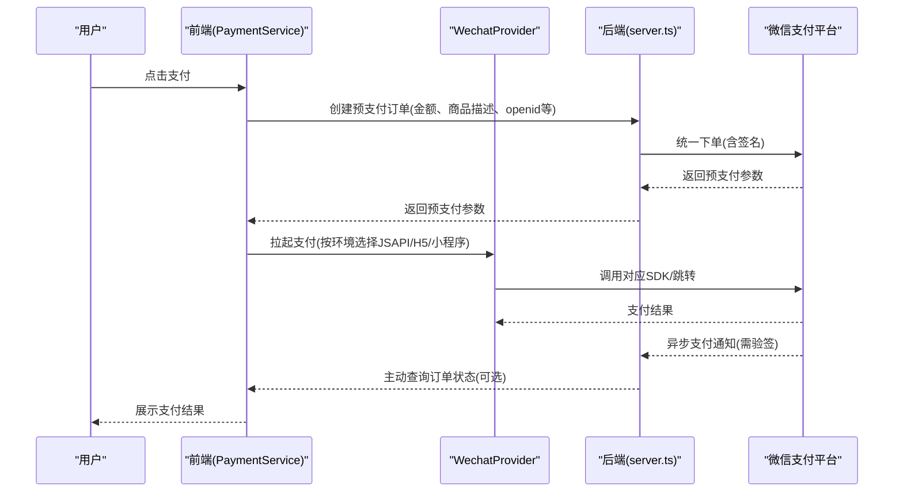
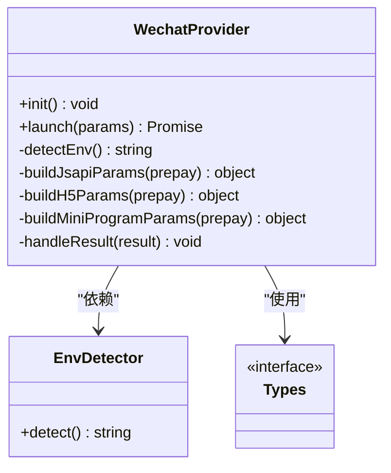
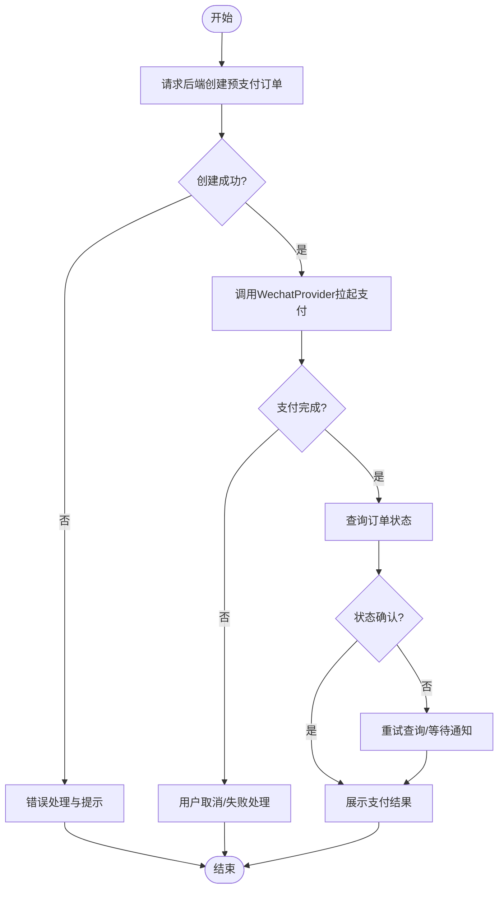
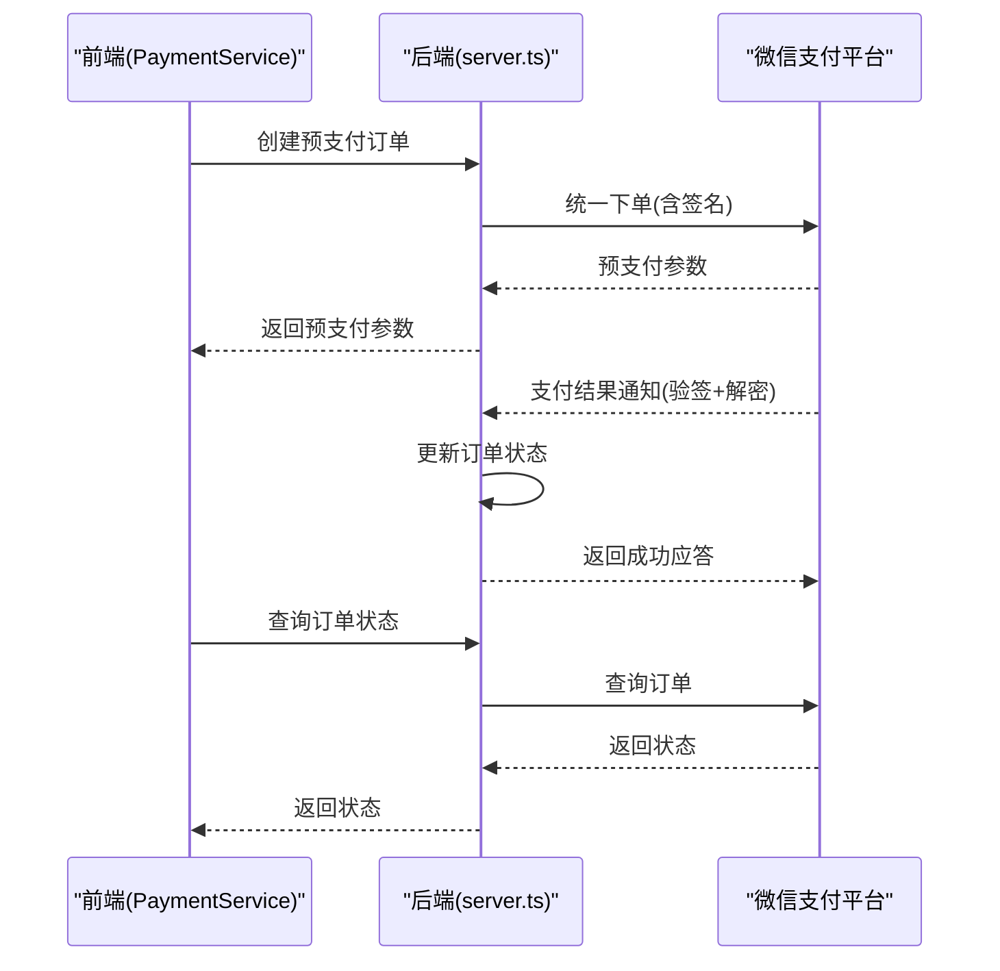
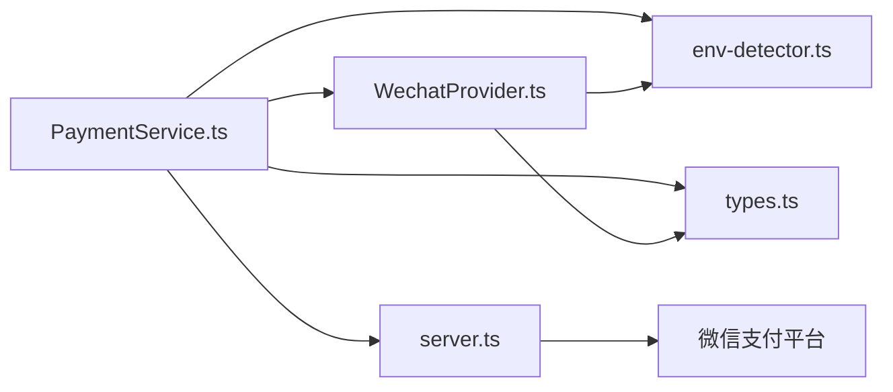

# 微信支付集成实现

<cite>
**本文引用的文件**   
- [WechatProvider.ts](file://src/payment/WechatProvider.ts)
- [PaymentService.ts](file://src/payment/PaymentService.ts)
- [types.ts](file://src/payment/types.ts)
- [env-detector.ts](file://src/payment/env-detector.ts)
- [server.ts](file://server.ts)
</cite>

## 目录
1. [简介](#简介)
2. [项目结构](#项目结构)
3. [核心组件](#核心组件)
4. [架构总览](#架构总览)
5. [详细组件分析](#详细组件分析)
6. [依赖关系分析](#依赖关系分析)
7. [性能考虑](#性能考虑)
8. [故障排查指南](#故障排查指南)
9. [结论](#结论)
10. [附录](#附录)

## 简介
本技术文档面向Supply OS的微信支付集成，重点围绕前端支付能力与后端交互流程，系统化阐述WechatProvider的实现细节、JSAPI/H5/小程序等场景差异、证书配置与签名验证机制、支付通知处理、订单查询与关闭等业务流程，并提供完整的配置示例与安全建议。同时给出调试工具使用方法和常见问题的排查路径，帮助开发者快速落地并稳定运行微信支付功能。

## 项目结构
本项目采用前后端分离的架构：
- 前端位于src目录，包含支付相关模块payment（WechatProvider、PaymentService、类型与环境检测等）
- 服务端入口为server.ts，负责与微信支付平台交互、生成预支付参数、处理回调与查询等

图表来源
- [WechatProvider.ts](file://src/payment/WechatProvider.ts)
- [PaymentService.ts](file://src/payment/PaymentService.ts)
- [env-detector.ts](file://src/payment/env-detector.ts)
- [types.ts](file://src/payment/types.ts)
- [server.ts](file://server.ts)

章节来源
- [WechatProvider.ts](file://src/payment/WechatProvider.ts)
- [PaymentService.ts](file://src/payment/PaymentService.ts)
- [env-detector.ts](file://src/payment/env-detector.ts)
- [types.ts](file://src/payment/types.ts)
- [server.ts](file://server.ts)

## 核心组件
- WechatProvider：封装微信支付在不同环境的调用方式（JSAPI、H5、小程序），提供统一的发起支付接口，内部根据环境自动选择对应SDK或跳转策略。
- PaymentService：统一支付编排层，协调WechatProvider与服务端接口，完成下单、拉起支付、结果轮询与状态同步。
- env-detector：用于识别当前运行环境（浏览器、微信小程序、企业微信等），决定调用路径与参数构造策略。
- types：统一定义支付请求/响应、订单状态、错误码等类型，确保前后端契约一致。
- server.ts：后端HTTP服务，负责与微信支付平台交互（统一下单、支付结果通知、订单查询与关闭）、签名校验与幂等控制。

章节来源
- [WechatProvider.ts](file://src/payment/WechatProvider.ts)
- [PaymentService.ts](file://src/payment/PaymentService.ts)
- [env-detector.ts](file://src/payment/env-detector.ts)
- [types.ts](file://src/payment/types.ts)
- [server.ts](file://server.ts)

## 架构总览
整体流程分为“前端发起”和“后端处理”两部分：
- 前端通过PaymentService发起支付，调用WechatProvider进行环境适配与SDK调用；必要时先请求后端创建预支付订单。
- 后端server.ts与微信支付平台交互，完成统一下单、签名、回调验签、订单查询与关闭等。

图表来源
- [PaymentService.ts](file://src/payment/PaymentService.ts)
- [WechatProvider.ts](file://src/payment/WechatProvider.ts)
- [server.ts](file://server.ts)

## 详细组件分析

### WechatProvider 分析与实现要点
WechatProvider负责将不同微信生态的支付拉起逻辑抽象为统一接口，内部依据环境检测结果选择具体实现：
- JSAPI（公众号内网页）：通过微信JSSDK的支付方法拉起支付，需要服务端下发的预支付参数。
- H5（移动端浏览器）：通过微信H5支付专用方法或URL Scheme拉起支付，需要服务端下发的H5预支付参数。
- 小程序：通过小程序支付API拉起，需要服务端下发的小程序预支付参数。

关键职责
- 环境识别：结合env-detector判断当前运行环境。
- 参数组装：根据环境构造对应的拉起参数，确保必填字段完整。
- 异常处理：对网络异常、用户取消、签名失败等场景进行友好提示与回退。
- 结果监听：在JSAPI/H5场景下监听支付结果，必要时触发订单状态同步。

图表来源
- [WechatProvider.ts](file://src/payment/WechatProvider.ts)
- [env-detector.ts](file://src/payment/env-detector.ts)
- [types.ts](file://src/payment/types.ts)

章节来源
- [WechatProvider.ts](file://src/payment/WechatProvider.ts)
- [env-detector.ts](file://src/payment/env-detector.ts)
- [types.ts](file://src/payment/types.ts)

### PaymentService 编排流程
PaymentService作为统一编排层，承担以下职责：
- 与后端交互：创建预支付订单、查询订单状态、关闭订单。
- 调用WechatProvider：根据环境拉起支付。
- 结果同步：在支付完成后主动查询订单状态，保证前端展示与后端一致。
- 错误处理：对超时、网络异常、签名失败等进行重试与降级。

图表来源
- [PaymentService.ts](file://src/payment/PaymentService.ts)
- [WechatProvider.ts](file://src/payment/WechatProvider.ts)
- [server.ts](file://server.ts)

章节来源
- [PaymentService.ts](file://src/payment/PaymentService.ts)
- [WechatProvider.ts](file://src/payment/WechatProvider.ts)
- [server.ts](file://server.ts)

### 后端 server.ts 与微信支付平台交互
后端主要职责包括：
- 统一下单：接收前端请求，组装商户号、随机串、时间戳、签名等信息，调用微信支付统一下单接口。
- 支付结果通知：接收微信异步通知，进行签名校验、数据解密（如需要），更新订单状态并返回成功应答。
- 订单查询：根据订单号查询支付状态，供前端轮询或主动同步。
- 订单关闭：在超时或用户取消时关闭订单，释放资源。

图表来源
- [server.ts](file://server.ts)

章节来源
- [server.ts](file://server.ts)

### 不同场景的支付实现差异
- JSAPI（公众号内网页）
  - 需要用户在公众号授权获取openid。
  - 使用JSSDK支付方法拉起，参数由后端统一下单返回。
  - 注意域名白名单与JS安全域名配置。
- H5（移动端浏览器）
  - 使用H5支付专用方法或URL Scheme拉起。
  - 需要正确设置referer与设备信息，避免风控拦截。
- 小程序
  - 使用小程序支付API拉起，需要小程序appid与openid。
  - 需在微信公众平台配置支付目录与域名。

章节来源
- [WechatProvider.ts](file://src/payment/WechatProvider.ts)
- [env-detector.ts](file://src/payment/env-detector.ts)
- [types.ts](file://src/payment/types.ts)

### 证书配置与签名验证机制
- 证书配置
  - 商户API证书：用于统一下单、退款等敏感操作的签名与加密。
  - 平台证书：用于验签微信支付平台的回调通知。
  - 证书存放位置应遵循最小权限原则，避免泄露。
- 签名验证
  - 统一下单前，后端需对请求参数进行MD5或RSA签名。
  - 支付结果通知到达后，后端需使用平台证书验签，确保消息来源可信。
  - 前端不直接参与敏感签名，仅传递必要参数。

章节来源
- [server.ts](file://server.ts)

### 支付通知处理与幂等性保证
- 通知处理流程
  - 接收微信异步通知，解析报文并进行验签。
  - 解密必要字段（如需要），校验金额与订单号一致性。
  - 更新订单状态为已支付，记录流水号与时间戳。
  - 返回成功应答，避免重复通知。
- 幂等性保证
  - 基于订单号与流水号建立唯一约束，防止重复处理。
  - 在处理前检查订单是否已处于终态（已支付/已关闭）。
  - 对并发通知进行锁或队列化处理，确保顺序执行。

章节来源
- [server.ts](file://server.ts)

### 订单查询与关闭
- 订单查询
  - 前端在支付完成后主动查询订单状态，确保UI与后端一致。
  - 后端调用微信支付查询接口，返回最新状态。
- 订单关闭
  - 当用户取消或超时未支付时，后端调用关闭接口释放资源。
  - 前端在关闭成功后提示用户重新下单或刷新页面。

章节来源
- [server.ts](file://server.ts)
- [PaymentService.ts](file://src/payment/PaymentService.ts)

## 依赖关系分析
- 前端模块间依赖
  - PaymentService依赖WechatProvider与env-detector，统一编排支付流程。
  - WechatProvider依赖env-detector进行环境识别，依赖types进行类型约束。
- 前后端交互
  - PaymentService通过HTTP与server.ts交互，完成下单、查询与关闭。
  - server.ts与微信支付平台交互，完成统一下单、通知验签、查询与关闭。

图表来源
- [PaymentService.ts](file://src/payment/PaymentService.ts)
- [WechatProvider.ts](file://src/payment/WechatProvider.ts)
- [env-detector.ts](file://src/payment/env-detector.ts)
- [types.ts](file://src/payment/types.ts)
- [server.ts](file://server.ts)

章节来源
- [PaymentService.ts](file://src/payment/PaymentService.ts)
- [WechatProvider.ts](file://src/payment/WechatProvider.ts)
- [env-detector.ts](file://src/payment/env-detector.ts)
- [types.ts](file://src/payment/types.ts)
- [server.ts](file://server.ts)

## 性能考虑
- 减少不必要的轮询：优先依赖异步通知，仅在必要时进行状态查询。
- 连接复用：后端与微信支付平台保持长连接或连接池，降低握手开销。
- 缓存策略：对频繁查询的订单状态进行短时缓存，避免重复请求。
- 限流与熔断：对统一下单与查询接口进行限流，防止雪崩。

[本节为通用指导，无需代码引用]

## 故障排查指南
- 常见问题定位
  - 统一下单失败：检查商户号、API密钥、签名算法与参数完整性。
  - 回调验签失败：核对平台证书版本与本地证书一致性。
  - 前端拉起失败：确认环境识别是否正确，域名与白名单是否配置。
- 日志与调试
  - 记录统一下单请求与响应、回调通知原始报文与验签结果。
  - 前端打印拉起参数与错误码，便于复现问题。
- 恢复策略
  - 对失败的通知进行重试与补偿，确保最终一致性。
  - 提供手动查询与关闭订单的管理后台能力。

章节来源
- [server.ts](file://server.ts)
- [PaymentService.ts](file://src/payment/PaymentService.ts)
- [WechatProvider.ts](file://src/payment/WechatProvider.ts)

## 结论
通过对WechatProvider、PaymentService与server.ts的系统化设计与实现，Supply OS在前端与后端层面完成了微信支付的多场景接入。借助严格的安全机制（签名与验签）、幂等性与容错设计，系统能够在复杂网络与并发环境下稳定运行。后续可进一步优化性能与可观测性，提升用户体验与运维效率。

[本节为总结，无需代码引用]

## 附录

### 配置示例清单（概念性）
- 微信公众号JSAPI
  - AppID、AppSecret、JS安全域名、支付授权目录
- 微信H5支付
  - MCH_ID、API密钥、H5支付域名、Referer白名单
- 微信小程序
  - AppID、MCH_ID、API密钥、小程序支付目录
- 证书与密钥
  - 商户API证书、平台证书、APIv3密钥

[本节为概念性说明，无需代码引用]