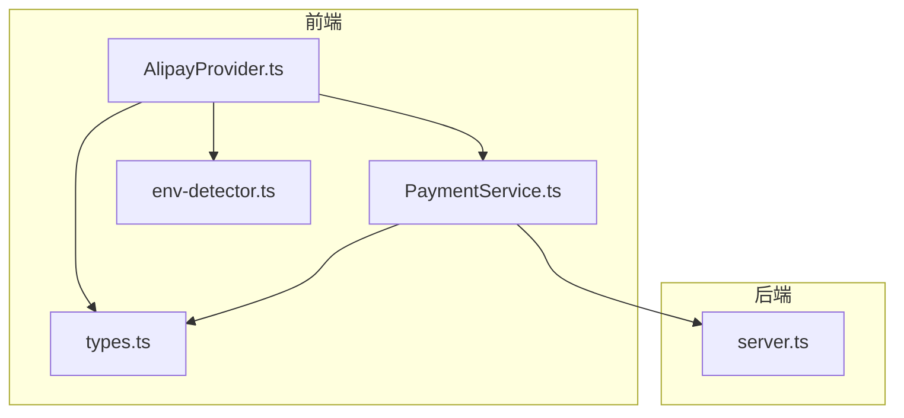
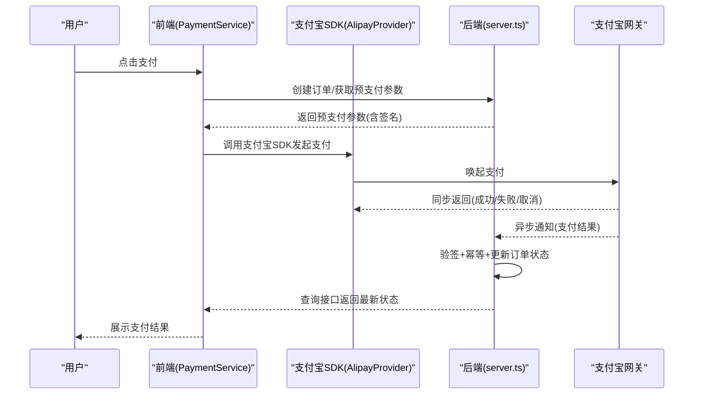
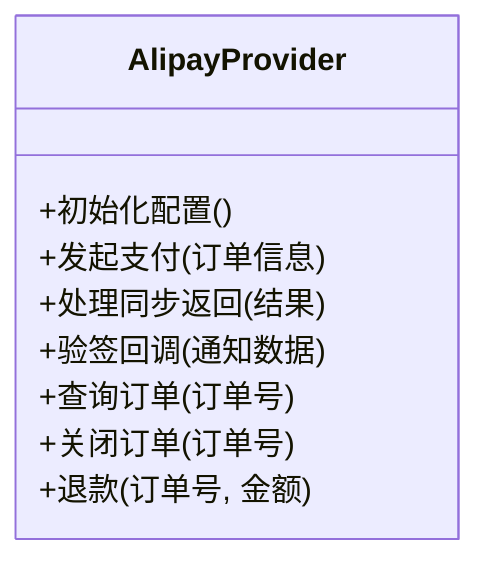
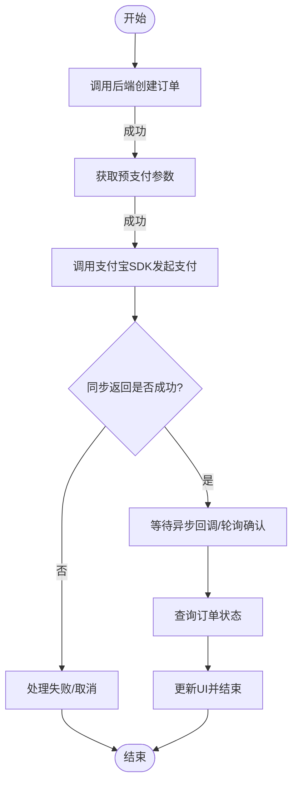
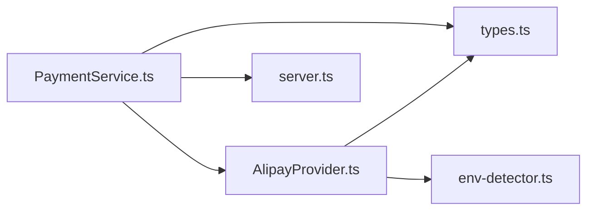
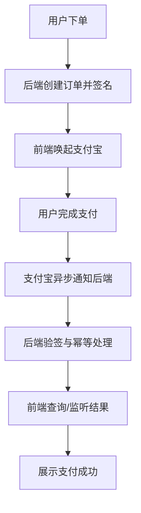

# 支付宝集成实现

<cite>
**本文引用的文件**   
- [AlipayProvider.ts](file://src/payment/AlipayProvider.ts)
- [PaymentService.ts](file://src/payment/PaymentService.ts)
- [types.ts](file://src/payment/types.ts)
- [env-detector.ts](file://src/payment/env-detector.ts)
- [server.ts](file://server.ts)
</cite>

## 目录
1. [简介](#简介)
2. [项目结构](#项目结构)
3. [核心组件](#核心组件)
4. [架构总览](#架构总览)
5. [详细组件分析](#详细组件分析)
6. [依赖关系分析](#依赖关系分析)
7. [性能考虑](#性能考虑)
8. [故障排查指南](#故障排查指南)
9. [结论](#结论)
10. [附录](#附录)

## 简介
本技术文档围绕 Supply OS 的支付宝支付集成，聚焦 AlipayProvider 的具体实现、API 调用流程、签名与回调处理机制、请求参数构建与响应解析、异常处理策略，以及沙箱与生产环境部署要点。同时提供完整的支付流程图、错误码对照表，并覆盖超时、退款、查询等高级能力的使用建议与调试技巧。

## 项目结构
本项目采用前端支付抽象层 + 后端服务协作的方式组织支付相关代码：
- 前端支付模块位于 src/payment，包含支付宝、微信、Mock 提供者及统一支付服务与类型定义。
- 服务端入口 server.ts 用于承载需要服务端参与的安全操作（如生成签名、验签、回调处理）。

图表来源
- [AlipayProvider.ts](file://src/payment/AlipayProvider.ts)
- [PaymentService.ts](file://src/payment/PaymentService.ts)
- [types.ts](file://src/payment/types.ts)
- [env-detector.ts](file://src/payment/env-detector.ts)
- [server.ts](file://server.ts)

章节来源
- [AlipayProvider.ts](file://src/payment/AlipayProvider.ts)
- [PaymentService.ts](file://src/payment/PaymentService.ts)
- [types.ts](file://src/payment/types.ts)
- [env-detector.ts](file://src/payment/env-detector.ts)
- [server.ts](file://server.ts)

## 核心组件
- AlipayProvider：封装支付宝 SDK 的前端调用细节，负责初始化配置、发起支付、处理异步通知与结果校验。
- PaymentService：统一的支付编排服务，协调不同渠道（支付宝、微信、Mock），对外暴露一致的支付接口。
- types.ts：定义支付相关的输入输出类型、状态枚举与错误码映射。
- env-detector.ts：检测当前运行环境（开发/测试/生产），驱动不同配置加载。
- server.ts：承载服务端侧安全逻辑，包括签名生成、验签、回调路由与幂等处理。

章节来源
- [AlipayProvider.ts](file://src/payment/AlipayProvider.ts)
- [PaymentService.ts](file://src/payment/PaymentService.ts)
- [types.ts](file://src/payment/types.ts)
- [env-detector.ts](file://src/payment/env-detector.ts)
- [server.ts](file://server.ts)

## 架构总览
整体交互遵循“前端发起 -> 服务端签名 -> 客户端唤起 -> 异步回调 -> 服务端验签与落库 -> 前端轮询/监听”的模式。

图表来源
- [PaymentService.ts](file://src/payment/PaymentService.ts)
- [AlipayProvider.ts](file://src/payment/AlipayProvider.ts)
- [server.ts](file://server.ts)

## 详细组件分析

### AlipayProvider 分析与实现要点
- 职责边界
  - 管理支付宝 SDK 实例与配置（应用ID、私钥、公钥、网关地址、编码格式等）。
  - 构造支付请求参数（订单号、金额、标题、描述、超时时间、通知地址等）。
  - 调用 SDK 方法完成支付唤起，并处理同步返回。
  - 提供回调验签辅助方法与错误分类。
- 关键流程
  - 初始化：根据环境选择沙箱或生产配置。
  - 发起支付：组装业务参数，调用 SDK 发起支付。
  - 同步结果：根据 SDK 返回码判断成功/失败/取消。
  - 异步回调：将支付宝异步通知转发至后端进行验签与状态更新。
- 参数构建
  - 必填字段通常包括：商户订单号、总金额、商品标题、商品描述、超时支付时间、异步通知地址等。
  - 可选字段包括：扩展参数、子商户信息、营销参数等。
- 响应解析
  - 以 SDK 返回对象为准，提取交易状态、外部订单号、支付宝交易号等关键字段。
- 异常处理
  - 网络异常、SDK 内部异常、业务拒绝、超时等分别归类，便于上层统一处理与重试策略。

图表来源
- [AlipayProvider.ts](file://src/payment/AlipayProvider.ts)

章节来源
- [AlipayProvider.ts](file://src/payment/AlipayProvider.ts)

### PaymentService 编排逻辑
- 统一入口
  - 对外暴露 createPayment、queryPayment、refundPayment 等方法，屏蔽底层渠道差异。
- 流程编排
  - 创建订单：调用后端接口获取预支付参数。
  - 唤起支付：委托具体 Provider（如 AlipayProvider）执行。
  - 结果确认：结合同步返回与异步回调，必要时通过查询接口确认最终状态。
- 错误与重试
  - 对可重试错误（如网络抖动）实施指数退避；对不可重试错误（如参数非法）直接失败。

图表来源
- [PaymentService.ts](file://src/payment/PaymentService.ts)
- [AlipayProvider.ts](file://src/payment/AlipayProvider.ts)

章节来源
- [PaymentService.ts](file://src/payment/PaymentService.ts)

### 类型与环境检测
- types.ts
  - 定义支付请求/响应结构、状态枚举、错误码映射等，确保前后端一致。
- env-detector.ts
  - 根据环境变量或运行时特征识别沙箱/生产环境，影响网关地址、证书路径、日志级别等。

章节来源
- [types.ts](file://src/payment/types.ts)
- [env-detector.ts](file://src/payment/env-detector.ts)

### 服务端安全与回调处理
- 签名与验签
  - 服务端使用商户私钥为预支付参数签名，返回给前端；收到异步通知后使用支付宝公钥验签。
- 回调路由与幂等
  - 对同一订单号的多次通知需保证幂等，避免重复入账。
- 查询与关闭
  - 提供查询与关闭订单接口，配合前端轮询或用户主动刷新。

章节来源
- [server.ts](file://server.ts)

## 依赖关系分析
- 组件耦合
  - PaymentService 依赖各 Provider 的统一接口；AlipayProvider 依赖 types 与环境检测。
- 外部依赖
  - 支付宝 SDK（前端）、后端签名与验签服务、支付宝网关。
- 潜在循环依赖
  - 保持 Provider 与 Service 单向依赖，避免双向引用。

图表来源
- [PaymentService.ts](file://src/payment/PaymentService.ts)
- [AlipayProvider.ts](file://src/payment/AlipayProvider.ts)
- [types.ts](file://src/payment/types.ts)
- [env-detector.ts](file://src/payment/env-detector.ts)
- [server.ts](file://server.ts)

章节来源
- [PaymentService.ts](file://src/payment/PaymentService.ts)
- [AlipayProvider.ts](file://src/payment/AlipayProvider.ts)
- [types.ts](file://src/payment/types.ts)
- [env-detector.ts](file://src/payment/env-detector.ts)
- [server.ts](file://server.ts)

## 性能考虑
- 减少不必要的轮询：优先依赖异步回调，仅在必要时短轮询。
- 批量与缓存：对频繁查询的订单状态做短期缓存，降低后端压力。
- 超时控制：合理设置支付超时时间与前端等待上限，避免长时间阻塞。
- 资源释放：在页面卸载时清理定时器与事件监听，防止内存泄漏。

[本节为通用指导，无需源码引用]

## 故障排查指南
- 常见问题
  - 签名失败：检查应用私钥、公钥配置与编码格式一致性。
  - 回调未触发：核对异步通知地址公网可达性与域名白名单。
  - 重复入账：确认服务端幂等键与去重逻辑。
  - 支付超时：调整超时参数与前端提示文案，引导用户重新发起。
- 定位手段
  - 开启调试日志，记录请求参数摘要与返回码。
  - 使用支付宝开放平台沙箱工具模拟异步通知。
  - 抓包核对签名串与报文顺序。

章节来源
- [server.ts](file://server.ts)
- [AlipayProvider.ts](file://src/payment/AlipayProvider.ts)

## 结论
通过将支付流程拆分为清晰的前端 Provider 与服务端安全层，Supply OS 实现了可扩展、可维护的支付宝集成方案。AlipayProvider 专注于 SDK 调用与参数构建，PaymentService 负责跨渠道编排，server.ts 承担签名与回调验签等敏感操作。配合完善的错误处理与调试手段，可在沙箱快速验证并在生产稳定上线。

[本节为总结性内容，无需源码引用]

## 附录

### 沙箱与生产环境配置清单
- 沙箱环境
  - 应用ID、RSA 私钥/公钥、支付宝公钥、沙箱网关地址、异步通知地址（需公网可达）。
- 生产环境
  - 正式应用ID、证书模式或密钥模式配置、生产网关地址、回调域名白名单、HTTPS 强制。
- 环境变量切换
  - 通过 env-detector 自动识别，或在配置中心注入不同环境的密钥与网关。

[本节为通用指导，无需源码引用]

### 支付流程图（端到端）

图表来源
- [PaymentService.ts](file://src/payment/PaymentService.ts)
- [AlipayProvider.ts](file://src/payment/AlipayProvider.ts)
- [server.ts](file://server.ts)

### 错误码对照表（示例）
- 成功：支付成功，订单状态已更新。
- 失败：支付被拒绝或参数错误，需修正后重试。
- 取消：用户主动取消支付，不改变订单状态。
- 超时：支付未在限定时间内完成，允许再次发起。
- 系统异常：网关或服务端异常，建议稍后重试。

[本节为通用说明，无需源码引用]

### 高级功能指引
- 查询订单
  - 前端调用查询接口，结合异步回调确认最终状态。
- 关闭订单
  - 当用户放弃支付或超过有效期时，调用关闭接口释放库存。
- 退款
  - 提交退款申请，关注退款结果回调与状态轮询，确保资金流水一致。
- 超时处理
  - 前端显示明确提示并提供“重新支付”入口；后端支持订单过期自动关闭。

[本节为通用指导，无需源码引用]