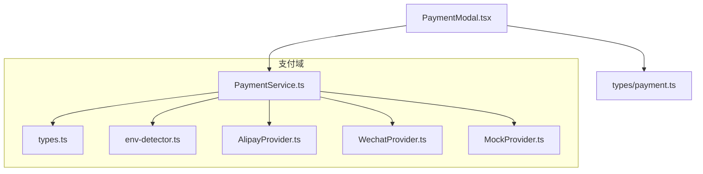
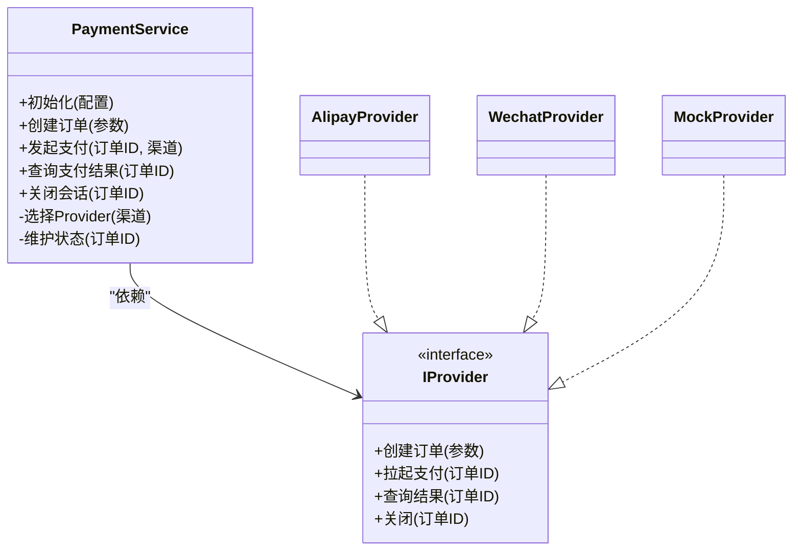
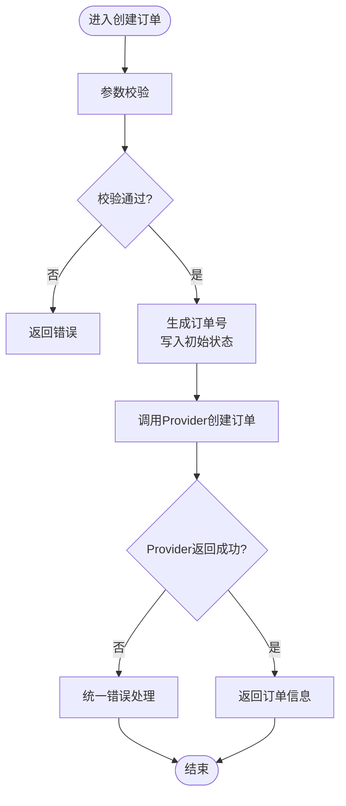
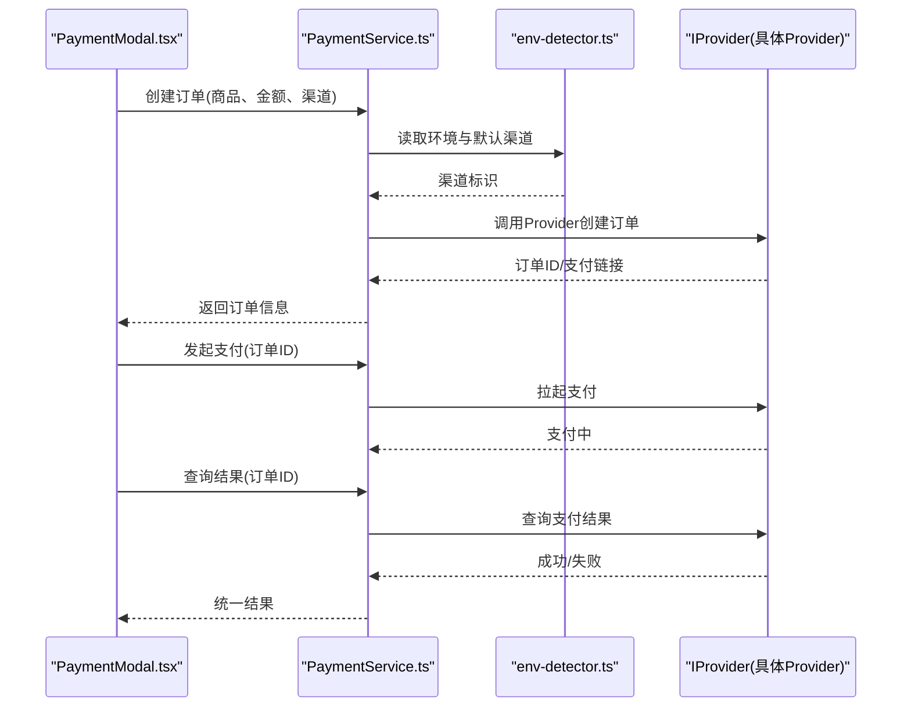
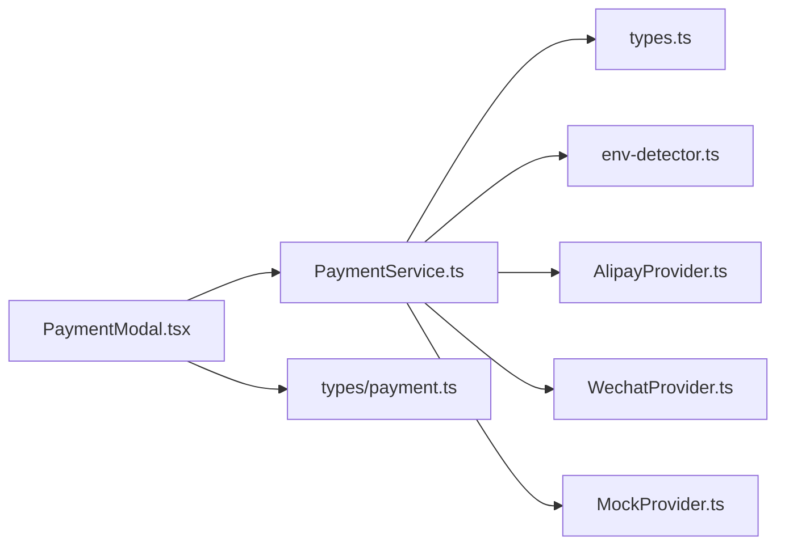

# 支付服务架构设计

<cite>
**本文引用的文件**   
- [PaymentService.ts](file://src/payment/PaymentService.ts)
- [AlipayProvider.ts](file://src/payment/AlipayProvider.ts)
- [WechatProvider.ts](file://src/payment/WechatProvider.ts)
- [MockProvider.ts](file://src/payment/MockProvider.ts)
- [types.ts](file://src/payment/types.ts)
- [env-detector.ts](file://src/payment/env-detector.ts)
- [PaymentModal.tsx](file://src/PaymentModal.tsx)
- [payment.ts](file://src/types/payment.ts)
</cite>

## 目录
1. [简介](#简介)
2. [项目结构](#项目结构)
3. [核心组件](#核心组件)
4. [架构总览](#架构总览)
5. [详细组件分析](#详细组件分析)
6. [依赖关系分析](#依赖关系分析)
7. [性能考虑](#性能考虑)
8. [故障排查指南](#故障排查指南)
9. [结论](#结论)
10. [附录](#附录)

## 简介
本文件面向Supply OS的支付服务，系统性阐述其架构与实现：以Provider模式为核心的抽象层、统一的服务编排（PaymentService）、环境检测与配置、状态流转与错误处理策略、扩展机制以及性能优化建议。文档同时提供时序图与类图，帮助读者快速理解支付流程与组件交互。

## 项目结构
支付相关代码集中在 src/payment 目录，采用“服务+提供者”的分层组织方式：
- PaymentService.ts：对外暴露的统一支付服务入口，负责生命周期管理、路由到具体Provider、状态与错误处理。
- AlipayProvider.ts / WechatProvider.ts / MockProvider.ts：各支付渠道的具体实现，遵循统一的接口契约。
- types.ts：定义支付领域类型、枚举、请求/响应模型等。
- env-detector.ts：运行环境与渠道选择辅助逻辑。
- PaymentModal.tsx：前端支付弹窗，调用PaymentService完成用户侧交互。
- payment.ts：全局类型定义中与支付相关的部分，供其他模块引用。

图表来源
- [PaymentService.ts](file://src/payment/PaymentService.ts)
- [AlipayProvider.ts](file://src/payment/AlipayProvider.ts)
- [WechatProvider.ts](file://src/payment/WechatProvider.ts)
- [MockProvider.ts](file://src/payment/MockProvider.ts)
- [types.ts](file://src/payment/types.ts)
- [env-detector.ts](file://src/payment/env-detector.ts)
- [PaymentModal.tsx](file://src/PaymentModal.tsx)
- [payment.ts](file://src/types/payment.ts)

章节来源
- [PaymentService.ts](file://src/payment/PaymentService.ts)
- [types.ts](file://src/payment/types.ts)
- [env-detector.ts](file://src/payment/env-detector.ts)
- [PaymentModal.tsx](file://src/PaymentModal.tsx)
- [payment.ts](file://src/types/payment.ts)

## 核心组件
- PaymentService：统一入口，封装创建订单、发起支付、查询结果、关闭会话等能力；内部维护支付会话状态，协调Provider执行并返回标准化结果。
- Provider抽象：每个渠道实现同一套方法（如创建订单、拉起支付、回调处理、状态查询），通过工厂或注册表由PaymentService动态选择。
- 类型系统：集中定义金额、币种、渠道、状态码、事件等，确保前后端一致。
- 环境检测：根据环境变量或运行时信息决定使用真实渠道还是Mock渠道，便于开发与测试。

章节来源
- [PaymentService.ts](file://src/payment/PaymentService.ts)
- [types.ts](file://src/payment/types.ts)
- [env-detector.ts](file://src/payment/env-detector.ts)

## 架构总览
整体采用“服务编排 + 多Provider插件化”的架构：
- 上层UI仅依赖PaymentService，不感知具体渠道细节。
- PaymentService依据环境检测与配置选择对应Provider。
- Provider之间相互独立，新增渠道只需实现统一接口并注册。

图表来源
- [PaymentService.ts](file://src/payment/PaymentService.ts)
- [AlipayProvider.ts](file://src/payment/AlipayProvider.ts)
- [WechatProvider.ts](file://src/payment/WechatProvider.ts)
- [MockProvider.ts](file://src/payment/MockProvider.ts)
- [types.ts](file://src/payment/types.ts)

## 详细组件分析

### PaymentService 设计与实现要点
- 职责边界
  - 对外暴露一致的API，屏蔽多渠道差异。
  - 管理支付会话的生命周期：创建、支付中、成功、失败、已关闭。
  - 错误归一化：将不同Provider的错误转换为统一错误模型，便于上层处理。
- 关键流程
  - 创建订单：校验参数、生成唯一订单号、持久化初始状态、调用Provider创建。
  - 发起支付：根据渠道选择Provider，触发拉起支付动作，记录开始时间。
  - 结果查询：轮询或回调驱动更新状态，最终收敛为统一结果。
  - 关闭会话：清理资源与中间态，释放锁或取消定时任务。
- 状态机
  - 典型状态包括：待支付、支付中、成功、失败、已关闭。
  - 状态转换需幂等，避免重复提交与并发竞争。
- 错误处理
  - 网络异常、超时重试、渠道不可用降级（例如切至Mock）。
  - 业务错误（余额不足、风控拦截）映射为可展示的错误码与文案。

图表来源
- [PaymentService.ts](file://src/payment/PaymentService.ts)
- [types.ts](file://src/payment/types.ts)

章节来源
- [PaymentService.ts](file://src/payment/PaymentService.ts)
- [types.ts](file://src/payment/types.ts)

### Provider 模式与扩展机制
- 接口契约
  - 所有Provider必须实现统一的方法集：创建订单、拉起支付、查询结果、关闭会话。
  - 输入输出遵循types.ts中的类型定义，保证一致性。
- 选择与注册
  - 通过env-detector与环境变量决定默认渠道（如开发使用Mock，生产使用支付宝/微信）。
  - 支持在运行时按订单或用户偏好切换渠道。
- 扩展新渠道
  - 新建Provider文件，实现统一接口。
  - 在注册表或服务初始化时注入新Provider。
  - 补充对应的配置项与错误映射。

图表来源
- [PaymentService.ts](file://src/payment/PaymentService.ts)
- [env-detector.ts](file://src/payment/env-detector.ts)
- [AlipayProvider.ts](file://src/payment/AlipayProvider.ts)
- [WechatProvider.ts](file://src/payment/WechatProvider.ts)
- [MockProvider.ts](file://src/payment/MockProvider.ts)
- [PaymentModal.tsx](file://src/PaymentModal.tsx)

章节来源
- [PaymentService.ts](file://src/payment/PaymentService.ts)
- [env-detector.ts](file://src/payment/env-detector.ts)
- [AlipayProvider.ts](file://src/payment/AlipayProvider.ts)
- [WechatProvider.ts](file://src/payment/WechatProvider.ts)
- [MockProvider.ts](file://src/payment/MockProvider.ts)
- [PaymentModal.tsx](file://src/PaymentModal.tsx)

### 类型系统与数据模型
- 领域类型
  - 订单、金额、币种、渠道枚举、状态码、事件等。
- 作用
  - 约束Provider输入输出，保障前后端一致。
  - 作为错误模型与日志字段的基础。

章节来源
- [types.ts](file://src/payment/types.ts)
- [payment.ts](file://src/types/payment.ts)

### 环境检测与配置
- 环境检测
  - 根据环境变量或运行时特征选择默认渠道（如开发使用Mock）。
- 配置项
  - 渠道开关、密钥、超时、重试次数、回调地址等。
- 最佳实践
  - 敏感配置通过环境变量注入，不在代码中硬编码。
  - 提供默认值与校验，启动时进行自检。

章节来源
- [env-detector.ts](file://src/payment/env-detector.ts)
- [PaymentService.ts](file://src/payment/PaymentService.ts)

## 依赖关系分析
- 内聚性
  - PaymentService聚合Provider，职责清晰，内聚度高。
- 耦合度
  - 上层UI仅依赖PaymentService，对Provider无直接依赖，降低耦合。
- 外部依赖
  - 网络请求、加密签名、第三方SDK等由Provider内部封装，不影响上层。

图表来源
- [PaymentService.ts](file://src/payment/PaymentService.ts)
- [AlipayProvider.ts](file://src/payment/AlipayProvider.ts)
- [WechatProvider.ts](file://src/payment/WechatProvider.ts)
- [MockProvider.ts](file://src/payment/MockProvider.ts)
- [types.ts](file://src/payment/types.ts)
- [env-detector.ts](file://src/payment/env-detector.ts)
- [PaymentModal.tsx](file://src/PaymentModal.tsx)
- [payment.ts](file://src/types/payment.ts)

章节来源
- [PaymentService.ts](file://src/payment/PaymentService.ts)
- [types.ts](file://src/payment/types.ts)
- [env-detector.ts](file://src/payment/env-detector.ts)
- [PaymentModal.tsx](file://src/PaymentModal.tsx)
- [payment.ts](file://src/types/payment.ts)

## 性能考虑
- 连接与重试
  - 合理设置超时与退避重试，避免雪崩。
- 缓存与会话
  - 对查询结果做短期缓存，减少重复请求。
- 并发控制
  - 对同一订单的并发操作加锁，保证幂等。
- 异步与事件
  - 使用事件驱动更新UI，避免阻塞主线程。
- 资源清理
  - 及时关闭定时器与监听器，防止内存泄漏。

[本节为通用指导，无需源码引用]

## 故障排查指南
- 常见问题
  - 渠道不可用：检查环境变量与密钥，确认网络可达。
  - 状态不一致：核对幂等键与重试策略，查看日志中的状态转换。
  - 回调丢失：确认回调地址白名单与域名解析。
- 定位步骤
  - 开启调试日志，记录关键节点时间与错误堆栈。
  - 使用Mock渠道复现问题，隔离第三方因素。
  - 对比不同环境的配置差异。

章节来源
- [PaymentService.ts](file://src/payment/PaymentService.ts)
- [env-detector.ts](file://src/payment/env-detector.ts)

## 结论
本支付服务通过Provider模式实现了多渠道解耦与可扩展性，PaymentService作为统一编排层，提供了稳定的生命周期管理与错误处理。配合类型系统与类型安全的环境检测，既保证了开发体验，也提升了生产稳定性。建议在生产环境中完善监控告警、幂等与重试策略，并持续优化用户体验与性能。

[本节为总结性内容，无需源码引用]

## 附录
- 扩展现有支付功能模块的步骤
  - 新增Provider文件，实现统一接口。
  - 在注册表或服务初始化处注入新Provider。
  - 补充配置项与错误映射，完善单元测试。
- 配置与环境变量清单
  - 渠道开关、密钥、超时、重试次数、回调地址等，建议通过环境变量注入并在启动时校验。

章节来源
- [PaymentService.ts](file://src/payment/PaymentService.ts)
- [env-detector.ts](file://src/payment/env-detector.ts)
- [types.ts](file://src/payment/types.ts)