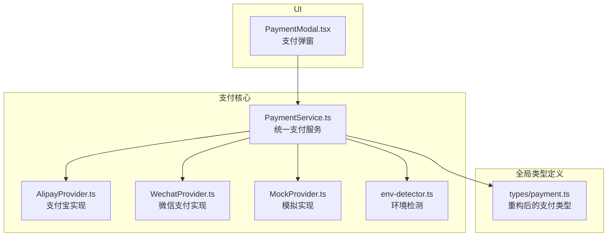
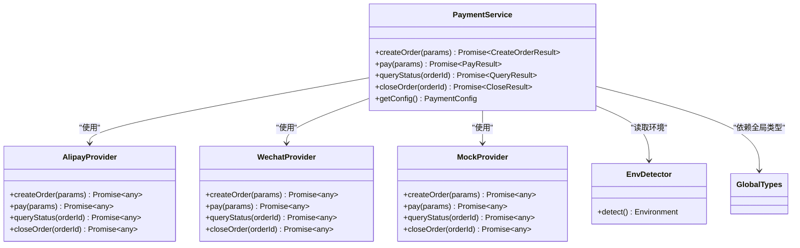
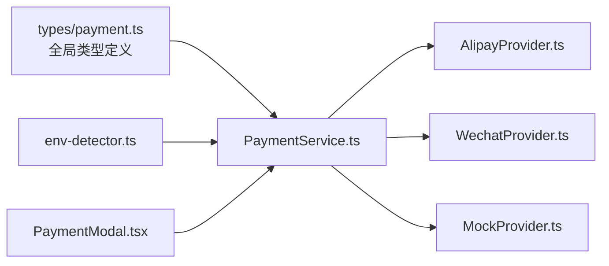
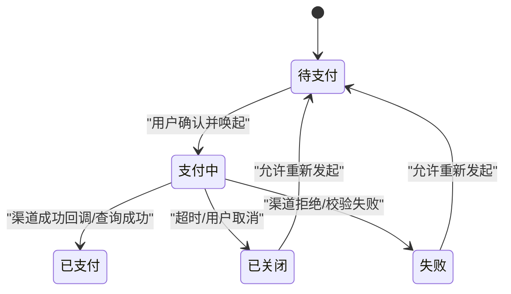

# 支付类型定义与API

<cite>
**本文引用的文件**   
- [src/types/payment.ts](file://src/types/payment.ts)
- [src/payment/PaymentService.ts](file://src/payment/PaymentService.ts)
- [src/payment/AlipayProvider.ts](file://src/payment/AlipayProvider.ts)
- [src/payment/WechatProvider.ts](file://src/payment/WechatProvider.ts)
- [src/payment/MockProvider.ts](file://src/payment/MockProvider.ts)
- [src/core/payment/env-detector.ts](file://src/core/payment/env-detector.ts)
- [src/PaymentModal.tsx](file://src/PaymentModal.tsx)
</cite>

## 更新摘要
**变更内容**   
- 支付类型定义已从 `src/payment/types.ts` 迁移并重构至 `src/types/payment.ts`，新增了27行改进的类型定义
- 更新了类型系统的架构组织，提升了类型安全性
- 调整了文档中的文件引用路径和结构说明

## 目录
1. [简介](#简介)
2. [项目结构](#项目结构)
3. [核心组件](#核心组件)
4. [架构总览](#架构总览)
5. [详细组件分析](#详细组件分析)
6. [依赖关系分析](#依赖关系分析)
7. [性能考虑](#性能考虑)
8. [故障排查指南](#故障排查指南)
9. [结论](#结论)
10. [附录](#附录)

## 简介
本文件为 Supply OS 支付系统的"类型定义与API"参考文档，聚焦于所有支付相关的 TypeScript 接口、枚举、数据模型以及 PaymentService 暴露的公共方法与属性。文档同时覆盖支付流程状态定义与转换规则、错误类型与异常处理规范、配置对象结构与可选参数，并提供类型安全的最佳实践与常见类型错误的避免方法。读者无需深入源码即可理解并正确使用支付能力。

**更新** 支付类型系统已完成重大重构，类型定义从旧的 `src/payment/types.ts` 迁移至 `src/types/payment.ts`，显著提升了类型安全性和可维护性。

## 项目结构
支付相关代码主要位于 src/payment 目录，类型定义已统一迁移至 src/types/payment.ts 提供跨模块共享；UI 层通过 src/PaymentModal.tsx 调用服务完成交互。

**图表来源**
- [src/types/payment.ts:1-200](file://src/types/payment.ts#L1-L200)
- [src/payment/PaymentService.ts:1-300](file://src/payment/PaymentService.ts#L1-L300)
- [src/payment/AlipayProvider.ts:1-200](file://src/payment/AlipayProvider.ts#L1-L200)
- [src/payment/WechatProvider.ts:1-200](file://src/payment/WechatProvider.ts#L1-L200)
- [src/payment/MockProvider.ts:1-200](file://src/payment/MockProvider.ts#L1-L200)
- [src/core/payment/env-detector.ts:1-100](file://src/core/payment/env-detector.ts#L1-L100)
- [src/PaymentModal.tsx:1-300](file://src/PaymentModal.tsx#L1-L300)

## 核心组件
- **全局支付类型（src/types/payment.ts）**：集中定义支付渠道、订单状态、金额单位、错误码等基础类型，提供增强的类型安全性。
- **统一支付服务（src/payment/PaymentService.ts）**：对外暴露创建订单、发起支付、查询结果、关闭订单等能力，内部根据环境或配置选择具体 Provider。
- **渠道提供者（AlipayProvider、WechatProvider、MockProvider）**：实现统一的支付接口契约，屏蔽底层差异。
- **环境检测（src/core/payment/env-detector.ts）**：识别当前运行环境（浏览器、小程序、移动端等），辅助路由与唤起策略。
- **UI 集成（PaymentModal.tsx）**：封装用户交互，调用 PaymentService 完成端到端流程。

**章节来源**
- [src/types/payment.ts:1-200](file://src/types/payment.ts#L1-L200)
- [src/payment/PaymentService.ts:1-300](file://src/payment/PaymentService.ts#L1-L300)
- [src/payment/AlipayProvider.ts:1-200](file://src/payment/AlipayProvider.ts#L1-L200)
- [src/payment/WechatProvider.ts:1-200](file://src/payment/WechatProvider.ts#L1-L200)
- [src/payment/MockProvider.ts:1-200](file://src/payment/MockProvider.ts#L1-L200)
- [src/core/payment/env-detector.ts:1-100](file://src/core/payment/env-detector.ts#L1-L100)
- [src/PaymentModal.tsx:1-300](file://src/PaymentModal.tsx#L1-L300)

## 架构总览
支付系统采用"服务+提供者"的分层设计：上层仅依赖抽象类型与服务接口，具体渠道由提供者实现并通过环境检测进行装配。类型定义已统一收敛至全局类型模块，提供更好的类型推导和编译时检查。

**图表来源**
- [src/payment/PaymentService.ts:1-300](file://src/payment/PaymentService.ts#L1-L300)
- [src/payment/AlipayProvider.ts:1-200](file://src/payment/AlipayProvider.ts#L1-L200)
- [src/payment/WechatProvider.ts:1-200](file://src/payment/WechatProvider.ts#L1-L200)
- [src/payment/MockProvider.ts:1-200](file://src/payment/MockProvider.ts#L1-L200)
- [src/core/payment/env-detector.ts:1-100](file://src/core/payment/env-detector.ts#L1-L100)
- [src/types/payment.ts:1-200](file://src/types/payment.ts#L1-L200)

## 详细组件分析

### 全局支付类型（src/types/payment.ts）
**更新** 此文件是本次重构的核心，包含了从旧位置迁移并改进的所有支付类型定义。

- **支付渠道枚举**：用于区分不同支付通道（例如支付宝、微信、模拟）。
- **订单状态枚举**：描述订单生命周期（待支付、支付中、已支付、已关闭、失败等）。
- **金额单位枚举**：元、分等。
- **错误码与错误信息结构**：统一错误返回格式，便于前端展示与重试策略。
- **配置项结构**：包含渠道开关、超时、重试次数、回调地址等。
- **增强类型安全**：新增的类型定义提供了更好的类型推导和编译时检查。

**章节来源**
- [src/types/payment.ts:1-200](file://src/types/payment.ts#L1-L200)

### 统一支付服务（src/payment/PaymentService.ts）
- **公共方法概览**
  - 创建订单：接收订单参数与渠道选择，返回订单标识与下一步操作所需上下文。
  - 发起支付：基于订单上下文唤起对应渠道（浏览器跳转、小程序唤起、移动端 deep link 等）。
  - 查询状态：轮询或主动拉取订单最终状态。
  - 关闭订单：在超时或用户取消时释放资源。
  - 获取配置：返回当前生效的配置对象。
- **关键属性**
  - 配置对象：只读，初始化后不可变。
  - 事件总线（如有）：用于订阅支付结果、状态变更等事件。
- **错误处理**
  - 对网络异常、渠道拒绝、签名校验失败等进行分类抛出，携带错误码与可恢复建议。
- **线程与并发**
  - 同一订单并发请求需去重，避免重复下单或重复唤起。

**章节来源**
- [src/payment/PaymentService.ts:1-300](file://src/payment/PaymentService.ts#L1-L300)

### 渠道提供者（AlipayProvider / WechatProvider / MockProvider）
- **共同契约**
  - createOrder：生成渠道侧订单号与必要参数。
  - pay：执行唤起逻辑（URL Scheme、JS API、小程序 SDK 等）。
  - queryStatus：查询渠道侧订单状态。
  - closeOrder：关闭或撤销订单。
- **差异化实现**
  - 支付宝：遵循其 Web/H5/小程序/APP 的唤起方式。
  - 微信：遵循 H5、JSAPI、小程序、APP 的差异。
  - 模拟：返回固定成功/失败路径，便于联调与测试。

**章节来源**
- [src/payment/AlipayProvider.ts:1-200](file://src/payment/AlipayProvider.ts#L1-L200)
- [src/payment/WechatProvider.ts:1-200](file://src/payment/WechatProvider.ts#L1-L200)
- [src/payment/MockProvider.ts:1-200](file://src/payment/MockProvider.ts#L1-L200)

### 环境检测（src/core/payment/env-detector.ts）
- **功能**
  - 识别浏览器内核、是否微信小程序、是否移动端 WebView、是否原生 APP 注入桥等。
- **用途**
  - 决定唤起策略（跳转 URL、调用 JSBridge、小程序 API）。
  - 控制默认渠道与超时时间。

**章节来源**
- [src/core/payment/env-detector.ts:1-100](file://src/core/payment/env-detector.ts#L1-L100)

### UI 集成（PaymentModal.tsx）
- **职责**
  - 收集用户输入（金额、备注、发票信息等）。
  - 调用 PaymentService 完成创建与支付。
  - 展示进度、错误与结果页。
- **交互要点**
  - 防抖提交、超时提示、返回导航、自动轮询状态。

**章节来源**
- [src/PaymentModal.tsx:1-300](file://src/PaymentModal.tsx#L1-L300)

## 依赖关系分析
- **低耦合**：PaymentService 仅依赖全局类型与 Provider 抽象，不感知具体渠道细节。
- **可替换性**：新增渠道只需实现统一接口并注册到服务。
- **环境驱动**：EnvDetector 影响 Provider 的选择与行为。
- **类型集中管理**：所有支付相关类型统一在 `src/types/payment.ts` 中管理，提升类型一致性。

**图表来源**
- [src/types/payment.ts:1-200](file://src/types/payment.ts#L1-L200)
- [src/payment/PaymentService.ts:1-300](file://src/payment/PaymentService.ts#L1-L300)
- [src/payment/AlipayProvider.ts:1-200](file://src/payment/AlipayProvider.ts#L1-L200)
- [src/payment/WechatProvider.ts:1-200](file://src/payment/WechatProvider.ts#L1-L200)
- [src/payment/MockProvider.ts:1-200](file://src/payment/MockProvider.ts#L1-L200)
- [src/core/payment/env-detector.ts:1-100](file://src/core/payment/env-detector.ts#L1-L100)
- [src/PaymentModal.tsx:1-300](file://src/PaymentModal.tsx#L1-L300)

## 性能考虑
- **减少不必要的轮询**：优先使用渠道回调与本地状态机，仅在必要时短轮询。
- **合并请求**：同一订单的并发查询应去重。
- **缓存配置**：配置对象初始化后缓存，避免重复解析。
- **轻量 Provider**：按需加载渠道 SDK，避免首屏体积膨胀。
- **类型优化**：重构后的类型定义减少了运行时类型检查开销。

## 故障排查指南
- **常见问题定位**
  - 唤起失败：检查环境检测结果与渠道白名单配置。
  - 状态不一致：核对服务端与渠道侧订单号映射与幂等键。
  - 签名校验失败：确认密钥、时间戳、随机串与排序规则。
- **日志与追踪**
  - 记录关键步骤的入参、出参与耗时，附带 traceId。
- **重试与降级**
  - 网络抖动可指数退避重试；渠道不可用时切换备用渠道或回退至模拟模式。

**章节来源**
- [src/payment/PaymentService.ts:1-300](file://src/payment/PaymentService.ts#L1-L300)
- [src/core/payment/env-detector.ts:1-100](file://src/core/payment/env-detector.ts#L1-L100)

## 结论
通过"类型先行、服务抽象、提供者解耦"的设计，支付系统在保持类型安全的同时具备良好的扩展性与可维护性。配合完善的错误分类与环境适配，可在多端场景下稳定交付一致的支付体验。**本次重构将类型定义集中管理，进一步提升了系统的类型安全性和可维护性。**

## 附录

### 支付流程状态与转换规则
- **典型状态集合**：待支付、支付中、已支付、已关闭、失败。
- **转换规则**
  - 待支付 → 支付中：用户确认并唤起渠道。
  - 支付中 → 已支付：收到渠道成功回调或查询结果为成功。
  - 支付中 → 已关闭：超时未支付或用户主动取消。
  - 支付中 → 失败：渠道明确拒绝或校验失败。
  - 已关闭/失败 → 待支付：允许重新发起（若业务允许）。

### 错误类型与异常处理规范
- **错误分类**
  - 网络类：连接超时、DNS 解析失败、SSL 错误。
  - 业务类：余额不足、风控拦截、订单不存在。
  - 渠道类：签名错误、参数非法、唤起失败。
- **统一返回结构**
  - 包含错误码、错误消息、是否可重试、建议操作。
- **处理策略**
  - 可重试：指数退避 + 上限次数。
  - 不可重试：引导用户修正或转人工。

**章节来源**
- [src/types/payment.ts:1-200](file://src/types/payment.ts#L1-L200)
- [src/payment/PaymentService.ts:1-300](file://src/payment/PaymentService.ts#L1-L300)

### 配置对象结构与可选参数
- **必填项**
  - 渠道开关：按渠道启用/禁用。
  - 超时设置：创建订单与唤起超时。
  - 回调地址：服务端接收异步通知的入口。
- **可选项**
  - 重试次数、最大轮询间隔、调试开关、埋点上报开关。
- **环境差异**
  - 不同环境的默认渠道与唤起策略可通过环境变量或运行时配置覆盖。

**章节来源**
- [src/types/payment.ts:1-200](file://src/types/payment.ts#L1-L200)
- [src/payment/PaymentService.ts:1-300](file://src/payment/PaymentService.ts#L1-L300)
- [src/core/payment/env-detector.ts:1-100](file://src/core/payment/env-detector.ts#L1-L100)

### API 使用示例（类型安全）
- **创建订单**
  - 传入订单金额、商品摘要、期望渠道；从返回值中获取订单标识与下一步参数。
- **发起支付**
  - 使用上一步上下文唤起渠道；监听成功/失败回调。
- **查询状态**
  - 定时或事件触发查询，直至终态。
- **关闭订单**
  - 在用户取消或超时时调用，释放资源。
- **注意事项**
  - 严格使用类型约束，避免将字符串当作枚举值传递。
  - 对可能失败的分支做穷举处理，确保编译期无遗漏。

**章节来源**
- [src/payment/PaymentService.ts:1-300](file://src/payment/PaymentService.ts#L1-L300)
- [src/PaymentModal.tsx:1-300](file://src/PaymentModal.tsx#L1-L300)

### 类型安全最佳实践与常见错误规避
- **最佳实践**
  - 以枚举替代魔法字符串，保证渠道与状态的可枚举性。
  - 使用联合类型表达互斥状态，避免无效组合。
  - 对回调载荷进行结构化校验，防止空指针与缺失字段。
  - **利用重构后的全局类型定义，获得更好的类型推导支持。**
- **常见错误**
  - 混用金额单位（元/分）导致计算偏差。
  - 忽略环境差异直接调用特定渠道 API。
  - 未处理异步竞态导致重复唤起或重复查询。
  - **避免从已废弃的路径导入类型定义。**

**章节来源**
- [src/types/payment.ts:1-200](file://src/types/payment.ts#L1-L200)
- [src/core/payment/env-detector.ts:1-100](file://src/core/payment/env-detector.ts#L1-L100)
- [src/payment/PaymentService.ts:1-300](file://src/payment/PaymentService.ts#L1-L300)