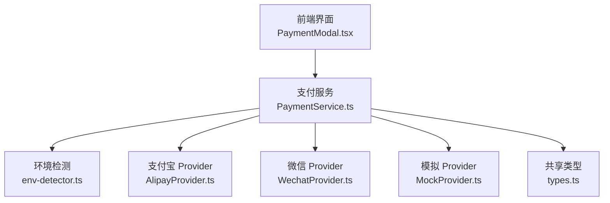
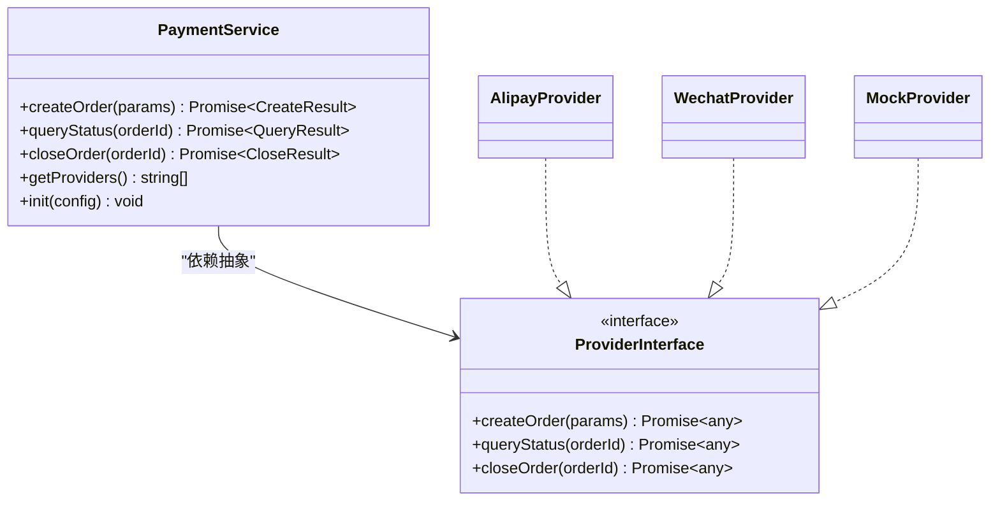
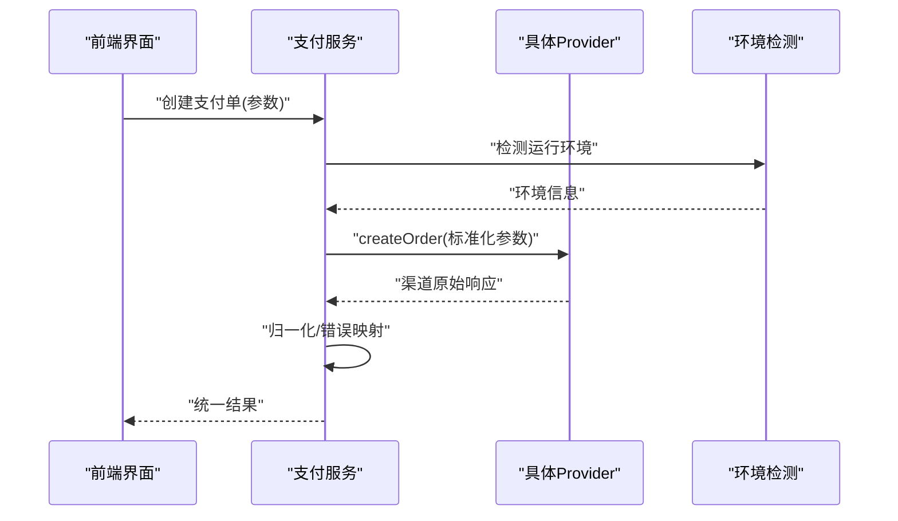
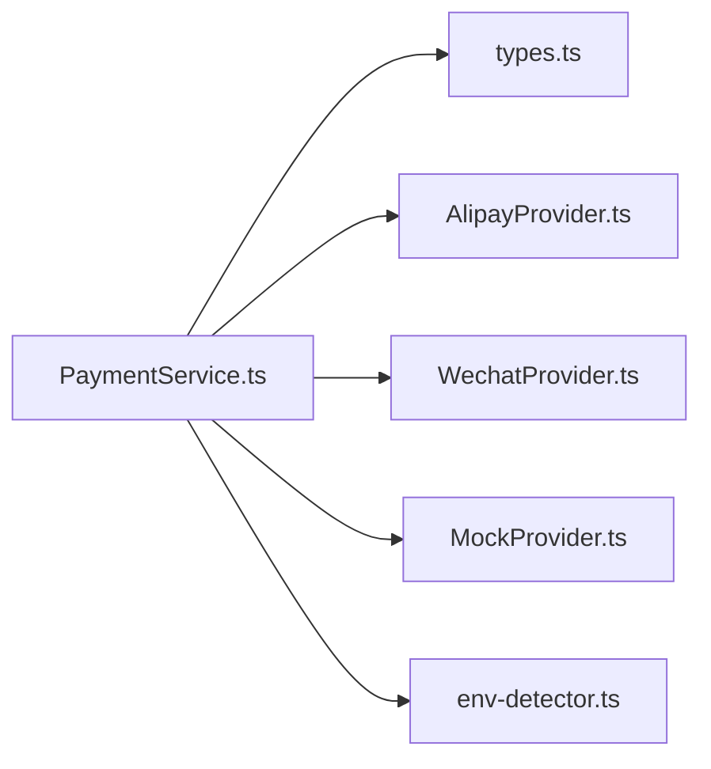

# 支付系统集成

<cite>
**本文引用的文件**   
- [PaymentService.ts](file://src/payment/PaymentService.ts)
- [AlipayProvider.ts](file://src/payment/AlipayProvider.ts)
- [WechatProvider.ts](file://src/payment/WechatProvider.ts)
- [MockProvider.ts](file://src/payment/MockProvider.ts)
- [types.ts](file://src/payment/types.ts)
- [env-detector.ts](file://src/payment/env-detector.ts)
- [PaymentModal.tsx](file://src/PaymentModal.tsx)
- [payment.ts](file://src/types/payment.ts)
</cite>

## 目录
1. [简介](#简介)
2. [项目结构](#项目结构)
3. [核心组件](#核心组件)
4. [架构总览](#架构总览)
5. [详细组件分析](#详细组件分析)
6. [依赖关系分析](#依赖关系分析)
7. [性能与可靠性](#性能与可靠性)
8. [安全与合规](#安全与合规)
9. [事务与异常处理](#事务与异常处理)
10. [API 参考](#api-参考)
11. [集成指南：新增支付方式](#集成指南新增支付方式)
12. [调试与排错](#调试与排错)
13. [结论](#结论)

## 简介
本技术文档面向 Supply OS 的支付子系统，聚焦于“抽象层 + Provider 模式”的设计与实现，覆盖支付宝、微信支付与模拟支付的集成方式、配置参数、调用流程、API 参考、安全与事务处理、异常机制、扩展新支付方式的步骤，以及调试技巧与常见问题解决方案。目标是帮助开发者快速理解并稳定扩展支付能力。

## 项目结构
支付相关代码位于 src/payment 目录，采用“服务编排 + 多 Provider 实现”的分层组织方式：
- PaymentService.ts：对外暴露统一支付入口，负责路由到具体 Provider、组装请求、聚合结果与错误。
- AlipayProvider.ts / WechatProvider.ts / MockProvider.ts：各支付渠道的具体实现，遵循统一的接口契约。
- types.ts：定义共享类型（订单、支付状态、回调、错误等）。
- env-detector.ts：环境检测工具，用于在浏览器/Node 环境中选择合适的能力或回退策略。
- PaymentModal.tsx：前端支付弹窗，封装发起支付、轮询/监听结果、展示状态等交互逻辑。
- payment.ts（全局类型）：业务侧对支付类型的补充定义。

图表来源
- [PaymentService.ts](file://src/payment/PaymentService.ts)
- [AlipayProvider.ts](file://src/payment/AlipayProvider.ts)
- [WechatProvider.ts](file://src/payment/WechatProvider.ts)
- [MockProvider.ts](file://src/payment/MockProvider.ts)
- [types.ts](file://src/payment/types.ts)
- [env-detector.ts](file://src/payment/env-detector.ts)
- [PaymentModal.tsx](file://src/PaymentModal.tsx)

章节来源
- [PaymentService.ts](file://src/payment/PaymentService.ts)
- [PaymentModal.tsx](file://src/PaymentModal.tsx)
- [types.ts](file://src/payment/types.ts)
- [env-detector.ts](file://src/payment/env-detector.ts)

## 核心组件
- 支付服务（PaymentService）
  - 职责：统一入口、参数校验、渠道路由、结果归一化、错误映射、重试/超时控制（如适用）。
  - 关键方法：创建支付单、查询支付状态、关闭支付单、获取渠道列表、初始化配置。
- Provider 抽象与实现
  - 抽象契约：统一的方法签名（创建、查询、关闭）、统一的错误模型、统一的回调/通知处理约定。
  - 实现类：
    - 支付宝 Provider：对接支付宝 SDK/REST，处理签名、跳转/唤起、异步通知解析。
    - 微信 Provider：对接微信支付 SDK/REST，处理 JSAPI/H5/小程序唤起、异步通知解析。
    - 模拟 Provider：本地生成订单号、模拟成功/失败路径，便于联调与自动化测试。
- 类型系统（types.ts）
  - 定义订单、支付状态、渠道枚举、错误码、回调载荷等，确保前后端与 Provider 间契约一致。
- 环境检测（env-detector.ts）
  - 识别运行环境（浏览器/Node），决定使用何种唤起方式或回退策略。

章节来源
- [PaymentService.ts](file://src/payment/PaymentService.ts)
- [AlipayProvider.ts](file://src/payment/AlipayProvider.ts)
- [WechatProvider.ts](file://src/payment/WechatProvider.ts)
- [MockProvider.ts](file://src/payment/MockProvider.ts)
- [types.ts](file://src/payment/types.ts)
- [env-detector.ts](file://src/payment/env-detector.ts)

## 架构总览
整体采用“服务编排 + Provider 插件化”的架构。上层仅依赖抽象契约，新增渠道无需改动现有调用方。

图表来源
- [PaymentService.ts](file://src/payment/PaymentService.ts)
- [AlipayProvider.ts](file://src/payment/AlipayProvider.ts)
- [WechatProvider.ts](file://src/payment/WechatProvider.ts)
- [MockProvider.ts](file://src/payment/MockProvider.ts)
- [types.ts](file://src/payment/types.ts)

## 详细组件分析

### 支付服务（PaymentService）
- 设计要点
  - 统一入口：对外只暴露稳定的方法集，屏蔽渠道差异。
  - 参数校验：在进入 Provider 前进行必要校验，减少无效网络请求。
  - 结果归一化：将不同渠道返回的结构转换为统一模型，便于上层消费。
  - 错误映射：将渠道错误码映射为内部错误码，提供可读的错误信息。
  - 可插拔：通过注册表/工厂动态加载 Provider，支持运行时切换。
- 典型流程
  - 创建支付单：接收业务参数 -> 校验 -> 选择 Provider -> 调用 createOrder -> 返回统一结果。
  - 查询支付状态：按 orderId 轮询/拉取 -> 统一状态映射 -> 返回。
  - 关闭支付单：幂等调用 -> 返回统一结果。
- 与环境的协作
  - 根据 env-detector 的结果决定唤起方式（例如 H5/小程序/PC 扫码）。

图表来源
- [PaymentService.ts](file://src/payment/PaymentService.ts)
- [env-detector.ts](file://src/payment/env-detector.ts)
- [AlipayProvider.ts](file://src/payment/AlipayProvider.ts)
- [WechatProvider.ts](file://src/payment/WechatProvider.ts)
- [MockProvider.ts](file://src/payment/MockProvider.ts)

章节来源
- [PaymentService.ts](file://src/payment/PaymentService.ts)
- [env-detector.ts](file://src/payment/env-detector.ts)

### 支付宝 Provider（AlipayProvider）
- 职责
  - 构造支付宝下单请求（签名、参数拼装）。
  - 处理唤起/跳转（H5/扫码/APP 内）。
  - 解析异步通知与验签。
- 关键行为
  - 金额单位与币种转换。
  - 超时与重试策略（服务端侧）。
  - 幂等键/防重放（基于订单号与时间戳）。
- 错误处理
  - 将支付宝错误码映射为内部错误码，区分用户侧与系统侧错误。

章节来源
- [AlipayProvider.ts](file://src/payment/AlipayProvider.ts)
- [types.ts](file://src/payment/types.ts)

### 微信支付 Provider（WechatProvider）
- 职责
  - 构造微信支付下单请求（JSAPI/H5/小程序）。
  - 处理唤起与回调。
  - 解析异步通知与验签。
- 关键行为
  - 商户号、证书、密钥等敏感配置管理。
  - 统一下单与预支付会话 ID 的处理。
  - 支付结果二次确认（服务端验签）。
- 错误处理
  - 将微信错误码映射为内部错误码，提示用户重试或联系人工。

章节来源
- [WechatProvider.ts](file://src/payment/WechatProvider.ts)
- [types.ts](file://src/payment/types.ts)

### 模拟 Provider（MockProvider）
- 职责
  - 生成确定性订单号与支付结果。
  - 支持注入成功/失败场景，便于端到端测试。
- 关键行为
  - 不发起真实网络请求。
  - 可配置延迟以模拟网络抖动。
- 使用建议
  - 开发/测试环境默认启用。
  - 生产环境禁用。

章节来源
- [MockProvider.ts](file://src/payment/MockProvider.ts)
- [types.ts](file://src/payment/types.ts)

### 类型与环境检测
- types.ts
  - 定义订单、支付状态、渠道枚举、错误码、回调载荷等，保证跨模块一致性。
- env-detector.ts
  - 识别浏览器/Node 环境，辅助选择唤起方式与回退策略。

章节来源
- [types.ts](file://src/payment/types.ts)
- [env-detector.ts](file://src/payment/env-detector.ts)

## 依赖关系分析
- 低耦合高内聚
  - PaymentService 仅依赖 Provider 抽象，新增渠道不影响既有调用方。
  - 类型集中在 types.ts，避免重复定义。
- 外部依赖
  - 各 Provider 分别依赖对应 SDK/HTTP 客户端。
  - 环境检测模块仅在需要时引入，降低包体积。

图表来源
- [PaymentService.ts](file://src/payment/PaymentService.ts)
- [AlipayProvider.ts](file://src/payment/AlipayProvider.ts)
- [WechatProvider.ts](file://src/payment/WechatProvider.ts)
- [MockProvider.ts](file://src/payment/MockProvider.ts)
- [types.ts](file://src/payment/types.ts)
- [env-detector.ts](file://src/payment/env-detector.ts)

章节来源
- [PaymentService.ts](file://src/payment/PaymentService.ts)
- [types.ts](file://src/payment/types.ts)

## 性能与可靠性
- 连接与超时
  - 合理设置 HTTP 超时与重试次数，避免雪崩。
- 并发与幂等
  - 所有写操作需具备幂等性（基于订单号/流水号）。
- 缓存与降级
  - 查询状态可短期缓存；渠道不可用时自动降级至备用渠道或提示。
- 资源清理
  - 及时释放连接、取消未完成的轮询任务。

[本节为通用指导，不涉及具体文件]

## 安全与合规
- 密钥与证书
  - 使用环境变量或密钥管理服务存储，禁止硬编码。
- 签名与验签
  - 所有敏感请求必须签名；回调必须严格验签。
- 传输安全
  - 全链路 HTTPS，校验证书链。
- 数据最小化
  - 仅收集必要字段，敏感信息脱敏展示。
- 审计与日志
  - 记录关键事件（创建、支付、回调、失败），避免记录敏感明文。

[本节为通用指导，不涉及具体文件]

## 事务与异常处理
- 事务边界
  - 建议在业务侧维护订单状态机，支付回调作为最终一致性保障。
- 异常分类
  - 用户侧错误（余额不足、取消）与系统侧错误（网关超时、签名失败）分开处理。
- 重试与补偿
  - 对幂等操作可重试；对非幂等操作需加锁或去重。
- 错误码映射
  - 将渠道错误码映射为内部错误码，统一向上抛出。

章节来源
- [PaymentService.ts](file://src/payment/PaymentService.ts)
- [types.ts](file://src/payment/types.ts)

## API 参考
以下为统一支付接口约定（具体字段以 types.ts 为准）：

- 创建支付单
  - 输入：订单号、金额、币种、商品描述、渠道标识、附加信息等。
  - 输出：统一支付结果（包含唤起链接/参数、订单号、渠道原始响应摘要）。
  - 错误：参数校验失败、渠道不可用、签名失败等。
- 查询支付状态
  - 输入：订单号。
  - 输出：统一状态（待支付、已支付、已关闭、失败等）及时间戳。
  - 错误：订单不存在、渠道查询失败等。
- 关闭支付单
  - 输入：订单号。
  - 输出：关闭结果。
  - 错误：订单已关闭、渠道拒绝等。
- 获取渠道列表
  - 输出：可用渠道枚举。
- 初始化配置
  - 输入：各渠道配置项（密钥、证书、开关等）。
  - 输出：初始化结果。

注意：
- 所有金额字段建议使用整数分或统一精度表示。
- 所有回调必须验签后再更新业务状态。
- 错误码请参见 types.ts 中的定义。

章节来源
- [PaymentService.ts](file://src/payment/PaymentService.ts)
- [types.ts](file://src/payment/types.ts)

## 集成指南：新增支付方式
- 步骤
  1. 在 types.ts 中扩展渠道枚举与必要的类型定义。
  2. 新建 Provider 实现类，遵循统一接口契约（创建、查询、关闭、回调处理）。
  3. 在 PaymentService 中注册该 Provider，并实现路由逻辑。
  4. 在 env-detector 中补充环境判断（如需）。
  5. 编写单元测试与端到端用例（可使用 MockProvider 作为基线）。
- 最佳实践
  - 保持 Provider 无副作用，尽量纯函数化。
  - 将敏感配置从代码中剥离，使用环境变量注入。
  - 对第三方 SDK 做薄封装，便于替换与升级。

章节来源
- [PaymentService.ts](file://src/payment/PaymentService.ts)
- [types.ts](file://src/payment/types.ts)
- [env-detector.ts](file://src/payment/env-detector.ts)

## 调试与排错
- 前端调试
  - 使用 MockProvider 快速验证 UI 流程。
  - 打印统一错误对象，关注错误码与消息。
- 后端/渠道联调
  - 开启渠道沙箱环境。
  - 记录请求/响应摘要（脱敏），定位签名与参数问题。
- 常见问题
  - 唤起失败：检查环境检测与唤起参数。
  - 回调未触发：核对域名白名单、端口与公网可达性。
  - 状态不一致：检查幂等键与重试策略。
  - 签名失败：核对密钥、版本与排序规则。

章节来源
- [PaymentModal.tsx](file://src/PaymentModal.tsx)
- [MockProvider.ts](file://src/payment/MockProvider.ts)
- [types.ts](file://src/payment/types.ts)

## 结论
通过“服务编排 + Provider 插件化”的架构，Supply OS 支付子系统实现了高内聚、低耦合与易扩展。统一类型与错误模型保障了稳定性，环境检测提升了适配能力。遵循本文的安全、事务与异常处理建议，可快速、可靠地接入新的支付方式。