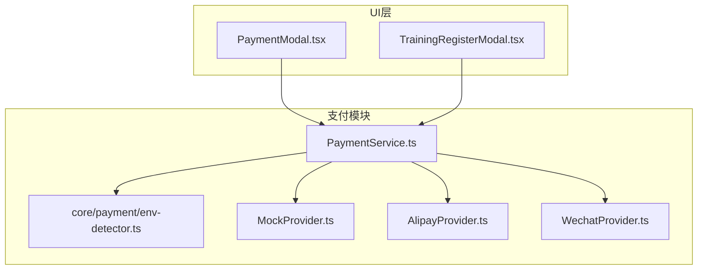
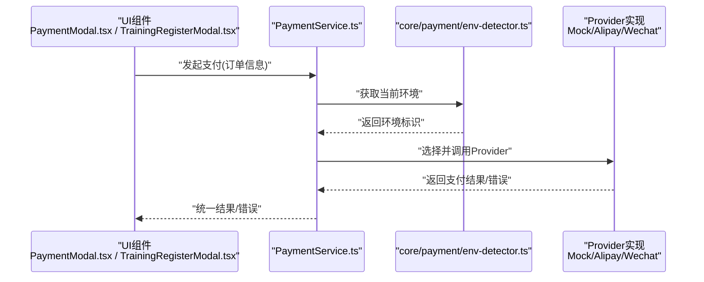
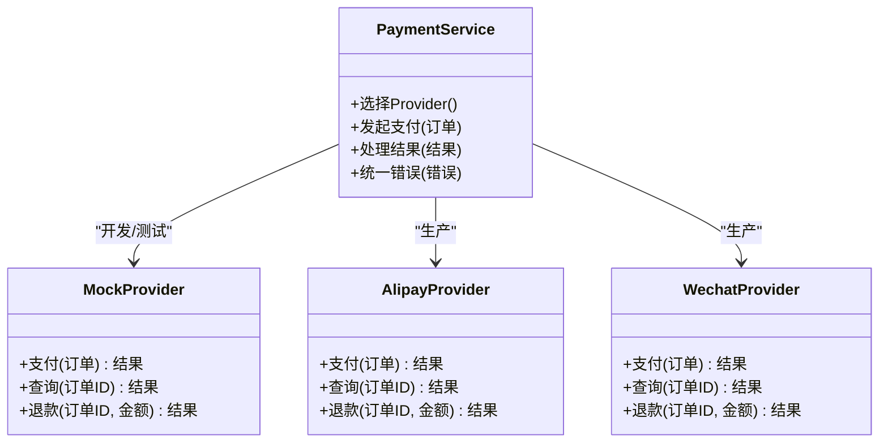
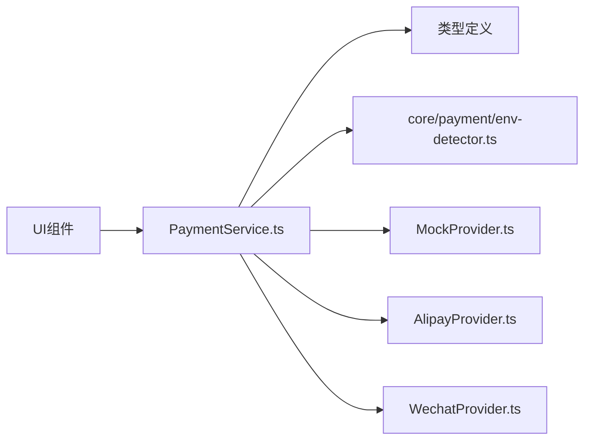

# 模拟支付提供商

<cite>
**本文引用的文件**   
- [MockProvider.ts](file://src/payment/MockProvider.ts)
- [PaymentService.ts](file://src/payment/PaymentService.ts)
- [env-detector.ts](file://src/core/payment/env-detector.ts)
- [index.ts](file://src/core/payment/index.ts)
- [AlipayProvider.ts](file://src/payment/AlipayProvider.ts)
- [WechatProvider.ts](file://src/payment/WechatProvider.ts)
- [PaymentModal.tsx](file://src/PaymentModal.tsx)
- [TrainingRegisterModal.tsx](file://src/TrainingRegisterModal.tsx)
</cite>

## 更新摘要
**变更内容**   
- 更新了环境检测器文件路径以适配新的模块结构
- 调整了导入路径以反映核心支付模块的重新组织
- 更新了架构图和依赖关系图以匹配新的文件位置

## 目录
1. [简介](#简介)
2. [项目结构](#项目结构)
3. [核心组件](#核心组件)
4. [架构总览](#架构总览)
5. [详细组件分析](#详细组件分析)
6. [依赖关系分析](#依赖关系分析)
7. [性能考虑](#性能考虑)
8. [故障排查指南](#故障排查指南)
9. [结论](#结论)
10. [附录](#附录)

## 简介
本技术文档面向Supply OS的"模拟支付提供商"能力，聚焦于MockProvider的设计目的、实现逻辑、测试与断言机制、环境切换配置方法，以及在不同场景（成功、失败、异常）下的用例设计与最佳实践。文档同时提供单元测试与集成测试建议、功能演示与用户验收测试指引，并包含测试数据准备与环境搭建说明，帮助开发者在开发/测试环境中快速验证支付流程，降低对真实支付网关的依赖。

## 项目结构
围绕支付能力的代码主要位于src/payment目录，并通过UI层组件进行调用。关键文件包括：
- 支付提供者抽象与实现：MockProvider.ts、AlipayProvider.ts、WechatProvider.ts
- 支付服务编排：PaymentService.ts
- 运行环境检测：core/payment/env-detector.ts
- UI集成入口：PaymentModal.tsx、TrainingRegisterModal.tsx

图表来源
- [PaymentService.ts](file://src/payment/PaymentService.ts)
- [env-detector.ts](file://src/core/payment/env-detector.ts)
- [MockProvider.ts](file://src/payment/MockProvider.ts)
- [AlipayProvider.ts](file://src/payment/AlipayProvider.ts)
- [WechatProvider.ts](file://src/payment/WechatProvider.ts)
- [PaymentModal.tsx](file://src/PaymentModal.tsx)
- [TrainingRegisterModal.tsx](file://src/TrainingRegisterModal.tsx)

章节来源
- [PaymentService.ts](file://src/payment/PaymentService.ts)
- [env-detector.ts](file://src/core/payment/env-detector.ts)
- [MockProvider.ts](file://src/payment/MockProvider.ts)
- [AlipayProvider.ts](file://src/payment/AlipayProvider.ts)
- [WechatProvider.ts](file://src/payment/WechatProvider.ts)
- [PaymentModal.tsx](file://src/PaymentModal.tsx)
- [TrainingRegisterModal.tsx](file://src/TrainingRegisterModal.tsx)

## 核心组件
- 环境检测（env-detector.ts）
  - 根据环境变量或运行时条件决定使用MockProvider还是真实Provider，支持开发/测试/生产环境的灵活切换。
- 支付服务（PaymentService.ts）
  - 编排支付流程：选择Provider、发起支付、处理回调/结果、统一错误映射与重试策略。
- 模拟支付提供商（MockProvider.ts）
  - 在开发/测试环境模拟支付网关行为，支持可控的成功、失败与异常分支，便于覆盖各类路径。
- 真实支付提供商（AlipayProvider.ts、WechatProvider.ts）
  - 对接支付宝/微信等真实网关，遵循与Mock一致的接口契约，保证可替换性。

章节来源
- [env-detector.ts](file://src/core/payment/env-detector.ts)
- [PaymentService.ts](file://src/payment/PaymentService.ts)
- [MockProvider.ts](file://src/payment/MockProvider.ts)
- [AlipayProvider.ts](file://src/payment/AlipayProvider.ts)
- [WechatProvider.ts](file://src/payment/WechatProvider.ts)

## 架构总览
支付模块采用"服务编排 + Provider多态"的架构：
- PaymentService负责流程控制与错误归一化；
- env-detector根据环境动态注入具体Provider；
- MockProvider用于开发与测试，提供确定性行为；
- AlipayProvider/WechatProvider用于生产环境。

图表来源
- [PaymentService.ts](file://src/payment/PaymentService.ts)
- [env-detector.ts](file://src/core/payment/env-detector.ts)
- [MockProvider.ts](file://src/payment/MockProvider.ts)
- [AlipayProvider.ts](file://src/payment/AlipayProvider.ts)
- [WechatProvider.ts](file://src/payment/WechatProvider.ts)
- [PaymentModal.tsx](file://src/PaymentModal.tsx)
- [TrainingRegisterModal.tsx](file://src/TrainingRegisterModal.tsx)

## 详细组件分析

### 模拟支付提供商（MockProvider）
设计目的
- 为开发与测试提供稳定、可预测的支付行为，避免外部依赖不稳定带来的不确定性。
- 支持多种场景：成功、失败、超时、网络异常、参数校验失败等，便于全面覆盖边界条件。

实现要点
- 遵循统一的Provider接口契约，与真实Provider保持一致的入参与出参结构。
- 通过配置或输入参数控制返回结果，例如基于金额、商户号、订单类型等触发不同分支。
- 提供延迟模拟以复现网络延迟与超时场景。
- 输出结构化错误码与消息，便于上层统一处理与展示。

典型场景
- 成功：返回支付完成状态与必要凭证。
- 失败：返回业务拒绝、余额不足、风控拦截等错误码。
- 异常：抛出网络错误、超时、内部错误等异常，供上层捕获与重试。

章节来源
- [MockProvider.ts](file://src/payment/MockProvider.ts)

#### 类图（概念映射到实际文件）

图表来源
- [PaymentService.ts](file://src/payment/PaymentService.ts)
- [MockProvider.ts](file://src/payment/MockProvider.ts)
- [AlipayProvider.ts](file://src/payment/AlipayProvider.ts)
- [WechatProvider.ts](file://src/payment/WechatProvider.ts)

### 环境检测与Provider切换（env-detector.ts）
- 依据环境变量或运行时配置返回目标Provider类型。
- 支持按域名、构建标记或显式开关切换。
- 提供默认回退策略，确保未配置时仍可使用安全的Mock实现。

**更新** 文件路径已从src/payment/env-detector.ts迁移至src/core/payment/env-detector.ts以适配新的模块结构。

章节来源
- [env-detector.ts](file://src/core/payment/env-detector.ts)

### 支付服务编排（PaymentService.ts）
职责
- 解析并校验订单参数。
- 根据环境选择Provider。
- 调用Provider执行支付、查询、退款等操作。
- 将Provider差异化的错误映射为统一错误模型。
- 可选：重试、幂等键生成、日志埋点。

章节来源
- [PaymentService.ts](file://src/payment/PaymentService.ts)

### UI集成（PaymentModal.tsx、TrainingRegisterModal.tsx）
- 向PaymentService提交支付请求，接收统一结果并更新界面状态。
- 展示加载、成功、失败与错误提示。
- 在培训报名等场景中串联支付流程与后续业务动作。

章节来源
- [PaymentModal.tsx](file://src/PaymentModal.tsx)
- [TrainingRegisterModal.tsx](file://src/TrainingRegisterModal.tsx)

## 依赖关系分析
- PaymentService依赖types.ts定义的契约，依赖env-detector.ts进行Provider选择，依赖具体Provider实现执行支付。
- UI层仅依赖PaymentService暴露的API，屏蔽底层Provider差异。
- 通过Provider多态实现低耦合扩展，新增支付方式只需实现相同接口并在env-detector中注册。

图表来源
- [PaymentService.ts](file://src/payment/PaymentService.ts)
- [env-detector.ts](file://src/core/payment/env-detector.ts)
- [MockProvider.ts](file://src/payment/MockProvider.ts)
- [AlipayProvider.ts](file://src/payment/AlipayProvider.ts)
- [WechatProvider.ts](file://src/payment/WechatProvider.ts)

章节来源
- [PaymentService.ts](file://src/payment/PaymentService.ts)
- [env-detector.ts](file://src/core/payment/env-detector.ts)
- [MockProvider.ts](file://src/payment/MockProvider.ts)
- [AlipayProvider.ts](file://src/payment/AlipayProvider.ts)
- [WechatProvider.ts](file://src/payment/WechatProvider.ts)

## 性能考虑
- MockProvider应避免不必要的I/O与复杂计算，保持轻量与确定性，以提升单测与联调效率。
- 在需要模拟延迟的场景下，使用可控的固定延迟而非随机值，确保测试可重复。
- PaymentService应缓存必要的只读配置，减少重复读取开销。
- 对于批量操作，注意批内幂等与去重，避免重复计费。

## 故障排查指南
常见问题与定位思路
- 环境切换无效
  - 检查env-detector的环境判断逻辑与变量名是否匹配。
  - 确认构建/运行时的环境变量注入是否正确。
- 支付结果不一致
  - 核对MockProvider的分支条件是否与输入参数一致。
  - 检查PaymentService的错误映射是否覆盖了Provider返回的所有错误码。
- UI未正确显示错误
  - 确认UI层对统一错误模型的字段映射是否正确。
  - 检查是否遗漏了特定错误类型的提示文案。

章节来源
- [env-detector.ts](file://src/core/payment/env-detector.ts)
- [PaymentService.ts](file://src/payment/PaymentService.ts)
- [MockProvider.ts](file://src/payment/MockProvider.ts)
- [PaymentModal.tsx](file://src/PaymentModal.tsx)
- [TrainingRegisterModal.tsx](file://src/TrainingRegisterModal.tsx)

## 结论
通过MockProvider与Provider多态设计，Supply OS在开发与测试阶段获得了高确定性的支付能力，显著降低了对外部网关的依赖风险。配合env-detector的环境切换机制，可在不同环境下无缝切换实现，既保障开发效率，又确保生产可用性与一致性。建议在持续集成中引入针对Mock的多场景用例，结合UI层的端到端演练，提升整体质量与交付信心。

## 附录

### 环境切换配置方法
- 通过环境变量或运行时配置指定目标Provider（如mock、alipay、wechat）。
- 在env-detector中实现环境到Provider的映射逻辑。
- 在本地开发默认使用Mock，在CI/预发环境可按需切换至真实Provider或保留Mock进行回归。

**更新** 环境检测器文件已迁移至core/payment目录，导入路径相应调整。

章节来源
- [env-detector.ts](file://src/core/payment/env-detector.ts)

### 测试用例与断言机制
- 成功路径：构造有效订单，断言返回成功状态与必要字段。
- 失败路径：构造拒绝场景（如余额不足、风控），断言错误码与错误消息。
- 异常路径：模拟网络错误、超时、内部异常，断言上层能正确捕获与重试。
- 边界条件：金额为0、负数、超大金额、非法字符等，断言参数校验与错误提示。
- 幂等性：重复提交同一订单，断言不会重复扣款或产生重复记录。

章节来源
- [MockProvider.ts](file://src/payment/MockProvider.ts)
- [PaymentService.ts](file://src/payment/PaymentService.ts)

### 单元测试与集成测试最佳实践
- 单元测试
  - 隔离MockProvider，验证PaymentService的流程编排与错误映射。
  - 针对env-detector编写环境切换的用例，覆盖所有分支。
- 集成测试
  - 在受控环境中串联UI与服务，验证端到端流程。
  - 使用稳定的测试数据与固定的时间基准，确保可重复性。
- 断言建议
  - 断言状态码、错误码、关键字段存在性与取值范围。
  - 断言UI层对用户可见的提示信息与交互状态。

章节来源
- [PaymentService.ts](file://src/payment/PaymentService.ts)
- [env-detector.ts](file://src/core/payment/env-detector.ts)
- [PaymentModal.tsx](file://src/PaymentModal.tsx)
- [TrainingRegisterModal.tsx](file://src/TrainingRegisterModal.tsx)

### 功能演示与用户验收测试
- 演示脚本
  - 使用MockProvider构造典型订单，逐步展示成功、失败与异常流程。
  - 在UI层展示加载、成功与错误提示，验证用户体验。
- 验收要点
  - 支付结果与订单状态一致。
  - 错误提示清晰且可操作（如重试、联系客服）。
  - 关键路径无阻塞性错误。

章节来源
- [PaymentModal.tsx](file://src/PaymentModal.tsx)
- [TrainingRegisterModal.tsx](file://src/TrainingRegisterModal.tsx)
- [MockProvider.ts](file://src/payment/MockProvider.ts)

### 测试数据准备与环境搭建
- 测试数据
  - 准备不同金额、不同商品类型、不同商户号的订单集合。
  - 准备触发失败与异常的参数组合。
- 环境搭建
  - 设置本地环境变量以启用MockProvider。
  - 在CI中复用相同的Mock配置，确保回归稳定性。
  - 如需接入真实Provider，按env-detector的配置方式切换。

**更新** 环境检测器文件路径已更新，需在环境配置中引用新的路径。

章节来源
- [env-detector.ts](file://src/core/payment/env-detector.ts)
- [MockProvider.ts](file://src/payment/MockProvider.ts)