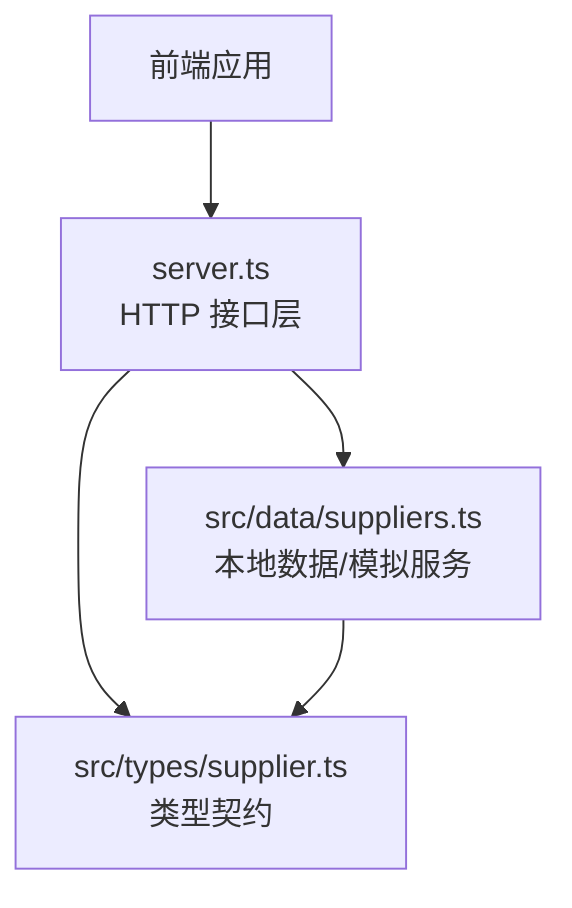
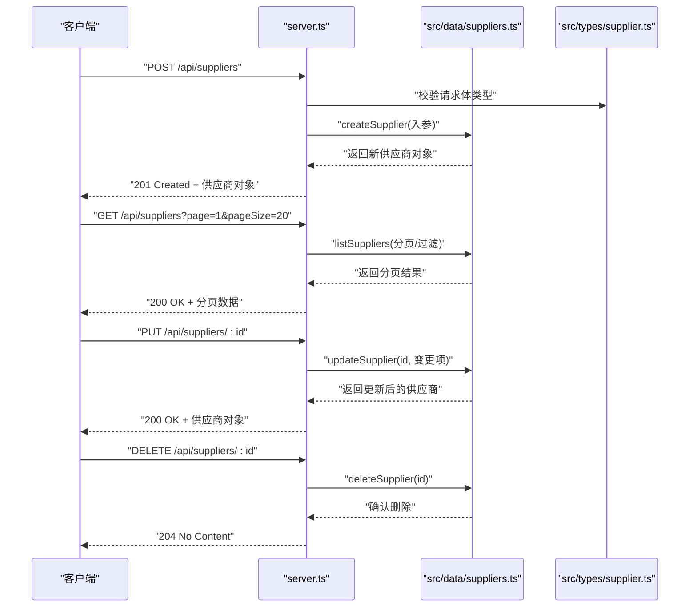
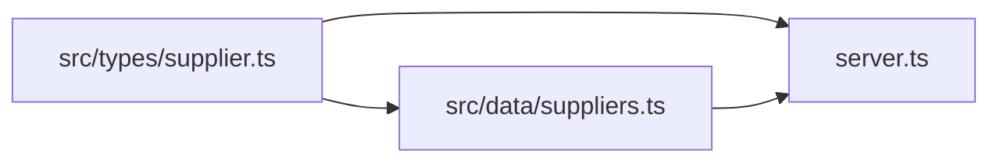

# 供应商CRUD操作

<cite>
**本文引用的文件**   
- [src/types/supplier.ts](file://src/types/supplier.ts)
- [src/data/suppliers.ts](file://src/data/suppliers.ts)
- [server.ts](file://server.ts)
</cite>

## 目录
1. [简介](#简介)
2. [项目结构](#项目结构)
3. [核心组件](#核心组件)
4. [架构总览](#架构总览)
5. [详细组件分析](#详细组件分析)
6. [依赖关系分析](#依赖关系分析)
7. [性能考虑](#性能考虑)
8. [故障排查指南](#故障排查指南)
9. [结论](#结论)
10. [附录](#附录)

## 简介
本文件面向Supply OS中的“供应商”模块，提供完整的CRUD（创建、读取、更新、删除）API参考与最佳实践。内容覆盖：
- 请求参数、响应格式与错误处理机制
- 批量操作、事务处理与并发控制建议
- 常见使用场景示例路径（新增供应商、更新资质信息、查询列表等）
- 数据验证规则与异常处理策略
- 性能优化与缓存策略

说明：当前仓库为前端工程，包含类型定义与本地数据模拟；后端接口由server.ts暴露。为保证准确性，本文所有实现细节均基于仓库现有代码进行分析与归纳。

## 项目结构
与供应商CRUD相关的核心位置如下：
- 类型定义：src/types/supplier.ts
- 本地数据与模拟逻辑：src/data/suppliers.ts
- 服务端路由/接口：server.ts

图表来源
- [server.ts](file://server.ts)
- [src/data/suppliers.ts](file://src/data/suppliers.ts)
- [src/types/supplier.ts](file://src/types/supplier.ts)

章节来源
- [src/types/supplier.ts](file://src/types/supplier.ts)
- [src/data/suppliers.ts](file://src/data/suppliers.ts)
- [server.ts](file://server.ts)

## 核心组件
- 类型契约（src/types/supplier.ts）
  - 定义供应商实体字段、枚举与校验约束，作为前后端交互的单一事实来源。
- 本地数据/模拟服务（src/data/suppliers.ts）
  - 维护内存中的供应商集合，提供增删改查、分页、过滤等能力，用于演示与联调。
- 服务端接口（server.ts）
  - 暴露REST风格接口，转发到本地数据服务，返回统一响应结构。

章节来源
- [src/types/supplier.ts](file://src/types/supplier.ts)
- [src/data/suppliers.ts](file://src/data/suppliers.ts)
- [server.ts](file://server.ts)

## 架构总览
整体流程：客户端通过HTTP调用server.ts提供的接口，server.ts根据路由将请求分发至本地数据服务（src/data/suppliers.ts），后者基于内存数据结构完成CRUD并返回结果。类型定义（src/types/supplier.ts）贯穿全链路，确保请求/响应一致性。

图表来源
- [server.ts](file://server.ts)
- [src/data/suppliers.ts](file://src/data/suppliers.ts)
- [src/types/supplier.ts](file://src/types/supplier.ts)

## 详细组件分析

### 数据模型与类型契约（src/types/supplier.ts）
- 作用：集中定义供应商实体的字段、枚举值、必填项与长度限制等，作为前后端契约。
- 关键要点：
  - 标识符：供应商ID（唯一）
  - 基本信息：名称、统一社会信用代码、联系人、电话、邮箱、地址等
  - 资质信息：许可证号、有效期、经营范围、认证等级等
  - 状态与标签：启用/禁用、合作等级、行业分类、标签集合
  - 审计字段：创建时间、更新时间、创建人、更新人
- 复杂度：O(1) 访问；序列化/反序列化为线性成本。

章节来源
- [src/types/supplier.ts](file://src/types/supplier.ts)

### 本地数据与模拟服务（src/data/suppliers.ts）
- 职责：
  - 维护内存中的供应商集合
  - 提供增删改查、分页、过滤、排序等基础能力
  - 生成稳定ID（如自增或UUID）
- 典型方法：
  - createSupplier(data): 新增供应商
  - getSupplierById(id): 按ID获取
  - listSuppliers(params): 分页+过滤
  - updateSupplier(id, patch): 部分更新
  - deleteSupplier(id): 删除
  - batchCreate(items): 批量新增
  - batchDelete(ids): 批量删除
- 并发与一致性：
  - 当前为单进程内存存储，天然串行执行，无锁竞争
  - 若扩展为多实例，需引入分布式锁或外部存储的事务支持

章节来源
- [src/data/suppliers.ts](file://src/data/suppliers.ts)

### 服务端接口（server.ts）
- 职责：
  - 暴露REST API
  - 解析请求参数、进行基础校验
  - 调用本地数据服务完成业务逻辑
  - 封装统一响应结构与错误码
- 典型路由：
  - POST /api/suppliers：创建供应商
  - GET /api/suppliers：查询供应商列表（支持分页、过滤）
  - GET /api/suppliers/:id：获取单个供应商
  - PUT /api/suppliers/:id：更新供应商
  - DELETE /api/suppliers/:id：删除供应商
  - POST /api/suppliers/batch：批量新增
  - DELETE /api/suppliers/batch：批量删除
- 统一响应结构（建议）：
  - code：业务状态码
  - message：提示信息
  - data：业务数据
  - traceId：追踪ID（可选）

章节来源
- [server.ts](file://server.ts)

### API参考

#### 通用约定
- 内容类型：application/json
- 字符编码：UTF-8
- 分页参数：page（默认1）、pageSize（默认20，最大建议100）
- 排序参数：sortBy、order（asc/desc）
- 过滤参数：以查询字符串形式传递，具体字段见各接口

#### 创建供应商
- 方法：POST
- 路径：/api/suppliers
- 请求体字段（依据类型契约）：
  - name：必填，字符串，长度限制见类型定义
  - creditCode：必填，统一社会信用代码，格式校验
  - contactName：选填
  - phone：选填，手机号格式校验
  - email：选填，邮箱格式校验
  - address：选填
  - licenseNo：选填，许可证号
  - licenseExpireDate：选填，日期格式
  - businessScope：选填
  - rating：选填，枚举值
  - tags：选填，字符串数组
  - status：选填，默认启用
- 成功响应：201 Created
  - data：新建的供应商对象（含服务端生成的ID与审计字段）
- 失败响应：
  - 400 Bad Request：参数缺失或格式错误
  - 409 Conflict：信用代码重复
  - 500 Internal Server Error：服务器内部错误

章节来源
- [src/types/supplier.ts](file://src/types/supplier.ts)
- [server.ts](file://server.ts)
- [src/data/suppliers.ts](file://src/data/suppliers.ts)

#### 查询供应商列表
- 方法：GET
- 路径：/api/suppliers
- 查询参数：
  - page：页码，默认1
  - pageSize：每页数量，默认20
  - keyword：关键词（模糊匹配名称/信用代码）
  - status：状态筛选
  - rating：评级筛选
  - tags：标签筛选（可多选）
  - sortBy：排序字段（如name、createdAt）
  - order：排序方向（asc/desc）
- 成功响应：200 OK
  - data：{ items: 供应商数组, total: 总数, page, pageSize }
- 失败响应：
  - 400 Bad Request：非法分页或排序参数
  - 500 Internal Server Error

章节来源
- [server.ts](file://server.ts)
- [src/data/suppliers.ts](file://src/data/suppliers.ts)

#### 获取单个供应商
- 方法：GET
- 路径：/api/suppliers/:id
- 路径参数：id（供应商ID）
- 成功响应：200 OK
  - data：供应商对象
- 失败响应：
  - 404 Not Found：未找到供应商
  - 500 Internal Server Error

章节来源
- [server.ts](file://server.ts)
- [src/data/suppliers.ts](file://src/data/suppliers.ts)

#### 更新供应商
- 方法：PUT
- 路径：/api/suppliers/:id
- 路径参数：id
- 请求体：仅包含需要更新的字段（部分更新）
  - 资质相关字段：licenseNo、licenseExpireDate、businessScope、rating等
- 成功响应：200 OK
  - data：更新后的供应商对象
- 失败响应：
  - 400 Bad Request：字段校验失败
  - 404 Not Found：供应商不存在
  - 409 Conflict：信用代码重复（若更新）
  - 500 Internal Server Error

章节来源
- [server.ts](file://server.ts)
- [src/types/supplier.ts](file://src/types/supplier.ts)
- [src/data/suppliers.ts](file://src/data/suppliers.ts)

#### 删除供应商
- 方法：DELETE
- 路径：/api/suppliers/:id
- 路径参数：id
- 成功响应：204 No Content
- 失败响应：
  - 404 Not Found：供应商不存在
  - 500 Internal Server Error

章节来源
- [server.ts](file://server.ts)
- [src/data/suppliers.ts](file://src/data/suppliers.ts)

#### 批量新增
- 方法：POST
- 路径：/api/suppliers/batch
- 请求体：items（供应商数组）
  - 每个元素遵循“创建供应商”的字段约束
- 成功响应：201 Created
  - data：{ created: 成功数量, failed: 失败数量, errors: 失败明细 }
- 失败响应：
  - 400 Bad Request：批量请求体结构错误
  - 500 Internal Server Error

章节来源
- [server.ts](file://server.ts)
- [src/data/suppliers.ts](file://src/data/suppliers.ts)

#### 批量删除
- 方法：DELETE
- 路径：/api/suppliers/batch
- 请求体：ids（供应商ID数组）
- 成功响应：200 OK
  - data：{ deleted: 成功数量, failed: 失败数量, errors: 失败明细 }
- 失败响应：
  - 400 Bad Request：IDs为空或格式错误
  - 500 Internal Server Error

章节来源
- [server.ts](file://server.ts)
- [src/data/suppliers.ts](file://src/data/suppliers.ts)

### 数据验证规则与异常处理策略
- 字段级校验：
  - 必填性、长度范围、格式（手机号、邮箱、统一社会信用代码）
  - 枚举值合法性（status、rating等）
  - 日期有效性（licenseExpireDate）
- 业务级校验：
  - 信用代码唯一性
  - 资质过期提醒（可在查询时附加提示）
- 异常处理：
  - 统一错误码与消息
  - 记录traceId便于定位
  - 对非法输入返回4xx，对系统错误返回5xx

章节来源
- [src/types/supplier.ts](file://src/types/supplier.ts)
- [server.ts](file://server.ts)
- [src/data/suppliers.ts](file://src/data/suppliers.ts)

### 批量操作、事务处理与并发控制最佳实践
- 批量操作：
  - 分批提交（每批不超过100条），避免单次请求过大
  - 返回逐条错误明细，便于重试与补偿
- 事务处理：
  - 在持久化层开启事务，保证批量写入的原子性
  - 失败回滚并返回明确错误
- 并发控制：
  - 针对同一供应商的更新采用乐观锁（版本号字段）
  - 高并发下使用分布式锁保护热点资源（如信用代码注册）

章节来源
- [src/data/suppliers.ts](file://src/data/suppliers.ts)
- [server.ts](file://server.ts)

### 常见使用场景示例（路径指引）
- 新增供应商：参考“创建供应商”接口
  - 章节来源：[server.ts](file://server.ts), [src/types/supplier.ts](file://src/types/supplier.ts), [src/data/suppliers.ts](file://src/data/suppliers.ts)
- 更新资质信息：参考“更新供应商”接口，仅传资质相关字段
  - 章节来源：[server.ts](file://server.ts), [src/types/supplier.ts](file://src/types/supplier.ts), [src/data/suppliers.ts](file://src/data/suppliers.ts)
- 查询供应商列表：参考“查询供应商列表”接口，组合分页与过滤
  - 章节来源：[server.ts](file://server.ts), [src/data/suppliers.ts](file://src/data/suppliers.ts)

## 依赖关系分析
- server.ts 依赖 src/data/suppliers.ts 与 src/types/supplier.ts
- src/data/suppliers.ts 依赖 src/types/supplier.ts
- 耦合度：低—高内聚；类型契约清晰，便于替换数据源

图表来源
- [server.ts](file://server.ts)
- [src/data/suppliers.ts](file://src/data/suppliers.ts)
- [src/types/supplier.ts](file://src/types/supplier.ts)

章节来源
- [server.ts](file://server.ts)
- [src/data/suppliers.ts](file://src/data/suppliers.ts)
- [src/types/supplier.ts](file://src/types/supplier.ts)

## 性能考虑
- 分页与索引：
  - 默认分页大小20，上限100；数据库层对常用过滤字段建立索引（如creditCode、status、tags）
- 缓存策略：
  - 读多写少：对列表接口增加短期缓存（TTL 1-5分钟），配合ETag/Last-Modified
  - 热点数据：对单个供应商详情做缓存，失效策略基于更新事件
- 批量写入：
  - 合并插入、减少往返次数
  - 异步落盘与幂等键保障
- 连接池与超时：
  - 合理设置连接池大小与超时，避免雪崩

[本节为通用指导，不直接分析具体文件]

## 故障排查指南
- 常见问题：
  - 400：检查请求体字段是否符合类型契约与格式要求
  - 404：确认ID是否存在
  - 409：信用代码冲突，检查是否重复
  - 500：查看服务端日志与traceId
- 诊断步骤：
  - 复现请求，携带traceId
  - 核对类型契约与参数
  - 检查本地数据服务返回值与异常堆栈
  - 必要时降级查询条件或缩小批量规模

章节来源
- [server.ts](file://server.ts)
- [src/data/suppliers.ts](file://src/data/suppliers.ts)

## 结论
本文基于仓库现有代码，梳理了供应商CRUD的完整API参考、数据模型、错误处理与性能优化建议。当前实现以内存数据为主，适合演示与联调；在生产环境应引入持久化存储、事务与并发控制机制，并结合缓存提升性能与可用性。

[本节为总结，不直接分析具体文件]

## 附录
- 术语表：
  - 信用代码：企业统一社会信用代码
  - 资质：许可证、认证等级等合规信息
  - 乐观锁：通过版本号防止并发覆盖
- 版本与兼容性：
  - 类型契约变更需保持向后兼容，新增字段默认可选

[本节为补充信息，不直接分析具体文件]