# 供应商业务关联

<cite>
**本文引用的文件**   
- [src/types/supplier.ts](file://src/types/supplier.ts)
- [src/types/procurement.ts](file://src/types/procurement.ts)
- [src/data/suppliers.ts](file://src/data/suppliers.ts)
- [server.ts](file://server.ts)
</cite>

## 目录
1. [简介](#简介)
2. [项目结构](#项目结构)
3. [核心组件](#核心组件)
4. [架构总览](#架构总览)
5. [详细组件分析](#详细组件分析)
6. [依赖关系分析](#依赖关系分析)
7. [性能考虑](#性能考虑)
8. [故障排查指南](#故障排查指南)
9. [结论](#结论)
10. [附录](#附录)

## 简介
本技术文档围绕“供应商业务关联”展开，聚焦于供应商与采购订单、合同、评估记录等关键业务实体的关联设计与数据流转。文档从类型定义、数据模型、接口契约、事件同步、一致性保障、绩效评估与信用评分计算、报表统计以及复杂查询示例等方面，提供端到端的实现指导与最佳实践建议。

## 项目结构
本项目为前端应用，包含类型定义、静态数据与轻量服务端入口。与供应商业务相关的关键位置如下：
- 类型定义层：集中描述供应商、采购订单等实体字段与约束
- 数据层：提供本地样例数据与基础操作
- 服务层：提供HTTP入口与路由处理（轻量）

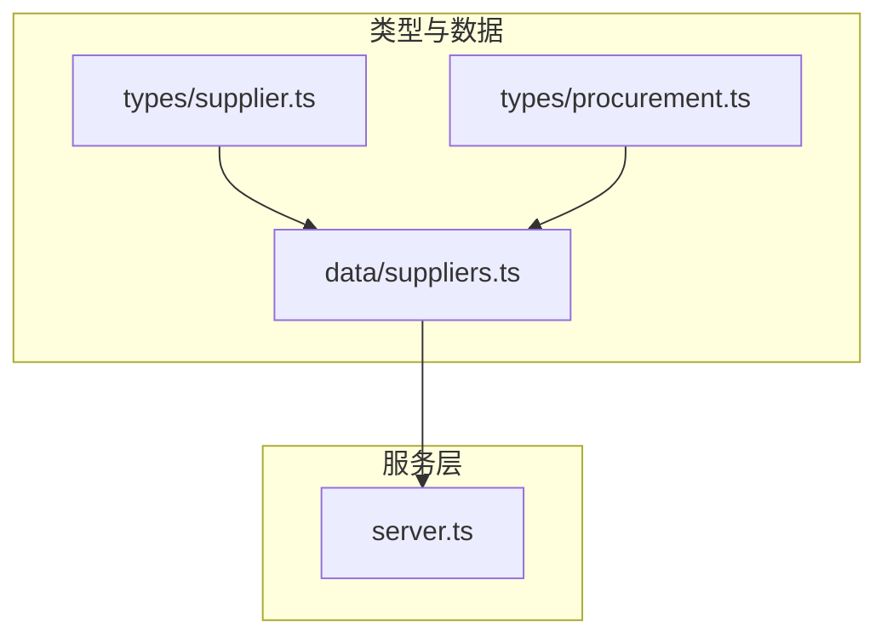

图表来源
- [src/types/supplier.ts](file://src/types/supplier.ts)
- [src/types/procurement.ts](file://src/types/procurement.ts)
- [src/data/suppliers.ts](file://src/data/suppliers.ts)
- [server.ts](file://server.ts)

章节来源
- [src/types/supplier.ts](file://src/types/supplier.ts)
- [src/types/procurement.ts](file://src/types/procurement.ts)
- [src/data/suppliers.ts](file://src/data/suppliers.ts)
- [server.ts](file://server.ts)

## 核心组件
本节概述供应商业务的核心实体与职责边界：
- 供应商（Supplier）：企业基本信息、资质、评级、信用分、状态等
- 采购订单（ProcurementOrder）：订单生命周期、金额、交付、结算、与供应商的关联
- 合同（Contract）：合同条款、生效期、变更历史、与供应商和订单的关联
- 评估记录（EvaluationRecord）：质量、交期、价格、服务等维度评分，用于绩效与信用分计算
- 交易记录（TransactionRecord）：历史交易明细，支撑报表与分析

上述实体的字段与约束在类型文件中定义，数据样例与基础操作在数据文件中实现，服务层暴露HTTP接口供前端调用。

章节来源
- [src/types/supplier.ts](file://src/types/supplier.ts)
- [src/types/procurement.ts](file://src/types/procurement.ts)
- [src/data/suppliers.ts](file://src/data/suppliers.ts)
- [server.ts](file://server.ts)

## 架构总览
整体采用“类型驱动 + 数据层 + 轻量服务”的分层设计。类型定义作为契约，数据层维护本地数据并提供读写能力，服务层负责请求路由与响应封装。

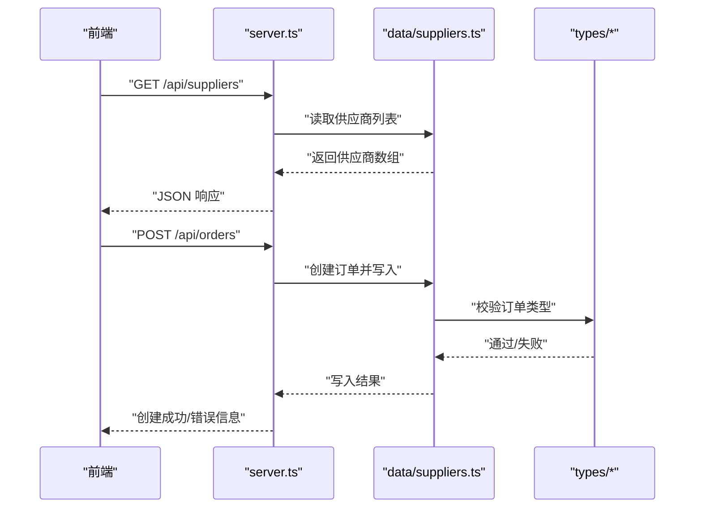

图表来源
- [server.ts](file://server.ts)
- [src/data/suppliers.ts](file://src/data/suppliers.ts)
- [src/types/supplier.ts](file://src/types/supplier.ts)
- [src/types/procurement.ts](file://src/types/procurement.ts)

## 详细组件分析

### 供应商实体与外键关系
- 供应商主键：使用稳定ID标识供应商主体
- 与采购订单的外键：订单表包含供应商ID，指向供应商主键
- 与合同的外键：合同表包含供应商ID，指向供应商主键
- 与评估记录的外键：评估记录表包含供应商ID，指向供应商主键
- 与交易记录的外键：交易记录表包含供应商ID，指向供应商主键

外键策略建议：
- 插入时强制存在性校验，确保订单、合同、评估、交易均能正确关联到有效供应商
- 更新供应商关键字段时，触发下游索引或缓存刷新
- 删除供应商前检查是否存在活跃订单或合同，必要时采用软删除或限制删除

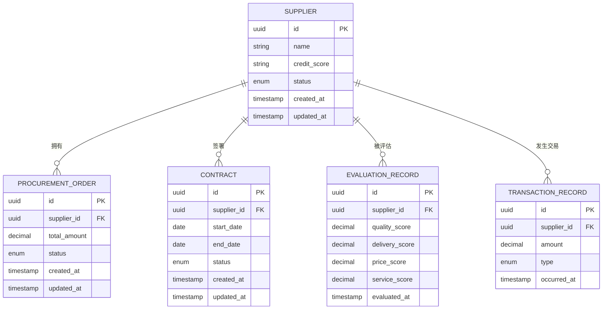

图表来源
- [src/types/supplier.ts](file://src/types/supplier.ts)
- [src/types/procurement.ts](file://src/types/procurement.ts)

章节来源
- [src/types/supplier.ts](file://src/types/supplier.ts)
- [src/types/procurement.ts](file://src/types/procurement.ts)

### 采购订单与供应商的关联流程
- 创建订单时需校验供应商存在性与状态（如禁用则拒绝）
- 订单状态机：草稿、已确认、生产中、已发货、已收货、已结算、已取消
- 订单金额汇总与发票、结算联动，保证财务一致性
- 订单变更需保留审计日志，支持追溯

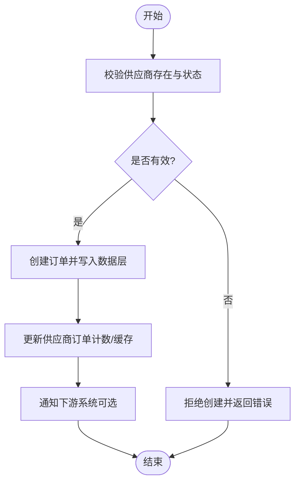

图表来源
- [src/data/suppliers.ts](file://src/data/suppliers.ts)
- [src/types/procurement.ts](file://src/types/procurement.ts)

章节来源
- [src/types/procurement.ts](file://src/types/procurement.ts)
- [src/data/suppliers.ts](file://src/data/suppliers.ts)

### 合同与供应商的关联管理
- 合同生命周期：起草、审批、生效、变更、终止、归档
- 合同与供应商一对一或多对一关系，支持版本化与变更记录
- 合同生效期间内，订单可引用合同条款进行价格与交付约定
- 合同到期自动提醒与续约流程

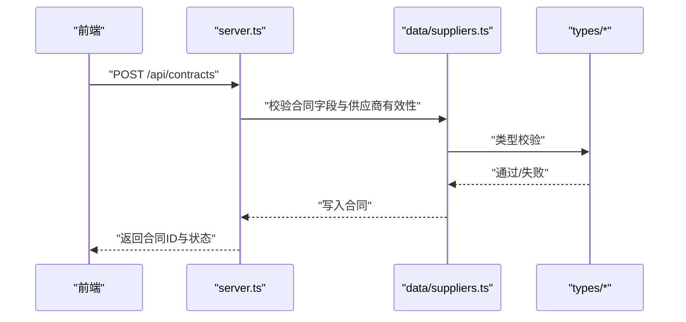

图表来源
- [server.ts](file://server.ts)
- [src/data/suppliers.ts](file://src/data/suppliers.ts)
- [src/types/supplier.ts](file://src/types/supplier.ts)

章节来源
- [server.ts](file://server.ts)
- [src/data/suppliers.ts](file://src/data/suppliers.ts)
- [src/types/supplier.ts](file://src/types/supplier.ts)

### 评估记录与供应商绩效
- 评估维度：质量、交期、价格、服务；各维度权重可配置
- 绩效周期：月度/季度/年度；支持滚动平均与趋势分析
- 绩效等级：基于加权得分划分等级（如A/B/C/D），影响供应商推荐与配额
- 评估记录与供应商一对多，支持多次评估与历史对比

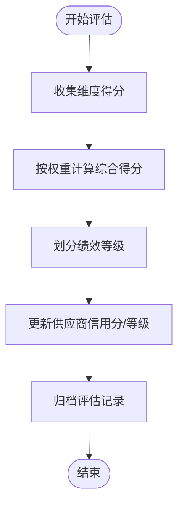

图表来源
- [src/types/supplier.ts](file://src/types/supplier.ts)
- [src/types/procurement.ts](file://src/types/procurement.ts)

章节来源
- [src/types/supplier.ts](file://src/types/supplier.ts)
- [src/types/procurement.ts](file://src/types/procurement.ts)

### 信用评分计算逻辑
- 输入：历史交易金额、履约率、评估得分、违约次数、投诉次数
- 权重：根据业务策略动态配置，默认以履约率与评估得分为主要因子
- 公式建议：信用分 = f(履约率, 评估得分, 交易规模, 风险事件)
- 更新频率：每次交易完成或评估完成后增量更新；定期全量校准

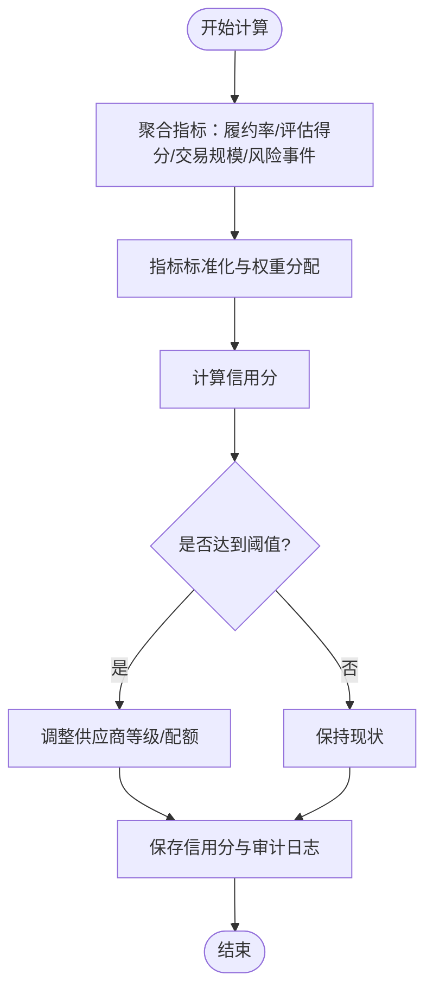

图表来源
- [src/types/supplier.ts](file://src/types/supplier.ts)
- [src/types/procurement.ts](file://src/types/procurement.ts)

章节来源
- [src/types/supplier.ts](file://src/types/supplier.ts)
- [src/types/procurement.ts](file://src/types/procurement.ts)

### 历史交易记录与数据一致性
- 交易类型：采购入库、退货、预付款、尾款结算
- 一致性保证：订单→发货→收货→结算→开票的链路事务化；异常回滚与补偿
- 审计日志：所有关键变更记录操作人、时间、前后值，支持合规审计

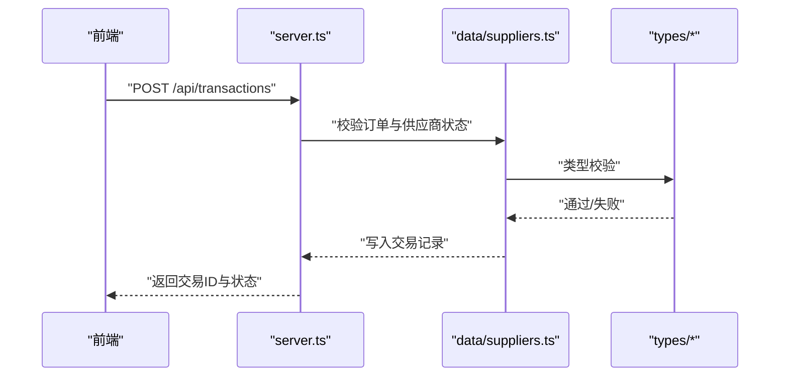

图表来源
- [server.ts](file://server.ts)
- [src/data/suppliers.ts](file://src/data/suppliers.ts)
- [src/types/procurement.ts](file://src/types/procurement.ts)

章节来源
- [server.ts](file://server.ts)
- [src/data/suppliers.ts](file://src/data/suppliers.ts)
- [src/types/procurement.ts](file://src/types/procurement.ts)

### 数据同步与事件处理方案
- 事件源：订单状态变更、合同生效/终止、评估完成、交易完成
- 事件总线：内部发布订阅机制，解耦上下游模块
- 幂等性：事件携带唯一ID，重复消费不产生副作用
- 重试与死信：失败事件进入重试队列，超过阈值转入死信队列人工处理

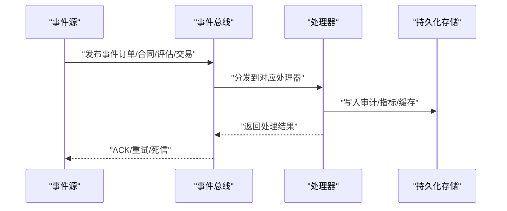

[此图为概念性流程图，无需图表来源]

### 业务报表生成与统计分析
- 报表主题：供应商绩效排名、订单履约率、合同执行进度、交易金额趋势、信用分分布
- 数据源：评估记录、交易记录、订单与合同状态
- 输出格式：表格、折线、柱状、饼图；支持导出CSV/PDF
- 计算方式：聚合函数、窗口函数、同比环比、移动平均

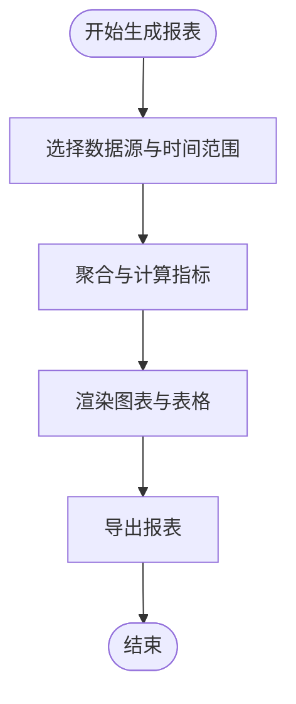

[此图为概念性流程图，无需图表来源]

### 复杂查询与数据分析示例
以下为常见查询场景与SQL思路（仅给出结构与说明，不包含具体代码内容）：
- 供应商绩效排名（近N个月）
  - 思路：按供应商分组，聚合评估得分与权重，计算综合得分并排序
  - 关键点：时间窗口过滤、权重配置、去重与异常值处理
- 订单履约率统计
  - 思路：统计按时交付订单数与总订单数，计算比率并按供应商分组
  - 关键点：状态判定、延迟原因分类、异常订单剔除
- 合同执行进度
  - 思路：基于合同起止时间与当前日期，计算执行百分比
  - 关键点：合同版本、变更生效时间、状态映射
- 交易金额趋势分析
  - 思路：按月聚合交易金额，计算同比环比与移动平均
  - 关键点：币种换算、退款冲销、节假日对齐

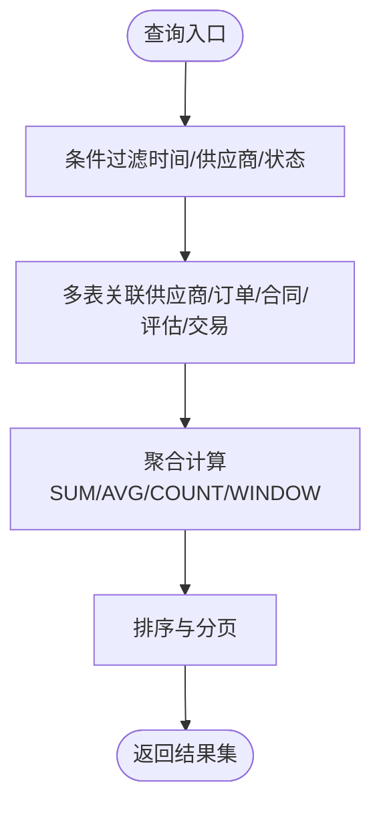

[此图为概念性流程图，无需图表来源]

## 依赖关系分析
- 类型依赖：数据与服务层均依赖类型定义，确保数据结构一致
- 数据依赖：服务层调用数据层进行读写，数据层依赖类型进行校验
- 外部依赖：如需持久化，可扩展至数据库；如需消息队列，可扩展事件总线

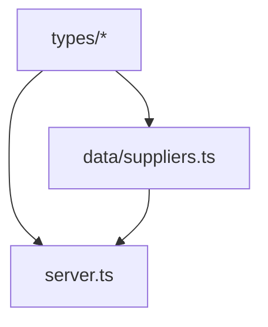

图表来源
- [src/types/supplier.ts](file://src/types/supplier.ts)
- [src/types/procurement.ts](file://src/types/procurement.ts)
- [src/data/suppliers.ts](file://src/data/suppliers.ts)
- [server.ts](file://server.ts)

章节来源
- [src/types/supplier.ts](file://src/types/supplier.ts)
- [src/types/procurement.ts](file://src/types/procurement.ts)
- [src/data/suppliers.ts](file://src/data/suppliers.ts)
- [server.ts](file://server.ts)

## 性能考虑
- 索引优化：对外键字段（supplier_id）、状态字段、时间戳建立索引，提升查询效率
- 缓存策略：热点数据（供应商基本信息、信用分、绩效等级）使用内存缓存，设置合理过期时间
- 批量操作：报表与统计采用批处理与流式计算，避免一次性加载大量数据
- 异步处理：事件处理与指标更新采用异步任务，降低主链路延迟

## 故障排查指南
- 常见问题
  - 外键约束冲突：新增订单或合同时未校验供应商存在性
  - 状态不一致：订单状态与交易记录不同步
  - 事件丢失：事件总线未持久化导致重复消费或遗漏
- 定位方法
  - 查看审计日志与事件流水，核对操作人与时间
  - 检查数据层写入与类型校验返回值
  - 监控服务层错误码与堆栈信息
- 恢复策略
  - 幂等重试与补偿任务
  - 死信队列人工介入
  - 数据快照与回滚

章节来源
- [server.ts](file://server.ts)
- [src/data/suppliers.ts](file://src/data/suppliers.ts)

## 结论
本方案以类型定义为契约，结合数据层与服务层，构建了供应商与采购订单、合同、评估记录、交易记录之间的完整关联体系。通过外键约束、事件总线与审计日志，保障了数据一致性与可追溯性。绩效评估与信用评分的计算逻辑支持动态权重与增量更新，报表与统计分析满足多维度决策需求。建议在后续迭代中引入持久化数据库与消息中间件，进一步提升可靠性与扩展性。

## 附录
- 术语表
  - 供应商：提供产品或服务的企业主体
  - 采购订单：向供应商发起的采购请求与执行凭证
  - 合同：双方约定的法律文件，规定权利与义务
  - 评估记录：对供应商多维度的评价与打分
  - 交易记录：与供应商发生的资金与货物往来明细
- 参考路径
  - 类型定义：[src/types/supplier.ts](file://src/types/supplier.ts)、[src/types/procurement.ts](file://src/types/procurement.ts)
  - 数据样例与操作：[src/data/suppliers.ts](file://src/data/suppliers.ts)
  - 服务入口：[server.ts](file://server.ts)