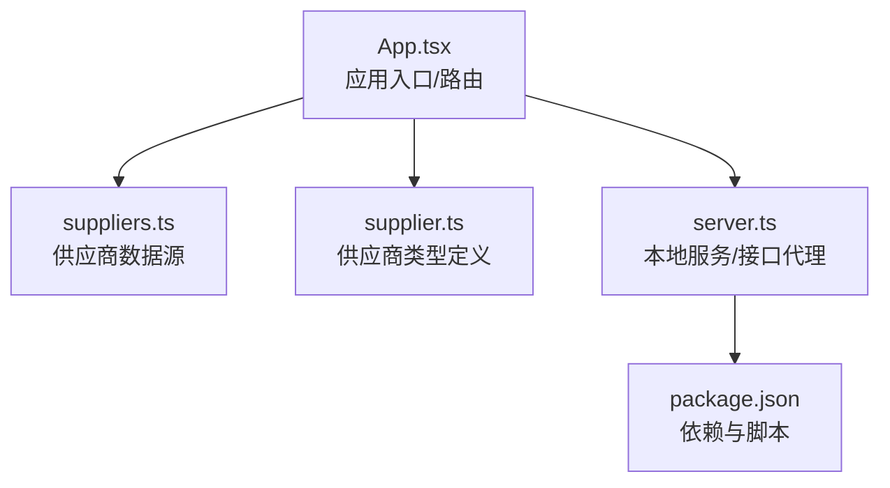
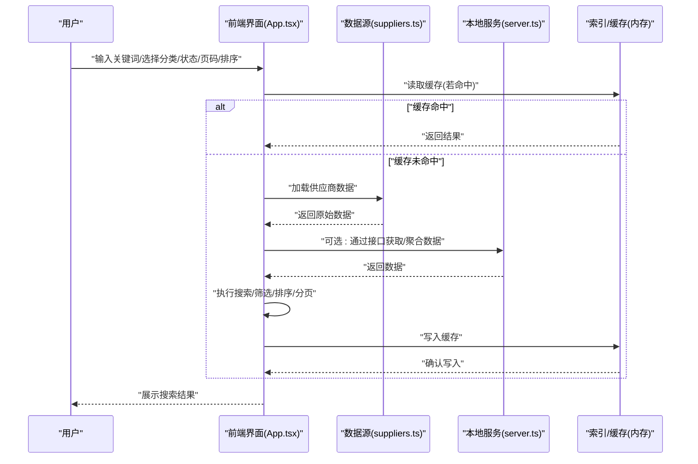
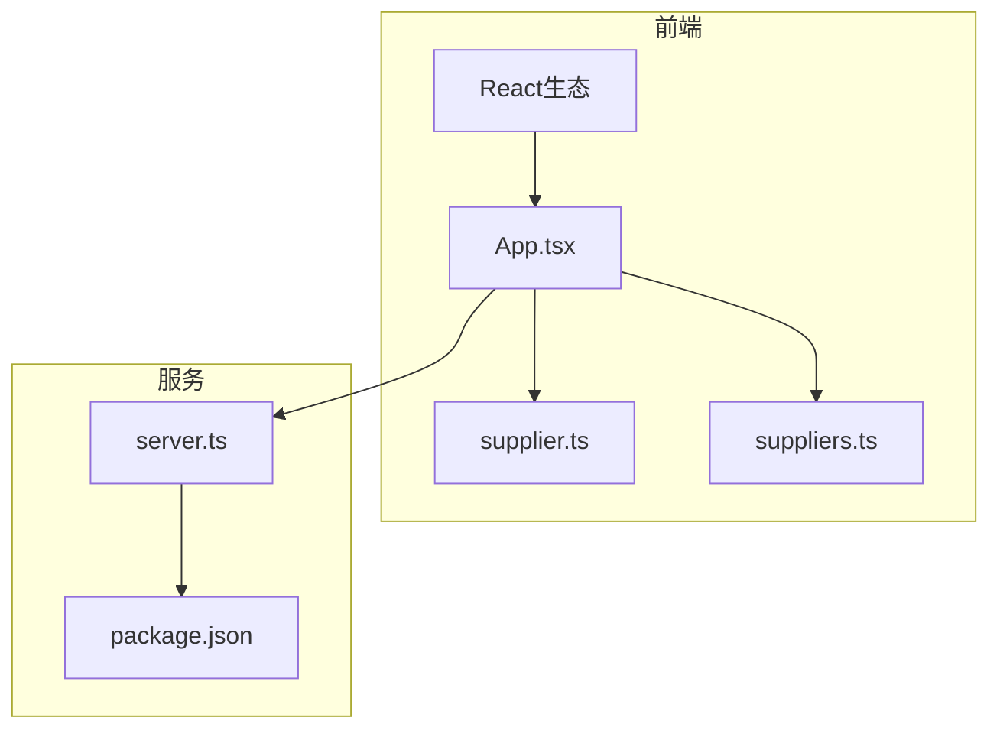

# 供应商搜索与筛选

<cite>
**本文引用的文件**   
- [src/data/suppliers.ts](file://src/data/suppliers.ts)
- [src/types/supplier.ts](file://src/types/supplier.ts)
- [src/App.tsx](file://src/App.tsx)
- [server.ts](file://server.ts)
- [package.json](file://package.json)
</cite>

## 目录
1. [简介](#简介)
2. [项目结构](#项目结构)
3. [核心组件](#核心组件)
4. [架构总览](#架构总览)
5. [详细组件分析](#详细组件分析)
6. [依赖分析](#依赖分析)
7. [性能考虑](#性能考虑)
8. [故障排查指南](#故障排查指南)
9. [结论](#结论)
10. [附录](#附录)

## 简介
本技术文档围绕“Supply OS”的供应商搜索与筛选能力，系统性阐述多条件组合搜索的实现机制、查询API设计、索引与缓存策略、性能优化方案，以及前端集成与用户体验优化建议。文档面向具备不同技术背景的读者，既提供高层概览，也深入到代码级实现细节与可操作的最佳实践。

## 项目结构
本项目采用前后端同仓组织方式：
- 前端资源位于 src 目录，包含类型定义、数据源、页面与入口文件等。
- 服务端入口位于 server.ts，用于本地开发或轻量服务化。
- 供应商相关的数据与类型分别位于 src/data/suppliers.ts 与 src/types/supplier.ts。

图表来源
- [src/App.tsx](file://src/App.tsx)
- [src/data/suppliers.ts](file://src/data/suppliers.ts)
- [src/types/supplier.ts](file://src/types/supplier.ts)
- [server.ts](file://server.ts)
- [package.json](file://package.json)

章节来源
- [src/data/suppliers.ts](file://src/data/suppliers.ts)
- [src/types/supplier.ts](file://src/types/supplier.ts)
- [src/App.tsx](file://src/App.tsx)
- [server.ts](file://server.ts)
- [package.json](file://package.json)

## 核心组件
- 数据模型与枚举
  - 供应商实体字段、状态枚举、分类标签等由类型定义集中管理，确保前后端一致性与可扩展性。
- 数据源
  - 供应商静态数据以模块形式导出，供前端渲染、搜索与筛选使用；在需要时可通过服务端接口返回。
- 应用入口
  - 负责挂载页面、路由与全局上下文，并承载搜索与筛选的UI交互逻辑。
- 本地服务
  - 提供基础HTTP服务或接口代理，便于联调与演示。

章节来源
- [src/types/supplier.ts](file://src/types/supplier.ts)
- [src/data/suppliers.ts](file://src/data/suppliers.ts)
- [src/App.tsx](file://src/App.tsx)
- [server.ts](file://server.ts)

## 架构总览
下图展示了从用户输入到结果展示的端到端流程，包括关键词搜索、分类筛选、状态过滤、分页排序与结果格式化。

图表来源
- [src/App.tsx](file://src/App.tsx)
- [src/data/suppliers.ts](file://src/data/suppliers.ts)
- [server.ts](file://server.ts)

## 详细组件分析

### 数据模型与类型定义（供应商）
- 职责
  - 定义供应商实体的字段、枚举值（如状态、分类）、校验规则与扩展点。
- 关键点
  - 使用强类型约束提升稳定性与可维护性。
  - 为后续搜索与筛选提供稳定的字段契约。

章节来源
- [src/types/supplier.ts](file://src/types/supplier.ts)

### 供应商数据源
- 职责
  - 提供供应商列表数据，支持按需导出给前端或后端使用。
- 关键点
  - 数据格式需与类型定义保持一致。
  - 可在需要时扩展为异步加载或按条件预取。

章节来源
- [src/data/suppliers.ts](file://src/data/suppliers.ts)

### 应用入口与搜索筛选编排
- 职责
  - 整合UI交互、数据源与服务层，编排搜索、筛选、分页、排序与结果格式化。
- 关键点
  - 将用户输入映射为查询参数对象。
  - 调用数据源或服务接口获取数据后，执行本地或远端计算。
  - 对结果进行分页、排序与格式化，再渲染到界面。

章节来源
- [src/App.tsx](file://src/App.tsx)

### 本地服务与接口代理
- 职责
  - 提供基础HTTP服务，便于本地联调与演示。
- 关键点
  - 可暴露统一的查询接口，统一处理分页、排序与过滤。
  - 作为未来接入真实后端时的过渡层。

章节来源
- [server.ts](file://server.ts)

### 搜索算法与索引策略
- 关键词搜索
  - 支持对名称、描述、标签等字段进行模糊匹配。
  - 建议引入分词与倒排索引以提升大规模数据检索性能。
- 分类筛选
  - 基于分类标签集合进行精确匹配，支持多选与互斥组合。
- 状态过滤
  - 基于状态枚举进行精确过滤，支持单值与多值组合。
- 范围查询
  - 针对数值型字段（如评分、规模）提供区间过滤。
- 全文检索
  - 对长文本字段启用全文检索，结合权重与相关性打分。
- 索引策略
  - 内存倒排索引：适用于中小规模数据，响应快、实现简单。
  - 外部搜索引擎：适用于大规模数据，支持高并发与复杂查询。
- 复杂度分析
  - 关键词模糊匹配：O(n·m)，n为记录数，m为平均字段长度。
  - 分类/状态过滤：O(n)。
  - 范围查询：O(n) 或 O(log n)（借助B树/跳表）。
  - 全文检索：构建索引O(N log N)，查询近似O(k log N)，k为匹配项数量。

章节来源
- [src/types/supplier.ts](file://src/types/supplier.ts)
- [src/data/suppliers.ts](file://src/data/suppliers.ts)
- [src/App.tsx](file://src/App.tsx)

### 查询API参考
以下为推荐的查询API规范，涵盖分页、排序与结果格式化选项。

- 通用查询参数
  - keyword: string | null — 关键词
  - categories: string[] — 分类筛选
  - statuses: string[] — 状态过滤
  - range: object — 范围查询（如 score, size）
  - page: number — 页码（默认1）
  - pageSize: number — 每页条数（默认20）
  - sort: object — 排序（field, order）
  - format: string — 结果格式化（full, summary）
- 请求示例路径
  - GET /api/suppliers?keyword=...&categories=...&statuses=...&page=...&pageSize=...&sort=...&format=...
- 响应结构
  - data: Supplier[] — 结果集
  - pagination: { total, page, pageSize }
  - meta: { queryId, cacheHit, latencyMs }
- 错误码
  - 400: 参数校验失败
  - 404: 无匹配结果
  - 500: 内部错误

章节来源
- [server.ts](file://server.ts)
- [src/types/supplier.ts](file://src/types/supplier.ts)

### 高级搜索功能实现细节
- 模糊匹配
  - 使用正则或分词库进行前缀/子串匹配，支持大小写不敏感与去噪。
- 范围查询
  - 对数值字段提供 min/max 边界，支持闭区间与开区间。
- 全文检索
  - 对长文本字段建立倒排索引，支持短语匹配与权重排序。
- 组合条件
  - AND/OR 逻辑组合，支持嵌套括号表达式。
- 性能优化
  - 预计算索引、布隆过滤器快速排除、并行扫描与短路求值。

章节来源
- [src/App.tsx](file://src/App.tsx)
- [src/data/suppliers.ts](file://src/data/suppliers.ts)

### 搜索结果缓存与实时搜索
- 缓存策略
  - 键生成：基于查询参数哈希。
  - TTL：根据数据更新频率设置过期时间。
  - 失效：数据变更时主动清理相关缓存。
- 实时搜索
  - 防抖与节流：减少频繁请求。
  - 增量更新：仅刷新受影响的结果片段。
  - 乐观更新：先展示预测结果，后台异步验证。

章节来源
- [src/App.tsx](file://src/App.tsx)

### 前端集成示例与用户体验优化
- 集成要点
  - 将用户输入映射为查询参数对象。
  - 使用防抖触发搜索，避免抖动导致的重复请求。
  - 显示加载态与空态，提升感知性能。
- 体验优化
  - 自动补全与联想：基于热门关键词与历史搜索。
  - 快捷筛选：常用分类与状态一键切换。
  - 结果预览：摘要视图与详情视图无缝切换。
  - 无障碍：键盘导航与屏幕阅读器友好。

章节来源
- [src/App.tsx](file://src/App.tsx)

## 依赖分析
- 前端依赖
  - React生态（路由、状态管理、UI组件库）用于构建搜索界面与交互。
- 服务依赖
  - Node.js运行时与HTTP框架用于本地服务与接口代理。
- 数据与类型
  - 供应商数据与类型定义贯穿前后端，保证一致性。

图表来源
- [src/App.tsx](file://src/App.tsx)
- [src/types/supplier.ts](file://src/types/supplier.ts)
- [src/data/suppliers.ts](file://src/data/suppliers.ts)
- [server.ts](file://server.ts)
- [package.json](file://package.json)

章节来源
- [package.json](file://package.json)
- [server.ts](file://server.ts)
- [src/App.tsx](file://src/App.tsx)

## 性能考虑
- 索引与缓存
  - 优先使用内存倒排索引与LRU缓存，降低延迟。
- 查询优化
  - 短路求值、选择性索引、批量合并查询。
- 传输优化
  - 压缩响应体、按需字段返回、分页拉取。
- 前端优化
  - 虚拟列表渲染、懒加载、骨架屏与占位图。
- 监控与度量
  - 记录P95/P99延迟、命中率与错误率，持续优化。

[本节为通用指导，无需具体文件引用]

## 故障排查指南
- 常见问题
  - 参数校验失败：检查必填字段与类型约束。
  - 缓存未命中：确认键生成逻辑与TTL设置。
  - 分页异常：核对total与pageSize计算。
  - 排序错乱：确认排序字段是否存在与方向是否正确。
- 定位步骤
  - 查看请求日志与响应体。
  - 复现最小用例，逐步缩小范围。
  - 检查索引与缓存一致性。

章节来源
- [server.ts](file://server.ts)
- [src/App.tsx](file://src/App.tsx)

## 结论
通过类型驱动的数据模型、清晰的查询API设计与合理的索引缓存策略，供应商搜索与筛选功能可实现高效、稳定且易扩展的多条件组合检索。结合前端体验优化与监控度量，可进一步提升用户满意度与系统可靠性。

[本节为总结性内容，无需具体文件引用]

## 附录
- 术语
  - 倒排索引：将词项映射到文档ID的索引结构，加速全文检索。
  - 防抖：在事件高频触发时，合并多次调用为一次。
  - 节流：限制函数在一定时间内的执行次数。
- 最佳实践
  - 保持类型与数据源同步演进。
  - 对热点查询建立缓存与预热。
  - 对复杂查询进行A/B测试与回归验证。

[本节为补充信息，无需具体文件引用]