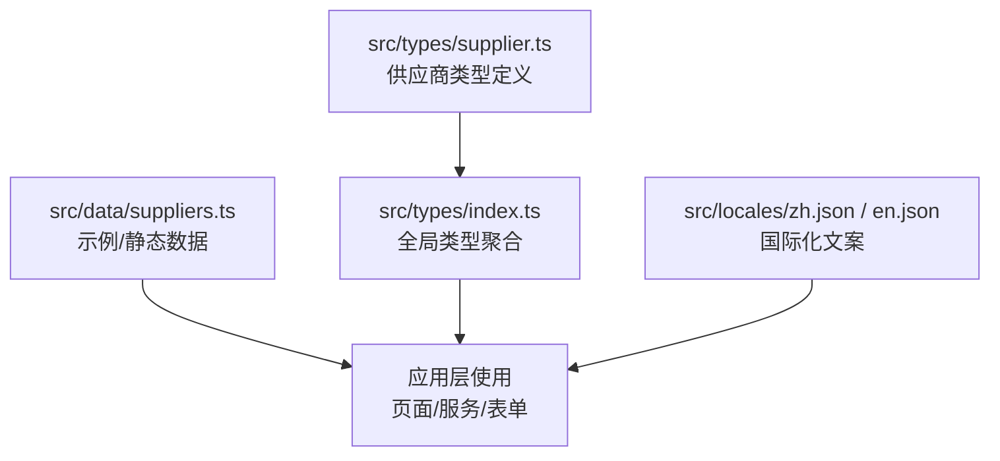
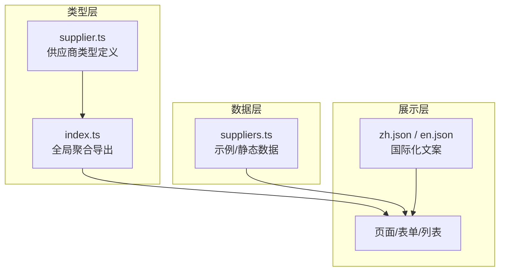
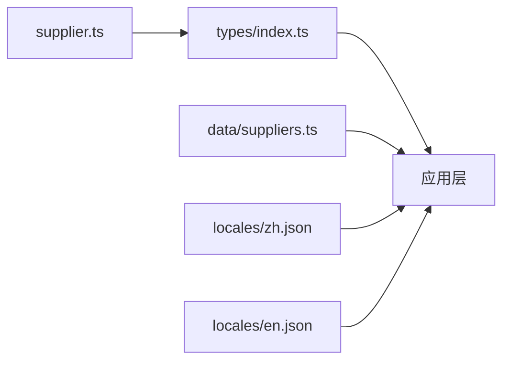

# 供应商数据模型

<cite>
**本文引用的文件**   
- [src/types/supplier.ts](file://src/types/supplier.ts)
- [src/data/suppliers.ts](file://src/data/suppliers.ts)
- [src/types/index.ts](file://src/types/index.ts)
- [src/locales/en.json](file://src/locales/en.json)
- [src/locales/zh.json](file://src/locales/zh.json)
</cite>

## 目录
1. [简介](#简介)
2. [项目结构](#项目结构)
3. [核心组件](#核心组件)
4. [架构总览](#架构总览)
5. [详细组件分析](#详细组件分析)
6. [依赖分析](#依赖分析)
7. [性能考虑](#性能考虑)
8. [故障排查指南](#故障排查指南)
9. [结论](#结论)
10. [附录](#附录)

## 简介
本技术文档围绕 Supply OS 的“供应商”领域，系统化梳理供应商数据模型的设计与实现。重点覆盖：
- 供应商核心数据结构设计（字段、类型、业务规则）
- 基本信息（名称、联系方式、地址等）、分类体系、资质信息、信用评级等关键属性
- TypeScript 接口定义与验证规则
- 状态枚举、生命周期管理与业务约束
- 数据完整性要求与关联关系设计
- 数据迁移与版本兼容性策略

## 项目结构
本项目采用按领域划分的类型与数据组织方式：
- 类型定义集中于 src/types 目录，其中供应商相关类型位于 src/types/supplier.ts
- 示例与静态数据位于 src/data/suppliers.ts
- 全局类型聚合导出在 src/types/index.ts
- 国际化文案在 src/locales 下，便于前端展示多语言字段说明

图表来源
- [src/types/supplier.ts](file://src/types/supplier.ts)
- [src/types/index.ts](file://src/types/index.ts)
- [src/data/suppliers.ts](file://src/data/suppliers.ts)
- [src/locales/zh.json](file://src/locales/zh.json)
- [src/locales/en.json](file://src/locales/en.json)

章节来源
- [src/types/supplier.ts](file://src/types/supplier.ts)
- [src/types/index.ts](file://src/types/index.ts)
- [src/data/suppliers.ts](file://src/data/suppliers.ts)
- [src/locales/zh.json](file://src/locales/zh.json)
- [src/locales/en.json](file://src/locales/en.json)

## 核心组件
本节聚焦供应商数据模型的核心组成与职责边界：
- 供应商实体：承载供应商主数据，包括基础信息、联系信息、地址、分类、资质、信用评分、状态等
- 分类体系：用于对供应商进行多维度归类（如行业、区域、能力等级等）
- 资质信息：记录认证、许可、合规材料等
- 信用评级：量化评估供应商风险与表现
- 状态与生命周期：描述供应商从引入到退出的全生命周期阶段
- 校验与约束：确保数据完整性和一致性

章节来源
- [src/types/supplier.ts](file://src/types/supplier.ts)
- [src/data/suppliers.ts](file://src/data/suppliers.ts)

## 架构总览
下图展示了供应商数据模型在系统中的位置与交互关系：类型定义被全局聚合导出，供页面与服务消费；示例数据用于演示与测试；国际化文案支撑前端展示。

图表来源
- [src/types/supplier.ts](file://src/types/supplier.ts)
- [src/types/index.ts](file://src/types/index.ts)
- [src/data/suppliers.ts](file://src/data/suppliers.ts)
- [src/locales/zh.json](file://src/locales/zh.json)
- [src/locales/en.json](file://src/locales/en.json)

## 详细组件分析

### 供应商实体与字段规范
- 标识与元数据
  - 唯一标识：建议采用稳定且不可变的ID（如UUID），避免业务键作为主键
  - 创建/更新时间戳：用于审计与变更追踪
  - 版本号：支持乐观锁与数据迁移兼容
- 基本信息
  - 名称：企业全称或品牌名，需具备唯一性约束（结合地区/税号等维度）
  - 简称/别名：便于展示与检索
  - 统一社会信用代码/税号：用于去重与合规校验
  - 成立日期、注册资本、企业类型：用于风控与筛选
- 联系信息
  - 联系人姓名、职位、电话、邮箱、传真
  - 紧急联系人：用于异常场景联络
- 地址信息
  - 国家/省/市/区县、街道、门牌号、邮编
  - 经纬度：用于地图展示与配送范围计算
- 分类体系
  - 一级/二级/三级分类：支持树形结构
  - 自定义标签：灵活扩展
  - 区域/行业/能力等级：多维标签化
- 资质信息
  - 许可证/认证编号、发证机构、有效期、附件URL
  - 合规状态：有效/过期/待审核/已撤销
- 信用评级
  - 分数区间与等级映射（如A/B/C/D）
  - 评级来源与更新日期
  - 历史评级快照：支持回溯与趋势分析
- 状态与生命周期
  - 候选/审核中/合格/暂停/淘汰/注销
  - 状态转换规则与审批流
- 其他
  - 备注、来源渠道、对接人、结算账户信息等

章节来源
- [src/types/supplier.ts](file://src/types/supplier.ts)
- [src/data/suppliers.ts](file://src/data/suppliers.ts)

### 分类体系设计
- 分类层级
  - 根节点为行业大类，向下细分至具体品类
  - 每个分类包含编码、名称、父级ID、排序权重
- 分类规则
  - 一个供应商可属于多个分类（多对多）
  - 分类变更需保留历史版本，便于审计
- 标签与维度
  - 动态标签用于补充结构化分类之外的特征
  - 区域/能力等级等维度可作为独立枚举或字典表

章节来源
- [src/types/supplier.ts](file://src/types/supplier.ts)

### 资质信息与合规校验
- 资质条目
  - 资质类型、证书编号、颁发机构、生效/失效日期、附件
  - 自动提醒机制：到期前N天预警
- 合规校验
  - 必填项校验：关键资质不得为空
  - 时间逻辑：生效日期早于失效日期
  - 附件格式与大小限制

章节来源
- [src/types/supplier.ts](file://src/types/supplier.ts)

### 信用评级与风险管控
- 评分维度
  - 交付质量、价格竞争力、合规记录、财务健康度
- 等级映射
  - 分数段映射到等级（如A/B/C/D）
- 更新策略
  - 定期批量更新与事件触发更新并存
  - 保留历史快照，支持对比与审计

章节来源
- [src/types/supplier.ts](file://src/types/supplier.ts)

### 状态枚举与生命周期管理
- 状态集合
  - 候选、审核中、合格、暂停、淘汰、注销
- 转换规则
  - 候选 → 审核中：提交资料后进入审核
  - 审核中 → 合格：审核通过
  - 审核中 → 候选：审核不通过退回
  - 合格 → 暂停：违规或风险触发
  - 暂停 → 合格：整改完成恢复
  - 合格/暂停 → 淘汰：严重违规或长期无业务
  - 任何状态 → 注销：主体消亡或主动退出
- 状态机约束
  - 禁止非法跳转（如直接由候选到淘汰）
  - 状态变更需记录操作人与原因

章节来源
- [src/types/supplier.ts](file://src/types/supplier.ts)

### 数据完整性与关联关系
- 完整性约束
  - 必填字段：名称、统一社会信用代码、至少一种联系方式、主要地址
  - 唯一性：名称+地区组合唯一，税号全局唯一
  - 外键引用：分类、资质、评级等需存在且有效
- 关联关系
  - 供应商 ↔ 分类：多对多
  - 供应商 ↔ 资质：一对多
  - 供应商 ↔ 评级：一对一（含历史快照一对多）
  - 供应商 ↔ 联系人：一对多
- 审计字段
  - 创建者、修改者、创建时间、修改时间、版本号

章节来源
- [src/types/supplier.ts](file://src/types/supplier.ts)

### 验证规则与错误处理
- 客户端校验
  - 表单输入即时反馈（格式、长度、必填）
  - 异步校验（唯一性、资质有效性）
- 服务端校验
  - 严格的数据契约与业务规则
  - 返回标准化错误码与消息
- 错误处理
  - 统一错误包装，区分用户错误与系统错误
  - 日志记录关键失败路径

章节来源
- [src/types/supplier.ts](file://src/types/supplier.ts)

### 国际化与展示
- 文案来源
  - zh.json 与 en.json 提供字段提示、错误消息、枚举值显示
- 展示策略
  - 根据当前语言环境渲染对应文案
  - 枚举值与分类名称通过字典映射

章节来源
- [src/locales/zh.json](file://src/locales/zh.json)
- [src/locales/en.json](file://src/locales/en.json)

## 依赖分析
供应商类型定义被全局聚合导出，供上层模块消费；示例数据用于演示与测试；国际化文案影响前端展示。

图表来源
- [src/types/supplier.ts](file://src/types/supplier.ts)
- [src/types/index.ts](file://src/types/index.ts)
- [src/data/suppliers.ts](file://src/data/suppliers.ts)
- [src/locales/zh.json](file://src/locales/zh.json)
- [src/locales/en.json](file://src/locales/en.json)

章节来源
- [src/types/supplier.ts](file://src/types/supplier.ts)
- [src/types/index.ts](file://src/types/index.ts)
- [src/data/suppliers.ts](file://src/data/suppliers.ts)
- [src/locales/zh.json](file://src/locales/zh.json)
- [src/locales/en.json](file://src/locales/en.json)

## 性能考虑
- 索引设计
  - 对高频查询字段建立索引（如税号、分类、状态）
- 缓存策略
  - 分类与字典数据缓存，减少重复查询
- 分页与懒加载
  - 列表与详情按需加载，降低首屏压力
- 批量更新
  - 评级与资质批量任务分片执行，避免长事务

## 故障排查指南
- 常见问题
  - 唯一性冲突：检查税号或名称+地区组合是否重复
  - 资质过期：检查有效期与提醒机制
  - 状态非法跳转：核对状态机规则与权限
- 定位方法
  - 查看审计日志与变更记录
  - 校验客户端与服务端错误码
  - 复现步骤并最小化数据集

## 结论
供应商数据模型以清晰的结构化字段、严格的校验与状态机约束为基础，配合分类、资质与信用评级体系，形成完整的供应商治理框架。通过国际化支持与完善的错误处理，提升用户体验与系统稳定性。建议在后续迭代中持续完善审计与监控能力，保障数据一致性与可追溯性。

## 附录

### 数据迁移与版本兼容性
- 向后兼容
  - 新增字段默认空值，旧数据不受影响
  - 废弃字段标记弃用期，逐步清理
- 迁移策略
  - 增量脚本：按版本顺序执行
  - 回滚方案：保留快照与逆向脚本
- 并发与锁
  - 使用乐观锁版本号控制并发写入
  - 大表迁移分批执行，避免长时间锁表