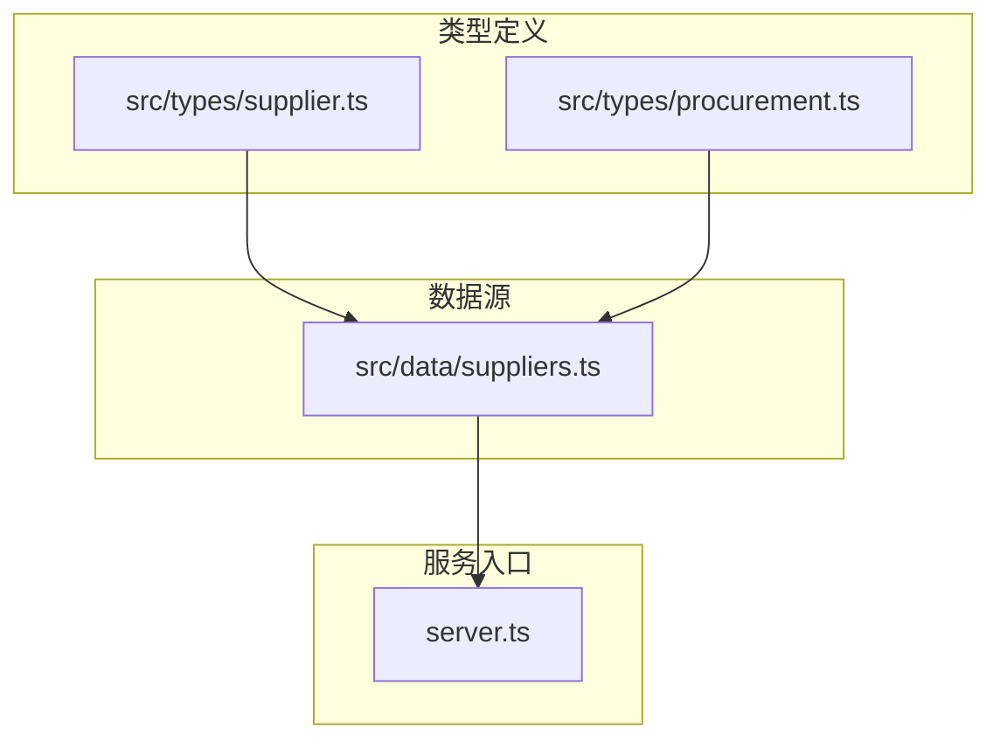
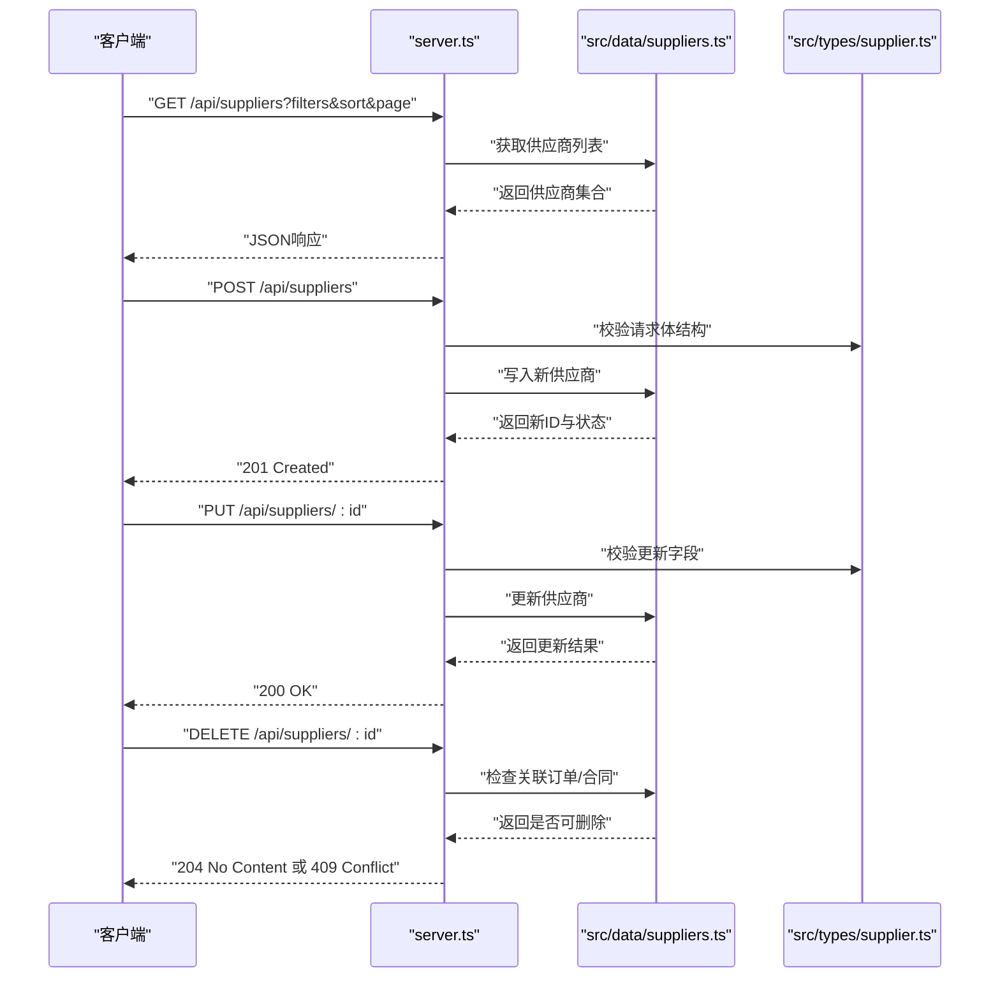
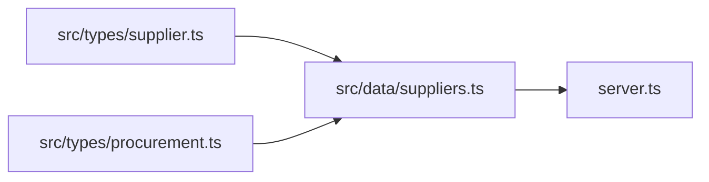
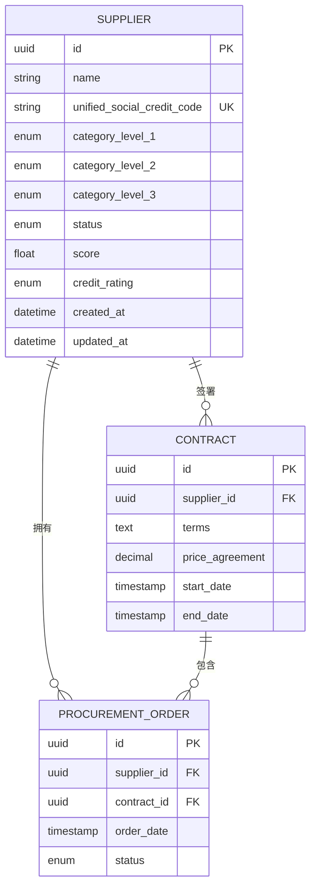

# 供应商数据管理

<cite>
**本文引用的文件**   
- [src/types/supplier.ts](file://src/types/supplier.ts)
- [src/data/suppliers.ts](file://src/data/suppliers.ts)
- [src/types/procurement.ts](file://src/types/procurement.ts)
- [server.ts](file://server.ts)
- [package.json](file://package.json)
</cite>

## 目录
1. [简介](#简介)
2. [项目结构](#项目结构)
3. [核心组件](#核心组件)
4. [架构总览](#架构总览)
5. [详细组件分析](#详细组件分析)
6. [依赖关系分析](#依赖关系分析)
7. [性能考虑](#性能考虑)
8. [故障排查指南](#故障排查指南)
9. [结论](#结论)
10. [附录](#附录)

## 简介
本技术文档面向Supply OS的“供应商数据管理”模块，聚焦以下目标：
- 供应商数据模型设计、字段定义与业务规则
- 供应商分类、评估体系、资质管理与信用评级
- 供应商CRUD操作的API参考与使用示例
- 供应商状态管理、生命周期控制与审批流程
- 供应商搜索、筛选与排序的实现细节
- 供应商与采购订单、合同等实体的关联关系
- 数据分析、报表生成与导出功能的使用指南

## 项目结构
围绕供应商数据管理的代码主要分布在类型定义、前端数据源与服务端入口中。整体采用“类型驱动 + 前端数据源 + 轻量服务端”的结构：
- 类型层：集中定义供应商、采购等相关数据结构
- 数据层：提供静态样例数据与基础查询能力
- 服务层：通过HTTP接口暴露数据访问能力（如需要）

图表来源
- [src/types/supplier.ts](file://src/types/supplier.ts)
- [src/types/procurement.ts](file://src/types/procurement.ts)
- [src/data/suppliers.ts](file://src/data/suppliers.ts)
- [server.ts](file://server.ts)

章节来源
- [src/types/supplier.ts](file://src/types/supplier.ts)
- [src/types/procurement.ts](file://src/types/procurement.ts)
- [src/data/suppliers.ts](file://src/data/suppliers.ts)
- [server.ts](file://server.ts)

## 核心组件
本节从数据模型、分类与评估、资质与信用、状态与生命周期、搜索与排序、关联关系等方面展开说明。

### 供应商数据模型与字段定义
- 供应商主数据
  - 标识与基本信息：唯一ID、名称、简称、统一社会信用代码、行业类别、注册地、经营地址、联系人、联系方式等
  - 商务信息：开户行、账号、发票类型、税率、结算周期、币种等
  - 质量与安全：质量体系认证、环境与安全认证、合规声明、审计记录
  - 财务指标：注册资本、年营业额、资产负债率、信用评级、评级有效期
  - 运营指标：交付准时率、一次合格率、退货率、客诉率、产能利用率
  - 风险与黑名单：风险等级、是否列入黑名单、禁入原因、生效时间
  - 元数据：创建人、更新时间、数据来源、版本、备注
- 关键字段约束
  - 必填项：名称、统一社会信用代码、联系人、联系方式
  - 唯一性：统一社会信用代码全局唯一
  - 数值范围：财务比率需在合理区间；评分需限定范围
  - 日期校验：认证到期日、评级有效期不得早于当前日期
  - 枚举值：行业类别、认证类型、风险等级、信用等级等需受控

章节来源
- [src/types/supplier.ts](file://src/types/supplier.ts)

### 供应商分类体系
- 一级分类：按行业或产品大类划分（如原材料、零部件、设备、服务等）
- 二级分类：在一级基础上细化（如金属、塑料、电子元器件、软件服务等）
- 三级分类：进一步细分到具体品类或规格族
- 分类属性：每个分类可绑定关键KPI阈值、准入条件、审核要点
- 动态扩展：支持新增分类与映射表，便于业务演进

章节来源
- [src/types/supplier.ts](file://src/types/supplier.ts)

### 评估体系与评分模型
- 评估维度
  - 质量：来料合格率、过程质量、客户投诉处理时效
  - 成本：价格竞争力、降本贡献、付款条件
  - 交付：准时交付率、柔性响应、交期达成
  - 服务：技术支持、售后响应、培训与知识共享
  - 创新：联合研发、专利与知识产权、持续改进
  - 合规与ESG：合规审计、环保与安全、社会责任
- 评分方法
  - 权重分配：按战略重要性设定维度权重
  - 指标量化：将业务指标标准化为0-100分
  - 综合得分：加权求和并四舍五入保留一位小数
  - 等级映射：根据分数区间映射A/B/C/D等级
- 评估周期与触发
  - 定期评估：季度/年度
  - 事件触发：重大质量事故、交付异常、合规问题
- 结果应用
  - 准入与淘汰：低于阈值的供应商限制新业务
  - 配额分配：高评级供应商获得更高份额
  - 改进计划：针对短板制定整改与复评

章节来源
- [src/types/supplier.ts](file://src/types/supplier.ts)

### 资质管理与认证
- 资质类型
  - 质量体系：ISO9001、IATF16949等
  - 环境与安全：ISO14001、ISO45001等
  - 行业特定：医疗器械、食品、军工等
  - 企业信用：AAA、AA、A等
- 资质要素
  - 证书编号、发证机构、颁发日期、到期日期、附件链接
  - 有效性校验：到期前预警、自动失效标记
- 审核流程
  - 上传与初审：资料完整性检查
  - 复审与批准：合规性与真实性核验
  - 归档与发布：纳入供应商档案并对外可见

章节来源
- [src/types/supplier.ts](file://src/types/supplier.ts)

### 信用评级与风险控制
- 信用评分来源
  - 内部评分：基于履约表现与财务指标
  - 外部数据：第三方征信、司法诉讼、行政处罚
- 信用等级
  - A：优秀，优先合作
  - B：良好，常规合作
  - C：一般，限制合作
  - D：较差，暂停或终止合作
- 风险预警
  - 指标阈值触发：逾期付款、重大质量事件、负面舆情
  - 处置动作：冻结额度、暂停下单、启动调查

章节来源
- [src/types/supplier.ts](file://src/types/supplier.ts)

### 状态管理与生命周期
- 状态机
  - 草稿：新建未提交
  - 待审核：提交后进入审批流
  - 已批准：审核通过，可参与业务
  - 观察期：新引入或整改中的供应商
  - 暂停：临时停止合作
  - 终止：永久退出
- 状态转换规则
  - 草稿→待审核：提交审核
  - 待审核→已批准/退回修改：审批结果
  - 已批准→观察期：触发观察策略
  - 观察期→已批准/暂停：复评结果
  - 任何状态→暂停：风险事件或合规问题
  - 暂停/观察期→终止：严重违规或长期不达标
- 审计追踪
  - 每次状态变更记录操作人、时间、原因与附件

章节来源
- [src/types/supplier.ts](file://src/types/supplier.ts)

### 审批流程与权限控制
- 角色
  - 供应商管理员：维护主数据与资质
  - 审核员：执行初审与复审
  - 风控官：风险评估与处置
  - 业务负责人：最终批准与配额决策
- 流程节点
  - 资料提交→初审→复审→批准/退回
  - 风险评审：必要时插入风控节点
- 权限矩阵
  - 按角色与组织隔离数据访问
  - 敏感字段脱敏与水印

章节来源
- [src/types/supplier.ts](file://src/types/supplier.ts)

### 搜索、筛选与排序
- 搜索
  - 全文检索：名称、简称、统一信用代码、联系人
  - 模糊匹配：支持多词组合与通配
- 筛选
  - 分类：一级/二级/三级分类
  - 状态：草稿、待审核、已批准、观察期、暂停、终止
  - 评级：A/B/C/D
  - 资质：按认证类型与有效期过滤
  - 风险：风险等级、是否黑名单
  - 时间：创建时间、更新时间、认证到期时间
- 排序
  - 默认：更新时间倒序
  - 可选：名称升/降序、评分降序、风险等级升序、创建时间倒序
- 分页与性能
  - 游标分页或偏移分页
  - 索引建议：名称、统一信用代码、分类、状态、评级

章节来源
- [src/types/supplier.ts](file://src/types/supplier.ts)
- [src/data/suppliers.ts](file://src/data/suppliers.ts)

### 与采购订单、合同的关联关系
- 实体关系
  - 供应商 1:N 采购订单
  - 供应商 1:N 合同
  - 合同 1:N 采购订单（通过合同条款约束）
- 关联字段
  - 供应商ID作为外键出现在订单与合同中
  - 合同包含供应商选择策略、价格协议、SLA
  - 订单引用合同与供应商，承载交付与结算信息
- 数据一致性
  - 删除供应商前检查是否存在活跃订单或合同
  - 状态联动：供应商暂停时阻止新订单创建

章节来源
- [src/types/procurement.ts](file://src/types/procurement.ts)
- [src/types/supplier.ts](file://src/types/supplier.ts)

### 数据分析、报表与导出
- 分析维度
  - 供应商分布：按分类、地区、规模
  - 绩效趋势：质量、交付、成本、服务评分变化
  - 风险热力图：风险等级与事件数量
  - 资质健康度：即将到期与过期比例
- 报表类型
  - 月度/季度/年度供应商绩效报告
  - 资质与合规审计报告
  - 风险预警与处置跟踪报告
- 导出格式
  - CSV/Excel：明细与汇总
  - PDF：正式报告与签章版
- 权限与审计
  - 报表访问控制与下载审计日志

章节来源
- [src/types/supplier.ts](file://src/types/supplier.ts)

## 架构总览
系统以类型定义为核心契约，前端数据源提供样例数据与查询能力，服务端负责HTTP接口暴露。

图表来源
- [server.ts](file://server.ts)
- [src/data/suppliers.ts](file://src/data/suppliers.ts)
- [src/types/supplier.ts](file://src/types/supplier.ts)

## 详细组件分析

### 供应商类型定义
- 职责
  - 定义供应商主数据、分类、评估、资质、信用、状态等所有字段的类型与约束
  - 为前后端交互提供一致的契约
- 关键点
  - 枚举与取值范围确保数据一致性
  - 必填与唯一性约束保障主数据质量
  - 复合对象用于资质、评估、风险等复杂结构

章节来源
- [src/types/supplier.ts](file://src/types/supplier.ts)

### 供应商数据源
- 职责
  - 提供供应商样例数据与基础查询（列表、详情、筛选、排序）
  - 作为服务端接口的数据后端
- 关键点
  - 内存存储适合演示与开发阶段
  - 可扩展为持久化存储（数据库）
  - 查询逻辑应支持高效过滤与分页

章节来源
- [src/data/suppliers.ts](file://src/data/suppliers.ts)

### 采购相关类型
- 职责
  - 定义采购订单、合同等与供应商关联的实体结构
  - 明确外键与业务约束
- 关键点
  - 订单与合同均引用供应商ID
  - 合同包含价格协议与SLA，影响订单执行
  - 删除与状态变更需考虑关联完整性

章节来源
- [src/types/procurement.ts](file://src/types/procurement.ts)

### 服务端接口
- 职责
  - 暴露RESTful API供前端调用
  - 实现请求校验、事务控制与错误处理
- 关键点
  - 统一响应格式与错误码
  - 鉴权与授权中间件
  - 审计日志记录关键操作

章节来源
- [server.ts](file://server.ts)

## 依赖关系分析
- 模块耦合
  - server.ts 依赖 src/data/suppliers.ts 进行数据访问
  - src/data/suppliers.ts 依赖 src/types/supplier.ts 与 src/types/procurement.ts 进行类型校验与关联检查
- 外部依赖
  - 运行环境与包管理器由 package.json 管理
- 潜在循环依赖
  - 当前结构无循环依赖，类型定义被多处引用但无反向导入

图表来源
- [src/types/supplier.ts](file://src/types/supplier.ts)
- [src/types/procurement.ts](file://src/types/procurement.ts)
- [src/data/suppliers.ts](file://src/data/suppliers.ts)
- [server.ts](file://server.ts)

章节来源
- [package.json](file://package.json)
- [src/types/supplier.ts](file://src/types/supplier.ts)
- [src/types/procurement.ts](file://src/types/procurement.ts)
- [src/data/suppliers.ts](file://src/data/suppliers.ts)
- [server.ts](file://server.ts)

## 性能考虑
- 查询优化
  - 对高频筛选字段建立索引（名称、统一信用代码、分类、状态、评级）
  - 使用游标分页替代偏移分页，提升大数据量下的稳定性
- 缓存策略
  - 热点数据（分类字典、认证类型）使用本地缓存
  - 报表预计算与定时刷新
- 并发与锁
  - 并发更新供应商时采用乐观锁避免覆盖
- 资源限制
  - 限制单次查询最大返回条数与深度筛选层级

[本节为通用指导，无需源码引用]

## 故障排查指南
- 常见问题
  - 重复统一信用代码：检查唯一性约束与导入数据清洗
  - 资质过期导致不可用：检查到期日期与有效性标记
  - 删除失败：确认是否存在活跃订单或合同
  - 搜索无结果：检查筛选条件与索引字段
- 定位步骤
  - 查看服务端日志与错误码
  - 核对请求体结构与类型约束
  - 验证数据源返回与分页参数
- 恢复措施
  - 修正数据后重试
  - 清理无效缓存
  - 回滚事务并通知用户

章节来源
- [server.ts](file://server.ts)
- [src/data/suppliers.ts](file://src/data/suppliers.ts)
- [src/types/supplier.ts](file://src/types/supplier.ts)

## 结论
本模块以类型驱动为核心，构建了完整的供应商数据模型与业务流程。通过分类、评估、资质与信用体系，结合状态机与审批流程，实现了供应商全生命周期管理。配合搜索、筛选、排序与报表导出，满足日常运营与分析需求。后续可引入持久化存储、更完善的鉴权与审计机制，进一步提升系统的可靠性与可观测性。

[本节为总结，无需源码引用]

## 附录

### API参考与使用示例
- 获取供应商列表
  - 方法：GET
  - 路径：/api/suppliers
  - 查询参数：分类、状态、评级、资质、风险、时间范围、排序、分页
  - 响应：供应商集合与分页信息
- 创建供应商
  - 方法：POST
  - 路径：/api/suppliers
  - 请求体：遵循供应商类型定义
  - 响应：新供应商ID与初始状态
- 更新供应商
  - 方法：PUT
  - 路径：/api/suppliers/:id
  - 请求体：允许更新的字段
  - 响应：更新结果
- 删除供应商
  - 方法：DELETE
  - 路径：/api/suppliers/:id
  - 前置检查：无活跃订单/合同
  - 响应：成功或冲突提示
- 状态流转
  - 方法：PATCH
  - 路径：/api/suppliers/:id/status
  - 请求体：目标状态与原因
  - 响应：状态变更结果

章节来源
- [server.ts](file://server.ts)
- [src/types/supplier.ts](file://src/types/supplier.ts)

### 数据模型关系图

图表来源
- [src/types/supplier.ts](file://src/types/supplier.ts)
- [src/types/procurement.ts](file://src/types/procurement.ts)