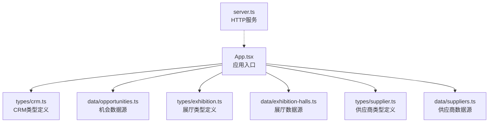
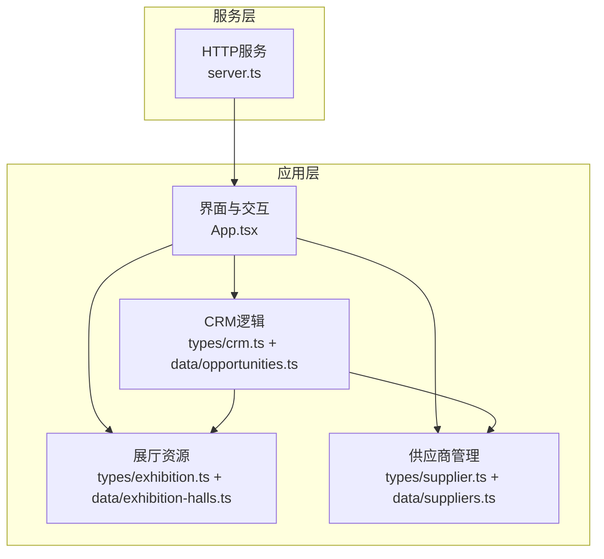
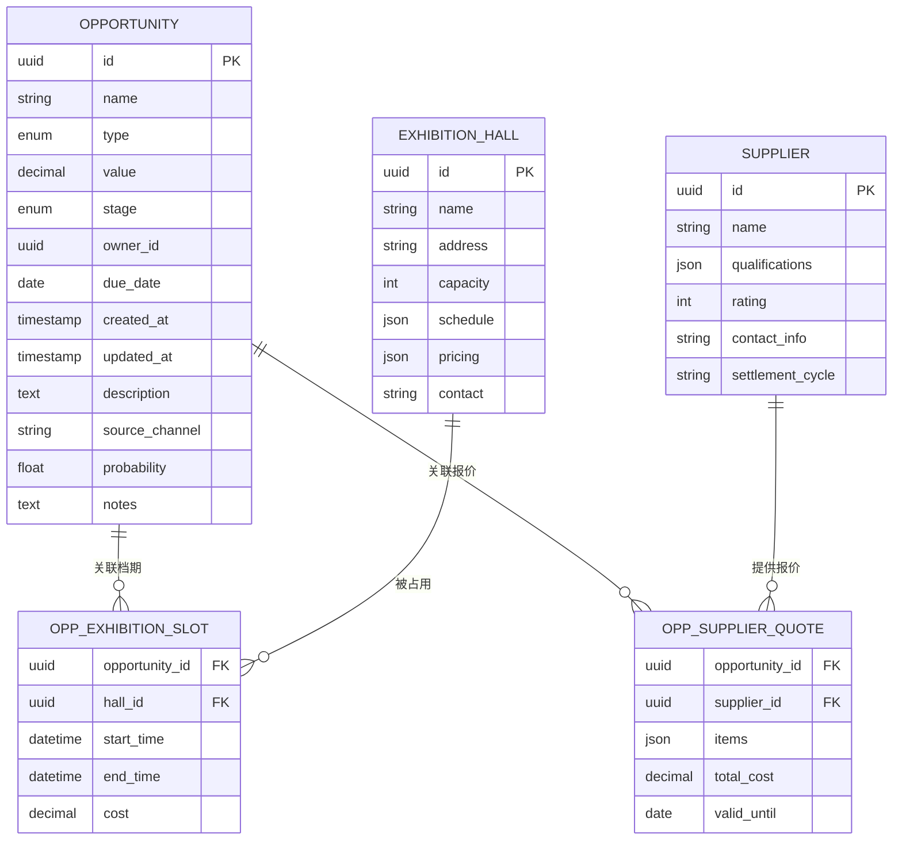
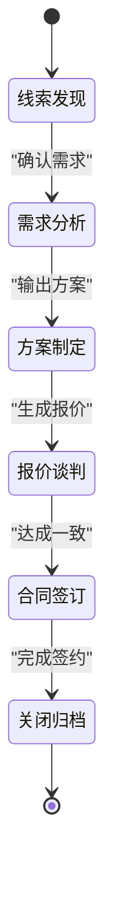
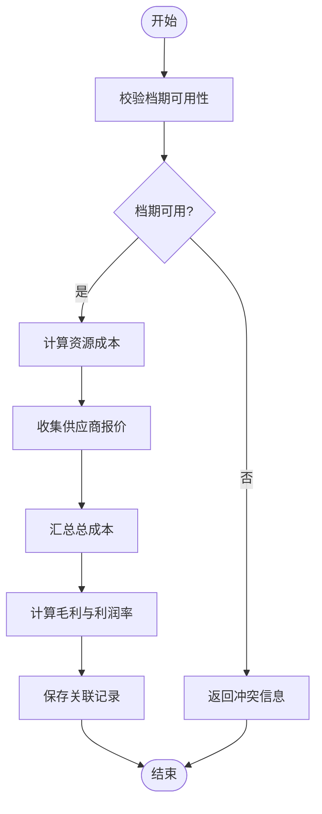
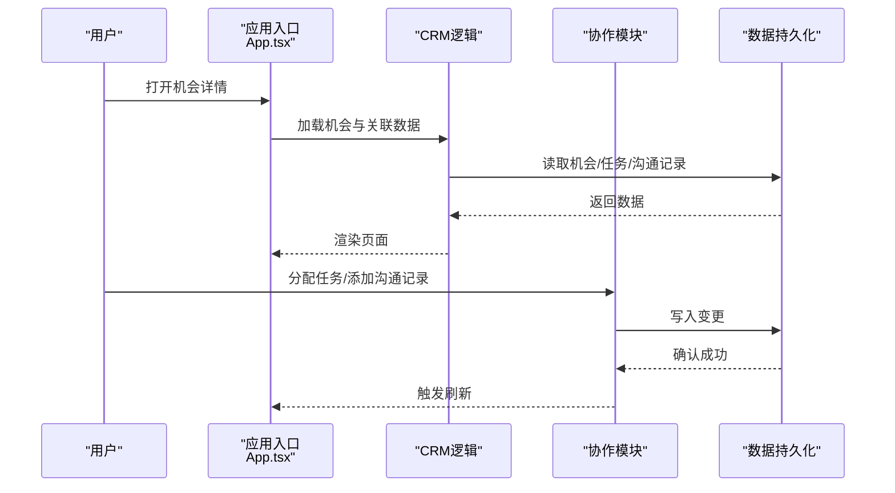
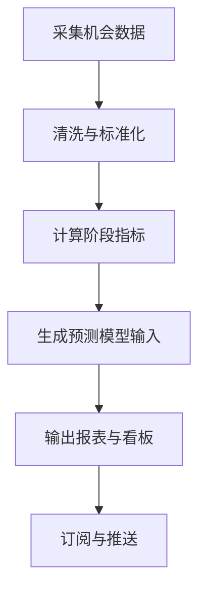
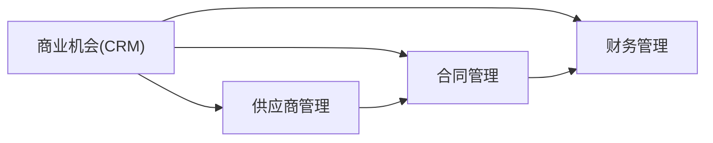
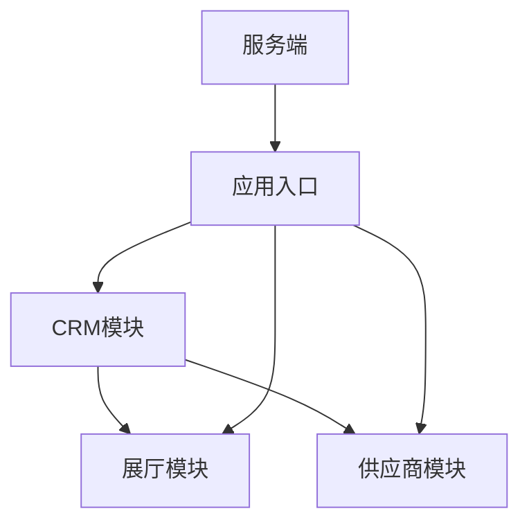

# 商业机会管理

<cite>
**本文引用的文件**   
- [src/data/opportunities.ts](file://src/data/opportunities.ts)
- [src/types/crm.ts](file://src/types/crm.ts)
- [src/data/exhibition-halls.ts](file://src/data/exhibition-halls.ts)
- [src/types/exhibition.ts](file://src/types/exhibition.ts)
- [src/data/suppliers.ts](file://src/data/suppliers.ts)
- [src/types/supplier.ts](file://src/types/supplier.ts)
- [src/App.tsx](file://src/App.tsx)
- [server.ts](file://server.ts)
</cite>

## 目录
1. [简介](#简介)
2. [项目结构](#项目结构)
3. [核心组件](#核心组件)
4. [架构总览](#架构总览)
5. [详细组件分析](#详细组件分析)
6. [依赖关系分析](#依赖关系分析)
7. [性能考虑](#性能考虑)
8. [故障排查指南](#故障排查指南)
9. [结论](#结论)
10. [附录](#附录)

## 简介
本技术文档围绕Supply OS中的“商业机会管理”能力，系统阐述数据模型设计、生命周期与阶段转换、展厅资源关联、团队协作、数据分析与报告，以及与其他业务模块（供应商、合同、财务）的集成方式。文档面向产品、研发与实施人员，力求以循序渐进的方式帮助读者快速理解并落地使用。

## 项目结构
本项目采用前端为主的数据驱动架构，核心领域数据通过TypeScript类型定义与静态数据源组织，并在应用入口中组合渲染。与商业机会相关的代码主要分布在以下位置：
- 类型定义：CRM与展厅、供应商等域的类型声明
- 数据源：机会、展厅、供应商等静态数据
- 应用入口：页面路由与模块装配
- 服务端：提供基础HTTP服务（用于前后端联调或扩展）

图表来源
- [src/App.tsx](file://src/App.tsx)
- [src/types/crm.ts](file://src/types/crm.ts)
- [src/data/opportunities.ts](file://src/data/opportunities.ts)
- [src/types/exhibition.ts](file://src/types/exhibition.ts)
- [src/data/exhibition-halls.ts](file://src/data/exhibition-halls.ts)
- [src/types/supplier.ts](file://src/types/supplier.ts)
- [src/data/suppliers.ts](file://src/data/suppliers.ts)
- [server.ts](file://server.ts)

章节来源
- [src/App.tsx](file://src/App.tsx)
- [server.ts](file://server.ts)

## 核心组件
本节聚焦商业机会的核心数据模型与关键实体关系，为后续生命周期、状态机、资源关联与分析报表奠定基础。

- 商业机会实体
  - 字段要点：机会ID、名称、类型、价值、阶段、负责人、截止日期、创建/更新时间、描述、来源渠道、预计成交概率、备注等
  - 业务规则要点：
    - 机会ID全局唯一，建议采用稳定标识（如自增或UUID）
    - 价值为正数，单位明确（如人民币元）
    - 阶段遵循预定义的状态机流转，不允许逆向跳跃
    - 负责人可为空但进入“方案制定”前必须指定
    - 截止日期不得早于当前日期（新建时）
    - 关闭归档需填写关闭原因与最终金额
- 展厅资源实体
  - 字段要点：展厅ID、名称、地址、容量、可用档期、价格策略、联系人等
  - 业务规则要点：
    - 档期不可重复预订；冲突检测基于时间区间重叠
    - 成本计算包含场地费、搭建费、设备费等明细项
    - 收益分析基于机会价值与资源成本差值
- 供应商实体
  - 字段要点：供应商ID、名称、资质、评级、联系方式、结算周期等
  - 业务规则要点：
    - 报价单需绑定供应商与物料/服务清单
    - 结算与合同、发票关联

章节来源
- [src/types/crm.ts](file://src/types/crm.ts)
- [src/data/opportunities.ts](file://src/data/opportunities.ts)
- [src/types/exhibition.ts](file://src/types/exhibition.ts)
- [src/data/exhibition-halls.ts](file://src/data/exhibition-halls.ts)
- [src/types/supplier.ts](file://src/types/supplier.ts)
- [src/data/suppliers.ts](file://src/data/suppliers.ts)

## 架构总览
下图展示商业机会管理与展厅、供应商等模块的交互关系，以及应用入口与服务端的角色分工。

图表来源
- [src/App.tsx](file://src/App.tsx)
- [src/types/crm.ts](file://src/types/crm.ts)
- [src/data/opportunities.ts](file://src/data/opportunities.ts)
- [src/types/exhibition.ts](file://src/types/exhibition.ts)
- [src/data/exhibition-halls.ts](file://src/data/exhibition-halls.ts)
- [src/types/supplier.ts](file://src/types/supplier.ts)
- [src/data/suppliers.ts](file://src/data/suppliers.ts)
- [server.ts](file://server.ts)

## 详细组件分析

### 数据模型与关系
- 机会-展厅-供应商三元关系
  - 一个机会可关联多个展厅档期（多对多），每个档期产生对应成本
  - 一个机会可关联多个供应商报价（一对多或多对多），形成采购成本
  - 机会价值减去资源与供应商成本得到毛利估算
- 关键字段与约束
  - 机会ID：唯一键，作为主键参与所有关联
  - 阶段：受状态机约束，详见“阶段转换逻辑”
  - 价值：数值型，非负；支持币种与精度控制
  - 负责人：用户ID，指向协作成员
  - 截止日期：日期型，晚于当前日期（新建）
  - 来源渠道：枚举，便于统计转化漏斗

图表来源
- [src/types/crm.ts](file://src/types/crm.ts)
- [src/data/opportunities.ts](file://src/data/opportunities.ts)
- [src/types/exhibition.ts](file://src/types/exhibition.ts)
- [src/data/exhibition-halls.ts](file://src/data/exhibition-halls.ts)
- [src/types/supplier.ts](file://src/types/supplier.ts)
- [src/data/suppliers.ts](file://src/data/suppliers.ts)

章节来源
- [src/types/crm.ts](file://src/types/crm.ts)
- [src/data/opportunities.ts](file://src/data/opportunities.ts)
- [src/types/exhibition.ts](file://src/types/exhibition.ts)
- [src/data/exhibition-halls.ts](file://src/data/exhibition-halls.ts)
- [src/types/supplier.ts](file://src/types/supplier.ts)
- [src/data/suppliers.ts](file://src/data/suppliers.ts)

### 生命周期与阶段转换
商业机会从线索到归档的典型阶段包括：
- 线索发现
- 需求分析
- 方案制定
- 报价谈判
- 合同签订
- 关闭归档

阶段转换规则与约束：
- 仅允许按顺序正向流转，禁止跨级或回退
- 进入“方案制定”前必须指定负责人
- “报价谈判”阶段需至少一条有效供应商报价
- “合同签订”需关联合同编号与生效日期
- “关闭归档”需填写关闭原因与最终金额，且概率置为0或1

图表来源
- [src/types/crm.ts](file://src/types/crm.ts)
- [src/data/opportunities.ts](file://src/data/opportunities.ts)

章节来源
- [src/types/crm.ts](file://src/types/crm.ts)
- [src/data/opportunities.ts](file://src/data/opportunities.ts)

### 展厅资源关联与收益分析
- 资源预留
  - 检查目标档期是否与其他已占用的时间段重叠
  - 若存在冲突，拒绝预留并提示可选替代时段
- 成本计算
  - 场地费+搭建费+设备费+其他费用=总成本
  - 支持批量折扣与阶梯定价
- 收益分析
  - 毛利=机会价值-资源成本-供应商成本
  - 利润率=毛利/机会价值
  - 支持按团队、区域、产品线维度汇总

图表来源
- [src/types/exhibition.ts](file://src/types/exhibition.ts)
- [src/data/exhibition-halls.ts](file://src/data/exhibition-halls.ts)
- [src/types/supplier.ts](file://src/types/supplier.ts)
- [src/data/suppliers.ts](file://src/data/suppliers.ts)
- [src/types/crm.ts](file://src/types/crm.ts)
- [src/data/opportunities.ts](file://src/data/opportunities.ts)

章节来源
- [src/types/exhibition.ts](file://src/types/exhibition.ts)
- [src/data/exhibition-halls.ts](file://src/data/exhibition-halls.ts)
- [src/types/supplier.ts](file://src/types/supplier.ts)
- [src/data/suppliers.ts](file://src/data/suppliers.ts)
- [src/types/crm.ts](file://src/types/crm.ts)
- [src/data/opportunities.ts](file://src/data/opportunities.ts)

### 团队协作功能
- 任务分配
  - 将机会拆解为子任务，指派给团队成员，设置优先级与截止时间
- 进度跟踪
  - 任务状态与机会阶段联动，自动更新整体进度
- 沟通记录
  - 记录会议、电话、邮件等沟通摘要，支持附件与标签
- 权限与可见性
  - 默认仅负责人与项目组成员可见，敏感字段可隐藏

图表来源
- [src/App.tsx](file://src/App.tsx)
- [src/types/crm.ts](file://src/types/crm.ts)
- [src/data/opportunities.ts](file://src/data/opportunities.ts)

章节来源
- [src/App.tsx](file://src/App.tsx)
- [src/types/crm.ts](file://src/types/crm.ts)
- [src/data/opportunities.ts](file://src/data/opportunities.ts)

### 数据分析与报告
- 转化率统计
  - 各阶段数量与占比，阶段间转化率
- 销售预测
  - 加权价值=机会价值×成交概率
  - 滚动预测基于历史趋势与季节性因子
- 业绩评估
  - 个人/团队贡献度、赢单率、平均成交周期
- 可视化
  - 漏斗图、柱状图、折线图、热力图

[此图为概念流程，不直接映射具体源码文件，故无图表来源]

### 与其他业务模块集成
- 供应商管理
  - 报价单与供应商档案关联，支持资质审核与黑名单
- 合同管理
  - 合同签订后生成合同编号、条款、付款计划
- 财务管理
  - 开票、收款、回款核销与应收应付账龄分析
- 统一主数据
  - 客户、产品、地区等主数据在CRM与各模块间共享

图表来源
- [src/types/crm.ts](file://src/types/crm.ts)
- [src/types/supplier.ts](file://src/types/supplier.ts)
- [src/data/suppliers.ts](file://src/data/suppliers.ts)

章节来源
- [src/types/crm.ts](file://src/types/crm.ts)
- [src/types/supplier.ts](file://src/types/supplier.ts)
- [src/data/suppliers.ts](file://src/data/suppliers.ts)

## 依赖关系分析
- 模块内聚与耦合
  - CRM模块与展厅、供应商模块存在强关联，建议在接口层进行解耦
- 外部依赖
  - 应用入口依赖UI框架与路由
  - 服务端提供HTTP能力，可用于前后端联调或扩展为REST API
- 潜在循环依赖
  - 避免CRM直接引用UI实现，应通过类型与事件通信

图表来源
- [src/App.tsx](file://src/App.tsx)
- [src/types/crm.ts](file://src/types/crm.ts)
- [src/data/opportunities.ts](file://src/data/opportunities.ts)
- [src/types/exhibition.ts](file://src/types/exhibition.ts)
- [src/data/exhibition-halls.ts](file://src/data/exhibition-halls.ts)
- [src/types/supplier.ts](file://src/types/supplier.ts)
- [src/data/suppliers.ts](file://src/data/suppliers.ts)
- [server.ts](file://server.ts)

章节来源
- [src/App.tsx](file://src/App.tsx)
- [server.ts](file://server.ts)

## 性能考虑
- 数据量增长
  - 分页与懒加载：列表页按需加载，详情按需展开
  - 索引优化：对机会ID、阶段、负责人、截止日期建立查询索引
- 计算复杂度
  - 收益分析与预测尽量异步执行，避免阻塞主线程
- 缓存策略
  - 展厅档期与供应商报价可短期缓存，减少重复计算
- 并发与一致性
  - 档期预留采用乐观锁或分布式锁，防止超卖

[本节为通用指导，不涉及具体源码文件]

## 故障排查指南
- 常见问题
  - 档期冲突：检查时间区间重叠逻辑与边界条件
  - 阶段非法跳转：校验状态机约束与前置条件
  - 成本计算异常：核对费用项与折扣规则
  - 数据不一致：比对关联表外键与事务提交结果
- 日志与追踪
  - 关键操作打点：创建、更新、关闭、资源预留、报价提交
  - 错误码规范：区分参数错误、业务规则错误、系统错误
- 恢复策略
  - 失败重试与幂等：对网络请求与写操作保证幂等
  - 补偿机制：对部分失败的批处理提供补偿任务

章节来源
- [src/types/crm.ts](file://src/types/crm.ts)
- [src/data/opportunities.ts](file://src/data/opportunities.ts)
- [src/types/exhibition.ts](file://src/types/exhibition.ts)
- [src/data/exhibition-halls.ts](file://src/data/exhibition-halls.ts)
- [src/types/supplier.ts](file://src/types/supplier.ts)
- [src/data/suppliers.ts](file://src/data/suppliers.ts)

## 结论
本技术文档梳理了Supply OS中商业机会管理的核心数据模型、生命周期与状态机、展厅资源关联与收益分析、团队协作、数据分析与报告，以及与供应商、合同、财务等模块的集成方式。建议在实际落地中优先完善状态机校验、资源冲突检测与成本收益计算的可测试性，并通过API化与缓存策略提升系统可扩展性与性能。

## 附录
- 术语
  - 机会：潜在的业务交易单元
  - 阶段：机会推进过程中的里程碑状态
  - 档期：展厅资源的可用时间段
  - 报价：供应商提供的价格与服务清单
- 参考文件路径
  - 类型定义：[src/types/crm.ts](file://src/types/crm.ts)、[src/types/exhibition.ts](file://src/types/exhibition.ts)、[src/types/supplier.ts](file://src/types/supplier.ts)
  - 数据源：[src/data/opportunities.ts](file://src/data/opportunities.ts)、[src/data/exhibition-halls.ts](file://src/data/exhibition-halls.ts)、[src/data/suppliers.ts](file://src/data/suppliers.ts)
  - 应用入口与服务端：[src/App.tsx](file://src/App.tsx)、[server.ts](file://server.ts)