# 展厅管理

<cite>
**本文引用的文件**   
- [exhibition-halls.ts](file://src/data/exhibition-halls.ts)
- [index.ts](file://src/data/index.ts)
- [exhibition.ts](file://src/types/exhibition.ts)
- [App.tsx](file://src/App.tsx)
- [main.tsx](file://src/main.tsx)
- [server.ts](file://server.ts)
- [package.json](file://package.json)
</cite>

## 目录
1. [简介](#简介)
2. [项目结构](#项目结构)
3. [核心组件](#核心组件)
4. [架构总览](#架构总览)
5. [详细组件分析](#详细组件分析)
6. [依赖分析](#依赖分析)
7. [性能考虑](#性能考虑)
8. [故障排查指南](#故障排查指南)
9. [结论](#结论)
10. [附录](#附录)

## 简介
本技术文档围绕Supply OS中的“展厅管理”能力，系统化阐述展厅数据模型、空间管理、预订流程、设施配置与可视化展示、与展览活动的关联关系以及数据分析等关键主题。文档面向开发者与产品/运营人员，既提供代码级实现要点，也给出可操作的实践建议与排障指引。

## 项目结构
仓库采用前端为主的单页应用结构，展厅相关的数据定义与示例数据集中在数据层与类型层，应用入口负责挂载与路由组织，服务端脚本用于本地开发或轻量服务。

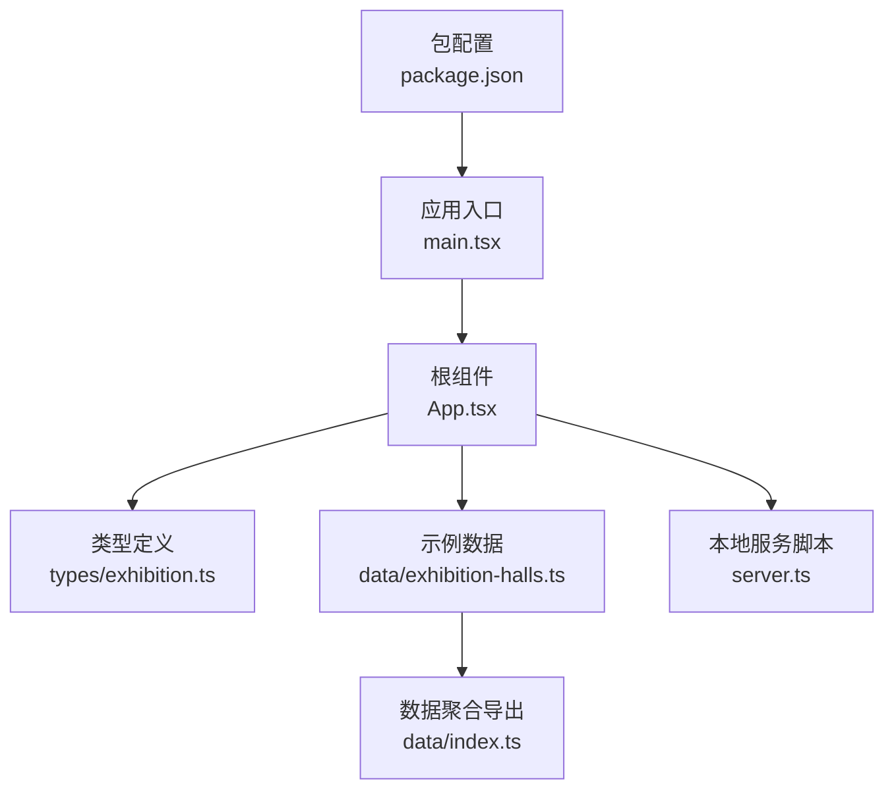

图表来源
- [main.tsx:1-50](file://src/main.tsx#L1-L50)
- [App.tsx:1-120](file://src/App.tsx#L1-L120)
- [exhibition.ts:1-200](file://src/types/exhibition.ts#L1-L200)
- [exhibition-halls.ts:1-200](file://src/data/exhibition-halls.ts#L1-L200)
- [index.ts:1-50](file://src/data/index.ts#L1-L50)
- [server.ts:1-120](file://server.ts#L1-L120)
- [package.json:1-80](file://package.json#L1-L80)

章节来源
- [main.tsx:1-50](file://src/main.tsx#L1-L50)
- [App.tsx:1-120](file://src/App.tsx#L1-L120)
- [exhibition.ts:1-200](file://src/types/exhibition.ts#L1-L200)
- [exhibition-halls.ts:1-200](file://src/data/exhibition-halls.ts#L1-L200)
- [index.ts:1-50](file://src/data/index.ts#L1-L50)
- [server.ts:1-120](file://server.ts#L1-L120)
- [package.json:1-80](file://package.json#L1-L80)

## 核心组件
本节聚焦展厅管理的核心数据与功能模块：
- 数据模型：展厅实体、设施清单、状态枚举、时间区间等
- 示例数据：展厅基础信息与设施配置样例
- 类型聚合：统一导出供上层使用
- 应用集成：在根组件中加载并渲染展厅相关视图

章节来源
- [exhibition.ts:1-200](file://src/types/exhibition.ts#L1-L200)
- [exhibition-halls.ts:1-200](file://src/data/exhibition-halls.ts#L1-L200)
- [index.ts:1-50](file://src/data/index.ts#L1-L50)
- [App.tsx:1-120](file://src/App.tsx#L1-L120)

## 架构总览
展厅管理采用“类型定义 + 示例数据 + 页面集成”的轻量架构。类型层约束数据结构，数据层提供初始样本与静态资源，应用层负责组合与交互。

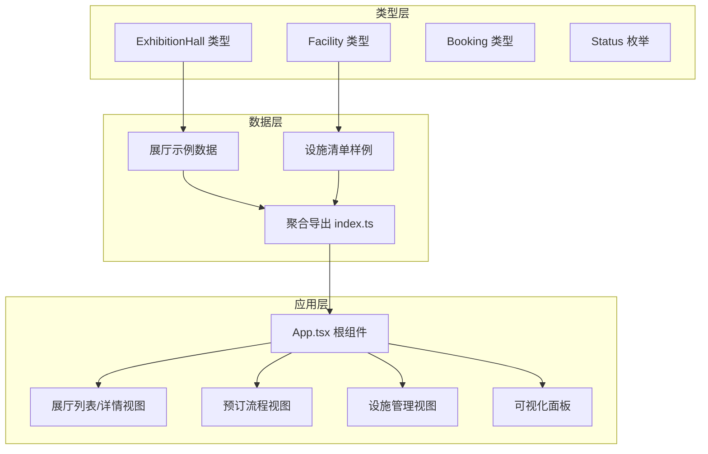

图表来源
- [exhibition.ts:1-200](file://src/types/exhibition.ts#L1-L200)
- [exhibition-halls.ts:1-200](file://src/data/exhibition-halls.ts#L1-L200)
- [index.ts:1-50](file://src/data/index.ts#L1-L50)
- [App.tsx:1-120](file://src/App.tsx#L1-L120)

## 详细组件分析

### 数据模型设计（展厅实体）
- 字段说明
  - 展厅ID：唯一标识，用于跨系统引用与关联
  - 名称：展厅显示名，支持多语言键值
  - 位置：物理地址或楼层/区域编码
  - 面积：单位平方米，用于容量与计费参考
  - 容量：最大容纳人数，用于冲突检测与资源分配
  - 设施配置：设备清单，含设备类型、数量、维护记录、可用性状态
  - 状态：可用、维护中、停用等
  - 创建/更新时间：审计字段
- 业务规则
  - ID全局唯一且不可变
  - 面积与容量需为正数
  - 设施数量非负，维护记录按时间倒序排列
  - 状态变更需遵循状态机（如可用→维护中→可用）

```mermaid
classDiagram
class ExhibitionHall {
+string id
+string name
+string location
+number area
+number capacity
+Facility[] facilities
+Status status
+datetime createdAt
+datetime updatedAt
}
class Facility {
+string type
+number quantity
+MaintenanceRecord[] maintenanceRecords
+boolean available
}
class MaintenanceRecord {
+datetime date
+string description
+string operator
}
class Status {
<<enumeration>>
AVAILABLE
MAINTENANCE
DISABLED
}
ExhibitionHall "1" o-- "*" Facility : "包含"
Facility "1" o-- "*" MaintenanceRecord : "维护记录"
```

图表来源
- [exhibition.ts:1-200](file://src/types/exhibition.ts#L1-L200)

章节来源
- [exhibition.ts:1-200](file://src/types/exhibition.ts#L1-L200)

### 示例数据与聚合导出
- 示例数据提供若干展厅实例，包含名称、位置、面积、容量、设施清单与状态
- 聚合导出将展厅数据集中暴露给上层组件，便于统一导入与测试

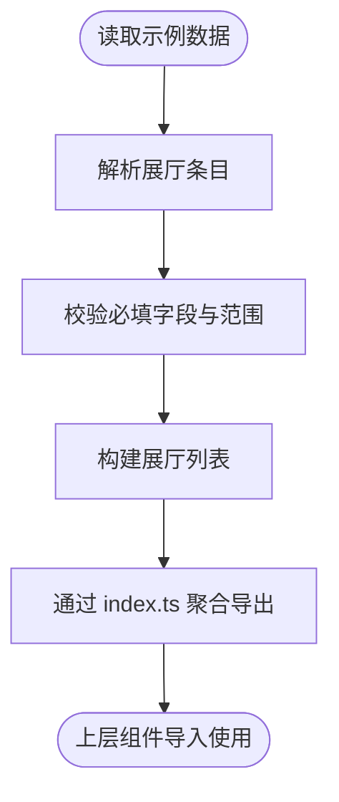

图表来源
- [exhibition-halls.ts:1-200](file://src/data/exhibition-halls.ts#L1-L200)
- [index.ts:1-50](file://src/data/index.ts#L1-L50)

章节来源
- [exhibition-halls.ts:1-200](file://src/data/exhibition-halls.ts#L1-L200)
- [index.ts:1-50](file://src/data/index.ts#L1-L50)

### 展厅空间管理（录入、编辑、删除、状态管理）
- 录入：基于类型约束生成新展厅对象，写入示例数据或持久化存储
- 编辑：更新名称、位置、面积、容量、设施清单与状态，触发校验与审计字段更新
- 删除：软删除标记或硬删除，需检查是否存在未完成的预订
- 状态管理：从可用切换至维护中或停用，维护完成后恢复可用；状态变更需记录操作日志

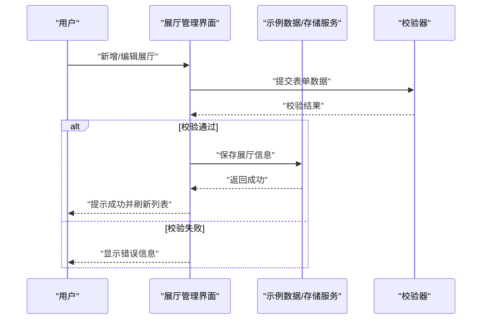

图表来源
- [App.tsx:1-120](file://src/App.tsx#L1-L120)
- [exhibition-halls.ts:1-200](file://src/data/exhibition-halls.ts#L1-L200)

章节来源
- [App.tsx:1-120](file://src/App.tsx#L1-L120)
- [exhibition-halls.ts:1-200](file://src/data/exhibition-halls.ts#L1-L200)

### 展厅预订流程（时间冲突检测、资源分配、确认机制）
- 时间冲突检测：比较目标时间段与已有预订的时间区间，若重叠则拒绝
- 资源分配：根据容量与设施需求匹配展厅，确保设施可用性与数量满足
- 预订确认：生成预订记录，更新展厅占用状态，发送确认通知

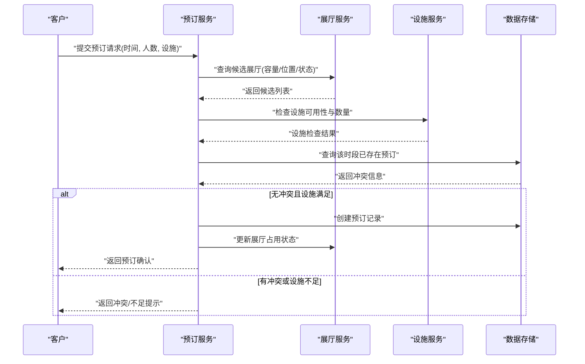

图表来源
- [exhibition.ts:1-200](file://src/types/exhibition.ts#L1-L200)
- [exhibition-halls.ts:1-200](file://src/data/exhibition-halls.ts#L1-L200)

章节来源
- [exhibition.ts:1-200](file://src/types/exhibition.ts#L1-L200)
- [exhibition-halls.ts:1-200](file://src/data/exhibition-halls.ts#L1-L200)

### 设施配置与管理（设备清单、维护记录、可用性检查）
- 设备清单：按类型与数量登记，支持批量导入与导出
- 维护记录：记录维护日期、描述与操作人，用于追溯与计划性维护
- 可用性检查：结合维护记录与当前状态判断是否可用，必要时锁定设备

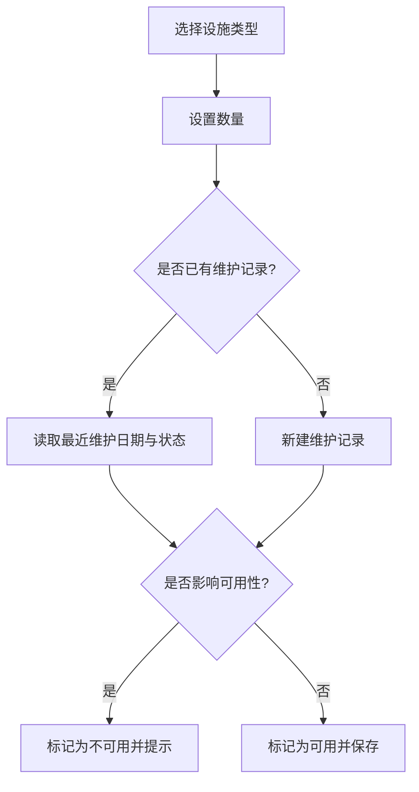

图表来源
- [exhibition.ts:1-200](file://src/types/exhibition.ts#L1-L200)

章节来源
- [exhibition.ts:1-200](file://src/types/exhibition.ts#L1-L200)

### 可视化展示（平面图、占用率统计、预订日历）
- 平面图：以SVG或Canvas绘制展厅布局，标注设施位置与通道
- 占用率统计：按日/周/月计算占用时长与峰值，输出图表
- 预订日历：以时间轴展示各展厅的预订情况，支持筛选与拖拽调整

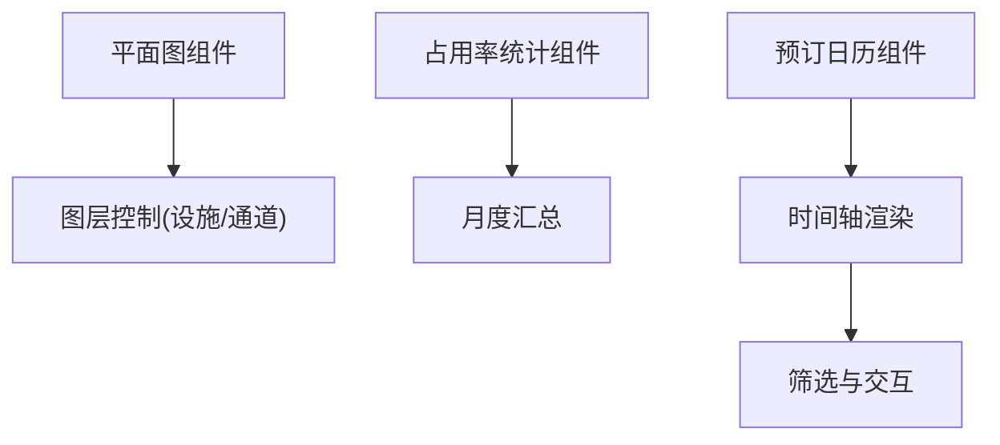

[此图为概念性流程图，不直接映射具体源码文件]

### 与展览活动的关联关系与数据同步
- 关联关系：展厅与活动通过外键或事件ID关联，支持一对多或多对一
- 数据同步：当活动状态变更时，联动更新展厅占用与设施可用性；反之亦然

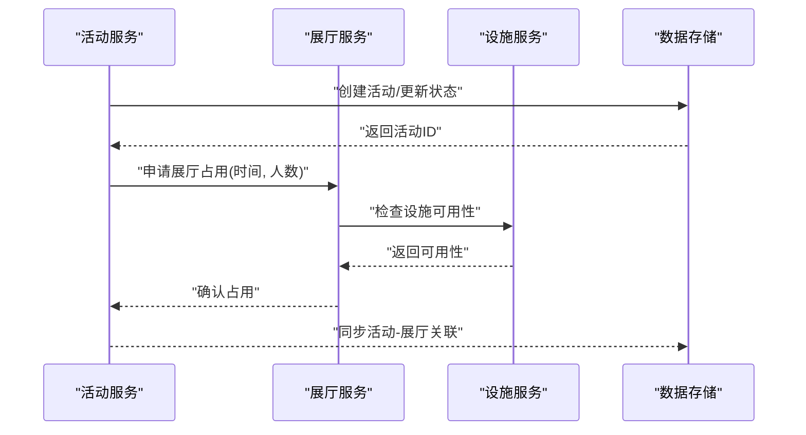

图表来源
- [exhibition.ts:1-200](file://src/types/exhibition.ts#L1-L200)

章节来源
- [exhibition.ts:1-200](file://src/types/exhibition.ts#L1-L200)

### 数据分析（使用率、收入分析、客户偏好洞察）
- 使用率统计：按展厅维度统计占用时长、空闲时长与利用率
- 收入分析：结合定价策略与预订量计算收入趋势
- 客户偏好：基于历史预订数据识别热门展厅、时段与设施组合

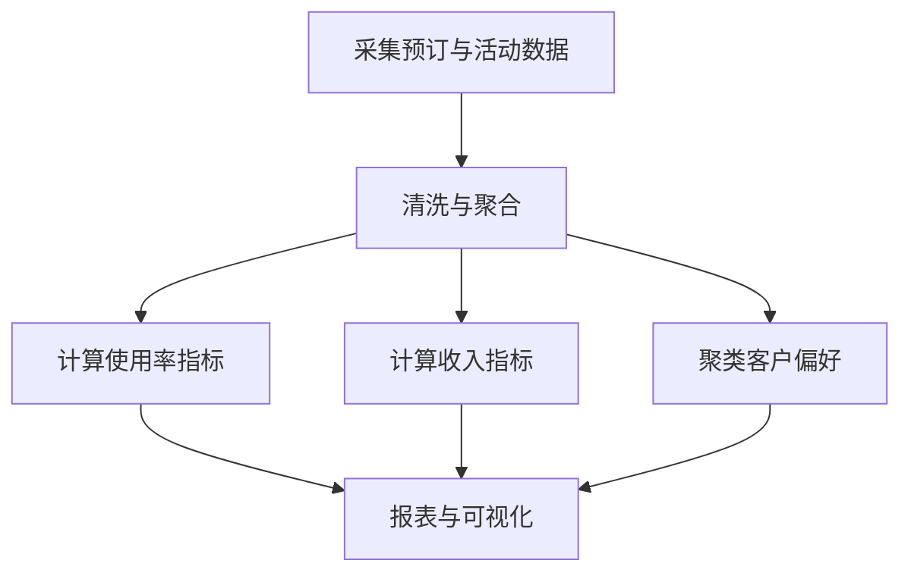

[此图为概念性流程图，不直接映射具体源码文件]

## 依赖分析
展厅管理模块依赖类型定义与示例数据，并通过聚合导出被应用层消费。本地服务脚本用于启动开发环境。

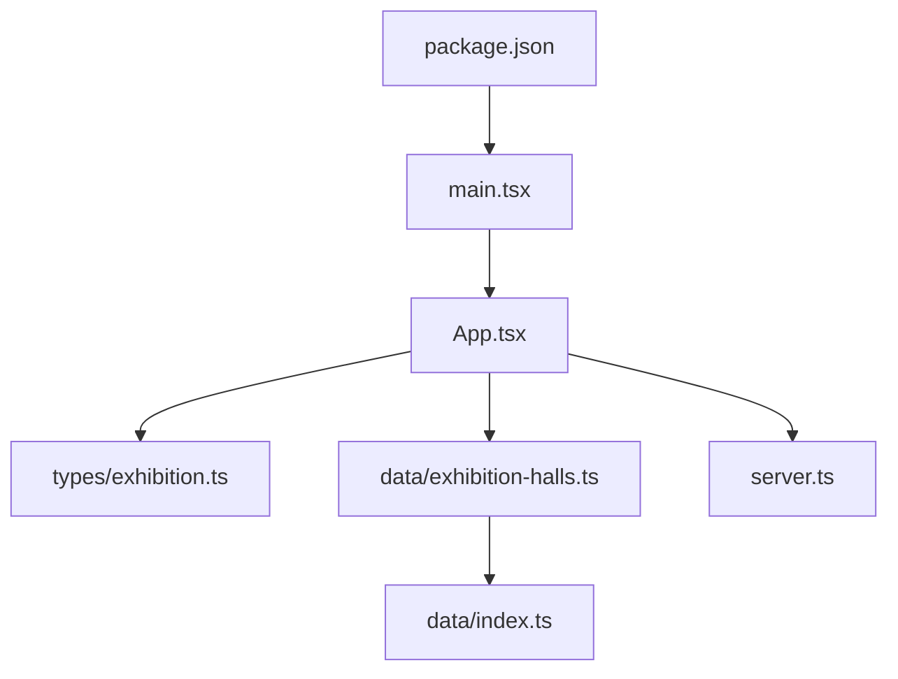

图表来源
- [package.json:1-80](file://package.json#L1-L80)
- [main.tsx:1-50](file://src/main.tsx#L1-L50)
- [App.tsx:1-120](file://src/App.tsx#L1-L120)
- [exhibition.ts:1-200](file://src/types/exhibition.ts#L1-L200)
- [exhibition-halls.ts:1-200](file://src/data/exhibition-halls.ts#L1-L200)
- [index.ts:1-50](file://src/data/index.ts#L1-L50)
- [server.ts:1-120](file://server.ts#L1-L120)

章节来源
- [package.json:1-80](file://package.json#L1-L80)
- [main.tsx:1-50](file://src/main.tsx#L1-L50)
- [App.tsx:1-120](file://src/App.tsx#L1-L120)
- [exhibition.ts:1-200](file://src/types/exhibition.ts#L1-L200)
- [exhibition-halls.ts:1-200](file://src/data/exhibition-halls.ts#L1-L200)
- [index.ts:1-50](file://src/data/index.ts#L1-L50)
- [server.ts:1-120](file://server.ts#L1-L120)

## 性能考虑
- 数据加载：示例数据体积较小，可直接全量加载；未来扩展后建议分页与懒加载
- 冲突检测：时间区间比较应使用高效算法，避免O(n^2)扫描
- 设施可用性：缓存设施状态，减少重复计算
- 可视化渲染：大图面与大量节点时使用虚拟滚动与按需渲染

[本节为通用指导，不直接分析具体文件]

## 故障排查指南
- 常见错误
  - 字段缺失或类型不符：检查类型定义与示例数据一致性
  - 时间冲突误判：核对时间区间边界处理逻辑
  - 设施不可用：查看维护记录与可用性标志
- 定位方法
  - 在应用入口与根组件添加日志输出，追踪数据流
  - 使用浏览器开发者工具检查网络请求与状态更新
  - 本地服务脚本异常时检查端口占用与环境变量

章节来源
- [main.tsx:1-50](file://src/main.tsx#L1-L50)
- [App.tsx:1-120](file://src/App.tsx#L1-L120)
- [server.ts:1-120](file://server.ts#L1-L120)

## 结论
展厅管理模块以清晰的类型定义与示例数据为基础，配合应用层的交互与可视化，实现了展厅信息管理与预订流程的核心能力。后续可在数据持久化、并发冲突处理、高级分析与权限控制方面持续演进。

[本节为总结性内容，不直接分析具体文件]

## 附录
- 术语表
  - 展厅：用于举办展览或会议的空间单元
  - 设施：展厅内配套的设备与资源
  - 预订：在指定时间段占用展厅的行为
- 版本与兼容性
  - 类型定义变更需保持向后兼容
  - 示例数据升级需同步更新聚合导出

[本节为补充信息，不直接分析具体文件]