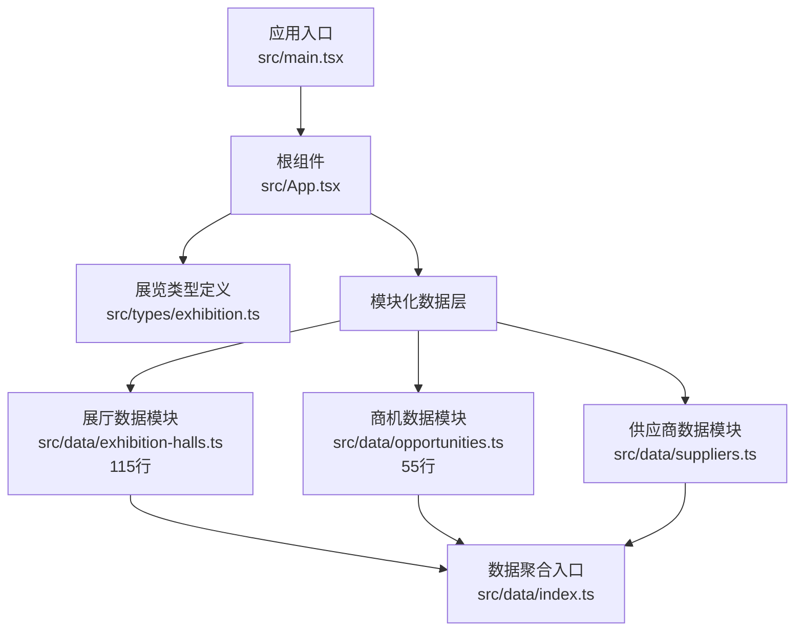
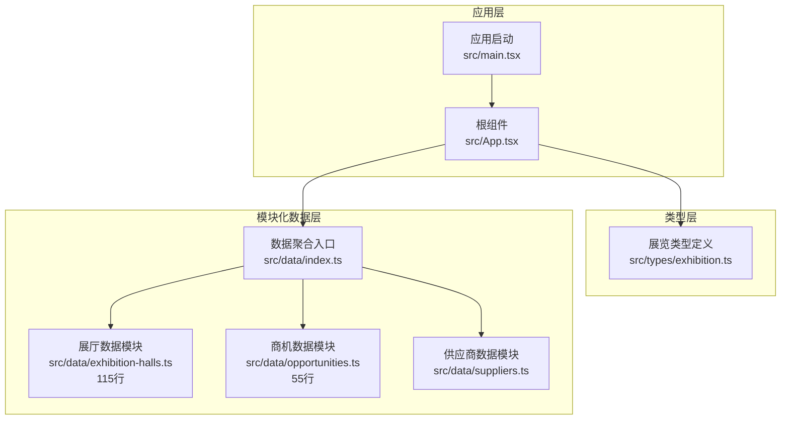
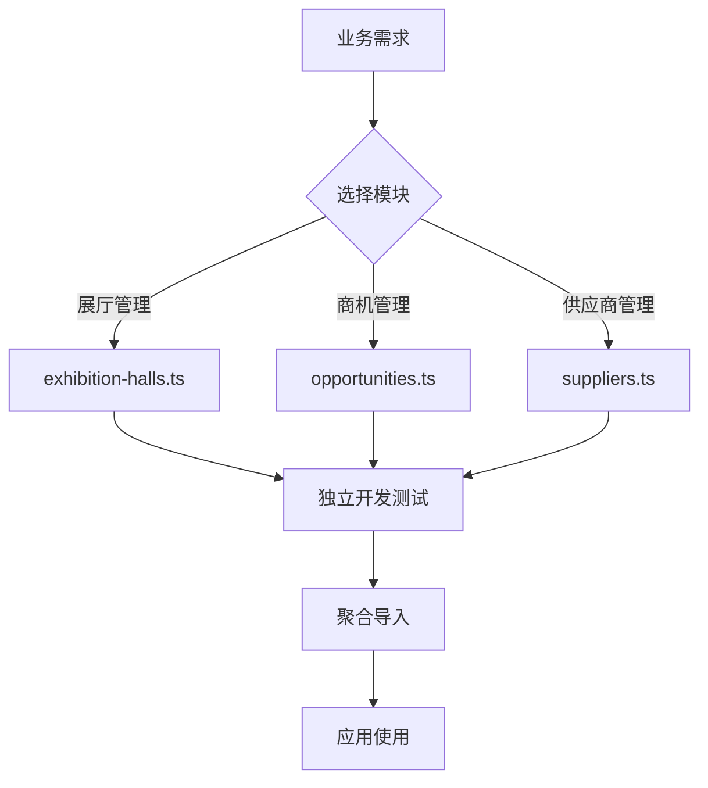
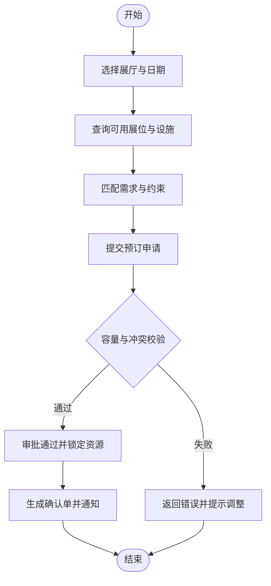
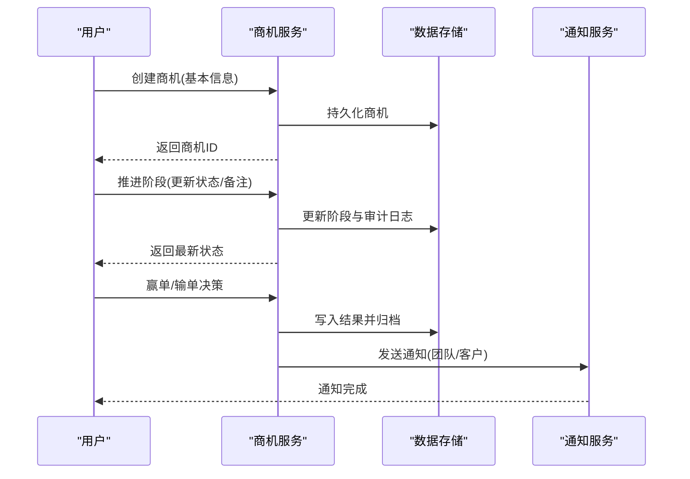
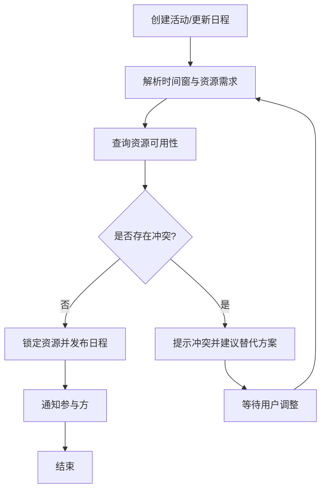
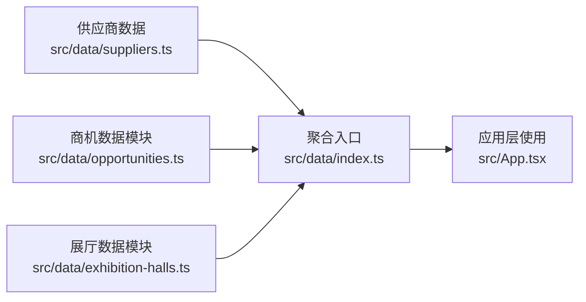
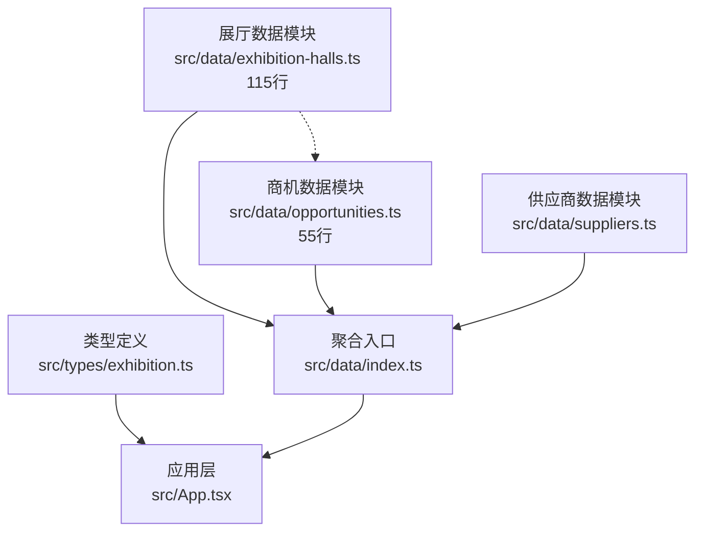

# 展览数据管理

<cite>
**本文引用的文件**   
- [exhibition.ts](file://src/types/exhibition.ts)
- [exhibition-halls.ts](file://src/data/exhibition-halls.ts)
- [opportunities.ts](file://src/data/opportunities.ts)
- [suppliers.ts](file://src/data/suppliers.ts)
- [index.ts](file://src/data/index.ts)
- [App.tsx](file://src/App.tsx)
- [main.tsx](file://src/main.tsx)
</cite>

## 更新摘要
**所做更改**   
- 更新了项目结构部分以反映展览数据管理的模块化拆分
- 新增了独立模块分析章节，详细说明 exhibition-halls.ts 和 opportunities.ts 的分离设计
- 更新了架构总览图以展示新的模块化组织结构
- 增强了依赖分析以体现模块间的解耦关系
- 更新了详细组件分析以反映新的数据组织方式

## 目录
1. [简介](#简介)
2. [项目结构](#项目结构)
3. [核心组件](#核心组件)
4. [架构总览](#架构总览)
5. [模块化设计分析](#模块化设计分析)
6. [详细组件分析](#详细组件分析)
7. [依赖分析](#依赖分析)
8. [性能考虑](#性能考虑)
9. [故障排查指南](#故障排查指南)
10. [结论](#结论)
11. [附录](#附录)

## 简介
本技术文档围绕 Supply OS 的"展览数据管理"能力，系统化阐述展厅信息与商业机会的数据模型设计、字段定义与业务规则；说明展厅空间管理、位置分配、设施配置与预订流程；给出商业机会从创建、跟踪、转化到关闭的完整工作流；解释展览活动的时间管理、资源调度与冲突检测机制；并覆盖可视化展示、统计分析、报告生成以及与供应商、客户等模块的集成方式。最后提供数据分析、趋势预测与商业洞察的实现方法建议。

**最新更新**：展览数据管理已采用模块化设计，将展厅数据和商机数据拆分为独立的 TypeScript 模块，提升了代码的可维护性和扩展性。

## 项目结构
本项目采用前端 TypeScript/React 工程组织，展览相关的数据与类型集中在以下路径：
- 类型定义：src/types/exhibition.ts
- **模块化数据层**：
  - 展厅数据模块：src/data/exhibition-halls.ts（115行）
  - 商机数据模块：src/data/opportunities.ts（55行）
  - 供应商数据模块：src/data/suppliers.ts
- 数据聚合入口：src/data/index.ts
- 应用入口与页面挂载：src/App.tsx、src/main.tsx

**图表来源**
- [main.tsx](file://src/main.tsx)
- [App.tsx](file://src/App.tsx)
- [exhibition.ts](file://src/types/exhibition.ts)
- [exhibition-halls.ts](file://src/data/exhibition-halls.ts)
- [opportunities.ts](file://src/data/opportunities.ts)
- [suppliers.ts](file://src/data/suppliers.ts)
- [index.ts](file://src/data/index.ts)

**章节来源**
- [main.tsx](file://src/main.tsx)
- [App.tsx](file://src/App.tsx)
- [exhibition.ts](file://src/types/exhibition.ts)
- [exhibition-halls.ts](file://src/data/exhibition-halls.ts)
- [opportunities.ts](file://src/data/opportunities.ts)
- [suppliers.ts](file://src/data/suppliers.ts)
- [index.ts](file://src/data/index.ts)

## 核心组件
本节聚焦展览数据管理的核心要素：数据模型、业务规则与关键流程。

- 数据模型
  - 展厅实体：包含编号、名称、面积、楼层、可用状态、设施清单、容量上限、可租时段等字段，用于支撑空间管理与位置分配。
  - 展位实体：表示展厅内的具体位置单元，具备坐标或区域标识、尺寸、朝向、相邻关系、占用状态等属性。
  - 设施实体：如电源、网络、照明、空调、安保等，支持按展厅或展位维度进行配置与复用。
  - 预订实体：记录时间窗口、占用主体（展商/活动）、关联展位、审批状态、变更历史等。
  - 商业机会实体：描述潜在订单线索，包括来源渠道、阶段、预计金额、概率、负责人、截止日期、关联客户/供应商、备注等。
  - 活动实体：承载展览主题、起止时间、日程安排、资源需求、参与方、预算与成本等。

- 业务规则
  - 空间与容量：同一时间段内，一个展位仅允许单一有效预订；展厅总容量不得超限。
  - 时间与冲突：预订时间窗不可重叠；跨日期的预订需校验每日可用容量。
  - 设施约束：高能耗设备需满足电力配额；特殊设施需提前预约与审批。
  - 商机阶段推进：遵循"新建-跟进-方案-报价-谈判-赢单/输单-关闭"的阶段流转，且每步需有明确动作与证据。
  - 转化率与时效：对长期未推进的商机触发提醒；赢单后自动关联合同与交付计划。

- 关键流程
  - 展厅空间管理：选择展厅→查看可用日期→分配展位→配置设施→提交预订→审核通过→生效。
  - 商业机会工作流：创建线索→初步筛选→需求确认→方案报价→谈判签约→赢单/输单→归档复盘。
  - 活动排期与资源调度：创建活动→匹配场地与设施→检查冲突→锁定资源→发布日程→执行与复盘。

**章节来源**
- [exhibition.ts](file://src/types/exhibition.ts)
- [exhibition-halls.ts](file://src/data/exhibition-halls.ts)
- [opportunities.ts](file://src/data/opportunities.ts)
- [suppliers.ts](file://src/data/suppliers.ts)
- [index.ts](file://src/data/index.ts)

## 架构总览
展览数据管理在应用中采用"类型定义 + 模块化数据层 + 聚合入口 + 页面渲染"的组织方式。类型层保证数据结构一致性；模块化数据层提供独立的数据管理能力；聚合层统一导出；应用层负责组合与展示。

**图表来源**
- [exhibition.ts](file://src/types/exhibition.ts)
- [exhibition-halls.ts](file://src/data/exhibition-halls.ts)
- [opportunities.ts](file://src/data/opportunities.ts)
- [suppliers.ts](file://src/data/suppliers.ts)
- [index.ts](file://src/data/index.ts)
- [App.tsx](file://src/App.tsx)
- [main.tsx](file://src/main.tsx)

## 模块化设计分析

### 展厅数据模块（exhibition-halls.ts）
展厅数据模块专注于展厅空间管理相关的所有数据逻辑，包含115行代码，主要职责包括：
- 展厅实体定义与管理
- 展位分配算法实现
- 设施配置与绑定逻辑
- 预订状态管理
- 空间利用率计算

该模块提供了完整的展厅空间管理解决方案，支持复杂的物理布局建模和资源调度。

### 商机数据模块（opportunities.ts）
商机数据模块专注于商业机会的全生命周期管理，包含55行代码，主要职责包括：
- 商机实体定义与状态管理
- 销售漏斗阶段推进逻辑
- 转化率计算与分析
- 商机优先级排序
- 销售预测功能

该模块实现了标准化的销售流程管理，支持从线索到成交的完整跟踪。

### 模块化优势
- **职责分离**：每个模块专注于特定业务领域，降低耦合度
- **可维护性**：独立修改不影响其他模块，便于团队协作
- **可扩展性**：新增功能时只需修改相应模块
- **测试友好**：模块边界清晰，便于单元测试
- **代码复用**：模块可被多个页面或服务复用

**图表来源**
- [exhibition-halls.ts](file://src/data/exhibition-halls.ts)
- [opportunities.ts](file://src/data/opportunities.ts)
- [suppliers.ts](file://src/data/suppliers.ts)
- [index.ts](file://src/data/index.ts)

**章节来源**
- [exhibition-halls.ts](file://src/data/exhibition-halls.ts)
- [opportunities.ts](file://src/data/opportunities.ts)
- [index.ts](file://src/data/index.ts)

## 详细组件分析

### 数据模型与字段定义
- 展厅信息
  - 关键字段：展厅ID、名称、面积、楼层、状态、设施列表、容量上限、可租时段、价格策略、联系人。
  - 约束：状态为"可用/维护/停用"；容量上限用于并发预订控制；可租时段用于时间窗校验。
- 展位信息
  - 关键字段：展位ID、所属展厅、区域/坐标、尺寸、朝向、相邻展位、占用状态、设施绑定。
  - 约束：同一时间槽内占用状态互斥；设施绑定需满足功率与接口类型。
- 设施配置
  - 关键字段：设施ID、名称、类型、规格、数量、安装位置、维护周期、可用性。
  - 约束：类型决定审批与计费逻辑；安装位置需与展位/展厅拓扑一致。
- 预订记录
  - 关键字段：预订ID、时间窗（开始/结束）、主体信息、关联展位、状态、审批人、变更记录。
  - 约束：时间窗不重叠；状态机包含"草稿/待审/已批准/已取消/已完成"。
- 商业机会
  - 关键字段：机会ID、标题、来源、阶段、预计金额、概率、负责人、截止日期、关联客户/供应商、备注。
  - 约束：阶段推进需留痕；金额与概率联动计算预期收益。
- 活动与日程
  - 关键字段：活动ID、主题、起止时间、资源需求、参与方、预算、成本、状态。
  - 约束：与场地、设施、人员等资源存在依赖关系；冲突检测基于时间窗与资源容量。

**章节来源**
- [exhibition.ts](file://src/types/exhibition.ts)
- [exhibition-halls.ts](file://src/data/exhibition-halls.ts)
- [opportunities.ts](file://src/data/opportunities.ts)
- [suppliers.ts](file://src/data/suppliers.ts)

### 展厅空间管理与位置分配
- 空间建模：以"展厅-区域-展位"的层级结构表达物理布局，便于可视化与检索。
- 位置分配：根据需求（面积、朝向、相邻）与约束（容量、设施）进行匹配；优先选择空闲且符合规格的展位。
- 设施配置：将设施与展位/展厅建立映射，支持批量配置与差异化定价。
- 预订流程：
  1) 选择目标展厅与日期范围
  2) 查询可用展位与设施
  3) 提交预订申请
  4) 系统校验容量与冲突
  5) 审批通过后锁定资源
  6) 生成确认单并通知相关方

**图表来源**
- [exhibition-halls.ts](file://src/data/exhibition-halls.ts)
- [index.ts](file://src/data/index.ts)

**章节来源**
- [exhibition-halls.ts](file://src/data/exhibition-halls.ts)
- [index.ts](file://src/data/index.ts)

### 商业机会工作流（创建-跟踪-转化-关闭）
- 创建：录入基本信息（来源、标题、金额、概率、负责人、截止日期），标记为"新建"。
- 跟踪：更新阶段（跟进/方案/报价/谈判），记录每次沟通要点与下一步计划。
- 转化：赢单时转为合同/订单，并关联交付计划；输单时记录原因并归档。
- 关闭：所有阶段完成后进入归档，支持复盘与指标统计。

**图表来源**
- [opportunities.ts](file://src/data/opportunities.ts)
- [index.ts](file://src/data/index.ts)

**章节来源**
- [opportunities.ts](file://src/data/opportunities.ts)
- [index.ts](file://src/data/index.ts)

### 展览活动时间管理与资源调度
- 时间管理：以活动为中心，维护起止时间、子日程、里程碑；支持重复规则与缓冲时间。
- 资源调度：将场地、设施、人员纳入资源池，依据容量与可用性进行匹配。
- 冲突检测：基于时间窗与资源容量的双重校验，避免超订与资源争用。
- 变更处理：当资源或时间变更时，重新运行冲突检测并通知受影响方。

**图表来源**
- [exhibition.ts](file://src/types/exhibition.ts)
- [exhibition-halls.ts](file://src/data/exhibition-halls.ts)
- [index.ts](file://src/data/index.ts)

**章节来源**
- [exhibition.ts](file://src/types/exhibition.ts)
- [exhibition-halls.ts](file://src/data/exhibition-halls.ts)
- [index.ts](file://src/data/index.ts)

### 可视化展示、统计分析与报告生成
- 可视化展示
  - 展厅平面图：以网格或拓扑图展示展位分布、占用状态与设施标注。
  - 甘特图：呈现活动日程、资源占用与冲突高亮。
  - 看板视图：商机阶段卡片，支持拖拽推进与过滤。
- 统计分析
  - 展厅利用率：按日期/展厅/区域维度统计占用率与空置率。
  - 商机漏斗：各阶段数量、转化率、平均周期、赢单金额。
  - 收入与成本：按活动/展厅/供应商归集，计算毛利与ROI。
- 报告生成
  - 模板化报表：导出PDF/Excel，包含关键指标与图表。
  - 定时任务：周期性生成日报/周报/月报并推送。

**章节来源**
- [exhibition-halls.ts](file://src/data/exhibition-halls.ts)
- [opportunities.ts](file://src/data/opportunities.ts)
- [index.ts](file://src/data/index.ts)

### 与其他业务模块的集成（供应商、客户等）
- 供应商集成
  - 供应商主数据：资质、服务能力、价格表、SLA、评价。
  - 采购与结算：基于活动与设施需求生成采购单，对接支付与发票。
- 客户集成
  - 客户档案：企业/个人、联系人、偏好、历史交易。
  - 商机关联：将商机与客户绑定，支持多对一/一对多关系。
- 数据聚合
  - 通过聚合入口统一导出展览、商机、供应商等数据，供上层页面与服务消费。

**图表来源**
- [suppliers.ts](file://src/data/suppliers.ts)
- [opportunities.ts](file://src/data/opportunities.ts)
- [exhibition-halls.ts](file://src/data/exhibition-halls.ts)
- [index.ts](file://src/data/index.ts)
- [App.tsx](file://src/App.tsx)

**章节来源**
- [suppliers.ts](file://src/data/suppliers.ts)
- [opportunities.ts](file://src/data/opportunities.ts)
- [exhibition-halls.ts](file://src/data/exhibition-halls.ts)
- [index.ts](file://src/data/index.ts)
- [App.tsx](file://src/App.tsx)

### 数据分析、趋势预测与商业洞察
- 数据分析
  - 时间序列：按周/月统计展厅利用率、商机新增量、赢单率。
  - 多维切片：按区域、设施类型、供应商、行业进行交叉分析。
- 趋势预测
  - 季节性：识别展会旺季与淡季，指导营销与库存策略。
  - 回归/分类：基于历史数据预测未来成交概率与金额区间。
- 商业洞察
  - 高价值客户识别：结合RFM模型与互动频次。
  - 资源优化：根据利用率与利润贡献调整定价与资源配置。

## 依赖分析
展览数据管理模块的依赖关系如下：
- 类型层被应用层与数据层共同引用，确保数据结构一致。
- **模块化数据层**内部通过聚合入口统一导出，降低耦合度。
- 应用层仅依赖聚合入口与类型定义，便于替换数据源与扩展功能。
- **模块间解耦**：展厅数据模块与商机数据模块相互独立，无直接依赖关系。

**图表来源**
- [exhibition.ts](file://src/types/exhibition.ts)
- [index.ts](file://src/data/index.ts)
- [exhibition-halls.ts](file://src/data/exhibition-halls.ts)
- [opportunities.ts](file://src/data/opportunities.ts)
- [suppliers.ts](file://src/data/suppliers.ts)
- [App.tsx](file://src/App.tsx)

**章节来源**
- [exhibition.ts](file://src/types/exhibition.ts)
- [index.ts](file://src/data/index.ts)
- [exhibition-halls.ts](file://src/data/exhibition-halls.ts)
- [opportunities.ts](file://src/data/opportunities.ts)
- [suppliers.ts](file://src/data/suppliers.ts)
- [App.tsx](file://src/App.tsx)

## 性能考虑
- 数据加载
  - 按需加载：仅在需要时请求展厅/商机/供应商数据，减少首屏体积。
  - 分页与缓存：对列表数据进行分页与本地缓存，提升交互流畅度。
- 计算与渲染
  - 冲突检测与资源调度：采用增量计算与索引优化，避免全量扫描。
  - 可视化渲染：对大规模展位图使用虚拟化与分片渲染。
- 可扩展性
  - 数据层抽象：通过聚合入口屏蔽数据源差异，便于迁移至后端API。
  - 类型驱动：严格类型定义有助于静态检查与重构安全。
  - **模块化优化**：独立模块支持并行加载，提升整体性能。

## 故障排查指南
- 常见错误
  - 预订冲突：时间窗重叠或容量超限，需检查冲突检测逻辑与资源可用性。
  - 设施不足：高能耗或特殊设施未满足配额，需核对设施绑定与审批流程。
  - 商机停滞：长时间未推进导致转化率低，需设置提醒与责任人。
  - **模块依赖问题**：检查模块间导入关系是否正确，确保聚合入口导出完整。
- 定位步骤
  - 检查数据一致性：对比类型定义与实际数据字段是否匹配。
  - 审查聚合入口：确认数据导出是否正确合并与转换。
  - 验证应用层调用：检查组件是否正确订阅数据变化与错误边界。
  - **模块隔离测试**：分别测试各模块功能，定位问题所在模块。

**章节来源**
- [exhibition.ts](file://src/types/exhibition.ts)
- [index.ts](file://src/data/index.ts)
- [App.tsx](file://src/App.tsx)

## 结论
本技术文档系统梳理了展览数据管理的数据模型、业务规则与关键流程，提供了空间管理、商机工作流、时间调度与冲突检测的设计思路，并给出了可视化、统计分析与报告生成的实现方向。通过类型驱动与模块化数据组织的架构模式，系统在可扩展性与可维护性方面具备良好的基础。

**重要改进**：通过将展览数据管理拆分为独立的展厅数据模块（115行）和商机数据模块（55行），显著提升了代码的组织性和可维护性。这种模块化设计使得各个业务领域可以独立开发和测试，降低了系统复杂度，为后续功能扩展奠定了坚实基础。

后续建议逐步引入后端服务与真实数据源，完善权限、审计与监控能力，进一步提升系统的稳定性与业务价值。

## 附录
- 术语表
  - 展厅：举办展览活动的物理空间。
  - 展位：展厅内可供展商使用的具体位置单元。
  - 设施：支撑展览运行的设备与服务。
  - 预订：对特定时间窗与资源的占用申请。
  - 商业机会：潜在的交易线索与订单机会。
  - 活动：围绕展览主题组织的日程与资源集合。
  - **模块化设计**：将复杂系统拆分为独立、可管理的模块的软件设计方法。