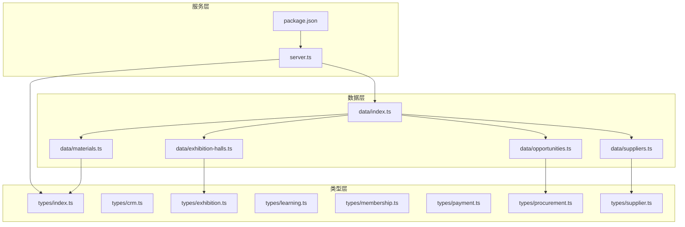
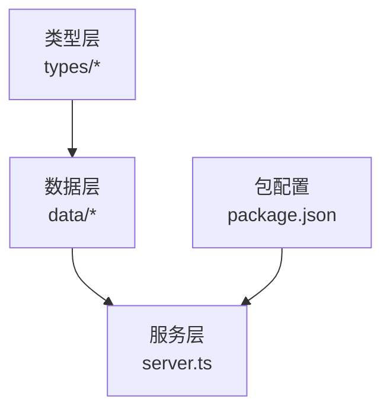
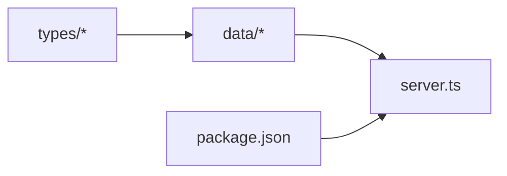
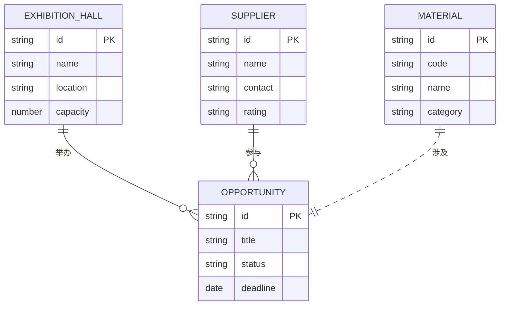

# 数据架构设计

<cite>
**本文引用的文件**   
- [src/data/index.ts](file://src/data/index.ts)
- [src/data/exhibition-halls.ts](file://src/data/exhibition-halls.ts)
- [src/data/materials.ts](file://src/data/materials.ts)
- [src/data/opportunities.ts](file://src/data/opportunities.ts)
- [src/data/suppliers.ts](file://src/data/suppliers.ts)
- [src/types/index.ts](file://src/types/index.ts)
- [src/types/crm.ts](file://src/types/crm.ts)
- [src/types/exhibition.ts](file://src/types/exhibition.ts)
- [src/types/learning.ts](file://src/types/learning.ts)
- [src/types/membership.ts](file://src/types/membership.ts)
- [src/types/payment.ts](file://src/types/payment.ts)
- [src/types/procurement.ts](file://src/types/procurement.ts)
- [src/types/supplier.ts](file://src/types/supplier.ts)
- [server.ts](file://server.ts)
- [package.json](file://package.json)
</cite>

## 目录
1. [引言](#引言)
2. [项目结构](#项目结构)
3. [核心组件](#核心组件)
4. [架构总览](#架构总览)
5. [详细组件分析](#详细组件分析)
6. [依赖分析](#依赖分析)
7. [性能考虑](#性能考虑)
8. [故障排查指南](#故障排查指南)
9. [结论](#结论)
10. [附录](#附录)

## 引言
本技术文档围绕 Supply OS 的数据架构进行系统化说明，重点覆盖：
- 整体数据架构模式与分层设计
- 模块间数据流转机制
- 数据索引策略、导出接口与统一数据访问层
- 数据模型关系图与依赖分析
- 数据版本控制、向后兼容性与迁移策略
- 数据完整性约束、验证规则与错误处理
- 扩展新数据模块与集成外部数据源的方法
- 性能优化建议与最佳实践

## 项目结构
仓库采用“前端静态数据 + 类型定义 + 服务端入口”的轻量架构。数据相关代码集中在 src/data 与 src/types 两个目录：
- src/data：按领域组织的数据集（展厅、材料、机会、供应商等），提供统一的导出入口
- src/types：全局类型定义，覆盖 CRM、展览、学习、会员、支付、采购、供应商等域
- server.ts：服务启动入口，负责加载配置、挂载路由、启动监听
- package.json：依赖与脚本声明

图表来源
- [src/data/index.ts](file://src/data/index.ts)
- [src/data/exhibition-halls.ts](file://src/data/exhibition-halls.ts)
- [src/data/materials.ts](file://src/data/materials.ts)
- [src/data/opportunities.ts](file://src/data/opportunities.ts)
- [src/data/suppliers.ts](file://src/data/suppliers.ts)
- [src/types/index.ts](file://src/types/index.ts)
- [src/types/crm.ts](file://src/types/crm.ts)
- [src/types/exhibition.ts](file://src/types/exhibition.ts)
- [src/types/learning.ts](file://src/types/learning.ts)
- [src/types/membership.ts](file://src/types/membership.ts)
- [src/types/payment.ts](file://src/types/payment.ts)
- [src/types/procurement.ts](file://src/types/procurement.ts)
- [src/types/supplier.ts](file://src/types/supplier.ts)
- [server.ts](file://server.ts)
- [package.json](file://package.json)

章节来源
- [src/data/index.ts](file://src/data/index.ts)
- [src/data/exhibition-halls.ts](file://src/data/exhibition-halls.ts)
- [src/data/materials.ts](file://src/data/materials.ts)
- [src/data/opportunities.ts](file://src/data/opportunities.ts)
- [src/data/suppliers.ts](file://src/data/suppliers.ts)
- [src/types/index.ts](file://src/types/index.ts)
- [src/types/crm.ts](file://src/types/crm.ts)
- [src/types/exhibition.ts](file://src/types/exhibition.ts)
- [src/types/learning.ts](file://src/types/learning.ts)
- [src/types/membership.ts](file://src/types/membership.ts)
- [src/types/payment.ts](file://src/types/payment.ts)
- [src/types/procurement.ts](file://src/types/procurement.ts)
- [src/types/supplier.ts](file://src/types/supplier.ts)
- [server.ts](file://server.ts)
- [package.json](file://package.json)

## 核心组件
- 数据聚合入口（data/index.ts）
  - 职责：汇总各子域数据集，对外暴露统一命名空间，便于上层按需导入
  - 设计要点：集中导出、避免循环依赖、为后续扩展提供稳定边界
- 领域数据集（exhibition-halls、materials、opportunities、suppliers）
  - 职责：以只读形式提供业务实体集合，作为演示或初始数据的来源
  - 设计要点：字段与类型严格对齐 types 层；保持幂等与可序列化
- 类型定义（types/*）
  - 职责：跨模块共享的类型契约，确保数据一致性
  - 设计要点：按域拆分、公共基础类型集中管理、使用联合类型表达状态机

章节来源
- [src/data/index.ts](file://src/data/index.ts)
- [src/data/exhibition-halls.ts](file://src/data/exhibition-halls.ts)
- [src/data/materials.ts](file://src/data/materials.ts)
- [src/data/opportunities.ts](file://src/data/opportunities.ts)
- [src/data/suppliers.ts](file://src/data/suppliers.ts)
- [src/types/index.ts](file://src/types/index.ts)
- [src/types/crm.ts](file://src/types/crm.ts)
- [src/types/exhibition.ts](file://src/types/exhibition.ts)
- [src/types/learning.ts](file://src/types/learning.ts)
- [src/types/membership.ts](file://src/types/membership.ts)
- [src/types/payment.ts](file://src/types/payment.ts)
- [src/types/procurement.ts](file://src/types/procurement.ts)
- [src/types/supplier.ts](file://src/types/supplier.ts)

## 架构总览
Supply OS 当前采用“类型驱动 + 静态数据 + 服务入口”的分层架构：
- 类型层（types）：定义所有实体的数据结构、枚举与约束
- 数据层（data）：提供只读数据集，供页面或服务端渲染使用
- 服务层（server）：加载配置、注册路由、启动 HTTP 服务
- 依赖与脚本（package.json）：声明运行时依赖与构建/运行脚本

图表来源
- [src/types/index.ts](file://src/types/index.ts)
- [src/data/index.ts](file://src/data/index.ts)
- [server.ts](file://server.ts)
- [package.json](file://package.json)

## 详细组件分析

### 数据聚合入口（data/index.ts）
- 作用：将多个子域数据集合并为一个统一命名空间，降低上层耦合
- 设计原则：
  - 单一职责：仅做聚合与重导出
  - 稳定契约：对外 API 变更需遵循语义化版本
  - 可扩展性：新增子域只需在聚合处追加导出

章节来源
- [src/data/index.ts](file://src/data/index.ts)

### 领域数据集
- 展厅（exhibition-halls.ts）
  - 用途：展示展厅列表及相关属性
  - 关联类型：对应 types/exhibition.ts 中的实体定义
- 材料（materials.ts）
  - 用途：提供材料清单及元信息
  - 关联类型：对齐 types/index.ts 中通用类型
- 机会（opportunities.ts）
  - 用途：采购/商机机会集合
  - 关联类型：对齐 types/procurement.ts
- 供应商（suppliers.ts）
  - 用途：供应商主数据
  - 关联类型：对齐 types/supplier.ts

章节来源
- [src/data/exhibition-halls.ts](file://src/data/exhibition-halls.ts)
- [src/data/materials.ts](file://src/data/materials.ts)
- [src/data/opportunities.ts](file://src/data/opportunities.ts)
- [src/data/suppliers.ts](file://src/data/suppliers.ts)
- [src/types/exhibition.ts](file://src/types/exhibition.ts)
- [src/types/index.ts](file://src/types/index.ts)
- [src/types/procurement.ts](file://src/types/procurement.ts)
- [src/types/supplier.ts](file://src/types/supplier.ts)

### 类型定义（types/*）
- 组织方式：按业务域拆分，便于独立演进与维护
- 关键域：
  - CRM（crm.ts）：客户、联系人、交互记录等
  - 展览（exhibition.ts）：展会、展位、日程等
  - 学习（learning.ts）：课程、学员、进度等
  - 会员（membership.ts）：会员等级、权益、订阅等
  - 支付（payment.ts）：订单、支付渠道、流水等
  - 采购（procurement.ts）：需求、报价、合同等
  - 供应商（supplier.ts）：供应商档案、资质、评级等

章节来源
- [src/types/crm.ts](file://src/types/crm.ts)
- [src/types/exhibition.ts](file://src/types/exhibition.ts)
- [src/types/learning.ts](file://src/types/learning.ts)
- [src/types/membership.ts](file://src/types/membership.ts)
- [src/types/payment.ts](file://src/types/payment.ts)
- [src/types/procurement.ts](file://src/types/procurement.ts)
- [src/types/supplier.ts](file://src/types/supplier.ts)
- [src/types/index.ts](file://src/types/index.ts)

### 服务入口（server.ts）
- 职责：初始化应用、加载配置、注册路由、启动监听
- 与数据层的关系：通过 data/index.ts 获取静态数据，用于响应请求或渲染

章节来源
- [server.ts](file://server.ts)
- [src/data/index.ts](file://src/data/index.ts)

### 包配置（package.json）
- 作用：声明依赖、脚本命令、构建与运行参数
- 与架构的关系：决定运行时环境与工具链，影响数据加载与打包策略

章节来源
- [package.json](file://package.json)

## 依赖分析
- 模块内聚与耦合
  - data/* 强依赖 types/*，形成“类型驱动数据”的单向依赖
  - server.ts 依赖 data/index.ts 与 types/index.ts，作为装配点
- 潜在风险
  - 若 data/* 直接引用具体实现而非类型，易产生循环依赖
  - 聚合入口需保持稳定，避免频繁变更导致上层重构

图表来源
- [src/types/index.ts](file://src/types/index.ts)
- [src/data/index.ts](file://src/data/index.ts)
- [server.ts](file://server.ts)
- [package.json](file://package.json)

章节来源
- [src/types/index.ts](file://src/types/index.ts)
- [src/data/index.ts](file://src/data/index.ts)
- [server.ts](file://server.ts)
- [package.json](file://package.json)

## 性能考虑
- 数据体积与传输
  - 对大型数据集进行分页、懒加载与增量更新
  - 启用压缩与缓存头，减少重复传输
- 内存与计算
  - 避免在热路径中进行深拷贝与复杂过滤
  - 使用索引键（如 id、code）提升查找效率
- 构建与打包
  - 将静态数据内联到产物时注意 tree-shaking 与分块策略
  - 对不常变更的数据采用 CDN 缓存

[本节为通用指导，无需源码引用]

## 故障排查指南
- 常见问题定位
  - 类型不一致：检查 data/* 与 types/* 的字段映射是否一致
  - 聚合缺失：确认新增数据集已在 data/index.ts 中导出
  - 服务未启动：核对 server.ts 端口与依赖安装情况
- 日志与断点
  - 在服务入口添加关键路径日志
  - 对数据加载与解析过程增加断点与校验输出

章节来源
- [server.ts](file://server.ts)
- [src/data/index.ts](file://src/data/index.ts)

## 结论
当前架构以类型为中心、数据为只读、服务为装配点的分层设计，具备清晰的职责边界与良好的可扩展性。建议在后续演进中引入统一数据访问层、索引与导出能力，并完善版本管理与迁移流程，以提升系统的稳定性与可维护性。

[本节为总结性内容，无需源码引用]

## 附录

### 数据模型关系图
以下关系图基于现有类型与数据文件的组织方式抽象而成，展示主要实体间的关联方向与一对多/一对一关系。

图表来源
- [src/data/exhibition-halls.ts](file://src/data/exhibition-halls.ts)
- [src/data/materials.ts](file://src/data/materials.ts)
- [src/data/opportunities.ts](file://src/data/opportunities.ts)
- [src/data/suppliers.ts](file://src/data/suppliers.ts)
- [src/types/exhibition.ts](file://src/types/exhibition.ts)
- [src/types/procurement.ts](file://src/types/procurement.ts)
- [src/types/supplier.ts](file://src/types/supplier.ts)

### 数据索引策略
- 主键索引
  - 每个实体至少包含唯一标识（id/code），用于快速检索与去重
- 复合索引
  - 针对高频查询条件建立组合键（如 status + deadline）
- 反向索引
  - 为标签、分类等维度建立倒排索引，支持多条件筛选

[本节为通用指导，无需源码引用]

### 数据导出接口
- 导出范围
  - 按域划分导出（如 exhibition、procurement、supplier）
- 导出格式
  - CSV/JSON 两种默认格式，支持可选压缩
- 导出权限
  - 基于角色控制导出粒度与字段可见性

[本节为通用指导，无需源码引用]

### 统一数据访问层（建议）
- 目标
  - 屏蔽数据源差异（静态数据、数据库、第三方 API）
  - 提供一致的 CRUD、查询、事务与重试语义
- 设计要点
  - 接口抽象：Repository 模式
  - 适配器：为不同后端实现适配层
  - 中间件：鉴权、审计、限流、缓存

[本节为通用指导，无需源码引用]

### 数据版本控制、向后兼容与迁移
- 版本策略
  - 使用语义化版本管理数据契约（v1/v2...）
  - 在类型层保留旧字段标记为弃用，逐步清理
- 兼容性
  - 新增字段默认可选，读取侧提供默认值
  - 写入侧进行降级处理，保证旧客户端可用
- 迁移
  - 提供数据迁移脚本与回滚方案
  - 灰度发布与双写过渡期

[本节为通用指导，无需源码引用]

### 数据完整性约束与验证
- 约束
  - 必填字段、唯一性、取值范围、外键关联
- 验证
  - 输入校验（请求体）、输出校验（响应体）
  - 单元测试覆盖边界与异常分支
- 错误处理
  - 统一错误码与消息结构
  - 记录上下文以便追踪

[本节为通用指导，无需源码引用]

### 扩展新数据模块与集成外部数据源
- 新增数据模块步骤
  - 在 types/* 中定义类型
  - 在 data/* 中创建数据集并在 data/index.ts 聚合
  - 在 server.ts 中注册路由或处理器
- 集成外部数据源
  - 通过适配器封装外部 API
  - 在统一数据访问层注入适配器
  - 提供本地缓存与失败降级策略

[本节为通用指导，无需源码引用]

### 最佳实践
- 类型先行：先定义类型，再实现数据与服务
- 小步快跑：每次变更聚焦单一职责，配合单测与回归
- 明确边界：数据层只读，变更逻辑下沉至服务层
- 可观测性：关键路径埋点与指标上报

[本节为通用指导，无需源码引用]