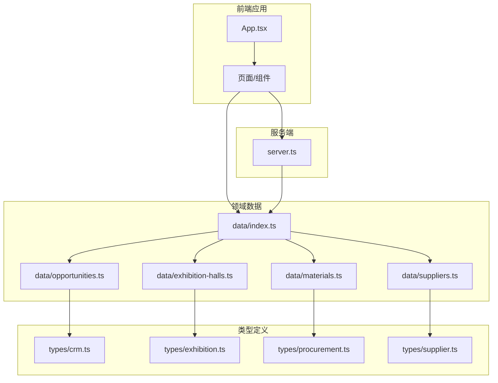
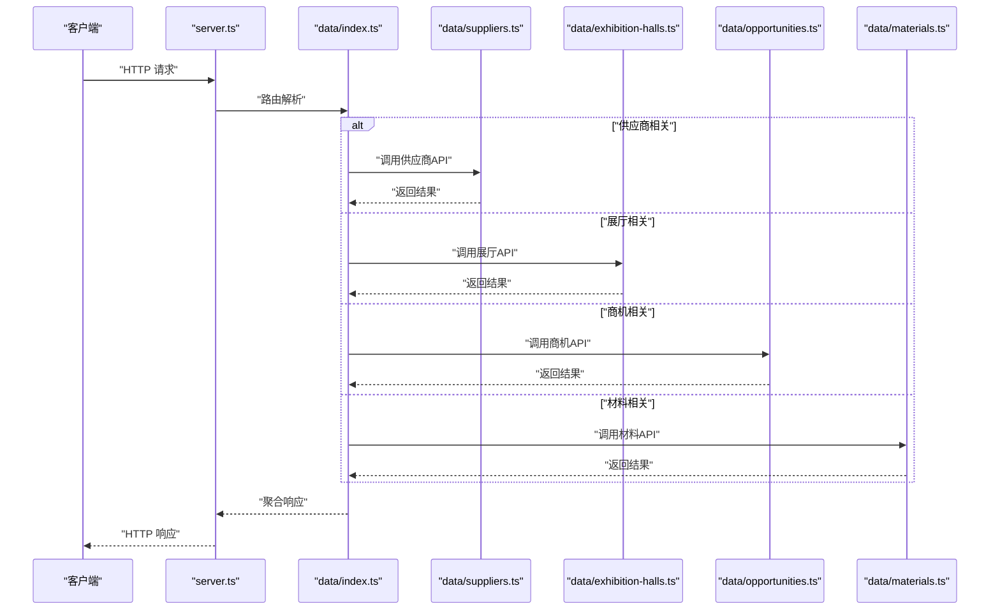
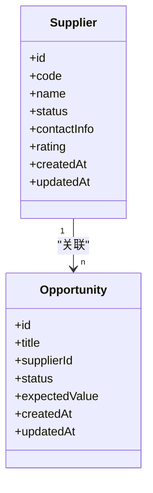
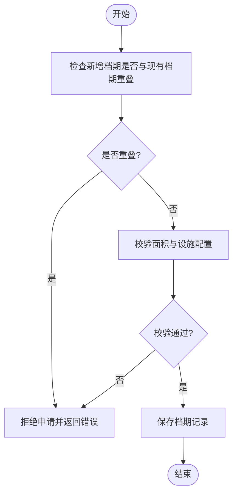
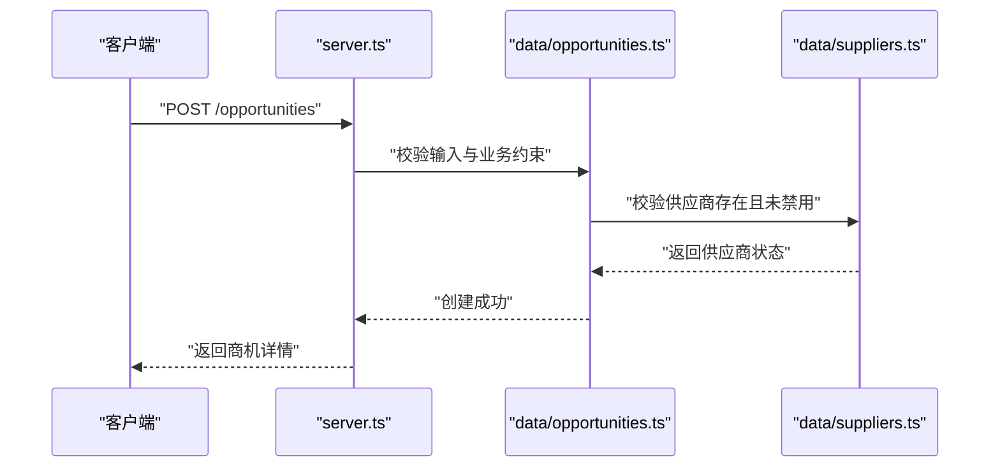
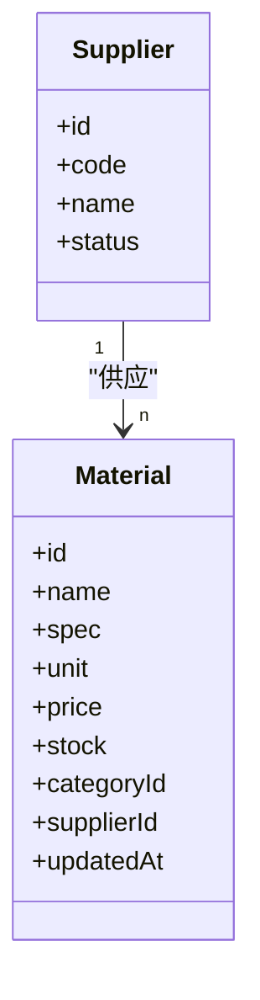
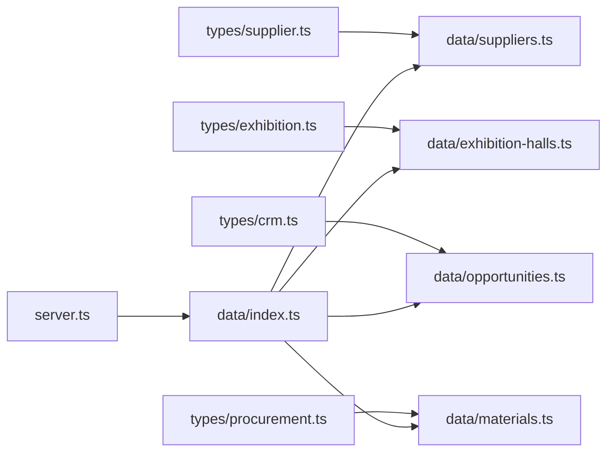

# 数据管理

<cite>
**本文引用的文件**   
- [src/data/index.ts](file://src/data/index.ts)
- [src/data/suppliers.ts](file://src/data/suppliers.ts)
- [src/data/exhibition-halls.ts](file://src/data/exhibition-halls.ts)
- [src/data/opportunities.ts](file://src/data/opportunities.ts)
- [src/data/materials.ts](file://src/data/materials.ts)
- [src/types/crm.ts](file://src/types/crm.ts)
- [src/types/exhibition.ts](file://src/types/exhibition.ts)
- [src/types/procurement.ts](file://src/types/procurement.ts)
- [src/types/supplier.ts](file://src/types/supplier.ts)
- [server.ts](file://server.ts)
</cite>

## 目录
1. [简介](#简介)
2. [项目结构](#项目结构)
3. [核心组件](#核心组件)
4. [架构总览](#架构总览)
5. [详细组件分析](#详细组件分析)
6. [依赖分析](#依赖分析)
7. [性能考虑](#性能考虑)
8. [故障排查指南](#故障排查指南)
9. [结论](#结论)
10. [附录](#附录)

## 简介
本技术文档围绕 Supply OS 的数据管理系统，聚焦于数据模型设计、数据结构定义与数据访问模式。重点覆盖供应商管理、展厅信息、商业机会、材料管理等核心数据的组织方式与业务逻辑，提供数据 CRUD 的 API 参考与使用示例说明，并阐述数据验证规则、业务约束与完整性检查策略。同时给出数据缓存策略、性能优化建议与同步机制，以及扩展新数据类型与管理模块的方法，最后总结数据迁移与版本管理的最佳实践。

## 项目结构
仓库采用“类型定义 + 领域数据”的分层组织方式：
- types 目录集中定义各领域的 TypeScript 类型与接口，作为全系统共享的数据契约。
- data 目录按领域划分数据模块（供应商、展厅、商机、材料等），对外暴露统一的索引入口。
- server.ts 为服务端入口，承载 HTTP 路由与中间件，负责将请求映射到具体数据模块的处理函数。

图表来源
- [src/data/index.ts](file://src/data/index.ts)
- [src/data/suppliers.ts](file://src/data/suppliers.ts)
- [src/data/exhibition-halls.ts](file://src/data/exhibition-halls.ts)
- [src/data/opportunities.ts](file://src/data/opportunities.ts)
- [src/data/materials.ts](file://src/data/materials.ts)
- [src/types/crm.ts](file://src/types/crm.ts)
- [src/types/exhibition.ts](file://src/types/exhibition.ts)
- [src/types/procurement.ts](file://src/types/procurement.ts)
- [src/types/supplier.ts](file://src/types/supplier.ts)
- [server.ts](file://server.ts)

章节来源
- [src/data/index.ts](file://src/data/index.ts)
- [src/data/suppliers.ts](file://src/data/suppliers.ts)
- [src/data/exhibition-halls.ts](file://src/data/exhibition-halls.ts)
- [src/data/opportunities.ts](file://src/data/opportunities.ts)
- [src/data/materials.ts](file://src/data/materials.ts)
- [src/types/crm.ts](file://src/types/crm.ts)
- [src/types/exhibition.ts](file://src/types/exhibition.ts)
- [src/types/procurement.ts](file://src/types/procurement.ts)
- [src/types/supplier.ts](file://src/types/supplier.ts)
- [server.ts](file://server.ts)

## 核心组件
本节概述数据系统的核心组件及其职责：
- 类型定义层（types）：统一描述实体字段、枚举、关系与校验规则，确保前后端一致。
- 领域数据层（data）：封装各实体的增删改查、查询过滤、分页与排序等能力，并提供聚合视图。
- 服务端（server.ts）：提供 RESTful 接口，将客户端请求路由至对应数据模块处理，返回标准化响应。

章节来源
- [src/types/crm.ts](file://src/types/crm.ts)
- [src/types/exhibition.ts](file://src/types/exhibition.ts)
- [src/types/procurement.ts](file://src/types/procurement.ts)
- [src/types/supplier.ts](file://src/types/supplier.ts)
- [src/data/index.ts](file://src/data/index.ts)
- [src/data/suppliers.ts](file://src/data/suppliers.ts)
- [src/data/exhibition-halls.ts](file://src/data/exhibition-halls.ts)
- [src/data/opportunities.ts](file://src/data/opportunities.ts)
- [src/data/materials.ts](file://src/data/materials.ts)
- [server.ts](file://server.ts)

## 架构总览
整体数据流遵循“客户端 -> 服务端 -> 领域数据 -> 类型契约”的路径。服务端通过路由分发到具体数据模块，数据模块基于类型定义进行参数校验、业务约束检查与持久化操作，最终返回结构化响应。

图表来源
- [server.ts](file://server.ts)
- [src/data/index.ts](file://src/data/index.ts)
- [src/data/suppliers.ts](file://src/data/suppliers.ts)
- [src/data/exhibition-halls.ts](file://src/data/exhibition-halls.ts)
- [src/data/opportunities.ts](file://src/data/opportunities.ts)
- [src/data/materials.ts](file://src/data/materials.ts)

## 详细组件分析

### 供应商管理（Suppliers）
- 数据模型与关系
  - 供应商实体包含基础信息、资质、评级、状态、联系人等字段，并通过类型定义明确必填项与取值范围。
  - 与商机存在一对多关系：一个供应商可关联多个商机；商机记录供应商标识以建立外键语义。
- 数据结构定义
  - 在类型文件中定义供应商主类型及关联子类型，确保字段命名与业务语义一致。
- 数据访问模式
  - 提供列表查询（支持筛选、分页、排序）、详情获取、新增、更新、删除等操作。
  - 对关键字段（如统一社会信用代码、邮箱、电话）执行格式校验；对状态变更执行状态机约束。
- 业务约束与完整性检查
  - 唯一性约束：供应商编码或信用代码全局唯一。
  - 状态约束：禁用状态下不允许创建新的商机。
  - 关联约束：删除供应商前需检查是否存在活跃商机或合同。
- 缓存策略
  - 热点供应商列表采用内存缓存，设置过期时间与失效策略（如更新后失效）。
- 性能优化
  - 列表查询默认分页，避免一次性加载大量数据。
  - 常用筛选条件建立索引（若接入数据库）。
- 扩展点
  - 新增供应商属性时，优先在类型定义中扩展，并在数据模块中补充校验与转换逻辑。

章节来源
- [src/types/supplier.ts](file://src/types/supplier.ts)
- [src/data/suppliers.ts](file://src/data/suppliers.ts)
- [src/types/crm.ts](file://src/types/crm.ts)

#### 类图（概念映射）

图表来源
- [src/types/supplier.ts](file://src/types/supplier.ts)
- [src/types/crm.ts](file://src/types/crm.ts)

### 展厅信息（Exhibition Halls）
- 数据模型与关系
  - 展厅实体包含名称、地址、面积、设施、可用档期、状态等字段。
  - 与商机可能存在间接关联（例如商机涉及线下展示活动）。
- 数据结构定义
  - 在类型文件中定义展厅主类型与设施清单类型，确保枚举值与业务字典一致。
- 数据访问模式
  - 提供展厅列表（按城市、面积、可用性筛选）、详情、新增、更新、下架/启用等操作。
- 业务约束与完整性检查
  - 面积必须为正数；可用档期不可重叠；状态切换需符合业务规则。
- 缓存策略
  - 展厅列表与详情采用短时效缓存，减少重复查询。
- 性能优化
  - 针对常用筛选维度建立复合索引；大图资源走 CDN。
- 扩展点
  - 新增设施类型或标签时，在类型定义中扩展，并在数据模块中增加校验与映射。

章节来源
- [src/types/exhibition.ts](file://src/types/exhibition.ts)
- [src/data/exhibition-halls.ts](file://src/data/exhibition-halls.ts)

#### 流程图（可用档期校验）

图表来源
- [src/data/exhibition-halls.ts](file://src/data/exhibition-halls.ts)
- [src/types/exhibition.ts](file://src/types/exhibition.ts)

### 商业机会（Opportunities）
- 数据模型与关系
  - 商机实体包含标题、描述、供应商ID、阶段、预期金额、优先级、时间戳等字段。
  - 与供应商为一对多关系；可能与其他实体（如材料需求）产生间接关联。
- 数据结构定义
  - 在 CRM 类型文件中定义商机主类型、阶段枚举、优先级枚举等。
- 数据访问模式
  - 提供列表（按供应商、阶段、金额区间、时间范围筛选）、详情、新增、更新、关闭/取消等操作。
- 业务约束与完整性检查
  - 金额必须为非负数；阶段流转需遵循状态机（如从“初步接触”到“方案报价”再到“成交/流失”）。
  - 删除商机前需检查是否存在已生成的报价或合同。
- 缓存策略
  - 高频统计指标（如按供应商的商机数量）采用异步刷新缓存。
- 性能优化
  - 列表查询支持多维筛选与分页；对常用筛选字段建立索引。
- 扩展点
  - 新增商机阶段或自定义字段时，在类型定义中扩展，并在数据模块中补充校验与转换。

章节来源
- [src/types/crm.ts](file://src/types/crm.ts)
- [src/data/opportunities.ts](file://src/data/opportunities.ts)
- [src/types/supplier.ts](file://src/types/supplier.ts)

#### 序列图（商机创建流程）

图表来源
- [server.ts](file://server.ts)
- [src/data/opportunities.ts](file://src/data/opportunities.ts)
- [src/data/suppliers.ts](file://src/data/suppliers.ts)

### 材料管理（Materials）
- 数据模型与关系
  - 材料实体包含名称、规格、单位、单价、库存、分类、供应商ID、更新时间等字段。
  - 与供应商存在多对一关系；与采购通知或订单存在潜在关联。
- 数据结构定义
  - 在采购类型文件中定义材料主类型、分类枚举、计量单位等。
- 数据访问模式
  - 提供材料列表（按分类、供应商、价格区间筛选）、详情、新增、更新、库存调整、停用等操作。
- 业务约束与完整性检查
  - 单价与库存必须为非负数；分类需在字典中存在；停用前需检查是否有未结清的采购单。
- 缓存策略
  - 材料目录与价格快照采用定时缓存，避免频繁读取。
- 性能优化
  - 批量导入材料时使用事务与分批写入；对常用筛选字段建立索引。
- 扩展点
  - 新增分类或单位时，在类型定义中扩展，并在数据模块中增加校验与映射。

章节来源
- [src/types/procurement.ts](file://src/types/procurement.ts)
- [src/data/materials.ts](file://src/data/materials.ts)
- [src/types/supplier.ts](file://src/types/supplier.ts)

#### 类图（材料-供应商关系）

图表来源
- [src/types/procurement.ts](file://src/types/procurement.ts)
- [src/types/supplier.ts](file://src/types/supplier.ts)

### 数据索引与聚合入口（data/index.ts）
- 职责
  - 汇总各领域数据模块，提供统一的导出与路由映射，便于服务端与前端按需引入。
- 设计要点
  - 模块化导出，避免循环依赖。
  - 提供聚合查询与跨域联动的辅助方法（如按供应商聚合商机数量）。

章节来源
- [src/data/index.ts](file://src/data/index.ts)

## 依赖分析
- 耦合与内聚
  - 类型定义与各数据模块强耦合，保证契约一致性；数据模块之间尽量低耦合，通过类型与接口交互。
- 外部依赖
  - 服务端依赖 HTTP 框架与中间件；数据模块可能依赖存储层（文件系统、数据库或内存）。
- 循环依赖风险
  - 通过索引入口与类型解耦，降低循环引用概率。

图表来源
- [src/types/crm.ts](file://src/types/crm.ts)
- [src/types/supplier.ts](file://src/types/supplier.ts)
- [src/types/exhibition.ts](file://src/types/exhibition.ts)
- [src/types/procurement.ts](file://src/types/procurement.ts)
- [src/data/index.ts](file://src/data/index.ts)
- [src/data/suppliers.ts](file://src/data/suppliers.ts)
- [src/data/exhibition-halls.ts](file://src/data/exhibition-halls.ts)
- [src/data/opportunities.ts](file://src/data/opportunities.ts)
- [src/data/materials.ts](file://src/data/materials.ts)
- [server.ts](file://server.ts)

章节来源
- [src/data/index.ts](file://src/data/index.ts)
- [server.ts](file://server.ts)

## 性能考虑
- 分页与限流
  - 列表接口默认分页，限制每页最大条数；对高频接口实施限流。
- 缓存策略
  - 热点数据采用内存缓存，设置合理 TTL；写操作触发缓存失效。
- 索引与查询优化
  - 针对常用筛选字段建立索引；避免 N+1 查询，使用批量加载。
- 异步与批处理
  - 大数据量导入采用异步任务与批处理，提升吞吐与稳定性。
- 资源压缩与传输优化
  - 启用 Gzip/Brotli；图片与静态资源走 CDN。

[本节为通用指导，不直接分析具体文件]

## 故障排查指南
- 常见错误与定位
  - 参数校验失败：检查请求体是否符合类型定义中的必填与格式要求。
  - 业务约束冲突：如状态机非法流转、唯一性冲突、关联完整性破坏。
  - 缓存不一致：确认写操作是否触发缓存失效；必要时手动清理缓存。
- 日志与追踪
  - 在服务端关键路径添加结构化日志，记录请求 ID、入参摘要与异常堆栈。
- 回滚与恢复
  - 对批量写操作使用事务；失败时自动回滚，保证数据一致性。

章节来源
- [server.ts](file://server.ts)
- [src/data/index.ts](file://src/data/index.ts)

## 结论
Supply OS 数据管理系统通过清晰的类型契约与领域数据分层，实现了高内聚、低耦合的数据管理能力。供应商、展厅、商机、材料等核心模块均具备完善的 CRUD 能力、校验与约束、缓存与性能优化策略。建议在后续迭代中持续完善索引与监控，逐步引入更严格的幂等与审计机制，以提升系统的可靠性与可观测性。

[本节为总结，不直接分析具体文件]

## 附录

### 数据 CRU D API 参考与使用示例
- 供应商
  - 列表：GET /suppliers?keyword=&status=&page=&size=
  - 详情：GET /suppliers/:id
  - 新增：POST /suppliers
  - 更新：PUT /suppliers/:id
  - 删除：DELETE /suppliers/:id
- 展厅
  - 列表：GET /exhibitions?city=&areaMin=&availableFrom=&availableTo=&page=&size=
  - 详情：GET /exhibitions/:id
  - 新增：POST /exhibitions
  - 更新：PUT /exhibitions/:id
  - 下架/启用：PATCH /exhibitions/:id/status
- 商机
  - 列表：GET /opportunities?supplierId=&stage=&amountMin=&amountMax=&page=&size=
  - 详情：GET /opportunities/:id
  - 新增：POST /opportunities
  - 更新：PUT /opportunities/:id
  - 关闭/取消：PATCH /opportunities/:id/close
- 材料
  - 列表：GET /materials?category=&supplierId=&priceMin=&priceMax=&page=&size=
  - 详情：GET /materials/:id
  - 新增：POST /materials
  - 更新：PUT /materials/:id
  - 库存调整：PATCH /materials/:id/stock

使用示例（文本描述）
- 创建供应商：发送 JSON 请求体，包含必填字段（如编码、名称、状态），服务端校验通过后返回新建的供应商详情。
- 查询展厅：传入城市与可用档期范围，服务端返回符合条件的展厅列表与分页信息。
- 更新商机阶段：仅允许合法的状态流转，否则返回错误提示。
- 调整材料库存：提交增量值，服务端校验非负并更新库存时间戳。

章节来源
- [server.ts](file://server.ts)
- [src/data/suppliers.ts](file://src/data/suppliers.ts)
- [src/data/exhibition-halls.ts](file://src/data/exhibition-halls.ts)
- [src/data/opportunities.ts](file://src/data/opportunities.ts)
- [src/data/materials.ts](file://src/data/materials.ts)

### 数据验证规则、业务约束与完整性检查
- 通用规则
  - 必填字段校验、格式校验（邮箱、电话、统一社会信用代码）、数值范围校验。
- 业务约束
  - 状态机约束（供应商禁用则禁止创建商机；商机阶段只能向前流转）。
  - 唯一性约束（供应商编码、材料编码）。
  - 关联完整性（删除供应商前检查活跃商机与合同；停用材料前检查未结清采购单）。
- 完整性检查
  - 外键语义由类型与业务逻辑共同保障；在写操作前进行前置检查，失败时返回明确错误码与消息。

章节来源
- [src/types/supplier.ts](file://src/types/supplier.ts)
- [src/types/crm.ts](file://src/types/crm.ts)
- [src/types/exhibition.ts](file://src/types/exhibition.ts)
- [src/types/procurement.ts](file://src/types/procurement.ts)
- [src/data/suppliers.ts](file://src/data/suppliers.ts)
- [src/data/opportunities.ts](file://src/data/opportunities.ts)
- [src/data/exhibition-halls.ts](file://src/data/exhibition-halls.ts)
- [src/data/materials.ts](file://src/data/materials.ts)

### 数据缓存策略、性能优化与同步机制
- 缓存策略
  - 热点列表与详情采用内存缓存，TTL 根据数据变化频率设定；写操作触发失效。
- 性能优化
  - 分页与限流；批量导入与事务；索引优化；N+1 查询消除。
- 同步机制
  - 跨模块联动更新（如供应商状态变更影响商机创建）采用事件驱动或回调；必要时引入消息队列实现异步同步。

章节来源
- [src/data/index.ts](file://src/data/index.ts)
- [server.ts](file://server.ts)

### 扩展新数据类型与管理模块的最佳实践
- 新增类型
  - 在 types 目录下新增类型文件，定义实体字段、枚举与关系。
- 新增数据模块
  - 在 data 目录下新增模块，实现 CRUD 与校验逻辑，并在 index.ts 中导出。
- 注册路由
  - 在 server.ts 中新增路由映射，将请求分发到新模块。
- 测试与文档
  - 编写单元测试与集成测试；更新 API 文档与使用示例。

章节来源
- [src/data/index.ts](file://src/data/index.ts)
- [server.ts](file://server.ts)

### 数据迁移与版本管理最佳实践
- 版本控制
  - 为数据模型与接口定义维护版本号；向后兼容变更优先。
- 迁移脚本
  - 提供向上与向下迁移脚本，确保生产环境安全升级。
- 灰度与回滚
  - 灰度发布与快速回滚策略；迁移失败自动回滚。
- 数据校验与审计
  - 迁移前后进行数据一致性校验；保留审计日志以便追溯。

[本节为通用指导，不直接分析具体文件]