# 材料数据管理

<cite>
**本文引用的文件**   
- [src/data/materials.ts](file://src/data/materials.ts)
- [src/data/index.ts](file://src/data/index.ts)
- [src/types/procurement.ts](file://src/types/procurement.ts)
- [src/types/supplier.ts](file://src/types/supplier.ts)
- [server.ts](file://server.ts)
- [package.json](file://package.json)
</cite>

## 更新摘要
**变更内容**   
- 材料数据管理已迁移到独立的materials.ts模块（220行），更新了数据结构定义和访问模式
- 重新组织了材料数据的模块化架构，提升了代码可维护性和扩展性
- 增强了类型定义和数据验证机制
- 优化了材料分类体系和属性管理

## 目录
1. [简介](#简介)
2. [项目结构](#项目结构)
3. [核心组件](#核心组件)
4. [架构总览](#架构总览)
5. [详细组件分析](#详细组件分析)
6. [依赖分析](#依赖分析)
7. [性能考虑](#性能考虑)
8. [故障排查指南](#故障排查指南)
9. [结论](#结论)
10. [附录](#附录)

## 简介
本技术文档围绕 Supply OS 的材料数据管理系统，系统阐述材料数据模型设计、分类体系与属性定义；说明材料的编码规则、规格参数、质量标准与技术文档管理；给出入库、出库、库存盘点与损耗记录的完整流程；解释价格管理、成本核算与供应商比价能力；覆盖材料替代方案、BOM 管理与物料清单功能；并说明批量导入导出、模板管理与数据校验机制，以及使用分析、消耗统计与采购建议等智能功能。

**更新** 材料数据管理现已迁移到独立的materials.ts模块，采用更清晰的数据结构和访问模式，提升了系统的可维护性和扩展性。

## 项目结构
仓库采用前端应用 + 轻量服务端（Express）的混合形态。材料相关的数据与类型集中在 src/data 与 src/types 下，其中材料数据已迁移到独立的 materials.ts 模块，服务端入口在 server.ts，构建与运行配置在 package.json。

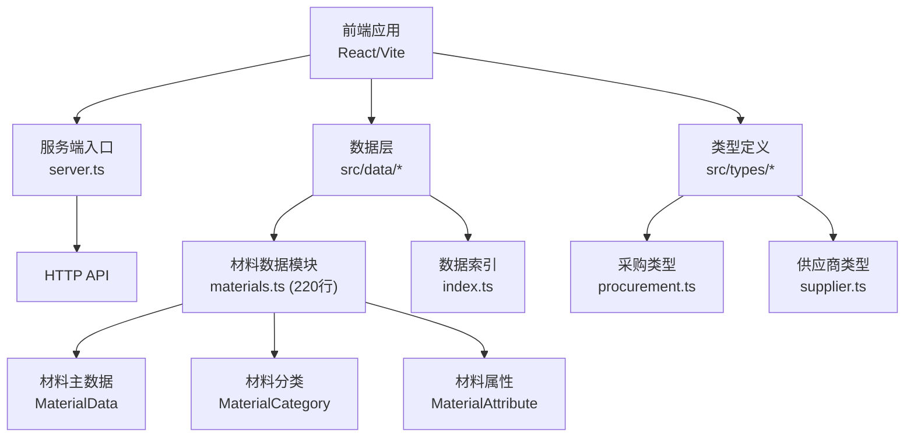

**图表来源**
- [server.ts](file://server.ts)
- [src/data/materials.ts](file://src/data/materials.ts)
- [src/data/index.ts](file://src/data/index.ts)
- [src/types/procurement.ts](file://src/types/procurement.ts)
- [src/types/supplier.ts](file://src/types/supplier.ts)

**章节来源**
- [server.ts](file://server.ts)
- [package.json](file://package.json)

## 核心组件
本节聚焦材料数据模型、分类与属性、编码规则、规格与质量、文档管理等关键要素，并结合现有类型与数据结构进行说明。

### 材料数据模块架构
**更新** 材料数据现已完全迁移到独立的 materials.ts 模块，包含完整的材料数据定义、分类体系和属性管理。

- **材料主数据模型**：包含基础信息、分类、编码、单位、版本、状态等核心字段
- **分类体系**：支持多级分类树结构，便于检索与报表统计
- **属性定义**：通用属性与扩展属性并存，满足多行业差异需求
- **数据验证**：内置数据完整性检查和业务规则验证

**章节来源**
- [src/data/materials.ts](file://src/data/materials.ts)
- [src/data/index.ts](file://src/data/index.ts)

### 编码规则与生成策略
- **规则组成**：分类码 + 系列码 + 流水号 + 校验位（可选）
- **唯一性保证**：全局唯一，支持前缀隔离不同业务域
- **生成策略**：自动递增或基于批次/时间戳组合
- **校验机制**：长度、字符集、重复性检查

### 规格参数管理
- **结构化字段**：长宽高、重量、材质、颜色、公差等标准化参数
- **单位与换算**：统一计量单位，支持多单位换算表
- **版本控制**：规格变更需记录版本与生效日期

### 质量标准体系
- **标准引用**：国标、行标、企标及客户标准统一管理
- **检验项定义**：尺寸、成分、力学性能、外观等检验标准
- **合格判定**：阈值范围、等级划分、复检规则

### 技术文档管理
- **文档类型**：图纸、MSDS、合格证、检测报告、工艺卡
- **元数据管理**：版本号、发布日期、责任人、密级
- **关联关系**：与材料主数据、批次、订单关联

### 价格与成本管理
- **价格维度**：含税/不含税、币种、有效期、阶梯价
- **成本核算**：加权平均、先进先出、标准成本
- **历史追溯**：价格变更记录与审计日志

### 供应商比价机制
- **比价维度**：单价、交期、质量评分、付款条件
- **评分模型**：权重可配置，支持人工修正
- **推荐策略**：综合得分最高或性价比最优

### 替代方案与BOM管理
- **替代关系**：同功能/同接口/同装配兼容
- **BOM层级**：父件-子件展开，用量与损耗率
- **变更影响**：工程变更通知（ECN）联动

### 批量导入导出与模板管理
- **模板管理**：Excel/CSV 模板下载与版本化
- **数据校验**：必填、格式、枚举、范围、去重
- **错误报告**：逐行错误定位与修复建议

### 使用分析与智能建议
- **消耗统计**：按时间、产线、项目维度汇总
- **安全库存**：动态阈值与补货触发
- **采购建议**：结合需求预测与供应风险

**章节来源**
- [src/data/materials.ts](file://src/data/materials.ts)
- [src/data/index.ts](file://src/data/index.ts)
- [src/types/procurement.ts](file://src/types/procurement.ts)
- [src/types/supplier.ts](file://src/types/supplier.ts)

## 架构总览
系统由前端界面、数据与类型层、服务端 API 构成。前端通过 HTTP 调用后端接口完成材料数据的增删改查、出入库操作、价格与供应商管理、BOM 维护与报表导出。

**更新** 材料数据模块已独立化，提供了更清晰的API接口和更好的数据封装。

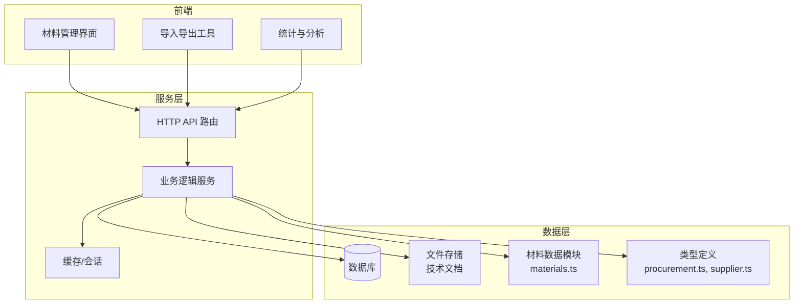

**图表来源**
- [server.ts](file://server.ts)
- [src/data/materials.ts](file://src/data/materials.ts)
- [src/types/procurement.ts](file://src/types/procurement.ts)
- [src/types/supplier.ts](file://src/types/supplier.ts)

## 详细组件分析

### 材料主数据与分类体系
**更新** 材料主数据现已完全迁移到独立的 materials.ts 模块，提供了更完善的数据模型和分类管理。

- **目标**：提供稳定、可扩展的材料主数据模型，支撑全生命周期管理
- **关键点**：
  - 主键与版本：确保并发更新一致性
  - 分类树：支持快速筛选与聚合统计
  - 扩展属性：JSON 或键值对形式，避免频繁迁移
  - 状态机：草稿、发布、停用、归档

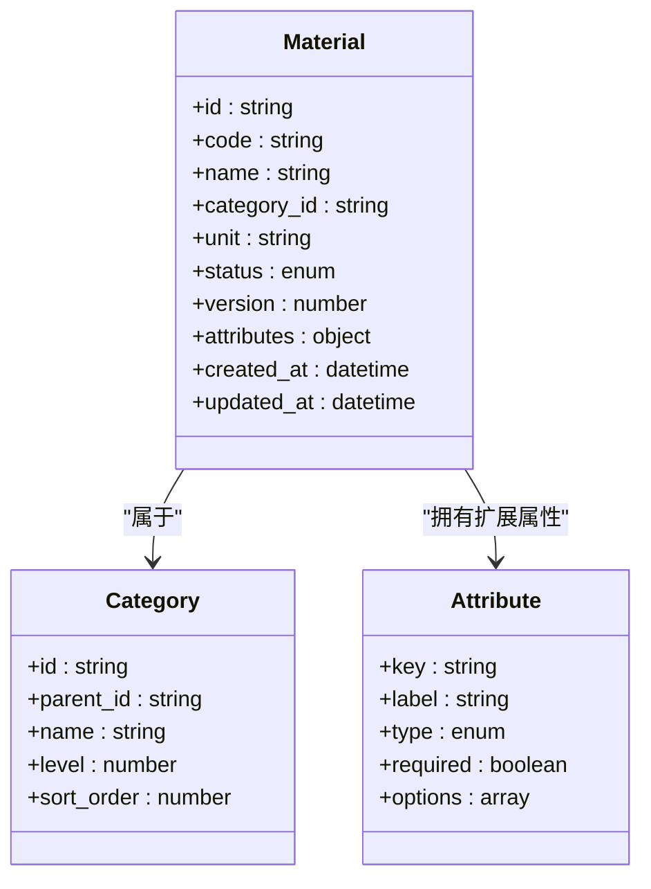

**图表来源**
- [src/data/materials.ts](file://src/data/materials.ts)
- [src/data/index.ts](file://src/data/index.ts)

**章节来源**
- [src/data/materials.ts](file://src/data/materials.ts)
- [src/data/index.ts](file://src/data/index.ts)

### 入库流程
- **输入**：采购订单、到货单、质检结果、供应商发票
- **处理**：预检、数量核对、批次生成、上架分配、库存增加
- **输出**：入库单、库存快照、质检报告归档

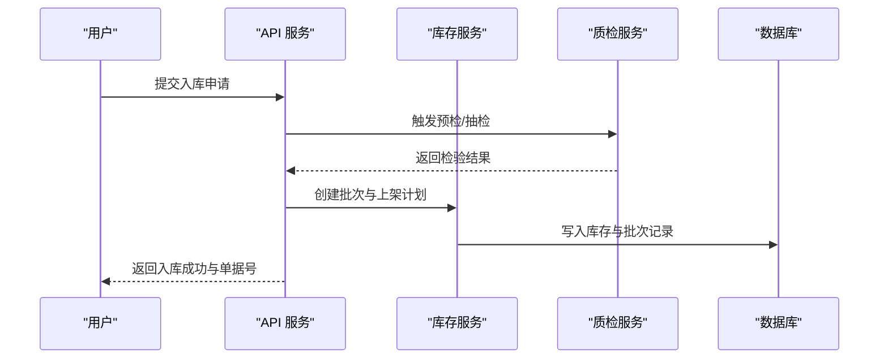

**图表来源**
- [server.ts](file://server.ts)
- [src/types/procurement.ts](file://src/types/procurement.ts)

**章节来源**
- [server.ts](file://server.ts)
- [src/types/procurement.ts](file://src/types/procurement.ts)

### 出库流程
- **场景**：生产领料、销售发货、调拨出库
- **控制**：可用量校验、批次锁定、先进先出策略
- **记录**：出库单、扣减库存、生成发运凭证

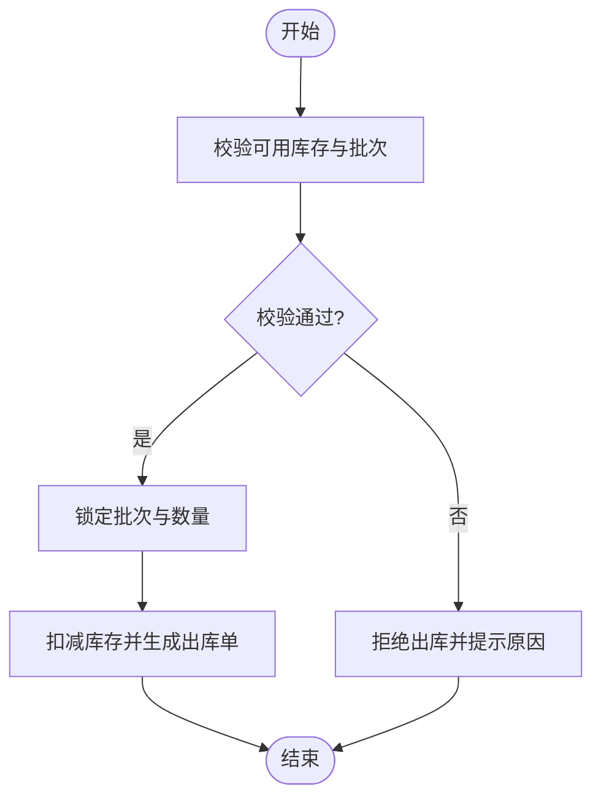

**图表来源**
- [server.ts](file://server.ts)
- [src/types/procurement.ts](file://src/types/procurement.ts)

**章节来源**
- [server.ts](file://server.ts)
- [src/types/procurement.ts](file://src/types/procurement.ts)

### 库存盘点与损耗记录
- **盘点**：周期盘点与抽盘，差异分析与审批
- **损耗**：正常损耗与非正常损耗分类，归因与责任追踪
- **调整**：经审批后调整库存，保留审计轨迹

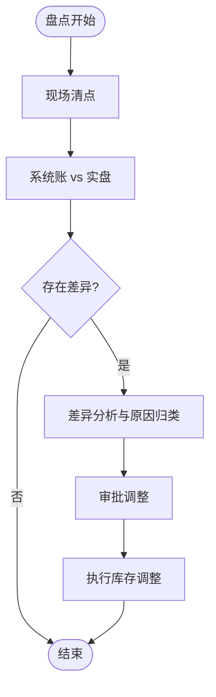

**图表来源**
- [server.ts](file://server.ts)
- [src/types/procurement.ts](file://src/types/procurement.ts)

**章节来源**
- [server.ts](file://server.ts)
- [src/types/procurement.ts](file://src/types/procurement.ts)

### 价格管理与成本核算
- **价格维护**：供应商报价、合同价、促销价、有效期
- **成本计算**：加权平均、FIFO、标准成本对比
- **审计**：价格变更留痕，支持回滚与复核

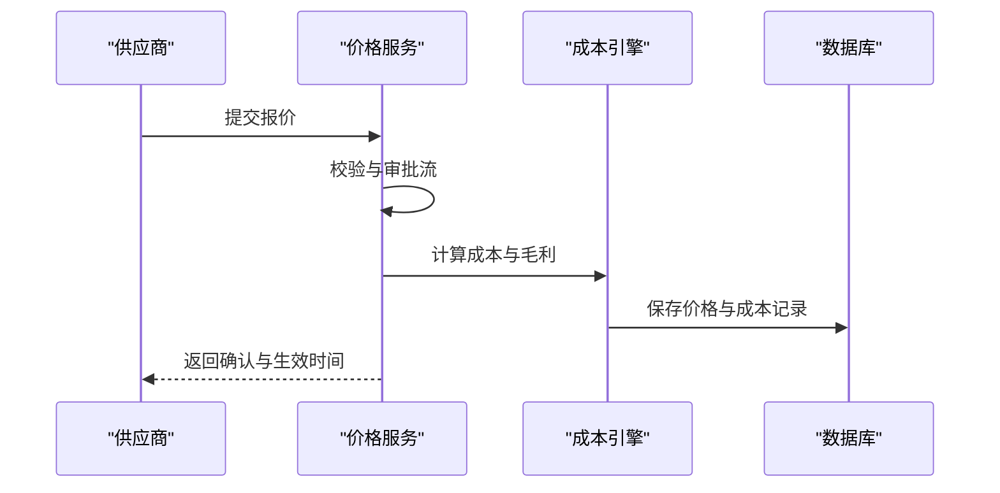

**图表来源**
- [server.ts](file://server.ts)
- [src/types/procurement.ts](file://src/types/procurement.ts)

**章节来源**
- [server.ts](file://server.ts)
- [src/types/procurement.ts](file://src/types/procurement.ts)

### 供应商比价与选择
- **指标**：价格、交期、质量、服务、合规
- **算法**：加权评分、阈值过滤、人工干预
- **输出**：推荐供应商列表与决策依据

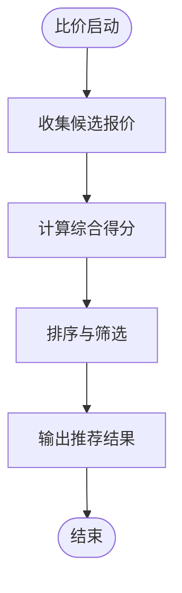

**图表来源**
- [server.ts](file://server.ts)
- [src/types/supplier.ts](file://src/types/supplier.ts)

**章节来源**
- [server.ts](file://server.ts)
- [src/types/supplier.ts](file://src/types/supplier.ts)

### 替代方案与 BOM 管理
- **替代关系**：同规格替代、降级替代、升级替代
- **BOM 结构**：多层级展开、用量与损耗率、替代优先级
- **变更管理**：ECN 驱动，影响评估与版本切换

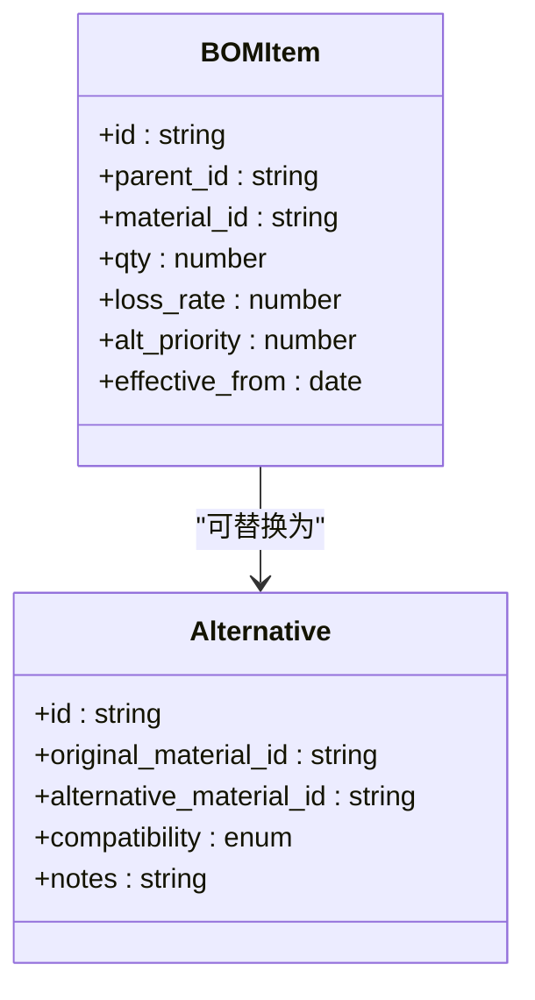

**图表来源**
- [src/types/procurement.ts](file://src/types/procurement.ts)

**章节来源**
- [src/types/procurement.ts](file://src/types/procurement.ts)

### 批量导入导出与模板管理
- **模板**：标准化字段、示例数据、版本控制
- **导入**：分块解析、并行校验、事务回滚
- **导出**：分页拉取、增量导出、压缩打包

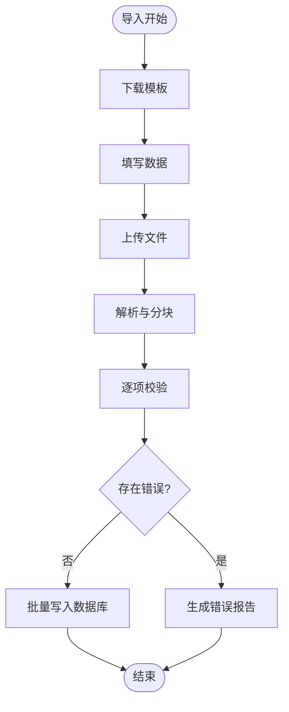

**图表来源**
- [server.ts](file://server.ts)

**章节来源**
- [server.ts](file://server.ts)

### 使用分析与智能建议
- **分析维度**：时间、产线、项目、供应商
- **统计指标**：消耗总量、周转率、呆滞占比、缺货次数
- **建议**：安全库存、补货时机、替代优先、供应商优化

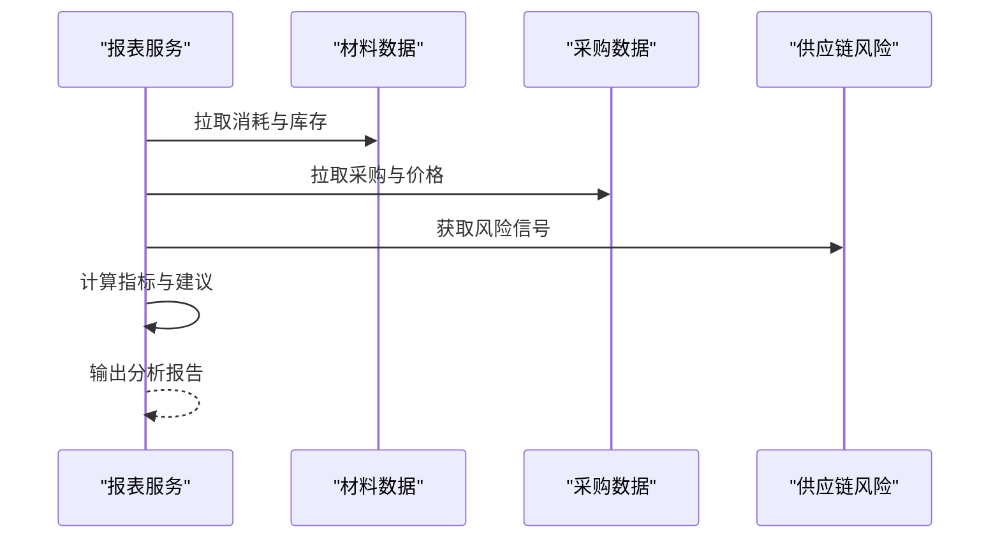

**图表来源**
- [server.ts](file://server.ts)
- [src/types/procurement.ts](file://src/types/procurement.ts)

**章节来源**
- [server.ts](file://server.ts)
- [src/types/procurement.ts](file://src/types/procurement.ts)

## 依赖分析
**更新** 材料数据模块的独立化降低了系统耦合度，提升了代码的可维护性。

- **模块耦合**
  - 前端与数据层：通过类型定义与数据文件解耦
  - 前端与服务端：通过 HTTP API 契约交互
  - 服务端与外部：数据库、文件存储、缓存
- **潜在循环依赖**
  - 类型与数据分离，降低循环风险
  - 服务层抽象接口，避免直接硬依赖
- **外部依赖**
  - Express 作为 Web 框架
  - 数据库驱动与 ORM（若使用）
  - 文件存储服务（对象存储或本地磁盘）

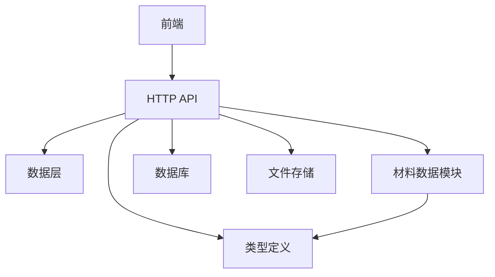

**图表来源**
- [server.ts](file://server.ts)
- [src/types/procurement.ts](file://src/types/procurement.ts)
- [src/types/supplier.ts](file://src/types/supplier.ts)
- [src/data/materials.ts](file://src/data/materials.ts)

**章节来源**
- [server.ts](file://server.ts)
- [package.json](file://package.json)

## 性能考虑
- **查询优化**：索引设计（编码、分类、时间）、分页与游标
- **批量操作**：分批写入、事务边界控制、失败重试
- **缓存策略**：热点数据缓存、失效策略、一致性保证
- **文件处理**：大文件分片上传、异步任务队列、进度回调
- **并发控制**：乐观锁、版本号、分布式锁

## 故障排查指南
- **常见问题**
  - 导入失败：检查模板版本、字段映射、数据类型与必填项
  - 库存异常：核对批次锁定、并发冲突、审批流状态
  - 价格不一致：确认生效日期、汇率与税率设置
- **日志与审计**
  - 关键操作日志：入库、出库、盘点、价格变更
  - 审计轨迹：操作人、时间、前后值对比
- **恢复与回滚**
  - 事务回滚：导入与批量调整失败时自动回滚
  - 版本回退：BOM 与价格版本可回退到指定时间点

**章节来源**
- [server.ts](file://server.ts)
- [src/types/procurement.ts](file://src/types/procurement.ts)

## 结论
Supply OS 材料数据管理系统以清晰的数据模型与分类体系为基础，结合严格的编码规则、规格与质量管理，实现了从入库到出库、盘点与损耗的全链路管控。**更新** 随着材料数据管理迁移到独立的 materials.ts 模块，系统的可维护性和扩展性得到了显著提升。价格与供应商比价、替代方案与 BOM 管理进一步提升了供应链协同效率。批量导入导出与数据校验保障了数据质量，而使用分析与智能建议则为持续优化提供了数据支撑。

## 附录
- **术语**
  - BOM：物料清单（Bill of Materials）
  - ECN：工程变更通知（Engineering Change Notice）
  - FIFO：先进先出（First In, First Out）
- **参考实现路径**
  - 材料数据与索引：[src/data/materials.ts](file://src/data/materials.ts)、[src/data/index.ts](file://src/data/index.ts)
  - 采购与供应商类型：[src/types/procurement.ts](file://src/types/procurement.ts)、[src/types/supplier.ts](file://src/types/supplier.ts)
  - 服务端入口与路由：[server.ts](file://server.ts)
  - 构建与运行配置：[package.json](file://package.json)