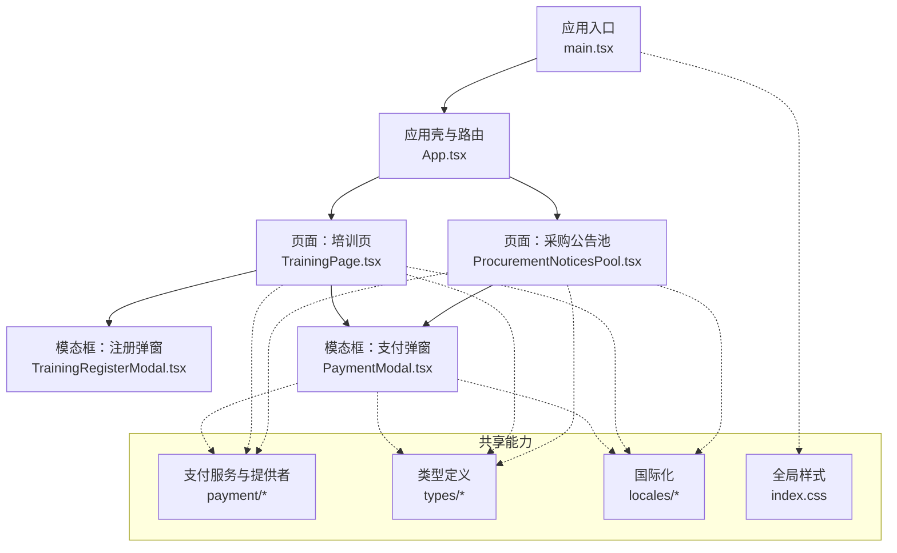
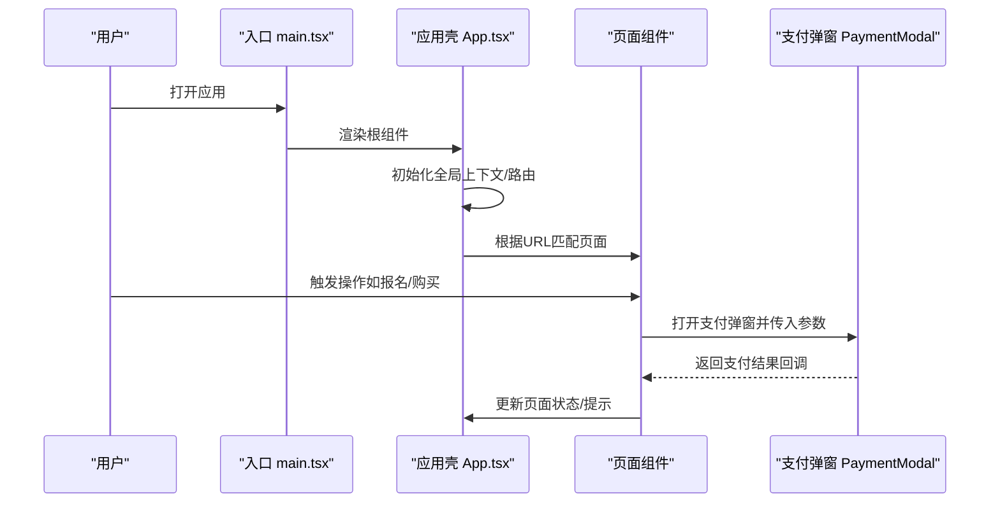
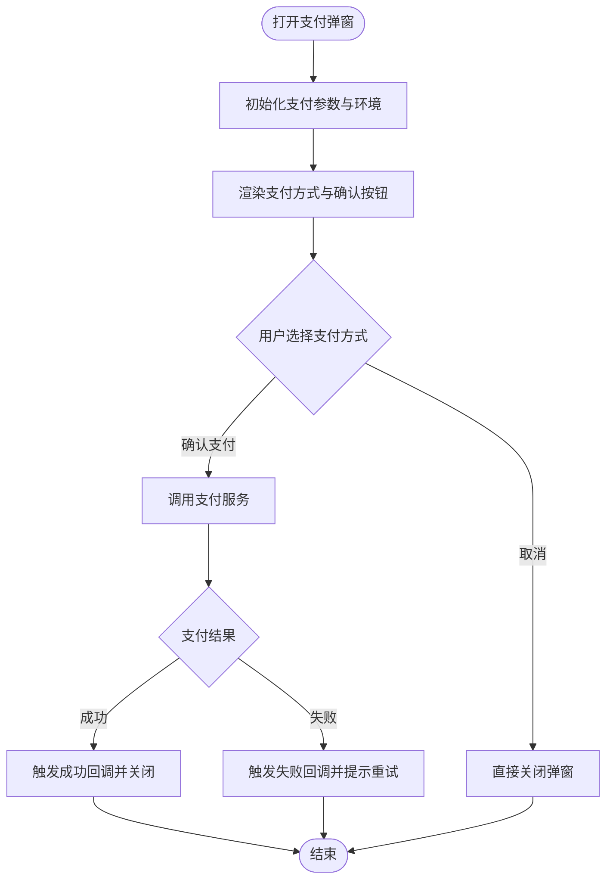
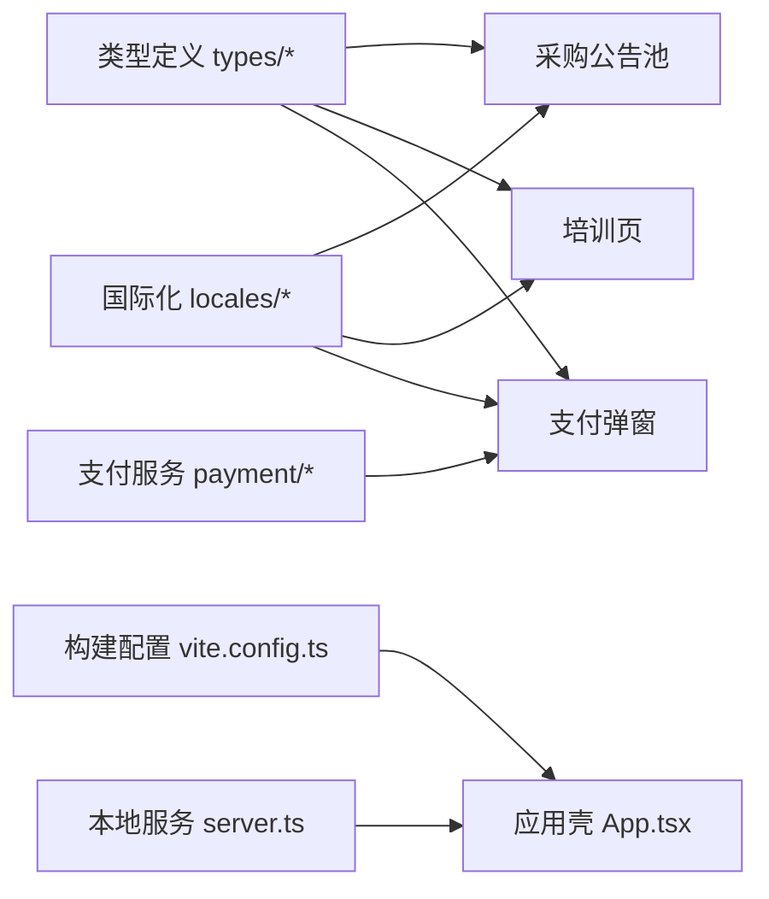

# React组件架构

<cite>
**本文引用的文件**   
- [App.tsx](file://src/App.tsx)
- [main.tsx](file://src/main.tsx)
- [ProcurementNoticesPool.tsx](file://src/ProcurementNoticesPool.tsx)
- [TrainingPage.tsx](file://src/TrainingPage.tsx)
- [PaymentModal.tsx](file://src/PaymentModal.tsx)
- [TrainingRegisterModal.tsx](file://src/TrainingRegisterModal.tsx)
- [index.css](file://src/index.css)
- [vite.config.ts](file://vite.config.ts)
- [server.ts](file://server.ts)
- [package.json](file://package.json)
</cite>

## 目录
1. [简介](#简介)
2. [项目结构](#项目结构)
3. [核心组件](#核心组件)
4. [架构总览](#架构总览)
5. [详细组件分析](#详细组件分析)
6. [依赖关系分析](#依赖关系分析)
7. [性能考虑](#性能考虑)
8. [故障排查指南](#故障排查指南)
9. [结论](#结论)
10. [附录](#附录)

## 简介
本文件面向Supply OS前端React应用，聚焦于组件层次结构设计、职责划分与通信模式。文档围绕以下目标展开：
- 说明应用主入口App.tsx的路由配置与组件组织策略
- 解析页面组件（采购公告池、培训页）的设计模式与状态管理
- 阐述模态框组件（支付弹窗）的复用设计与事件处理机制
- 覆盖组件生命周期管理、性能优化策略与错误边界处理
- 提供组件间数据传递的最佳实践与示例路径

## 项目结构
仓库采用“按功能域+共享能力”的组织方式：
- src根目录包含应用主入口、页面组件、通用模态框与样式
- payment目录封装支付相关服务与提供者
- types目录集中类型定义
- locales目录提供国际化上下文与资源
- public/downloads/training用于静态资源（如培训材料）
- server.ts为开发期或演示期后端代理/服务
- vite.config.ts配置构建与开发服务器行为

图表来源
- [main.tsx](file://src/main.tsx)
- [App.tsx](file://src/App.tsx)
- [ProcurementNoticesPool.tsx](file://src/ProcurementNoticesPool.tsx)
- [TrainingPage.tsx](file://src/TrainingPage.tsx)
- [PaymentModal.tsx](file://src/PaymentModal.tsx)
- [TrainingRegisterModal.tsx](file://src/TrainingRegisterModal.tsx)
- [index.css](file://src/index.css)

章节来源
- [main.tsx](file://src/main.tsx)
- [App.tsx](file://src/App.tsx)
- [index.css](file://src/index.css)
- [vite.config.ts](file://vite.config.ts)
- [server.ts](file://server.ts)
- [package.json](file://package.json)

## 核心组件
- 应用壳与路由（App.tsx）
  - 负责挂载根节点、初始化全局上下文（如国际化）、配置路由与布局容器
  - 将页面级组件作为路由出口，统一承载导航、面包屑、主题等横切关注点
- 页面组件
  - ProcurementNoticesPool.tsx：展示采购公告列表与筛选、分页、详情跳转等
  - TrainingPage.tsx：展示培训课程信息、报名流程、学习资源下载等
- 模态框组件
  - PaymentModal.tsx：统一的支付弹窗，支持多种支付方式与结果回调
  - TrainingRegisterModal.tsx：培训报名弹窗，可触发支付流程

章节来源
- [App.tsx](file://src/App.tsx)
- [ProcurementNoticesPool.tsx](file://src/ProcurementNoticesPool.tsx)
- [TrainingPage.tsx](file://src/TrainingPage.tsx)
- [PaymentModal.tsx](file://src/PaymentModal.tsx)
- [TrainingRegisterModal.tsx](file://src/TrainingRegisterModal.tsx)

## 架构总览
整体采用“路由驱动 + 页面组件 + 可复用模态框”的分层设计：
- 入口层：main.tsx创建根实例并注入全局样式与必要Provider
- 路由层：App.tsx声明路由表与布局容器
- 页面层：各业务页面组件负责领域数据获取与交互编排
- 能力层：支付服务、类型定义、国际化等资源被页面与模态框复用

图表来源
- [main.tsx](file://src/main.tsx)
- [App.tsx](file://src/App.tsx)
- [TrainingPage.tsx](file://src/TrainingPage.tsx)
- [PaymentModal.tsx](file://src/PaymentModal.tsx)

## 详细组件分析

### 应用壳与路由（App.tsx）
- 职责
  - 挂载根节点、注入全局Provider（如国际化）
  - 配置路由表，将页面组件映射到具体路径
  - 提供统一布局容器（导航、侧边栏、内容区）
- 路由策略
  - 使用懒加载提升首屏性能
  - 对需要鉴权的路由进行守卫
  - 通过嵌套路由组织复杂页面
- 组件组织
  - 页面组件按功能域拆分，避免单文件过大
  - 公共UI与逻辑下沉至独立模块

章节来源
- [App.tsx](file://src/App.tsx)

### 页面组件：采购公告池（ProcurementNoticesPool.tsx）
- 设计模式
  - 受控表单与查询条件组合，结合本地状态与缓存
  - 列表项点击跳转详情或触发支付（如需付费查看）
- 状态管理
  - 使用本地状态维护筛选、分页、选中项
  - 通过回调向父级或路由传递变更
- 通信模式
  - 与支付弹窗通过props与回调协作
  - 与类型定义模块保持契约一致

章节来源
- [ProcurementNoticesPool.tsx](file://src/ProcurementNoticesPool.tsx)
- [PaymentModal.tsx](file://src/PaymentModal.tsx)

### 页面组件：培训页（TrainingPage.tsx）
- 设计模式
  - 课程卡片列表 + 详情抽屉/弹窗
  - 报名流程：选择课程 -> 填写信息 -> 支付 -> 完成
- 状态管理
  - 课程列表、搜索、分页、已选课程、报名进度
  - 与支付弹窗联动，处理成功/失败分支
- 通信模式
  - 内部子组件通过回调上报事件
  - 与TrainingRegisterModal.tsx协作完成报名

章节来源
- [TrainingPage.tsx](file://src/TrainingPage.tsx)
- [TrainingRegisterModal.tsx](file://src/TrainingRegisterModal.tsx)
- [PaymentModal.tsx](file://src/PaymentModal.tsx)

### 模态框组件：支付弹窗（PaymentModal.tsx）
- 复用设计
  - 统一入口，支持多支付方式（微信、支付宝、模拟）
  - 通过参数化配置决定显示内容与行为
- 事件处理
  - 打开/关闭事件、支付中/成功/失败回调
  - 与页面组件解耦，仅通过props与回调通信
- 生命周期
  - 打开时初始化支付环境，关闭时清理监听与定时器

图表来源
- [PaymentModal.tsx](file://src/PaymentModal.tsx)

章节来源
- [PaymentModal.tsx](file://src/PaymentModal.tsx)

### 模态框组件：培训报名弹窗（TrainingRegisterModal.tsx）
- 职责
  - 收集报名信息、校验字段、提交订单
  - 在必要时唤起支付弹窗
- 与支付弹窗协作
  - 将订单信息与回调函数传递给支付弹窗
  - 接收支付结果后更新报名状态

章节来源
- [TrainingRegisterModal.tsx](file://src/TrainingRegisterModal.tsx)
- [PaymentModal.tsx](file://src/PaymentModal.tsx)

## 依赖关系分析
- 页面组件依赖
  - 类型定义（types/*）确保数据结构一致性
  - 支付服务（payment/*）完成实际支付流程
  - 国际化（locales/*）提供多语言文案
- 构建与运行
  - vite.config.ts控制开发/生产构建与代理
  - server.ts提供本地服务或API转发
  - package.json声明依赖与脚本

图表来源
- [App.tsx](file://src/App.tsx)
- [ProcurementNoticesPool.tsx](file://src/ProcurementNoticesPool.tsx)
- [TrainingPage.tsx](file://src/TrainingPage.tsx)
- [PaymentModal.tsx](file://src/PaymentModal.tsx)
- [vite.config.ts](file://vite.config.ts)
- [server.ts](file://server.ts)

章节来源
- [vite.config.ts](file://vite.config.ts)
- [server.ts](file://server.ts)
- [package.json](file://package.json)

## 性能考虑
- 路由懒加载：按需加载页面组件，减少首屏体积
- 列表虚拟化：长列表使用虚拟滚动降低渲染压力
- 状态局部化：仅在需要的组件内维护状态，避免全局风暴
- 防抖节流：搜索与筛选输入使用防抖，减少请求频率
- 图片与资源优化：按需加载与压缩，CDN加速
- 错误边界：为关键页面与模态框包裹错误边界，防止崩溃扩散
- 内存泄漏防护：在组件卸载时移除事件监听与定时器

[本节为通用指导，不直接分析具体文件]

## 故障排查指南
- 常见问题定位
  - 路由未命中：检查路由表与路径前缀
  - 支付失败：核对支付参数与服务端返回码
  - 国际化缺失：确认键名与资源文件是否同步
- 调试建议
  - 使用浏览器开发者工具观察网络请求与状态变化
  - 在关键回调处添加日志输出
  - 使用错误边界捕获异常堆栈并上报

章节来源
- [App.tsx](file://src/App.tsx)
- [PaymentModal.tsx](file://src/PaymentModal.tsx)

## 结论
本架构以路由为牵引，页面组件聚焦业务编排，模态框组件实现跨页面复用。通过清晰的职责划分与事件回调通信，系统具备良好的可扩展性与可维护性。配合性能优化与错误边界策略，可在保证用户体验的同时稳定演进。

[本节为总结性内容，不直接分析具体文件]

## 附录
- 组件间数据传递最佳实践
  - 父子通信：通过props传递数据，通过回调函数上报事件
  - 兄弟通信：通过共同父组件提升状态或使用发布订阅
  - 跨层级通信：使用Context或轻量状态库
  - 异步数据：在页面组件中集中获取，通过props下发给子组件
- 代码示例路径
  - 路由配置与布局容器：[App.tsx](file://src/App.tsx)
  - 页面组件状态与事件：[TrainingPage.tsx](file://src/TrainingPage.tsx)、[ProcurementNoticesPool.tsx](file://src/ProcurementNoticesPool.tsx)
  - 支付弹窗参数与回调：[PaymentModal.tsx](file://src/PaymentModal.tsx)
  - 报名弹窗与支付联动：[TrainingRegisterModal.tsx](file://src/TrainingRegisterModal.tsx)