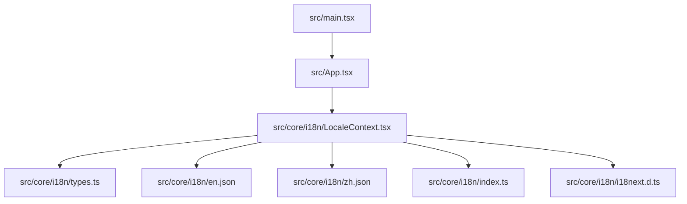
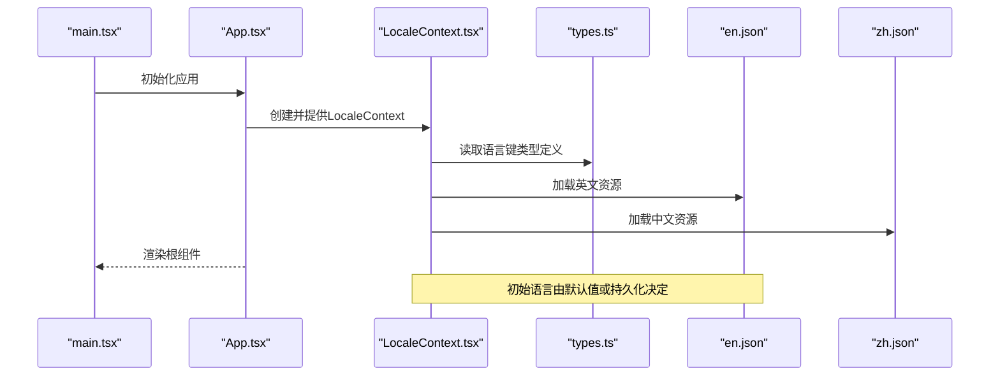
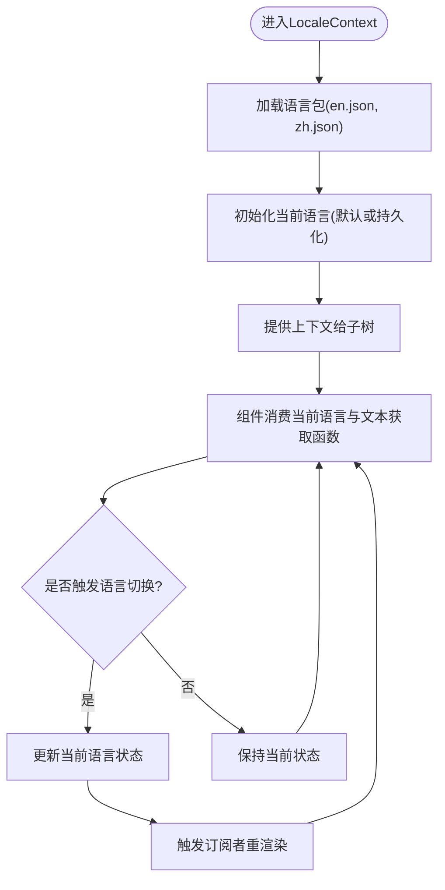
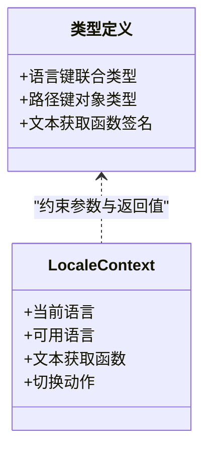
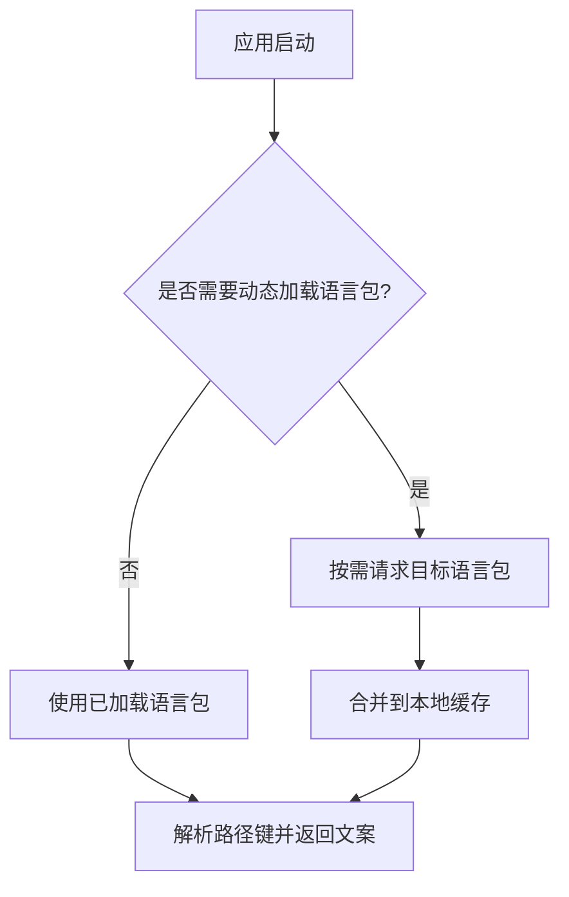
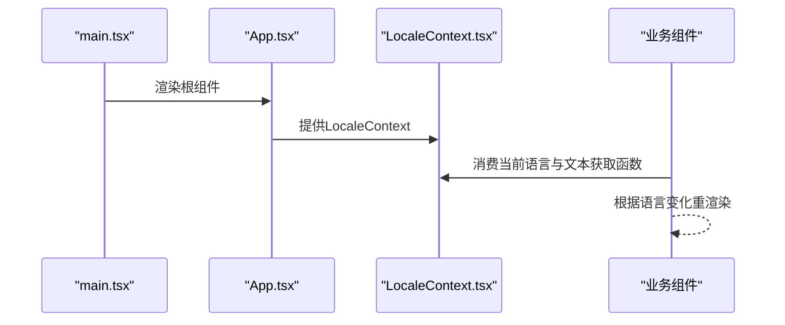
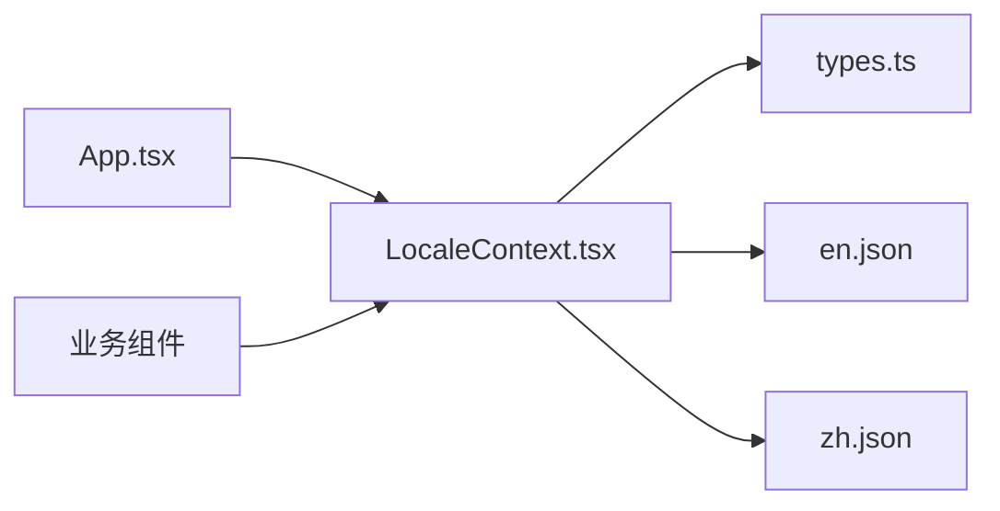

# 国际化架构

<cite>
**本文引用的文件**   
- [src/core/i18n/LocaleContext.tsx](file://src/core/i18n/LocaleContext.tsx)
- [src/core/i18n/types.ts](file://src/core/i18n/types.ts)
- [src/core/i18n/en.json](file://src/core/i18n/en.json)
- [src/core/i18n/zh.json](file://src/core/i18n/zh.json)
- [src/core/i18n/index.ts](file://src/core/i18n/index.ts)
- [src/core/i18n/i18next.d.ts](file://src/core/i18n/i18next.d.ts)
- [src/App.tsx](file://src/App.tsx)
- [src/main.tsx](file://src/main.tsx)
</cite>

## 更新摘要
**变更内容**   
- 重构国际化目录结构，从 src/locales 迁移至 src/core/i18n
- 集成 react-i18next 框架实现类型安全的国际化
- 新增 TypeScript 定义文件和配置管理
- 更新组件集成模式和上下文提供方式

## 目录
1. [简介](#简介)
2. [项目结构](#项目结构)
3. [核心组件](#核心组件)
4. [架构总览](#架构总览)
5. [详细组件分析](#详细组件分析)
6. [依赖分析](#依赖分析)
7. [性能考虑](#性能考虑)
8. [故障排查指南](#故障排查指南)
9. [结论](#结论)
10. [附录](#附录)

## 简介
本文件面向Supply OS的国际化（i18n）体系，基于react-i18next框架构建，系统性阐述以下主题：
- LocaleContext的状态管理模式与语言切换机制
- 多语言资源文件组织结构、翻译键值管理与动态加载策略
- 类型安全的国际化实现方案与编译时检查机制
- 语言包扩展指南、翻译工作流程与版本管理策略
- 国际化最佳实践、性能优化技巧与常见问题解决方案

目标是帮助开发者在不深入源码细节的前提下，快速理解并高效使用国际化能力。

## 项目结构
国际化相关代码集中在 src/core/i18n 目录，包含上下文状态、类型定义、语言包资源和框架配置；应用入口与根组件负责注入上下文与提供全局语言环境。

图表来源
- [src/main.tsx:1-200](file://src/main.tsx#L1-L200)
- [src/App.tsx:1-200](file://src/App.tsx#L1-L200)
- [src/core/i18n/LocaleContext.tsx:1-200](file://src/core/i18n/LocaleContext.tsx#L1-L200)
- [src/core/i18n/types.ts:1-200](file://src/core/i18n/types.ts#L1-L200)
- [src/core/i18n/en.json:1-200](file://src/core/i18n/en.json#L1-L200)
- [src/core/i18n/zh.json:1-200](file://src/core/i18n/zh.json#L1-L200)
- [src/core/i18n/index.ts:1-200](file://src/core/i18n/index.ts#L1-L200)
- [src/core/i18n/i18next.d.ts:1-200](file://src/core/i18n/i18next.d.ts#L1-L200)

章节来源
- [src/main.tsx:1-200](file://src/main.tsx#L1-L200)
- [src/App.tsx:1-200](file://src/App.tsx#L1-L200)
- [src/core/i18n/LocaleContext.tsx:1-200](file://src/core/i18n/LocaleContext.tsx#L1-L200)
- [src/core/i18n/types.ts:1-200](file://src/core/i18n/types.ts#L1-L200)
- [src/core/i18n/en.json:1-200](file://src/core/i18n/en.json#L1-L200)
- [src/core/i18n/zh.json:1-200](file://src/core/i18n/zh.json#L1-L200)
- [src/core/i18n/index.ts:1-200](file://src/core/i18n/index.ts#L1-L200)
- [src/core/i18n/i18next.d.ts:1-200](file://src/core/i18n/i18next.d.ts#L1-L200)

## 核心组件
- LocaleContext：集中管理当前语言、可用语言列表、文本获取函数与语言切换动作，并通过React Context向子树提供。
- types.ts：定义语言键的类型映射与辅助类型，确保在调用处具备完整的键级联提示与编译期校验。
- en.json / zh.json：按功能域或页面组织的多语言资源文件，作为运行时文本源。
- index.ts：国际化模块的统一导出入口，提供初始化配置和工具函数。
- i18next.d.ts：TypeScript类型声明文件，为react-i18next框架提供类型支持。

章节来源
- [src/core/i18n/LocaleContext.tsx:1-200](file://src/core/i18n/LocaleContext.tsx#L1-L200)
- [src/core/i18n/types.ts:1-200](file://src/core/i18n/types.ts#L1-L200)
- [src/core/i18n/en.json:1-200](file://src/core/i18n/en.json#L1-L200)
- [src/core/i18n/zh.json:1-200](file://src/core/i18n/zh.json#L1-L200)
- [src/core/i18n/index.ts:1-200](file://src/core/i18n/index.ts#L1-L200)
- [src/core/i18n/i18next.d.ts:1-200](file://src/core/i18n/i18next.d.ts#L1-L200)

## 架构总览
下图展示了从应用启动到组件渲染的语言选择与文本获取流程，以及LocaleContext在其中的作用。

图表来源
- [src/main.tsx:1-200](file://src/main.tsx#L1-L200)
- [src/App.tsx:1-200](file://src/App.tsx#L1-L200)
- [src/core/i18n/LocaleContext.tsx:1-200](file://src/core/i18n/LocaleContext.tsx#L1-L200)
- [src/core/i18n/types.ts:1-200](file://src/core/i18n/types.ts#L1-L200)
- [src/core/i18n/en.json:1-200](file://src/core/i18n/en.json#L1-L200)
- [src/core/i18n/zh.json:1-200](file://src/core/i18n/zh.json#L1-L200)

## 详细组件分析

### LocaleContext 状态管理与语言切换
- 状态字段
  - 当前语言：用于确定取用哪个语言包的键值
  - 可用语言集合：限制可切换的目标语言
  - 文本获取函数：根据路径键返回对应文案
  - 切换动作：更新当前语言并触发重渲染
- 生命周期与初始化
  - 在应用启动阶段加载所有语言包
  - 基于默认语言或用户偏好设置选择初始语言
- 切换流程
  - 调用切换动作后，更新状态并通知订阅者
  - 组件通过上下文消费最新语言，自动重新渲染

图表来源
- [src/core/i18n/LocaleContext.tsx:1-200](file://src/core/i18n/LocaleContext.tsx#L1-L200)

章节来源
- [src/core/i18n/LocaleContext.tsx:1-200](file://src/core/i18n/LocaleContext.tsx#L1-L200)

### 类型安全与编译时检查
- 类型定义
  - 为每个语言包键生成联合类型或嵌套对象类型，保证键路径完整提示
  - 文本获取函数的参数类型受类型约束，避免拼写错误
- 编译期保障
  - 新增键需同步更新类型定义，否则编译报错
  - 删除键或变更层级结构时，引用处会立即暴露问题
- 运行期兜底
  - 对缺失键进行统一处理（如回退到默认语言或占位符），提升健壮性

图表来源
- [src/core/i18n/types.ts:1-200](file://src/core/i18n/types.ts#L1-L200)
- [src/core/i18n/LocaleContext.tsx:1-200](file://src/core/i18n/LocaleContext.tsx#L1-L200)

章节来源
- [src/core/i18n/types.ts:1-200](file://src/core/i18n/types.ts#L1-L200)
- [src/core/i18n/LocaleContext.tsx:1-200](file://src/core/i18n/LocaleContext.tsx#L1-L200)

### 多语言文件组织与动态加载
- 文件组织
  - 以语言为单位拆分资源文件（如 en.json、zh.json）
  - 建议按功能域或页面进一步分层，便于维护与增量加载
- 动态加载策略
  - 按需加载：仅在需要时引入特定语言包，减少首屏体积
  - 预加载：对常用语言提前加载，降低切换延迟
  - 缓存：浏览器缓存已加载语言包，避免重复请求
- 键值管理
  - 采用点号分隔的路径键，形成清晰的命名空间
  - 统一的键前缀或模块名，避免冲突

图表来源
- [src/core/i18n/LocaleContext.tsx:1-200](file://src/core/i18n/LocaleContext.tsx#L1-L200)
- [src/core/i18n/en.json:1-200](file://src/core/i18n/en.json#L1-L200)
- [src/core/i18n/zh.json:1-200](file://src/core/i18n/zh.json#L1-L200)

章节来源
- [src/core/i18n/LocaleContext.tsx:1-200](file://src/core/i18n/LocaleContext.tsx#L1-L200)
- [src/core/i18n/en.json:1-200](file://src/core/i18n/en.json#L1-L200)
- [src/core/i18n/zh.json:1-200](file://src/core/i18n/zh.json#L1-L200)

### 应用集成与上下文注入
- 入口层
  - main.tsx 负责挂载应用
  - App.tsx 包裹并注入 LocaleContext，使全局组件可消费
- 组件消费
  - 任意子组件通过上下文获取当前语言与文本获取函数
  - 切换语言后，自动触发受影响组件重渲染

图表来源
- [src/main.tsx:1-200](file://src/main.tsx#L1-L200)
- [src/App.tsx:1-200](file://src/App.tsx#L1-L200)
- [src/core/i18n/LocaleContext.tsx:1-200](file://src/core/i18n/LocaleContext.tsx#L1-L200)

章节来源
- [src/main.tsx:1-200](file://src/main.tsx#L1-L200)
- [src/App.tsx:1-200](file://src/App.tsx#L1-L200)
- [src/core/i18n/LocaleContext.tsx:1-200](file://src/core/i18n/LocaleContext.tsx#L1-L200)

### React-i18next 框架集成
- 框架配置
  - 初始化 react-i18next 实例
  - 配置语言资源加载器和后端适配器
  - 设置默认语言和回退策略
- 类型声明
  - 扩展 i18next 类型定义
  - 提供翻译键的类型推断
  - 增强开发体验
- 插件系统
  - 支持插值、复数形式等高级功能
  - 可扩展自定义格式化器
  - 集成调试工具和监控

**Section sources**
- [src/core/i18n/index.ts:1-200](file://src/core/i18n/index.ts#L1-L200)
- [src/core/i18n/i18next.d.ts:1-200](file://src/core/i18n/i18next.d.ts#L1-L200)

## 依赖分析
- 直接依赖
  - App.tsx 依赖 LocaleContext.tsx 提供的上下文
  - LocaleContext.tsx 依赖 types.ts 的类型定义与语言包资源
- 间接依赖
  - 业务组件通过上下文间接依赖语言包与类型系统
- 潜在风险
  - 循环依赖：确保 LocaleContext 不反向依赖业务组件
  - 类型漂移：新增语言包时需同步更新类型定义

图表来源
- [src/App.tsx:1-200](file://src/App.tsx#L1-L200)
- [src/core/i18n/LocaleContext.tsx:1-200](file://src/core/i18n/LocaleContext.tsx#L1-L200)
- [src/core/i18n/types.ts:1-200](file://src/core/i18n/types.ts#L1-L200)
- [src/core/i18n/en.json:1-200](file://src/core/i18n/en.json#L1-L200)
- [src/core/i18n/zh.json:1-200](file://src/core/i18n/zh.json#L1-L200)

章节来源
- [src/App.tsx:1-200](file://src/App.tsx#L1-L200)
- [src/core/i18n/LocaleContext.tsx:1-200](file://src/core/i18n/LocaleContext.tsx#L1-L200)
- [src/core/i18n/types.ts:1-200](file://src/core/i18n/types.ts#L1-L200)
- [src/core/i18n/en.json:1-200](file://src/core/i18n/en.json#L1-L200)
- [src/core/i18n/zh.json:1-200](file://src/core/i18n/zh.json#L1-L200)

## 性能考虑
- 首屏优化
  - 仅加载必要语言包，其余按需加载
  - 将常用语言包内联或预加载，缩短切换延迟
- 缓存策略
  - 利用浏览器缓存与内存缓存，避免重复网络请求
- 渲染优化
  - 最小化受语言切换影响的组件范围，避免整棵子树重渲染
- 资源体积
  - 压缩语言包JSON，移除冗余注释与空键
- 监控与度量
  - 记录语言切换耗时与失败率，持续优化体验

## 故障排查指南
- 现象：切换语言后界面未更新
  - 检查是否在正确的上下文中消费语言状态
  - 确认切换动作是否正确触发状态更新
- 现象：文案显示为键名或占位符
  - 核对路径键是否存在于当前语言包
  - 检查类型定义是否与资源文件一致
- 现象：新增语言包无效
  - 确认语言包已正确加载并合并到上下文
  - 验证可用语言集合是否包含新语言
- 现象：构建时报类型错误
  - 同步更新类型定义中的键路径
  - 清理缓存并重新构建

章节来源
- [src/core/i18n/LocaleContext.tsx:1-200](file://src/core/i18n/LocaleContext.tsx#L1-L200)
- [src/core/i18n/types.ts:1-200](file://src/core/i18n/types.ts#L1-L200)
- [src/core/i18n/en.json:1-200](file://src/core/i18n/en.json#L1-L200)
- [src/core/i18n/zh.json:1-200](file://src/core/i18n/zh.json#L1-L200)

## 结论
Supply OS的国际化架构以LocaleContext为核心，结合react-i18next框架和类型系统，实现了类型安全、可扩展且易于维护的多语言支持。通过合理的动态加载与缓存策略，可在保证开发体验的同时兼顾性能与稳定性。遵循本文的最佳实践与工作流程，有助于团队高效推进国际化能力的演进。

## 附录

### 语言包扩展指南
- 新增语言
  - 在 core/i18n 目录下新增语言包文件
  - 在类型定义中补充该语言的键类型
  - 在可用语言集合中添加新语言
- 新增键
  - 在现有语言包中增加键值
  - 同步更新类型定义，确保编译期校验生效
- 删除键
  - 从所有语言包中移除键
  - 清理类型定义中的对应路径
  - 搜索并替换业务代码中的引用

章节来源
- [src/core/i18n/types.ts:1-200](file://src/core/i18n/types.ts#L1-L200)
- [src/core/i18n/LocaleContext.tsx:1-200](file://src/core/i18n/LocaleContext.tsx#L1-L200)
- [src/core/i18n/en.json:1-200](file://src/core/i18n/en.json#L1-L200)
- [src/core/i18n/zh.json:1-200](file://src/core/i18n/zh.json#L1-L200)

### 翻译工作流程
- 需求评审：明确需要国际化的页面与文案
- 键设计：规划键命名规范与层级结构
- 资源填充：在各语言包中填写对应文案
- 类型同步：更新类型定义，确保编译期校验
- 集成测试：验证语言切换与文案展示
- 发布上线：灰度发布并监控异常

### 版本管理策略
- 语义化版本
  - 主版本：破坏性变更（如键结构重构）
  - 次版本：新增功能（如新增语言包）
  - 修订版本：修复问题（如键缺失修复）
- 变更日志
  - 记录每次版本变更的键增删改情况
- 兼容性
  - 提供迁移脚本或兼容层，平滑过渡
- 回滚
  - 保留历史版本资源，支持快速回滚