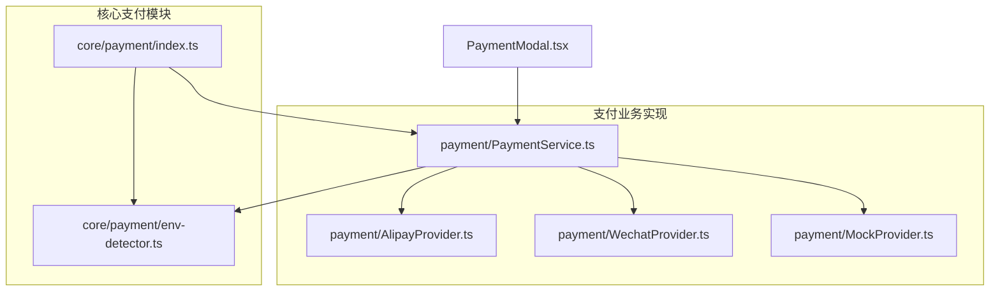
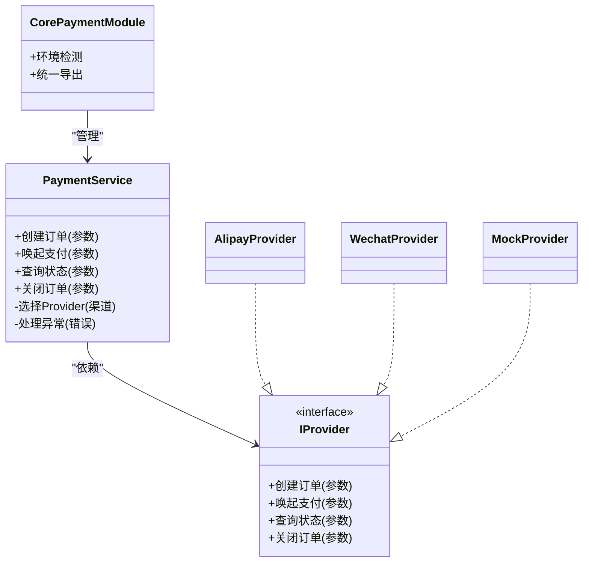
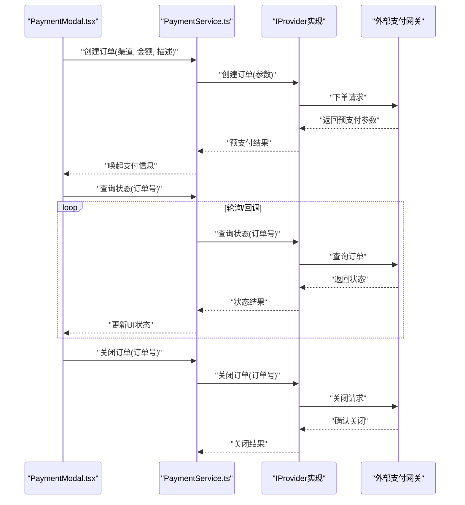
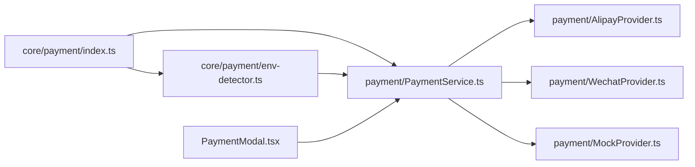

# 支付服务架构

<cite>
**本文引用的文件**   
- [PaymentService.ts](file://src/payment/PaymentService.ts)
- [AlipayProvider.ts](file://src/payment/AlipayProvider.ts)
- [WechatProvider.ts](file://src/payment/WechatProvider.ts)
- [MockProvider.ts](file://src/payment/MockProvider.ts)
- [env-detector.ts](file://src/core/payment/env-detector.ts)
- [index.ts](file://src/core/payment/index.ts)
- [PaymentModal.tsx](file://src/PaymentModal.tsx)
- [payment.ts](file://src/types/payment.ts)
</cite>

## 更新摘要
**变更内容**   
- 环境检测逻辑从 src/payment/env-detector.ts 迁移至 src/core/payment/env-detector.ts
- 新增 src/core/payment/index.ts 作为集中化的支付模块入口
- 重构增强了支付系统的模块化架构设计
- 更新了项目结构图和依赖关系分析以反映新的组织方式

## 目录
1. [简介](#简介)
2. [项目结构](#项目结构)
3. [核心组件](#核心组件)
4. [架构总览](#架构总览)
5. [详细组件分析](#详细组件分析)
6. [依赖关系分析](#依赖关系分析)
7. [性能与可靠性](#性能与可靠性)
8. [故障排查指南](#故障排查指南)
9. [结论](#结论)
10. [附录：新支付方式集成指南与测试方案](#附录新支付方式集成指南与测试方案)

## 简介
本文件面向Supply OS的支付子系统，聚焦于"支付抽象层 + Provider模式"的设计与实现。文档将深入解析PaymentService的核心逻辑、支付流程控制与错误处理机制；对比支付宝、微信与模拟提供商的实现差异与集成方式；阐述支付类型系统设计与扩展机制；并给出安全考虑、事务处理与状态同步策略建议，以及新增支付方式的完整集成与测试方案。

## 项目结构
支付相关代码采用分层模块化组织，核心功能集中在src/core/payment目录，业务实现位于src/payment目录：
- src/core/payment/env-detector.ts：运行环境检测（用于选择默认或适配的Provider）
- src/core/payment/index.ts：集中化的支付模块入口，提供统一的导出接口
- src/payment/PaymentService.ts：支付编排服务，负责路由到具体Provider、流程控制与错误处理
- src/payment/AlipayProvider.ts / WechatProvider.ts / MockProvider.ts：各支付渠道的具体实现
- PaymentModal.tsx：前端支付弹窗，调用PaymentService发起支付
- src/types/payment.ts：全局支付类型补充定义

**图表来源**
- [env-detector.ts](file://src/core/payment/env-detector.ts)
- [index.ts](file://src/core/payment/index.ts)
- [PaymentService.ts](file://src/payment/PaymentService.ts)
- [AlipayProvider.ts](file://src/payment/AlipayProvider.ts)
- [WechatProvider.ts](file://src/payment/WechatProvider.ts)
- [MockProvider.ts](file://src/payment/MockProvider.ts)
- [PaymentModal.tsx](file://src/PaymentModal.tsx)

**章节来源**
- [env-detector.ts](file://src/core/payment/env-detector.ts)
- [index.ts](file://src/core/payment/index.ts)
- [PaymentService.ts](file://src/payment/PaymentService.ts)
- [PaymentModal.tsx](file://src/PaymentModal.tsx)

## 核心组件
- 环境检测（src/core/payment/env-detector.ts）
  - 提供运行时环境判断能力，辅助选择默认Provider或行为分支（如开发/测试使用模拟）。
  - 已迁移至核心模块，增强模块化和可复用性。
- 支付模块入口（src/core/payment/index.ts）
  - 集中化导出支付相关功能，提供统一的模块访问接口。
  - 简化导入路径，提升代码组织清晰度。
- 支付编排服务（PaymentService.ts）
  - 对外暴露统一的支付入口，内部根据渠道类型路由至对应Provider，封装创建订单、唤起支付、查询状态、关闭订单等流程，并集中处理异常与重试策略。
- 渠道实现（AlipayProvider.ts / WechatProvider.ts / MockProvider.ts）
  - 各自实现统一的支付接口，屏蔽不同渠道的差异（参数构造、签名、唤起方式、回调解析等）。
- 前端交互（PaymentModal.tsx）
  - 聚合用户输入与UI状态，调用PaymentService完成支付主流程。

**章节来源**
- [env-detector.ts](file://src/core/payment/env-detector.ts)
- [index.ts](file://src/core/payment/index.ts)
- [PaymentService.ts](file://src/payment/PaymentService.ts)
- [AlipayProvider.ts](file://src/payment/AlipayProvider.ts)
- [WechatProvider.ts](file://src/payment/WechatProvider.ts)
- [MockProvider.ts](file://src/payment/MockProvider.ts)
- [PaymentModal.tsx](file://src/PaymentModal.tsx)

## 架构总览
支付子系统采用"抽象层 + Provider模式"的解耦设计，并通过核心模块进行统一管理和导出：
- 核心模块层：提供环境检测和统一导出接口
- 抽象层：通过类型与接口约定，屏蔽渠道差异
- Provider：每个支付渠道一个实现类，遵循统一契约
- 编排服务：负责选择Provider、编排流程、错误处理与可观测性

**图表来源**
- [index.ts](file://src/core/payment/index.ts)
- [env-detector.ts](file://src/core/payment/env-detector.ts)
- [PaymentService.ts](file://src/payment/PaymentService.ts)
- [AlipayProvider.ts](file://src/payment/AlipayProvider.ts)
- [WechatProvider.ts](file://src/payment/WechatProvider.ts)
- [MockProvider.ts](file://src/payment/MockProvider.ts)

## 详细组件分析

### 核心支付模块重构
**更新** 环境检测逻辑已从src/payment/env-detector.ts迁移至src/core/payment/env-detector.ts，并新增了src/core/payment/index.ts作为集中化的支付模块入口。

- 模块化优势
  - 环境检测逻辑独立为可复用组件，支持跨模块共享
  - 统一导出接口简化了模块导入和依赖管理
  - 增强了代码的组织性和可维护性
- 架构改进
  - 核心功能与业务实现分离，职责更加清晰
  - 便于未来扩展更多支付相关功能
  - 提升了单元测试的可测试性

**章节来源**
- [env-detector.ts](file://src/core/payment/env-detector.ts)
- [index.ts](file://src/core/payment/index.ts)

### 环境检测与默认Provider选择
- 作用
  - 在开发/测试环境下自动选择MockProvider，生产环境按配置选择真实渠道
- 决策依据
  - 环境变量、平台特征、功能开关等
- 影响范围
  - 仅影响默认Provider的选择，不改变上层调用方式
- 重构后优势
  - 环境检测逻辑独立化，支持多模块复用
  - 通过核心模块统一导出，简化依赖管理

**章节来源**
- [env-detector.ts](file://src/core/payment/env-detector.ts)

### PaymentService：核心编排与错误处理
- 职责
  - 统一入口：对外暴露一致的API
  - Provider路由：根据渠道类型选择具体实现
  - 流程编排：创建订单 -> 唤起支付 -> 轮询/监听状态 -> 关闭订单
  - 错误处理：统一捕获、分类、重试与降级
- 关键流程
  - 创建订单：校验参数、生成业务单号、调用Provider创建
  - 唤起支付：组装唤起参数、返回唤起信息（URL/小程序参数等）
  - 状态同步：定时轮询或事件回调驱动，确保最终一致
  - 关闭订单：超时或取消场景下释放资源
- 错误处理
  - 网络异常：指数退避重试
  - 业务异常：记录上下文、上报监控、友好提示
  - 幂等保障：基于订单号去重，避免重复扣款

**图表来源**
- [PaymentService.ts](file://src/payment/PaymentService.ts)
- [AlipayProvider.ts](file://src/payment/AlipayProvider.ts)
- [WechatProvider.ts](file://src/payment/WechatProvider.ts)
- [MockProvider.ts](file://src/payment/MockProvider.ts)

**章节来源**
- [PaymentService.ts](file://src/payment/PaymentService.ts)

### 支付宝Provider实现要点
- 差异化点
  - 参数构造：签名算法、应用ID、公钥证书等
  - 唤起方式：Web跳转、App内SDK、小程序H5桥接
  - 回调解析：异步通知验签、订单状态映射
- 集成方式
  - 实现统一接口，注入渠道特有配置
  - 在PaymentService中按渠道类型路由

**章节来源**
- [AlipayProvider.ts](file://src/payment/AlipayProvider.ts)

### 微信支付Provider实现要点
- 差异化点
  - 参数构造：商户号、密钥、随机串、时间戳、签名
  - 唤起方式：JSAPI、Native、小程序、H5
  - 回调解析：XML/JSON通知、验签、幂等处理
- 集成方式
  - 实现统一接口，注入渠道特有配置
  - 在PaymentService中按渠道类型路由

**章节来源**
- [WechatProvider.ts](file://src/payment/WechatProvider.ts)

### 模拟Provider实现要点
- 作用
  - 本地联调与自动化测试，无需真实网关
- 行为
  - 快速返回预支付参数
  - 支持可控的状态推进与错误注入
- 集成方式
  - 实现统一接口，通过环境检测选择为默认Provider

**章节来源**
- [MockProvider.ts](file://src/payment/MockProvider.ts)

### 前端支付弹窗（PaymentModal.tsx）
- 职责
  - 收集用户选择（渠道、金额、备注）
  - 调用PaymentService完成支付全流程
  - 展示进度、结果与错误提示
- 交互
  - 创建订单后唤起支付
  - 轮询或监听回调更新状态
  - 支持取消与超时关闭

**章节来源**
- [PaymentModal.tsx](file://src/PaymentModal.tsx)

## 依赖关系分析
**更新** 依赖关系已重构，环境检测逻辑迁移至核心模块，新增统一导出接口。

- 模块内依赖
  - core/payment/index.ts统一管理环境检测和支付服务导出
  - PaymentService依赖核心模块的环境检测功能，并组合多个Provider实现
  - 各Provider独立实现，互不耦合
- 外部依赖
  - 各Provider对接外部支付网关（HTTP/SDK）
- 潜在风险
  - Provider间共享类型需保持兼容
  - 核心模块重构可能影响现有导入路径

**图表来源**
- [index.ts](file://src/core/payment/index.ts)
- [env-detector.ts](file://src/core/payment/env-detector.ts)
- [PaymentService.ts](file://src/payment/PaymentService.ts)
- [AlipayProvider.ts](file://src/payment/AlipayProvider.ts)
- [WechatProvider.ts](file://src/payment/WechatProvider.ts)
- [MockProvider.ts](file://src/payment/MockProvider.ts)
- [PaymentModal.tsx](file://src/PaymentModal.tsx)

**章节来源**
- [index.ts](file://src/core/payment/index.ts)
- [env-detector.ts](file://src/core/payment/env-detector.ts)
- [PaymentService.ts](file://src/payment/PaymentService.ts)

## 性能与可靠性
- 并发与幂等
  - 以订单号为幂等键，防止重复下单与重复回调处理
- 重试与退避
  - 对网络抖动进行指数退避重试，设置最大重试次数与超时
- 状态一致性
  - 采用"最终一致"策略：轮询+回调双通道，必要时补偿任务
- 资源管理
  - 及时关闭订单、释放临时凭证与缓存
- 可观测性
  - 关键路径埋点：创建、唤起、查询、关闭、错误分类

## 故障排查指南
- 常见问题定位
  - 参数校验失败：检查金额、币种、订单号格式
  - 签名/验签失败：核对密钥、时间戳、随机串与签名算法
  - 唤起失败：检查唤起参数与目标环境兼容性
  - 状态不一致：核对轮询间隔、回调顺序与幂等处理
- 日志与追踪
  - 记录请求ID、订单号、渠道、错误码与堆栈
  - 关联前后端链路，便于跨端排查
- 回滚与补偿
  - 失败订单进入补偿队列，定期重试或人工介入

**章节来源**
- [PaymentService.ts](file://src/payment/PaymentService.ts)

## 结论
本支付子系统通过抽象层与Provider模式实现了多渠道支付的解耦与可扩展性。经过核心模块重构后，环境检测逻辑独立化，统一导出接口简化了依赖管理。PaymentService承担编排与错误处理职责，各Provider专注渠道差异，类型系统保障契约稳定。结合幂等、重试、最终一致与可观测性策略，可在保证用户体验的同时提升系统可靠性。

## 附录：新支付方式集成指南与测试方案

### 新增渠道步骤
- 定义类型
  - 在类型系统中补充渠道标识与必要字段
- 实现Provider
  - 实现统一接口，完成创建、唤起、查询、关闭四个核心方法
  - 处理渠道特有的签名、参数构造与回调解析
- 注册与路由
  - 在Provider选择逻辑中注册新渠道
  - 若需要默认切换，更新核心模块的环境检测逻辑
- 前端接入
  - 在支付弹窗中增加渠道选项与相应交互
- 配置与安全
  - 注入渠道密钥与证书，遵循最小权限原则
  - 启用HTTPS、防重放、签名校验

**章节来源**
- [env-detector.ts](file://src/core/payment/env-detector.ts)
- [index.ts](file://src/core/payment/index.ts)
- [PaymentService.ts](file://src/payment/PaymentService.ts)
- [PaymentModal.tsx](file://src/PaymentModal.tsx)

### 测试方案
- 单元测试
  - 覆盖Provider各方法的正常与异常分支
  - 验证幂等键与重试退避策略
- 集成测试
  - 使用MockProvider模拟网关响应，断言端到端流程
  - 注入错误场景（超时、签名失败、状态不一致）
- 回归与冒烟
  - 关键用例自动化执行，纳入CI流水线
- 安全测试
  - 校验签名、敏感信息不落盘、传输加密

**章节来源**
- [MockProvider.ts](file://src/payment/MockProvider.ts)
- [PaymentService.ts](file://src/payment/PaymentService.ts)