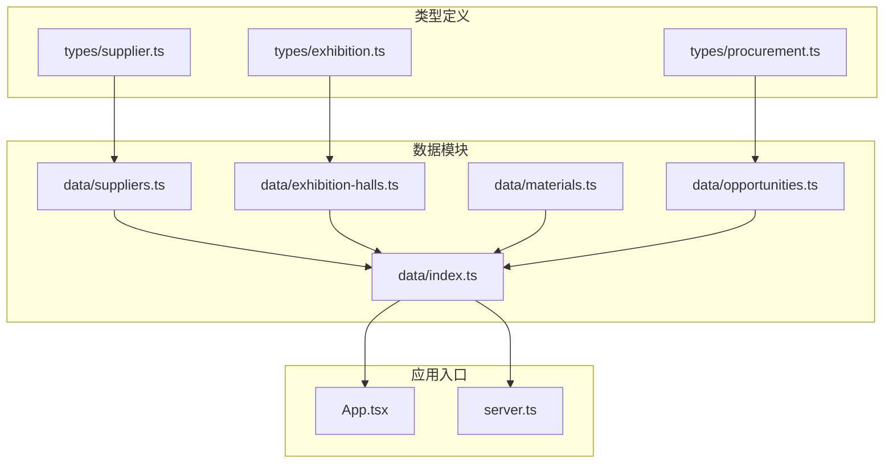
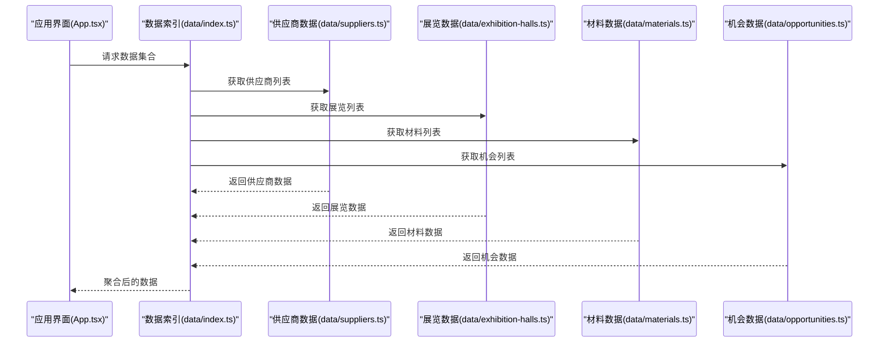
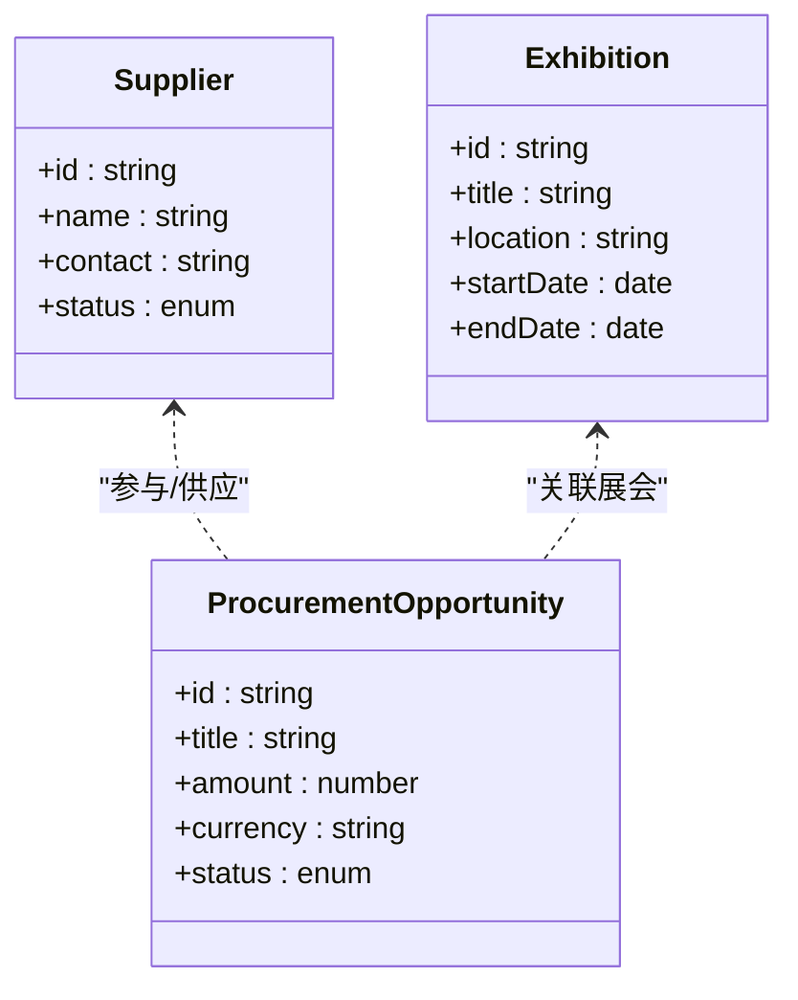
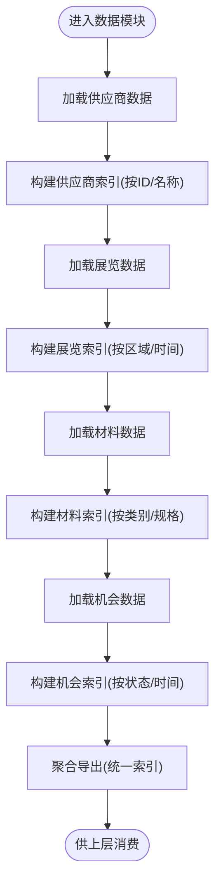
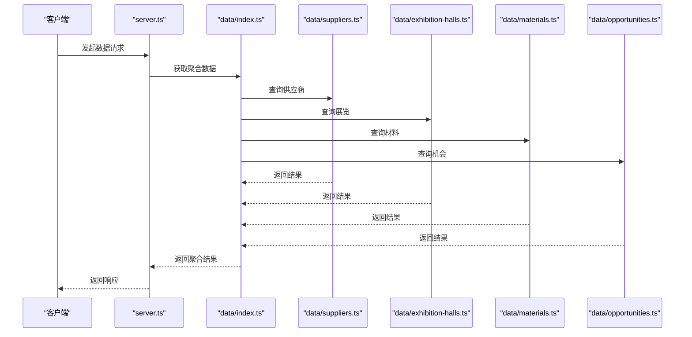
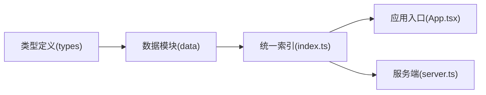

# 数据管理架构

<cite>
**本文引用的文件**   
- [src/data/index.ts](file://src/data/index.ts)
- [src/data/suppliers.ts](file://src/data/suppliers.ts)
- [src/data/exhibition-halls.ts](file://src/data/exhibition-halls.ts)
- [src/data/materials.ts](file://src/data/materials.ts)
- [src/data/opportunities.ts](file://src/data/opportunities.ts)
- [src/types/supplier.ts](file://src/types/supplier.ts)
- [src/types/exhibition.ts](file://src/types/exhibition.ts)
- [src/types/procurement.ts](file://src/types/procurement.ts)
- [src/App.tsx](file://src/App.tsx)
- [server.ts](file://server.ts)
</cite>

## 目录
1. [简介](#简介)
2. [项目结构](#项目结构)
3. [核心组件](#核心组件)
4. [架构总览](#架构总览)
5. [详细组件分析](#详细组件分析)
6. [依赖分析](#依赖分析)
7. [性能考虑](#性能考虑)
8. [故障排查指南](#故障排查指南)
9. [结论](#结论)
10. [附录](#附录)

## 简介
本文件面向Supply OS的数据管理架构，聚焦于数据层设计模式、数据流管理与缓存策略，系统阐述供应商数据、展览数据和材料数据的模型定义与关系映射，并给出数据更新机制、同步策略与一致性保证方案。同时提供数据验证规则、错误处理与性能优化建议，以及扩展指南与最佳实践示例，帮助读者快速理解并高效使用数据模块。

## 项目结构
仓库采用“类型定义 + 静态数据 + 应用入口”的分层组织方式：
- types 目录：集中定义领域模型（如供应商、展会、采购等）的接口与枚举。
- data 目录：以模块为单位维护静态数据与导出聚合，便于上层消费。
- App 与 server：作为应用入口与后端服务入口，负责加载数据与对外暴露能力。

图表来源
- [src/types/supplier.ts](file://src/types/supplier.ts)
- [src/types/exhibition.ts](file://src/types/exhibition.ts)
- [src/types/procurement.ts](file://src/types/procurement.ts)
- [src/data/index.ts](file://src/data/index.ts)
- [src/data/suppliers.ts](file://src/data/suppliers.ts)
- [src/data/exhibition-halls.ts](file://src/data/exhibition-halls.ts)
- [src/data/materials.ts](file://src/data/materials.ts)
- [src/data/opportunities.ts](file://src/data/opportunities.ts)
- [src/App.tsx](file://src/App.tsx)
- [server.ts](file://server.ts)

章节来源
- [src/data/index.ts](file://src/data/index.ts)
- [src/data/suppliers.ts](file://src/data/suppliers.ts)
- [src/data/exhibition-halls.ts](file://src/data/exhibition-halls.ts)
- [src/data/materials.ts](file://src/data/materials.ts)
- [src/data/opportunities.ts](file://src/data/opportunities.ts)
- [src/types/supplier.ts](file://src/types/supplier.ts)
- [src/types/exhibition.ts](file://src/types/exhibition.ts)
- [src/types/procurement.ts](file://src/types/procurement.ts)
- [src/App.tsx](file://src/App.tsx)
- [server.ts](file://server.ts)

## 核心组件
- 类型定义层（types）
  - 供应商模型：用于描述供应商实体及其属性。
  - 展览模型：用于描述展馆、展区或相关实体。
  - 采购模型：用于描述机会、招标或采购相关信息。
- 数据模块层（data）
  - 供应商数据：按模块导出供应商集合与查询辅助。
  - 展览数据：按模块导出展馆集合与查询辅助。
  - 材料数据：按模块导出材料集合与查询辅助。
  - 机会数据：按模块导出机会集合与查询辅助。
  - 统一索引：在 index.ts 中聚合各子模块导出，形成单一访问点。
- 应用入口层
  - App.tsx：前端应用入口，消费 data 模块提供的数据。
  - server.ts：服务端入口，可能用于提供数据接口或集成外部服务。

章节来源
- [src/types/supplier.ts](file://src/types/supplier.ts)
- [src/types/exhibition.ts](file://src/types/exhibition.ts)
- [src/types/procurement.ts](file://src/types/procurement.ts)
- [src/data/index.ts](file://src/data/index.ts)
- [src/data/suppliers.ts](file://src/data/suppliers.ts)
- [src/data/exhibition-halls.ts](file://src/data/exhibition-halls.ts)
- [src/data/materials.ts](file://src/data/materials.ts)
- [src/data/opportunities.ts](file://src/data/opportunities.ts)
- [src/App.tsx](file://src/App.tsx)
- [server.ts](file://server.ts)

## 架构总览
整体采用“类型驱动 + 模块化数据 + 统一索引”的设计：
- 类型驱动：所有数据结构由 types 目录中的接口与枚举统一定义，确保跨模块一致性与可维护性。
- 模块化数据：每个业务域（供应商、展览、材料、机会）独立成模块，内部维护数据与查询逻辑，降低耦合。
- 统一索引：通过 data/index.ts 聚合导出，为上层提供稳定访问点，屏蔽内部实现细节。
- 应用接入：App.tsx 与 server.ts 从统一索引导入所需数据，完成渲染或服务端响应。

图表来源
- [src/App.tsx](file://src/App.tsx)
- [src/data/index.ts](file://src/data/index.ts)
- [src/data/suppliers.ts](file://src/data/suppliers.ts)
- [src/data/exhibition-halls.ts](file://src/data/exhibition-halls.ts)
- [src/data/materials.ts](file://src/data/materials.ts)
- [src/data/opportunities.ts](file://src/data/opportunities.ts)

## 详细组件分析

### 类型定义层（types）
- 供应商模型（supplier.ts）
  - 职责：定义供应商实体的字段、关联与约束。
  - 关键点：主键唯一性、必填字段校验、枚举值范围。
- 展览模型（exhibition.ts）
  - 职责：定义展馆/展区实体及与其相关的元信息。
  - 关键点：时间区间有效性、位置编码规范。
- 采购模型（procurement.ts）
  - 职责：定义机会/招标等采购相关实体。
  - 关键点：状态机（草稿、发布、进行中、结束）、金额与币种校验。

图表来源
- [src/types/supplier.ts](file://src/types/supplier.ts)
- [src/types/exhibition.ts](file://src/types/exhibition.ts)
- [src/types/procurement.ts](file://src/types/procurement.ts)

章节来源
- [src/types/supplier.ts](file://src/types/supplier.ts)
- [src/types/exhibition.ts](file://src/types/exhibition.ts)
- [src/types/procurement.ts](file://src/types/procurement.ts)

### 数据模块层（data）
- 供应商数据（suppliers.ts）
  - 职责：维护供应商静态数据与基础查询方法（如按ID、名称过滤）。
  - 设计模式：工厂式初始化 + 只读视图；避免直接修改源数据。
- 展览数据（exhibition-halls.ts）
  - 职责：维护展馆静态数据与基础查询方法（如按区域、时间筛选）。
  - 设计模式：分区存储（按区域或主题），提升查询效率。
- 材料数据（materials.ts）
  - 职责：维护材料静态数据与基础查询方法（如按类别、规格筛选）。
  - 设计模式：分类索引（按类别建立映射表），加速检索。
- 机会数据（opportunities.ts）
  - 职责：维护机会静态数据与基础查询方法（如按状态、时间筛选）。
  - 设计模式：状态过滤与分页支持。
- 统一索引（index.ts）
  - 职责：聚合各子模块导出，提供统一的访问入口。
  - 设计模式：门面模式，简化调用方复杂度。

图表来源
- [src/data/suppliers.ts](file://src/data/suppliers.ts)
- [src/data/exhibition-halls.ts](file://src/data/exhibition-halls.ts)
- [src/data/materials.ts](file://src/data/materials.ts)
- [src/data/opportunities.ts](file://src/data/opportunities.ts)
- [src/data/index.ts](file://src/data/index.ts)

章节来源
- [src/data/suppliers.ts](file://src/data/suppliers.ts)
- [src/data/exhibition-halls.ts](file://src/data/exhibition-halls.ts)
- [src/data/materials.ts](file://src/data/materials.ts)
- [src/data/opportunities.ts](file://src/data/opportunities.ts)
- [src/data/index.ts](file://src/data/index.ts)

### 应用入口层（App.tsx 与 server.ts）
- App.tsx
  - 职责：作为前端应用入口，从 data/index.ts 导入数据并进行渲染。
  - 数据流：读取聚合数据 -> 转换为界面状态 -> 渲染页面。
- server.ts
  - 职责：作为服务端入口，可能提供数据接口或集成外部服务。
  - 数据流：接收请求 -> 调用 data 模块 -> 返回响应。

图表来源
- [src/App.tsx](file://src/App.tsx)
- [server.ts](file://server.ts)
- [src/data/index.ts](file://src/data/index.ts)
- [src/data/suppliers.ts](file://src/data/suppliers.ts)
- [src/data/exhibition-halls.ts](file://src/data/exhibition-halls.ts)
- [src/data/materials.ts](file://src/data/materials.ts)
- [src/data/opportunities.ts](file://src/data/opportunities.ts)

章节来源
- [src/App.tsx](file://src/App.tsx)
- [server.ts](file://server.ts)

## 依赖分析
- 模块内聚与耦合
  - 类型定义与数据模块强耦合：数据模块严格遵循类型定义，确保数据结构一致性。
  - 数据模块间低耦合：通过统一索引解耦，避免直接相互引用。
- 外部依赖
  - 无第三方运行时依赖（当前阶段为静态数据），便于部署与维护。
- 潜在循环依赖
  - 通过统一索引避免循环引用，保持单向依赖链。

图表来源
- [src/types/supplier.ts](file://src/types/supplier.ts)
- [src/types/exhibition.ts](file://src/types/exhibition.ts)
- [src/types/procurement.ts](file://src/types/procurement.ts)
- [src/data/index.ts](file://src/data/index.ts)
- [src/App.tsx](file://src/App.tsx)
- [server.ts](file://server.ts)

章节来源
- [src/data/index.ts](file://src/data/index.ts)
- [src/App.tsx](file://src/App.tsx)
- [server.ts](file://server.ts)

## 性能考虑
- 索引化查询
  - 对高频查询字段（如ID、名称、类别、状态）建立索引映射，将线性扫描降为常数或对数级查找。
- 惰性加载与按需导入
  - 仅在需要时加载对应数据模块，减少初始包体积与内存占用。
- 不可变数据与浅比较
  - 使用不可变数据结构，结合浅比较优化重渲染，避免不必要的计算。
- 分页与增量更新
  - 对大数据集采用分页与增量更新策略，降低单次传输与处理开销。
- 缓存策略
  - 浏览器端：利用内存缓存与本地存储（localStorage/sessionStorage）缓存热点数据。
  - 服务端：引入多级缓存（内存+磁盘）与失效策略（TTL、LRU）。

[本节为通用性能指导，不直接分析具体文件]

## 故障排查指南
- 数据不一致
  - 现象：不同模块导出的数据存在冲突或缺失。
  - 排查：检查类型定义是否变更未同步至数据模块；确认统一索引是否正确聚合。
- 查询性能退化
  - 现象：列表加载缓慢或卡顿。
  - 排查：确认是否缺少索引；检查是否存在全表扫描；评估是否需要分页。
- 缓存失效
  - 现象：更新后界面未刷新或显示旧数据。
  - 排查：检查缓存键是否合理；确认失效策略是否生效；验证缓存与数据源的一致性。
- 错误处理缺失
  - 现象：异常导致应用崩溃或静默失败。
  - 排查：增加边界条件与空值保护；记录错误上下文；提供降级策略。

章节来源
- [src/data/index.ts](file://src/data/index.ts)
- [src/data/suppliers.ts](file://src/data/suppliers.ts)
- [src/data/exhibition-halls.ts](file://src/data/exhibition-halls.ts)
- [src/data/materials.ts](file://src/data/materials.ts)
- [src/data/opportunities.ts](file://src/data/opportunities.ts)

## 结论
Supply OS 的数据管理架构以类型定义为基石，通过模块化数据与统一索引实现高内聚、低耦合的数据访问层。该设计便于扩展与维护，配合索引化查询、缓存与分页策略，可在保证一致性的前提下提升性能。建议在后续迭代中完善数据验证、错误处理与监控告警，进一步提升系统的健壮性与可观测性。

[本节为总结性内容，不直接分析具体文件]

## 附录

### 数据更新机制与同步策略
- 更新机制
  - 静态数据更新：修改对应数据模块文件，重新构建应用。
  - 动态数据更新：在服务端引入持久化存储与API，数据变更后触发缓存失效与订阅通知。
- 同步策略
  - 拉取模式：客户端定时轮询或按需拉取最新数据。
  - 推送模式：服务端通过WebSocket或SSE推送变更事件。
- 一致性保证
  - 幂等更新：确保重复更新不会产生副作用。
  - 版本控制：为数据添加版本号或时间戳，客户端据此合并差异。

[本节为概念性说明，不直接分析具体文件]

### 数据验证规则与错误处理
- 验证规则
  - 必填字段校验、格式校验（邮箱、电话、日期）、范围校验（金额、数量）。
  - 关联完整性校验（外键存在性、状态合法性）。
- 错误处理
  - 输入校验失败：返回明确错误消息与字段定位。
  - 数据不存在：返回空结果或默认值，并提供重试或回退路径。
  - 网络异常：捕获超时与连接错误，进行指数退避重试。

[本节为概念性说明，不直接分析具体文件]

### 数据扩展指南与最佳实践
- 新增数据域
  - 在 types 中定义新模型接口。
  - 在 data 中创建新模块，实现数据与查询方法。
  - 在 index.ts 中聚合导出新模块。
- 最佳实践
  - 单一职责：每个模块仅负责一个业务域的数据。
  - 不可变更新：避免直接修改原数据，返回新对象。
  - 文档化接口：为每个导出函数提供清晰的参数与返回值说明。
  - 测试覆盖：为核心查询与验证逻辑编写单元测试。

[本节为概念性说明，不直接分析具体文件]