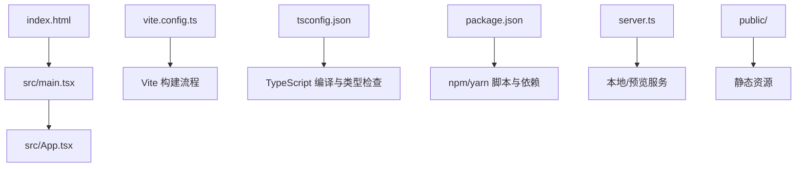
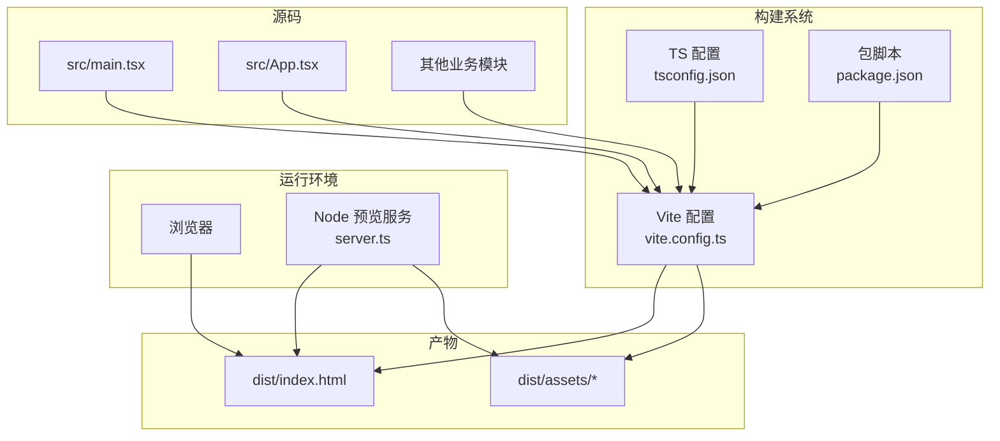
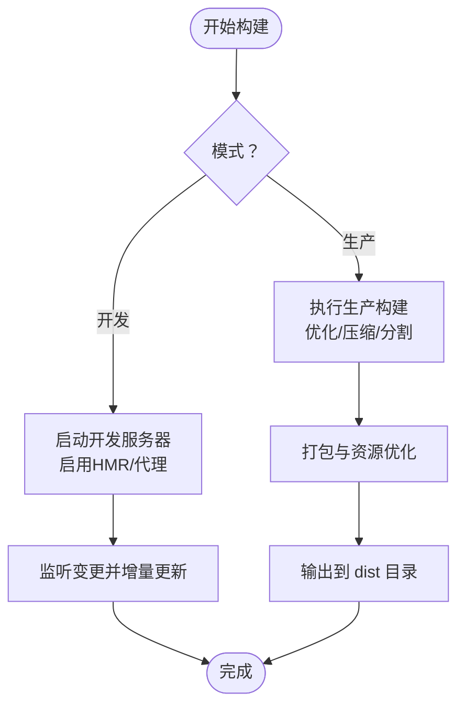
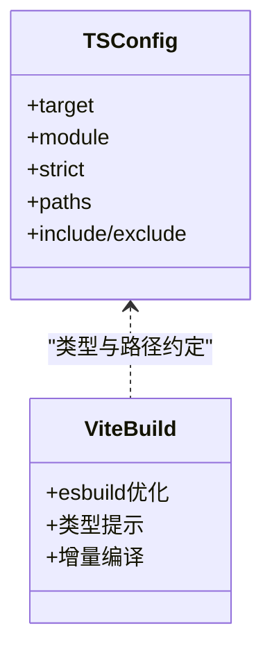
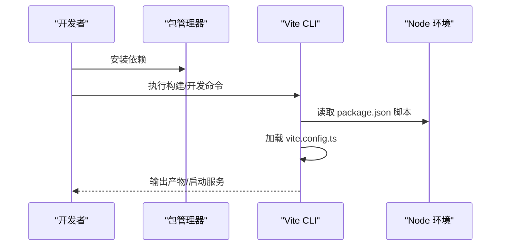
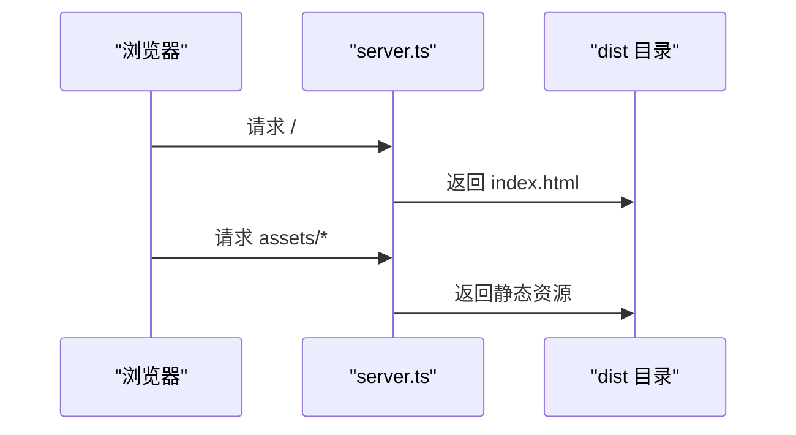
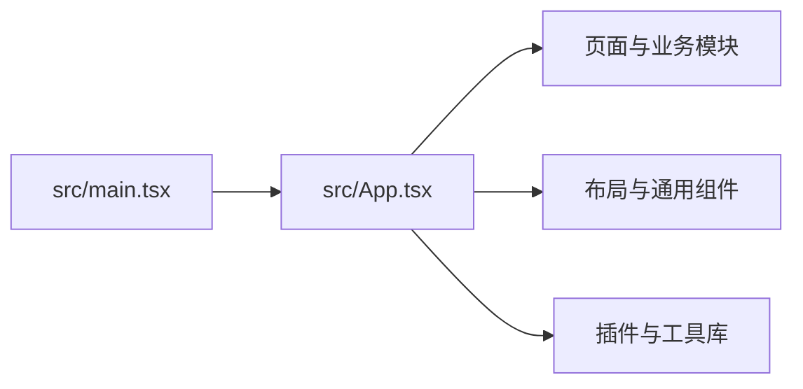
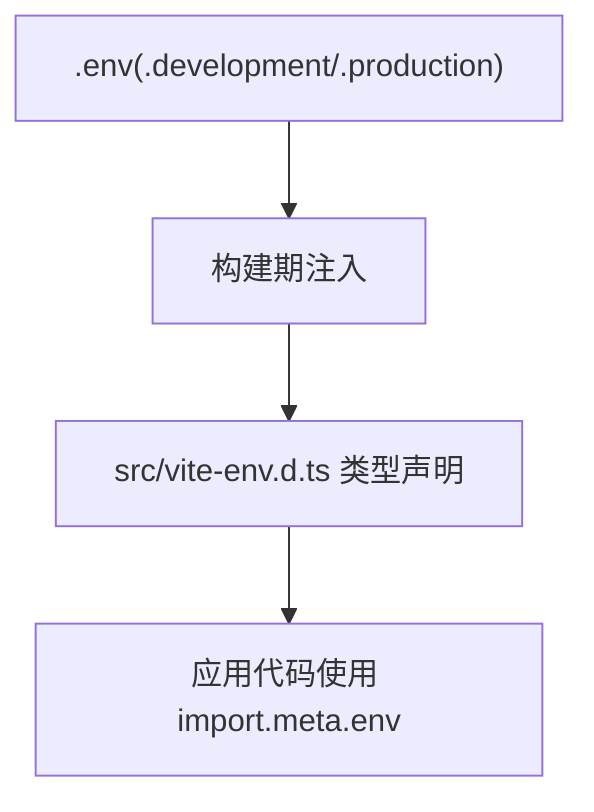
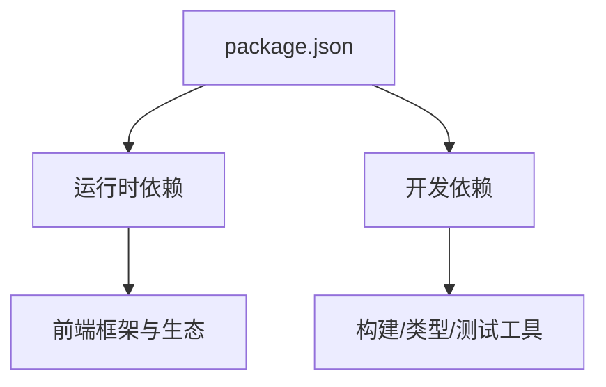

# 构建与部署架构

<cite>
**本文引用的文件**   
- [vite.config.ts](file://vite.config.ts)
- [tsconfig.json](file://tsconfig.json)
- [package.json](file://package.json)
- [server.ts](file://server.ts)
- [index.html](file://index.html)
- [src/main.tsx](file://src/main.tsx)
- [src/App.tsx](file://src/App.tsx)
- [src/vite-env.d.ts](file://src/vite-env.d.ts)
</cite>

## 目录
1. [简介](#简介)
2. [项目结构](#项目结构)
3. [核心组件](#核心组件)
4. [架构总览](#架构总览)
5. [详细组件分析](#详细组件分析)
6. [依赖关系分析](#依赖关系分析)
7. [性能考虑](#性能考虑)
8. [故障排查指南](#故障排查指南)
9. [结论](#结论)
10. [附录](#附录)

## 简介
本文件面向Supply OS的前端工程，聚焦于构建与部署架构。内容覆盖Vite构建配置、TypeScript编译选项、开发服务器与热重载机制、生产环境优化（代码分割与资源压缩）、环境变量管理、配置文件组织、部署拓扑设计，以及CI/CD流水线建议、监控日志与排障要点、性能调优与运维最佳实践。文档以仓库现有源码为依据，提供可落地的工程化指导。

## 项目结构
仓库采用典型的前端单页应用结构：
- 入口与页面：index.html、src/main.tsx、src/App.tsx
- 构建与类型：vite.config.ts、tsconfig.json、src/vite-env.d.ts
- 包管理与脚本：package.json
- 服务端与静态资源：server.ts、public/

图表来源
- [index.html:1-200](file://index.html#L1-L200)
- [src/main.tsx:1-200](file://src/main.tsx#L1-L200)
- [src/App.tsx:1-200](file://src/App.tsx#L1-L200)
- [vite.config.ts:1-200](file://vite.config.ts#L1-L200)
- [tsconfig.json:1-200](file://tsconfig.json#L1-L200)
- [package.json:1-200](file://package.json#L1-L200)
- [server.ts:1-200](file://server.ts#L1-L200)

章节来源
- [index.html:1-200](file://index.html#L1-L200)
- [src/main.tsx:1-200](file://src/main.tsx#L1-L200)
- [src/App.tsx:1-200](file://src/App.tsx#L1-L200)
- [vite.config.ts:1-200](file://vite.config.ts#L1-L200)
- [tsconfig.json:1-200](file://tsconfig.json#L1-L200)
- [package.json:1-200](file://package.json#L1-L200)
- [server.ts:1-200](file://server.ts#L1-L200)

## 核心组件
本节聚焦构建与运行期的关键构件及其职责：
- Vite 构建配置：定义开发/生产构建行为、插件、输出目录、代理等
- TypeScript 编译选项：语言特性、模块解析、严格性与路径映射
- 包管理与脚本：依赖声明、构建/启动/测试脚本、版本策略
- 本地/预览服务：用于开发调试或静态托管的轻量服务
- 应用入口与根组件：挂载点、路由与业务模块的组织方式
- 类型声明与环境变量：扩展全局类型、注入构建期环境变量

章节来源
- [vite.config.ts:1-200](file://vite.config.ts#L1-L200)
- [tsconfig.json:1-200](file://tsconfig.json#L1-L200)
- [package.json:1-200](file://package.json#L1-L200)
- [server.ts:1-200](file://server.ts#L1-L200)
- [src/main.tsx:1-200](file://src/main.tsx#L1-L200)
- [src/App.tsx:1-200](file://src/App.tsx#L1-L200)
- [src/vite-env.d.ts:1-200](file://src/vite-env.d.ts#L1-L200)

## 架构总览
下图展示从源码到产物再到运行的整体链路，包括开发模式与生产模式的差异。

图表来源
- [vite.config.ts:1-200](file://vite.config.ts#L1-L200)
- [tsconfig.json:1-200](file://tsconfig.json#L1-L200)
- [package.json:1-200](file://package.json#L1-L200)
- [server.ts:1-200](file://server.ts#L1-L200)
- [src/main.tsx:1-200](file://src/main.tsx#L1-L200)
- [src/App.tsx:1-200](file://src/App.tsx#L1-L200)

## 详细组件分析

### Vite 构建配置
- 构建目标与平台：根据运行环境选择目标平台与目标版本，确保兼容性与体积控制
- 插件体系：按需引入UI库、样式预处理、图片处理、路由懒加载等插件
- 开发服务器：端口、主机、自动打开浏览器、HMR、代理转发后端接口
- 生产构建：输出目录、资源命名策略、代码分割、预加载/预取、SourceMap
- 别名与路径映射：统一模块导入路径，提升可读性与维护性
- 环境变量注入：通过构建时注入环境变量，区分开发与生产行为

图表来源
- [vite.config.ts:1-200](file://vite.config.ts#L1-L200)

章节来源
- [vite.config.ts:1-200](file://vite.config.ts#L1-L200)

### TypeScript 编译选项
- 语言级别与模块系统：指定目标JS版本与模块解析策略
- 严格性与类型检查：开启严格模式、空值检查、函数参数校验等
- 路径映射与类型声明：配合别名与第三方类型声明，提升开发体验
- 排除与包含：精准控制参与编译的文件范围，减少无关开销
- 与Vite集成：利用Vite内置esbuild进行快速编译，tsconfig仅用于IDE与类型检查

图表来源
- [tsconfig.json:1-200](file://tsconfig.json#L1-L200)
- [vite.config.ts:1-200](file://vite.config.ts#L1-L200)

章节来源
- [tsconfig.json:1-200](file://tsconfig.json#L1-L200)

### 包管理与脚本
- 依赖声明：运行时与开发依赖分离，锁定版本避免漂移
- 脚本命令：开发、构建、预览、类型检查、测试等标准化命令
- 版本策略：主/次/补丁版本与发布标签管理
- 工作流集成：与CI/CD、包管理器缓存、镜像源配置联动

图表来源
- [package.json:1-200](file://package.json#L1-L200)
- [vite.config.ts:1-200](file://vite.config.ts#L1-L200)

章节来源
- [package.json:1-200](file://package.json#L1-L200)

### 本地/预览服务
- 开发服务器：提供热重载、接口代理、静态资源服务
- 预览服务：在构建后提供本地预览能力，便于联调与演示
- 静态托管：将dist目录作为静态站点根目录，配合反向代理对外暴露

图表来源
- [server.ts:1-200](file://server.ts#L1-L200)
- [index.html:1-200](file://index.html#L1-L200)

章节来源
- [server.ts:1-200](file://server.ts#L1-L200)
- [index.html:1-200](file://index.html#L1-L200)

### 应用入口与根组件
- 入口文件：创建根节点、渲染根组件、注册全局插件与中间件
- 根组件：组织路由、布局、国际化、主题与错误边界
- 模块划分：按功能域拆分页面与组件，支持按需加载

图表来源
- [src/main.tsx:1-200](file://src/main.tsx#L1-L200)
- [src/App.tsx:1-200](file://src/App.tsx#L1-L200)

章节来源
- [src/main.tsx:1-200](file://src/main.tsx#L1-L200)
- [src/App.tsx:1-200](file://src/App.tsx#L1-L200)

### 类型声明与环境变量
- 类型声明：为Vite注入的环境变量与第三方库补充类型信息
- 环境变量：区分开发/测试/生产环境，控制API地址、功能开关、埋点等

图表来源
- [src/vite-env.d.ts:1-200](file://src/vite-env.d.ts#L1-L200)
- [vite.config.ts:1-200](file://vite.config.ts#L1-L200)

章节来源
- [src/vite-env.d.ts:1-200](file://src/vite-env.d.ts#L1-L200)
- [vite.config.ts:1-200](file://vite.config.ts#L1-L200)

## 依赖关系分析
- 直接依赖：框架、UI库、网络与状态管理等运行时依赖
- 开发依赖：构建工具、类型检查、测试与代码质量工具
- 间接依赖：由包管理器解析并缓存，影响构建速度与稳定性
- 冲突与升级：通过锁定文件与语义化版本策略降低风险

图表来源
- [package.json:1-200](file://package.json#L1-L200)

章节来源
- [package.json:1-200](file://package.json#L1-L200)

## 性能考虑
- 构建优化
  - 启用生产模式下的代码压缩、Tree Shaking与死代码消除
  - 合理配置代码分割，按路由或大模块切分，减少首屏体积
  - 资源命名与缓存策略，结合HTTP缓存头提升重复访问速度
  - 预加载与预取关键资源，缩短关键路径
- 运行期优化
  - 按需加载与懒加载，延迟非关键逻辑
  - 图片与媒体资源压缩与格式转换
  - 合理使用缓存与Service Worker（如需要）
- 开发体验优化
  - 增量构建与HMR，缩短反馈周期
  - 并行任务与缓存加速（包管理器与构建工具缓存）

[本节为通用性能建议，不直接分析具体文件]

## 故障排查指南
- 构建失败
  - 检查TypeScript类型错误与路径映射是否正确
  - 确认Vite插件与依赖版本兼容性
  - 查看构建日志定位具体模块或资源问题
- 运行时报错
  - 核对环境变量是否注入正确，区分环境前缀
  - 检查跨域与代理配置，确认后端接口可达
  - 审查路由与动态导入是否存在循环依赖
- 性能问题
  - 使用浏览器性能面板分析首屏与长任务
  - 检查大包与未使用的依赖，优化分包策略
  - 评估网络请求与缓存命中情况

章节来源
- [vite.config.ts:1-200](file://vite.config.ts#L1-L200)
- [tsconfig.json:1-200](file://tsconfig.json#L1-L200)
- [package.json:1-200](file://package.json#L1-L200)
- [server.ts:1-200](file://server.ts#L1-L200)

## 结论
通过对Vite构建配置、TypeScript编译选项、包管理与脚本、本地/预览服务、应用入口与类型环境的系统化梳理，Supply OS具备了清晰的构建与部署基线。在生产环境中，应重点落实代码分割、资源压缩与缓存策略；在开发环境中，强化HMR与代理能力以提升效率。结合CI/CD流水线与监控日志，可实现稳定高效的交付与运维闭环。

[本节为总结性内容，不直接分析具体文件]

## 附录
- CI/CD流水线建议
  - 阶段划分：依赖安装、类型检查、单元测试、构建、制品上传
  - 缓存策略：缓存node_modules与构建缓存目录，缩短流水线时长
  - 多环境构建：基于环境变量生成不同构建产物
  - 安全扫描：依赖漏洞扫描与许可证合规检查
- 监控与日志
  - 前端错误上报与性能指标采集
  - 构建产物指纹与版本追踪
  - 访问日志与错误日志集中收集
- 运维最佳实践
  - 灰度发布与回滚策略
  - 静态资源CDN与边缘缓存
  - 健康检查与优雅降级

[本节为概念性内容，不直接分析具体文件]