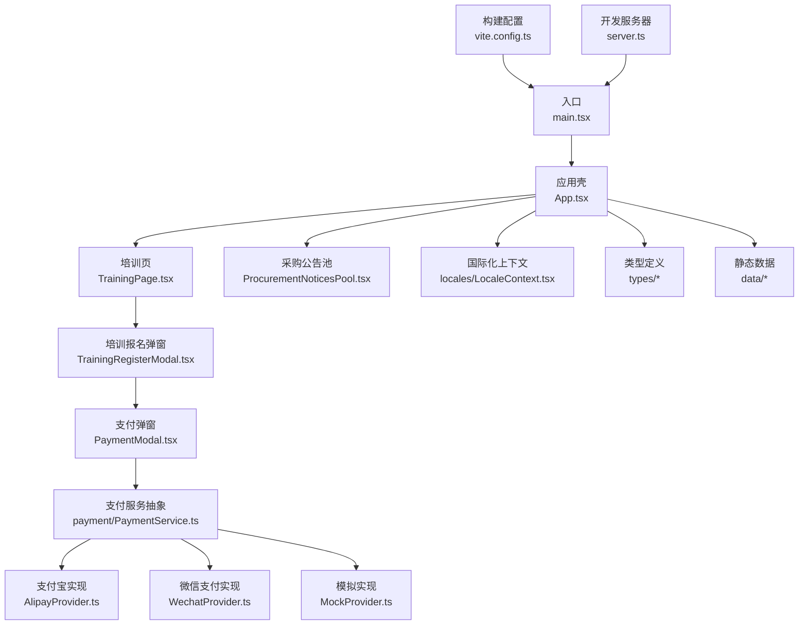
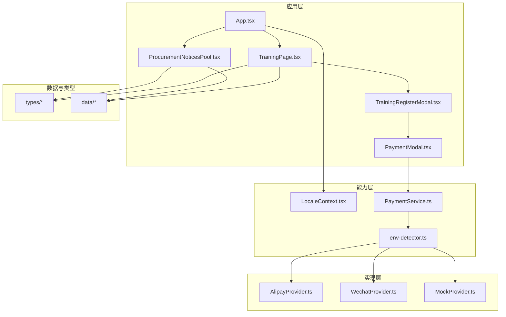
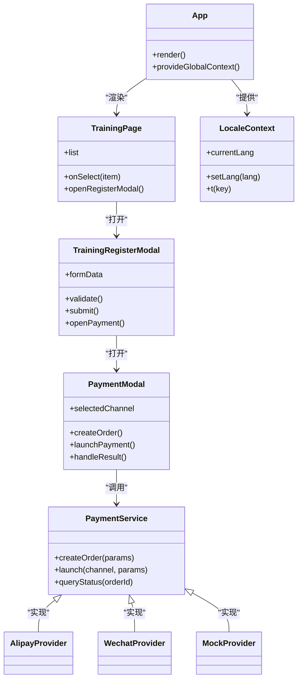
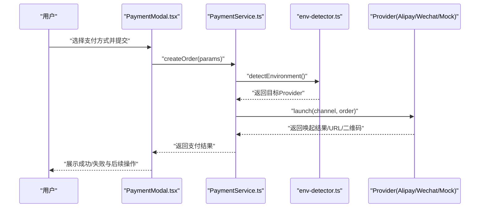
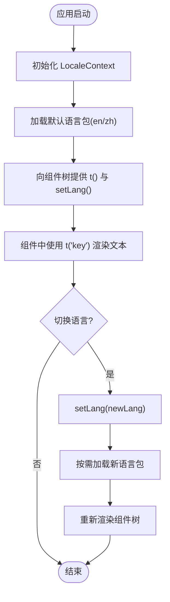
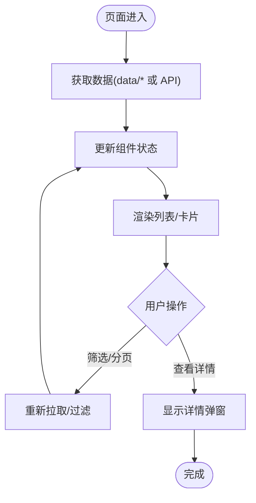
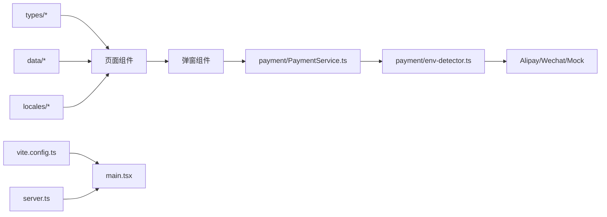
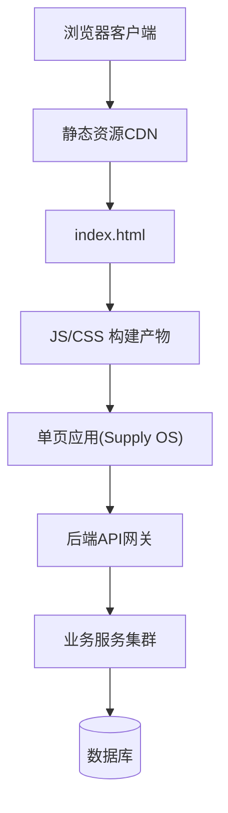

# 架构设计

<cite>
**本文引用的文件**   
- [App.tsx](file://src/App.tsx)
- [main.tsx](file://src/main.tsx)
- [PaymentModal.tsx](file://src/PaymentModal.tsx)
- [ProcurementNoticesPool.tsx](file://src/ProcurementNoticesPool.tsx)
- [TrainingPage.tsx](file://src/TrainingPage.tsx)
- [TrainingRegisterModal.tsx](file://src/TrainingRegisterModal.tsx)
- [index.css](file://src/index.css)
- [vite.config.ts](file://vite.config.ts)
- [server.ts](file://server.ts)
- [package.json](file://package.json)
- [metadata.json](file://metadata.json)
- [index.html](file://index.html)
- [types/index.ts](file://src/types/index.ts)
- [types/auth.ts](file://src/types/auth.ts)
- [types/crm.ts](file://src/types/crm.ts)
- [types/exhibition.ts](file://src/types/exhibition.ts)
- [types/learning.ts](file://src/types/learning.ts)
- [types/membership.ts](file://src/types/membership.ts)
- [types/payment.ts](file://src/types/payment.ts)
- [types/procurement.ts](file://src/types/procurement.ts)
- [types/supplier.ts](file://src/types/supplier.ts)
- [locales/LocaleContext.tsx](file://src/locales/LocaleContext.tsx)
- [locales/en.json](file://src/locales/en.json)
- [locales/zh.json](file://src/locales/zh.json)
- [locales/types.ts](file://src/locales/types.ts)
- [payment/PaymentService.ts](file://src/payment/PaymentService.ts)
- [payment/AlipayProvider.ts](file://src/payment/AlipayProvider.ts)
- [payment/WechatProvider.ts](file://src/payment/WechatProvider.ts)
- [payment/MockProvider.ts](file://src/payment/MockProvider.ts)
- [payment/env-detector.ts](file://src/payment/env-detector.ts)
- [payment/types.ts](file://src/payment/types.ts)
- [data/index.ts](file://src/data/index.ts)
- [data/exhibition-halls.ts](file://src/data/exhibition-halls.ts)
- [data/materials.ts](file://src/data/materials.ts)
- [data/opportunities.ts](file://src/data/opportunities.ts)
- [data/suppliers.ts](file://src/data/suppliers.ts)
</cite>

## 目录
1. [引言](#引言)
2. [项目结构](#项目结构)
3. [核心组件](#核心组件)
4. [架构总览](#架构总览)
5. [详细组件分析](#详细组件分析)
6. [依赖分析](#依赖分析)
7. [性能考虑](#性能考虑)
8. [故障排查指南](#故障排查指南)
9. [结论](#结论)
10. [附录](#附录)

## 引言
本文件为 Supply OS 的架构设计文档，面向产品、前端与后端工程师以及运维人员。文档从系统边界、模块化原则、组件层次、状态管理与数据流、支付抽象层与 Provider 模式、国际化体系、技术决策权衡、性能优化策略、可扩展性设计与部署拓扑等维度进行系统化阐述，帮助读者快速理解并扩展系统。

## 项目结构
Supply OS 采用基于功能域的前端工程化组织方式：
- 应用入口与路由挂载：位于 src 根目录下的 main.tsx 与 App.tsx
- 业务页面与弹窗：TrainingPage、TrainingRegisterModal、ProcurementNoticesPool、PaymentModal
- 领域类型定义：src/types 下按模块划分（auth、crm、exhibition、learning、membership、payment、procurement、supplier）
- 国际化：src/locales 提供上下文、语言包与类型
- 支付服务抽象：src/payment 提供统一接口与多实现（支付宝、微信、Mock），并提供环境探测
- 静态数据：src/data 提供演示用数据源
- 构建与运行：vite.config.ts、server.ts、package.json、index.html、metadata.json

图表来源
- [main.tsx:1-200](file://src/main.tsx#L1-L200)
- [App.tsx:1-200](file://src/App.tsx#L1-L200)
- [TrainingPage.tsx:1-200](file://src/TrainingPage.tsx#L1-L200)
- [TrainingRegisterModal.tsx:1-200](file://src/TrainingRegisterModal.tsx#L1-L200)
- [PaymentModal.tsx:1-200](file://src/PaymentModal.tsx#L1-L200)
- [payment/PaymentService.ts:1-200](file://src/payment/PaymentService.ts#L1-L200)
- [payment/AlipayProvider.ts:1-200](file://src/payment/AlipayProvider.ts#L1-L200)
- [payment/WechatProvider.ts:1-200](file://src/payment/WechatProvider.ts#L1-L200)
- [payment/MockProvider.ts:1-200](file://src/payment/MockProvider.ts#L1-L200)
- [locales/LocaleContext.tsx:1-200](file://src/locales/LocaleContext.tsx#L1-L200)
- [vite.config.ts:1-200](file://vite.config.ts#L1-L200)
- [server.ts:1-200](file://server.ts#L1-L200)

章节来源
- [main.tsx:1-200](file://src/main.tsx#L1-L200)
- [App.tsx:1-200](file://src/App.tsx#L1-L200)
- [vite.config.ts:1-200](file://vite.config.ts#L1-L200)
- [server.ts:1-200](file://server.ts#L1-L200)

## 核心组件
- 应用壳与路由挂载
  - 负责初始化全局上下文（如国际化）、挂载根组件、注入必要的全局样式与资源
  - 作为顶层 Provider 容器，向下传递主题、语言、支付能力等
- 业务页面
  - TrainingPage：展示培训课程列表、筛选与详情；触发报名流程
  - ProcurementNoticesPool：展示采购公告聚合视图，支持分页与筛选
- 交互弹窗
  - TrainingRegisterModal：收集报名信息，校验表单，发起支付或提交订单
  - PaymentModal：封装支付渠道选择、唤起支付、结果回调与错误处理
- 支付抽象层
  - 通过统一接口暴露创建订单、唤起支付、查询状态、关闭等能力
  - 多 Provider 实现（支付宝、微信、Mock），由环境探测决定具体实现
- 国际化
  - 通过 Context 提供当前语言与切换方法，组件按需消费翻译键值
- 类型系统与数据
  - types 目录集中管理领域模型与 API 契约
  - data 目录提供演示数据，便于本地开发与联调

章节来源
- [App.tsx:1-200](file://src/App.tsx#L1-L200)
- [TrainingPage.tsx:1-200](file://src/TrainingPage.tsx#L1-L200)
- [ProcurementNoticesPool.tsx:1-200](file://src/ProcurementNoticesPool.tsx#L1-L200)
- [TrainingRegisterModal.tsx:1-200](file://src/TrainingRegisterModal.tsx#L1-L200)
- [PaymentModal.tsx:1-200](file://src/PaymentModal.tsx#L1-L200)
- [payment/PaymentService.ts:1-200](file://src/payment/PaymentService.ts#L1-L200)
- [payment/env-detector.ts:1-200](file://src/payment/env-detector.ts#L1-L200)
- [locales/LocaleContext.tsx:1-200](file://src/locales/LocaleContext.tsx#L1-L200)
- [types/index.ts:1-200](file://src/types/index.ts#L1-L200)
- [data/index.ts:1-200](file://src/data/index.ts#L1-L200)

## 架构总览
系统采用“应用壳 + 页面 + 弹窗”的分层结构，配合 Provider 模式注入跨切面能力（国际化、支付）。数据流遵循单向数据流：用户交互触发状态变更，状态驱动 UI 更新；支付流程通过抽象层屏蔽渠道差异。

图表来源
- [App.tsx:1-200](file://src/App.tsx#L1-L200)
- [TrainingPage.tsx:1-200](file://src/TrainingPage.tsx#L1-L200)
- [ProcurementNoticesPool.tsx:1-200](file://src/ProcurementNoticesPool.tsx#L1-L200)
- [TrainingRegisterModal.tsx:1-200](file://src/TrainingRegisterModal.tsx#L1-L200)
- [PaymentModal.tsx:1-200](file://src/PaymentModal.tsx#L1-L200)
- [locales/LocaleContext.tsx:1-200](file://src/locales/LocaleContext.tsx#L1-L200)
- [payment/PaymentService.ts:1-200](file://src/payment/PaymentService.ts#L1-L200)
- [payment/env-detector.ts:1-200](file://src/payment/env-detector.ts#L1-L200)
- [payment/AlipayProvider.ts:1-200](file://src/payment/AlipayProvider.ts#L1-L200)
- [payment/WechatProvider.ts:1-200](file://src/payment/WechatProvider.ts#L1-L200)
- [payment/MockProvider.ts:1-200](file://src/payment/MockProvider.ts#L1-L200)
- [types/index.ts:1-200](file://src/types/index.ts#L1-L200)
- [data/index.ts:1-200](file://src/data/index.ts#L1-L200)

## 详细组件分析

### React 组件架构模式
- 分层职责
  - 页面组件：承载业务视图与交互逻辑，尽量保持无副作用
  - 弹窗组件：聚焦单一任务（如报名、支付），通过 props 与回调与父组件通信
  - 能力提供者：以 Provider 形式注入全局能力（国际化、支付）
- 状态管理策略
  - 局部状态：使用 React 内置状态管理组件内短期状态
  - 跨组件共享：通过 Context 提供语言、主题等全局能力
  - 服务端数据：在页面组件中发起请求，结合缓存与重试策略提升体验
- 数据流设计
  - 用户事件 -> 组件状态更新 -> 子组件受控渲染
  - 异步流程（如支付）：Promise/async-await 链式处理，统一错误边界与提示

图表来源
- [App.tsx:1-200](file://src/App.tsx#L1-L200)
- [TrainingPage.tsx:1-200](file://src/TrainingPage.tsx#L1-L200)
- [TrainingRegisterModal.tsx:1-200](file://src/TrainingRegisterModal.tsx#L1-L200)
- [PaymentModal.tsx:1-200](file://src/PaymentModal.tsx#L1-L200)
- [locales/LocaleContext.tsx:1-200](file://src/locales/LocaleContext.tsx#L1-L200)
- [payment/PaymentService.ts:1-200](file://src/payment/PaymentService.ts#L1-L200)
- [payment/AlipayProvider.ts:1-200](file://src/payment/AlipayProvider.ts#L1-L200)
- [payment/WechatProvider.ts:1-200](file://src/payment/WechatProvider.ts#L1-L200)
- [payment/MockProvider.ts:1-200](file://src/payment/MockProvider.ts#L1-L200)

章节来源
- [App.tsx:1-200](file://src/App.tsx#L1-L200)
- [TrainingPage.tsx:1-200](file://src/TrainingPage.tsx#L1-L200)
- [TrainingRegisterModal.tsx:1-200](file://src/TrainingRegisterModal.tsx#L1-L200)
- [PaymentModal.tsx:1-200](file://src/PaymentModal.tsx#L1-L200)
- [locales/LocaleContext.tsx:1-200](file://src/locales/LocaleContext.tsx#L1-L200)

### 支付服务抽象层与 Provider 模式
- 设计理念
  - 统一接口：对外暴露一致的订单创建、唤起支付、状态查询等方法
  - 可插拔实现：通过 Provider 模式将不同支付渠道解耦，新增渠道无需改动调用方
  - 环境探测：根据运行环境自动选择合适实现（生产/测试/本地）
- Provider 模式实现
  - 环境探测器返回目标 Provider 实例
  - 支付服务持有 Provider 引用，转发调用
  - 各 Provider 实现渠道特定逻辑（参数组装、唤起、回调解析）

图表来源
- [PaymentModal.tsx:1-200](file://src/PaymentModal.tsx#L1-L200)
- [payment/PaymentService.ts:1-200](file://src/payment/PaymentService.ts#L1-L200)
- [payment/env-detector.ts:1-200](file://src/payment/env-detector.ts#L1-L200)
- [payment/AlipayProvider.ts:1-200](file://src/payment/AlipayProvider.ts#L1-L200)
- [payment/WechatProvider.ts:1-200](file://src/payment/WechatProvider.ts#L1-L200)
- [payment/MockProvider.ts:1-200](file://src/payment/MockProvider.ts#L1-L200)

章节来源
- [payment/PaymentService.ts:1-200](file://src/payment/PaymentService.ts#L1-L200)
- [payment/env-detector.ts:1-200](file://src/payment/env-detector.ts#L1-L200)
- [payment/AlipayProvider.ts:1-200](file://src/payment/AlipayProvider.ts#L1-L200)
- [payment/WechatProvider.ts:1-200](file://src/payment/WechatProvider.ts#L1-L200)
- [payment/MockProvider.ts:1-200](file://src/payment/MockProvider.ts#L1-L200)

### 国际化系统架构与扩展机制
- 架构要点
  - 上下文提供：LocaleContext 维护当前语言与翻译函数
  - 语言包：en.json、zh.json 存放键值对，按模块拆分便于维护
  - 类型约束：locales/types.ts 定义翻译键类型，避免拼写错误
- 扩展机制
  - 新增语言：添加对应 JSON 文件并在上下文注册
  - 新增键：在类型文件中声明键，确保编译期检查
  - 动态加载：可按需懒加载语言包，减少首屏体积

图表来源
- [locales/LocaleContext.tsx:1-200](file://src/locales/LocaleContext.tsx#L1-L200)
- [locales/en.json:1-200](file://src/locales/en.json#L1-L200)
- [locales/zh.json:1-200](file://src/locales/zh.json#L1-L200)
- [locales/types.ts:1-200](file://src/locales/types.ts#L1-L200)

章节来源
- [locales/LocaleContext.tsx:1-200](file://src/locales/LocaleContext.tsx#L1-L200)
- [locales/en.json:1-200](file://src/locales/en.json#L1-L200)
- [locales/zh.json:1-200](file://src/locales/zh.json#L1-L200)
- [locales/types.ts:1-200](file://src/locales/types.ts#L1-L200)

### 数据处理流程与数据源
- 数据源组织
  - data/index.ts 汇总导出，供页面按需引入
  - 各模块数据文件（展览厅、材料、机会、供应商）提供结构化示例数据
- 页面数据流
  - 页面组件在挂载时拉取数据（或读取本地数据）
  - 通过状态管理渲染列表与详情
  - 支持分页、筛选与搜索

图表来源
- [data/index.ts:1-200](file://src/data/index.ts#L1-L200)
- [data/exhibition-halls.ts:1-200](file://src/data/exhibition-halls.ts#L1-L200)
- [data/materials.ts:1-200](file://src/data/materials.ts#L1-L200)
- [data/opportunities.ts:1-200](file://src/data/opportunities.ts#L1-L200)
- [data/suppliers.ts:1-200](file://src/data/suppliers.ts#L1-L200)
- [TrainingPage.tsx:1-200](file://src/TrainingPage.tsx#L1-L200)
- [ProcurementNoticesPool.tsx:1-200](file://src/ProcurementNoticesPool.tsx#L1-L200)

章节来源
- [data/index.ts:1-200](file://src/data/index.ts#L1-L200)
- [TrainingPage.tsx:1-200](file://src/TrainingPage.tsx#L1-L200)
- [ProcurementNoticesPool.tsx:1-200](file://src/ProcurementNoticesPool.tsx#L1-L200)

## 依赖分析
- 内部依赖
  - 页面组件依赖类型定义与数据源
  - 弹窗组件依赖支付服务与国际化上下文
  - 支付服务依赖环境探测与各 Provider 实现
- 外部依赖
  - Vite 构建工具与开发服务器
  - React 生态（组件、Hooks、Context）
  - 第三方支付 SDK（由 Provider 实现引入）

图表来源
- [types/index.ts:1-200](file://src/types/index.ts#L1-L200)
- [data/index.ts:1-200](file://src/data/index.ts#L1-L200)
- [locales/LocaleContext.tsx:1-200](file://src/locales/LocaleContext.tsx#L1-L200)
- [TrainingPage.tsx:1-200](file://src/TrainingPage.tsx#L1-L200)
- [TrainingRegisterModal.tsx:1-200](file://src/TrainingRegisterModal.tsx#L1-L200)
- [PaymentModal.tsx:1-200](file://src/PaymentModal.tsx#L1-L200)
- [payment/PaymentService.ts:1-200](file://src/payment/PaymentService.ts#L1-L200)
- [payment/env-detector.ts:1-200](file://src/payment/env-detector.ts#L1-L200)
- [payment/AlipayProvider.ts:1-200](file://src/payment/AlipayProvider.ts#L1-L200)
- [payment/WechatProvider.ts:1-200](file://src/payment/WechatProvider.ts#L1-L200)
- [payment/MockProvider.ts:1-200](file://src/payment/MockProvider.ts#L1-L200)
- [vite.config.ts:1-200](file://vite.config.ts#L1-L200)
- [server.ts:1-200](file://server.ts#L1-L200)
- [main.tsx:1-200](file://src/main.tsx#L1-L200)

章节来源
- [package.json:1-200](file://package.json#L1-L200)
- [vite.config.ts:1-200](file://vite.config.ts#L1-L200)
- [server.ts:1-200](file://server.ts#L1-L200)

## 性能考虑
- 构建与打包
  - 使用 Vite 进行快速构建与热更新，合理配置代码分割与懒加载
  - 静态资源与字体按需引入，减少首屏体积
- 运行时优化
  - 列表虚拟化与分页加载，避免一次性渲染大量节点
  - 图片与媒体资源压缩与懒加载
  - 支付弹窗与复杂表单使用受控组件的最小化重渲染策略
- 网络与缓存
  - 对只读数据启用浏览器缓存与服务端缓存头
  - 失败重试与退避策略，提升弱网稳定性

[本节为通用指导，不直接分析具体文件]

## 故障排查指南
- 常见问题定位
  - 支付唤起失败：检查环境探测是否正确返回目标 Provider，核对渠道参数与回调地址
  - 国际化缺失键：确认 locales/types.ts 是否包含该键，语言包是否已加载
  - 数据为空或异常：检查 data/* 数据结构与页面字段映射，确认网络请求与错误边界
- 调试建议
  - 在关键路径增加日志输出（如支付流程、语言切换）
  - 使用浏览器开发者工具监控网络与状态变化
  - 针对支付渠道，分别使用 MockProvider 与沙箱环境验证

章节来源
- [payment/env-detector.ts:1-200](file://src/payment/env-detector.ts#L1-L200)
- [payment/PaymentService.ts:1-200](file://src/payment/PaymentService.ts#L1-L200)
- [locales/LocaleContext.tsx:1-200](file://src/locales/LocaleContext.tsx#L1-L200)
- [PaymentModal.tsx:1-200](file://src/PaymentModal.tsx#L1-L200)

## 结论
Supply OS 通过清晰的组件分层、Provider 模式的能力注入与统一的支付抽象层，实现了高内聚、低耦合的前端架构。国际化体系具备良好扩展性，数据流遵循单向数据流原则，易于维护与测试。建议在后续迭代中持续完善错误边界、性能监控与自动化测试，以提升系统稳定性与可观测性。

[本节为总结性内容，不直接分析具体文件]

## 附录

### 基础设施要求
- Node.js 版本：与 package.json 中 engines 字段保持一致
- 包管理器：npm/yarn/pnpm（任选其一）
- 构建工具：Vite
- 开发服务器：自定义 server.ts 或集成到代理

章节来源
- [package.json:1-200](file://package.json#L1-L200)
- [vite.config.ts:1-200](file://vite.config.ts#L1-L200)
- [server.ts:1-200](file://server.ts#L1-L200)

### 部署拓扑图

[此图为概念性拓扑，未直接映射具体源码文件]

### 元数据与站点信息
- metadata.json：用于站点元信息与 SEO 相关配置
- index.html：应用入口 HTML，注入构建产物

章节来源
- [metadata.json:1-200](file://metadata.json#L1-L200)
- [index.html:1-200](file://index.html#L1-L200)