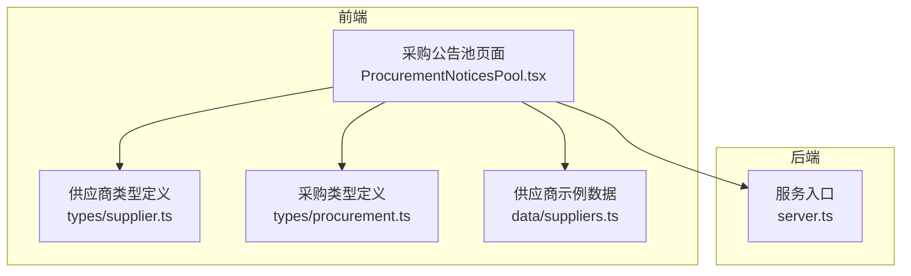
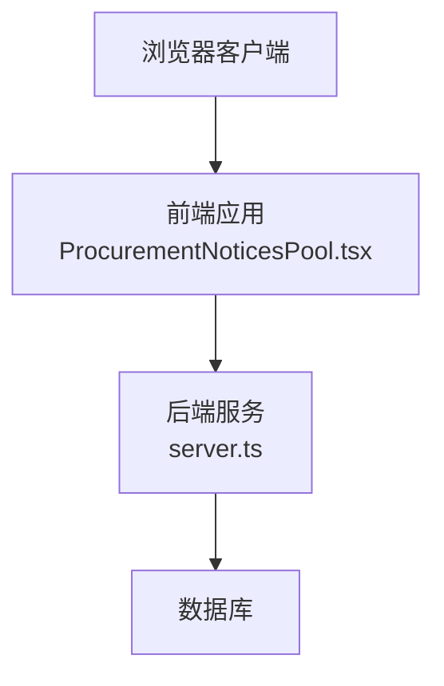
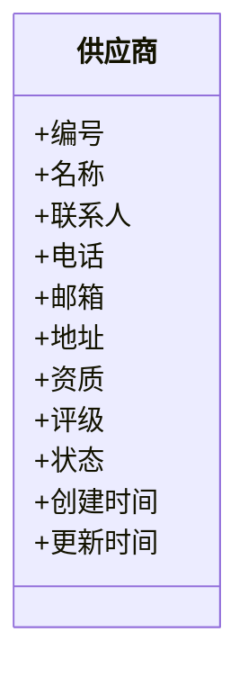
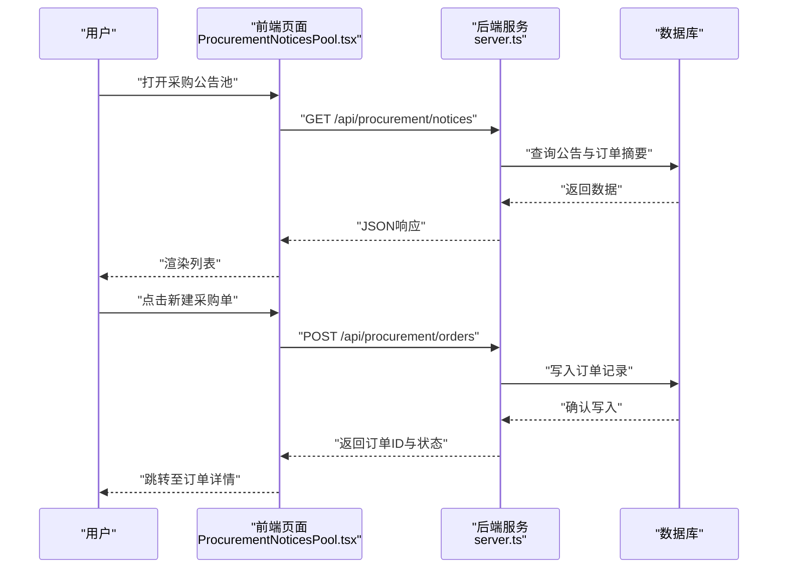
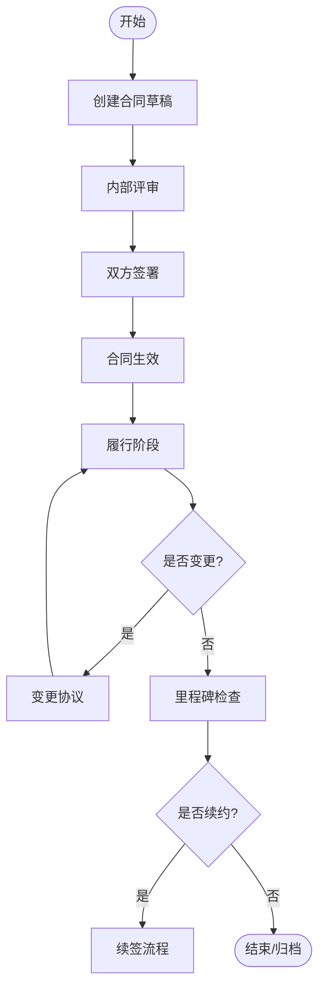
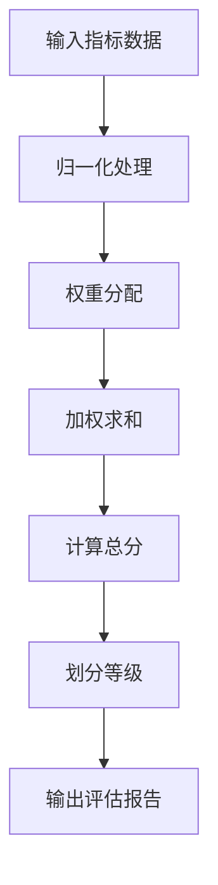
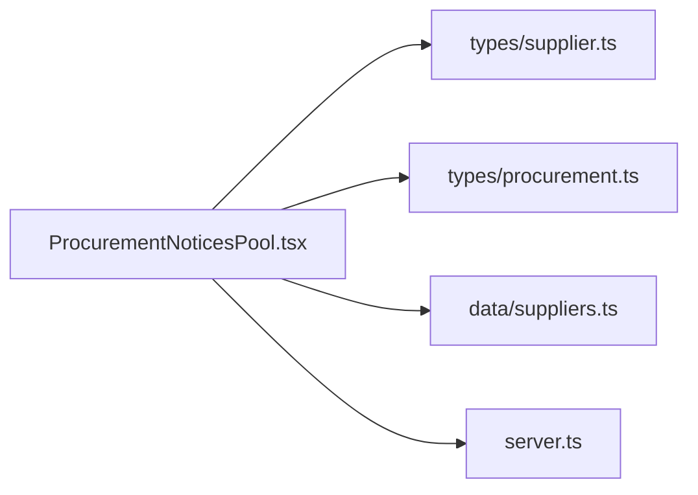

# 供应链管理系统

<cite>
**本文引用的文件**   
- [src/types/supplier.ts](file://src/types/supplier.ts)
- [src/types/procurement.ts](file://src/types/procurement.ts)
- [src/data/suppliers.ts](file://src/data/suppliers.ts)
- [src/ProcurementNoticesPool.tsx](file://src/ProcurementNoticesPool.tsx)
- [server.ts](file://server.ts)
- [package.json](file://package.json)
</cite>

## 目录
1. [简介](#简介)
2. [项目结构](#项目结构)
3. [核心组件](#核心组件)
4. [架构总览](#架构总览)
5. [详细组件分析](#详细组件分析)
6. [依赖关系分析](#依赖关系分析)
7. [性能考虑](#性能考虑)
8. [故障排查指南](#故障排查指南)
9. [结论](#结论)
10. [附录](#附录)

## 简介
本文件为“供应链管理模块”的开发者文档，聚焦供应商管理、采购订单处理与合同跟踪等核心能力。文档从数据模型设计、业务逻辑实现、用户界面交互到API接口定义、数据验证规则与错误处理机制进行系统化阐述，并提供扩展指导与最佳实践建议，帮助开发者快速理解并二次开发该模块。

## 项目结构
供应链相关代码主要分布在以下位置：
- 类型定义：src/types/supplier.ts、src/types/procurement.ts
- 示例数据：src/data/suppliers.ts
- 前端页面：src/ProcurementNoticesPool.tsx
- 服务端入口：server.ts
- 构建与运行配置：package.json

图表来源
- [src/ProcurementNoticesPool.tsx](file://src/ProcurementNoticesPool.tsx)
- [src/types/supplier.ts](file://src/types/supplier.ts)
- [src/types/procurement.ts](file://src/types/procurement.ts)
- [src/data/suppliers.ts](file://src/data/suppliers.ts)
- [server.ts](file://server.ts)

章节来源
- [src/types/supplier.ts](file://src/types/supplier.ts)
- [src/types/procurement.ts](file://src/types/procurement.ts)
- [src/data/suppliers.ts](file://src/data/suppliers.ts)
- [src/ProcurementNoticesPool.tsx](file://src/ProcurementNoticesPool.tsx)
- [server.ts](file://server.ts)
- [package.json](file://package.json)

## 核心组件
- 供应商管理
  - 通过类型定义描述供应商实体字段与约束（如名称、资质、评级、状态等）。
  - 提供示例数据用于演示和测试。
- 采购订单处理
  - 使用采购类型定义描述订单生命周期、金额、数量、交付期等关键信息。
  - 前端页面展示采购公告池，支持浏览、筛选与操作入口。
- 合同跟踪
  - 在采购类型中体现合同关联字段与状态流转，便于追踪履约进度。
- 供应商评估算法
  - 基于评分维度（质量、交期、价格、服务等）计算综合得分，用于排序与推荐。
- 数据分析
  - 对供应商绩效与采购执行情况进行统计汇总，支撑决策。

章节来源
- [src/types/supplier.ts](file://src/types/supplier.ts)
- [src/types/procurement.ts](file://src/types/procurement.ts)
- [src/data/suppliers.ts](file://src/data/suppliers.ts)
- [src/ProcurementNoticesPool.tsx](file://src/ProcurementNoticesPool.tsx)

## 架构总览
系统采用前后端分离架构：前端以React组件为主，负责数据展示与交互；后端提供HTTP API，承载业务逻辑与持久化。供应链模块在前端通过类型定义保证数据结构一致性，在后端通过路由与控制器处理请求。

图表来源
- [src/ProcurementNoticesPool.tsx](file://src/ProcurementNoticesPool.tsx)
- [server.ts](file://server.ts)

## 详细组件分析

### 供应商管理
- 数据模型
  - 供应商实体包含基础信息、资质认证、评级指标、合作状态等字段，确保可追溯与可审计。
- 示例数据
  - 提供一组供应商样例，用于前端渲染与流程演练。
- 业务逻辑
  - 支持新增、编辑、禁用/启用、查询与分页。
  - 集成评估算法，按多维度打分生成综合等级。
- 用户界面
  - 列表页展示关键字段与状态，支持搜索与筛选。
  - 详情页展示资质、历史交易与评估结果。

图表来源
- [src/types/supplier.ts](file://src/types/supplier.ts)
- [src/data/suppliers.ts](file://src/data/suppliers.ts)

章节来源
- [src/types/supplier.ts](file://src/types/supplier.ts)
- [src/data/suppliers.ts](file://src/data/suppliers.ts)

### 采购订单处理
- 数据模型
  - 采购订单包含需求来源、物料/服务描述、数量、单价、总金额、交付日期、收货地址、发票信息等。
  - 订单状态涵盖草稿、已提交、审批中、已批准、已下单、部分发货、已完成、已取消等。
- 业务流程
  - 需求发起 → 审批 → 下单 → 发货 → 收货验收 → 结算开票 → 归档。
- 用户界面
  - 采购公告池页面集中展示待处理事项与公告，支持快速进入订单详情与操作。

图表来源
- [src/ProcurementNoticesPool.tsx](file://src/ProcurementNoticesPool.tsx)
- [server.ts](file://server.ts)
- [src/types/procurement.ts](file://src/types/procurement.ts)

章节来源
- [src/types/procurement.ts](file://src/types/procurement.ts)
- [src/ProcurementNoticesPool.tsx](file://src/ProcurementNoticesPool.tsx)
- [server.ts](file://server.ts)

### 合同跟踪
- 数据模型
  - 合同与订单关联，包含合同编号、标的、金额、生效/到期日、条款附件、变更与补充协议、违约记录等。
- 状态流转
  - 草稿 → 签署中 → 生效 → 履行中 → 变更中 → 终止/完成。
- 自动化
  - 到期提醒、里程碑检查、自动触发续约或终止流程。

[此图为概念流程图，不直接映射具体源码文件]

### 供应商评估算法
- 评估维度
  - 质量合格率、准时交付率、价格竞争力、服务响应度、合规与风险。
- 评分方法
  - 加权求和或层次分析法（AHP），输出综合得分与等级。
- 结果应用
  - 供应商分级、优先推荐、淘汰预警。

[此图为概念流程图，不直接映射具体源码文件]

### 数据分析功能
- 指标体系
  - 采购周期、成本节约、供应商集中度、订单履约率、异常事件数。
- 可视化
  - 趋势图、对比图、热力图与看板。
- 导出与报表
  - 支持CSV/PDF导出，定时任务生成周报/月报。

[本节为通用说明，不涉及具体源码文件]

## 依赖关系分析
- 前端依赖
  - ProcurementNoticesPool.tsx 依赖 types/supplier.ts 与 types/procurement.ts 的类型定义，以及 data/suppliers.ts 的示例数据。
- 后端依赖
  - server.ts 作为服务入口，暴露REST API供前端调用。
- 外部依赖
  - package.json 声明运行时与构建工具依赖。

图表来源
- [src/ProcurementNoticesPool.tsx](file://src/ProcurementNoticesPool.tsx)
- [src/types/supplier.ts](file://src/types/supplier.ts)
- [src/types/procurement.ts](file://src/types/procurement.ts)
- [src/data/suppliers.ts](file://src/data/suppliers.ts)
- [server.ts](file://server.ts)

章节来源
- [src/ProcurementNoticesPool.tsx](file://src/ProcurementNoticesPool.tsx)
- [src/types/supplier.ts](file://src/types/supplier.ts)
- [src/types/procurement.ts](file://src/types/procurement.ts)
- [src/data/suppliers.ts](file://src/data/suppliers.ts)
- [server.ts](file://server.ts)
- [package.json](file://package.json)

## 性能考虑
- 前端
  - 列表分页与虚拟滚动，减少DOM节点数量。
  - 防抖与节流优化搜索与筛选。
  - 按需加载与懒加载提升首屏速度。
- 后端
  - 数据库索引优化（供应商编号、订单号、状态、时间戳）。
  - 缓存热点数据（公告、常用字典）。
  - 批量写入与事务控制保障一致性与吞吐。
- 网络
  - 压缩响应体，合理设置缓存头。
  - 重试与退避策略增强鲁棒性。

[本节为通用指导，不涉及具体源码文件]

## 故障排查指南
- 常见问题
  - 前端类型不匹配导致渲染异常：核对 types 定义与接口返回结构。
  - 后端接口报错：检查路由注册、参数校验与数据库连接。
  - 跨域问题：确认CORS配置与代理设置。
- 日志与调试
  - 前端控制台查看网络请求与错误堆栈。
  - 后端访问日志与错误日志定位问题。
- 恢复策略
  - 幂等接口设计避免重复提交。
  - 失败重试与补偿任务处理异步流程。

[本节为通用指导，不涉及具体源码文件]

## 结论
本模块围绕供应商管理与采购订单处理构建了清晰的数据模型与前后端协作流程，并通过评估算法与数据分析提升运营效率。建议在后续迭代中完善权限控制、审计日志与消息通知，进一步提升系统的可用性与可维护性。

[本节为总结性内容，不涉及具体源码文件]

## 附录

### API接口定义（建议）
- 供应商
  - GET /api/suppliers
    - 描述：获取供应商列表（支持分页与筛选）
    - 请求参数：page, size, keyword, status
    - 响应：{ list, total }
  - POST /api/suppliers
    - 描述：新增供应商
    - 请求体：供应商对象
    - 响应：{ id, message }
  - PUT /api/suppliers/:id
    - 描述：更新供应商
    - 路径参数：id
    - 请求体：供应商对象
    - 响应：{ message }
  - DELETE /api/suppliers/:id
    - 描述：删除供应商
    - 路径参数：id
    - 响应：{ message }
- 采购订单
  - GET /api/procurement/notices
    - 描述：获取采购公告与订单摘要
    - 响应：{ notices, orders }
  - POST /api/procurement/orders
    - 描述：创建采购订单
    - 请求体：订单对象
    - 响应：{ orderId, status }
  - GET /api/procurement/orders/:id
    - 描述：获取订单详情
    - 路径参数：id
    - 响应：订单对象
  - PUT /api/procurement/orders/:id/status
    - 描述：更新订单状态
    - 路径参数：id
    - 请求体：{ status }
    - 响应：{ message }
- 合同
  - GET /api/contracts
    - 描述：获取合同列表
    - 响应：{ contracts }
  - POST /api/contracts
    - 描述：创建合同
    - 请求体：合同对象
    - 响应：{ contractId }
  - PUT /api/contracts/:id
    - 描述：更新合同
    - 路径参数：id
    - 请求体：合同对象
    - 响应：{ message }

[本节为建议性接口定义，不直接映射具体源码文件]

### 数据验证规则（建议）
- 供应商
  - 名称必填，长度限制，唯一性校验。
  - 联系方式格式校验（手机号、邮箱）。
  - 资质有效期不可早于当前日期。
- 采购订单
  - 数量与单价必须为正数，总金额由系统计算。
  - 交付日期晚于当前日期。
  - 状态机合法转换（如仅允许从“草稿”到“已提交”）。
- 合同
  - 合同编号唯一，生效日期不得早于签署日期。
  - 附件大小与类型限制。

[本节为建议性规则，不直接映射具体源码文件]

### 错误处理机制（建议）
- 统一错误码与消息结构
  - 成功：code=0, message="ok", data=...
  - 失败：code!=0, message="错误描述", data=null
- 常见错误码
  - 400：参数校验失败
  - 401：未授权
  - 403：无权限
  - 404：资源不存在
  - 500：服务器内部错误
- 前端处理
  - 全局拦截器捕获错误，提示用户友好信息。
  - 重试与降级策略保障用户体验。

[本节为建议性机制，不直接映射具体源码文件]

### 扩展指导与最佳实践
- 模块化与分层
  - 将业务逻辑下沉至服务层，保持UI与数据访问解耦。
- 类型安全
  - 严格使用TypeScript类型定义，前后端共享类型契约。
- 可观测性
  - 增加结构化日志与指标上报，便于监控与排障。
- 安全与合规
  - 敏感数据加密存储，接口鉴权与审计日志完备。
- 持续集成
  - 单元测试与集成测试覆盖核心流程，自动化发布流水线。

[本节为通用建议，不涉及具体源码文件]