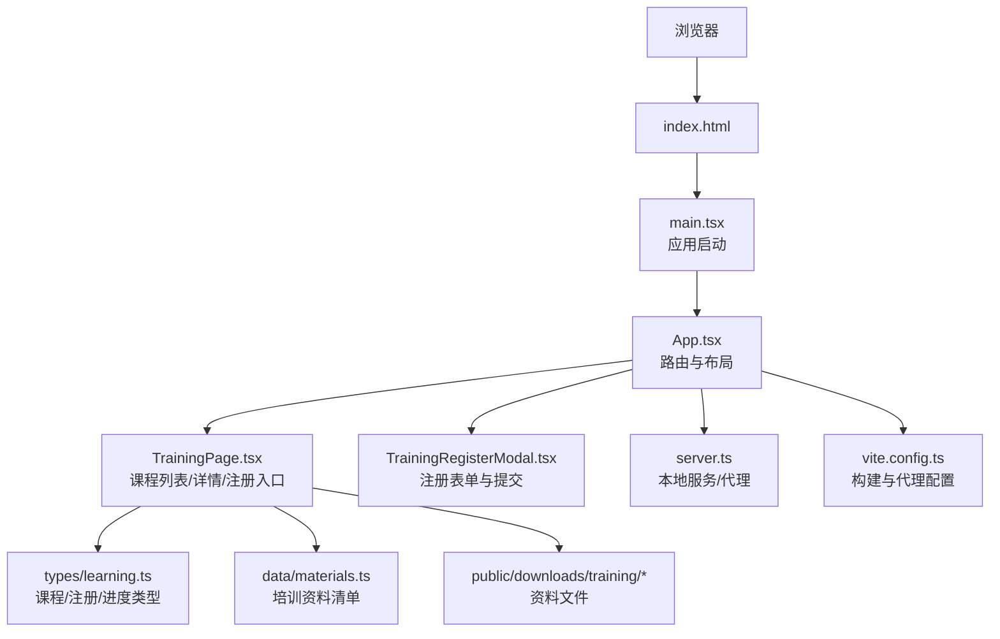
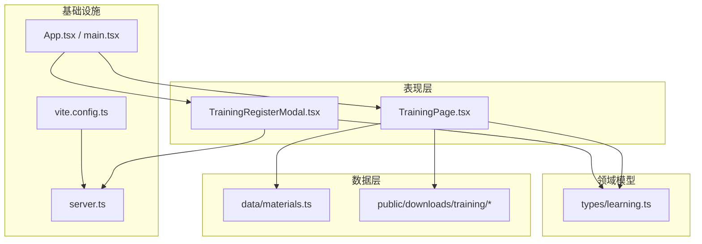
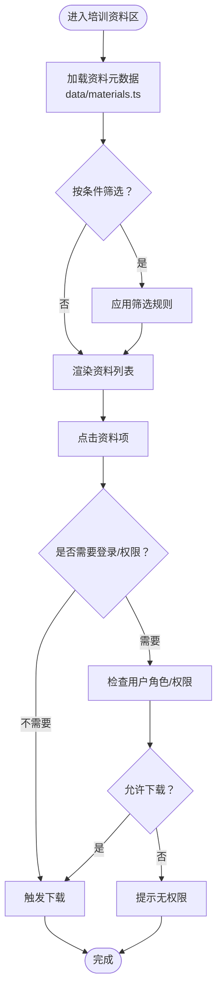
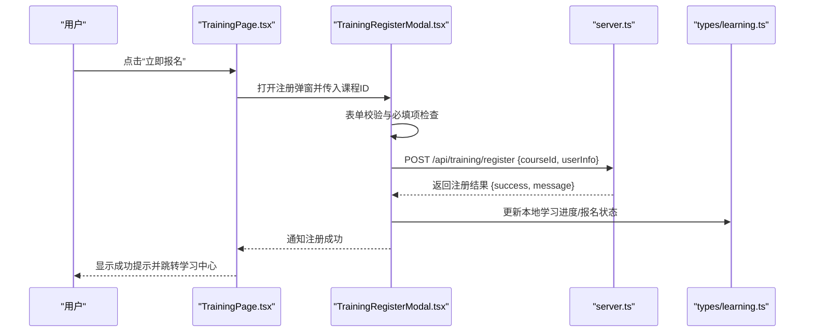
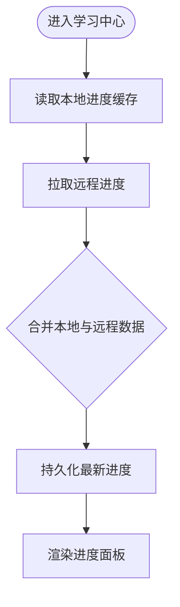
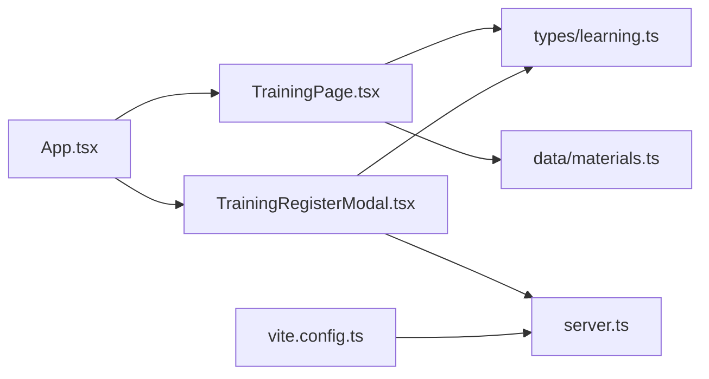

# 培训学习系统

<cite>
**本文引用的文件**   
- [TrainingPage.tsx](file://src/TrainingPage.tsx)
- [TrainingRegisterModal.tsx](file://src/TrainingRegisterModal.tsx)
- [types/learning.ts](file://src/types/learning.ts)
- [data/materials.ts](file://src/data/materials.ts)
- [App.tsx](file://src/App.tsx)
- [main.tsx](file://src/main.tsx)
- [server.ts](file://server.ts)
- [vite.config.ts](file://vite.config.ts)
- [index.html](file://index.html)
</cite>

## 目录
1. [简介](#简介)
2. [项目结构](#项目结构)
3. [核心组件](#核心组件)
4. [架构总览](#架构总览)
5. [详细组件分析](#详细组件分析)
6. [依赖关系分析](#依赖关系分析)
7. [性能考虑](#性能考虑)
8. [故障排查指南](#故障排查指南)
9. [结论](#结论)
10. [附录](#附录)

## 简介
本文件面向开发者与实施人员，系统性阐述“培训学习系统”的前端实现与运行方式。内容覆盖在线课程管理、学员注册流程、学习进度跟踪、培训资料管理与下载、用户权限控制等关键能力；同时给出数据结构设计、状态管理模式、用户体验优化策略以及扩展学习分析与课程模块的开发指导。文档以仓库现有源码为依据，提供可追溯的章节来源与图示来源，便于读者对照代码深入理解。

## 项目结构
本项目采用前端单页应用（SPA）组织方式，围绕培训页面与注册弹窗为核心入口，结合类型定义与静态数据完成课程与资料的展示与交互。服务端用于本地开发或演示环境的数据服务与静态资源托管。

图表来源
- [main.tsx:1-200](file://src/main.tsx#L1-L200)
- [App.tsx:1-200](file://src/App.tsx#L1-L200)
- [TrainingPage.tsx:1-200](file://src/TrainingPage.tsx#L1-L200)
- [TrainingRegisterModal.tsx:1-200](file://src/TrainingRegisterModal.tsx#L1-L200)
- [types/learning.ts:1-200](file://src/types/learning.ts#L1-L200)
- [data/materials.ts:1-200](file://src/data/materials.ts#L1-L200)
- [server.ts:1-200](file://server.ts#L1-L200)
- [vite.config.ts:1-200](file://vite.config.ts#L1-L200)

章节来源
- [main.tsx:1-200](file://src/main.tsx#L1-L200)
- [App.tsx:1-200](file://src/App.tsx#L1-L200)
- [TrainingPage.tsx:1-200](file://src/TrainingPage.tsx#L1-L200)
- [TrainingRegisterModal.tsx:1-200](file://src/TrainingRegisterModal.tsx#L1-L200)
- [types/learning.ts:1-200](file://src/types/learning.ts#L1-L200)
- [data/materials.ts:1-200](file://src/data/materials.ts#L1-L200)
- [server.ts:1-200](file://server.ts#L1-L200)
- [vite.config.ts:1-200](file://vite.config.ts#L1-L200)

## 核心组件
- 培训页面（TrainingPage）：负责课程列表渲染、课程详情展开、报名入口、资料预览与下载入口、学习进度概览展示。
- 注册弹窗（TrainingRegisterModal）：承载学员注册表单、校验逻辑、提交到后端接口、处理成功/失败反馈。
- 类型定义（types/learning.ts）：统一课程、注册信息、学习进度等数据结构，确保前后端契约一致。
- 培训资料（data/materials.ts）：集中维护资料元数据（名称、描述、链接、标签等），供页面渲染与筛选使用。
- 应用入口（App.tsx/main.tsx）：挂载根组件、初始化全局上下文、集成国际化与主题等基础能力。
- 本地服务（server.ts/vite.config.ts）：提供静态资源访问、API 代理、开发期热更新与跨域支持。

章节来源
- [TrainingPage.tsx:1-200](file://src/TrainingPage.tsx#L1-L200)
- [TrainingRegisterModal.tsx:1-200](file://src/TrainingRegisterModal.tsx#L1-L200)
- [types/learning.ts:1-200](file://src/types/learning.ts#L1-L200)
- [data/materials.ts:1-200](file://src/data/materials.ts#L1-L200)
- [App.tsx:1-200](file://src/App.tsx#L1-L200)
- [main.tsx:1-200](file://src/main.tsx#L1-L200)
- [server.ts:1-200](file://server.ts#L1-L200)
- [vite.config.ts:1-200](file://vite.config.ts#L1-L200)

## 架构总览
系统采用“页面-弹窗-类型-数据-服务”的分层组织：
- 表现层：TrainingPage 与 TrainingRegisterModal 负责 UI 与交互。
- 领域模型：types/learning.ts 定义课程、注册、进度等核心实体。
- 数据层：data/materials.ts 提供静态资料清单；如需动态数据，可通过 server.ts 提供的 API 或 Vite 代理转发至后端。
- 基础设施：App.tsx/main.tsx 负责应用装配；vite.config.ts 与 server.ts 提供开发与部署支撑。

图表来源
- [TrainingPage.tsx:1-200](file://src/TrainingPage.tsx#L1-L200)
- [TrainingRegisterModal.tsx:1-200](file://src/TrainingRegisterModal.tsx#L1-L200)
- [types/learning.ts:1-200](file://src/types/learning.ts#L1-L200)
- [data/materials.ts:1-200](file://src/data/materials.ts#L1-L200)
- [App.tsx:1-200](file://src/App.tsx#L1-L200)
- [main.tsx:1-200](file://src/main.tsx#L1-L200)
- [server.ts:1-200](file://server.ts#L1-L200)
- [vite.config.ts:1-200](file://vite.config.ts#L1-L200)

## 详细组件分析

### 课程数据结构与学习进度
- 课程实体：包含课程标识、标题、封面、简介、大纲、难度、时长、讲师、价格/免费标记、开课时间、名额限制、状态等字段。
- 注册信息：包含学员基本信息、联系方式、单位、岗位、期望学习目标、是否同意协议等。
- 学习进度：包含已学课时、完成率、最近学习时间、证书获取状态、学习记录快照等。

建议将上述三类实体在 types/learning.ts 中统一定义，并在页面与服务间保持一致的命名与约束。

章节来源
- [types/learning.ts:1-200](file://src/types/learning.ts#L1-L200)

### 培训资料管理
- 资料清单：在 data/materials.ts 中维护资料元数据（名称、描述、标签、适用对象、版本、发布日期、下载地址等）。
- 文件存储：实际文件放置于 public/downloads/training 目录，通过相对路径或绝对路径进行下载。
- 展示与筛选：页面可按标签、适用对象、版本等维度过滤并渲染资料卡片。

图表来源
- [data/materials.ts:1-200](file://src/data/materials.ts#L1-L200)
- [TrainingPage.tsx:1-200](file://src/TrainingPage.tsx#L1-L200)

章节来源
- [data/materials.ts:1-200](file://src/data/materials.ts#L1-L200)
- [TrainingPage.tsx:1-200](file://src/TrainingPage.tsx#L1-L200)

### 学员注册流程
注册流程从课程详情页发起，打开注册弹窗，填写表单并提交至后端接口，成功后更新本地学习状态并关闭弹窗。

图表来源
- [TrainingPage.tsx:1-200](file://src/TrainingPage.tsx#L1-L200)
- [TrainingRegisterModal.tsx:1-200](file://src/TrainingRegisterModal.tsx#L1-L200)
- [server.ts:1-200](file://server.ts#L1-L200)
- [types/learning.ts:1-200](file://src/types/learning.ts#L1-L200)

章节来源
- [TrainingPage.tsx:1-200](file://src/TrainingPage.tsx#L1-L200)
- [TrainingRegisterModal.tsx:1-200](file://src/TrainingRegisterModal.tsx#L1-L200)
- [server.ts:1-200](file://server.ts#L1-L200)
- [types/learning.ts:1-200](file://src/types/learning.ts#L1-L200)

### 学习进度跟踪与状态管理
- 状态来源：本地存储（如 localStorage/sessionStorage）保存当前用户的课程报名与学习进度快照。
- 同步机制：当注册成功或完成课时后，前端调用后端接口同步最新进度，避免多端不一致。
- 展示方式：在课程卡片与个人中心展示完成率、最近学习时间、待完成项等。

图表来源
- [TrainingPage.tsx:1-200](file://src/TrainingPage.tsx#L1-L200)
- [TrainingRegisterModal.tsx:1-200](file://src/TrainingRegisterModal.tsx#L1-L200)
- [server.ts:1-200](file://server.ts#L1-L200)
- [types/learning.ts:1-200](file://src/types/learning.ts#L1-L200)

章节来源
- [TrainingPage.tsx:1-200](file://src/TrainingPage.tsx#L1-L200)
- [TrainingRegisterModal.tsx:1-200](file://src/TrainingRegisterModal.tsx#L1-L200)
- [server.ts:1-200](file://server.ts#L1-L200)
- [types/learning.ts:1-200](file://src/types/learning.ts#L1-L200)

### 用户权限控制
- 角色与权限：基于用户角色（如访客、学员、管理员）控制资料下载、报名、编辑课程等能力。
- 拦截策略：在注册与下载前进行权限校验，未授权时引导登录或提示申请权限。
- 会话管理：通过 token 或会话标识维持登录态，并在请求头携带鉴权信息。

章节来源
- [TrainingPage.tsx:1-200](file://src/TrainingPage.tsx#L1-L200)
- [TrainingRegisterModal.tsx:1-200](file://src/TrainingRegisterModal.tsx#L1-L200)
- [server.ts:1-200](file://server.ts#L1-L200)

### 用户体验优化策略
- 首屏加载：对课程与资料清单进行分页与懒加载，减少初始包体与请求量。
- 交互反馈：注册与下载操作提供明确的 loading、成功与错误提示。
- 无障碍与国际化：遵循可访问性规范，并提供中英文切换。
- 离线与缓存：对静态资料与课程元数据进行合理缓存，提升弱网体验。

章节来源
- [TrainingPage.tsx:1-200](file://src/TrainingPage.tsx#L1-L200)
- [TrainingRegisterModal.tsx:1-200](file://src/TrainingRegisterModal.tsx#L1-L200)
- [App.tsx:1-200](file://src/App.tsx#L1-L200)
- [main.tsx:1-200](file://src/main.tsx#L1-L200)

## 依赖关系分析
- 组件耦合：TrainingPage 与 TrainingRegisterModal 通过 props 与事件通信，职责清晰。
- 类型依赖：所有业务组件依赖 types/learning.ts 保证数据结构一致性。
- 数据依赖：TrainingPage 依赖 data/materials.ts 与静态资源目录。
- 服务依赖：注册与进度同步通过 server.ts 暴露的接口完成，Vite 代理简化跨域。

图表来源
- [TrainingPage.tsx:1-200](file://src/TrainingPage.tsx#L1-L200)
- [TrainingRegisterModal.tsx:1-200](file://src/TrainingRegisterModal.tsx#L1-L200)
- [types/learning.ts:1-200](file://src/types/learning.ts#L1-L200)
- [data/materials.ts:1-200](file://src/data/materials.ts#L1-L200)
- [server.ts:1-200](file://server.ts#L1-L200)
- [vite.config.ts:1-200](file://vite.config.ts#L1-L200)
- [App.tsx:1-200](file://src/App.tsx#L1-L200)

章节来源
- [TrainingPage.tsx:1-200](file://src/TrainingPage.tsx#L1-L200)
- [TrainingRegisterModal.tsx:1-200](file://src/TrainingRegisterModal.tsx#L1-L200)
- [types/learning.ts:1-200](file://src/types/learning.ts#L1-L200)
- [data/materials.ts:1-200](file://src/data/materials.ts#L1-L200)
- [server.ts:1-200](file://server.ts#L1-L200)
- [vite.config.ts:1-200](file://vite.config.ts#L1-L200)
- [App.tsx:1-200](file://src/App.tsx#L1-L200)

## 性能考虑
- 列表与图片懒加载：课程封面与资料缩略图按需加载，降低首屏压力。
- 请求合并与去抖：注册提交与搜索查询增加防抖与节流，避免重复请求。
- 缓存策略：对课程与资料元数据设置合理的缓存过期时间，减少网络开销。
- 分包与按需加载：将注册弹窗与资料模块拆分为独立 chunk，按需引入。

[本节为通用性能建议，不直接分析具体文件]

## 故障排查指南
- 注册失败
  - 现象：弹窗提示提交失败或超时。
  - 排查：检查 server.ts 接口是否正常、网络代理是否生效、请求头是否携带必要参数。
- 资料无法下载
  - 现象：点击下载无响应或 404。
  - 排查：确认 public/downloads/training 下文件存在且路径正确，权限与跨域设置无误。
- 进度不同步
  - 现象：本地与远端进度不一致。
  - 排查：检查进度同步接口返回值、本地缓存键名与序列化格式是否正确。
- 权限不足
  - 现象：按钮置灰或提示无权限。
  - 排查：确认用户角色与权限映射、token 有效性与会话状态。

章节来源
- [TrainingRegisterModal.tsx:1-200](file://src/TrainingRegisterModal.tsx#L1-L200)
- [TrainingPage.tsx:1-200](file://src/TrainingPage.tsx#L1-L200)
- [server.ts:1-200](file://server.ts#L1-L200)
- [vite.config.ts:1-200](file://vite.config.ts#L1-L200)

## 结论
本系统以清晰的组件分层与类型驱动的数据契约为基础，实现了课程展示、学员注册、资料管理与学习进度跟踪的核心能力。通过本地缓存与远端同步相结合的状态管理策略，兼顾了可用性与一致性。建议在后续迭代中完善权限体系、增强学习分析能力，并持续优化性能与用户体验。

[本节为总结性内容，不直接分析具体文件]

## 附录
- 快速开始
  - 安装依赖并启动开发服务器，访问 index.html 查看首页。
  - 本地服务由 server.ts 提供，构建与代理配置见 vite.config.ts。
- 扩展指引
  - 新增课程：在类型定义中扩展课程字段，并在页面中适配渲染逻辑。
  - 新增资料：在资料清单中添加条目，确保文件路径与元数据一致。
  - 学习分析：在类型中扩展分析指标，并在页面中可视化呈现。

章节来源
- [index.html:1-200](file://index.html#L1-L200)
- [server.ts:1-200](file://server.ts#L1-L200)
- [vite.config.ts:1-200](file://vite.config.ts#L1-L200)
- [types/learning.ts:1-200](file://src/types/learning.ts#L1-L200)
- [data/materials.ts:1-200](file://src/data/materials.ts#L1-L200)
- [TrainingPage.tsx:1-200](file://src/TrainingPage.tsx#L1-L200)