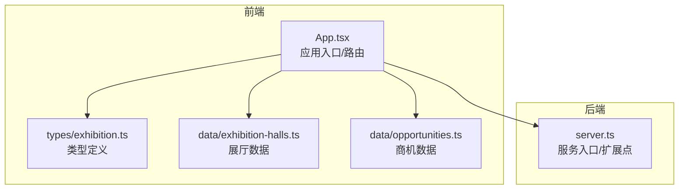
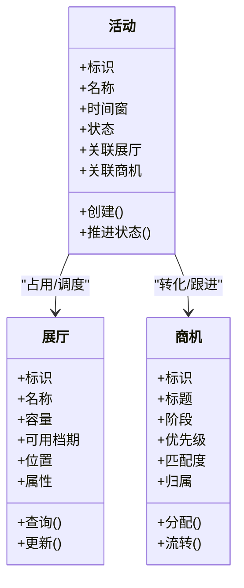
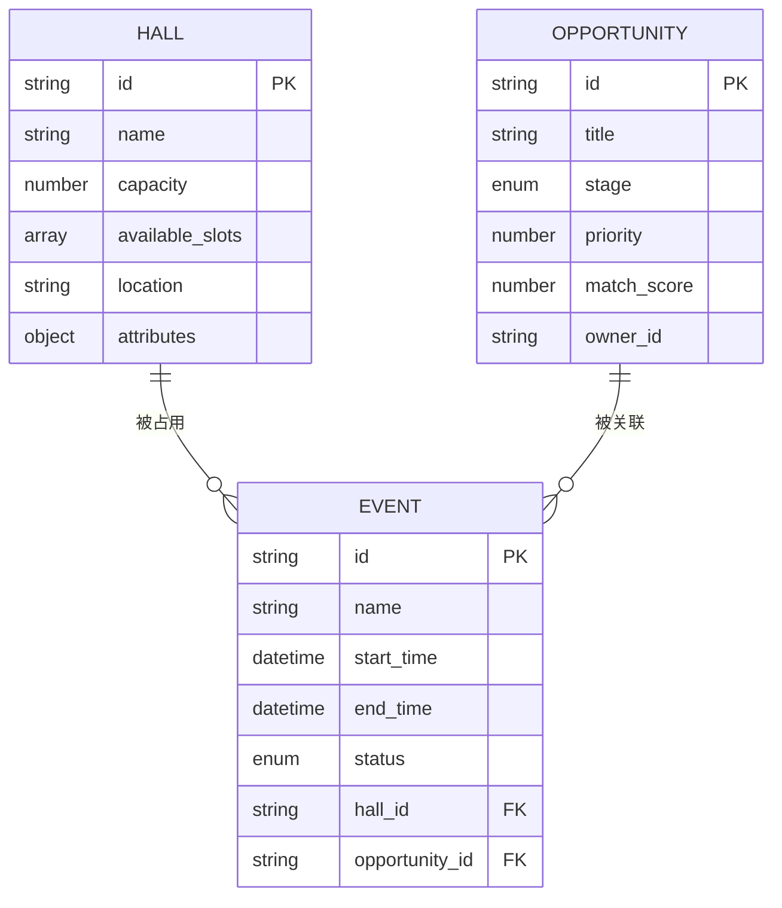
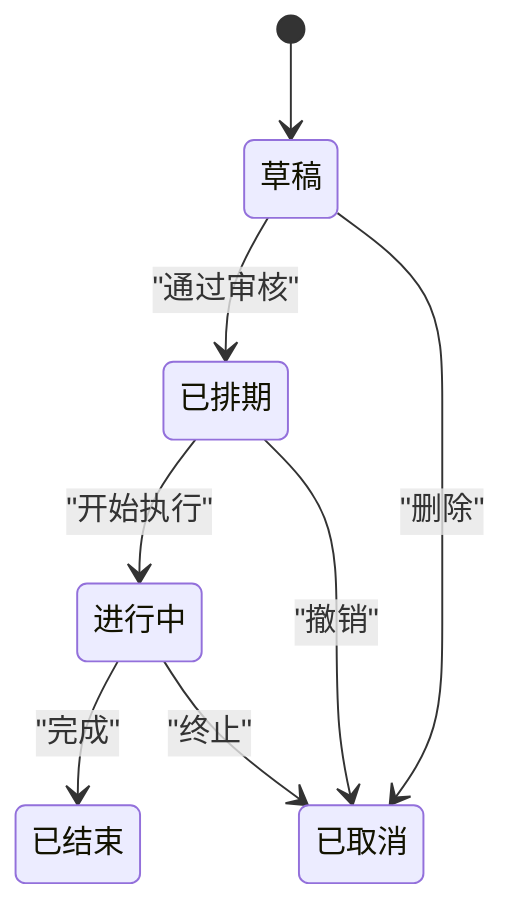
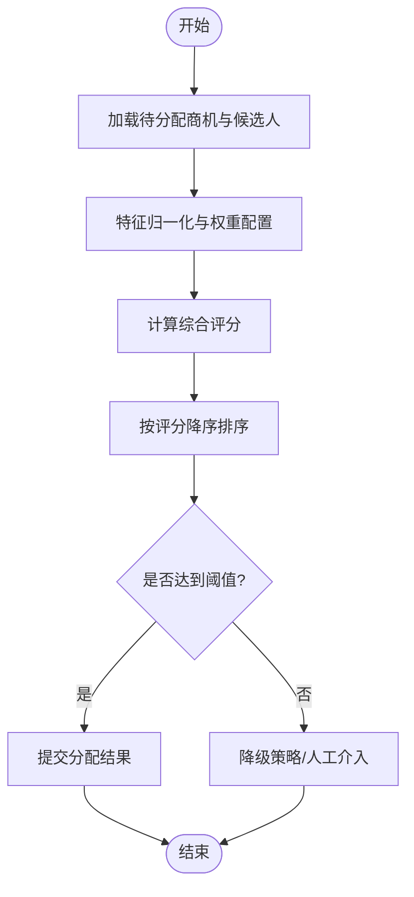
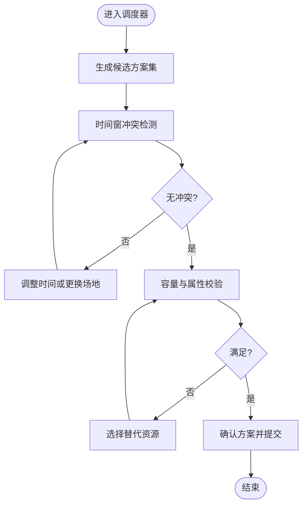
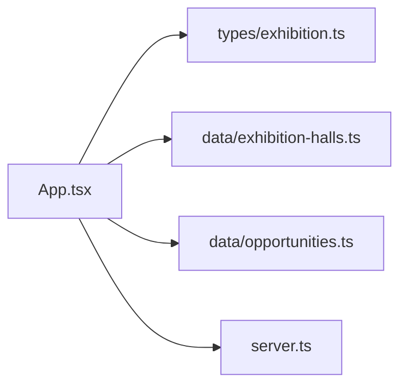

# 展览管理系统

<cite>
**本文引用的文件**   
- [src/data/exhibition-halls.ts](file://src/data/exhibition-halls.ts)
- [src/data/opportunities.ts](file://src/data/opportunities.ts)
- [src/types/exhibition.ts](file://src/types/exhibition.ts)
- [src/App.tsx](file://src/App.tsx)
- [server.ts](file://server.ts)
</cite>

## 目录
1. [简介](#简介)
2. [项目结构](#项目结构)
3. [核心组件](#核心组件)
4. [架构总览](#架构总览)
5. [详细组件分析](#详细组件分析)
6. [依赖关系分析](#依赖关系分析)
7. [性能考虑](#性能考虑)
8. [故障排查指南](#故障排查指南)
9. [结论](#结论)
10. [附录](#附录)

## 简介
本文件面向开发者，系统化阐述“展览管理系统”的核心能力与实现要点，覆盖展厅信息管理、商业机会跟踪、展会活动管理等关键模块。文档重点说明：
- 数据模型设计（展厅、商机、活动等）
- 业务规则引擎与机会分配算法
- 资源调度策略与匹配机制
- 用户界面交互模式与状态流转
- 可扩展性与自定义配置建议

## 项目结构
系统采用前端为主的数据驱动架构，核心领域数据集中在 data 与 types 目录中，应用入口与路由在 App.tsx 中组织，服务端提供基础能力或扩展点。

图表来源
- [src/App.tsx](file://src/App.tsx)
- [src/types/exhibition.ts](file://src/types/exhibition.ts)
- [src/data/exhibition-halls.ts](file://src/data/exhibition-halls.ts)
- [src/data/opportunities.ts](file://src/data/opportunities.ts)
- [server.ts](file://server.ts)

章节来源
- [src/App.tsx](file://src/App.tsx)
- [src/types/exhibition.ts](file://src/types/exhibition.ts)
- [src/data/exhibition-halls.ts](file://src/data/exhibition-halls.ts)
- [src/data/opportunities.ts](file://src/data/opportunities.ts)
- [server.ts](file://server.ts)

## 核心组件
- 展厅信息管理
  - 职责：维护展厅实体、容量、可用档期、位置与属性等；提供查询、筛选与变更接口。
  - 数据来源：展厅数据文件与类型定义。
- 商业机会跟踪
  - 职责：记录商机线索、阶段、优先级、匹配度、归属与转化路径；支持分配与流转。
  - 数据来源：商机数据文件与类型定义。
- 展会活动管理
  - 职责：编排展会活动、关联展厅与商机、管理活动生命周期与状态机。
  - 数据来源：类型定义与上层页面逻辑。

章节来源
- [src/data/exhibition-halls.ts](file://src/data/exhibition-halls.ts)
- [src/data/opportunities.ts](file://src/data/opportunities.ts)
- [src/types/exhibition.ts](file://src/types/exhibition.ts)

## 架构总览
系统以“类型驱动 + 数据集中 + 页面编排”的方式组织。类型层统一契约，数据层承载初始与示例数据，应用层负责组合展示与交互，服务端作为扩展点预留。

图表来源
- [src/types/exhibition.ts](file://src/types/exhibition.ts)
- [src/data/exhibition-halls.ts](file://src/data/exhibition-halls.ts)
- [src/data/opportunities.ts](file://src/data/opportunities.ts)

## 详细组件分析

### 数据模型设计
- 展厅实体
  - 关键字段：标识、名称、容量、可用档期、位置、属性等。
  - 约束：容量限制、档期不可冲突、位置唯一性。
- 商机实体
  - 关键字段：标识、标题、阶段、优先级、匹配度、归属等。
  - 约束：阶段顺序、优先级范围、归属可转移。
- 活动实体
  - 关键字段：标识、名称、时间窗、状态、关联展厅、关联商机等。
  - 约束：时间窗不重叠、状态机合法转换。

图表来源
- [src/types/exhibition.ts](file://src/types/exhibition.ts)
- [src/data/exhibition-halls.ts](file://src/data/exhibition-halls.ts)
- [src/data/opportunities.ts](file://src/data/opportunities.ts)

章节来源
- [src/types/exhibition.ts](file://src/types/exhibition.ts)
- [src/data/exhibition-halls.ts](file://src/data/exhibition-halls.ts)
- [src/data/opportunities.ts](file://src/data/opportunities.ts)

### 展厅信息管理
- 功能要点
  - 展厅列表与详情展示
  - 基于容量与档期的可用性校验
  - 展厅属性的增删改查
- 数据结构
  - 使用类型定义保证字段一致性与可维护性
  - 数据文件提供初始样例与批量导入模板
- 交互模式
  - 列表页支持筛选与分页
  - 详情页支持编辑与变更记录

章节来源
- [src/data/exhibition-halls.ts](file://src/data/exhibition-halls.ts)
- [src/types/exhibition.ts](file://src/types/exhibition.ts)

### 商业机会跟踪
- 功能要点
  - 商机录入、阶段推进、优先级调整
  - 自动/手动分配与转交
  - 匹配度计算与排序
- 数据结构
  - 阶段枚举与流转规则由类型层约束
  - 匹配度字段用于排序与推荐
- 交互模式
  - 看板视图按阶段分组
  - 拖拽式流转与批量操作

章节来源
- [src/data/opportunities.ts](file://src/data/opportunities.ts)
- [src/types/exhibition.ts](file://src/types/exhibition.ts)

### 展会活动管理与状态机
- 状态定义
  - 典型状态：草稿、已排期、进行中、已结束、已取消
- 状态转换规则
  - 仅允许符合业务语义的转换路径
  - 某些转换需要前置条件（如展厅档期可用、商机处于特定阶段）
- 活动编排
  - 创建活动后绑定展厅与商机
  - 时间窗冲突检测与回滚

图表来源
- [src/types/exhibition.ts](file://src/types/exhibition.ts)

章节来源
- [src/types/exhibition.ts](file://src/types/exhibition.ts)

### 机会分配算法与匹配策略
- 目标
  - 将未分配的商机高效匹配到合适的负责人或团队，并给出推荐排序
- 输入
  - 待分配商机集合（含阶段、优先级、匹配度等）
  - 候选负责人/团队（含负载、专长、历史转化率等）
- 评分维度
  - 业务匹配度（行业、产品、地域等）
  - 负责人负载均衡
  - 历史表现与成功率
  - 时效性与优先级加权
- 输出
  - 分配结果与置信度分数
  - 可解释的推荐理由

图表来源
- [src/data/opportunities.ts](file://src/data/opportunities.ts)
- [src/types/exhibition.ts](file://src/types/exhibition.ts)

章节来源
- [src/data/opportunities.ts](file://src/data/opportunities.ts)
- [src/types/exhibition.ts](file://src/types/exhibition.ts)

### 展览资源调度与冲突检测
- 调度原则
  - 优先满足高优先级活动
  - 避免同一展厅在同一时间窗重复占用
  - 兼顾场地容量与设备资源
- 冲突检测
  - 时间窗交集判断
  - 容量上限校验
  - 特殊属性要求（如层高、电力、网络）
- 回退策略
  - 自动替换备选展厅
  - 拆分或延后低优先级活动

图表来源
- [src/data/exhibition-halls.ts](file://src/data/exhibition-halls.ts)
- [src/types/exhibition.ts](file://src/types/exhibition.ts)

章节来源
- [src/data/exhibition-halls.ts](file://src/data/exhibition-halls.ts)
- [src/types/exhibition.ts](file://src/types/exhibition.ts)

### 业务规则引擎
- 规则分类
  - 准入规则：商机阶段、资质、来源渠道
  - 分配规则：负载均衡、技能匹配、地域就近
  - 排期规则：时间窗、容量、设备、审批流
  - 风控规则：黑名单、异常行为检测
- 规则表达
  - 声明式配置（JSON/YAML）+ 运行时评估
  - 版本化管理与灰度发布
- 执行流程
  - 事件触发 -> 规则加载 -> 上下文构建 -> 规则链执行 -> 决策输出

章节来源
- [src/types/exhibition.ts](file://src/types/exhibition.ts)

### 用户界面交互模式
- 展厅管理
  - 列表/详情/编辑三件套
  - 可视化档期日历与冲突提示
- 商机管理
  - 看板视图与批量操作
  - 分配建议弹窗与一键采纳
- 活动编排
  - 拖拽排期、资源预览、冲突预警
  - 状态推进按钮与审计日志

章节来源
- [src/App.tsx](file://src/App.tsx)

## 依赖关系分析
- 模块耦合
  - App.tsx 作为入口聚合各页面与数据源
  - types/exhibition.ts 为全局契约，降低耦合
  - data 目录提供静态数据，便于测试与演示
- 外部依赖
  - server.ts 可作为 API 网关或扩展点，未来接入持久化与权限控制

图表来源
- [src/App.tsx](file://src/App.tsx)
- [src/types/exhibition.ts](file://src/types/exhibition.ts)
- [src/data/exhibition-halls.ts](file://src/data/exhibition-halls.ts)
- [src/data/opportunities.ts](file://src/data/opportunities.ts)
- [server.ts](file://server.ts)

章节来源
- [src/App.tsx](file://src/App.tsx)
- [src/types/exhibition.ts](file://src/types/exhibition.ts)
- [src/data/exhibition-halls.ts](file://src/data/exhibition-halls.ts)
- [src/data/opportunities.ts](file://src/data/opportunities.ts)
- [server.ts](file://server.ts)

## 性能考虑
- 数据层
  - 对大型数据集采用分页与懒加载
  - 热点数据缓存（展厅档期、活动清单）
- 算法层
  - 分配与匹配算法复杂度控制在 O(n log n) 以内
  - 增量更新与批处理减少全量重算
- UI 层
  - 虚拟列表渲染长列表
  - 防抖/节流优化搜索与筛选

## 故障排查指南
- 常见问题
  - 时间窗冲突导致无法排期
  - 容量不足导致活动无法落地
  - 商机分配失败需人工介入
- 定位步骤
  - 检查活动状态机转换是否合法
  - 核对展厅档期与容量约束
  - 查看分配评分与阈值配置
- 恢复策略
  - 启用备选展厅或调整时间窗
  - 临时放宽阈值并记录审计日志
  - 回滚至上一稳定版本

## 结论
本系统以类型驱动与数据集中为核心，围绕展厅、商机与活动三大实体构建了完整的展览管理能力。通过明确的规则引擎与分配算法，实现了资源的高效调度与商机的精准匹配。后续可在服务端集成持久化、权限与审计，进一步提升系统的稳定性与可观测性。

## 附录
- 术语表
  - 展厅：用于举办活动的物理空间及其属性
  - 商机：潜在的业务机会，包含阶段与优先级
  - 活动：一次具体的展会安排，关联展厅与商机
- 扩展建议
  - 引入后端服务与数据库，实现数据持久化
  - 增加权限与角色体系，细化操作粒度
  - 完善监控与告警，提升运维效率