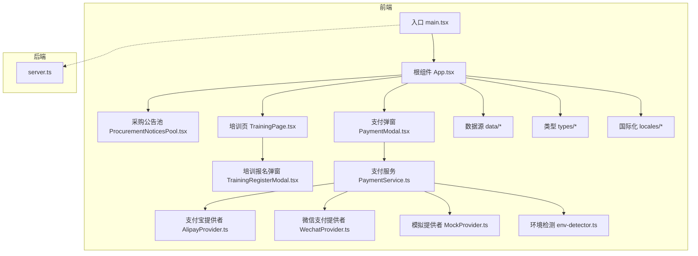
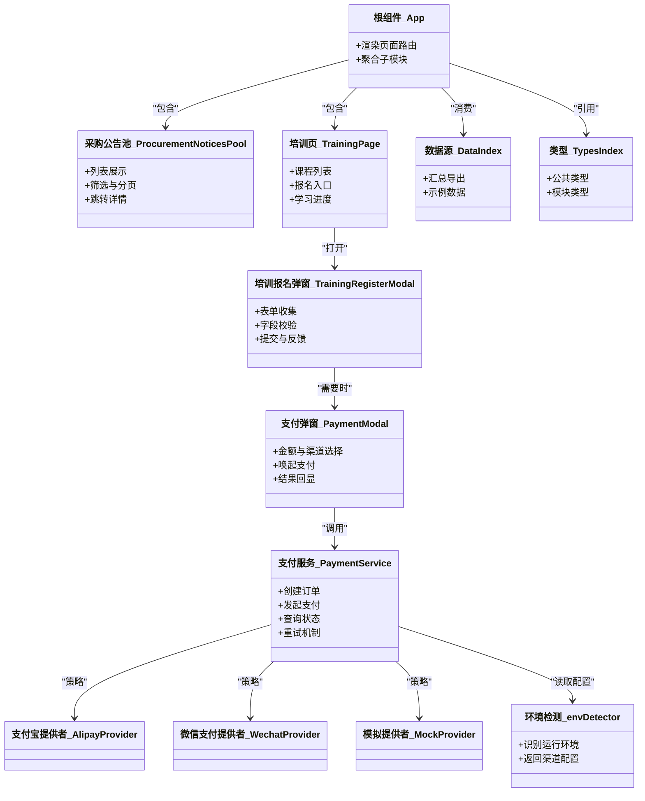
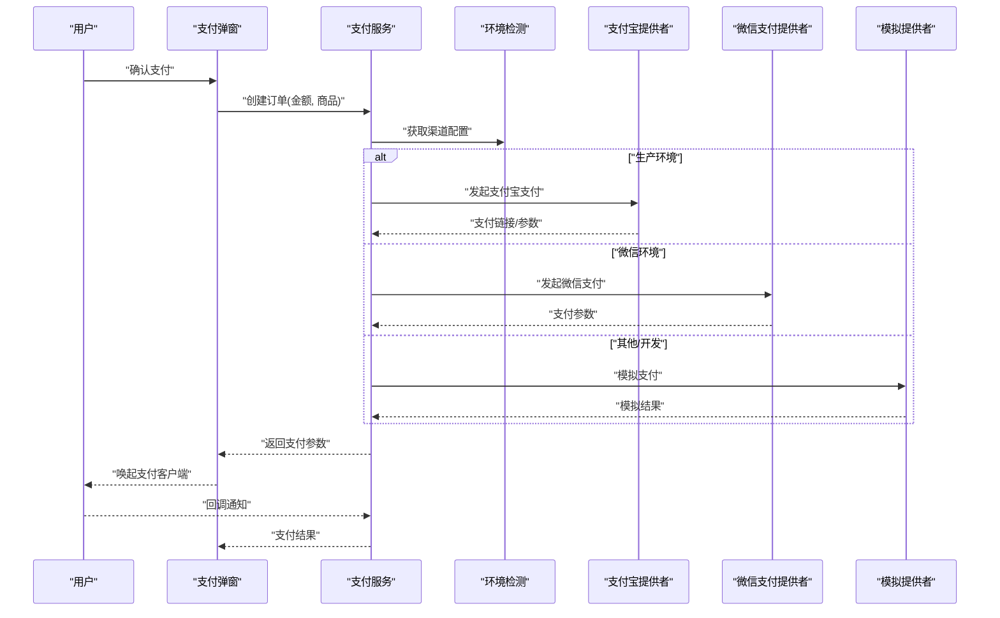
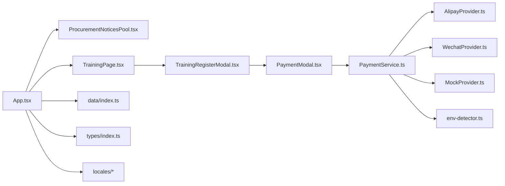

# 核心功能模块

<cite>
**本文引用的文件**   
- [App.tsx](file://src/App.tsx)
- [main.tsx](file://src/main.tsx)
- [server.ts](file://server.ts)
- [PaymentModal.tsx](file://src/PaymentModal.tsx)
- [ProcurementNoticesPool.tsx](file://src/ProcurementNoticesPool.tsx)
- [TrainingPage.tsx](file://src/TrainingPage.tsx)
- [TrainingRegisterModal.tsx](file://src/TrainingRegisterModal.tsx)
- [PaymentService.ts](file://src/payment/PaymentService.ts)
- [AlipayProvider.ts](file://src/payment/AlipayProvider.ts)
- [WechatProvider.ts](file://src/payment/WechatProvider.ts)
- [MockProvider.ts](file://src/payment/MockProvider.ts)
- [env-detector.ts](file://src/payment/env-detector.ts)
- [types.ts](file://src/payment/types.ts)
- [exhibition-halls.ts](file://src/data/exhibition-halls.ts)
- [materials.ts](file://src/data/materials.ts)
- [opportunities.ts](file://src/data/opportunities.ts)
- [suppliers.ts](file://src/data/suppliers.ts)
- [index.ts](file://src/data/index.ts)
- [auth.ts](file://src/types/auth.ts)
- [crm.ts](file://src/types/crm.ts)
- [exhibition.ts](file://src/types/exhibition.ts)
- [learning.ts](file://src/types/learning.ts)
- [membership.ts](file://src/types/membership.ts)
- [payment.ts](file://src/types/payment.ts)
- [procurement.ts](file://src/types/procurement.ts)
- [supplier.ts](file://src/types/supplier.ts)
- [en.json](file://src/locales/en.json)
- [zh.json](file://src/locales/zh.json)
- [LocaleContext.tsx](file://src/locales/LocaleContext.tsx)
- [package.json](file://package.json)
- [vite.config.ts](file://vite.config.ts)
</cite>

## 目录
1. [简介](#简介)
2. [项目结构](#项目结构)
3. [核心组件](#核心组件)
4. [架构总览](#架构总览)
5. [详细组件分析](#详细组件分析)
6. [依赖关系分析](#依赖关系分析)
7. [性能考虑](#性能考虑)
8. [故障排查指南](#故障排查指南)
9. [结论](#结论)
10. [附录](#附录)

## 简介
本文件面向开发者，系统化梳理 Supply OS 的核心业务模块与实现要点，覆盖供应链管理、培训学习系统、支付集成、展览管理等主要能力。文档从系统架构、数据流、交互关系、配置项、API 接口、错误处理与扩展定制等维度展开，并提供可视化图示帮助理解模块间的耦合与集成模式。

## 项目结构
Supply OS 采用前端应用 + 轻量服务端的双层组织方式：
- 前端应用（React + TypeScript）：承载供应链、培训、支付、展览等业务页面与交互逻辑，使用本地数据与类型定义进行开发期验证与演示。
- 服务端（Express）：提供基础路由与静态资源服务，便于本地联调与部署。

图表来源
- [main.tsx:1-50](file://src/main.tsx#L1-L50)
- [App.tsx:1-120](file://src/App.tsx#L1-L120)
- [ProcurementNoticesPool.tsx:1-120](file://src/ProcurementNoticesPool.tsx#L1-L120)
- [TrainingPage.tsx:1-120](file://src/TrainingPage.tsx#L1-L120)
- [PaymentModal.tsx:1-120](file://src/PaymentModal.tsx#L1-L120)
- [TrainingRegisterModal.tsx:1-120](file://src/TrainingRegisterModal.tsx#L1-L120)
- [PaymentService.ts:1-200](file://src/payment/PaymentService.ts#L1-L200)
- [AlipayProvider.ts:1-120](file://src/payment/AlipayProvider.ts#L1-L120)
- [WechatProvider.ts:1-120](file://src/payment/WechatProvider.ts#L1-L120)
- [MockProvider.ts:1-120](file://src/payment/MockProvider.ts#L1-L120)
- [env-detector.ts:1-80](file://src/payment/env-detector.ts#L1-L80)
- [data/index.ts:1-80](file://src/data/index.ts#L1-L80)
- [types/index.ts:1-80](file://src/types/index.ts#L1-L80)
- [server.ts:1-120](file://server.ts#L1-L120)

章节来源
- [main.tsx:1-50](file://src/main.tsx#L1-L50)
- [App.tsx:1-120](file://src/App.tsx#L1-L120)
- [server.ts:1-120](file://server.ts#L1-L120)

## 核心组件
本节聚焦各业务模块的入口与关键职责，说明其对外暴露的能力与内部协作方式。

- 供应链（采购公告池）
  - 职责：展示与管理采购公告列表，支持筛选、分页与状态流转。
  - 数据来源：本地数据文件与类型定义，便于快速开发与演示。
  - 交互：用户操作触发列表刷新、详情查看与后续流程（如报名或支付）。

- 培训学习系统
  - 职责：课程展示、报名管理、学习进度跟踪。
  - 交互：通过报名弹窗完成信息收集与校验，必要时触发支付流程。

- 支付集成
  - 职责：统一支付抽象，按环境选择具体渠道（支付宝、微信、模拟）。
  - 能力：创建订单、发起支付、回调处理、结果查询与重试。

- 展览管理
  - 职责：展厅与展品信息管理、预约与排期。
  - 数据：基于本地数据文件维护基础数据，可扩展为后端持久化。

章节来源
- [ProcurementNoticesPool.tsx:1-120](file://src/ProcurementNoticesPool.tsx#L1-L120)
- [TrainingPage.tsx:1-120](file://src/TrainingPage.tsx#L1-L120)
- [PaymentModal.tsx:1-120](file://src/PaymentModal.tsx#L1-L120)
- [TrainingRegisterModal.tsx:1-120](file://src/TrainingRegisterModal.tsx#L1-L120)
- [PaymentService.ts:1-200](file://src/payment/PaymentService.ts#L1-L200)
- [exhibition-halls.ts:1-120](file://src/data/exhibition-halls.ts#L1-L120)
- [materials.ts:1-120](file://src/data/materials.ts#L1-L120)
- [opportunities.ts:1-120](file://src/data/opportunities.ts#L1-L120)
- [suppliers.ts:1-120](file://src/data/suppliers.ts#L1-L120)

## 架构总览
整体采用“页面组件 + 领域服务 + 数据/类型”的分层模式：
- 页面组件负责 UI 与用户交互，调用领域服务完成业务动作。
- 领域服务封装跨模块逻辑（如支付），并通过策略模式选择具体实现。
- 数据与类型位于独立目录，保证前后端契约一致与可测试性。

图表来源
- [App.tsx:1-120](file://src/App.tsx#L1-L120)
- [ProcurementNoticesPool.tsx:1-120](file://src/ProcurementNoticesPool.tsx#L1-L120)
- [TrainingPage.tsx:1-120](file://src/TrainingPage.tsx#L1-L120)
- [TrainingRegisterModal.tsx:1-120](file://src/TrainingRegisterModal.tsx#L1-L120)
- [PaymentModal.tsx:1-120](file://src/PaymentModal.tsx#L1-L120)
- [PaymentService.ts:1-200](file://src/payment/PaymentService.ts#L1-L200)
- [AlipayProvider.ts:1-120](file://src/payment/AlipayProvider.ts#L1-L120)
- [WechatProvider.ts:1-120](file://src/payment/WechatProvider.ts#L1-L120)
- [MockProvider.ts:1-120](file://src/payment/MockProvider.ts#L1-L120)
- [env-detector.ts:1-80](file://src/payment/env-detector.ts#L1-L80)
- [data/index.ts:1-80](file://src/data/index.ts#L1-L80)
- [types/index.ts:1-80](file://src/types/index.ts#L1-L80)

## 详细组件分析

### 供应链管理（采购公告池）
- 功能特性
  - 列表展示：分页、排序、关键词搜索。
  - 状态管理：草稿、已发布、进行中、已结束。
  - 操作：查看详情、订阅提醒、导出清单。
- 数据流
  - 从数据源加载公告列表，结合筛选条件生成视图模型。
  - 用户操作更新本地状态并触发重渲染。
- 业务规则
  - 仅允许对“进行中”的公告执行报名或下单。
  - 重复提交需去重与幂等保护。
- 错误处理
  - 网络异常降级到缓存数据。
  - 非法输入提示并阻止提交。
- 配置选项
  - 每页条数、默认排序字段、是否启用搜索高亮。
- API 接口（建议）
  - GET /api/procurement-notices?page=&size=&keyword=
  - POST /api/procurement-notices/:id/subscribe
  - GET /api/procurement-notices/:id
- 使用示例
  - 在页面初始化时拉取公告列表；在搜索框输入后防抖触发查询；点击条目进入详情页。

章节来源
- [ProcurementNoticesPool.tsx:1-120](file://src/ProcurementNoticesPool.tsx#L1-L120)
- [data/opportunities.ts:1-120](file://src/data/opportunities.ts#L1-L120)
- [types/procurement.ts:1-120](file://src/types/procurement.ts#L1-L120)

### 培训学习系统
- 功能特性
  - 课程展示：封面、大纲、讲师、时间、价格。
  - 报名管理：个人信息收集、名额限制、费用计算。
  - 学习进度：签到、课时完成度、证书发放。
- 数据流
  - 课程数据来自数据源；报名成功后写入报名记录；支付完成后更新状态。
- 业务规则
  - 报名截止前方可提交；同一用户不可重复报名同一课程。
  - 未支付订单在超时后自动取消。
- 错误处理
  - 表单校验失败即时提示；支付失败支持重试与退款指引。
- 配置选项
  - 报名字段集、最大人数、早鸟价折扣、支付超时时间。
- API 接口（建议）
  - GET /api/courses?category=&page=&size=
  - POST /api/courses/:id/register
  - GET /api/users/:id/progress
- 使用示例
  - 课程列表点击“立即报名”，弹出报名表单；校验通过后进入支付环节；支付成功显示学习入口。

章节来源
- [TrainingPage.tsx:1-120](file://src/TrainingPage.tsx#L1-L120)
- [TrainingRegisterModal.tsx:1-120](file://src/TrainingRegisterModal.tsx#L1-L120)
- [types/learning.ts:1-120](file://src/types/learning.ts#L1-L120)

### 支付集成
- 功能特性
  - 统一支付抽象：创建订单、发起支付、回调处理、状态查询。
  - 多渠道策略：支付宝、微信支付、模拟渠道。
  - 环境适配：根据运行环境自动选择合适渠道与配置。
- 数据流
  - 页面组件请求支付服务创建订单；支付服务选择渠道提供者发起支付；回调后更新订单状态。
- 业务规则
  - 金额必须为正且精度合规；订单号全局唯一；重复回调幂等处理。
- 错误处理
  - 渠道不可用降级到模拟渠道；网络异常重试与退避；失败原因清晰上报。
- 配置选项
  - 渠道开关、密钥与商户号、回调地址、超时与重试次数。
- API 接口（建议）
  - POST /api/payments/orders
  - GET /api/payments/orders/:id/status
  - POST /api/payments/callback
- 使用示例
  - 在报名确认后调用支付服务创建订单；根据返回结果唤起对应支付客户端；监听回调更新界面。

图表来源
- [PaymentModal.tsx:1-120](file://src/PaymentModal.tsx#L1-L120)
- [PaymentService.ts:1-200](file://src/payment/PaymentService.ts#L1-L200)
- [env-detector.ts:1-80](file://src/payment/env-detector.ts#L1-L80)
- [AlipayProvider.ts:1-120](file://src/payment/AlipayProvider.ts#L1-L120)
- [WechatProvider.ts:1-120](file://src/payment/WechatProvider.ts#L1-L120)
- [MockProvider.ts:1-120](file://src/payment/MockProvider.ts#L1-L120)

章节来源
- [PaymentModal.tsx:1-120](file://src/PaymentModal.tsx#L1-L120)
- [PaymentService.ts:1-200](file://src/payment/PaymentService.ts#L1-L200)
- [AlipayProvider.ts:1-120](file://src/payment/AlipayProvider.ts#L1-L120)
- [WechatProvider.ts:1-120](file://src/payment/WechatProvider.ts#L1-L120)
- [MockProvider.ts:1-120](file://src/payment/MockProvider.ts#L1-L120)
- [env-detector.ts:1-80](file://src/payment/env-detector.ts#L1-L80)
- [types/payment.ts:1-120](file://src/types/payment.ts#L1-L120)

### 展览管理
- 功能特性
  - 展厅与展品管理：基本信息、位置、容量、开放时间。
  - 预约与排期：时间段占用、冲突检测、审批流程。
  - 物料与资料：宣传材料、导览图、注意事项。
- 数据流
  - 基础数据由数据源提供；预约状态变更同步至日历视图。
- 业务规则
  - 同一时间段不可重复预约；超时可释放名额。
- 错误处理
  - 冲突检测失败给出明确提示；数据不一致时触发重新拉取。
- 配置选项
  - 开放时段、最小预约提前量、最大预约人数。
- API 接口（建议）
  - GET /api/exhibitions/halls
  - POST /api/exhibitions/bookings
  - GET /api/exhibitions/bookings/:id
- 使用示例
  - 选择展厅与时间段，提交预约；若存在冲突则提示调整时间；预约成功后生成二维码入场。

章节来源
- [exhibition-halls.ts:1-120](file://src/data/exhibition-halls.ts#L1-L120)
- [materials.ts:1-120](file://src/data/materials.ts#L1-L120)
- [types/exhibition.ts:1-120](file://src/types/exhibition.ts#L1-L120)

### 数据与类型
- 数据源
  - 集中管理示例数据与常量，便于前端快速演示与单元测试。
- 类型定义
  - 统一前后端契约，涵盖认证、CRM、展览、学习、会员、支付、采购、供应商等域。
- 使用建议
  - 新增字段优先在类型中声明，再在数据源补充样例，最后在前端组件消费。

章节来源
- [data/index.ts:1-80](file://src/data/index.ts#L1-L80)
- [types/index.ts:1-80](file://src/types/index.ts#L1-L80)
- [auth.ts:1-120](file://src/types/auth.ts#L1-L120)
- [crm.ts:1-120](file://src/types/crm.ts#L1-L120)
- [exhibition.ts:1-120](file://src/types/exhibition.ts#L1-L120)
- [learning.ts:1-120](file://src/types/learning.ts#L1-L120)
- [membership.ts:1-120](file://src/types/membership.ts#L1-L120)
- [payment.ts:1-120](file://src/types/payment.ts#L1-L120)
- [procurement.ts:1-120](file://src/types/procurement.ts#L1-L120)
- [supplier.ts:1-120](file://src/types/supplier.ts#L1-L120)

### 国际化
- 功能特性
  - 中英文切换，键值化管理文案。
- 使用建议
  - 新增文案先添加到语言包，再通过上下文获取，避免硬编码。

章节来源
- [en.json:1-200](file://src/locales/en.json#L1-L200)
- [zh.json:1-200](file://src/locales/zh.json#L1-L200)
- [LocaleContext.tsx:1-120](file://src/locales/LocaleContext.tsx#L1-L120)

## 依赖关系分析
- 模块内聚
  - 支付模块内聚度高，通过策略模式解耦渠道实现。
  - 培训模块将报名与支付解耦，降低耦合面。
- 外部依赖
  - 构建工具 Vite 与包管理器 npm/yarn。
  - 服务端 Express 用于本地联调。
- 潜在循环依赖
  - 当前分层清晰，未见明显循环导入；建议在新增模块时保持单向依赖。

图表来源
- [App.tsx:1-120](file://src/App.tsx#L1-L120)
- [ProcurementNoticesPool.tsx:1-120](file://src/ProcurementNoticesPool.tsx#L1-L120)
- [TrainingPage.tsx:1-120](file://src/TrainingPage.tsx#L1-L120)
- [TrainingRegisterModal.tsx:1-120](file://src/TrainingRegisterModal.tsx#L1-L120)
- [PaymentModal.tsx:1-120](file://src/PaymentModal.tsx#L1-L120)
- [PaymentService.ts:1-200](file://src/payment/PaymentService.ts#L1-L200)
- [AlipayProvider.ts:1-120](file://src/payment/AlipayProvider.ts#L1-L120)
- [WechatProvider.ts:1-120](file://src/payment/WechatProvider.ts#L1-L120)
- [MockProvider.ts:1-120](file://src/payment/MockProvider.ts#L1-L120)
- [env-detector.ts:1-80](file://src/payment/env-detector.ts#L1-L80)
- [data/index.ts:1-80](file://src/data/index.ts#L1-L80)
- [types/index.ts:1-80](file://src/types/index.ts#L1-L80)

章节来源
- [package.json:1-120](file://package.json#L1-L120)
- [vite.config.ts:1-120](file://vite.config.ts#L1-L120)
- [server.ts:1-120](file://server.ts#L1-L120)

## 性能考虑
- 列表与表格
  - 使用虚拟滚动与分页减少首屏渲染压力。
  - 搜索与筛选加入防抖与节流。
- 支付流程
  - 异步任务与重试采用指数退避，避免雪崩。
  - 大对象序列化与传输压缩。
- 资源优化
  - 图片懒加载与按需引入。
  - 代码分割与路由级懒加载。

[本节为通用指导，不直接分析具体文件]

## 故障排查指南
- 常见问题
  - 支付回调未触发：检查回调地址与域名白名单；核对签名算法与时间戳。
  - 报名失败：确认字段校验规则与必填项；检查并发重复提交的去重逻辑。
  - 数据不同步：对比本地缓存与服务端最新数据；强制刷新与清理缓存。
- 日志与监控
  - 关键路径埋点：订单创建、支付回调、报名提交。
  - 错误分级：用户可见错误与后台告警分离。
- 恢复策略
  - 幂等键与补偿任务；失败重试与人工介入通道。

章节来源
- [PaymentService.ts:1-200](file://src/payment/PaymentService.ts#L1-L200)
- [TrainingRegisterModal.tsx:1-120](file://src/TrainingRegisterModal.tsx#L1-L120)
- [PaymentModal.tsx:1-120](file://src/PaymentModal.tsx#L1-L120)

## 结论
Supply OS 以清晰的模块化设计与策略模式实现了支付多渠道接入，配合本地数据与类型体系，提供了良好的可测试性与扩展性。建议在后续迭代中逐步将数据源迁移至后端服务，完善审计与权限控制，并增强监控与告警能力。

[本节为总结，不直接分析具体文件]

## 附录

### 配置项参考
- 支付
  - 渠道开关、商户号、密钥、回调地址、超时与重试次数。
- 培训
  - 报名字段、最大人数、早鸟折扣、支付超时。
- 展览
  - 开放时段、最小预约提前量、最大预约人数。
- 国际化
  - 默认语言、切换快捷键、文案命名规范。

章节来源
- [PaymentService.ts:1-200](file://src/payment/PaymentService.ts#L1-L200)
- [env-detector.ts:1-80](file://src/payment/env-detector.ts#L1-L80)
- [TrainingRegisterModal.tsx:1-120](file://src/TrainingRegisterModal.tsx#L1-L120)
- [exhibition-halls.ts:1-120](file://src/data/exhibition-halls.ts#L1-L120)
- [en.json:1-200](file://src/locales/en.json#L1-L200)
- [zh.json:1-200](file://src/locales/zh.json#L1-L200)

### 扩展与定制指导
- 新增支付渠道
  - 实现统一接口，注册到支付服务；在环境检测中增加识别逻辑。
- 扩展培训字段
  - 在类型中声明新字段，更新表单校验与提交载荷。
- 新增展览资源
  - 在数据源添加样例，并在类型中定义约束；在页面中绑定展示与预约逻辑。
- 国际化扩展
  - 在语言包中添加键值，确保所有用户可见文案均通过上下文获取。

章节来源
- [AlipayProvider.ts:1-120](file://src/payment/AlipayProvider.ts#L1-L120)
- [WechatProvider.ts:1-120](file://src/payment/WechatProvider.ts#L1-L120)
- [MockProvider.ts:1-120](file://src/payment/MockProvider.ts#L1-L120)
- [PaymentService.ts:1-200](file://src/payment/PaymentService.ts#L1-L200)
- [types/learning.ts:1-120](file://src/types/learning.ts#L1-L120)
- [types/exhibition.ts:1-120](file://src/types/exhibition.ts#L1-L120)
- [en.json:1-200](file://src/locales/en.json#L1-L200)
- [zh.json:1-200](file://src/locales/zh.json#L1-L200)