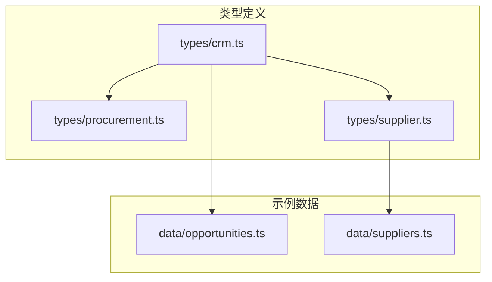
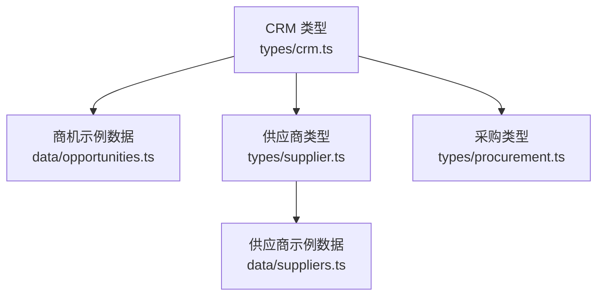
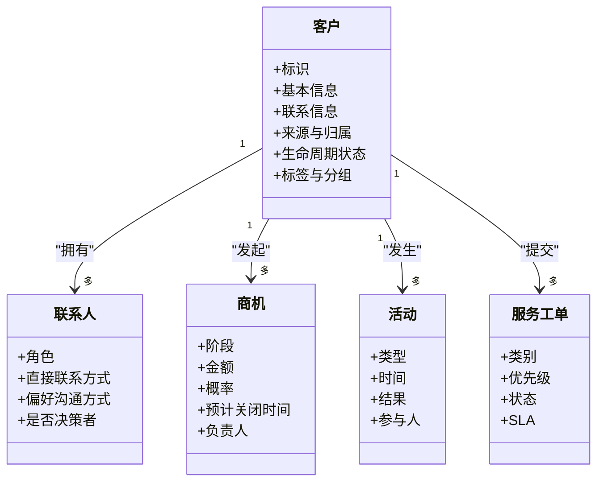
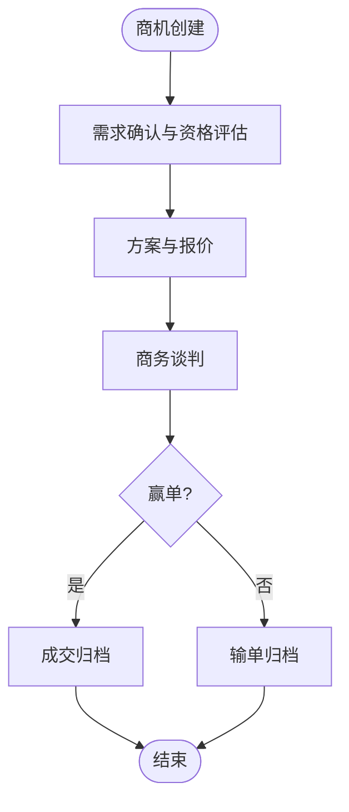
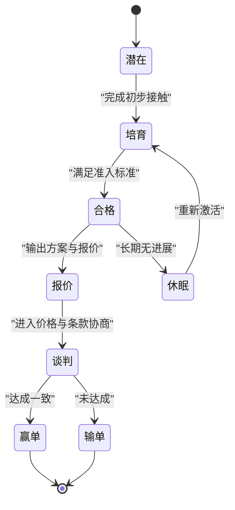
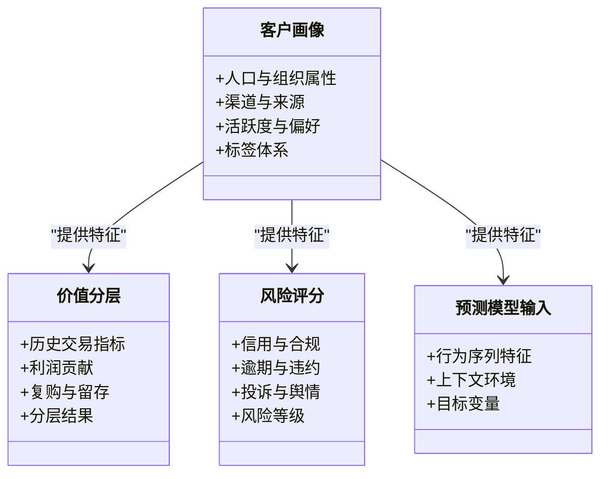
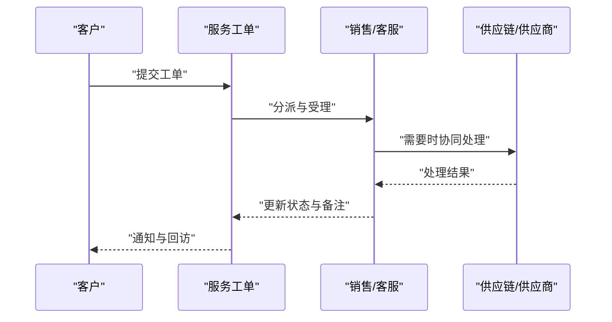
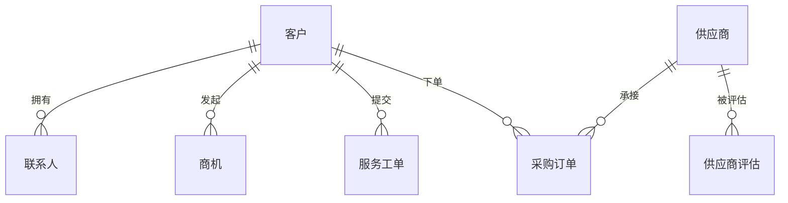
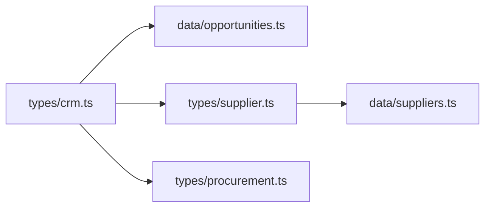

# CRM业务类型

<cite>
**本文引用的文件**   
- [src/types/crm.ts](file://src/types/crm.ts)
- [src/data/opportunities.ts](file://src/data/opportunities.ts)
- [src/types/procurement.ts](file://src/types/procurement.ts)
- [src/types/supplier.ts](file://src/types/supplier.ts)
- [src/data/suppliers.ts](file://src/data/suppliers.ts)
</cite>

## 目录
1. [简介](#简介)
2. [项目结构](#项目结构)
3. [核心组件](#核心组件)
4. [架构总览](#架构总览)
5. [详细组件分析](#详细组件分析)
6. [依赖分析](#依赖分析)
7. [性能考虑](#性能考虑)
8. [故障排查指南](#故障排查指南)
9. [结论](#结论)
10. [附录](#附录)

## 简介
本文件面向Supply OS客户关系管理（CRM）模块的类型定义，系统性梳理客户管理、销售管道、商机跟踪、客户服务等关键业务类型的结构与约束。文档重点说明：
- 客户生命周期状态与阶段转换规则
- 销售阶段与价值评估模型
- CRM工作流的状态机类型与流程约束
- 客户画像、行为分析与预测模型的类型结构
- 与供应商、采购等模块的关联类型设计

目标是帮助开发者与产品人员快速理解CRM领域模型，并在扩展与维护中保持一致性。

## 项目结构
CRM相关类型主要集中于以下位置：
- 类型定义：src/types/crm.ts
- 示例数据：src/data/opportunities.ts
- 跨域关联：src/types/procurement.ts、src/types/supplier.ts、src/data/suppliers.ts

图表来源
- [src/types/crm.ts](file://src/types/crm.ts)
- [src/data/opportunities.ts](file://src/data/opportunities.ts)
- [src/types/procurement.ts](file://src/types/procurement.ts)
- [src/types/supplier.ts](file://src/types/supplier.ts)
- [src/data/suppliers.ts](file://src/data/suppliers.ts)

章节来源
- [src/types/crm.ts](file://src/types/crm.ts)
- [src/data/opportunities.ts](file://src/data/opportunities.ts)
- [src/types/procurement.ts](file://src/types/procurement.ts)
- [src/types/supplier.ts](file://src/types/supplier.ts)
- [src/data/suppliers.ts](file://src/data/suppliers.ts)

## 核心组件
本节聚焦CRM领域中的核心实体与关系，包括客户、联系人、商机、活动、服务工单以及它们之间的关联。

- 客户与联系人
  - 用于承载企业级或个体级主体信息，支持多联系人、地址、标签、来源渠道等维度。
  - 典型字段包含基础身份信息、组织属性、联系方式、来源与归属、生命周期状态等。
- 商机与销售阶段
  - 描述潜在交易从发现到成交的全链路，包含阶段枚举、概率、金额、预计关闭时间、负责人等。
  - 支持按阶段统计转化率与收入预测。
- 活动与会务
  - 记录电话、会议、邮件、拜访等互动事件，便于构建客户交互时序与参与度指标。
- 服务工单
  - 覆盖售前咨询与售后问题处理，包含优先级、分类、解决时长、满意度等。
- 价值评估与画像
  - 基于历史交易、互动频次、行业规模、地区等因素计算客户价值分层与风险评分。
- 行为分析与预测
  - 通过行为序列与特征工程生成倾向性评分、流失预警、复购概率等。

章节来源
- [src/types/crm.ts](file://src/types/crm.ts)

## 架构总览
下图展示CRM类型在系统内的边界与外部模块的耦合点，强调与采购、供应商的数据契约。

图表来源
- [src/types/crm.ts](file://src/types/crm.ts)
- [src/data/opportunities.ts](file://src/data/opportunities.ts)
- [src/types/supplier.ts](file://src/types/supplier.ts)
- [src/data/suppliers.ts](file://src/data/suppliers.ts)
- [src/types/procurement.ts](file://src/types/procurement.ts)

## 详细组件分析

### 客户与联系人模型
- 职责
  - 统一维护企业与个人主体的主数据，支撑销售、市场与服务场景。
- 关键字段（概念性说明）
  - 标识与元数据：唯一ID、创建/更新时间、版本、租户/部门归属
  - 基本信息：名称、类型（企业/个人）、行业、规模、地区、语言、币种
  - 联系信息：邮箱、电话、地址、社交账号、官网
  - 来源与线索：渠道来源、线索来源、首次触达时间、跟进人
  - 生命周期状态：如“潜在-培育-合格-报价-谈判-赢单-输单-休眠”
  - 标签与分组：行业标签、价值分层、风险等级、自定义标签
- 关系
  - 一对多联系人
  - 一对多活动与会务
  - 一对多商机
  - 一对多服务工单
  - 多对多供应商（通过采购订单关联）

图表来源
- [src/types/crm.ts](file://src/types/crm.ts)

章节来源
- [src/types/crm.ts](file://src/types/crm.ts)

### 销售管道与商机跟踪
- 阶段定义
  - 建议采用可配置的阶段枚举，并绑定默认概率与平均周期，便于漏斗统计与预测。
- 金额与概率
  - 金额字段需支持币种与汇率；概率字段用于加权收入预测。
- 责任与协作
  - 明确Owner、协作者、审批链与权限范围。
- 示例数据
  - 参考示例数据以了解字段填充规范与取值范围。

图表来源
- [src/types/crm.ts](file://src/types/crm.ts)
- [src/data/opportunities.ts](file://src/data/opportunities.ts)

章节来源
- [src/types/crm.ts](file://src/types/crm.ts)
- [src/data/opportunities.ts](file://src/data/opportunities.ts)

### 客户生命周期状态机
- 状态集合
  - 潜在、培育、合格、报价、谈判、赢单、输单、休眠、流失等。
- 转换约束
  - 仅允许符合业务规则的单向或有限双向转换，例如“赢单/输单”为终态，“休眠”可回迁至“培育”。
- 触发条件
  - 由活动、商机阶段推进或服务工单状态变更驱动。
- 审计与回溯
  - 记录每次状态变更的时间、操作人与原因。

图表来源
- [src/types/crm.ts](file://src/types/crm.ts)

章节来源
- [src/types/crm.ts](file://src/types/crm.ts)

### 客户价值评估与画像
- 价值分层
  - 基于历史交易总额、毛利率、复购率、账期、违约次数等指标进行分层。
- 画像维度
  - 行业、规模、地区、渠道来源、活跃度、偏好品类、价格敏感度等。
- 风险评分
  - 结合信用、逾期、投诉、负面舆情等因子计算风险等级。
- 预测模型输入
  - 将画像与行为序列作为特征，输出复购概率、流失概率、推荐品类等。

图表来源
- [src/types/crm.ts](file://src/types/crm.ts)

章节来源
- [src/types/crm.ts](file://src/types/crm.ts)

### 客户服务与工单
- 工单类型
  - 售前咨询、售后问题、退换货、技术支持、投诉建议等。
- SLA与优先级
  - 根据客户层级与合同级别设定响应与解决时限。
- 闭环与复盘
  - 记录根因、解决方案、知识库沉淀与满意度反馈。

图表来源
- [src/types/crm.ts](file://src/types/crm.ts)

章节来源
- [src/types/crm.ts](file://src/types/crm.ts)

### 与供应商、采购的关联类型
- 供应商主数据
  - 供应商资质、评级、结算方式、交付能力、合规信息等。
- 采购订单
  - 与供应商、物料、数量、价格、交期、质量验收等关联。
- CRM与采购联动
  - 通过“客户-供应商”关系实现双向视角：既可作为买方也可作为卖方。
  - 商机与采购订单可建立映射，用于端到端追踪。

图表来源
- [src/types/supplier.ts](file://src/types/supplier.ts)
- [src/types/procurement.ts](file://src/types/procurement.ts)
- [src/data/suppliers.ts](file://src/data/suppliers.ts)
- [src/types/crm.ts](file://src/types/crm.ts)

章节来源
- [src/types/supplier.ts](file://src/types/supplier.ts)
- [src/types/procurement.ts](file://src/types/procurement.ts)
- [src/data/suppliers.ts](file://src/data/suppliers.ts)
- [src/types/crm.ts](file://src/types/crm.ts)

## 依赖分析
- 内聚性
  - CRM类型集中在单一文件中，职责清晰，便于演进与测试。
- 耦合点
  - 与供应商、采购类型存在外键式引用，建议在接口层做校验与一致性保障。
- 示例数据
  - 商机示例数据用于验证类型约束与UI渲染，避免空值与非法枚举导致异常。

图表来源
- [src/types/crm.ts](file://src/types/crm.ts)
- [src/data/opportunities.ts](file://src/data/opportunities.ts)
- [src/types/supplier.ts](file://src/types/supplier.ts)
- [src/types/procurement.ts](file://src/types/procurement.ts)
- [src/data/suppliers.ts](file://src/data/suppliers.ts)

章节来源
- [src/types/crm.ts](file://src/types/crm.ts)
- [src/data/opportunities.ts](file://src/data/opportunities.ts)
- [src/types/supplier.ts](file://src/types/supplier.ts)
- [src/types/procurement.ts](file://src/types/procurement.ts)
- [src/data/suppliers.ts](file://src/data/suppliers.ts)

## 性能考虑
- 索引与查询
  - 对高频过滤字段（如生命周期状态、商机阶段、客户行业、地区）建立合适索引。
- 缓存策略
  - 对静态字典（阶段、标签、分类）使用本地缓存，减少重复请求。
- 批量写入
  - 批量导入客户与活动时，合并事务与去重逻辑，降低数据库压力。
- 分页与懒加载
  - 列表与详情按需加载，避免一次性拉取大量数据。

[本节为通用指导，不直接分析具体文件]

## 故障排查指南
- 常见错误
  - 状态转换非法：检查状态机约束与前置条件。
  - 金额与概率不一致：校验必填字段与取值范围。
  - 关联缺失：确保客户-联系人、客户-商机、客户-工单的外键完整。
- 定位方法
  - 通过示例数据对比字段格式与枚举值。
  - 在关键节点增加日志与断言，捕获非法状态与空指针。

章节来源
- [src/data/opportunities.ts](file://src/data/opportunities.ts)
- [src/types/crm.ts](file://src/types/crm.ts)

## 结论
通过对CRM核心类型与跨域关联的系统化梳理，明确了客户生命周期、销售阶段、价值评估与预测模型的结构与约束，以及与供应商、采购模块的集成方式。建议在后续迭代中：
- 完善状态机与流程引擎的类型契约
- 引入更细粒度的权限与审计类型
- 持续优化示例数据与校验规则，提升稳定性与可维护性

[本节为总结性内容，不直接分析具体文件]

## 附录
- 术语表
  - 商机：潜在交易机会，贯穿销售全流程
  - 生命周期状态：客户从接触到成交及后续状态的演进
  - 价值分层：基于多维指标对客户进行的分级
  - 风险评分：衡量客户信用与违约可能性的量化指标
- 参考路径
  - 类型定义：src/types/crm.ts
  - 示例数据：src/data/opportunities.ts
  - 供应商与采购：src/types/supplier.ts、src/types/procurement.ts、src/data/suppliers.ts

[本节为补充信息，不直接分析具体文件]