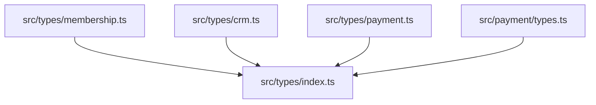
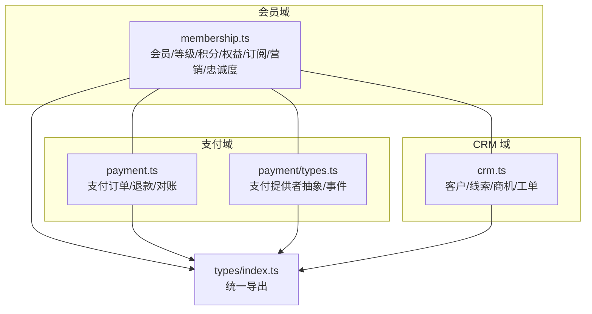
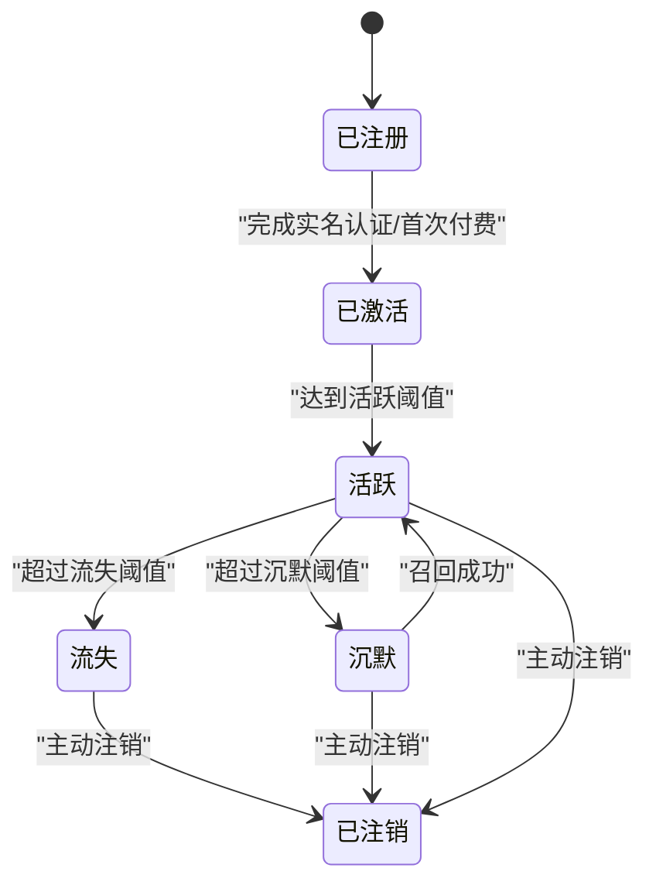
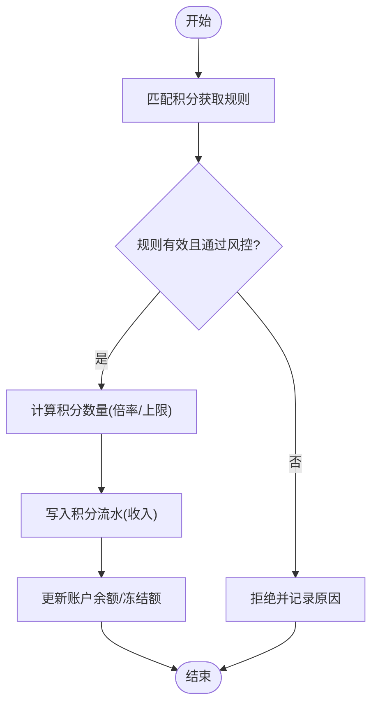
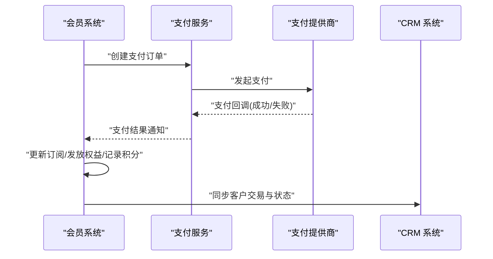
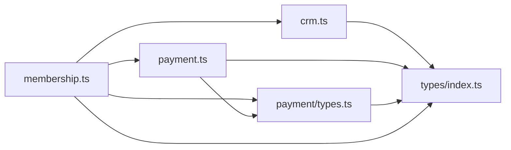

# 会员管理类型

<cite>
**本文引用的文件**   
- [src/types/membership.ts](file://src/types/membership.ts)
- [src/types/crm.ts](file://src/types/crm.ts)
- [src/types/payment.ts](file://src/types/payment.ts)
- [src/payment/types.ts](file://src/payment/types.ts)
- [src/types/index.ts](file://src/types/index.ts)
</cite>

## 目录
1. [简介](#简介)
2. [项目结构](#项目结构)
3. [核心组件](#核心组件)
4. [架构总览](#架构总览)
5. [详细组件分析](#详细组件分析)
6. [依赖分析](#依赖分析)
7. [性能考虑](#性能考虑)
8. [故障排查指南](#故障排查指南)
9. [结论](#结论)
10. [附录](#附录)

## 简介
本文件为 Supply OS 会员管理系统的“类型定义”提供系统化文档，覆盖会员等级、积分体系、权益管理、续费订阅、生命周期状态、等级晋升与权益授予、积分获取与消费记录、兑换机制、营销与精准推送、忠诚度管理以及与支付、CRM 等模块的关联类型。目标是帮助开发者快速理解并正确使用这些类型，确保前后端数据契约一致、扩展与维护成本可控。

## 项目结构
围绕会员管理相关的类型主要分布在以下位置：
- src/types/membership.ts：会员领域核心类型（会员、等级、积分、权益、订阅、生命周期、营销与忠诚度等）
- src/types/crm.ts：CRM 相关实体与关系类型
- src/types/payment.ts：支付订单与交易相关类型
- src/payment/types.ts：支付提供者抽象与通用支付事件类型
- src/types/index.ts：类型聚合导出入口

图表来源
- [src/types/membership.ts](file://src/types/membership.ts)
- [src/types/crm.ts](file://src/types/crm.ts)
- [src/types/payment.ts](file://src/types/payment.ts)
- [src/payment/types.ts](file://src/payment/types.ts)
- [src/types/index.ts](file://src/types/index.ts)

章节来源
- [src/types/membership.ts](file://src/types/membership.ts)
- [src/types/crm.ts](file://src/types/crm.ts)
- [src/types/payment.ts](file://src/types/payment.ts)
- [src/payment/types.ts](file://src/payment/types.ts)
- [src/types/index.ts](file://src/types/index.ts)

## 核心组件
本节概述会员管理领域的关键类型分组及其职责边界：
- 会员与身份：会员基础信息、认证标识、联系方式、归属组织/渠道等
- 会员等级与生命周期：等级枚举、等级规则、生命周期阶段、状态迁移约束
- 积分体系：积分账户、积分流水、获取规则、消费记录、兑换策略
- 权益管理：权益项、发放条件、有效期、使用记录、扣减与回滚
- 订阅与续费：订阅计划、周期、自动续费开关、到期处理、升级/降级
- 营销与精准推送：活动、标签、人群圈选、触达渠道、消息模板
- 忠诚度管理：忠诚度值、里程碑、奖励兑换、排行榜
- 外部集成：支付订单、退款、对账；CRM 客户档案、线索、商机、工单

章节来源
- [src/types/membership.ts](file://src/types/membership.ts)
- [src/types/crm.ts](file://src/types/crm.ts)
- [src/types/payment.ts](file://src/types/payment.ts)
- [src/payment/types.ts](file://src/payment/types.ts)

## 架构总览
下图展示会员管理与支付、CRM 的类型协作关系与数据流向。

图表来源
- [src/types/membership.ts](file://src/types/membership.ts)
- [src/types/payment.ts](file://src/types/payment.ts)
- [src/payment/types.ts](file://src/payment/types.ts)
- [src/types/crm.ts](file://src/types/crm.ts)
- [src/types/index.ts](file://src/types/index.ts)

## 详细组件分析

### 会员与身份
- 会员实体：包含唯一标识、姓名/昵称、手机号、邮箱、头像、注册时间、最后登录时间、所属组织/渠道、来源标记、备注等
- 认证与权限：关联用户账号、角色/权限集合、多租户/多组织隔离字段
- 联系人信息：主联系人、紧急联系人、地址簿等
- 审计字段：创建人、更新人、创建时间、更新时间、删除标记

章节来源
- [src/types/membership.ts](file://src/types/membership.ts)

### 会员等级与生命周期
- 等级模型：等级编码、名称、图标、描述、等级门槛（累计消费/活跃天数/积分阈值）、等级有效期、是否可降级、等级特权清单
- 生命周期阶段：注册、激活、沉默、流失、回归、注销等
- 状态迁移：基于事件的有向图，如“注册→激活→活跃→沉默→流失”，各阶段转换触发条件与副作用（如发送提醒、调整权益）
- 晋升规则：按周期或事件驱动计算，支持加权规则（消费金额权重、互动频次权重、推荐成功权重），含冷却期与防刷校验

图表来源
- [src/types/membership.ts](file://src/types/membership.ts)

章节来源
- [src/types/membership.ts](file://src/types/membership.ts)

### 积分体系
- 积分账户：会员维度或组织维度的积分余额、冻结额度、可用额度、最近结算日
- 积分流水：收入/支出明细，包含来源类型（注册、消费、活动、系统调账）、关联业务单号、数量、快照、审核状态
- 获取规则：按行为或事件生成积分，支持倍率、上限、去重、反作弊
- 消费记录：兑换商品、抵扣现金、抽奖等场景的扣减流水
- 兑换机制：兑换表单项、库存校验、价格折算、发放凭证、失败回滚

图表来源
- [src/types/membership.ts](file://src/types/membership.ts)

章节来源
- [src/types/membership.ts](file://src/types/membership.ts)

### 权益管理
- 权益项：权益编码、名称、类型（折扣券、免邮券、专属客服、优先发货等）、适用范围、有效期、使用次数限制、互斥规则
- 发放策略：按等级自动发放、活动发放、手动发放、条件触发发放
- 使用记录：核销流水、使用场景、关联订单、状态（未使用/已使用/已过期/已作废）
- 扣减与回滚：幂等控制、并发安全、异常补偿

章节来源
- [src/types/membership.ts](file://src/types/membership.ts)

### 订阅与续费
- 订阅计划：计划编码、名称、周期（月/季/年）、价格、折扣、赠送权益、升级/降级路径
- 订阅实例：会员关联的订阅、生效时间、到期时间、自动续费开关、支付方式、账单周期、历史版本
- 续费流程：到期前提醒、扣款重试、失败通知、降级策略、宽限期
- 变更处理：中途升级/降级的计费分摊、权益即时生效或次周期生效

章节来源
- [src/types/membership.ts](file://src/types/membership.ts)

### 营销与精准推送
- 营销活动：活动编码、名称、类型（拉新、促活、复购）、预算、目标人群、投放渠道、起止时间、效果指标
- 标签与人群：标签体系、动态人群规则（条件组合）、人群规模估算
- 触达渠道：短信、邮件、站内信、App Push、企业微信/钉钉
- 消息模板：变量占位、语言包、审批流、发送批次与回执

章节来源
- [src/types/membership.ts](file://src/types/membership.ts)

### 忠诚度管理
- 忠诚度值：基于消费、互动、推荐等行为计算的忠诚度分数，支持分档与里程碑
- 里程碑奖励：达成里程碑后发放积分/权益/优惠券
- 排行榜：区域/行业/品类维度的排名与曝光策略

章节来源
- [src/types/membership.ts](file://src/types/membership.ts)

### 与支付模块的关联
- 支付订单：订单号、会员ID、金额、币种、支付方式、支付状态、支付时间、回调签名、退款状态
- 退款：原订单号、退款金额、退款原因、审核状态、到账时间
- 对账：批次号、平台流水号、金额一致性校验结果、差异处理
- 支付提供者抽象：统一的支付接口、事件回调、错误码映射

图表来源
- [src/types/payment.ts](file://src/types/payment.ts)
- [src/payment/types.ts](file://src/payment/types.ts)
- [src/types/membership.ts](file://src/types/membership.ts)
- [src/types/crm.ts](file://src/types/crm.ts)

章节来源
- [src/types/payment.ts](file://src/types/payment.ts)
- [src/payment/types.ts](file://src/payment/types.ts)

### 与 CRM 模块的关联
- 客户档案：客户编号、企业名称、统一社会信用代码、联系人、地址、行业、规模、来源渠道
- 线索与商机：线索来源、跟进记录、转化阶段、预计成交金额、负责人
- 工单与服务：问题分类、优先级、SLA、解决时长、满意度
- 数据同步：会员与客户的映射关系、字段对齐、冲突解决策略

章节来源
- [src/types/crm.ts](file://src/types/crm.ts)

## 依赖分析
- 内聚性：membership.ts 集中承载会员域核心概念，保持高内聚；payment.ts 与 payment/types.ts 解耦支付实现细节；crm.ts 独立维护客户关系
- 耦合点：会员订阅与支付订单强关联；会员等级/权益与营销/忠诚度联动；会员与 CRM 的客户档案双向映射
- 外部依赖：支付提供商通过统一接口接入，避免直接耦合具体厂商；CRM 通过标准实体进行数据交换

图表来源
- [src/types/membership.ts](file://src/types/membership.ts)
- [src/types/payment.ts](file://src/types/payment.ts)
- [src/payment/types.ts](file://src/payment/types.ts)
- [src/types/crm.ts](file://src/types/crm.ts)
- [src/types/index.ts](file://src/types/index.ts)

章节来源
- [src/types/membership.ts](file://src/types/membership.ts)
- [src/types/payment.ts](file://src/types/payment.ts)
- [src/payment/types.ts](file://src/payment/types.ts)
- [src/types/crm.ts](file://src/types/crm.ts)
- [src/types/index.ts](file://src/types/index.ts)

## 性能考虑
- 积分与权益计算：采用批处理与延迟落库策略，减少高频写放大；引入幂等键与去重表防止重复发放
- 订阅续费：预扣款窗口与重试队列分离，避免阻塞主流程；使用事件驱动异步处理通知与权益生效
- 精准推送：人群圈选先做索引过滤，分批下发消息，结合限流与退避策略降低下游压力
- 缓存与一致性：热点数据（等级、权益清单）本地缓存+失效策略；跨系统数据以最终一致性为目标，提供补偿任务

[本节为通用指导，不直接分析具体文件]

## 故障排查指南
- 支付回调丢失或重复：核对支付订单状态机与幂等键；检查回调签名与重试策略；对比对账差异
- 积分发放异常：核查规则命中日志、风控拦截原因、并发锁与事务边界；确认流水与余额一致性
- 订阅续费失败：查看支付提供商错误码、重试次数、宽限期与降级策略；确认会员状态是否允许续费
- 权益核销失败：检查互斥规则、有效期、库存与并发扣减；定位核销流水与回滚记录
- CRM 同步失败：比对字段映射与必填项；检查网络超时与重试；确认主从数据源冲突解决策略

章节来源
- [src/types/payment.ts](file://src/types/payment.ts)
- [src/payment/types.ts](file://src/payment/types.ts)
- [src/types/membership.ts](file://src/types/membership.ts)
- [src/types/crm.ts](file://src/types/crm.ts)

## 结论
通过对会员管理相关类型的系统化梳理，明确了会员等级、积分、权益、订阅、营销与忠诚度的数据结构与交互边界，并与支付、CRM 形成清晰的数据契约。建议在后续迭代中持续完善规则引擎、事件总线与对账补偿能力，以提升系统的可扩展性与稳定性。

[本节为总结性内容，不直接分析具体文件]

## 附录
- 术语对照：会员、等级、积分、权益、订阅、充值、退款、对账、线索、商机、工单
- 建议命名规范：类型名使用大驼峰，枚举值使用大写加下划线，字段名使用小驼峰
- 版本兼容：新增字段默认可选并提供迁移脚本；废弃字段保留过渡期并标注弃用说明

[本节为补充说明，不直接分析具体文件]