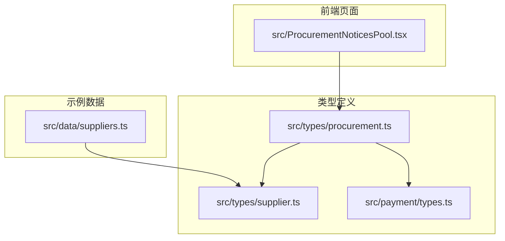
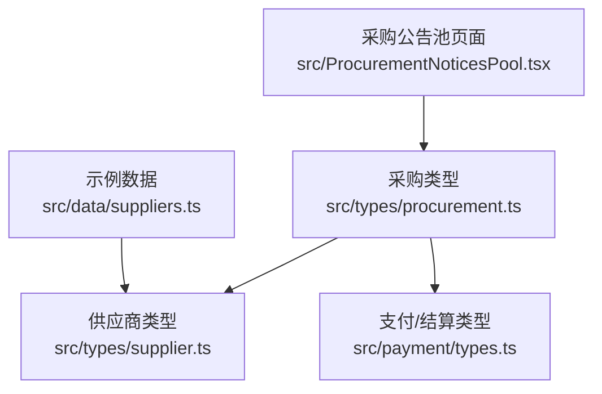
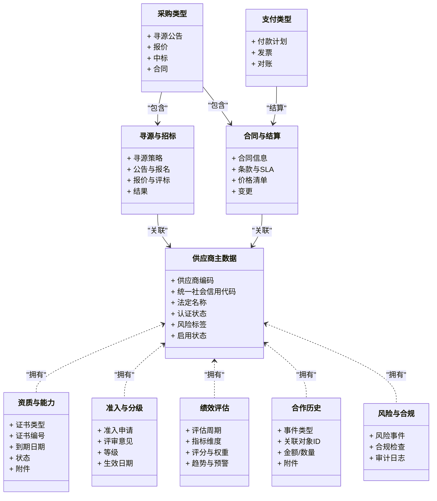

# 供应商管理类型

<cite>
**本文引用的文件**   
- [src/types/supplier.ts](file://src/types/supplier.ts)
- [src/data/suppliers.ts](file://src/data/suppliers.ts)
- [src/types/procurement.ts](file://src/types/procurement.ts)
- [src/ProcurementNoticesPool.tsx](file://src/ProcurementNoticesPool.tsx)
- [src/payment/types.ts](file://src/payment/types.ts)
</cite>

## 目录
1. [简介](#简介)
2. [项目结构](#项目结构)
3. [核心组件](#核心组件)
4. [架构总览](#架构总览)
5. [详细组件分析](#详细组件分析)
6. [依赖分析](#依赖分析)
7. [性能考虑](#性能考虑)
8. [故障排查指南](#故障排查指南)
9. [结论](#结论)
10. [附录](#附录)

## 简介
本文件为 Supply OS 供应商管理模块的类型定义文档，聚焦于供应商档案、资质管理、绩效评估、合作历史、准入审核、分级与淘汰机制、寻源比价招标、合同签订、风险监控、合规检查与审计追踪等关键领域。同时说明与采购、财务等模块的供应商数据关联类型，帮助开发者与业务人员统一理解数据结构与流转关系。

## 项目结构
供应商相关类型主要位于 types 目录下的 supplier.ts 与 procurement.ts，运行时示例数据位于 data/suppliers.ts；采购流程页面引用了采购公告池类型；支付类型用于与财务结算的关联。

图表来源
- [src/types/supplier.ts](file://src/types/supplier.ts)
- [src/types/procurement.ts](file://src/types/procurement.ts)
- [src/data/suppliers.ts](file://src/data/suppliers.ts)
- [src/ProcurementNoticesPool.tsx](file://src/ProcurementNoticesPool.tsx)
- [src/payment/types.ts](file://src/payment/types.ts)

章节来源
- [src/types/supplier.ts](file://src/types/supplier.ts)
- [src/types/procurement.ts](file://src/types/procurement.ts)
- [src/data/suppliers.ts](file://src/data/suppliers.ts)
- [src/ProcurementNoticesPool.tsx](file://src/ProcurementNoticesPool.tsx)
- [src/payment/types.ts](file://src/payment/types.ts)

## 核心组件
本节概述供应商管理的关键类型域及其职责边界：
- 供应商主数据与档案：供应商基本信息、组织信息、联系人、地址、银行账户、认证状态、风险标签等。
- 资质与能力：资质证书、产能、质量体系、环保与安全许可、有效期与复审记录。
- 准入与分级：准入申请、评审意见、审批流、等级（如战略/优选/合格/观察）、升降级规则。
- 绩效评估：质量、交付、成本、服务等多维指标，评分模型、周期、趋势与预警。
- 合作历史：询价、报价、中标、合同、订单、验收、结算、退货与索赔等全生命周期事件。
- 寻源与招投标：需求发布、寻源策略、公告、报名、资格预审、开标、评标、定标、结果公示。
- 合同与结算：合同条款、里程碑、价格清单、变更、附件、付款计划、发票与对账。
- 风险与合规：风险事件、黑名单、制裁名单、合规检查项、整改任务、审计日志。
- 跨模块关联：与采购、财务、库存、质量等模块的数据外键与聚合视图。

章节来源
- [src/types/supplier.ts](file://src/types/supplier.ts)
- [src/types/procurement.ts](file://src/types/procurement.ts)
- [src/payment/types.ts](file://src/payment/types.ts)

## 架构总览
下图展示供应商管理与采购、财务之间的类型交互关系与数据流向。

图表来源
- [src/types/supplier.ts](file://src/types/supplier.ts)
- [src/types/procurement.ts](file://src/types/procurement.ts)
- [src/payment/types.ts](file://src/payment/types.ts)
- [src/data/suppliers.ts](file://src/data/suppliers.ts)
- [src/ProcurementNoticesPool.tsx](file://src/ProcurementNoticesPool.tsx)

## 详细组件分析

### 供应商档案与基础信息
- 目标：描述供应商主数据的静态属性与动态状态，支撑后续资质、绩效、合作历史等扩展。
- 关键字段建议：
  - 标识与名称：供应商编码、统一社会信用代码、法定名称、简称、品牌名。
  - 主体信息：企业类型、注册资本、成立日期、注册地址、经营地址、经营范围。
  - 联系信息：联系人、电话、邮箱、网站、紧急联系人。
  - 账户信息：开户行、账号、币种、SWIFT/BIC（跨境）。
  - 认证与状态：认证状态、启用/禁用、风险标签、是否纳入黑名单。
  - 元数据：创建人、更新时间、版本、数据来源。
- 设计要点：
  - 使用强类型枚举表达认证状态、风险等级、启用状态，避免自由文本歧义。
  - 将“统一社会信用代码”作为唯一约束或业务键，便于跨系统对接。
  - 通过“版本号”支持档案演进与审计追溯。

章节来源
- [src/types/supplier.ts](file://src/types/supplier.ts)

### 资质管理与能力证明
- 目标：集中管理供应商的资质证书、体系认证、产能与资源能力，并跟踪有效期与复审。
- 关键字段建议：
  - 证书类型：ISO9001、ISO14001、OHSAS18001、行业许可证等。
  - 证书编号、发证机构、颁发日期、到期日期、复审周期、状态（有效/即将过期/已过期）。
  - 附件：证书扫描件、现场审核报告、第三方评估报告。
  - 能力维度：年产能、关键设备、检测能力、覆盖地区。
- 设计要点：
  - 采用“证书-附件-变更记录”的三元结构，确保可追溯。
  - 引入“即将过期”预警阈值，驱动提醒与续证流程。

章节来源
- [src/types/supplier.ts](file://src/types/supplier.ts)

### 准入审核与分级管理
- 目标：规范供应商准入流程与等级划分，形成“申请-评审-审批-定级-生效”的闭环。
- 关键字段建议：
  - 准入申请：申请单号、申请原因、适用范围、期望等级、提交材料清单。
  - 评审要素：资质审查、样品验证、现场考察、风险评估、商务谈判。
  - 审批流：角色、节点、意见、决策、时间戳、操作人。
  - 等级：战略/优选/合格/观察/淘汰，升降级触发条件与生效日期。
- 设计要点：
  - 将“等级”与“准入状态”解耦，前者影响寻源权重，后者控制是否可参与交易。
  - 所有评审与审批动作需落库并保留审计轨迹。

章节来源
- [src/types/supplier.ts](file://src/types/supplier.ts)

### 绩效评估与持续改进
- 目标：建立多维度、可量化的供应商绩效模型，驱动优胜劣汰。
- 关键字段建议：
  - 评估周期：月度/季度/年度。
  - 指标维度：质量合格率、准时交付率、成本竞争力、服务响应、合规表现。
  - 评分与权重：指标得分、权重、加权总分、等级映射。
  - 趋势与预警：环比/同比、阈值告警、改进计划与复盘。
- 设计要点：
  - 指标与权重应可配置，支持不同品类差异化模型。
  - 评估结果与准入等级联动，自动触发复评或降级。

章节来源
- [src/types/supplier.ts](file://src/types/supplier.ts)

### 合作历史与全生命周期事件
- 目标：沉淀供应商从寻源到结算的全链路事件，形成可查询、可分析的历史档案。
- 关键字段建议：
  - 事件类型：寻源公告、报名、报价、中标、合同、订单、发货、验收、结算、退货、索赔。
  - 事件上下文：关联对象ID（如合同号、订单号）、金额、数量、时间、操作人。
  - 附件与证据：中标通知书、验收单、发票、对账单。
- 设计要点：
  - 以“事件表+聚合视图”的方式实现，既保证明细可查，又提供高层统计。
  - 事件幂等与去重，防止重复录入导致统计失真。

章节来源
- [src/types/supplier.ts](file://src/types/supplier.ts)

### 寻源、比价与招标
- 目标：标准化寻源流程，支持多轮竞价、综合评标与结果公示。
- 关键字段建议：
  - 寻源策略：公开/邀请、单一来源、框架协议、竞价、拍卖。
  - 公告与报名：公告标题、范围、截止时间、报名条件、保证金。
  - 报价与评标：报价明细、技术评分、商务评分、综合得分、排名。
  - 结果：中标方、备选方、异议处理、公示期。
- 设计要点：
  - 报价与评标过程需留痕，支持审计与回溯。
  - 与供应商等级联动，限制低等级供应商参与特定寻源。

章节来源
- [src/types/procurement.ts](file://src/types/procurement.ts)
- [src/ProcurementNoticesPool.tsx](file://src/ProcurementNoticesPool.tsx)

### 合同签订与变更
- 目标：管理合同主数据、条款、价格清单、里程碑与变更，保障履约可控。
- 关键字段建议：
  - 合同信息：合同编号、名称、类型、签署日期、生效/终止日期、管辖法律。
  - 条款与SLA：质量标准、交付要求、违约责任、保密与知识产权。
  - 价格清单：物料/服务、单价、折扣、税率、币种、计价单位。
  - 变更：变更单号、变更内容、审批、版本对比。
- 设计要点：
  - 合同与寻源结果强绑定，确保“招-投-签”一致性。
  - 变更需走审批流，并生成审计日志。

章节来源
- [src/types/procurement.ts](file://src/types/procurement.ts)

### 风险监控、合规检查与审计追踪
- 目标：构建供应商风险画像，落实合规检查与审计追踪，降低供应链风险。
- 关键字段建议：
  - 风险事件：风险类型（财务、法务、ESG、制裁）、严重级别、发现时间、处置状态。
  - 合规检查：检查项、标准依据、检查结果、整改任务、复核结果。
  - 审计日志：操作人、操作时间、操作对象、变更前后值、来源系统。
- 设计要点：
  - 风险与合规事件与供应商主数据关联，形成风险看板。
  - 审计日志不可篡改，支持导出与外部审计对接。

章节来源
- [src/types/supplier.ts](file://src/types/supplier.ts)

### 与采购、财务等模块的关联类型
- 与采购模块：
  - 供应商与寻源公告、报价、中标、合同、订单、验收、结算的关联。
  - 通过供应商编码/ID进行外键关联，确保数据一致性与可追溯。
- 与财务模块：
  - 供应商银行账户、发票信息、付款计划、对账单、收款账户校验。
  - 支付类型与供应商结算方式、币种、汇率、手续费等字段对齐。
- 设计要点：
  - 在供应商主数据中维护“结算偏好”，在财务侧进行二次校验。
  - 跨模块数据变更需触发通知与审计记录。

章节来源
- [src/types/procurement.ts](file://src/types/procurement.ts)
- [src/payment/types.ts](file://src/payment/types.ts)

### 示例数据与前端集成
- 示例数据：
  - 示例供应商数据用于演示与联调，包含基本属性与状态，便于快速验证类型定义。
- 前端集成：
  - 采购公告池页面消费采购类型，渲染寻源公告列表与筛选逻辑。
- 设计要点：
  - 示例数据应与类型定义严格对齐，避免运行时报错。
  - 前端仅消费类型契约，不直接修改后端数据结构。

章节来源
- [src/data/suppliers.ts](file://src/data/suppliers.ts)
- [src/ProcurementNoticesPool.tsx](file://src/ProcurementNoticesPool.tsx)

## 依赖分析
供应商类型与采购、支付类型的依赖关系如下：

图表来源
- [src/types/supplier.ts](file://src/types/supplier.ts)
- [src/types/procurement.ts](file://src/types/procurement.ts)
- [src/payment/types.ts](file://src/payment/types.ts)

章节来源
- [src/types/supplier.ts](file://src/types/supplier.ts)
- [src/types/procurement.ts](file://src/types/procurement.ts)
- [src/payment/types.ts](file://src/payment/types.ts)

## 性能考虑
- 索引与查询优化：
  - 对供应商编码、统一社会信用代码、风险标签、认证状态建立索引，提升检索效率。
  - 对合作历史事件按时间、事件类型、供应商ID建立复合索引，加速报表与看板查询。
- 分页与懒加载：
  - 寻源公告、合作历史等大列表采用分页与懒加载，减少首屏压力。
- 缓存策略：
  - 供应商主数据与资质信息变化频率较低，适合短期缓存；绩效与风险事件变化频繁，缓存TTL需缩短。
- 异步与批处理：
  - 绩效评估计算、风险扫描等耗时任务采用异步队列与批处理，避免阻塞主流程。

[本节为通用指导，无需具体文件来源]

## 故障排查指南
- 常见错误定位：
  - 类型不一致：前端消费的后端类型与定义不一致，导致字段缺失或类型错误。
  - 必填校验失败：准入申请、合同、报价等关键流程缺少必填字段。
  - 权限与状态：供应商被禁用或处于观察等级，导致无法参与寻源或下单。
- 排查步骤：
  - 核对类型定义与示例数据是否对齐。
  - 检查业务流程中的状态机转换是否符合预期。
  - 查看审计日志与风险事件，确认是否存在合规问题或异常操作。
- 修复建议：
  - 统一类型契约，增加前端校验与后端校验双重保障。
  - 完善错误码与提示信息，便于快速定位问题。
  - 对高风险供应商实施更严格的审批与监控。

章节来源
- [src/types/supplier.ts](file://src/types/supplier.ts)
- [src/types/procurement.ts](file://src/types/procurement.ts)
- [src/payment/types.ts](file://src/payment/types.ts)

## 结论
本文围绕供应商管理的核心类型进行了系统化梳理，涵盖档案、资质、准入、绩效、合作历史、寻源招标、合同结算、风险合规以及跨模块关联。通过统一的类型契约与清晰的依赖关系，可为开发、测试与运维提供一致的参考，助力构建稳健、可审计、可扩展的供应商管理体系。

[本节为总结性内容，无需具体文件来源]

## 附录
- 术语表：
  - 寻源：寻找潜在供应商的过程，包括发布需求、收集报价与评估。
  - 招标：通过公开或邀请方式，选择最优供应商的采购方式。
  - SLA：服务等级协议，约定服务质量与违约责任。
  - 审计日志：记录系统操作与数据变更的可追溯日志。
- 最佳实践：
  - 类型先行：先定义类型契约，再实现业务逻辑与前端界面。
  - 最小可用：优先实现核心字段与流程，逐步扩展高级特性。
  - 可观测性：完善日志、指标与告警，提升问题定位效率。

[本节为补充信息，无需具体文件来源]