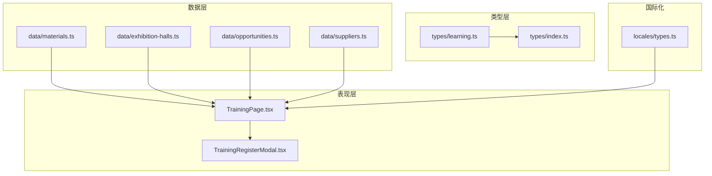
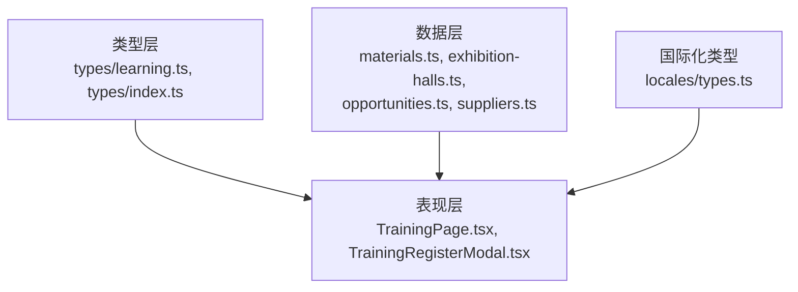
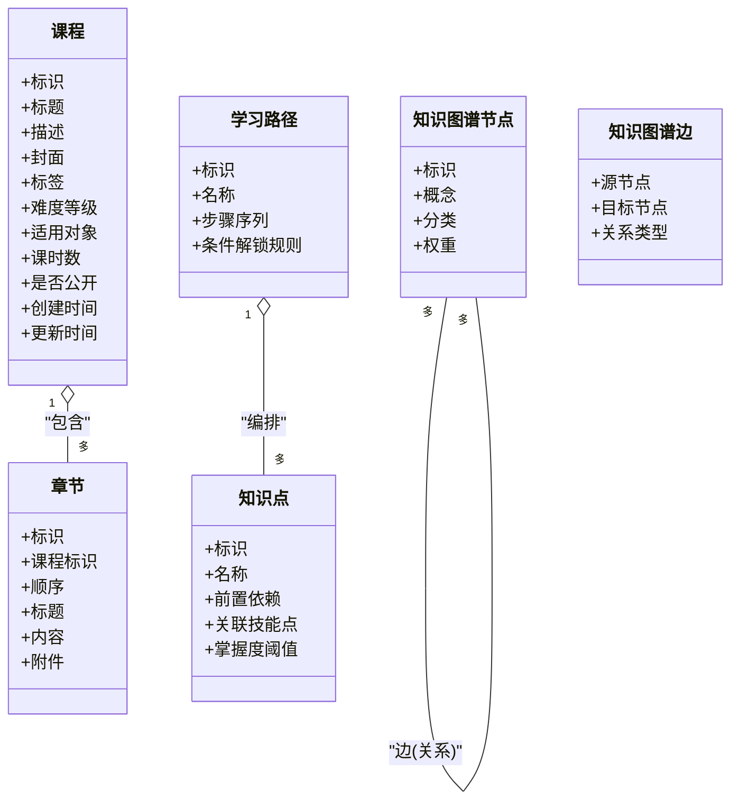
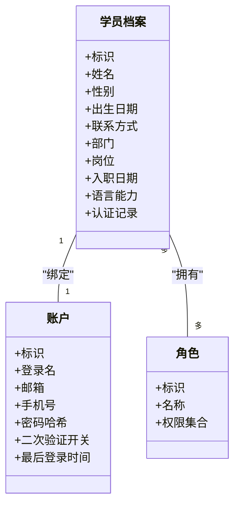
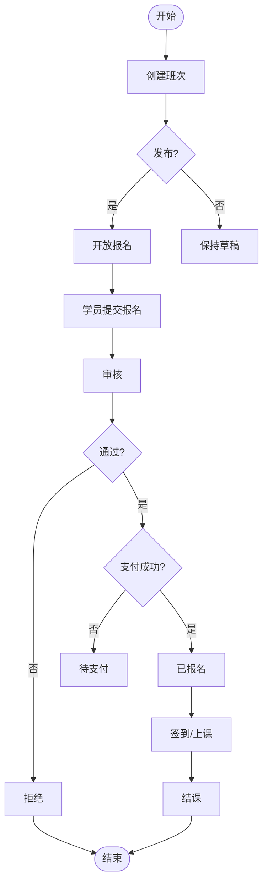
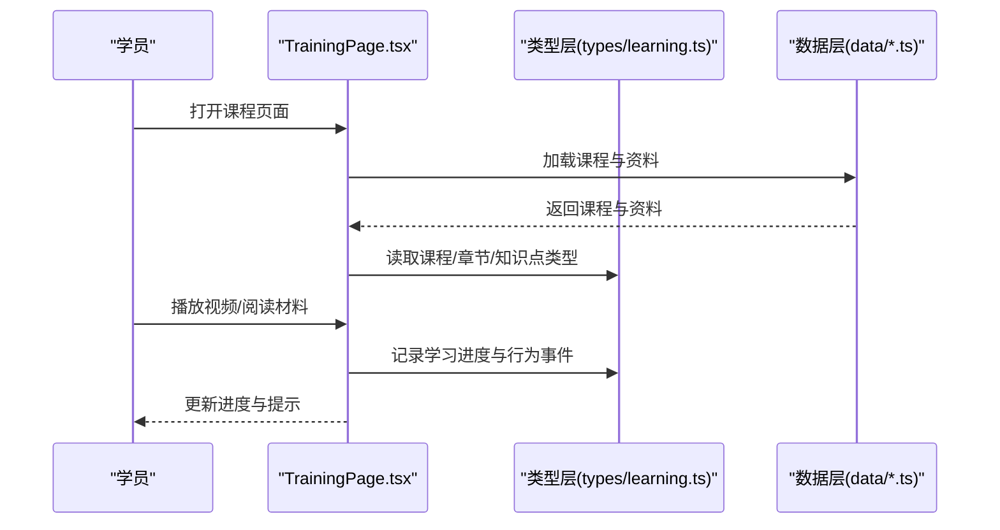
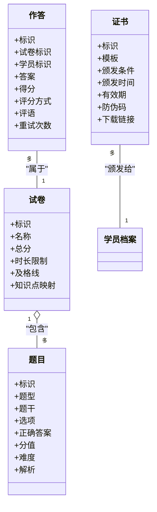
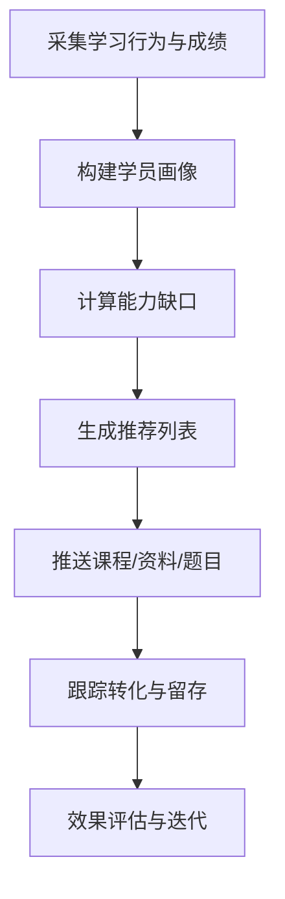
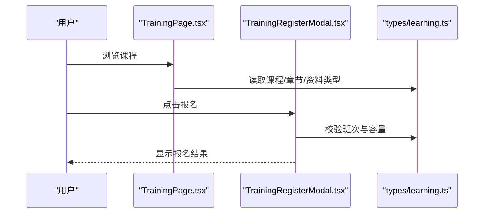
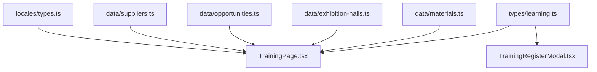

# 学习培训类型

<cite>
**本文引用的文件**   
- [src/types/learning.ts](file://src/types/learning.ts)
- [src/types/index.ts](file://src/types/index.ts)
- [src/TrainingPage.tsx](file://src/TrainingPage.tsx)
- [src/TrainingRegisterModal.tsx](file://src/TrainingRegisterModal.tsx)
- [src/data/materials.ts](file://src/data/materials.ts)
- [src/data/exhibition-halls.ts](file://src/data/exhibition-halls.ts)
- [src/data/opportunities.ts](file://src/data/opportunities.ts)
- [src/data/suppliers.ts](file://src/data/suppliers.ts)
- [src/locales/types.ts](file://src/locales/types.ts)
</cite>

## 目录
1. [简介](#简介)
2. [项目结构](#项目结构)
3. [核心组件](#核心组件)
4. [架构总览](#架构总览)
5. [详细组件分析](#详细组件分析)
6. [依赖分析](#依赖分析)
7. [性能考虑](#性能考虑)
8. [故障排查指南](#故障排查指南)
9. [结论](#结论)
10. [附录](#附录)

## 简介
本文件为Supply OS学习培训系统的“类型定义”提供系统化、可操作的文档。围绕课程管理、学员注册、学习进度、考核评估等关键域，梳理在线课程结构、学习路径与知识图谱的类型设计；同时覆盖学员档案管理、学习行为追踪、成绩管理、培训资料、考试题目与证书管理等类型实现；并对学习分析、个性化推荐与效果评估的类型进行说明。文档以“渐进式复杂度”组织内容，并辅以架构图、类图、时序图与流程图，帮助读者快速理解系统的数据契约与交互流程。

## 项目结构
学习培训相关类型主要集中于类型目录与数据目录中，页面组件通过类型驱动渲染与交互：
- 类型定义：src/types/learning.ts（学习域主类型）、src/types/index.ts（统一导出）
- 页面与交互：src/TrainingPage.tsx（培训页）、src/TrainingRegisterModal.tsx（报名弹窗）
- 示例数据：src/data/materials.ts、src/data/exhibition-halls.ts、src/data/opportunities.ts、src/data/suppliers.ts
- 国际化类型：src/locales/types.ts

图表来源
- [src/types/learning.ts](file://src/types/learning.ts)
- [src/types/index.ts](file://src/types/index.ts)
- [src/TrainingPage.tsx](file://src/TrainingPage.tsx)
- [src/TrainingRegisterModal.tsx](file://src/TrainingRegisterModal.tsx)
- [src/data/materials.ts](file://src/data/materials.ts)
- [src/data/exhibition-halls.ts](file://src/data/exhibition-halls.ts)
- [src/data/opportunities.ts](file://src/data/opportunities.ts)
- [src/data/suppliers.ts](file://src/data/suppliers.ts)
- [src/locales/types.ts](file://src/locales/types.ts)

章节来源
- [src/types/learning.ts](file://src/types/learning.ts)
- [src/types/index.ts](file://src/types/index.ts)
- [src/TrainingPage.tsx](file://src/TrainingPage.tsx)
- [src/TrainingRegisterModal.tsx](file://src/TrainingRegisterModal.tsx)
- [src/data/materials.ts](file://src/data/materials.ts)
- [src/data/exhibition-halls.ts](file://src/data/exhibition-halls.ts)
- [src/data/opportunities.ts](file://src/data/opportunities.ts)
- [src/data/suppliers.ts](file://src/data/suppliers.ts)
- [src/locales/types.ts](file://src/locales/types.ts)

## 核心组件
本节聚焦学习培训的核心类型族，按领域划分：
- 课程与资源：在线课程、章节、知识点、学习路径、知识图谱节点与边
- 学员与档案：学员基本信息、角色、权限、联系方式
- 注册与排课：报名记录、班次、容量、状态机
- 学习进度与行为：观看、阅读、练习、打卡、停留时长
- 考核与成绩：试卷、题目、作答、评分、证书
- 分析与推荐：指标、画像、推荐策略、效果评估

章节来源
- [src/types/learning.ts](file://src/types/learning.ts)
- [src/types/index.ts](file://src/types/index.ts)

## 架构总览
下图展示学习培训类型的分层关系与数据流向：类型层定义契约，数据层提供样例与静态资源，表现层消费类型完成渲染与交互。

图表来源
- [src/types/learning.ts](file://src/types/learning.ts)
- [src/types/index.ts](file://src/types/index.ts)
- [src/TrainingPage.tsx](file://src/TrainingPage.tsx)
- [src/TrainingRegisterModal.tsx](file://src/TrainingRegisterModal.tsx)
- [src/data/materials.ts](file://src/data/materials.ts)
- [src/data/exhibition-halls.ts](file://src/data/exhibition-halls.ts)
- [src/data/opportunities.ts](file://src/data/opportunities.ts)
- [src/data/suppliers.ts](file://src/data/suppliers.ts)
- [src/locales/types.ts](file://src/locales/types.ts)

## 详细组件分析

### 课程与资源类型
- 在线课程：包含标题、描述、封面、标签、难度等级、适用对象、课时数、是否公开、创建与更新时间等字段；支持多语言标题与描述。
- 章节与知识点：章节包含顺序、标题、内容与附件；知识点包含前置依赖、关联技能点、掌握度阈值。
- 学习路径：由多个课程或知识点序列组成，支持条件解锁与分支路径。
- 知识图谱：节点表示概念或技能，边表示先修、并列、进阶关系，便于导航与推荐。

图表来源
- [src/types/learning.ts](file://src/types/learning.ts)

章节来源
- [src/types/learning.ts](file://src/types/learning.ts)

### 学员档案与角色权限
- 学员档案：基础信息、联系方式、所属部门/岗位、入职日期、语言能力、认证记录等。
- 角色与权限：管理员、讲师、学员、访客等角色，以及对应操作权限集合。
- 账户与安全：登录名、邮箱、手机号、密码哈希、二次验证开关、最后登录时间。

图表来源
- [src/types/learning.ts](file://src/types/learning.ts)

章节来源
- [src/types/learning.ts](file://src/types/learning.ts)

### 报名与排课类型
- 班次：课程批次、开班时间、结束时间、授课方式（线上/线下）、容量、已报名人数、状态。
- 报名记录：学员、班次、报名时间、审核状态、支付状态、签到状态、取消原因。
- 状态机：草稿、待审核、已通过、已拒绝、已取消、已结课。

图表来源
- [src/types/learning.ts](file://src/types/learning.ts)
- [src/TrainingRegisterModal.tsx](file://src/TrainingRegisterModal.tsx)

章节来源
- [src/types/learning.ts](file://src/types/learning.ts)
- [src/TrainingRegisterModal.tsx](file://src/TrainingRegisterModal.tsx)

### 学习进度与行为追踪
- 学习进度：课程/章节/知识点的完成状态、观看时长、阅读进度、练习得分、最近学习时间。
- 行为事件：事件类型（观看、点击、提交、收藏、分享）、时间戳、上下文（设备、来源、会话ID）。
- 聚合指标：日活、完成率、平均停留时长、跳出率、复学率。

图表来源
- [src/TrainingPage.tsx](file://src/TrainingPage.tsx)
- [src/types/learning.ts](file://src/types/learning.ts)
- [src/data/materials.ts](file://src/data/materials.ts)

章节来源
- [src/TrainingPage.tsx](file://src/TrainingPage.tsx)
- [src/types/learning.ts](file://src/types/learning.ts)
- [src/data/materials.ts](file://src/data/materials.ts)

### 考核评估与证书管理
- 试卷与题目：题型（单选、多选、判断、简答）、分值、难度、解析、知识点映射。
- 作答与评分：答案、得分、自动评分/人工复核、评语、重试次数。
- 证书：证书模板、颁发条件、颁发时间、有效期、防伪码、下载链接。

图表来源
- [src/types/learning.ts](file://src/types/learning.ts)

章节来源
- [src/types/learning.ts](file://src/types/learning.ts)

### 培训资料与题库
- 资料类型：文档、视频、音频、图片、外部链接；支持元数据（作者、版本、许可证、标签）。
- 题库：按主题/难度/知识点组织，支持批量导入与查重。
- 使用场景：课程内嵌、自学专区、考前冲刺。

图表来源
- [src/data/materials.ts](file://src/data/materials.ts)
- [src/types/learning.ts](file://src/types/learning.ts)

章节来源
- [src/data/materials.ts](file://src/data/materials.ts)
- [src/types/learning.ts](file://src/types/learning.ts)

### 学习分析、个性化推荐与效果评估
- 学习分析：指标维度（个人/班级/企业）、时间粒度（日/周/月）、对比基准（历史/同侪）。
- 个性化推荐：基于兴趣、能力缺口、学习路径的推荐策略；冷启动与多样性保障。
- 效果评估：前后测对比、转化率、留存率、ROI估算、满意度调查。

图表来源
- [src/types/learning.ts](file://src/types/learning.ts)

章节来源
- [src/types/learning.ts](file://src/types/learning.ts)

### 页面与交互中的类型使用
- TrainingPage.tsx：消费课程、章节、资料类型，渲染学习界面与进度条。
- TrainingRegisterModal.tsx：处理报名表单、校验、提交与反馈，依赖班次与报名记录类型。

图表来源
- [src/TrainingPage.tsx](file://src/TrainingPage.tsx)
- [src/TrainingRegisterModal.tsx](file://src/TrainingRegisterModal.tsx)
- [src/types/learning.ts](file://src/types/learning.ts)

章节来源
- [src/TrainingPage.tsx](file://src/TrainingPage.tsx)
- [src/TrainingRegisterModal.tsx](file://src/TrainingRegisterModal.tsx)
- [src/types/learning.ts](file://src/types/learning.ts)

## 依赖分析
类型层作为契约中心，被页面与数据层共同消费；国际化类型用于本地化文案与字段命名。

图表来源
- [src/types/learning.ts](file://src/types/learning.ts)
- [src/TrainingPage.tsx](file://src/TrainingPage.tsx)
- [src/TrainingRegisterModal.tsx](file://src/TrainingRegisterModal.tsx)
- [src/data/materials.ts](file://src/data/materials.ts)
- [src/data/exhibition-halls.ts](file://src/data/exhibition-halls.ts)
- [src/data/opportunities.ts](file://src/data/opportunities.ts)
- [src/data/suppliers.ts](file://src/data/suppliers.ts)
- [src/locales/types.ts](file://src/locales/types.ts)

章节来源
- [src/types/learning.ts](file://src/types/learning.ts)
- [src/types/index.ts](file://src/types/index.ts)
- [src/TrainingPage.tsx](file://src/TrainingPage.tsx)
- [src/TrainingRegisterModal.tsx](file://src/TrainingRegisterModal.tsx)
- [src/data/materials.ts](file://src/data/materials.ts)
- [src/data/exhibition-halls.ts](file://src/data/exhibition-halls.ts)
- [src/data/opportunities.ts](file://src/data/opportunities.ts)
- [src/data/suppliers.ts](file://src/data/suppliers.ts)
- [src/locales/types.ts](file://src/locales/types.ts)

## 性能考虑
- 类型体积与编译时开销：将大类型拆分为模块并按需导出，减少无关类型参与编译。
- 前端渲染优化：对长列表（如题库、资料）采用分页与虚拟滚动，避免一次性加载过多数据。
- 缓存策略：对课程与资料元数据做浏览器缓存，结合版本号控制失效。
- 增量更新：学习进度与行为事件采用批处理上报，降低网络请求频率。

[本节为通用指导，不直接分析具体文件]

## 故障排查指南
- 类型不一致：当页面报错“属性不存在”或“类型不匹配”，检查类型定义与数据层字段是否对齐。
- 报名失败：核对班次容量、状态机与支付状态字段，确认报名记录的状态转换是否符合预期。
- 进度未更新：检查行为事件记录与进度聚合逻辑，确保时间戳与会话ID正确传递。
- 国际化缺失：确认国际化类型与页面使用的键一致，避免文案缺失导致UI异常。

章节来源
- [src/types/learning.ts](file://src/types/learning.ts)
- [src/TrainingRegisterModal.tsx](file://src/TrainingRegisterModal.tsx)
- [src/TrainingPage.tsx](file://src/TrainingPage.tsx)
- [src/locales/types.ts](file://src/locales/types.ts)

## 结论
本文件围绕Supply OS学习培训系统的类型定义，构建了从课程资源、学员档案、报名排课、学习进度、考核评估到分析与推荐的完整类型体系。通过分层架构与清晰的契约定义，系统具备良好的可扩展性与可维护性。建议后续在类型层引入更严格的校验与枚举约束，并在页面层加强错误边界与用户体验反馈。

[本节为总结性内容，不直接分析具体文件]

## 附录
- 术语表：课程、章节、知识点、学习路径、知识图谱、班次、报名记录、试卷、题目、作答、证书、学习分析、个性化推荐、效果评估。
- 扩展建议：引入审计日志类型、合规与隐私字段、多租户隔离标识、数据血缘与版本管理。

[本节为补充信息，不直接分析具体文件]