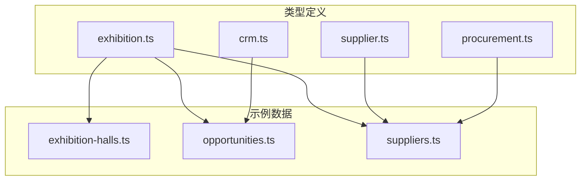
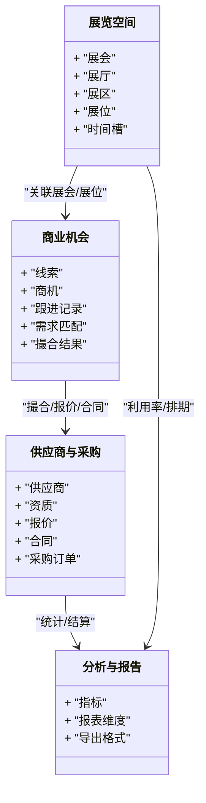
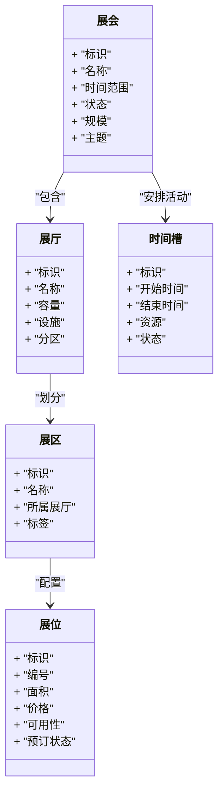
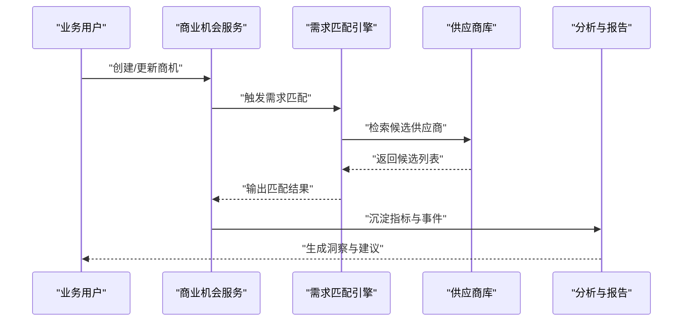
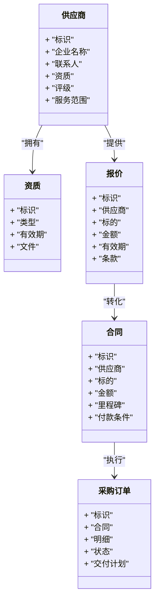
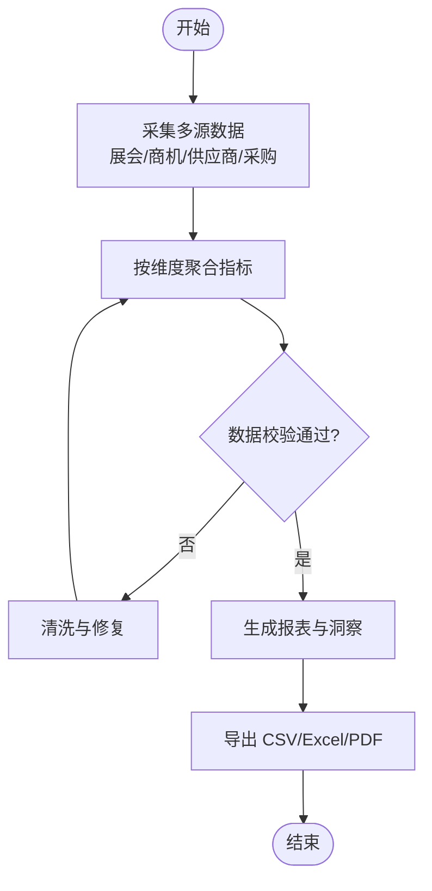
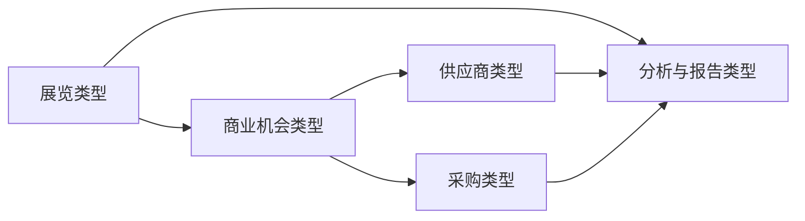

# 展览管理类型

<cite>
**本文引用的文件**   
- [src/types/exhibition.ts](file://src/types/exhibition.ts)
- [src/data/exhibition-halls.ts](file://src/data/exhibition-halls.ts)
- [src/data/opportunities.ts](file://src/data/opportunities.ts)
- [src/types/crm.ts](file://src/types/crm.ts)
- [src/types/supplier.ts](file://src/types/supplier.ts)
- [src/types/procurement.ts](file://src/types/procurement.ts)
- [src/data/suppliers.ts](file://src/data/suppliers.ts)
</cite>

## 目录
1. [简介](#简介)
2. [项目结构](#项目结构)
3. [核心组件](#核心组件)
4. [架构总览](#架构总览)
5. [详细组件分析](#详细组件分析)
6. [依赖分析](#依赖分析)
7. [性能考虑](#性能考虑)
8. [故障排查指南](#故障排查指南)
9. [结论](#结论)
10. [附录](#附录)

## 简介
本文件为 Supply OS 展览管理系统“类型定义”的权威文档，聚焦于以下领域：
- 展厅信息、展会活动、商业机会、参展商管理等核心类型
- 展览空间管理、展位分配与时间安排的类型结构
- 商业机会跟踪、需求匹配与交易撮合的类型设计
- 展览数据分析、效果评估与报告生成的类型定义
- 与供应商、采购等业务模块的数据关联类型

目标读者包括产品、研发、测试与运营人员，帮助快速理解系统数据模型与扩展点。

## 项目结构
围绕展览管理的类型与数据主要分布在如下位置：
- 类型定义：src/types/exhibition.ts、src/types/crm.ts、src/types/supplier.ts、src/types/procurement.ts
- 示例数据：src/data/exhibition-halls.ts、src/data/opportunities.ts、src/data/suppliers.ts

图表来源
- [src/types/exhibition.ts](file://src/types/exhibition.ts)
- [src/data/exhibition-halls.ts](file://src/data/exhibition-halls.ts)
- [src/data/opportunities.ts](file://src/data/opportunities.ts)
- [src/data/suppliers.ts](file://src/data/suppliers.ts)
- [src/types/crm.ts](file://src/types/crm.ts)
- [src/types/supplier.ts](file://src/types/supplier.ts)
- [src/types/procurement.ts](file://src/types/procurement.ts)

章节来源
- [src/types/exhibition.ts](file://src/types/exhibition.ts)
- [src/types/crm.ts](file://src/types/crm.ts)
- [src/types/supplier.ts](file://src/types/supplier.ts)
- [src/types/procurement.ts](file://src/types/procurement.ts)
- [src/data/exhibition-halls.ts](file://src/data/exhibition-halls.ts)
- [src/data/opportunities.ts](file://src/data/opportunities.ts)
- [src/data/suppliers.ts](file://src/data/suppliers.ts)

## 核心组件
本节概述展览管理相关的关键类型族及其职责边界：
- 展览与空间：用于描述展会、展厅、展区、展位、时间槽等基础空间与排期实体
- 商业机会（CRM）：用于记录线索、商机阶段、跟进记录、需求匹配与撮合结果
- 供应商与采购：用于维护供应商主数据、资质、报价、合同与采购订单，并与展览场景联动
- 数据与分析：用于汇总指标、报表维度与导出格式

章节来源
- [src/types/exhibition.ts](file://src/types/exhibition.ts)
- [src/types/crm.ts](file://src/types/crm.ts)
- [src/types/supplier.ts](file://src/types/supplier.ts)
- [src/types/procurement.ts](file://src/types/procurement.ts)

## 架构总览
下图展示展览管理类型在系统中的分层关系与跨域关联：

图表来源
- [src/types/exhibition.ts](file://src/types/exhibition.ts)
- [src/types/crm.ts](file://src/types/crm.ts)
- [src/types/supplier.ts](file://src/types/supplier.ts)
- [src/types/procurement.ts](file://src/types/procurement.ts)

## 详细组件分析

### 展览与空间类型
- 展会：包含基本信息、时间范围、状态、规模、主题等
- 展厅：承载展会的物理或虚拟空间，具备容量、设施、分区能力
- 展区：展厅内的功能划分，如按行业、品牌或主题组织
- 展位：最小可售卖单元，支持面积、朝向、价格、可用性与预订状态
- 时间槽：用于会议、论坛、路演等活动的时段管理，避免冲突

图表来源
- [src/types/exhibition.ts](file://src/types/exhibition.ts)
- [src/data/exhibition-halls.ts](file://src/data/exhibition-halls.ts)

章节来源
- [src/types/exhibition.ts](file://src/types/exhibition.ts)
- [src/data/exhibition-halls.ts](file://src/data/exhibition-halls.ts)

### 商业机会与撮合类型
- 线索：来自市场活动、网站留资、渠道推荐等原始线索
- 商机：经筛选后进入销售流程的机会，含阶段、金额、概率、负责人
- 跟进记录：沟通纪要、任务、附件、下次计划
- 需求匹配：将买家需求与卖家供给进行规则或策略匹配
- 撮合结果：匹配成功后的对接建议、意向协议、后续动作

图表来源
- [src/types/crm.ts](file://src/types/crm.ts)
- [src/data/opportunities.ts](file://src/data/opportunities.ts)
- [src/types/supplier.ts](file://src/types/supplier.ts)

章节来源
- [src/types/crm.ts](file://src/types/crm.ts)
- [src/data/opportunities.ts](file://src/data/opportunities.ts)
- [src/types/supplier.ts](file://src/types/supplier.ts)

### 供应商与采购关联类型
- 供应商：企业主体、联系人、资质认证、评级、服务范围
- 资质：许可证、检测报告、合规证明等
- 报价：针对特定需求或展位的报价单，含有效期与条款
- 合同：中标后的正式协议，含里程碑、付款条件、违约责任
- 采购订单：基于合同或询价生成的执行单据

图表来源
- [src/types/supplier.ts](file://src/types/supplier.ts)
- [src/types/procurement.ts](file://src/types/procurement.ts)
- [src/data/suppliers.ts](file://src/data/suppliers.ts)

章节来源
- [src/types/supplier.ts](file://src/types/supplier.ts)
- [src/types/procurement.ts](file://src/types/procurement.ts)
- [src/data/suppliers.ts](file://src/data/suppliers.ts)

### 数据分析、效果评估与报告类型
- 指标：曝光量、到场人数、转化率、成交金额、ROI 等
- 报表维度：按展会、展厅、展区、展位、时间、行业、供应商等维度聚合
- 导出格式：CSV、Excel、PDF 等标准导出结构

图表来源
- [src/types/exhibition.ts](file://src/types/exhibition.ts)
- [src/types/crm.ts](file://src/types/crm.ts)
- [src/types/supplier.ts](file://src/types/supplier.ts)
- [src/types/procurement.ts](file://src/types/procurement.ts)

章节来源
- [src/types/exhibition.ts](file://src/types/exhibition.ts)
- [src/types/crm.ts](file://src/types/crm.ts)
- [src/types/supplier.ts](file://src/types/supplier.ts)
- [src/types/procurement.ts](file://src/types/procurement.ts)

## 依赖分析
展览类型与其他业务域的耦合关系如下：
- 展览空间类型作为“资源层”，被商业机会与分析报告引用
- 商业机会类型驱动“需求匹配”和“撮合”，并产出“供应商选择”与“合同/订单”
- 供应商与采购类型支撑“报价—合同—订单”的闭环，并为“效果评估”提供财务与履约数据

图表来源
- [src/types/exhibition.ts](file://src/types/exhibition.ts)
- [src/types/crm.ts](file://src/types/crm.ts)
- [src/types/supplier.ts](file://src/types/supplier.ts)
- [src/types/procurement.ts](file://src/types/procurement.ts)

章节来源
- [src/types/exhibition.ts](file://src/types/exhibition.ts)
- [src/types/crm.ts](file://src/types/crm.ts)
- [src/types/supplier.ts](file://src/types/supplier.ts)
- [src/types/procurement.ts](file://src/types/procurement.ts)

## 性能考虑
- 索引与查询优化：对高频过滤字段（如展会时间、展位编号、供应商编码）建立索引，提升检索效率
- 分页与懒加载：列表与报表采用分页与按需加载，降低首屏与大数据集渲染压力
- 缓存策略：热点数据（如展厅布局、供应商名录）使用缓存，减少重复计算与 IO
- 批处理与异步：报表生成与指标聚合采用异步任务与批处理，避免阻塞主流程
- 幂等与去重：撮合与报价写入需保证幂等，防止重复提交导致数据膨胀

[本节为通用指导，不直接分析具体文件]

## 故障排查指南
- 数据一致性
  - 检查外键关联是否完整（如商机未关联到有效供应商或展会）
  - 核对枚举值是否在允许范围内（如状态、优先级、币种）
- 时间冲突
  - 验证时间槽是否存在重叠，确保同一资源在同一时段不被重复占用
- 权限与可见性
  - 确认角色与数据范围是否正确，避免越权访问或数据不可见
- 报表异常
  - 校验数据清洗逻辑与聚合口径，定位缺失字段或异常值
- 日志与追踪
  - 结合关键操作埋点与错误码，快速定位问题链路

章节来源
- [src/types/exhibition.ts](file://src/types/exhibition.ts)
- [src/types/crm.ts](file://src/types/crm.ts)
- [src/types/supplier.ts](file://src/types/supplier.ts)
- [src/types/procurement.ts](file://src/types/procurement.ts)

## 结论
本类型体系以“展览空间”为核心资源，向上支撑“商业机会与撮合”，向下联动“供应商与采购”，并以“分析与报告”贯穿全链路。通过清晰的类型边界与关联关系，可实现从资源编排、商机推进到交易落地与效果评估的端到端数据治理。

[本节为总结性内容，不直接分析具体文件]

## 附录
- 术语说明
  - 展会：在一定时间与地点举办的综合性展示活动
  - 展位：展会中可供参展的最小空间单元
  - 撮合：基于供需匹配促成合作的过程
  - ROI：投资回报率，用于衡量投入产出效益
- 扩展建议
  - 增加“展商档案”与“观众画像”类型，完善生态数据
  - 引入“智能定价”与“动态折扣”策略类型，提升收益管理能力
  - 扩展“电子合同”与“电子发票”类型，打通财务闭环

[本节为补充信息，不直接分析具体文件]