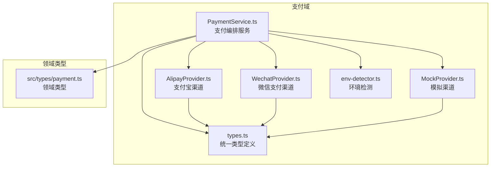
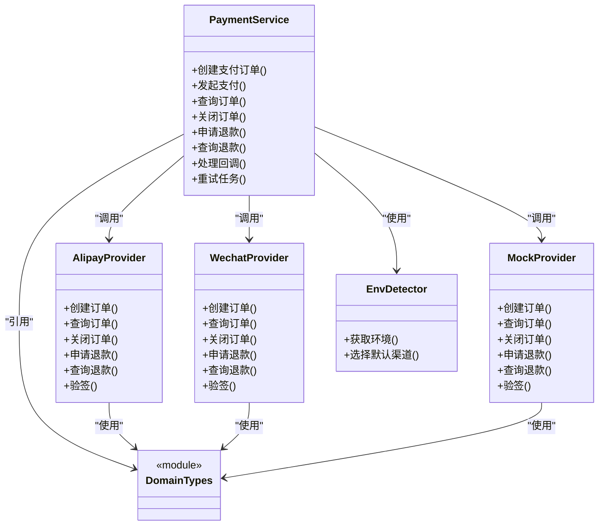
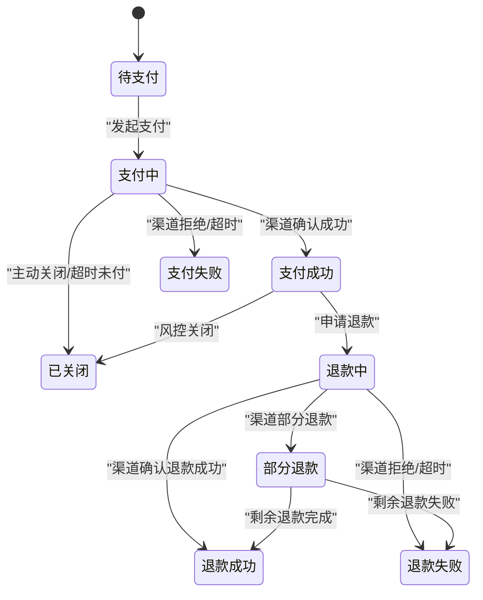
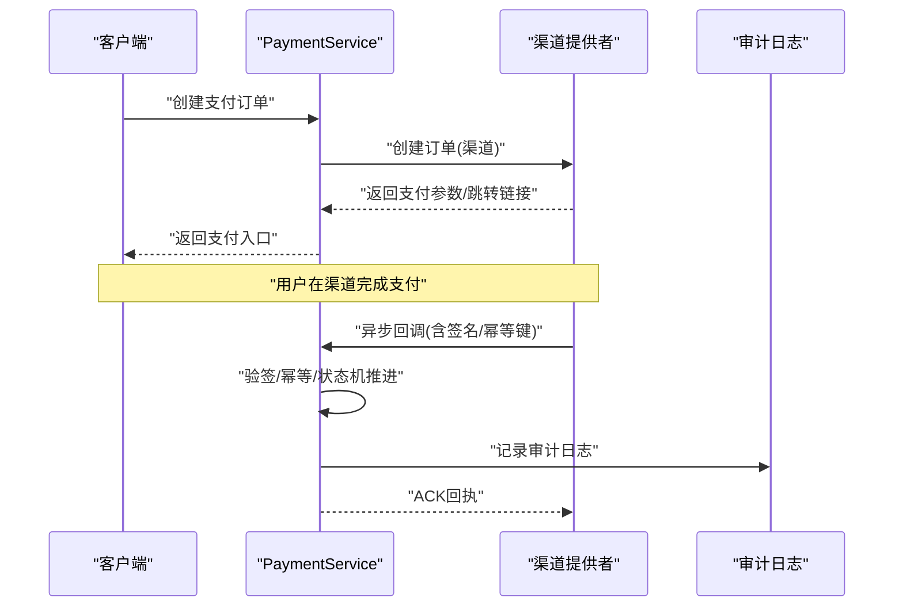
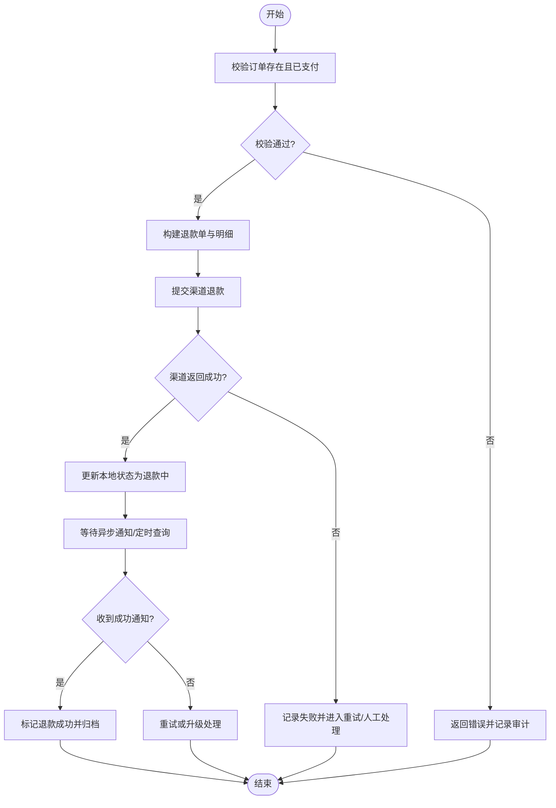
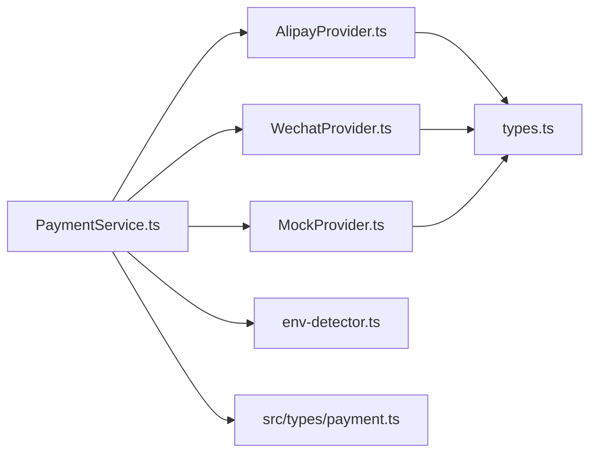

# 支付系统类型

<cite>
**本文引用的文件**   
- [src/payment/types.ts](file://src/payment/types.ts)
- [src/payment/PaymentService.ts](file://src/payment/PaymentService.ts)
- [src/payment/AlipayProvider.ts](file://src/payment/AlipayProvider.ts)
- [src/payment/WechatProvider.ts](file://src/payment/WechatProvider.ts)
- [src/payment/MockProvider.ts](file://src/payment/MockProvider.ts)
- [src/payment/env-detector.ts](file://src/payment/env-detector.ts)
- [src/types/payment.ts](file://src/types/payment.ts)
</cite>

## 目录
1. [简介](#简介)
2. [项目结构](#项目结构)
3. [核心组件](#核心组件)
4. [架构总览](#架构总览)
5. [详细组件分析](#详细组件分析)
6. [依赖关系分析](#依赖关系分析)
7. [性能考虑](#性能考虑)
8. [故障排查指南](#故障排查指南)
9. [结论](#结论)
10. [附录](#附录)

## 简介
本文件为 Supply OS 支付系统的“类型定义”文档，聚焦于支付订单、支付渠道、交易记录、退款处理等核心类型；统一接口类型与状态机；安全、风控与审计日志的类型设计；账单管理、发票处理与财务对账的类型结构；以及支付回调、异步通知与异常重试的类型实现。文档以仓库中实际存在的类型与模块为依据，帮助读者快速理解并扩展支付能力。

## 项目结构
支付相关代码主要分布在两个位置：
- src/payment：运行时支付服务与多渠道提供者（支付宝、微信、Mock）及环境检测
- src/types/payment.ts：领域层通用支付类型定义（供前后端共享或跨模块复用）

图表来源
- [src/payment/types.ts:1-200](file://src/payment/types.ts#L1-L200)
- [src/payment/PaymentService.ts:1-200](file://src/payment/PaymentService.ts#L1-L200)
- [src/payment/AlipayProvider.ts:1-200](file://src/payment/AlipayProvider.ts#L1-L200)
- [src/payment/WechatProvider.ts:1-200](file://src/payment/WechatProvider.ts#L1-L200)
- [src/payment/MockProvider.ts:1-200](file://src/payment/MockProvider.ts#L1-L200)
- [src/payment/env-detector.ts:1-200](file://src/payment/env-detector.ts#L1-L200)
- [src/types/payment.ts:1-200](file://src/types/payment.ts#L1-L200)

章节来源
- [src/payment/types.ts:1-200](file://src/payment/types.ts#L1-L200)
- [src/payment/PaymentService.ts:1-200](file://src/payment/PaymentService.ts#L1-L200)
- [src/payment/AlipayProvider.ts:1-200](file://src/payment/AlipayProvider.ts#L1-L200)
- [src/payment/WechatProvider.ts:1-200](file://src/payment/WechatProvider.ts#L1-L200)
- [src/payment/MockProvider.ts:1-200](file://src/payment/MockProvider.ts#L1-L200)
- [src/payment/env-detector.ts:1-200](file://src/payment/env-detector.ts#L1-L200)
- [src/types/payment.ts:1-200](file://src/types/payment.ts#L1-L200)

## 核心组件
本节从类型视角梳理支付系统的关键实体与关系，覆盖订单、渠道、交易、退款、账单、发票、对账、回调与通知、错误与安全等。

- 支付订单
  - 标识与关联：订单号、业务单号、商户号、用户标识、渠道号
  - 金额与币种：总金额、优惠金额、手续费、币种、汇率
  - 商品与描述：商品摘要、备注、扩展字段
  - 时效与状态：创建时间、过期时间、当前状态、最后更新时间
  - 安全与风控：签名信息、风险评分、校验结果、设备指纹
  - 审计与追踪：请求ID、链路ID、操作人、来源IP、来源UA

- 支付渠道
  - 渠道元数据：渠道编码、名称、版本、能力集（是否支持退款、分账、预授权等）
  - 配置项：密钥、证书、网关地址、超时、重试策略
  - 渠道状态：可用/不可用、维护中、限流中
  - 渠道事件：成功、失败、超时、部分退款、关闭

- 交易记录
  - 交易流水：流水号、订单号、渠道交易号、方向（收/退）、金额、币种
  - 状态与时间：发起时间、完成时间、确认时间、状态
  - 渠道响应：原始报文摘要、错误码、错误信息、签名验证结果
  - 幂等与重试：幂等键、重试次数、下次重试时间、最终态标记

- 退款处理
  - 退款单：退款号、原订单号、退款原因、申请人与审批链
  - 退款明细：按行项或批次拆分、退款金额、手续费承担方
  - 渠道退款：渠道退款号、渠道返回码、渠道返回消息
  - 状态机：待审核、已提交、处理中、成功、失败、部分成功

- 账单管理
  - 账单头：账单期、结算周期、商户号、汇总金额、税费
  - 账单明细：交易聚合、渠道费用、退款冲销、调整项
  - 对账标志：已出账、已核对、差异项、复核人

- 发票处理
  - 发票抬头、税号、开票类型、金额、税率、税额
  - 发票状态：申请中、已开具、已邮寄、已作废
  - 电子发票：PDF链接、二维码、验真URL

- 财务对账
  - 对账批次：批次号、日期、渠道、币种
  - 差异项：单边账、金额不一致、状态不一致、重复入账
  - 处理流程：自动匹配、人工干预、调账分录

- 支付回调与异步通知
  - 回调载荷：订单号、交易号、金额、状态、签名、时间戳、nonce
  - 校验流程：签名验证、幂等检查、状态一致性校验
  - 回执：ACK、重试指示、错误码

- 错误与安全
  - 错误分类：网络错误、业务错误、参数错误、签名错误、超时、限流
  - 安全类型：签名算法、加密套件、证书指纹、防重放令牌
  - 风控规则：阈值、黑白名单、地域限制、频次限制

- 审计日志
  - 日志条目：操作主体、动作、资源、结果、上下文、敏感字段脱敏

章节来源
- [src/payment/types.ts:1-200](file://src/payment/types.ts#L1-L200)
- [src/types/payment.ts:1-200](file://src/types/payment.ts#L1-L200)

## 架构总览
下图展示支付服务如何基于统一类型与多渠道提供者进行编排，并与环境检测、领域类型协作。

图表来源
- [src/payment/PaymentService.ts:1-200](file://src/payment/PaymentService.ts#L1-L200)
- [src/payment/AlipayProvider.ts:1-200](file://src/payment/AlipayProvider.ts#L1-L200)
- [src/payment/WechatProvider.ts:1-200](file://src/payment/WechatProvider.ts#L1-L200)
- [src/payment/MockProvider.ts:1-200](file://src/payment/MockProvider.ts#L1-L200)
- [src/payment/env-detector.ts:1-200](file://src/payment/env-detector.ts#L1-L200)
- [src/types/payment.ts:1-200](file://src/types/payment.ts#L1-L200)

## 详细组件分析

### 统一接口与类型（src/payment/types.ts）
- 职责
  - 定义支付领域通用类型：订单、交易、退款、账单、发票、对账、回调、错误、审计等
  - 提供渠道抽象的输入输出契约，确保多提供商一致交互
- 关键类型要点
  - 订单：包含金额、币种、状态、时间戳、签名、扩展字段
  - 交易：包含渠道流水、方向、状态、幂等键、重试信息
  - 退款：包含原订单、退款明细、渠道返回、状态机
  - 账单/发票/对账：结构化字段便于报表与稽核
  - 回调/通知：签名、时间戳、随机数、幂等键
  - 错误：分类、可恢复性、重试策略、上下文
  - 审计：操作者、资源、结果、上下文、脱敏
- 复杂度与可扩展性
  - 通过联合类型与可选字段平衡稳定性与扩展性
  - 新增渠道仅需适配统一接口类型，无需改动上层编排

章节来源
- [src/payment/types.ts:1-200](file://src/payment/types.ts#L1-L200)

### 支付服务编排（src/payment/PaymentService.ts）
- 职责
  - 协调多渠道提供者，执行创建、查询、关闭、退款、回调处理、重试等流程
  - 保证幂等、状态一致性、事务边界与审计记录
- 典型流程
  - 创建支付：组装订单 -> 选择渠道 -> 调用渠道创建 -> 落库 -> 返回前端跳转/支付参数
  - 查询订单：轮询或拉取 -> 更新本地状态 -> 触发后续动作（如发货）
  - 退款：校验权限与额度 -> 提交渠道 -> 异步回调/查询 -> 更新状态
  - 回调处理：验签 -> 幂等 -> 状态机推进 -> 持久化 -> 回执
  - 重试：指数退避、最大重试次数、死信队列
- 错误与重试
  - 区分可重试与不可重试错误
  - 记录重试轨迹与最终态

章节来源
- [src/payment/PaymentService.ts:1-200](file://src/payment/PaymentService.ts#L1-L200)

### 支付宝渠道（src/payment/AlipayProvider.ts）
- 职责
  - 实现支付宝API的订单创建、查询、关闭、退款、验签等
- 关键点
  - 签名算法与证书管理
  - 请求/响应映射到统一类型
  - 错误码到内部错误的转换
  - 幂等键与重试控制

章节来源
- [src/payment/AlipayProvider.ts:1-200](file://src/payment/AlipayProvider.ts#L1-L200)

### 微信支付渠道（src/payment/WechatProvider.ts）
- 职责
  - 实现微信支付API的订单创建、查询、关闭、退款、验签等
- 关键点
  - 证书与私钥管理
  - 回调签名验证
  - 状态同步与补偿

章节来源
- [src/payment/WechatProvider.ts:1-200](file://src/payment/WechatProvider.ts#L1-L200)

### 模拟渠道（src/payment/MockProvider.ts）
- 职责
  - 提供开发/测试环境的模拟实现，用于联调与自动化测试
- 关键点
  - 固定返回与可控延迟
  - 模拟错误场景（超时、签名失败、部分退款）

章节来源
- [src/payment/MockProvider.ts:1-200](file://src/payment/MockProvider.ts#L1-L200)

### 环境检测（src/payment/env-detector.ts）
- 职责
  - 识别运行环境（开发/测试/生产），选择默认渠道与配置
- 关键点
  - 环境变量读取与校验
  - 渠道白名单与降级策略

章节来源
- [src/payment/env-detector.ts:1-200](file://src/payment/env-detector.ts#L1-L200)

### 领域类型（src/types/payment.ts）
- 职责
  - 面向业务域的通用类型，供前后端或跨服务共享
- 关键点
  - 与支付域模型对齐（订单、交易、退款、账单、发票、对账）
  - 约束与枚举值集中管理，便于校验与国际化

章节来源
- [src/types/payment.ts:1-200](file://src/types/payment.ts#L1-L200)

### 支付状态机（概念说明）
- 状态集合
  - 待支付、支付中、支付成功、支付失败、已关闭、已退款、部分退款、退款中、退款失败、退款成功
- 转移规则
  - 仅允许合法转移，例如“支付中”->“支付成功/失败”，“已退款”不可再支付
  - 退款需基于“支付成功”的订单
- 幂等与一致性
  - 所有状态变更需携带幂等键与版本号
  - 回调与查询双通道保障最终一致

[此图为概念性状态机示意，不直接映射具体源码文件]

### 支付回调与异步通知（序列图）

图表来源
- [src/payment/PaymentService.ts:1-200](file://src/payment/PaymentService.ts#L1-L200)
- [src/payment/AlipayProvider.ts:1-200](file://src/payment/AlipayProvider.ts#L1-L200)
- [src/payment/WechatProvider.ts:1-200](file://src/payment/WechatProvider.ts#L1-L200)

### 复杂逻辑流程图（示例：退款处理）

图表来源
- [src/payment/PaymentService.ts:1-200](file://src/payment/PaymentService.ts#L1-L200)
- [src/payment/AlipayProvider.ts:1-200](file://src/payment/AlipayProvider.ts#L1-L200)
- [src/payment/WechatProvider.ts:1-200](file://src/payment/WechatProvider.ts#L1-L200)

## 依赖关系分析
- 模块耦合
  - PaymentService 作为编排中心，依赖各渠道提供者与环境检测
  - 渠道提供者均依赖统一类型与领域类型，保持低耦合
- 外部依赖
  - 第三方渠道SDK/HTTP客户端（由各自Provider封装）
  - 配置中心/密钥管理服务（通过EnvDetector与Provider配置注入）
- 潜在循环依赖
  - 通过类型解耦避免循环引用，Provider之间无相互依赖

图表来源
- [src/payment/PaymentService.ts:1-200](file://src/payment/PaymentService.ts#L1-L200)
- [src/payment/AlipayProvider.ts:1-200](file://src/payment/AlipayProvider.ts#L1-L200)
- [src/payment/WechatProvider.ts:1-200](file://src/payment/WechatProvider.ts#L1-L200)
- [src/payment/MockProvider.ts:1-200](file://src/payment/MockProvider.ts#L1-L200)
- [src/payment/env-detector.ts:1-200](file://src/payment/env-detector.ts#L1-L200)
- [src/payment/types.ts:1-200](file://src/payment/types.ts#L1-L200)
- [src/types/payment.ts:1-200](file://src/types/payment.ts#L1-L200)

## 性能考虑
- 幂等与去重
  - 使用幂等键避免重复处理，减少数据库写入压力
- 异步与批处理
  - 回调与通知采用异步处理，批量落库与索引优化
- 连接与超时
  - 合理设置渠道请求超时与重试间隔，避免雪崩
- 缓存与只读路径
  - 订单与交易查询走缓存，降低下游压力
- 审计与日志
  - 异步写审计日志，避免阻塞主流程

## 故障排查指南
- 常见问题定位
  - 签名失败：检查签名算法、密钥、时间戳与随机数
  - 幂等冲突：核对幂等键与请求顺序
  - 状态不一致：对比渠道返回与本地状态，必要时走补偿流程
  - 超时与重试：查看重试次数与退避策略，确认死信队列
- 日志与追踪
  - 通过请求ID与链路ID串联全链路日志
  - 审计日志记录关键决策点与敏感字段脱敏

章节来源
- [src/payment/PaymentService.ts:1-200](file://src/payment/PaymentService.ts#L1-L200)
- [src/payment/AlipayProvider.ts:1-200](file://src/payment/AlipayProvider.ts#L1-L200)
- [src/payment/WechatProvider.ts:1-200](file://src/payment/WechatProvider.ts#L1-L200)

## 结论
通过对支付系统类型与模块的系统化梳理，明确了统一接口、状态机、错误与安全、审计与对账等关键设计。该类型体系具备良好的扩展性与可维护性，能够支撑多渠道接入与复杂业务场景。建议在实际落地时结合风控策略与合规要求完善校验与审计细节。

## 附录
- 术语表
  - 幂等键：保证同一请求多次执行结果一致的标识
  - 回调：渠道向系统推送的支付结果通知
  - 对账：将系统账务与渠道账务进行比对与差异处理
- 参考文件
  - 统一类型：[src/payment/types.ts](file://src/payment/types.ts)
  - 领域类型：[src/types/payment.ts](file://src/types/payment.ts)
  - 编排服务：[src/payment/PaymentService.ts](file://src/payment/PaymentService.ts)
  - 渠道实现：[src/payment/AlipayProvider.ts](file://src/payment/AlipayProvider.ts)、[src/payment/WechatProvider.ts](file://src/payment/WechatProvider.ts)、[src/payment/MockProvider.ts](file://src/payment/MockProvider.ts)
  - 环境检测：[src/payment/env-detector.ts](file://src/payment/env-detector.ts)