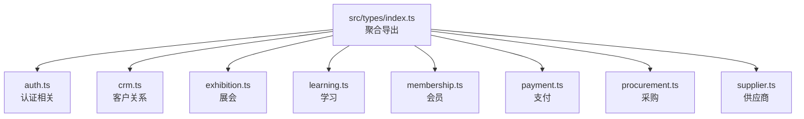
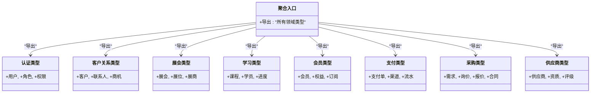
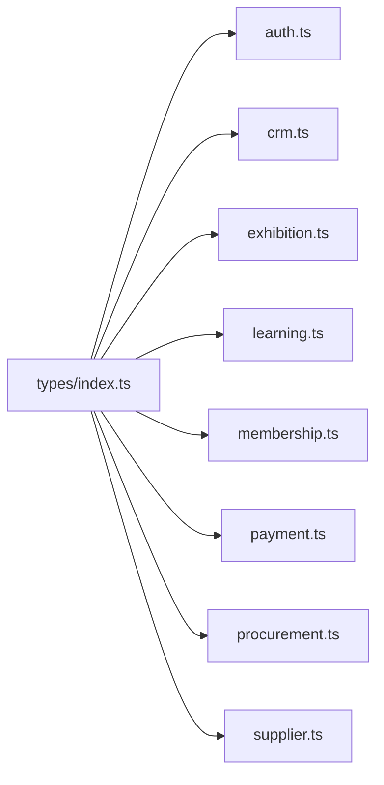

# 核心类型定义

<cite>
**本文引用的文件**   
- [src/types/index.ts](file://src/types/index.ts)
- [src/types/auth.ts](file://src/types/auth.ts)
- [src/types/crm.ts](file://src/types/crm.ts)
- [src/types/exhibition.ts](file://src/types/exhibition.ts)
- [src/types/learning.ts](file://src/types/learning.ts)
- [src/types/membership.ts](file://src/types/membership.ts)
- [src/types/payment.ts](file://src/types/payment.ts)
- [src/types/procurement.ts](file://src/types/procurement.ts)
- [src/types/supplier.ts](file://src/types/supplier.ts)
</cite>

## 目录
1. [简介](#简介)
2. [项目结构](#项目结构)
3. [核心组件](#核心组件)
4. [架构总览](#架构总览)
5. [详细组件分析](#详细组件分析)
6. [依赖关系分析](#依赖关系分析)
7. [性能与可维护性考虑](#性能与可维护性考虑)
8. [故障排查指南](#故障排查指南)
9. [结论](#结论)
10. [附录](#附录)

## 简介
本文件面向Supply OS的类型系统，聚焦于src/types目录下的核心类型定义。目标是：
- 解释基础类型、通用接口与工具类型的组织方式与职责边界
- 说明命名规范、组织结构与模块间依赖关系
- 总结继承模式、组合策略与泛型使用示例（以路径引用代替代码片段）
- 提供类型安全最佳实践与常见陷阱规避方法
- 指导如何扩展与自定义核心类型

## 项目结构
类型系统采用“按领域分文件 + 统一聚合导出”的组织方式：
- 每个业务域一个类型文件，如认证、采购、供应商、支付等
- src/types/index.ts作为聚合入口，对外暴露统一的类型命名空间
- 各类型文件内部优先使用联合类型、字面量类型与映射类型表达约束，避免过度继承

图表来源
- [src/types/index.ts](file://src/types/index.ts)
- [src/types/auth.ts](file://src/types/auth.ts)
- [src/types/crm.ts](file://src/types/crm.ts)
- [src/types/exhibition.ts](file://src/types/exhibition.ts)
- [src/types/learning.ts](file://src/types/learning.ts)
- [src/types/membership.ts](file://src/types/membership.ts)
- [src/types/payment.ts](file://src/types/payment.ts)
- [src/types/procurement.ts](file://src/types/procurement.ts)
- [src/types/supplier.ts](file://src/types/supplier.ts)

章节来源
- [src/types/index.ts](file://src/types/index.ts)
- [src/types/auth.ts](file://src/types/auth.ts)
- [src/types/crm.ts](file://src/types/crm.ts)
- [src/types/exhibition.ts](file://src/types/exhibition.ts)
- [src/types/learning.ts](file://src/types/learning.ts)
- [src/types/membership.ts](file://src/types/membership.ts)
- [src/types/payment.ts](file://src/types/payment.ts)
- [src/types/procurement.ts](file://src/types/procurement.ts)
- [src/types/supplier.ts](file://src/types/supplier.ts)

## 核心组件
本节概述各类型文件的职责与典型组成，便于快速定位与理解整体设计。

- 认证类型（auth.ts）
  - 用户身份、会话、权限范围、登录态等
  - 常用组合：用户实体 + 角色集合 + 权限标记
  - 参考路径：[认证类型定义](file://src/types/auth.ts)

- 客户关系类型（crm.ts）
  - 客户、联系人、跟进记录、商机阶段等
  - 常用组合：实体 + 状态枚举 + 时间戳字段
  - 参考路径：[CRM类型定义](file://src/types/crm.ts)

- 展会类型（exhibition.ts）
  - 展会信息、展位、展商、日程等
  - 常用组合：资源实体 + 关联ID + 元数据
  - 参考路径：[展会类型定义](file://src/types/exhibition.ts)

- 学习类型（learning.ts）
  - 课程、学员、学习进度、证书等
  - 常用组合：学习对象 + 进度状态 + 完成条件
  - 参考路径：[学习类型定义](file://src/types/learning.ts)

- 会员类型（membership.ts）
  - 会员等级、权益、订阅周期、续费状态等
  - 常用组合：会员实体 + 权益集合 + 生命周期状态
  - 参考路径：[会员类型定义](file://src/types/membership.ts)

- 支付类型（payment.ts）
  - 支付单、渠道、交易流水、对账状态等
  - 常用组合：订单实体 + 渠道枚举 + 金额与币种
  - 参考路径：[支付类型定义](file://src/types/payment.ts)

- 采购类型（procurement.ts）
  - 采购需求、询价、报价、合同、验收等
  - 常用组合：流程实体 + 审批节点 + 状态机
  - 参考路径：[采购类型定义](file://src/types/procurement.ts)

- 供应商类型（supplier.ts）
  - 供应商档案、资质、评级、合作历史等
  - 常用组合：供应商实体 + 资质清单 + 评分指标
  - 参考路径：[供应商类型定义](file://src/types/supplier.ts)

章节来源
- [src/types/auth.ts](file://src/types/auth.ts)
- [src/types/crm.ts](file://src/types/crm.ts)
- [src/types/exhibition.ts](file://src/types/exhibition.ts)
- [src/types/learning.ts](file://src/types/learning.ts)
- [src/types/membership.ts](file://src/types/membership.ts)
- [src/types/payment.ts](file://src/types/payment.ts)
- [src/types/procurement.ts](file://src/types/procurement.ts)
- [src/types/supplier.ts](file://src/types/supplier.ts)

## 架构总览
类型系统的整体设计原则：
- 单一职责：每个文件对应一个业务域，避免跨域耦合
- 显式契约：通过联合类型与字面量类型表达有限状态与可选字段
- 组合优于继承：以交叉类型与映射类型组合出复杂实体
- 稳定聚合：index.ts仅做再导出，不引入额外逻辑
- 可演进：新增域时新增文件并在index.ts中注册即可

图表来源
- [src/types/index.ts](file://src/types/index.ts)
- [src/types/auth.ts](file://src/types/auth.ts)
- [src/types/crm.ts](file://src/types/crm.ts)
- [src/types/exhibition.ts](file://src/types/exhibition.ts)
- [src/types/learning.ts](file://src/types/learning.ts)
- [src/types/membership.ts](file://src/types/membership.ts)
- [src/types/payment.ts](file://src/types/payment.ts)
- [src/types/procurement.ts](file://src/types/procurement.ts)
- [src/types/supplier.ts](file://src/types/supplier.ts)

## 详细组件分析

### 认证类型（auth.ts）
- 设计要点
  - 用户实体包含唯一标识、基本信息与扩展字段
  - 角色与权限采用联合类型或字面量集合，确保状态可穷举
  - 会话与令牌类型分离，明确生命周期与作用域
- 组合策略
  - 将用户与角色进行交叉组合，形成带权限的用户视图
  - 使用可选字段表示非必填的认证上下文
- 泛型使用建议
  - 为不同租户或平台扩展用户属性时使用泛型参数
- 参考路径
  - [认证类型定义](file://src/types/auth.ts)

章节来源
- [src/types/auth.ts](file://src/types/auth.ts)

### 客户关系类型（crm.ts）
- 设计要点
  - 客户与联系人分层建模，支持一对多关系
  - 商机阶段使用字面量联合类型，便于分支处理
- 组合策略
  - 将基础信息与行为日志组合，形成完整客户画像
- 参考路径
  - [CRM类型定义](file://src/types/crm.ts)

章节来源
- [src/types/crm.ts](file://src/types/crm.ts)

### 展会类型（exhibition.ts）
- 设计要点
  - 展会、展位、展商分别建模，通过ID建立关联
  - 日程与状态使用枚举化字面量类型
- 组合策略
  - 将资源实体与元数据组合，便于扩展展示字段
- 参考路径
  - [展会类型定义](file://src/types/exhibition.ts)

章节来源
- [src/types/exhibition.ts](file://src/types/exhibition.ts)

### 学习类型（learning.ts）
- 设计要点
  - 课程、学员、进度三者解耦，通过外键关联
  - 完成条件与证书类型使用联合类型表达
- 组合策略
  - 将学习对象与进度状态组合，形成学习视图
- 参考路径
  - [学习类型定义](file://src/types/learning.ts)

章节来源
- [src/types/learning.ts](file://src/types/learning.ts)

### 会员类型（membership.ts）
- 设计要点
  - 会员等级与权益分离，支持动态配置
  - 订阅周期与续费状态使用字面量类型
- 组合策略
  - 将会员实体与权益集合组合，形成会员套餐视图
- 参考路径
  - [会员类型定义](file://src/types/membership.ts)

章节来源
- [src/types/membership.ts](file://src/types/membership.ts)

### 支付类型（payment.ts）
- 设计要点
  - 支付单、渠道、流水分层建模，保证审计可追溯
  - 金额与币种分离，避免精度丢失
- 组合策略
  - 将订单与支付结果组合，形成支付视图
- 参考路径
  - [支付类型定义](file://src/types/payment.ts)

章节来源
- [src/types/payment.ts](file://src/types/payment.ts)

### 采购类型（procurement.ts）
- 设计要点
  - 需求、询价、报价、合同形成流程链
  - 审批节点与状态机使用字面量联合类型
- 组合策略
  - 将流程实体与节点状态组合，形成流程视图
- 参考路径
  - [采购类型定义](file://src/types/procurement.ts)

章节来源
- [src/types/procurement.ts](file://src/types/procurement.ts)

### 供应商类型（supplier.ts）
- 设计要点
  - 供应商档案、资质、评级分离，便于合规审查
  - 评分指标与等级使用联合类型
- 组合策略
  - 将供应商实体与资质清单组合，形成供应商画像
- 参考路径
  - [供应商类型定义](file://src/types/supplier.ts)

章节来源
- [src/types/supplier.ts](file://src/types/supplier.ts)

### 聚合入口（index.ts）
- 设计要点
  - 仅做再导出，保持稳定的公共命名空间
  - 新增类型时在此处注册，避免散乱导入
- 参考路径
  - [聚合入口定义](file://src/types/index.ts)

章节来源
- [src/types/index.ts](file://src/types/index.ts)

## 依赖关系分析
- 模块内聚
  - 每个类型文件自包含其领域内的基础类型、联合类型与组合类型
- 外部依赖
  - 类型文件之间尽量无直接依赖，通过聚合入口统一暴露
- 潜在循环
  - 若出现跨域强耦合，应引入中间接口或事件类型进行解耦
- 可视化依赖图

图表来源
- [src/types/index.ts](file://src/types/index.ts)
- [src/types/auth.ts](file://src/types/auth.ts)
- [src/types/crm.ts](file://src/types/crm.ts)
- [src/types/exhibition.ts](file://src/types/exhibition.ts)
- [src/types/learning.ts](file://src/types/learning.ts)
- [src/types/membership.ts](file://src/types/membership.ts)
- [src/types/payment.ts](file://src/types/payment.ts)
- [src/types/procurement.ts](file://src/types/procurement.ts)
- [src/types/supplier.ts](file://src/types/supplier.ts)

章节来源
- [src/types/index.ts](file://src/types/index.ts)
- [src/types/auth.ts](file://src/types/auth.ts)
- [src/types/crm.ts](file://src/types/crm.ts)
- [src/types/exhibition.ts](file://src/types/exhibition.ts)
- [src/types/learning.ts](file://src/types/learning.ts)
- [src/types/membership.ts](file://src/types/membership.ts)
- [src/types/payment.ts](file://src/types/payment.ts)
- [src/types/procurement.ts](file://src/types/procurement.ts)
- [src/types/supplier.ts](file://src/types/supplier.ts)

## 性能与可维护性考虑
- 编译期成本
  - 大型联合类型会增加类型检查开销，建议拆分到子模块按需导入
- 可读性与演进
  - 使用具名联合类型与字面量类型替代any/unknown，提升可维护性
- 组合优先
  - 用交叉类型组合小粒度类型，减少深层继承带来的脆弱性
- 文档与约定
  - 在类型文件中添加简短注释，说明字段含义与取值范围

## 故障排查指南
- 常见问题
  - 类型收窄失败：检查是否遗漏了必要的字面量联合分支
  - 可选字段误用：确认字段是否为可选，避免未定义访问
  - 跨域耦合：发现循环依赖时，抽取共享接口或事件类型
- 定位步骤
  - 从错误提示入手，定位具体类型文件
  - 检查该类型与其他域的交互点，必要时引入中间类型
  - 在聚合入口确认导出是否正确
- 参考路径
  - [聚合入口定义](file://src/types/index.ts)
  - [认证类型定义](file://src/types/auth.ts)
  - [支付类型定义](file://src/types/payment.ts)

章节来源
- [src/types/index.ts](file://src/types/index.ts)
- [src/types/auth.ts](file://src/types/auth.ts)
- [src/types/payment.ts](file://src/types/payment.ts)

## 结论
Supply OS的核心类型系统以领域为边界，采用组合与联合类型构建强约束的数据模型。通过聚合入口统一暴露，既保证了模块内聚，又提升了可维护性与可扩展性。遵循本文的命名规范、组合策略与最佳实践，可在不破坏现有契约的前提下平滑演进。

## 附录

### 命名规范与组织结构
- 命名规范
  - 类型名使用大驼峰，字段使用小驼峰
  - 联合类型使用语义明确的字面量字符串
  - 可选字段使用?修饰符并配合默认值处理
- 组织结构
  - 每个业务域一个文件，聚合入口集中导出
  - 复杂类型拆分为子类型，提高复用度

### 继承模式与组合策略
- 继承模式
  - 优先使用交叉类型组合，而非类继承
- 组合策略
  - 将基础实体与行为、状态、元数据组合，形成领域视图
- 泛型使用示例
  - 为租户、平台、版本等可变维度引入泛型参数
  - 使用条件类型实现差异化字段

### 类型安全最佳实践与常见陷阱
- 最佳实践
  - 使用字面量联合类型表达有限状态
  - 使用映射类型批量生成相似结构
  - 使用断言函数进行运行时校验与类型收窄
- 常见陷阱
  - 滥用any/unknown导致类型失效
  - 过度嵌套导致类型推导困难
  - 忽略可选字段导致运行时异常

### 如何扩展与自定义核心类型
- 新增领域类型
  - 新建类型文件并在聚合入口注册
- 扩展现有类型
  - 通过交叉类型扩展字段，避免修改原始定义
- 自定义工具类型
  - 在独立工具文件中定义，按需导入使用