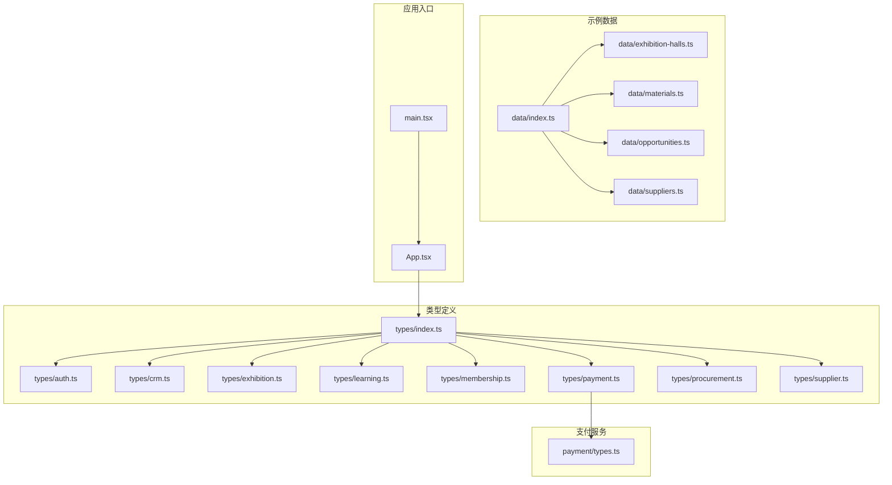
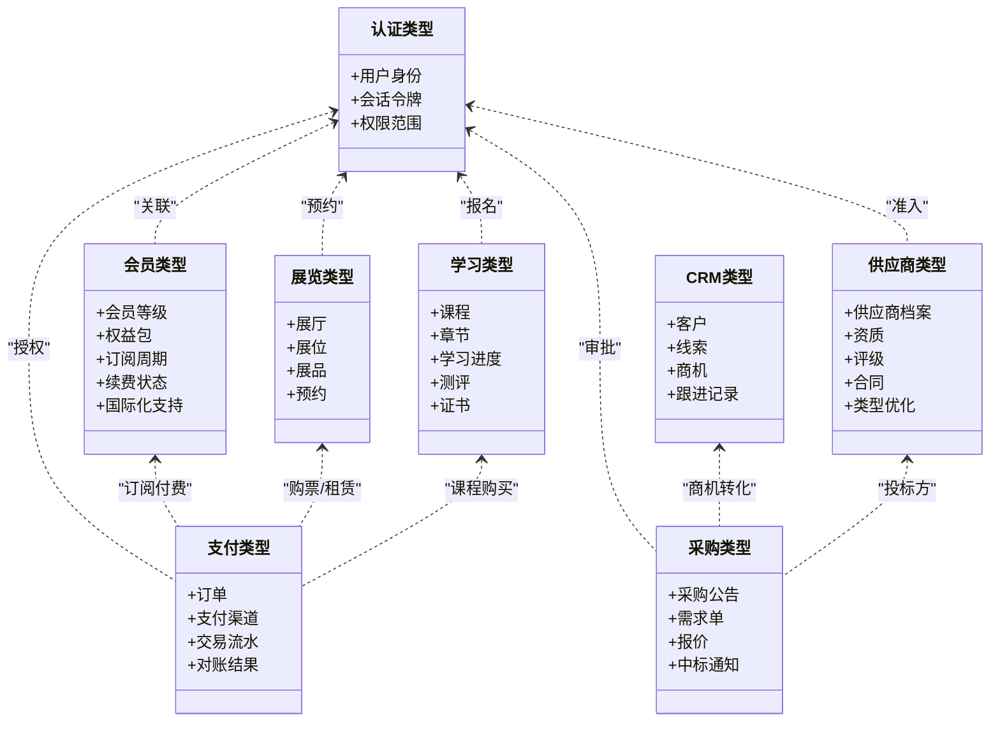
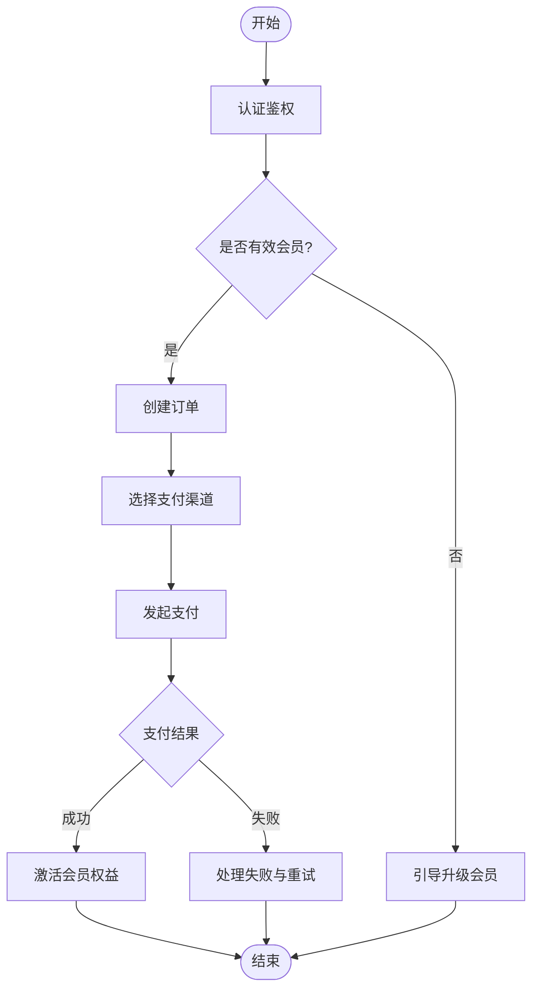
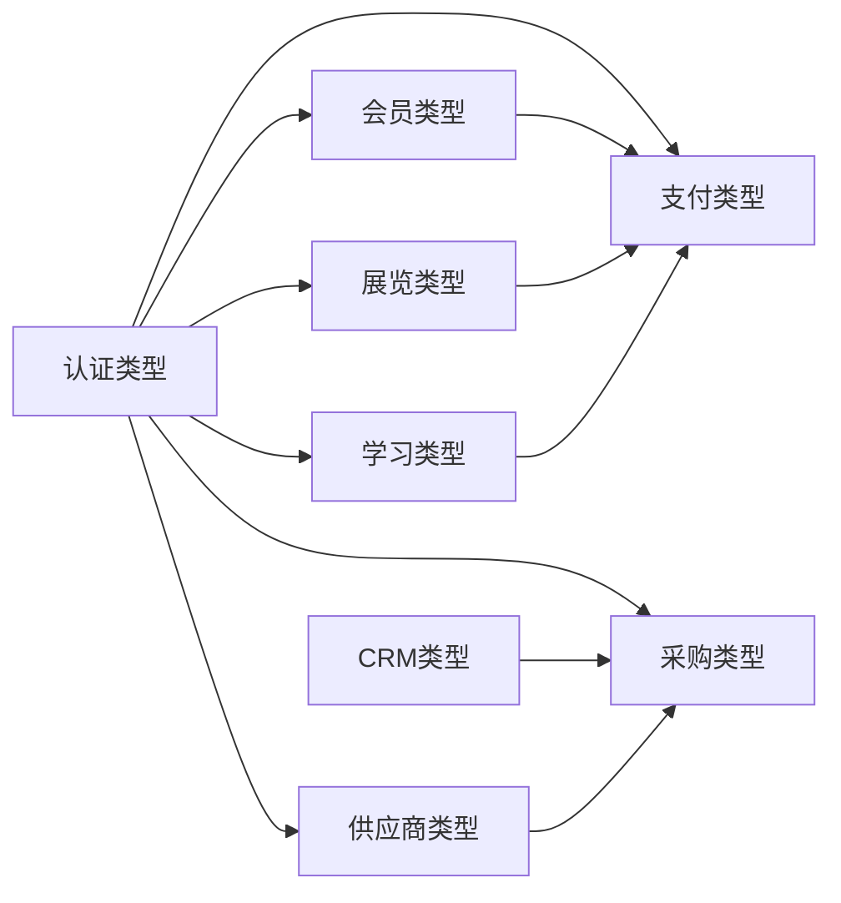

# 类型定义系统

<cite>
**本文引用的文件**   
- [src/types/index.ts](file://src/types/index.ts)
- [src/types/auth.ts](file://src/types/auth.ts)
- [src/types/crm.ts](file://src/types/crm.ts)
- [src/types/exhibition.ts](file://src/types/exhibition.ts)
- [src/types/learning.ts](file://src/types/learning.ts)
- [src/types/membership.ts](file://src/types/membership.ts)
- [src/types/payment.ts](file://src/types/payment.ts)
- [src/types/procurement.ts](file://src/types/procurement.ts)
- [src/types/supplier.ts](file://src/types/supplier.ts)
- [src/payment/types.ts](file://src/payment/types.ts)
- [src/data/index.ts](file://src/data/index.ts)
- [src/data/exhibition-halls.ts](file://src/data/exhibition-halls.ts)
- [src/data/materials.ts](file://src/data/materials.ts)
- [src/data/opportunities.ts](file://src/data/opportunities.ts)
- [src/data/suppliers.ts](file://src/data/suppliers.ts)
- [src/App.tsx](file://src/App.tsx)
- [src/main.tsx](file://src/main.tsx)
- [tsconfig.json](file://tsconfig.json)
</cite>

## 更新摘要
**变更内容**   
- 更新了会员类型（membership.ts）的类型增强，增加了9行新类型定义，移除了1行旧代码
- 清理了供应商类型（supplier.ts）中的冗余代码，移除了1行
- 反映了国际化系统和数据重构对类型定义的影响
- 增强了类型系统的健壮性和可维护性

## 目录
1. [简介](#简介)
2. [项目结构](#项目结构)
3. [核心组件](#核心组件)
4. [架构总览](#架构总览)
5. [详细组件分析](#详细组件分析)
6. [依赖关系分析](#依赖关系分析)
7. [性能与可维护性](#性能与可维护性)
8. [故障排查指南](#故障排查指南)
9. [结论](#结论)
10. [附录](#附录)

## 简介
本文件面向Supply OS的TypeScript类型定义系统，系统性阐述其设计原则、组织结构与跨业务域的类型建模方法。文档覆盖认证、CRM、展览、学习、会员、支付、采购、供应商等关键领域，提供类型继承、组合与泛型使用的最佳实践，并给出类型安全编程模式、错误预防策略、版本兼容与迁移指南、自定义类型扩展方法以及类型检查与调试技巧。目标是帮助开发者在复杂业务场景中构建稳定、可扩展且易于演进的前端类型体系。

**最新更新**：近期对会员类型进行了增强，增加了更丰富的类型定义以支持国际化系统；同时对供应商类型进行了清理优化，提升了整体类型系统的健壮性。

## 项目结构
类型定义集中于src/types目录，按业务域拆分，便于独立演进与维护；同时通过统一的入口文件进行再导出，供应用层按需引用。数据层src/data中的示例数据与类型保持一致，确保演示与测试场景的类型安全。支付模块在src/payment中拥有独立的类型定义，体现领域边界清晰与职责分离。

**图表来源**
- [src/types/index.ts](file://src/types/index.ts)
- [src/payment/types.ts](file://src/payment/types.ts)
- [src/data/index.ts](file://src/data/index.ts)
- [src/App.tsx](file://src/App.tsx)
- [src/main.tsx](file://src/main.tsx)

**章节来源**
- [src/types/index.ts](file://src/types/index.ts)
- [src/payment/types.ts](file://src/payment/types.ts)
- [src/data/index.ts](file://src/data/index.ts)
- [src/App.tsx](file://src/App.tsx)
- [src/main.tsx](file://src/main.tsx)

## 核心组件
本节概述各业务域类型的设计要点与相互关系，强调统一基础模型、领域内聚与跨域协作。

- 认证（auth）
  - 用户身份、会话令牌、权限范围与登录状态等核心实体。
  - 建议采用联合类型表达多提供商登录结果，使用字面量联合区分流程分支。
  - 参考路径：[src/types/auth.ts](file://src/types/auth.ts)

- CRM（crm）
  - 客户、线索、商机、跟进记录等实体及其生命周期状态。
  - 建议使用枚举或字面量联合表示阶段与优先级，配合判别式联合实现条件处理。
  - 参考路径：[src/types/crm.ts](file://src/types/crm.ts)

- 展览（exhibition）
  - 展厅、展位、展品、预约与参观者信息。
  - 建议将"可展示"能力抽象为接口，由不同实体实现以复用校验与渲染逻辑。
  - 参考路径：[src/types/exhibition.ts](file://src/types/exhibition.ts)

- 学习（learning）
  - 课程、章节、学习进度、测评与证书。
  - 建议用泛型封装进度与评分计算，避免重复逻辑。
  - 参考路径：[src/types/learning.ts](file://src/types/learning.ts)

- 会员（membership）
  - 会员等级、权益包、订阅周期与续费状态。
  - **更新**：最近增强了类型定义以支持国际化系统，增加了更丰富的会员状态和权益管理类型。
  - 建议以状态机方式建模订阅生命周期，结合判别式联合保证状态转换安全。
  - 参考路径：[src/types/membership.ts](file://src/types/membership.ts)

- 支付（payment）
  - 订单、支付渠道、交易流水与对账结果。
  - 建议将渠道差异抽象为策略接口，统一支付回调与结果聚合。
  - 参考路径：[src/types/payment.ts](file://src/types/payment.ts)、[src/payment/types.ts](file://src/payment/types.ts)

- 采购（procurement）
  - 采购公告、需求单、报价与中标通知。
  - 建议以事件流形式描述从发布到成交的关键节点，配合类型守卫确保流程推进。
  - 参考路径：[src/types/procurement.ts](file://src/types/procurement.ts)

- 供应商（supplier）
  - 供应商档案、资质、评级与合同。
  - **更新**：进行了类型清理优化，移除了冗余定义，提升了类型系统的清晰度。
  - 建议将"可评估"能力抽象为接口，由不同维度评估器实现。
  - 参考路径：[src/types/supplier.ts](file://src/types/supplier.ts)

**章节来源**
- [src/types/auth.ts](file://src/types/auth.ts)
- [src/types/crm.ts](file://src/types/crm.ts)
- [src/types/exhibition.ts](file://src/types/exhibition.ts)
- [src/types/learning.ts](file://src/types/learning.ts)
- [src/types/membership.ts](file://src/types/membership.ts)
- [src/types/payment.ts](file://src/types/payment.ts)
- [src/types/procurement.ts](file://src/types/procurement.ts)
- [src/types/supplier.ts](file://src/types/supplier.ts)
- [src/payment/types.ts](file://src/payment/types.ts)

## 架构总览
类型系统遵循"领域驱动+契约优先"的原则：每个业务域自包含类型定义，通过统一入口集中导出；支付作为跨域能力，单独维护类型并在业务域中引用；示例数据与类型保持同构，保障演示与测试的可运行性与类型安全。

**图表来源**
- [src/types/auth.ts](file://src/types/auth.ts)
- [src/types/crm.ts](file://src/types/crm.ts)
- [src/types/exhibition.ts](file://src/types/exhibition.ts)
- [src/types/learning.ts](file://src/types/learning.ts)
- [src/types/membership.ts](file://src/types/membership.ts)
- [src/types/payment.ts](file://src/types/payment.ts)
- [src/types/procurement.ts](file://src/types/procurement.ts)
- [src/types/supplier.ts](file://src/types/supplier.ts)

## 详细组件分析

### 认证类型（auth）
- 设计要点
  - 用户身份与会话令牌分离，支持多提供商登录结果的联合类型。
  - 权限范围使用字面量联合，便于在路由与功能开关处做精确控制。
  - 登录流程建议以判别式联合表达不同提供商的差异字段。
- 推荐模式
  - 使用类型守卫函数判断登录结果分支，避免运行时错误。
  - 将敏感字段标记为可选，默认不暴露给UI层。
- 相关路径
  - [src/types/auth.ts](file://src/types/auth.ts)

**章节来源**
- [src/types/auth.ts](file://src/types/auth.ts)

### CRM类型（crm）
- 设计要点
  - 客户、线索、商机与跟进记录形成主从关系，使用标识符建立关联。
  - 阶段与优先级使用字面量联合，配合映射表简化显示文案。
- 推荐模式
  - 使用判别式联合表达"线索->商机"的转化过程，确保字段完备性。
  - 对时间戳与金额字段使用数值类型，避免字符串导致的比较错误。
- 相关路径
  - [src/types/crm.ts](file://src/types/crm.ts)

**章节来源**
- [src/types/crm.ts](file://src/types/crm.ts)

### 展览类型（exhibition）
- 设计要点
  - 展厅、展位、展品与预约构成资源与预订模型，需明确占用与释放规则。
  - "可展示"能力抽象为接口，由不同实体实现以复用校验与渲染逻辑。
- 推荐模式
  - 使用区间类型表达展期，避免重叠冲突。
  - 预约状态使用有限状态机建模，限制非法转移。
- 相关路径
  - [src/types/exhibition.ts](file://src/types/exhibition.ts)

**章节来源**
- [src/types/exhibition.ts](file://src/types/exhibition.ts)

### 学习类型（learning）
- 设计要点
  - 课程、章节、学习进度、测评与证书形成学习链路。
  - 进度与评分计算适合用泛型封装，减少重复逻辑。
- 推荐模式
  - 使用判别式联合表达测评题型，针对不同题型提供专用校验。
  - 证书颁发条件使用约束类型表达，避免越权发放。
- 相关路径
  - [src/types/learning.ts](file://src/types/learning.ts)

**章节来源**
- [src/types/learning.ts](file://src/types/learning.ts)

### 会员类型（membership）
- 设计要点
  - 会员等级、权益包、订阅周期与续费状态构成订阅模型。
  - **更新**：最近增强了类型定义以支持国际化系统，增加了更丰富的会员状态管理和权益配置类型。
  - 订阅生命周期建议以状态机建模，确保续费与过期语义清晰。
- 推荐模式
  - 使用字面量联合表达权益项，结合集合类型去重。
  - 到期时间使用绝对时间戳，避免时区歧义。
  - **新增**：支持多语言会员信息和国际化配置。
- 相关路径
  - [src/types/membership.ts](file://src/types/membership.ts)

**章节来源**
- [src/types/membership.ts](file://src/types/membership.ts)

### 支付类型（payment）
- 设计要点
  - 订单、支付渠道、交易流水与对账结果构成支付核心模型。
  - 渠道差异通过策略接口抽象，统一回调与结果聚合。
- 推荐模式
  - 使用判别式联合表达支付结果，强制处理失败与异常分支。
  - 金额与币种分离，避免精度丢失与单位混淆。
- 相关路径
  - [src/types/payment.ts](file://src/types/payment.ts)
  - [src/payment/types.ts](file://src/payment/types.ts)

**章节来源**
- [src/types/payment.ts](file://src/types/payment.ts)
- [src/payment/types.ts](file://src/payment/types.ts)

### 采购类型（procurement）
- 设计要点
  - 采购公告、需求单、报价与中标通知形成采购流程。
  - 流程节点使用事件流建模，配合类型守卫确保推进合法性。
- 推荐模式
  - 使用判别式联合表达公告状态，限制非法操作。
  - 报价与中标结果使用强类型约束，避免空值访问。
- 相关路径
  - [src/types/procurement.ts](file://src/types/procurement.ts)

**章节来源**
- [src/types/procurement.ts](file://src/types/procurement.ts)

### 供应商类型（supplier）
- 设计要点
  - 供应商档案、资质、评级与合同构成供应商管理模型。
  - **更新**：进行了类型清理优化，移除了冗余定义，提升了类型系统的清晰度和可维护性。
  - "可评估"能力抽象为接口，由不同维度评估器实现。
- 推荐模式
  - 资质有效期使用区间类型表达，自动提示过期风险。
  - 评级与合同状态使用字面量联合，确保一致性。
  - **优化**：简化了类型结构，提高了编译性能和类型推导效率。
- 相关路径
  - [src/types/supplier.ts](file://src/types/supplier.ts)

**章节来源**
- [src/types/supplier.ts](file://src/types/supplier.ts)

### 概念总览
以下流程图展示了跨域协作的典型交互，例如"认证->会员->支付"的订阅购买流程，强调类型守卫与判别式联合在分支处理中的作用。

## 依赖关系分析
类型之间的耦合主要体现在跨域协作点：认证为多数域提供身份上下文；支付为会员、展览、学习等域提供结算能力；CRM与采购存在商机转化关系；供应商为采购提供投标方来源。

**图表来源**
- [src/types/auth.ts](file://src/types/auth.ts)
- [src/types/crm.ts](file://src/types/crm.ts)
- [src/types/exhibition.ts](file://src/types/exhibition.ts)
- [src/types/learning.ts](file://src/types/learning.ts)
- [src/types/membership.ts](file://src/types/membership.ts)
- [src/types/payment.ts](file://src/types/payment.ts)
- [src/types/procurement.ts](file://src/types/procurement.ts)
- [src/types/supplier.ts](file://src/types/supplier.ts)

**章节来源**
- [src/types/index.ts](file://src/types/index.ts)
- [src/types/auth.ts](file://src/types/auth.ts)
- [src/types/crm.ts](file://src/types/crm.ts)
- [src/types/exhibition.ts](file://src/types/exhibition.ts)
- [src/types/learning.ts](file://src/types/learning.ts)
- [src/types/membership.ts](file://src/types/membership.ts)
- [src/types/payment.ts](file://src/types/payment.ts)
- [src/types/procurement.ts](file://src/types/procurement.ts)
- [src/types/supplier.ts](file://src/types/supplier.ts)

## 性能与可维护性
- 类型体积与编译性能
  - 合理使用字面量联合与判别式联合，避免过度嵌套导致类型推导缓慢。
  - 将大型公共类型拆分为小模块并通过入口文件再导出，提升增量编译效率。
  - **更新**：供应商类型的清理优化减少了类型体积，提升了编译性能。
- 可维护性
  - 统一入口集中导出，降低导入路径复杂度。
  - 使用类型守卫与判别式联合替代运行时判断，提高可读性与健壮性。
  - **改进**：会员类型的增强提供了更好的国际化支持，便于后续扩展。
- 数据一致性
  - 示例数据与类型保持同构，便于演示与回归测试。
  - 对金额、时间等关键字段使用强类型约束，避免隐式转换。

**章节来源**
- [src/types/index.ts](file://src/types/index.ts)
- [src/data/index.ts](file://src/data/index.ts)

## 故障排查指南
- 常见类型错误
  - 未处理的联合分支：确保所有字面量联合分支都被显式处理。
  - 可选属性访问：在使用前进行空值检查或使用非空断言需谨慎。
  - 金额与时间类型混用：统一使用数值与时间戳类型，避免字符串比较错误。
- 调试技巧
  - 使用IDE的类型推断预览定位问题类型。
  - 编写最小复现用例，逐步缩小范围。
  - 利用判别式联合与类型守卫快速定位分支。
- 配置检查
  - 确认tsconfig启用严格模式与必要的类型检查选项。
  - 检查第三方库类型声明是否与当前TS版本兼容。

**章节来源**
- [tsconfig.json](file://tsconfig.json)

## 结论
Supply OS的类型定义系统以领域为中心、契约为导向，通过统一入口与清晰的模块边界实现高内聚、低耦合。借助判别式联合、类型守卫与泛型封装，系统在复杂业务场景中提供了强大的类型安全保障。**最新更新**包括会员类型的国际化增强和供应商类型的清理优化，进一步提升了系统的健壮性和可维护性。建议在后续迭代中持续完善类型文档与示例数据，强化跨域协作的类型契约，提升整体开发体验。

## 附录

### 类型继承、组合与泛型最佳实践
- 继承
  - 使用接口表达"能力"，如"可展示""可评估"，由具体实体实现以复用行为。
- 组合
  - 将通用字段抽取为基类型，通过交叉类型组合出更具体的实体。
- 泛型
  - 对进度、评分、分页等通用逻辑使用泛型参数，增强复用性与类型安全。
- 判别式联合
  - 使用字面量字段作为判别器，配合类型守卫实现安全的分支处理。

**章节来源**
- [src/types/exhibition.ts](file://src/types/exhibition.ts)
- [src/types/learning.ts](file://src/types/learning.ts)
- [src/types/supplier.ts](file://src/types/supplier.ts)

### 类型安全编程模式与错误预防
- 输入校验前置：在API调用前进行类型与业务规则校验。
- 失败分支显式化：对联合类型的失败分支进行穷尽处理。
- 不可变更新：使用纯函数更新状态，避免副作用导致的类型不一致。
- 常量与映射：将显示文案与枚举映射集中管理，避免硬编码。

**章节来源**
- [src/types/payment.ts](file://src/types/payment.ts)
- [src/types/procurement.ts](file://src/types/procurement.ts)

### 版本兼容与迁移指南
- 兼容性策略
  - 新增字段时使用可选类型，避免破坏现有消费者。
  - 废弃字段保留一段时间并提供迁移提示。
- 迁移步骤
  - 识别变更影响范围，更新类型定义与示例数据。
  - 运行类型检查与单元测试，修复不兼容用法。
  - 发布后收集反馈，必要时提供适配器类型过渡。
- **更新**：会员类型的国际化增强需要检查现有会员相关功能的兼容性。

**章节来源**
- [src/types/index.ts](file://src/types/index.ts)
- [src/data/index.ts](file://src/data/index.ts)

### 自定义类型创建与扩展模式
- 领域扩展
  - 新建领域类型文件，遵循命名与组织规范。
  - 在统一入口文件中再导出，供应用层引用。
- 跨域扩展
  - 将跨域能力抽象为接口或工具类型，供多个域复用。
- 示例数据同步
  - 在src/data下新增对应示例数据，保持与类型一致。

**章节来源**
- [src/types/index.ts](file://src/types/index.ts)
- [src/data/index.ts](file://src/data/index.ts)

### 类型检查与调试技巧
- 使用IDE辅助
  - 开启悬停查看类型推断，快速定位问题。
  - 使用"跳转到定义"追踪类型来源。
- 最小化复现
  - 剥离无关代码，构造最小可复现场景。
- 日志与断点
  - 在类型守卫与判别式联合分支添加日志，辅助定位。
- 配置优化
  - 调整tsconfig选项，平衡严格性与开发效率。

**章节来源**
- [tsconfig.json](file://tsconfig.json)