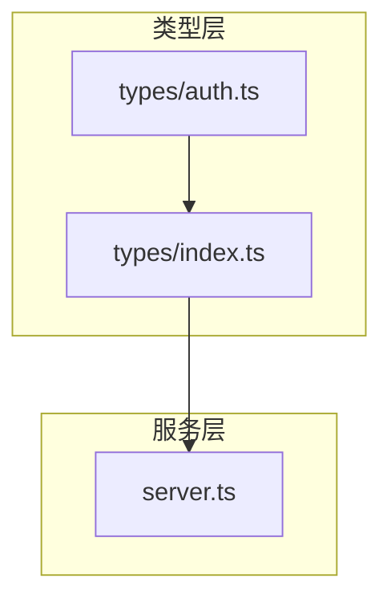
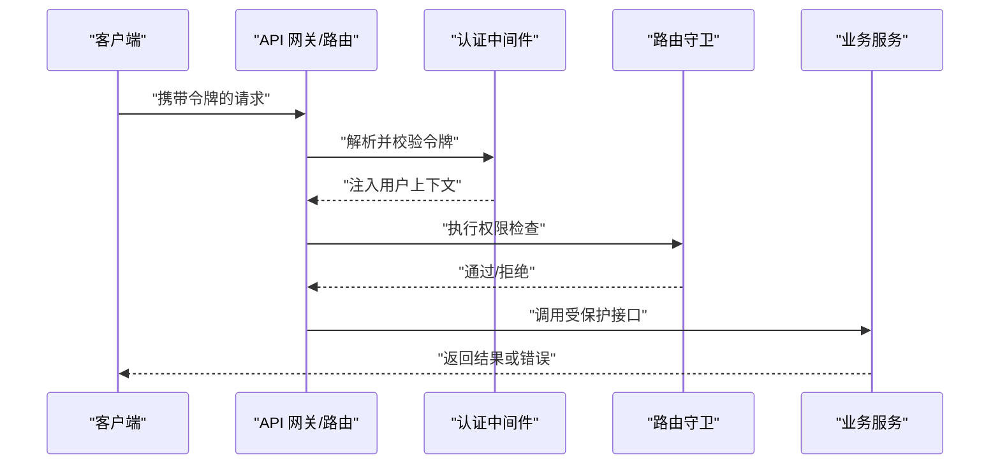
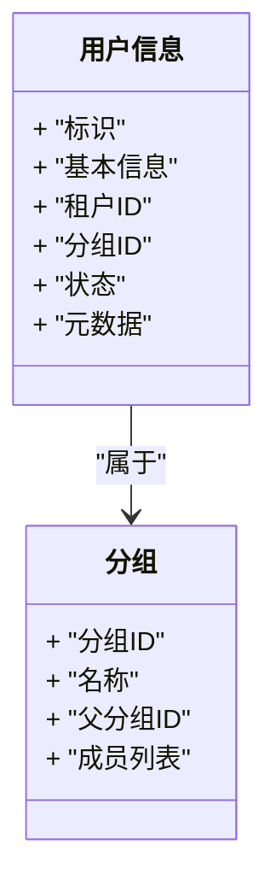
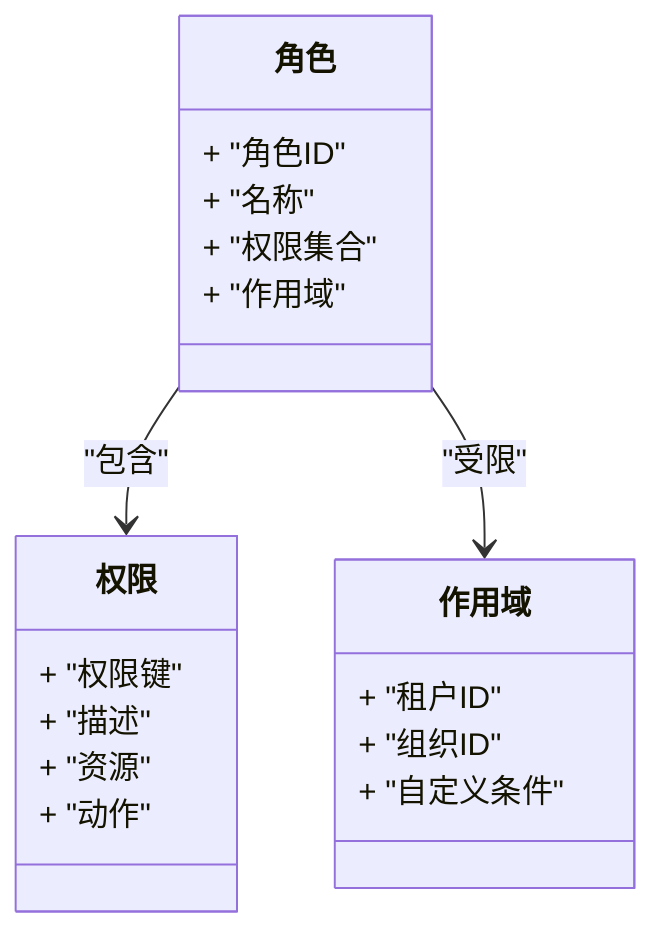
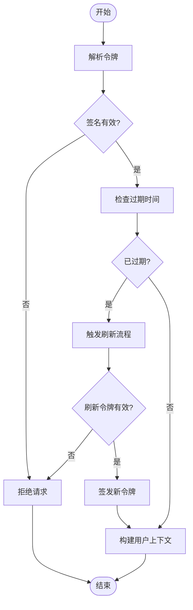
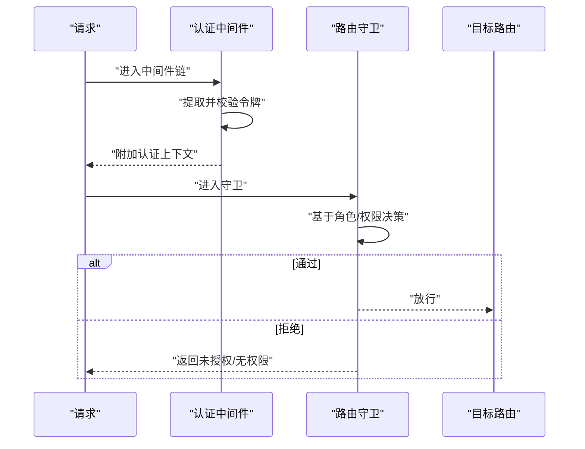
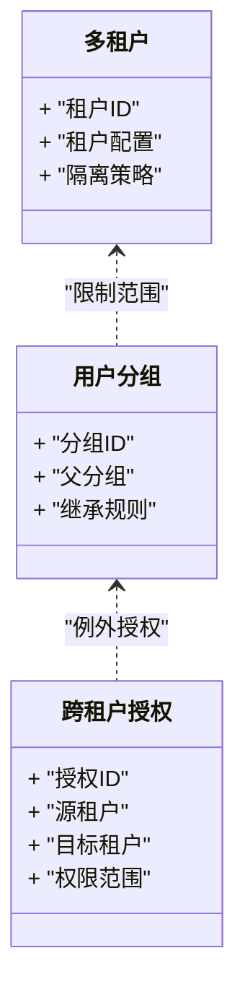
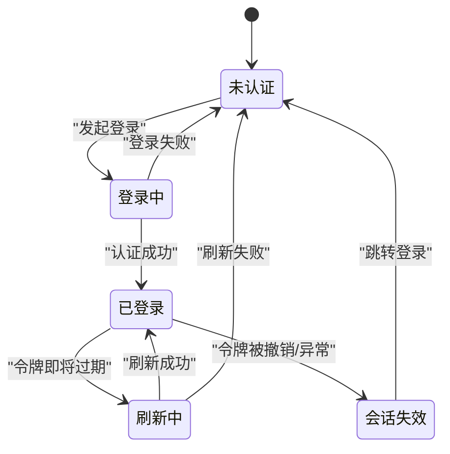
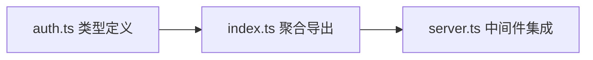

# 认证类型系统

<cite>
**本文引用的文件**   
- [src/types/auth.ts](file://src/types/auth.ts)
- [src/types/index.ts](file://src/types/index.ts)
- [server.ts](file://server.ts)
</cite>

## 目录
1. [简介](#简介)
2. [项目结构](#项目结构)
3. [核心组件](#核心组件)
4. [架构总览](#架构总览)
5. [详细组件分析](#详细组件分析)
6. [依赖分析](#依赖分析)
7. [性能考虑](#性能考虑)
8. [故障排查指南](#故障排查指南)
9. [结论](#结论)
10. [附录](#附录)

## 简介
本文件为 Supply OS 的“认证模块类型系统”提供全面文档，聚焦于用户认证相关的类型定义与约束，包括：
- 用户信息、权限角色与会话管理
- 令牌验证（JWT）结构与校验流程的类型约定
- 认证中间件与路由守卫的类型约束
- 多租户认证与用户分组的类型设计
- 认证状态与错误处理类型

目标是帮助前端与后端开发者在统一类型契约下实现一致的认证行为。

## 项目结构
认证相关类型主要集中于 types 目录下的 auth 类型文件，并通过 types/index.ts 进行聚合导出；服务端入口 server.ts 中承载了认证中间件的集成点。

图表来源
- [src/types/auth.ts](file://src/types/auth.ts)
- [src/types/index.ts](file://src/types/index.ts)
- [server.ts](file://server.ts)

章节来源
- [src/types/auth.ts](file://src/types/auth.ts)
- [src/types/index.ts](file://src/types/index.ts)
- [server.ts](file://server.ts)

## 核心组件
本节概述认证类型系统的核心组成与职责边界：
- 用户与身份模型：描述用户标识、基本信息、所属租户与分组等
- 权限与角色模型：描述角色、权限集合、资源访问范围
- 会话与令牌模型：描述会话生命周期、JWT 载荷与签名校验约定
- 认证中间件与路由守卫：描述请求上下文扩展、鉴权策略与守卫约束
- 多租户与分组：描述租户隔离、跨租户访问控制与组内权限继承
- 认证状态与错误：描述认证阶段状态机与错误分类

章节来源
- [src/types/auth.ts](file://src/types/auth.ts)
- [src/types/index.ts](file://src/types/index.ts)

## 架构总览
下图展示了认证类型系统在前后端交互中的位置与数据流向，强调类型契约对中间件、路由守卫与业务逻辑的约束作用。

图表来源
- [server.ts](file://server.ts)
- [src/types/auth.ts](file://src/types/auth.ts)

## 详细组件分析

### 用户与身份模型
- 用户标识与基础信息：用于唯一识别用户及其基本资料
- 租户与分组归属：支持多租户隔离与组内权限继承
- 账号状态与元数据：记录启用/禁用、创建时间、更新时间等

图表来源
- [src/types/auth.ts](file://src/types/auth.ts)

章节来源
- [src/types/auth.ts](file://src/types/auth.ts)

### 权限与角色模型
- 角色：一组权限的集合，可分配给用户或分组
- 权限：细粒度的资源操作许可，如读、写、删除、审批等
- 资源与作用域：限定权限生效的资源范围与租户边界

图表来源
- [src/types/auth.ts](file://src/types/auth.ts)

章节来源
- [src/types/auth.ts](file://src/types/auth.ts)

### 会话与令牌模型（JWT）
- 会话：表示一次认证的有效期与上下文，支持刷新与续期
- JWT 载荷：包含用户标识、租户、角色、权限摘要、签发时间、过期时间等
- 令牌校验：签名算法、时钟容差、黑名单/撤销机制的类型约定

图表来源
- [src/types/auth.ts](file://src/types/auth.ts)

章节来源
- [src/types/auth.ts](file://src/types/auth.ts)

### 认证中间件与路由守卫
- 认证中间件：负责从请求中提取令牌、校验签名、注入用户上下文到请求对象
- 路由守卫：在路由级别执行权限检查，依据角色与权限决定放行或拒绝
- 上下文扩展：为后续业务逻辑提供统一的认证上下文类型

图表来源
- [server.ts](file://server.ts)
- [src/types/auth.ts](file://src/types/auth.ts)

章节来源
- [server.ts](file://server.ts)
- [src/types/auth.ts](file://src/types/auth.ts)

### 多租户认证与用户分组
- 多租户：每个请求需携带租户标识，所有鉴权与数据访问均按租户隔离
- 用户分组：支持层级分组与权限继承，简化大规模用户的权限管理
- 跨租户访问：通过显式授权或白名单机制控制

图表来源
- [src/types/auth.ts](file://src/types/auth.ts)

章节来源
- [src/types/auth.ts](file://src/types/auth.ts)

### 认证状态与错误处理类型
- 认证状态：登录中、已登录、令牌刷新中、会话失效等
- 错误分类：令牌无效、签名失败、过期、无权限、服务器错误等
- 错误响应：统一错误码、消息与调试信息（生产环境脱敏）

图表来源
- [src/types/auth.ts](file://src/types/auth.ts)

章节来源
- [src/types/auth.ts](file://src/types/auth.ts)

## 依赖分析
认证类型系统对外暴露的聚合入口位于 types/index.ts，供业务模块与服务端中间件引用。

图表来源
- [src/types/auth.ts](file://src/types/auth.ts)
- [src/types/index.ts](file://src/types/index.ts)
- [server.ts](file://server.ts)

章节来源
- [src/types/index.ts](file://src/types/index.ts)
- [server.ts](file://server.ts)

## 性能考虑
- 令牌体积与解析开销：尽量精简 JWT 载荷，避免携带敏感或冗余字段
- 缓存策略：对频繁校验的权限摘要进行短期缓存，降低重复计算
- 并发安全：刷新令牌与黑名单更新需保证原子性与一致性
- 超时与重试：合理设置令牌过期时间与刷新窗口，减少抖动导致的重入

## 故障排查指南
- 常见错误定位
  - 令牌无效/签名失败：检查密钥配置、时区与时钟容差
  - 过期与刷新失败：确认刷新令牌是否可用、刷新接口是否可达
  - 无权限：核对角色-权限映射与作用域是否覆盖当前资源
- 日志与追踪
  - 记录请求 ID、租户 ID、用户 ID 与关键决策点
  - 在生产环境隐藏敏感信息，保留必要审计字段
- 快速恢复
  - 提供降级策略：当鉴权服务不可用时，按预设策略返回友好提示
  - 支持管理员强制刷新会话与撤销令牌

章节来源
- [src/types/auth.ts](file://src/types/auth.ts)

## 结论
Supply OS 的认证类型系统围绕“用户-角色-权限-租户-分组-令牌”的核心模型展开，通过明确的类型契约约束中间件与路由守卫的行为，确保前后端一致的安全语义。建议在实现中严格遵循类型定义，完善错误分类与日志追踪，并在高并发场景下优化令牌校验与缓存策略。

## 附录
- 术语表
  - 租户：独立的数据与权限隔离单元
  - 分组：用户集合，支持权限继承
  - 作用域：权限生效的范围，通常与租户/组织绑定
  - 守卫：在路由级别执行的鉴权逻辑
- 参考路径
  - 类型定义入口：[src/types/auth.ts](file://src/types/auth.ts)
  - 类型聚合导出：[src/types/index.ts](file://src/types/index.ts)
  - 中间件集成点：[server.ts](file://server.ts)