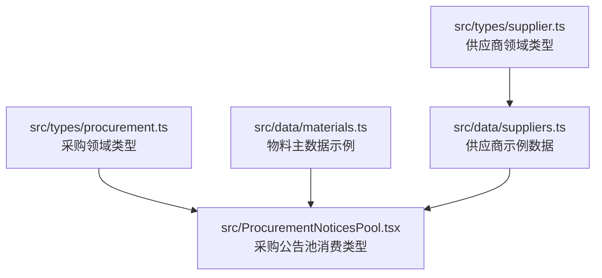
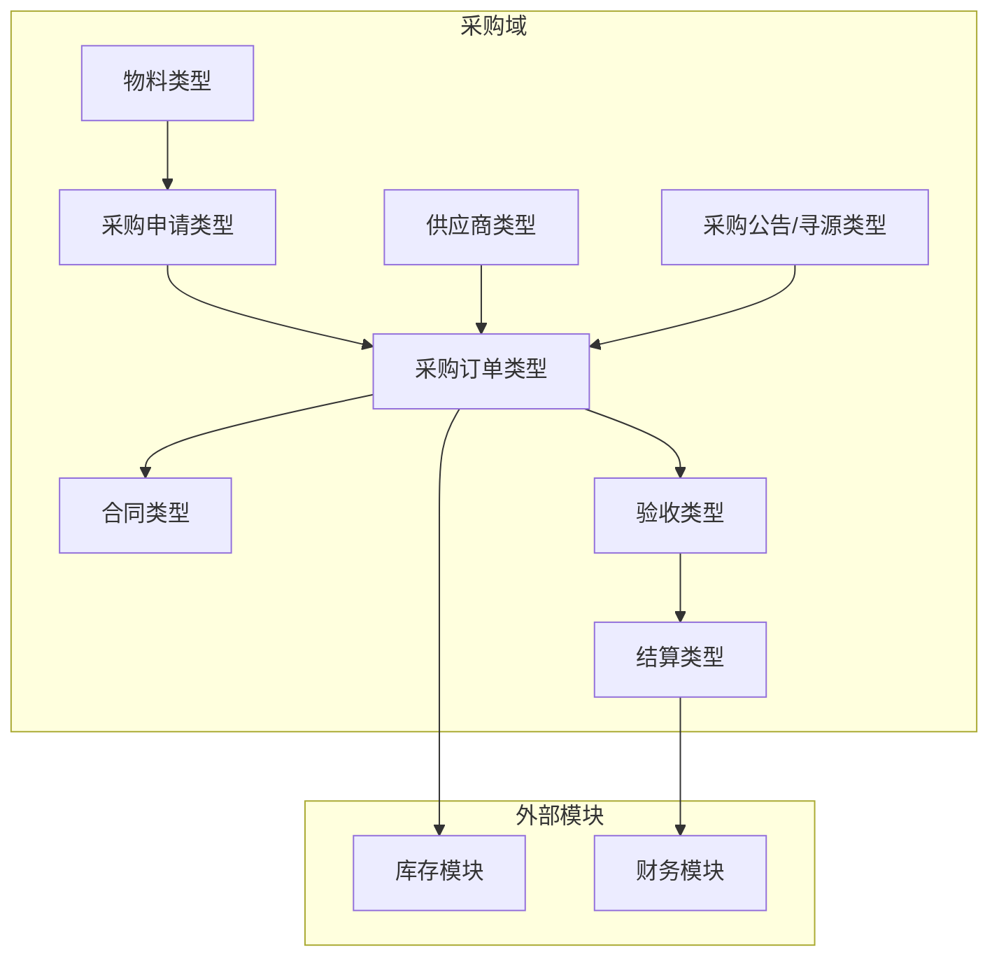
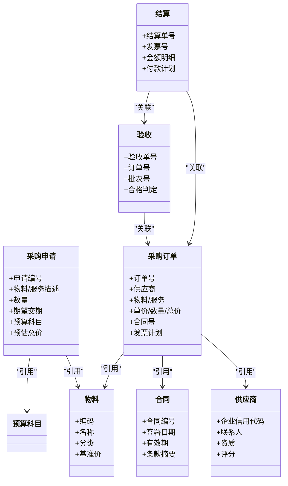

# 采购管理类型

<cite>
**本文引用的文件**   
- [src/types/procurement.ts](file://src/types/procurement.ts)
- [src/types/supplier.ts](file://src/types/supplier.ts)
- [src/data/suppliers.ts](file://src/data/suppliers.ts)
- [src/data/materials.ts](file://src/data/materials.ts)
- [src/ProcurementNoticesPool.tsx](file://src/ProcurementNoticesPool.tsx)
</cite>

## 目录
1. [简介](#简介)
2. [项目结构](#项目结构)
3. [核心组件](#核心组件)
4. [架构总览](#架构总览)
5. [详细组件分析](#详细组件分析)
6. [依赖分析](#依赖分析)
7. [性能考虑](#性能考虑)
8. [故障排查指南](#故障排查指南)
9. [结论](#结论)
10. [附录](#附录)

## 简介
本文件为 Supply OS 采购管理系统的“类型定义”提供系统化文档，覆盖采购申请、采购订单、合同管理、验收结算等关键业务对象；阐述采购流程的状态机与审批工作流、权限控制模型；给出供应商选择、价格比较与质量评估的类型设计；并说明采购数据分析、成本控制与预算管理的类型结构以及与库存、财务模块的集成接口。目标是帮助开发者与产品人员快速理解系统的数据契约与扩展点。

## 项目结构
围绕采购管理相关的类型与数据集中在以下位置：
- 类型定义：src/types/procurement.ts、src/types/supplier.ts
- 示例数据：src/data/suppliers.ts、src/data/materials.ts
- 前端展示与交互入口：src/ProcurementNoticesPool.tsx

图表来源
- [src/types/procurement.ts](file://src/types/procurement.ts)
- [src/types/supplier.ts](file://src/types/supplier.ts)
- [src/data/suppliers.ts](file://src/data/suppliers.ts)
- [src/data/materials.ts](file://src/data/materials.ts)
- [src/ProcurementNoticesPool.tsx](file://src/ProcurementNoticesPool.tsx)

章节来源
- [src/types/procurement.ts](file://src/types/procurement.ts)
- [src/types/supplier.ts](file://src/types/supplier.ts)
- [src/data/suppliers.ts](file://src/data/suppliers.ts)
- [src/data/materials.ts](file://src/data/materials.ts)
- [src/ProcurementNoticesPool.tsx](file://src/ProcurementNoticesPool.tsx)

## 核心组件
本节聚焦采购域的核心类型族及其职责边界，便于后续状态机、审批流与权限控制的建模。

- 采购申请
  - 用于表达需求发起、规格描述、数量与期望交付时间等基础信息。
  - 关联物料主数据与预算科目，支撑后续成本归集。
- 采购订单
  - 承载已确认的供需条款，包括单价、数量、总价、交货计划、付款条件等。
  - 与合同、发票、入库单形成闭环。
- 合同管理
  - 记录合同编号、签署日期、有效期、版本、附件与关键条款摘要。
  - 与订单、结算、对账、发票进行关联。
- 验收与结算
  - 验收单包含到货批次、质检结果、差异处理与签收信息。
  - 结算单汇总发票、扣款、税费、币种与汇率，驱动应付账款。
- 供应商
  - 供应商基本信息、资质、评级、黑名单标记、联系人、结算账户等。
  - 支持准入审核与动态绩效评估。
- 物料主数据
  - 物料编码、名称、分类、计量单位、基准价、替代料关系等。
- 采购公告与寻源
  - 发布询价/招标/竞价公告，收集报价与评审结果。

章节来源
- [src/types/procurement.ts](file://src/types/procurement.ts)
- [src/types/supplier.ts](file://src/types/supplier.ts)
- [src/data/materials.ts](file://src/data/materials.ts)

## 架构总览
下图展示了采购域类型在系统中的分层与交互关系，以及与其他模块（库存、财务）的集成点。

图表来源
- [src/types/procurement.ts](file://src/types/procurement.ts)
- [src/types/supplier.ts](file://src/types/supplier.ts)
- [src/data/materials.ts](file://src/data/materials.ts)
- [src/ProcurementNoticesPool.tsx](file://src/ProcurementNoticesPool.tsx)

## 详细组件分析

### 采购申请类型
- 字段要点
  - 标识与元数据：申请编号、版本号、创建/更新时间、创建人、部门、成本中心。
  - 需求信息：物料/服务描述、规格参数、数量、计量单位、期望交期、优先级。
  - 预算与成本：预算科目、预算额度、预估单价/总价、资金来源。
  - 附件与备注：技术协议、图纸、说明。
- 约束与校验
  - 必填项、数值范围、日期先后关系、预算超控提示。
- 与下游关系
  - 可拆分为多个采购订单行；与物料主数据、预算科目建立引用。

章节来源
- [src/types/procurement.ts](file://src/types/procurement.ts)

### 采购订单类型
- 字段要点
  - 标识与版本：订单号、版本、生效/失效时间、来源申请号。
  - 交易条款：供应商、物料/服务、单价、数量、折扣、税率、币种、汇率、总价。
  - 交付与物流：交货地点、分批计划、运输方式、包装要求。
  - 质量与合规：质量标准、检验要求、质保期。
  - 合同与发票：合同号、发票类型、开票计划。
- 约束与校验
  - 价格合理性、交期可行性、合同一致性、重复下单检测。
- 与上下游关系
  - 上游：采购申请、合同；下游：验收、入库、结算、应付。

章节来源
- [src/types/procurement.ts](file://src/types/procurement.ts)

### 合同管理类型
- 字段要点
  - 合同基本信息：合同编号、名称、类型、版本、签署方、签署日期、有效期。
  - 条款摘要：价格机制、调价规则、违约责任、争议解决。
  - 附件：扫描件、电子签章、补充协议。
- 约束与校验
  - 有效期逻辑、版本继承、关键字段变更审计。
- 与上下游关系
  - 作为订单与结算的依据；与供应商、订单、发票、结算单关联。

章节来源
- [src/types/procurement.ts](file://src/types/procurement.ts)

### 验收与结算类型
- 验收类型
  - 字段要点：验收单号、订单号、批次号、数量、合格/不合格判定、质检报告、签收人。
  - 约束与校验：数量与订单一致性、质量判定规则、差异处理流程。
- 结算类型
  - 字段要点：结算单号、关联订单/验收、发票号、金额明细（含税/不含税）、扣款、税费、币种与汇率、付款计划。
  - 约束与校验：发票合法性、金额勾稽、预算占用释放、付款条件触发。
- 与上下游关系
  - 验收驱动入库与应付生成；结算驱动财务入账与资金支付。

章节来源
- [src/types/procurement.ts](file://src/types/procurement.ts)

### 供应商类型
- 字段要点
  - 主体信息：统一社会信用代码、企业名称、注册地址、经营范围。
  - 商务信息：联系人、电话、邮箱、开户行与账号、结算周期。
  - 能力与风险：资质证照、认证等级、黑名单标记、风险评估。
  - 绩效指标：交期达成率、合格率、响应时效、综合评分。
- 约束与校验
  - 唯一性、证照有效期、黑名单拦截、评分更新策略。
- 与上下游关系
  - 被订单引用；参与寻源、比价、评标与绩效考核。

章节来源
- [src/types/supplier.ts](file://src/types/supplier.ts)
- [src/data/suppliers.ts](file://src/data/suppliers.ts)

### 物料主数据类型
- 字段要点
  - 编码、名称、分类、品牌、型号、计量单位、基准价、替代料关系、生命周期状态。
- 约束与校验
  - 编码唯一性、分类层级、价格有效性区间。
- 与上下游关系
  - 被采购申请与订单引用；与库存出入库、成本核算联动。

章节来源
- [src/data/materials.ts](file://src/data/materials.ts)

### 采购公告与寻源类型
- 字段要点
  - 公告编号、标题、类型（询价/招标/竞价）、发布时间、截止时间、适用范围、评审规则。
  - 报价收集：供应商报价、有效期、附加条款、澄清记录。
- 约束与校验
  - 时间窗口、报价完整性、评审规则可配置。
- 与上下游关系
  - 产出中标供应商与价格基准，驱动订单生成。

章节来源
- [src/ProcurementNoticesPool.tsx](file://src/ProcurementNoticesPool.tsx)

### 采购流程状态机类型
- 状态集合（示例）
  - 草稿、待提交、审批中、已批准、已驳回、已取消、执行中、已完成、已关闭。
- 状态转换规则
  - 基于角色与权限的转换许可；特定状态需满足前置条件（如预算校验通过）。
- 事件与动作
  - 提交、撤回、批准、驳回、转审、终止、完成、归档。
- 审计与追溯
  - 状态变更记录、操作人、时间戳、原因说明。

章节来源
- [src/types/procurement.ts](file://src/types/procurement.ts)

### 审批工作流类型
- 节点定义
  - 节点类型：串行、并行、会签、或签、条件分支。
  - 节点属性：审批人/角色、阈值、超时策略、退回策略。
- 流转控制
  - 条件表达式（金额、品类、风险等级）；动态路由；回退与重走。
- 审计与留痕
  - 审批意见、附件、电子签名、版本化。

章节来源
- [src/types/procurement.ts](file://src/types/procurement.ts)

### 权限控制类型
- 维度
  - 组织/部门、岗位/角色、数据范围（本人、本部门、全公司）、资源粒度（申请、订单、合同、结算）。
- 行为
  - 查看、编辑、提交、审批、导出、删除、归档。
- 策略
  - 基于角色的访问控制（RBAC）与基于属性的访问控制（ABAC）组合；最小权限原则。

章节来源
- [src/types/procurement.ts](file://src/types/procurement.ts)

### 供应商选择、价格比较与质量评估类型
- 供应商选择
  - 候选集、准入条件、资质匹配度、地域与服务半径、产能与交期承诺。
- 价格比较
  - 报价清单、折扣阶梯、运费与税费、总拥有成本（TCO）计算口径。
- 质量评估
  - 历史合格率、抽检方案、缺陷等级、整改闭环、质量保证金。
- 决策输出
  - 中标建议、备选供应商、谈判要点、风险提示。

章节来源
- [src/types/supplier.ts](file://src/types/supplier.ts)
- [src/data/suppliers.ts](file://src/data/suppliers.ts)

### 采购数据分析、成本控制与预算管理类型
- 数据分析
  - 指标：支出趋势、品类集中度、供应商集中度、价格波动、交期偏差、质量指标。
  - 维度：时间、组织、品类、供应商、项目/成本中心。
- 成本控制
  - 目标成本、实际成本、差异分析、降本举措跟踪。
- 预算管理
  - 预算科目、年度/月度额度、占用/释放、预警阈值、滚动预测。

章节来源
- [src/types/procurement.ts](file://src/types/procurement.ts)

### 与库存、财务模块的集成类型
- 与库存
  - 入库单、出库单、批次与序列号、库位、盘点差异、安全库存联动。
- 与财务
  - 应付账款、预付款、费用报销、总账凭证、税务发票、资金支付计划。
- 数据一致性
  - 双向对账、差异处理、审计追踪、幂等写入。

章节来源
- [src/types/procurement.ts](file://src/types/procurement.ts)

## 依赖分析
采购域类型之间的耦合关系如下：

图表来源
- [src/types/procurement.ts](file://src/types/procurement.ts)
- [src/types/supplier.ts](file://src/types/supplier.ts)
- [src/data/materials.ts](file://src/data/materials.ts)

章节来源
- [src/types/procurement.ts](file://src/types/procurement.ts)
- [src/types/supplier.ts](file://src/types/supplier.ts)
- [src/data/materials.ts](file://src/data/materials.ts)

## 性能考虑
- 类型设计应尽量避免深层嵌套与冗余字段，提升序列化/反序列化效率。
- 大对象（如合同附件、质检报告）采用外键引用与懒加载策略。
- 列表查询与报表统计使用投影型视图类型，减少不必要字段传输。
- 状态机与审批流采用事件驱动与增量更新，降低锁竞争。

[本节为通用指导，不直接分析具体文件]

## 故障排查指南
- 常见错误定位
  - 状态转换非法：检查当前状态与目标状态的转换许可及前置条件。
  - 审批失败：核对审批节点配置、审批人权限与条件表达式。
  - 预算超控：验证预算科目、可用额度与占用释放时序。
  - 价格异常：比对基准价、历史成交价与合同价。
- 日志与审计
  - 关注状态变更日志、审批意见、操作人与时间戳。
  - 对账差异需追溯到原始单据与流水。

章节来源
- [src/types/procurement.ts](file://src/types/procurement.ts)

## 结论
通过对采购申请、订单、合同、验收与结算等核心类型的梳理，结合状态机、审批流与权限控制模型，形成了端到端的采购数据契约。该类型体系既支撑日常业务流程运转，也为供应商选择、价格比较、质量评估、成本与预算管控提供了可扩展的基础。与库存、财务的集成类型确保了业财一体化与数据一致性。

[本节为总结性内容，不直接分析具体文件]

## 附录
- 术语表
  - 采购申请：需求发起与规格确认的起点。
  - 采购订单：经批准的供需契约载体。
  - 合同：法律层面的交易约定与条款依据。
  - 验收：到货与质量的确认环节。
  - 结算：发票与付款的最终闭环。
- 参考实现路径
  - 类型定义：[src/types/procurement.ts](file://src/types/procurement.ts)、[src/types/supplier.ts](file://src/types/supplier.ts)
  - 示例数据：[src/data/suppliers.ts](file://src/data/suppliers.ts)、[src/data/materials.ts](file://src/data/materials.ts)
  - 前端消费：[src/ProcurementNoticesPool.tsx](file://src/ProcurementNoticesPool.tsx)