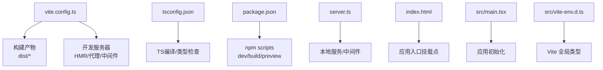
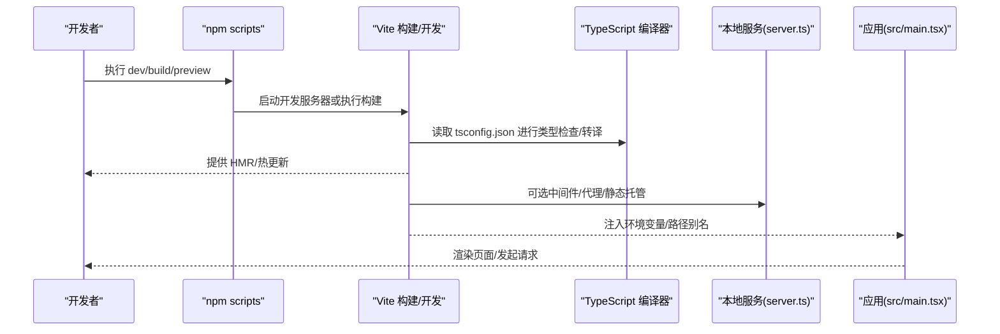
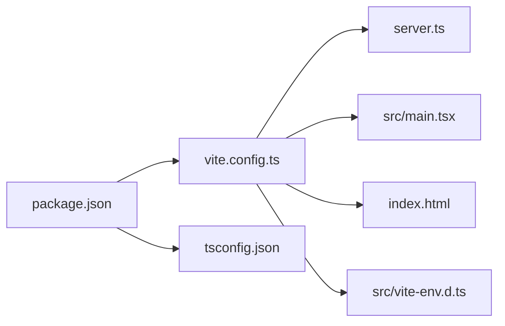

# 配置与环境

<cite>
**本文引用的文件**   
- [vite.config.ts](file://vite.config.ts)
- [tsconfig.json](file://tsconfig.json)
- [package.json](file://package.json)
- [server.ts](file://server.ts)
- [index.html](file://index.html)
- [src/main.tsx](file://src/main.tsx)
- [src/vite-env.d.ts](file://src/vite-env.d.ts)
</cite>

## 目录
1. [简介](#简介)
2. [项目结构](#项目结构)
3. [核心组件](#核心组件)
4. [架构总览](#架构总览)
5. [详细组件分析](#详细组件分析)
6. [依赖分析](#依赖分析)
7. [性能考虑](#性能考虑)
8. [故障排查指南](#故障排查指南)
9. [结论](#结论)
10. [附录](#附录)

## 简介
本文件面向Supply OS的前端工程，聚焦于构建与运行环境的配置与管理。内容覆盖Vite构建工具的配置项、TypeScript编译设置、开发服务器行为、环境变量管理、路径别名、插件扩展机制、多环境差异与部署策略、构建优化与代码分割/懒加载、自定义开发工作流与调试、敏感信息保护以及配置验证与错误处理等主题。文档旨在帮助开发者快速理解并高效维护项目的构建与运行环境。

## 项目结构
围绕构建与环境的重点文件分布如下：
- Vite 构建与开发服务器配置：vite.config.ts
- TypeScript 编译选项：tsconfig.json
- 包管理与脚本入口：package.json
- 本地服务端（可选）：server.ts
- 应用入口与页面模板：src/main.tsx、index.html
- 类型声明与环境变量类型：src/vite-env.d.ts

图表来源
- [vite.config.ts](file://vite.config.ts)
- [tsconfig.json](file://tsconfig.json)
- [package.json](file://package.json)
- [server.ts](file://server.ts)
- [index.html](file://index.html)
- [src/main.tsx](file://src/main.tsx)
- [src/vite-env.d.ts](file://src/vite-env.d.ts)

章节来源
- [vite.config.ts](file://vite.config.ts)
- [tsconfig.json](file://tsconfig.json)
- [package.json](file://package.json)
- [server.ts](file://server.ts)
- [index.html](file://index.html)
- [src/main.tsx](file://src/main.tsx)
- [src/vite-env.d.ts](file://src/vite-env.d.ts)

## 核心组件
本节从“构建系统”“类型系统”“脚本与生命周期”“运行时注入”四个维度梳理关键能力。

- 构建系统（Vite）
  - 负责开发服务器、热更新、静态资源处理、打包输出、插件生态集成。
  - 通过配置文件集中定义开发/生产差异化行为、路径别名、代理、优化策略等。
- 类型系统（TypeScript）
  - 控制语言特性、模块解析、严格性、输出目标与源映射。
  - 与Vite协同提供类型提示和编译期校验。
- 脚本与生命周期（package.json）
  - 暴露常用命令：开发、构建、预览、类型检查等。
  - 作为统一入口串联Vite与Node脚本。
- 运行时注入（环境变量）
  - 在构建期或运行期向应用注入配置值。
  - 通过类型声明确保类型安全访问。

章节来源
- [vite.config.ts](file://vite.config.ts)
- [tsconfig.json](file://tsconfig.json)
- [package.json](file://package.json)
- [src/vite-env.d.ts](file://src/vite-env.d.ts)

## 架构总览
下图展示从脚本到构建与运行的整体流程，包括开发模式与生产模式的分支。

图表来源
- [package.json](file://package.json)
- [vite.config.ts](file://vite.config.ts)
- [tsconfig.json](file://tsconfig.json)
- [server.ts](file://server.ts)
- [src/main.tsx](file://src/main.tsx)

## 详细组件分析

### Vite 构建与开发服务器配置
- 职责
  - 定义开发服务器行为（端口、主机、HMR、代理、中间件）。
  - 定义构建产物与优化策略（输出目录、资源内联、压缩、代码分割）。
  - 配置路径别名与插件扩展点。
- 关键要点
  - 开发服务器：建议开启HMR、合理配置代理以对接后端接口；可注册中间件实现鉴权、日志、CORS等。
  - 构建优化：按需启用压缩、资源哈希、预加载/预取、分包策略；对大体积第三方库做外部化或CDN引入。
  - 路径别名：为模块导入提供稳定短路径，提升可读性与迁移效率。
  - 插件机制：利用官方与社区插件扩展功能（如自动导入、图标、国际化、PWA等）。
- 常见实践
  - 将不同环境的差异化配置按条件拆分，避免单文件臃肿。
  - 使用环境变量驱动开关，减少重复配置。
  - 对静态资源与字体图片进行分类处理，平衡缓存命中与首屏性能。

章节来源
- [vite.config.ts](file://vite.config.ts)

### TypeScript 编译设置
- 职责
  - 控制语言版本、模块系统、严格性、输出目标、源映射、路径映射等。
- 关键要点
  - 模块系统与目标：根据运行环境与浏览器支持选择合适目标，兼顾兼容性与性能。
  - 严格性：开启必要严格检查，提升代码质量与可维护性。
  - 路径映射：与Vite路径别名保持一致，保证IDE与构建一致体验。
  - 类型声明：通过声明文件为第三方库或全局变量补充类型。
- 常见实践
  - 分离基础配置与项目特定配置，便于复用。
  - 结合ESLint/Prettier形成一致的编码规范。

章节来源
- [tsconfig.json](file://tsconfig.json)

### 包管理与脚本
- 职责
  - 统一管理依赖与常用命令（开发、构建、预览、类型检查、测试等）。
- 关键要点
  - 脚本命名清晰，参数传递明确，便于CI/CD集成。
  - 区分开发与生产脚本，避免在生产中执行不必要的任务。
- 常见实践
  - 使用跨平台兼容的脚本封装。
  - 在CI中并行执行类型检查与构建，缩短流水线时间。

章节来源
- [package.json](file://package.json)

### 本地服务与中间件
- 职责
  - 提供本地HTTP服务、静态资源托管、API代理、中间件扩展。
- 关键要点
  - 代理规则应与环境变量配合，避免硬编码。
  - 中间件顺序影响请求处理链路，需明确职责边界。
- 常见实践
  - 将鉴权、日志、限流等通用逻辑抽离为独立中间件。
  - 在开发阶段模拟数据或服务降级，提高联调效率。

章节来源
- [server.ts](file://server.ts)

### 应用入口与页面模板
- 职责
  - index.html 提供挂载点与全局元信息。
  - src/main.tsx 完成应用初始化、路由、状态管理等。
- 关键要点
  - 在入口中读取环境变量，初始化SDK或上报通道。
  - 对关键资源进行预加载以提升首屏性能。
- 常见实践
  - 将环境相关初始化放在受控的模块中，便于测试与替换。

章节来源
- [index.html](file://index.html)
- [src/main.tsx](file://src/main.tsx)

### 环境变量与类型声明
- 职责
  - 在构建期或运行期注入配置值，并通过类型声明保障访问安全。
- 关键要点
  - 区分客户端与服务端可见的环境变量，避免泄露敏感信息。
  - 为所有使用到的全局变量补充类型声明，防止运行时错误。
- 常见实践
  - 使用前缀区分不同环境，结合默认值与校验逻辑。
  - 在CI中校验必需变量是否存在，失败即阻断构建。

章节来源
- [src/vite-env.d.ts](file://src/vite-env.d.ts)

## 依赖分析
下图展示主要配置与脚本之间的依赖关系。

图表来源
- [package.json](file://package.json)
- [vite.config.ts](file://vite.config.ts)
- [tsconfig.json](file://tsconfig.json)
- [server.ts](file://server.ts)
- [index.html](file://index.html)
- [src/main.tsx](file://src/main.tsx)
- [src/vite-env.d.ts](file://src/vite-env.d.ts)

章节来源
- [package.json](file://package.json)
- [vite.config.ts](file://vite.config.ts)
- [tsconfig.json](file://tsconfig.json)
- [server.ts](file://server.ts)
- [index.html](file://index.html)
- [src/main.tsx](file://src/main.tsx)
- [src/vite-env.d.ts](file://src/vite-env.d.ts)

## 性能考虑
- 构建优化
  - 启用压缩与资源哈希，合理使用缓存策略。
  - 对大型依赖进行外部化或CDN引入，降低包体。
  - 按需加载与代码分割，减少首屏体积。
- 网络与资源
  - 预加载关键资源，预取次级资源。
  - 静态资源分类与长缓存，动态资源短缓存。
- 运行时
  - 延迟初始化非关键模块，减少主线程阻塞。
  - 监控与埋点异步化，避免影响核心路径。

[本节为通用指导，不直接分析具体文件]

## 故障排查指南
- 常见问题定位
  - 环境变量缺失或类型不匹配：检查类型声明与注入位置，确认构建时是否包含所需变量。
  - 路径别名失效：核对tsconfig与Vite配置的一致性，确保模块解析策略正确。
  - 代理不生效：检查代理规则与环境变量，确认请求路径与目标地址。
  - 构建失败：查看控制台错误堆栈，优先解决类型错误或模块解析问题。
- 调试建议
  - 使用Source Map定位源码问题。
  - 在关键路径添加日志与断点，逐步缩小范围。
  - 隔离变更，最小复现问题后再合并。

章节来源
- [vite.config.ts](file://vite.config.ts)
- [tsconfig.json](file://tsconfig.json)
- [src/vite-env.d.ts](file://src/vite-env.d.ts)

## 结论
通过对Vite、TypeScript、脚本与运行时的系统化梳理，可以为Supply OS建立稳定、可扩展且高效的构建与运行环境。建议在团队内沉淀最佳实践，持续优化构建性能与开发体验，同时强化环境变量与敏感信息管理，确保交付质量与安全合规。

[本节为总结性内容，不直接分析具体文件]

## 附录

### 多环境差异与部署策略
- 环境划分
  - 开发：开启HMR、详细日志、宽松校验。
  - 测试：关闭不必要优化，保留调试信息，便于问题定位。
  - 生产：启用全部优化，关闭调试，严格校验。
- 部署建议
  - 使用只读容器镜像，环境变量由部署平台注入。
  - 静态资源走CDN，启用强缓存与版本化。
  - 灰度发布与回滚预案，结合健康检查与指标监控。

[本节为通用指导，不直接分析具体文件]

### 构建优化与代码分割/懒加载
- 代码分割
  - 按路由或功能域拆分模块，按需加载。
  - 第三方库外部化或预构建，减少重复打包。
- 懒加载
  - 图片、视频等大资源采用懒加载。
  - 非关键功能模块延迟初始化。
- 资源优化
  - 启用压缩、Tree Shaking、死代码消除。
  - 字体与图标按需引入，减少冗余。

[本节为通用指导，不直接分析具体文件]

### 自定义开发工作流与调试配置
- 工作流
  - 统一脚本入口，封装常用操作（格式化、类型检查、构建、预览）。
  - 引入Git钩子进行提交前校验。
- 调试
  - 配置IDE断点与Source Map。
  - 使用Mock与沙箱环境隔离外部依赖。

[本节为通用指导，不直接分析具体文件]

### 环境变量安全管理与敏感信息保护
- 原则
  - 不在仓库中存放敏感信息，使用密钥管理服务或平台注入。
  - 区分客户端与服务端可见变量，避免前端泄露。
- 措施
  - 构建期校验必需变量，缺失则阻断构建。
  - 对敏感信息进行加密存储与最小权限访问。
  - 定期轮换密钥与令牌，审计访问日志。

[本节为通用指导，不直接分析具体文件]

### 配置验证与错误处理机制
- 验证
  - 在启动时校验环境变量格式与取值范围。
  - 对关键路径进行健康检查与告警。
- 错误处理
  - 统一错误码与消息，便于前端展示与追踪。
  - 记录上下文信息，辅助定位问题根因。

[本节为通用指导，不直接分析具体文件]