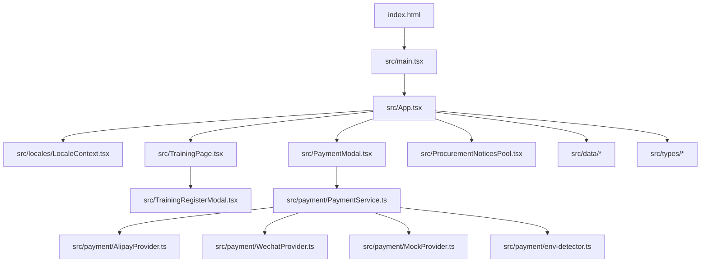
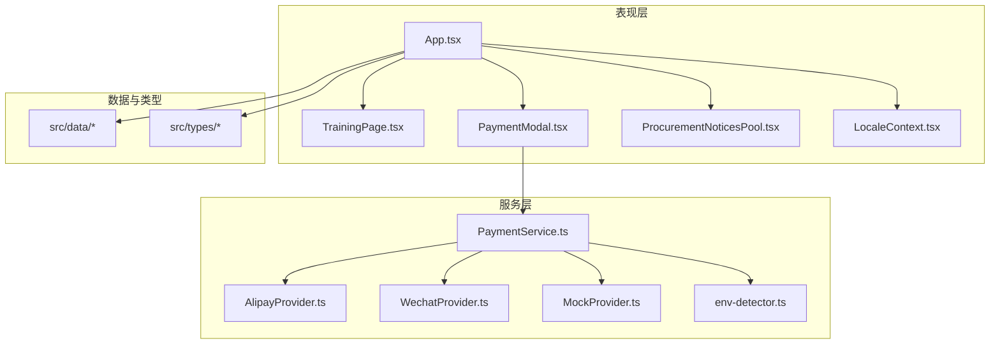
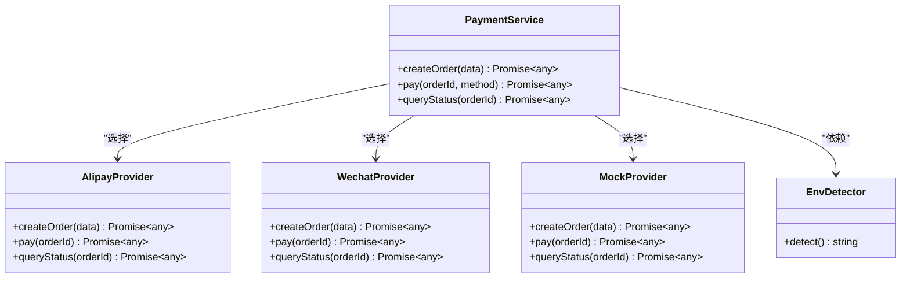
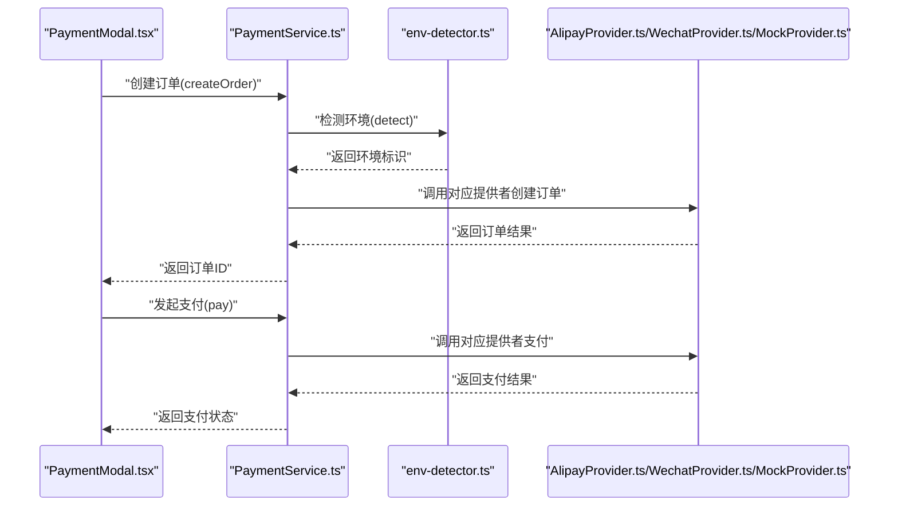
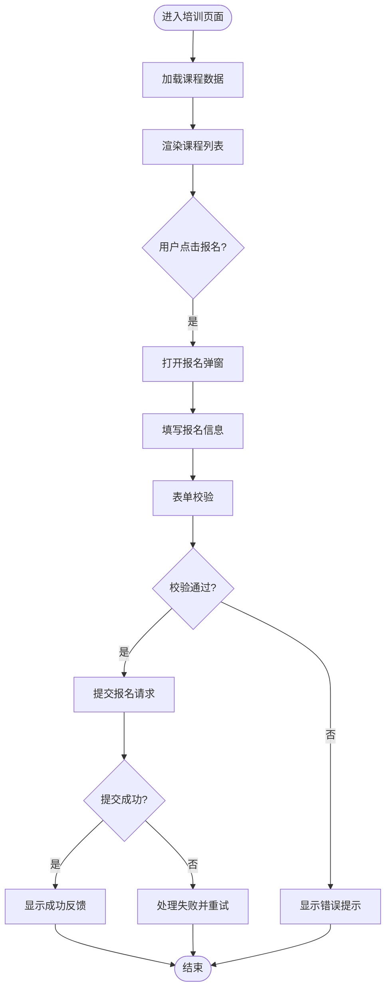
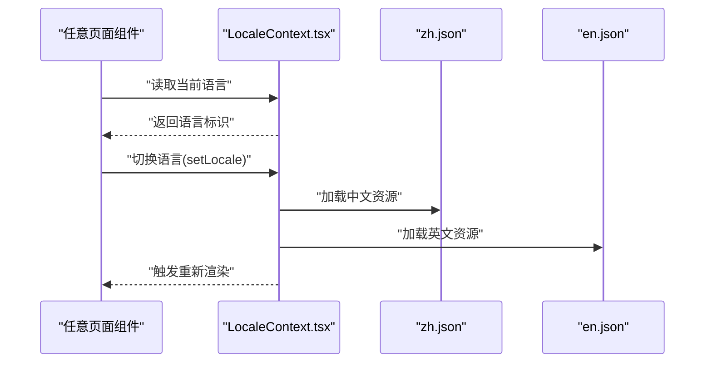
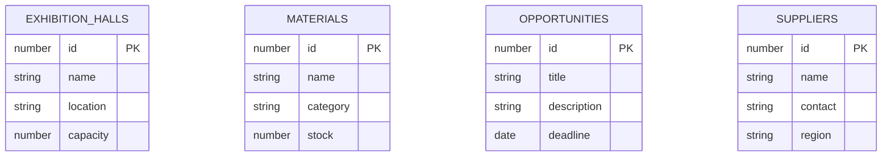
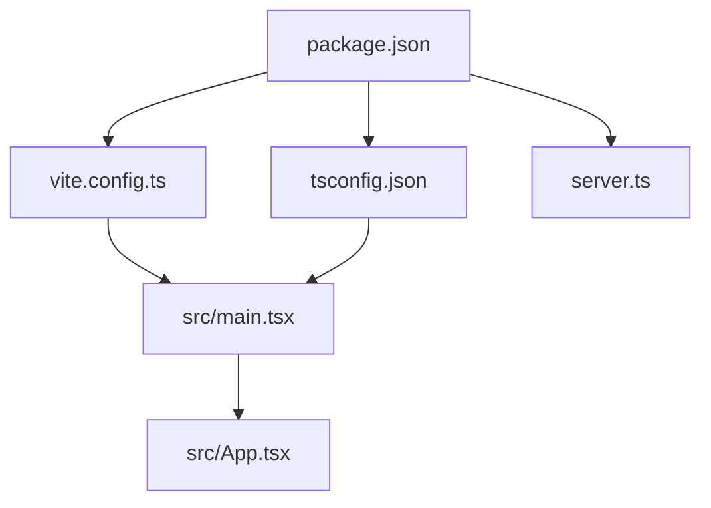

# 项目概述

<cite>
**本文引用的文件**   
- [README.md](file://README.md)
- [package.json](file://package.json)
- [vite.config.ts](file://vite.config.ts)
- [tsconfig.json](file://tsconfig.json)
- [index.html](file://index.html)
- [server.ts](file://server.ts)
- [src/main.tsx](file://src/main.tsx)
- [src/App.tsx](file://src/App.tsx)
- [src/locales/LocaleContext.tsx](file://src/locales/LocaleContext.tsx)
- [src/locales/en.json](file://src/locales/en.json)
- [src/locales/zh.json](file://src/locales/zh.json)
- [src/payment/PaymentService.ts](file://src/payment/PaymentService.ts)
- [src/payment/types.ts](file://src/payment/types.ts)
- [src/payment/AlipayProvider.ts](file://src/payment/AlipayProvider.ts)
- [src/payment/WechatProvider.ts](file://src/payment/WechatProvider.ts)
- [src/payment/MockProvider.ts](file://src/payment/MockProvider.ts)
- [src/payment/env-detector.ts](file://src/payment/env-detector.ts)
- [src/TrainingPage.tsx](file://src/TrainingPage.tsx)
- [src/TrainingRegisterModal.tsx](file://src/TrainingRegisterModal.tsx)
- [src/PaymentModal.tsx](file://src/PaymentModal.tsx)
- [src/ProcurementNoticesPool.tsx](file://src/ProcurementNoticesPool.tsx)
- [src/data/exhibition-halls.ts](file://src/data/exhibition-halls.ts)
- [src/data/materials.ts](file://src/data/materials.ts)
- [src/data/opportunities.ts](file://src/data/opportunities.ts)
- [src/data/suppliers.ts](file://src/data/index.ts)
- [src/types/index.ts](file://src/types/index.ts)
- [src/types/learning.ts](file://src/types/learning.ts)
- [src/types/membership.ts](file://src/types/membership.ts)
- [src/types/payment.ts](file://src/types/payment.ts)
- [src/types/exhibition.ts](file://src/types/exhibition.ts)
- [src/types/procurement.ts](file://src/types/procurement.ts)
- [src/types/supplier.ts](file://src/types/supplier.ts)
</cite>

## 目录
1. [简介](#简介)
2. [项目结构](#项目结构)
3. [核心组件](#核心组件)
4. [架构总览](#架构总览)
5. [详细组件分析](#详细组件分析)
6. [依赖分析](#依赖分析)
7. [性能考虑](#性能考虑)
8. [故障排查指南](#故障排查指南)
9. [结论](#结论)
10. [附录](#附录)

## 简介
Supply OS 是一个面向供应链场景的前端应用，围绕“供应链管理、培训学习系统、支付集成、多语言支持、展览管理”等核心业务场景构建。项目采用 React + TypeScript + Vite 技术栈，强调类型安全、模块化与快速开发体验。通过统一的数据模型与可插拔的支付提供者，实现可扩展的业务能力；通过国际化上下文提供中英文切换能力；通过集中式数据与页面组件组织，降低耦合度并提升可维护性。

## 项目结构
仓库采用按领域与职责划分的目录组织方式：
- src 下包含应用入口、页面组件、业务模块（如 payment）、国际化资源与共享类型定义。
- data 目录存放演示用静态数据，用于展览场馆、材料、商机、供应商等展示。
- types 目录集中定义各业务域的类型契约，确保跨模块一致性。
- locales 目录提供 i18n 上下文与语言包。
- payment 目录封装支付流程与不同渠道提供者。
- 根目录包含构建配置、服务器脚本与文档说明。

图表来源
- [index.html:1-50](file://index.html#L1-L50)
- [src/main.tsx:1-50](file://src/main.tsx#L1-L50)
- [src/App.tsx:1-120](file://src/App.tsx#L1-L120)
- [src/locales/LocaleContext.tsx:1-120](file://src/locales/LocaleContext.tsx#L1-L120)
- [src/TrainingPage.tsx:1-120](file://src/TrainingPage.tsx#L1-L120)
- [src/PaymentModal.tsx:1-120](file://src/PaymentModal.tsx#L1-L120)
- [src/TrainingRegisterModal.tsx:1-120](file://src/TrainingRegisterModal.tsx#L1-L120)
- [src/payment/PaymentService.ts:1-120](file://src/payment/PaymentService.ts#L1-L120)
- [src/payment/AlipayProvider.ts:1-120](file://src/payment/AlipayProvider.ts#L1-L120)
- [src/payment/WechatProvider.ts:1-120](file://src/payment/WechatProvider.ts#L1-L120)
- [src/payment/MockProvider.ts:1-120](file://src/payment/MockProvider.ts#L1-L120)
- [src/payment/env-detector.ts:1-120](file://src/payment/env-detector.ts#L1-L120)
- [src/data/index.ts:1-120](file://src/data/index.ts#L1-L120)
- [src/types/index.ts:1-120](file://src/types/index.ts#L1-L120)

章节来源
- [README.md:1-120](file://README.md#L1-L120)
- [package.json:1-120](file://package.json#L1-L120)
- [vite.config.ts:1-120](file://vite.config.ts#L1-L120)
- [tsconfig.json:1-120](file://tsconfig.json#L1-L120)
- [index.html:1-120](file://index.html#L1-L120)
- [server.ts:1-120](file://server.ts#L1-L120)

## 核心组件
- 应用入口与路由挂载
  - main.tsx 负责初始化 React 应用并挂载到 DOM。
  - App.tsx 作为顶层容器，组合页面与全局上下文（如国际化）。
- 国际化（i18n）
  - LocaleContext.tsx 提供语言上下文，配合 en.json 与 zh.json 完成多语言切换。
- 培训学习系统
  - TrainingPage.tsx 展示课程列表与详情。
  - TrainingRegisterModal.tsx 处理报名交互与状态。
- 支付集成
  - PaymentModal.tsx 提供支付弹窗与流程编排。
  - PaymentService.ts 统一支付服务接口，内部根据环境选择具体提供者。
  - AlipayProvider.ts / WechatProvider.ts / MockProvider.ts 分别对接支付宝、微信支付与模拟实现。
  - env-detector.ts 检测运行环境以决定使用真实或模拟支付。
- 采购公告池
  - ProcurementNoticesPool.tsx 聚合与展示采购公告信息。
- 展览管理与数据层
  - exhibition-halls.ts、materials.ts、opportunities.ts、suppliers.ts 提供演示数据。
  - types 目录定义各业务域类型契约，贯穿 UI 与服务层。

章节来源
- [src/main.tsx:1-120](file://src/main.tsx#L1-L120)
- [src/App.tsx:1-120](file://src/App.tsx#L1-L120)
- [src/locales/LocaleContext.tsx:1-120](file://src/locales/LocaleContext.tsx#L1-L120)
- [src/locales/en.json:1-120](file://src/locales/en.json#L1-L120)
- [src/locales/zh.json:1-120](file://src/locales/zh.json#L1-L120)
- [src/TrainingPage.tsx:1-120](file://src/TrainingPage.tsx#L1-L120)
- [src/TrainingRegisterModal.tsx:1-120](file://src/TrainingRegisterModal.tsx#L1-L120)
- [src/PaymentModal.tsx:1-120](file://src/PaymentModal.tsx#L1-L120)
- [src/payment/PaymentService.ts:1-120](file://src/payment/PaymentService.ts#L1-L120)
- [src/payment/AlipayProvider.ts:1-120](file://src/payment/AlipayProvider.ts#L1-L120)
- [src/payment/WechatProvider.ts:1-120](file://src/payment/WechatProvider.ts#L1-L120)
- [src/payment/MockProvider.ts:1-120](file://src/payment/MockProvider.ts#L1-L120)
- [src/payment/env-detector.ts:1-120](file://src/payment/env-detector.ts#L1-L120)
- [src/ProcurementNoticesPool.tsx:1-120](file://src/ProcurementNoticesPool.tsx#L1-L120)
- [src/data/exhibition-halls.ts:1-120](file://src/data/exhibition-halls.ts#L1-L120)
- [src/data/materials.ts:1-120](file://src/data/materials.ts#L1-L120)
- [src/data/opportunities.ts:1-120](file://src/data/opportunities.ts#L1-L120)
- [src/data/suppliers.ts:1-120](file://src/data/suppliers.ts#L1-L120)
- [src/types/index.ts:1-120](file://src/types/index.ts#L1-L120)
- [src/types/learning.ts:1-120](file://src/types/learning.ts#L1-L120)
- [src/types/membership.ts:1-120](file://src/types/membership.ts#L1-L120)
- [src/types/payment.ts:1-120](file://src/types/payment.ts#L1-L120)
- [src/types/exhibition.ts:1-120](file://src/types/exhibition.ts#L1-L120)
- [src/types/procurement.ts:1-120](file://src/types/procurement.ts#L1-L120)
- [src/types/supplier.ts:1-120](file://src/types/supplier.ts#L1-L120)

## 架构总览
整体采用“页面组件 + 领域服务 + 数据/类型”的分层设计：
- 表现层：App 组合页面组件（培训、支付弹窗、采购公告等），并通过国际化上下文提供语言切换。
- 服务层：PaymentService 抽象支付流程，依据环境选择具体提供者（支付宝、微信、Mock）。
- 数据层：data 目录提供静态演示数据，types 目录定义强类型契约，保证前后端一致性与可维护性。
- 构建与运行：Vite 提供开发与构建能力，TypeScript 保障类型安全，Node 服务器脚本辅助本地运行。

图表来源
- [src/App.tsx:1-120](file://src/App.tsx#L1-L120)
- [src/TrainingPage.tsx:1-120](file://src/TrainingPage.tsx#L1-L120)
- [src/PaymentModal.tsx:1-120](file://src/PaymentModal.tsx#L1-L120)
- [src/ProcurementNoticesPool.tsx:1-120](file://src/ProcurementNoticesPool.tsx#L1-L120)
- [src/locales/LocaleContext.tsx:1-120](file://src/locales/LocaleContext.tsx#L1-L120)
- [src/payment/PaymentService.ts:1-120](file://src/payment/PaymentService.ts#L1-L120)
- [src/payment/AlipayProvider.ts:1-120](file://src/payment/AlipayProvider.ts#L1-L120)
- [src/payment/WechatProvider.ts:1-120](file://src/payment/WechatProvider.ts#L1-L120)
- [src/payment/MockProvider.ts:1-120](file://src/payment/MockProvider.ts#L1-L120)
- [src/payment/env-detector.ts:1-120](file://src/payment/env-detector.ts#L1-L120)
- [src/data/index.ts:1-120](file://src/data/index.ts#L1-L120)
- [src/types/index.ts:1-120](file://src/types/index.ts#L1-L120)

## 详细组件分析

### 支付集成组件分析
支付模块采用“服务 + 提供者”的可插拔设计：
- PaymentService 暴露统一的支付方法，内部根据运行环境选择具体提供者。
- 提供者包括 AlipayProvider、WechatProvider、MockProvider，便于在开发/测试与生产环境之间切换。
- env-detector 负责检测当前环境，驱动 Provider 的选择策略。

图表来源
- [src/payment/PaymentService.ts:1-120](file://src/payment/PaymentService.ts#L1-L120)
- [src/payment/AlipayProvider.ts:1-120](file://src/payment/AlipayProvider.ts#L1-L120)
- [src/payment/WechatProvider.ts:1-120](file://src/payment/WechatProvider.ts#L1-L120)
- [src/payment/MockProvider.ts:1-120](file://src/payment/MockProvider.ts#L1-L120)
- [src/payment/env-detector.ts:1-120](file://src/payment/env-detector.ts#L1-L120)

#### 支付流程时序图

图表来源
- [src/PaymentModal.tsx:1-120](file://src/PaymentModal.tsx#L1-L120)
- [src/payment/PaymentService.ts:1-120](file://src/payment/PaymentService.ts#L1-L120)
- [src/payment/env-detector.ts:1-120](file://src/payment/env-detector.ts#L1-L120)
- [src/payment/AlipayProvider.ts:1-120](file://src/payment/AlipayProvider.ts#L1-L120)
- [src/payment/WechatProvider.ts:1-120](file://src/payment/WechatProvider.ts#L1-L120)
- [src/payment/MockProvider.ts:1-120](file://src/payment/MockProvider.ts#L1-L120)

章节来源
- [src/PaymentModal.tsx:1-120](file://src/PaymentModal.tsx#L1-L120)
- [src/payment/PaymentService.ts:1-120](file://src/payment/PaymentService.ts#L1-L120)
- [src/payment/AlipayProvider.ts:1-120](file://src/payment/AlipayProvider.ts#L1-L120)
- [src/payment/WechatProvider.ts:1-120](file://src/payment/WechatProvider.ts#L1-L120)
- [src/payment/MockProvider.ts:1-120](file://src/payment/MockProvider.ts#L1-L120)
- [src/payment/env-detector.ts:1-120](file://src/payment/env-detector.ts#L1-L120)

### 培训学习系统组件分析
培训模块由课程展示与报名弹窗组成：
- TrainingPage.tsx 负责课程列表渲染与导航。
- TrainingRegisterModal.tsx 处理报名表单、校验与提交。

图表来源
- [src/TrainingPage.tsx:1-120](file://src/TrainingPage.tsx#L1-L120)
- [src/TrainingRegisterModal.tsx:1-120](file://src/TrainingRegisterModal.tsx#L1-L120)

章节来源
- [src/TrainingPage.tsx:1-120](file://src/TrainingPage.tsx#L1-L120)
- [src/TrainingRegisterModal.tsx:1-120](file://src/TrainingRegisterModal.tsx#L1-L120)

### 多语言支持组件分析
国际化通过上下文提供语言切换能力：
- LocaleContext.tsx 维护当前语言与切换方法。
- en.json 与 zh.json 提供键值对文案。

图表来源
- [src/locales/LocaleContext.tsx:1-120](file://src/locales/LocaleContext.tsx#L1-L120)
- [src/locales/zh.json:1-120](file://src/locales/zh.json#L1-L120)
- [src/locales/en.json:1-120](file://src/locales/en.json#L1-L120)

章节来源
- [src/locales/LocaleContext.tsx:1-120](file://src/locales/LocaleContext.tsx#L1-L120)
- [src/locales/zh.json:1-120](file://src/locales/zh.json#L1-L120)
- [src/locales/en.json:1-120](file://src/locales/en.json#L1-L120)

### 展览管理与数据层分析
展览相关数据集中在 data 目录，供页面组件消费：
- exhibition-halls.ts 提供场馆信息。
- materials.ts 提供材料清单。
- opportunities.ts 提供商机信息。
- suppliers.ts 提供供应商信息。
- types 目录为上述数据提供类型约束，确保一致性。

图表来源
- [src/data/exhibition-halls.ts:1-120](file://src/data/exhibition-halls.ts#L1-L120)
- [src/data/materials.ts:1-120](file://src/data/materials.ts#L1-L120)
- [src/data/opportunities.ts:1-120](file://src/data/opportunities.ts#L1-L120)
- [src/data/suppliers.ts:1-120](file://src/data/suppliers.ts#L1-L120)
- [src/types/exhibition.ts:1-120](file://src/types/exhibition.ts#L1-L120)
- [src/types/supplier.ts:1-120](file://src/types/supplier.ts#L1-L120)

章节来源
- [src/data/exhibition-halls.ts:1-120](file://src/data/exhibition-halls.ts#L1-L120)
- [src/data/materials.ts:1-120](file://src/data/materials.ts#L1-L120)
- [src/data/opportunities.ts:1-120](file://src/data/opportunities.ts#L1-L120)
- [src/data/suppliers.ts:1-120](file://src/data/suppliers.ts#L1-L120)
- [src/types/exhibition.ts:1-120](file://src/types/exhibition.ts#L1-L120)
- [src/types/supplier.ts:1-120](file://src/types/supplier.ts#L1-L120)

## 依赖分析
前端依赖与工具链：
- React 与 ReactDOM 提供 UI 框架与渲染能力。
- TypeScript 提供类型系统与编译时检查。
- Vite 提供快速开发与构建能力。
- Node.js 服务器脚本用于本地运行与静态资源托管。

图表来源
- [package.json:1-120](file://package.json#L1-L120)
- [vite.config.ts:1-120](file://vite.config.ts#L1-L120)
- [tsconfig.json:1-120](file://tsconfig.json#L1-L120)
- [server.ts:1-120](file://server.ts#L1-L120)
- [src/main.tsx:1-120](file://src/main.tsx#L1-L120)
- [src/App.tsx:1-120](file://src/App.tsx#L1-L120)

章节来源
- [package.json:1-120](file://package.json#L1-L120)
- [vite.config.ts:1-120](file://vite.config.ts#L1-L120)
- [tsconfig.json:1-120](file://tsconfig.json#L1-L120)
- [server.ts:1-120](file://server.ts#L1-L120)

## 性能考虑
- 构建优化：Vite 默认启用按需打包与缓存，建议保持最小化依赖与合理拆分页面组件。
- 类型检查：开启严格模式可减少运行时错误，提高稳定性。
- 资源加载：静态数据与图片等资源应进行懒加载与压缩，减少首屏体积。
- 支付流程：网络请求需增加重试与超时控制，避免阻塞用户体验。

[本节为通用指导，不直接分析具体文件]

## 故障排查指南
- 启动失败
  - 检查 Node 版本与依赖安装是否完整。
  - 确认 vite 与 tsconfig 配置是否正确。
- 支付异常
  - 检查 env-detector 的环境识别逻辑是否符合预期。
  - 核对对应支付提供者的参数与回调处理。
- 国际化缺失
  - 确认语言包中是否存在所需键值，避免空字符串导致界面异常。
- 数据不一致
  - 检查 types 定义是否与 data 内容保持一致，必要时补充类型断言或转换函数。

章节来源
- [src/payment/env-detector.ts:1-120](file://src/payment/env-detector.ts#L1-L120)
- [src/locales/LocaleContext.tsx:1-120](file://src/locales/LocaleContext.tsx#L1-L120)
- [src/types/index.ts:1-120](file://src/types/index.ts#L1-L120)

## 结论
Supply OS 通过清晰的模块划分与类型契约，实现了供应链场景下的关键业务能力。支付模块的可插拔设计提升了扩展性，国际化与数据层组织增强了可维护性。结合 Vite 与 TypeScript，项目在开发效率与质量方面具备良好平衡。后续可在后端集成、权限体系与监控告警等方面持续完善。

[本节为总结性内容，不直接分析具体文件]

## 附录

### 快速开始指南
- 环境要求
  - Node.js 版本满足 package.json 中的引擎要求。
  - 建议使用 npm 或 pnpm 进行依赖管理。
- 安装步骤
  - 克隆仓库后执行依赖安装命令。
  - 如需本地服务器，运行 server.ts 提供的脚本。
- 基本使用示例
  - 启动开发服务器，访问浏览器查看应用。
  - 在培训页面进行课程浏览与报名操作。
  - 在支付弹窗中选择支付方式并完成模拟支付。
  - 在设置中切换语言，验证国际化效果。

章节来源
- [README.md:1-120](file://README.md#L1-L120)
- [package.json:1-120](file://package.json#L1-L120)
- [server.ts:1-120](file://server.ts#L1-L120)
- [src/main.tsx:1-120](file://src/main.tsx#L1-L120)
- [src/App.tsx:1-120](file://src/App.tsx#L1-L120)
- [src/TrainingPage.tsx:1-120](file://src/TrainingPage.tsx#L1-L120)
- [src/PaymentModal.tsx:1-120](file://src/PaymentModal.tsx#L1-L120)
- [src/locales/LocaleContext.tsx:1-120](file://src/locales/LocaleContext.tsx#L1-L120)